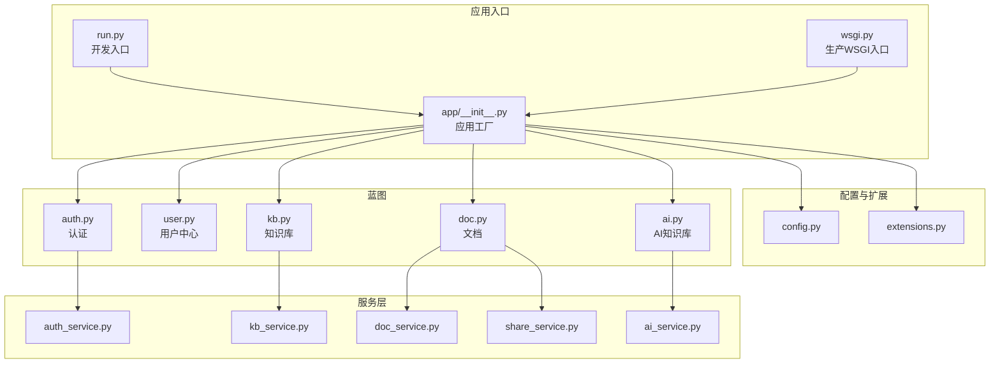
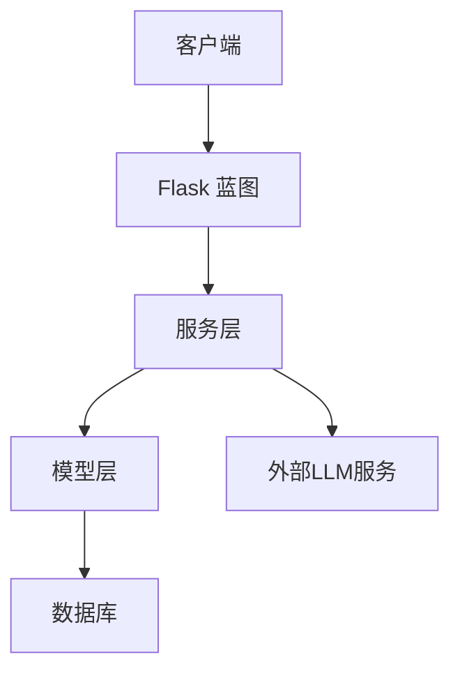
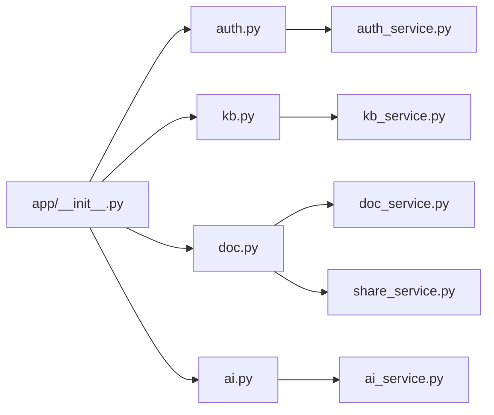

# API接口文档

<cite>
**本文档引用的文件**
- [app/__init__.py](file://app/__init__.py)
- [app/blueprints/auth.py](file://app/blueprints/auth.py)
- [app/blueprints/user.py](file://app/blueprints/user.py)
- [app/blueprints/kb.py](file://app/blueprints/kb.py)
- [app/blueprints/doc.py](file://app/blueprints/doc.py)
- [app/blueprints/ai.py](file://app/blueprints/ai.py)
- [app/services/auth_service.py](file://app/services/auth_service.py)
- [app/services/kb_service.py](file://app/services/kb_service.py)
- [app/services/doc_service.py](file://app/services/doc_service.py)
- [app/services/ai_service.py](file://app/services/ai_service.py)
- [app/services/share_service.py](file://app/services/share_service.py)
- [app/config.py](file://app/config.py)
- [app/extensions.py](file://app/extensions.py)
- [run.py](file://run.py)
- [wsgi.py](file://wsgi.py)
</cite>

## 目录
1. [简介](#简介)
2. [项目结构](#项目结构)
3. [核心组件](#核心组件)
4. [架构总览](#架构总览)
5. [详细组件分析](#详细组件分析)
6. [依赖关系分析](#依赖关系分析)
7. [性能考虑](#性能考虑)
8. [故障排除指南](#故障排除指南)
9. [结论](#结论)
10. [附录](#附录)

## 简介
本项目为“My Wiki”个人知识库系统，提供基于Flask的Web应用与RESTful API能力。本文档面向开发者与集成方，完整梳理所有REST API端点与WebSocket接口（如适用），覆盖用户认证、知识库管理、文档管理、AI知识库构建与聊天对话等模块。文档包含HTTP方法、URL模式、请求参数、响应格式、状态码说明、错误处理策略、认证机制、权限验证、数据验证规则、请求响应示例与客户端调用指南，并解释API版本控制、速率限制与安全考虑。

## 项目结构
后端采用Flask应用工厂模式，通过蓝图组织业务域，服务层封装业务逻辑，模型层定义数据结构，配置与扩展分别负责运行时配置与第三方集成。

图表来源
- [app/__init__.py:11-74](file://app/__init__.py#L11-L74)
- [run.py:1-17](file://run.py#L1-L17)
- [wsgi.py:1-10](file://wsgi.py#L1-L10)

章节来源
- [app/__init__.py:11-74](file://app/__init__.py#L11-L74)
- [run.py:1-17](file://run.py#L1-L17)
- [wsgi.py:1-10](file://wsgi.py#L1-L10)

## 核心组件
- 应用工厂与蓝图注册：应用工厂负责加载配置、注册扩展、注册蓝图与错误处理器。
- 认证服务：用户名/邮箱校验、密码校验、登录标记与验证码服务。
- 知识库服务：可见性判断、成员角色与权限、成员增删。
- 文档服务：树形结构查询、文档创建/更新/软删除、后代收集。
- AI知识库服务：LLM客户端封装、Wiki构建流程、链接解析、异步构建与重生成、聊天问答。
- 分享服务：分享令牌生成、有效期控制、撤销与访问计数。

章节来源
- [app/__init__.py:39-74](file://app/__init__.py#L39-L74)
- [app/services/auth_service.py:21-56](file://app/services/auth_service.py#L21-L56)
- [app/services/kb_service.py:10-80](file://app/services/kb_service.py#L10-L80)
- [app/services/doc_service.py:11-81](file://app/services/doc_service.py#L11-L81)
- [app/services/ai_service.py:47-86](file://app/services/ai_service.py#L47-L86)
- [app/services/share_service.py:15-49](file://app/services/share_service.py#L15-L49)

## 架构总览
系统采用分层架构：路由层（蓝图）负责HTTP请求处理与渲染；服务层封装业务规则与数据操作；模型层定义数据库实体；配置与扩展提供运行时环境与第三方集成。

图表来源
- [app/blueprints/auth.py:1-85](file://app/blueprints/auth.py#L1-L85)
- [app/blueprints/kb.py:1-141](file://app/blueprints/kb.py#L1-L141)
- [app/blueprints/doc.py:1-139](file://app/blueprints/doc.py#L1-L139)
- [app/blueprints/ai.py:1-279](file://app/blueprints/ai.py#L1-L279)
- [app/services/ai_service.py:47-86](file://app/services/ai_service.py#L47-L86)

## 详细组件分析

### 用户认证API
- 登录
  - 方法与路径：POST /auth/login
  - 请求参数：login（用户名或邮箱）、password、captcha、remember
  - 响应：成功跳转到仪表盘；失败返回表单并提示错误
  - 状态码：200 成功；400 验证码错误或无效；401 用户名或密码错误
  - 错误处理：验证码校验失败、认证失败时返回相应消息
- 注册
  - 方法与路径：POST /auth/register
  - 请求参数：username、email、password、password2、captcha
  - 响应：成功登录并跳转到仪表盘；失败返回表单并提示错误
  - 状态码：200 成功；400 参数校验失败或重复
  - 错误处理：用户名/邮箱重复、密码不一致、格式不正确
- 退出登录
  - 方法与路径：POST /auth/logout
  - 请求参数：无
  - 响应：重定向到登录页
  - 状态码：200
- 验证码
  - 方法与路径：GET /auth/captcha
  - 响应：PNG图像流，设置缓存头防止缓存
  - 状态码：200

章节来源
- [app/blueprints/auth.py:10-85](file://app/blueprints/auth.py#L10-L85)
- [app/services/auth_service.py:21-56](file://app/services/auth_service.py#L21-L56)

### 知识库管理API
- 列表知识库
  - 方法与路径：GET /kb/
  - 查询参数：tab（mine/public）
  - 响应：模板渲染知识库列表
  - 权限：登录用户
- 创建知识库
  - 方法与路径：POST /kb/new
  - 表单参数：name、description、visibility（PRIVATE/MEMBERS/PUBLIC）、icon
  - 响应：重定向到详情页
  - 权限：登录用户；校验名称必填
- 知识库详情
  - 方法与路径：GET /kb/{kb_id}
  - 响应：模板渲染详情与文档树
  - 权限：根据可见性与成员身份决定访问权限
- 编辑知识库
  - 方法与路径：POST /kb/{kb_id}/edit
  - 表单参数：name、description、visibility、icon
  - 响应：重定向回详情
  - 权限：仅管理员
- 删除知识库
  - 方法与路径：POST /kb/{kb_id}/delete
  - 响应：归档并重定向
  - 权限：仅管理员
- 成员管理
  - 添加成员
    - 方法与路径：POST /kb/{kb_id}/members
    - 表单参数：user（用户名或邮箱）、role（默认VIEWER）
    - 响应：重定向回成员页
    - 权限：仅管理员；禁止添加拥有者本人
  - 移除成员
    - 方法与路径：POST /kb/{kb_id}/members/{user_id}/delete
    - 响应：重定向回成员页
    - 权限：仅管理员

章节来源
- [app/blueprints/kb.py:21-141](file://app/blueprints/kb.py#L21-L141)
- [app/services/kb_service.py:10-80](file://app/services/kb_service.py#L10-L80)

### 文档管理API
- 新建文档
  - 方法与路径：POST /doc/new
  - 表单参数：kb_id、parent_id、type（DOC/NORMAL等枚举）、privacy（NORMAL/PRIVATE等枚举）、title
  - 响应：重定向到编辑页
  - 权限：具备编辑权限
- 查看文档
  - 方法与路径：GET /doc/{doc_id}
  - 响应：模板渲染文档与大纲
  - 权限：具备访问权限
- 编辑文档
  - 方法与路径：GET /doc/{doc_id}/edit
  - 响应：模板渲染编辑页
  - 权限：具备编辑权限
- 保存文档
  - 方法与路径：POST /doc/{doc_id}/save
  - 请求体JSON：title、content_json、privacy
  - 响应：JSON {ok, outline, updated_at}
  - 权限：具备编辑权限
- 删除文档
  - 方法与路径：POST /doc/{doc_id}/delete
  - 响应：批量软删除并重定向
  - 权限：具备编辑权限
- 分享文档
  - 方法与路径：GET/POST /doc/{doc_id}/share
  - 表单参数：password（可选）、ttl_hours（可选）
  - 响应：重定向回分享页
  - 权限：具备编辑权限；私密文档不可分享
- 撤销分享
  - 方法与路径：POST /doc/share/{share_id}/revoke
  - 响应：重定向回分享页
  - 权限：具备编辑权限

章节来源
- [app/blueprints/doc.py:20-139](file://app/blueprints/doc.py#L20-L139)
- [app/services/doc_service.py:11-81](file://app/services/doc_service.py#L11-L81)
- [app/services/share_service.py:15-49](file://app/services/share_service.py#L15-L49)

### AI知识库API
- 列表AI知识库
  - 方法与路径：GET /ai/
  - 响应：模板渲染AI知识库列表
  - 权限：登录用户
- 创建AI知识库
  - 方法与路径：POST /ai/new
  - 表单参数：name、description、chat_model（可选）、enable_rag（布尔）
  - 响应：重定向到详情页
  - 权限：登录用户；校验名称必填
- 详情页
  - 方法与路径：GET /ai/{ai_kb_id}
  - 响应：模板渲染来源、文章与红链统计
  - 权限：仅拥有者或超级管理员
- 编辑AI知识库
  - 方法与路径：POST /ai/{ai_kb_id}/edit
  - 表单参数：name、description、chat_model、enable_rag
  - 响应：重定向回详情
  - 权限：仅拥有者或超级管理员
- 删除AI知识库
  - 方法与路径：POST /ai/{ai_kb_id}/delete
  - 响应：删除并重定向
  - 权限：仅拥有者或超级管理员
- 来源管理
  - 查看来源
    - 方法与路径：GET /ai/{ai_kb_id}/sources
    - 响应：模板渲染可用文档列表
    - 权限：仅拥有者或超级管理员
  - 添加来源
    - 方法与路径：POST /ai/{ai_kb_id}/sources/add
    - 表单参数：doc_ids（多选）
    - 响应：重定向回来源页
    - 权限：仅拥有者或超级管理员
  - 移除来源
    - 方法与路径：POST /ai/{ai_kb_id}/sources/{source_id}/remove
    - 响应：重定向回来源页
    - 权限：仅拥有者或超级管理员
- 构建与状态
  - 启动构建
    - 方法与路径：POST /ai/{ai_kb_id}/build
    - 表单参数：scope（all/pending）
    - 响应：重定向回详情
    - 权限：仅拥有者或超级管理员
  - 获取状态
    - 方法与路径：GET /ai/{ai_kb_id}/status
    - 响应：JSON {status, error, last_built_at, sources, articles}
    - 权限：仅拥有者或超级管理员
- Wiki浏览
  - 首页
    - 方法与路径：GET /ai/{ai_kb_id}/wiki
    - 响应：模板渲染文章与标签分组
    - 权限：仅拥有者或超级管理员
  - 文章页
    - 方法与路径：GET /ai/{ai_kb_id}/wiki/{slug}
    - 响应：模板渲染文章HTML与反链
    - 权限：仅拥有者或超级管理员
  - 重生成文章
    - 方法与路径：POST /ai/{ai_kb_id}/wiki/{slug}/regenerate
    - 响应：重定向回文章页
    - 权限：仅拥有者或超级管理员
  - 图谱
    - 方法与路径：GET /ai/{ai_kb_id}/graph
    - 响应：模板渲染节点与边
    - 权限：仅拥有者或超级管理员
- 聊天对话（可选）
  - 方法与路径：GET/POST /ai/{ai_kb_id}/chat
  - GET：渲染聊天页
  - POST：表单参数 q（问题）
  - 响应：JSON {ok, answer 或 {ok, error}}
  - 权限：仅拥有者或超级管理员；当启用RAG时可进行向量检索增强

章节来源
- [app/blueprints/ai.py:27-279](file://app/blueprints/ai.py#L27-L279)
- [app/services/ai_service.py:313-408](file://app/services/ai_service.py#L313-L408)

### WebSocket接口
- 当前代码库未实现WebSocket接口。若未来需要实时聊天或构建进度推送，可在蓝图中新增WebSocket路由并通过Flask-SocketIO或类似方案接入。

[本节为概念性说明，不直接分析具体文件]

## 依赖关系分析

图表来源
- [app/__init__.py:56-74](file://app/__init__.py#L56-L74)
- [app/blueprints/auth.py:1-85](file://app/blueprints/auth.py#L1-L85)
- [app/blueprints/kb.py:1-141](file://app/blueprints/kb.py#L1-L141)
- [app/blueprints/doc.py:1-139](file://app/blueprints/doc.py#L1-L139)
- [app/blueprints/ai.py:1-279](file://app/blueprints/ai.py#L1-L279)

章节来源
- [app/__init__.py:56-74](file://app/__init__.py#L56-L74)

## 性能考虑
- 数据库连接池：SQLAlchemy引擎选项启用预检查与回收，减少连接失效导致的超时。
- 分页：默认分页大小由配置提供，建议前端分页加载列表数据。
- AI构建：采用后台线程异步执行，避免阻塞主线程；构建完成后更新状态供前端轮询。
- 文件存储：AI Wiki导出为本地Markdown文件，建议结合CDN或对象存储优化静态资源访问。
- 上传限制：最大内容长度由配置控制，防止大文件上传导致内存压力。

章节来源
- [app/config.py:23-26](file://app/config.py#L23-L26)
- [app/config.py:52-54](file://app/config.py#L52-L54)
- [app/services/ai_service.py:313-345](file://app/services/ai_service.py#L313-L345)

## 故障排除指南
- 403 Forbidden：权限不足或未登录访问受保护资源。
- 404 Not Found：知识库/文档不存在或已归档/删除。
- 401 Unauthorized：认证失败或会话失效。
- 500 Internal Server Error：服务器异常，检查日志与数据库连接。
- 常见错误
  - 注册失败：用户名/邮箱重复、密码长度不足、两次密码不一致。
  - 分享失败：私密文档不可分享、过期时间非法。
  - AI构建失败：源文档缺失、外部LLM不可用、线程异常。

章节来源
- [app/__init__.py:76-88](file://app/__init__.py#L76-L88)
- [app/services/auth_service.py:21-34](file://app/services/auth_service.py#L21-L34)
- [app/services/share_service.py:17-18](file://app/services/share_service.py#L17-L18)
- [app/services/ai_service.py:338-341](file://app/services/ai_service.py#L338-L341)

## 结论
本API文档覆盖了My Wiki的核心功能域，包括用户认证、知识库管理、文档管理与AI知识库构建与聊天。系统采用清晰的分层架构与严格的权限控制，支持异步构建与可选RAG增强。建议在生产环境中结合速率限制、CORS策略与安全头部进一步加固。

## 附录

### 认证机制与权限验证
- 认证方式：基于Flask-Login的会话认证，支持“记住我”。
- 权限模型：
  - 公共知识库：任意登录用户可访问。
  - 成员可见：仅成员可访问。
  - 私有知识库：仅拥有者可访问。
  - 编辑权限：拥有者或具有编辑角色的成员。
  - 管理权限：仅拥有者。
- 超级管理员：具备全局管理权限。

章节来源
- [app/services/kb_service.py:10-46](file://app/services/kb_service.py#L10-L46)

### 数据验证规则
- 用户名：2-32位，允许字母、数字、下划线与中文。
- 邮箱：标准邮箱格式。
- 密码：至少6位。
- 知识库名称：必填。
- 文档隐私：NORMAL/PRIVATE枚举。
- 可见性：PRIVATE/MEMBERS/PUBLIC枚举。

章节来源
- [app/services/auth_service.py:13-29](file://app/services/auth_service.py#L13-L29)
- [app/blueprints/kb.py:36-41](file://app/blueprints/kb.py#L36-L41)
- [app/blueprints/doc.py:34-36](file://app/blueprints/doc.py#L34-L36)

### 请求与响应示例（路径指引）
- 登录
  - 请求：POST /auth/login，表单字段 login、password、captcha、remember
  - 响应：重定向至仪表盘或返回表单错误
  - 参考路径：[app/blueprints/auth.py:51-77](file://app/blueprints/auth.py#L51-L77)
- 注册
  - 请求：POST /auth/register，表单字段 username、email、password、password2、captcha
  - 响应：重定向至仪表盘或返回表单错误
  - 参考路径：[app/blueprints/auth.py:19-48](file://app/blueprints/auth.py#L19-L48)
- 创建知识库
  - 请求：POST /kb/new，表单字段 name、description、visibility、icon
  - 响应：重定向至详情页
  - 参考路径：[app/blueprints/kb.py:32-54](file://app/blueprints/kb.py#L32-L54)
- 保存文档
  - 请求：POST /doc/{doc_id}/save，JSON {title, content_json, privacy}
  - 响应：{"ok": true, "outline": [...], "updated_at": "iso8601"}
  - 参考路径：[app/blueprints/doc.py:69-84](file://app/blueprints/doc.py#L69-L84)
- AI知识库构建状态
  - 请求：GET /ai/{ai_kb_id}/status
  - 响应：{"status": "...", "error": "...", "last_built_at": "...", "sources": {...}, "articles": N}
  - 参考路径：[app/blueprints/ai.py:159-174](file://app/blueprints/ai.py#L159-L174)

### 安全与部署
- Cookie与会话：HttpOnly、SameSite=Lax；记住我持续时间可配置。
- 上传限制：MAX_CONTENT_LENGTH限制请求体大小。
- CSRF保护：启用CSRF扩展。
- 生产部署：通过WSGI入口启动，读取环境变量选择配置。

章节来源
- [app/config.py:28-36](file://app/config.py#L28-L36)
- [app/config.py:60-67](file://app/config.py#L60-L67)
- [app/__init__.py:39-44](file://app/__init__.py#L39-L44)
- [wsgi.py:1-10](file://wsgi.py#L1-L10)