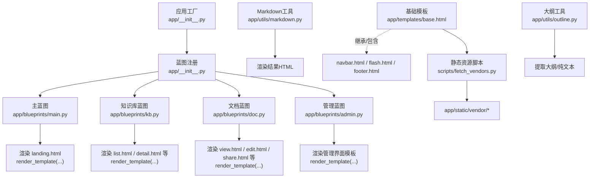
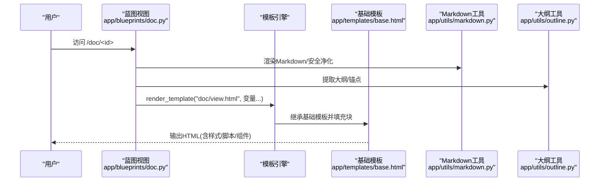
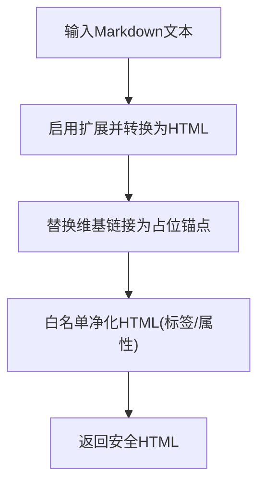
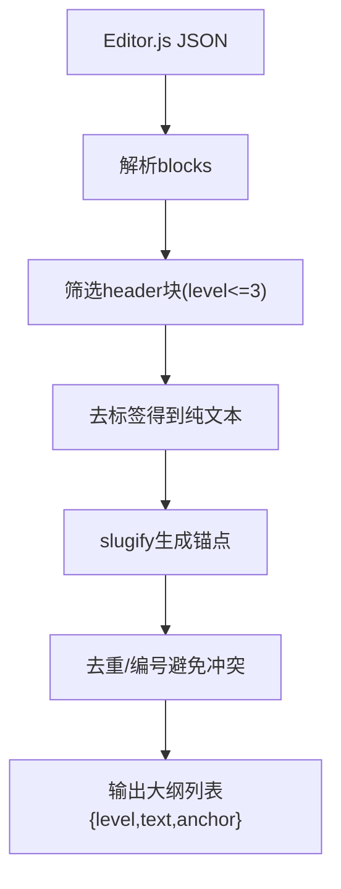
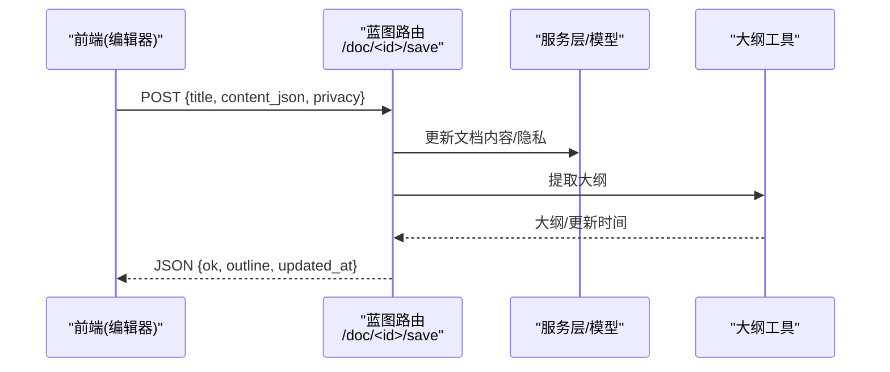
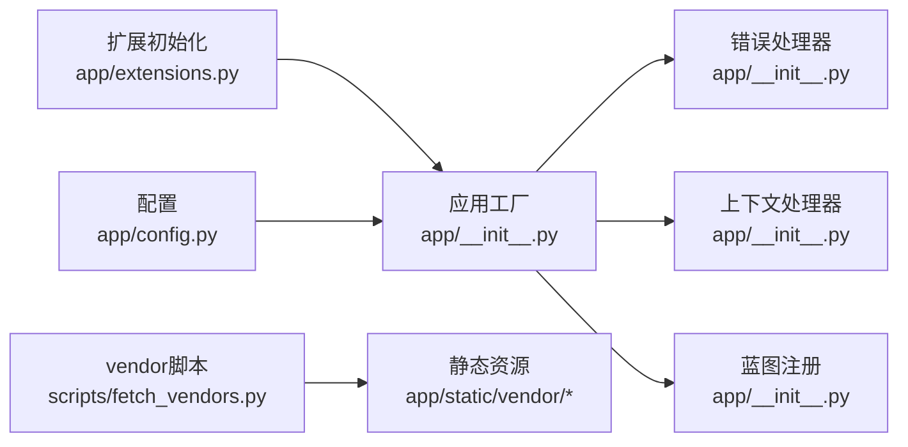

# 前端模板系统

<cite>
**本文引用的文件**
- [app/templates/base.html](file://app/templates/base.html)
- [app/utils/markdown.py](file://app/utils/markdown.py)
- [app/utils/outline.py](file://app/utils/outline.py)
- [app/blueprints/main.py](file://app/blueprints/main.py)
- [app/blueprints/doc.py](file://app/blueprints/doc.py)
- [app/blueprints/kb.py](file://app/blueprints/kb.py)
- [app/blueprints/admin.py](file://app/blueprints/admin.py)
- [app/__init__.py](file://app/__init__.py)
- [app/extensions.py](file://app/extensions.py)
- [app/config.py](file://app/config.py)
- [scripts/fetch_vendors.py](file://scripts/fetch_vendors.py)
</cite>

## 目录
1. [简介](#简介)
2. [项目结构](#项目结构)
3. [核心组件](#核心组件)
4. [架构总览](#架构总览)
5. [详细组件分析](#详细组件分析)
6. [依赖分析](#依赖分析)
7. [性能考虑](#性能考虑)
8. [故障排查指南](#故障排查指南)
9. [结论](#结论)
10. [附录](#附录)

## 简介
本文件系统化梳理 My Wiki 的前端模板体系，重点覆盖：
- Jinja2 模板结构与继承机制
- 基础模板 base.html 的区块设计与组件嵌入
- 页面模板的布局与内容区块组织
- Markdown 渲染引擎集成与安全策略
- 文档大纲生成与导航菜单实现
- 响应式设计与样式规范
- 模板变量传递、过滤器使用与宏定义建议
- 前后端数据交互模式与 AJAX 请求处理
- 浏览器兼容性、性能优化与可访问性考虑

## 项目结构
模板系统位于 app/templates，当前仓库仅包含基础模板 base.html；页面模板由各蓝图在 render_template 中指定。静态资源通过 url_for 引入，第三方库通过脚本统一拉取至 app/static/vendor。

图表来源
- [app/__init__.py:56-74](file://app/__init__.py#L56-L74)
- [app/blueprints/main.py:10-15](file://app/blueprints/main.py#L10-L15)
- [app/blueprints/kb.py:21-72](file://app/blueprints/kb.py#L21-L72)
- [app/blueprints/doc.py:43-66](file://app/blueprints/doc.py#L43-L66)
- [app/blueprints/admin.py:24-33](file://app/blueprints/admin.py#L24-L33)
- [app/templates/base.html:16-25](file://app/templates/base.html#L16-L25)
- [app/utils/markdown.py:31-39](file://app/utils/markdown.py#L31-L39)
- [app/utils/outline.py:34-55](file://app/utils/outline.py#L34-L55)
- [scripts/fetch_vendors.py:23-62](file://scripts/fetch_vendors.py#L23-L62)

章节来源
- [app/__init__.py:56-74](file://app/__init__.py#L56-L74)
- [app/templates/base.html:1-29](file://app/templates/base.html#L1-L29)
- [scripts/fetch_vendors.py:23-62](file://scripts/fetch_vendors.py#L23-L62)

## 核心组件
- 基础模板 base.html：定义全局 HTML 结构、样式与脚本引入、CSRF 元信息、块级占位符与组件包含点。
- 上下文注入器：向所有模板注入站点名等全局变量。
- Markdown 渲染工具：负责 Markdown 转换、扩展启用、HTML 安全净化与维基链接替换。
- 大纲提取工具：从 Editor.js JSON 内容中抽取标题层级、锚点与纯文本摘要。
- 静态资源管理：通过脚本集中拉取第三方库，确保离线可用与缓存友好。

章节来源
- [app/templates/base.html:1-29](file://app/templates/base.html#L1-L29)
- [app/__init__.py:90-95](file://app/__init__.py#L90-L95)
- [app/utils/markdown.py:31-66](file://app/utils/markdown.py#L31-L66)
- [app/utils/outline.py:34-55](file://app/utils/outline.py#L34-L55)
- [scripts/fetch_vendors.py:23-62](file://scripts/fetch_vendors.py#L23-L62)

## 架构总览
模板系统遵循“基础模板 + 页面模板”的继承模式，页面模板通过 render_template 注入上下文变量，再由基础模板统一渲染输出。Markdown 与大纲工具在蓝图视图中被调用，为页面模板提供渲染后的 HTML 与导航信息。

图表来源
- [app/blueprints/doc.py:43-55](file://app/blueprints/doc.py#L43-L55)
- [app/utils/markdown.py:31-39](file://app/utils/markdown.py#L31-L39)
- [app/utils/outline.py:34-55](file://app/utils/outline.py#L34-L55)
- [app/templates/base.html:16-25](file://app/templates/base.html#L16-L25)

## 详细组件分析

### 基础模板 base.html
- 结构与继承
  - 使用块占位符组织页面：title、head_extra、layout、content、body_extra。
  - 通过 include 将 navbar、flash、footer 组件拼装进主体布局。
- 样式与脚本
  - 引入字体、TailwindCSS、高亮主题与自定义样式。
  - 引入 Alpine.js 作为轻量前端交互框架。
- 安全与元信息
  - 注入 CSRF Token，供表单提交时携带。
  - 设置 viewport 与语言属性，支持响应式设计。
- 响应式设计
  - 使用 Tailwind 的 flex 与 min-h-full 实现主容器纵向铺满与内容自适应。

章节来源
- [app/templates/base.html:1-29](file://app/templates/base.html#L1-L29)

### Markdown 渲染引擎集成
- 扩展启用
  - 启用 extra、sane_lists、tables、fenced_code、toc、nl2br 等扩展，满足技术文档常见需求。
- 安全净化
  - 基于 bleach 对 HTML 进行白名单过滤，限制标签与属性，防止 XSS。
- 维基链接替换
  - 将 [[目标|显示]] 形式的维基链接转换为路由占位或红色链接，便于后续路由层改写为真实 URL。
- 返回格式
  - 输出 HTML5 格式字符串，供模板直接渲染。

图表来源
- [app/utils/markdown.py:31-39](file://app/utils/markdown.py#L31-L39)
- [app/utils/markdown.py:42-66](file://app/utils/markdown.py#L42-L66)

章节来源
- [app/utils/markdown.py:1-87](file://app/utils/markdown.py#L1-L87)

### 文档大纲生成与导航菜单
- 大纲提取
  - 从 Editor.js JSON blocks 中提取 H1-H3 标题，生成带锚点的层级列表，用于侧边导航或目录索引。
- 纯文本与 Markdown 转换
  - 支持将 Editor.js 内容转为纯文本与简化 Markdown，便于搜索与 AI 使用。
- 在蓝图中的使用
  - 视图中调用提取函数，将大纲作为模板变量传入，页面模板据此渲染导航菜单。

图表来源
- [app/utils/outline.py:22-55](file://app/utils/outline.py#L22-L55)

章节来源
- [app/utils/outline.py:1-136](file://app/utils/outline.py#L1-L136)
- [app/blueprints/doc.py:49-55](file://app/blueprints/doc.py#L49-L55)

### 页面模板与布局设计
- 主页/仪表盘重定向
  - 未登录用户访问根路径时渲染 landing 页面；登录后重定向至用户仪表盘。
- 知识库详情页
  - 展示知识库树形结构与默认打开的首篇文档，控制编辑/管理权限。
- 文档视图/编辑页
  - 视图页渲染文档内容与大纲；编辑页提供 Editor.js 编辑器与保存接口。
- 分享页
  - 生成/撤销分享链接，受权限控制。

章节来源
- [app/blueprints/main.py:10-15](file://app/blueprints/main.py#L10-L15)
- [app/blueprints/kb.py:56-72](file://app/blueprints/kb.py#L56-L72)
- [app/blueprints/doc.py:43-66](file://app/blueprints/doc.py#L43-L66)
- [app/blueprints/doc.py:103-124](file://app/blueprints/doc.py#L103-L124)

### 模板变量传递、过滤器与宏定义
- 变量传递
  - 蓝图通过 render_template 传入 doc、kb、tree、outline、can_edit、can_manage、public_kbs 等变量。
- 过滤器
  - 模板中可使用 Jinja2 内置过滤器（如 safe、default、urlencode 等），也可在应用工厂中注册自定义过滤器。
- 宏定义
  - 可在公共模板中定义宏，复用按钮、表单控件、列表项等 UI 片段，减少重复代码。

章节来源
- [app/blueprints/doc.py:51-54](file://app/blueprints/doc.py#L51-L54)
- [app/blueprints/kb.py:68-72](file://app/blueprints/kb.py#L68-L72)
- [app/blueprints/main.py:14](file://app/blueprints/main.py#L14)

### 前后端数据交互与 AJAX 请求
- 表单提交
  - 新建文档、编辑知识库成员、发布/下架等操作采用 POST 表单提交，蓝图处理后重定向。
- AJAX 保存
  - 文档保存接口接收 JSON 负载，更新内容与隐私设置，并返回大纲与更新时间，用于前端即时刷新。
- 权限控制
  - 蓝图在进入编辑/管理相关路由前进行权限校验，未授权返回 403。

图表来源
- [app/blueprints/doc.py:69-84](file://app/blueprints/doc.py#L69-L84)
- [app/utils/outline.py:34-55](file://app/utils/outline.py#L34-L55)

章节来源
- [app/blueprints/doc.py:69-84](file://app/blueprints/doc.py#L69-L84)

### 组件设计与样式规范
- 组件嵌入
  - 基础模板通过 include 引入 navbar、flash、footer，形成一致的头部、消息提示与底部布局。
- 样式规范
  - 字体：Inter；UI 框架：TailwindCSS；代码高亮：highlight.js GitHub 主题。
  - 颜色方案：使用 Tailwind 的 slate 系列，保证浅色背景与文本对比度。
- 响应式设计
  - 使用 flex 布局与 min-h-full，使内容区域随内容增长而撑开，同时保持页脚贴底。

章节来源
- [app/templates/base.html:8-11](file://app/templates/base.html#L8-L11)
- [app/templates/base.html:17-24](file://app/templates/base.html#L17-L24)
- [scripts/fetch_vendors.py:23-62](file://scripts/fetch_vendors.py#L23-L62)

## 依赖分析
- 应用工厂与蓝图
  - 应用工厂注册 CSRF、登录管理、数据库与迁移等扩展，并注册各蓝图。
  - 错误处理器统一渲染错误页面模板。
- 模板上下文
  - 上下文处理器向所有模板注入站点名等全局变量。
- 静态资源
  - 第三方库通过脚本一次性拉取至 vendor 目录，避免运行时网络依赖。

图表来源
- [app/extensions.py:8-11](file://app/extensions.py#L8-L11)
- [app/__init__.py:39-53](file://app/__init__.py#L39-L53)
- [app/__init__.py:76-87](file://app/__init__.py#L76-L87)
- [app/__init__.py:90-95](file://app/__init__.py#L90-L95)
- [scripts/fetch_vendors.py:74-92](file://scripts/fetch_vendors.py#L74-L92)

章节来源
- [app/extensions.py:1-16](file://app/extensions.py#L1-L16)
- [app/__init__.py:39-53](file://app/__init__.py#L39-L53)
- [app/__init__.py:76-87](file://app/__init__.py#L76-L87)
- [app/__init__.py:90-95](file://app/__init__.py#L90-L95)
- [scripts/fetch_vendors.py:74-92](file://scripts/fetch_vendors.py#L74-L92)

## 性能考虑
- 静态资源优化
  - 使用压缩版 CSS/JS，结合 CDN 缓存与本地 vendor 目录，减少加载时间。
- 模板渲染
  - 将计算密集型逻辑（如 Markdown 渲染、大纲提取）放在蓝图层，模板仅做展示，降低模板复杂度。
- 分页与查询
  - 使用分页助手限制查询规模，避免一次性加载过多数据。
- 前端交互
  - 利用 Alpine.js 实现轻量前端行为，避免引入重型框架导致体积膨胀。

章节来源
- [scripts/fetch_vendors.py:23-62](file://scripts/fetch_vendors.py#L23-L62)
- [app/utils/markdown.py:31-39](file://app/utils/markdown.py#L31-L39)
- [app/utils/outline.py:34-55](file://app/utils/outline.py#L34-L55)
- [app/utils/pagination.py:5-9](file://app/utils/pagination.py#L5-L9)

## 故障排查指南
- 403/404/500 错误页面
  - 应用工厂已注册错误处理器，统一渲染对应错误模板。
- CSRF 校验失败
  - 确认基础模板中已注入 CSRF Token，并在表单中正确携带。
- Markdown 渲染异常
  - 检查 Markdown 扩展是否启用，以及 bleach 白名单是否覆盖所需标签/属性。
- 大纲为空
  - 确认 Editor.js JSON 结构正确，且包含 header 类型块；检查 slugify 与锚点生成逻辑。

章节来源
- [app/__init__.py:76-87](file://app/__init__.py#L76-L87)
- [app/templates/base.html:6](file://app/templates/base.html#L6)
- [app/utils/markdown.py:10-25](file://app/utils/markdown.py#L10-L25)
- [app/utils/outline.py:22-31](file://app/utils/outline.py#L22-L31)

## 结论
My Wiki 的模板系统以基础模板为核心，配合蓝图层的数据准备与工具层的渲染/提取能力，实现了清晰的职责分离与良好的可维护性。通过 Markdown 与大纲工具、响应式样式与轻量前端交互，系统在功能与体验上达到平衡。建议后续完善页面模板与组件宏定义，进一步提升可复用性与一致性。

## 附录
- 模板变量清单（示例）
  - 全局：site_name
  - 文档视图：doc、kb、tree、outline、can_edit、can_manage
  - 知识库列表：kbs、tab
  - 管理统计：stats
  - 主页：public_kbs
- 建议
  - 在基础模板中预留更多块位（如 head_extra/body_extra），便于页面级定制。
  - 在应用工厂中注册常用过滤器与全局宏，减少模板重复代码。
  - 对热点页面增加缓存策略（如基于 ETag 或片段缓存）。