# 前端模板系统

<cite>
**本文引用的文件**
- [app/templates/base.html](file://app/templates/base.html)
- [app/templates/components/flash.html](file://app/templates/components/flash.html)
- [app/templates/components/navbar.html](file://app/templates/components/navbar.html)
- [app/templates/components/footer.html](file://app/templates/components/footer.html)
- [app/templates/main/landing.html](file://app/templates/main/landing.html)
- [app/templates/user/dashboard.html](file://app/templates/user/dashboard.html)
- [app/templates/kb/list.html](file://app/templates/kb/list.html)
- [app/templates/kb/detail.html](file://app/templates/kb/detail.html)
- [app/templates/doc/edit.html](file://app/templates/doc/edit.html)
- [app/templates/doc/view.html](file://app/templates/doc/view.html)
- [app/templates/auth/login.html](file://app/templates/auth/login.html)
- [app/templates/share/view.html](file://app/templates/share/view.html)
- [app/templates/ai/index.html](file://app/templates/ai/index.html)
- [app/templates/ai/detail.html](file://app/templates/ai/detail.html)
- [app/templates/ai/edit.html](file://app/templates/ai/edit.html)
- [app/templates/ai/sources.html](file://app/templates/ai/sources.html)
- [app/templates/ai/new.html](file://app/templates/ai/new.html)
- [app/templates/ai/wiki_home.html](file://app/templates/ai/wiki_home.html)
- [app/templates/ai/wiki_article.html](file://app/templates/ai/wiki_article.html)
- [app/templates/ai/chat.html](file://app/templates/ai/chat.html)
- [app/blueprints/main.py](file://app/blueprints/main.py)
- [app/blueprints/search.py](file://app/blueprints/search.py)
- [app/blueprints/ai.py](file://app/blueprints/ai.py)
- [app/utils/markdown.py](file://app/utils/markdown.py)
- [app/utils/outline.py](file://app/utils/outline.py)
- [app/services/doc_service.py](file://app/services/doc_service.py)
- [app/services/ai_service.py](file://app/services/ai_service.py)
- [app/models/ai_kb.py](file://app/models/ai_kb.py)
- [app/__init__.py](file://app/__init__.py)
- [app/extensions.py](file://app/extensions.py)
- [app/config.py](file://app/config.py)
- [app/static/css/app.css](file://app/static/css/app.css)
- [app/static/js/app.js](file://app/static/js/app.js)
- [app/static/vendor/js/alpine.min.js](file://app/static/vendor/js/alpine.min.js)
- [app/models/document.py](file://app/models/document.py)
- [scripts/fetch_vendors.py](file://scripts/fetch_vendors.py)
- [app/static/vendor/js/xspreadsheet.js](file://app/static/vendor/js/xspreadsheet.js)
</cite>

## 更新摘要
**所做更改**
- 新增AI知识库功能模块：完整的AI知识库管理系统，包括知识库创建、编辑、删除和状态管理
- 新增AI知识库编辑页面：支持名称、描述、聊天模型配置和RAG增强开关
- 改进源文档管理界面：新增外部文件上传功能，支持PDF、Word、文本、图片等多种格式
- 上传功能用户界面：集成Alpine.js实现的文件上传队列管理和进度反馈
- AI知识库详情页面：展示构建状态、源文档列表、Wiki条目和关系图功能
- Wiki浏览和对话功能：支持标签分组浏览、文章详情、反向链接和AI对话
- 完整的AI知识库数据模型：支持文档关联、上传文件、文章生成和链接解析
- 异步构建管道：支持后台异步处理源文档并生成Wiki条目

## 目录
1. [简介](#简介)
2. [项目结构](#项目结构)
3. [核心组件](#核心组件)
4. [架构总览](#架构总览)
5. [详细组件分析](#详细组件分析)
6. [依赖分析](#依赖分析)
7. [性能考虑](#性能考虑)
8. [故障排查指南](#故障排查指南)
9. [结论](#结论)
10. [附录](#附录)

## 简介
本文件系统化梳理 My Wiki 的前端模板体系，重点覆盖：
- Jinja2 模板结构与继承机制
- 基础模板 base.html 的区块设计与组件嵌入
- 页面模板的布局与内容区块组织
- **更新** 新增AI知识库功能模块：完整的AI知识库管理系统，包括知识库创建、编辑、删除和状态管理
- **更新** 新增AI知识库编辑页面：支持名称、描述、聊天模型配置和RAG增强开关
- **更新** 改进源文档管理界面：新增外部文件上传功能，支持PDF、Word、文本、图片等多种格式
- **更新** 上传功能用户界面：集成Alpine.js实现的文件上传队列管理和进度反馈
- **更新** AI知识库详情页面：展示构建状态、源文档列表、Wiki条目和关系图功能
- **更新** Wiki浏览和对话功能：支持标签分组浏览、文章详情、反向链接和AI对话
- **更新** 完整的AI知识库数据模型：支持文档关联、上传文件、文章生成和链接解析
- **更新** 异步构建管道：支持后台异步处理源文档并生成Wiki条目
- Excel/Spreadsheet在线表格编辑器集成与配置
- 条件渲染逻辑处理两种编辑模式（文档vs表格）
- JavaScript初始化代码支持新的编辑器
- 内容存储格式从Editor.js JSON迁移到Markdown格式
- 高级动画Flash通知系统与交互式卡片设计
- Markdown 渲染引擎集成与安全策略
- 文档大纲生成与导航菜单实现
- 响应式设计与样式规范
- 模板变量传递、过滤器使用与宏定义建议
- 前后端数据交互模式与 AJAX 请求处理
- 浏览器兼容性、性能优化与可访问性考虑

## 项目结构
模板系统位于 app/templates，当前仓库包含基础模板 base.html、组件模板和页面模板；页面模板由各蓝图在 render_template 中指定。新增的AI知识库模板位于 app/templates/ai 目录下，包含完整的AI功能页面。静态资源通过 url_for 引入，第三方库通过脚本统一拉取至 app/static/vendor。

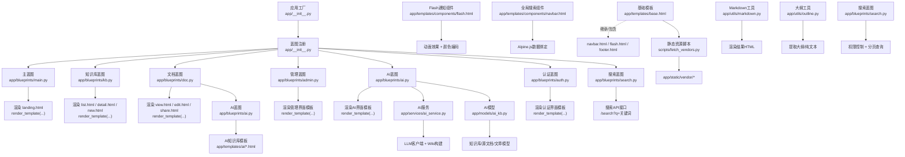

**图表来源**
- [app/__init__.py:56-74](file://app/__init__.py#L56-L74)
- [app/blueprints/main.py:10-15](file://app/blueprints/main.py#L10-L15)
- [app/blueprints/kb.py:21-72](file://app/blueprints/kb.py#L21-L72)
- [app/blueprints/doc.py:43-66](file://app/blueprints/doc.py#L43-L66)
- [app/blueprints/admin.py:24-33](file://app/blueprints/admin.py#L24-L33)
- [app/blueprints/ai.py:20-395](file://app/blueprints/ai.py#L20-L395)
- [app/blueprints/auth.py:25-48](file://app/blueprints/auth.py#L25-L48)
- [app/blueprints/search.py:11-13](file://app/blueprints/search.py#L11-L13)
- [app/templates/base.html:16-25](file://app/templates/base.html#L16-L25)
- [app/templates/components/flash.html:1-35](file://app/templates/components/flash.html#L1-35)
- [app/templates/components/navbar.html:22-72](file://app/templates/components/navbar.html#L22-L72)
- [app/templates/kb/detail.html:25-76](file://app/templates/kb/detail.html#L25-L76)
- [app/utils/markdown.py:31-39](file://app/utils/markdown.py#L31-L39)
- [app/utils/outline.py:34-55](file://app/utils/outline.py#L34-L55)
- [scripts/fetch_vendors.py:51-60](file://scripts/fetch_vendors.py#L51-L60)

**章节来源**
- [app/__init__.py:56-74](file://app/__init__.py#L56-L74)
- [app/templates/base.html:1-29](file://app/templates/base.html#L1-L29)
- [scripts/fetch_vendors.py:51-60](file://scripts/fetch_vendors.py#L51-L60)

## 核心组件
- 基础模板 base.html：定义全局 HTML 结构、样式与脚本引入、CSRF 元信息、块级占位符与组件包含点。
- Excel/Spreadsheet在线表格编辑器：提供Excel-like在线表格编辑体验，支持单元格操作、公式计算和数据验证。
- 条件渲染逻辑：通过doc.type判断文档类型，动态加载对应的编辑器和样式资源。
- Toast UI Editor富文本编辑器：提供WYSIWYG可视化编辑体验，支持Markdown语法和实时预览。
- **更新** AI知识库功能模块：完整的AI知识库管理系统，包括创建、编辑、删除、状态管理和异步构建
- **更新** AI知识库编辑页面：支持名称、描述、聊天模型配置和RAG增强开关的表单界面
- **更新** 源文档管理界面：支持从现有知识库选择文档和上传外部文件的综合管理界面
- **更新** 上传功能用户界面：集成Alpine.js实现的文件上传队列管理、进度反馈和批量操作
- **更新** AI知识库详情页面：展示构建状态、源文档列表、Wiki条目、关系图和对话功能的综合界面
- **更新** Wiki浏览和对话功能：支持标签分组浏览、文章详情、反向链接和AI对话的完整功能
- **更新** 完整的AI知识库数据模型：支持文档关联、上传文件、文章生成和链接解析的数据库结构
- **更新** 异步构建管道：支持后台异步处理源文档并生成Wiki条目的完整流程
- 上下文注入器：向所有模板注入站点名等全局变量。
- 内容存储格式：从Editor.js JSON格式迁移到Markdown格式，数据库字段content_json实际存储Markdown字符串。
- Markdown 渲染工具：负责 Markdown 转换、扩展启用、HTML 安全净化与维基链接替换。
- 大纲提取工具：从 Markdown 内容中抽取标题层级、锚点与纯文本摘要。
- 静态资源管理：通过脚本集中拉取第三方库，确保离线可用与缓存友好。

**章节来源**
- [app/templates/base.html:1-29](file://app/templates/base.html#L1-L29)
- [app/templates/doc/edit.html:35-44](file://app/templates/doc/edit.html#L35-L44)
- [app/templates/components/flash.html:1-35](file://app/templates/components/flash.html#L1-L35)
- [app/templates/components/navbar.html:22-72](file://app/templates/components/navbar.html#L22-L72)
- [app/blueprints/search.py:11-13](file://app/blueprints/search.py#L11-L13)
- [app/__init__.py:90-95](file://app/__init__.py#L90-L95)
- [app/utils/markdown.py:31-66](file://app/utils/markdown.py#L31-L66)
- [app/utils/outline.py:1-9](file://app/utils/outline.py#L1-L9)
- [scripts/fetch_vendors.py:51-60](file://scripts/fetch_vendors.py#L51-L60)

## 架构总览
模板系统遵循"基础模板 + 页面模板"的继承模式，页面模板通过 render_template 注入上下文变量，再由基础模板统一渲染输出。Excel/Spreadsheet在线表格编辑器提供Excel-like在线表格编辑体验，条件渲染逻辑通过doc.type判断文档类型，动态加载对应的编辑器。内容存储格式从Editor.js迁移到Markdown格式。**更新** 通过引入全局搜索功能，显著提升了文档检索体验。**更新** 通过Alpine.js实现的实时搜索组件，提供流畅的用户体验。**更新** 通过搜索API的权限控制和分页机制，确保系统的安全性和性能。**更新** 通过键盘快捷键支持，进一步优化用户交互效率。**更新** 通过搜索结果的丰富信息展示，帮助用户快速定位目标文档。**更新** 通过文档查看界面优化，显著提升了文档浏览体验。**更新** 通过break-words、flex items-start、gap-4、whitespace-nowrap等样式改进，优化了界面布局和显示效果。**更新** 新增AI知识库功能模块，提供完整的AI知识库管理能力。**更新** 通过AI蓝图和AI服务的集成，实现从源文档到Wiki条目的自动化处理。**更新** 通过异步构建管道，支持后台处理大规模文档转换任务。Markdown 与大纲工具在蓝图视图中被调用，为页面模板提供渲染后的 HTML 与导航信息。

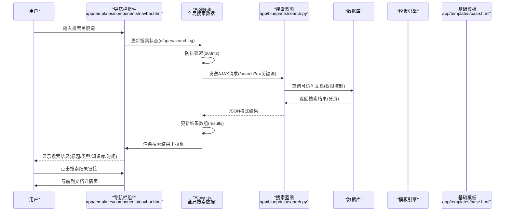

**图表来源**
- [app/templates/components/navbar.html:103-142](file://app/templates/components/navbar.html#L103-L142)
- [app/blueprints/search.py:11-13](file://app/blueprints/search.py#L11-L13)
- [app/blueprints/search.py:24-29](file://app/blueprints/search.py#L24-L29)
- [app/blueprints/search.py:70-107](file://app/blueprints/search.py#L70-L107)

## 详细组件分析

### 基础模板 base.html
- 结构与继承
  - 使用块占位符组织页面：title、head_extra、layout、content、body_extra。
  - 通过 include 将 navbar、flash、footer 组件拼装进主体布局。
- 样式与脚本
  - 引入字体、TailwindCSS、高亮主题与自定义样式。
  - 引入 Alpine.js 作为轻量前端交互框架。
- 安全与元信息
  - 注入 CSRF Token，供表单提交时携带。
  - 设置 viewport 与语言属性，支持响应式设计。
- 响应式设计
  - 使用 Tailwind 的 flex 与 min-h-full 实现主容器纵向铺满与内容自适应。

**章节来源**
- [app/templates/base.html:1-29](file://app/templates/base.html#L1-L29)

### AI知识库功能模块
**更新** 新增完整的AI知识库功能模块，提供从源文档到Wiki条目的自动化处理能力：

- **功能架构**
  - 知识库管理：创建、编辑、删除AI知识库，配置聊天模型和RAG增强
  - 源文档管理：从现有知识库选择文档或上传外部文件
  - Wiki构建：异步处理源文档，生成Markdown格式的Wiki条目
  - 关系解析：自动解析双链引用，建立文章间的双向链接
  - 对话功能：支持基于Wiki内容的AI问答，支持纯文本和RAG增强模式

- **数据模型**
  - AIKnowledgeBase：知识库基本信息和状态管理
  - AIKBSource：源文档关联，支持文档关联和文件上传两种类型
  - AIKBArticle：Wiki条目，包含标题、别名、标签、内容等
  - AIKBLink：文章间链接关系，支持红链检测
  - AIKBChunk：可选的向量化内容，用于RAG增强

- **异步处理**
  - 后台线程处理源文档转换，避免阻塞主线程
  - 支持增量构建，仅处理待处理或失败的源文档
  - 实时状态更新，用户可监控构建进度

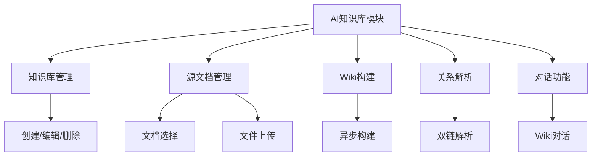

**图表来源**
- [app/blueprints/ai.py:32-395](file://app/blueprints/ai.py#L32-L395)
- [app/models/ai_kb.py:23-146](file://app/models/ai_kb.py#L23-L146)
- [app/services/ai_service.py:467-585](file://app/services/ai_service.py#L467-L585)

**章节来源**
- [app/blueprints/ai.py:1-395](file://app/blueprints/ai.py#L1-L395)
- [app/models/ai_kb.py:1-146](file://app/models/ai_kb.py#L1-L146)
- [app/services/ai_service.py:1-585](file://app/services/ai_service.py#L1-L585)

### AI知识库编辑页面
**更新** 新增AI知识库编辑页面，提供完整的知识库配置界面：

- **页面结构**
  - 标题区域：显示"编辑 AI 知识库"标题和返回链接
  - 基本信息表单：名称、描述、聊天模型配置
  - 高级设置：RAG增强开关和危险操作区域
  - 保存和取消按钮：标准的表单操作界面

- **表单字段**
  - 名称：必填字段，限制80字符
  - 描述：可选字段，限制500字符
  - 聊天模型：支持留空使用全局默认配置
  - RAG增强：可选开关，需要服务端ENABLE_RAG配置

- **交互功能**
  - Alpine.js数据绑定，实时验证表单状态
  - CSRF令牌保护，确保表单安全提交
  - 危险操作确认，防止误删知识库

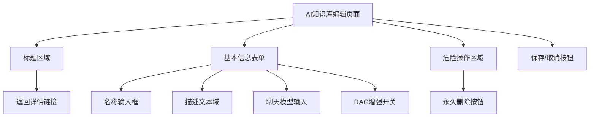

**图表来源**
- [app/templates/ai/edit.html:1-55](file://app/templates/ai/edit.html#L1-L55)

**章节来源**
- [app/templates/ai/edit.html:1-55](file://app/templates/ai/edit.html#L1-L55)

### 源文档管理界面
**更新** 改进源文档管理界面，新增外部文件上传功能：

- **上传区域设计**
  - 标题和说明：显示"上传外部文件"和格式支持信息
  - 文件选择器：支持多文件选择，限制PDF/Word/文本/图片格式
  - 文件队列：Alpine.js管理的文件列表，支持逐个删除和批量清空
  - 上传按钮：禁用状态根据文件数量动态调整

- **文件队列管理**
  - Alpine.js数据结构：items数组存储文件信息
  - 文件信息：包含文件名、大小、唯一ID
  - 操作功能：删除单个文件、清空所有文件
  - 格式化显示：字节大小转换为KB/MB格式

- **文档选择区域**
  - 知识库分组：按原始知识库分组显示可选文档
  - 文档列表：支持勾选加入的文档，已加入的文档禁用
  - 统计信息：显示可加入数量和总数
  - 批量操作：勾选后一键加入选中文档

- **交互功能**
  - 实时文件数量统计
  - 禁用状态管理
  - 错误处理和用户反馈
  - 权限控制和访问验证

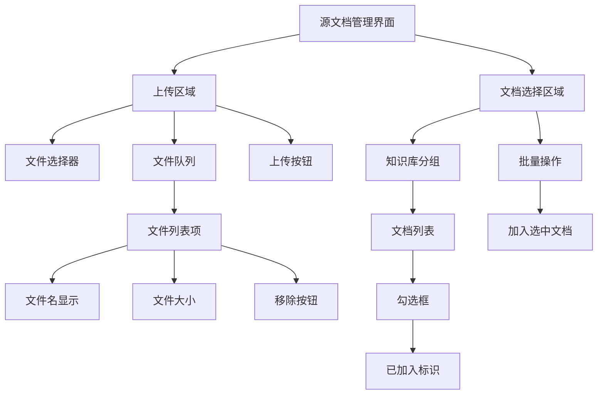

**图表来源**
- [app/templates/ai/sources.html:19-149](file://app/templates/ai/sources.html#L19-L149)

**章节来源**
- [app/templates/ai/sources.html:1-149](file://app/templates/ai/sources.html#L1-L149)

### AI知识库详情页面
**更新** 新增AI知识库详情页面，展示完整的知识库状态和管理功能：

- **页面布局**
  - 标题区域：知识库名称和描述，操作按钮组
  - 主内容区域：左侧网格显示构建状态、源文档、Wiki条目
  - 侧边栏：模型配置、RAG状态、红链统计、功能入口

- **构建状态模块**
  - 状态显示：已就绪、构建中、失败、空闲四种状态
  - 最近构建时间：显示上次构建时间
  - 错误信息：失败状态时显示详细错误信息
  - 触发构建：支持全量构建和增量构建

- **源文档管理**
  - 源文档列表：显示上传文件和关联文档
  - 处理状态：待处理、处理中、已处理、失败四种状态
  - 操作功能：重试处理、移除源文档
  - 错误信息：失败时显示具体错误

- **Wiki条目展示**
  - 条目列表：显示前10个Wiki条目
  - 基本信息：标题、更新时间
  - 访问入口：点击进入条目详情

- **侧边栏功能**
  - 模型配置：显示当前使用的聊天模型
  - RAG状态：显示RAG增强启用状态
  - 红链统计：统计未解析的双链数量
  - 快速入口：关系图、对话功能

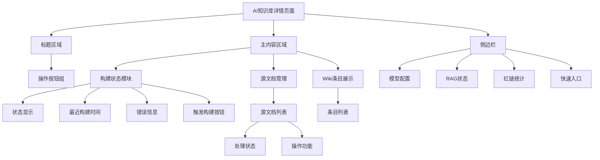

**图表来源**
- [app/templates/ai/detail.html:4-140](file://app/templates/ai/detail.html#L4-L140)

**章节来源**
- [app/templates/ai/detail.html:1-140](file://app/templates/ai/detail.html#L1-L140)

### Wiki浏览和对话功能
**更新** 新增完整的Wiki浏览和对话功能：

- **Wiki首页**
  - 标题和统计：显示知识库名称和条目总数
  - 标签分组：按标签分组显示Wiki条目
  - 条目列表：网格布局显示所有条目
  - 空状态：无条目时的提示信息

- **Wiki文章详情**
  - 面包屑导航：显示知识库路径
  - 文章内容：标题、摘要、标签、正文内容
  - 重新生成：支持重新生成单个条目
  - 反向链接：显示引用该条目的其他文章
  - 来源文档：显示生成该条目的原始文档

- **AI对话功能**
  - 聊天界面：消息列表和输入框
  - 实时交互：Alpine.js管理的消息状态
  - 异步请求：POST请求获取AI回复
  - 加载状态：处理中的视觉反馈

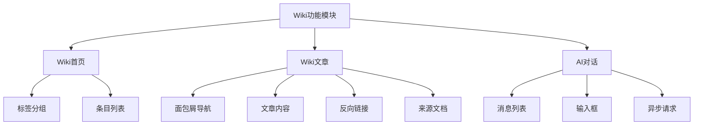

**图表来源**
- [app/templates/ai/wiki_home.html:1-52](file://app/templates/ai/wiki_home.html#L1-L52)
- [app/templates/ai/wiki_article.html:1-63](file://app/templates/ai/wiki_article.html#L1-L63)
- [app/templates/ai/chat.html:1-56](file://app/templates/ai/chat.html#L1-L56)

**章节来源**
- [app/templates/ai/wiki_home.html:1-52](file://app/templates/ai/wiki_home.html#L1-L52)
- [app/templates/ai/wiki_article.html:1-63](file://app/templates/ai/wiki_article.html#L1-L63)
- [app/templates/ai/chat.html:1-56](file://app/templates/ai/chat.html#L1-L56)

### 全局搜索功能
**更新** 导航栏中新增全局搜索功能，通过Alpine.js实现：

- **搜索组件结构**
  - 位置：导航栏右侧，仅在用户登录状态下显示
  - 组件：x-data="globalSearch"，使用Alpine.js数据绑定
  - 输入框：支持实时搜索、防抖处理(@input.debounce.300ms)
  - 焦点控制：@focus事件触发搜索结果展示
  - 键盘快捷键：支持"/"键快速聚焦搜索框

- **搜索状态管理**
  - q：搜索关键词，双向绑定
  - open：搜索结果下拉框显示状态
  - searching：搜索中状态指示
  - results：搜索结果数组
  - _timer：防抖定时器

- **搜索逻辑实现**
  - 防抖机制：setTimeout延迟200ms执行搜索
  - 条件搜索：关键词长度≥2才执行搜索
  - 权限控制：仅搜索用户可访问的知识库文档
  - 错误处理：网络异常时停止搜索状态

- **搜索结果展示**
  - 下拉框：绝对定位，z-index: 50，阴影效果
  - 结果格式：文档标题、类型标识、知识库名称、更新时间、摘要
  - 交互效果：悬停状态、点击外部关闭、键盘导航支持
  - 空状态：搜索中loading、无结果提示

- **键盘快捷键支持**
  - "/"键：快速聚焦搜索框，无需鼠标操作
  - Escape键：关闭搜索结果下拉框
  - Tab键：在搜索结果间导航

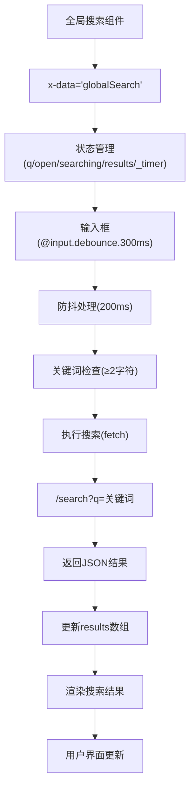

**图表来源**
- [app/templates/components/navbar.html:22-72](file://app/templates/components/navbar.html#L22-L72)
- [app/templates/components/navbar.html:103-142](file://app/templates/components/navbar.html#L103-L142)

**章节来源**
- [app/templates/components/navbar.html:1-143](file://app/templates/components/navbar.html#L1-L143)

### 搜索API设计
**更新** 搜索蓝图提供完整的搜索API接口：

- **API接口规范**
  - 路径：/search
  - 方法：GET
  - 参数：
    - q：搜索关键词（最小2字符）
    - page：页码（默认1）
    - size：页面大小（默认20，最大50）

- **权限控制机制**
  - 公共知识库：所有用户可访问
  - 私有知识库：仅拥有者可访问
  - 成员知识库：仅成员可访问
  - 超级管理员：可访问所有知识库

- **查询逻辑**
  - 构建可访问知识库ID集合
  - 搜索条件：标题模糊匹配或纯文本模糊匹配
  - 排序：按更新时间倒序
  - 分页：offset((page-1)*size) limit(size)

- **结果格式**
  - results：搜索结果数组
  - total：总记录数
  - 每个结果包含：id、title、type、kb_id、kb_name、snippet、updated_at

- **摘要生成**
  - 基于关键词位置提取上下文摘要
  - 最大长度120字符，包含省略号
  - 关键词未找到时返回开头部分

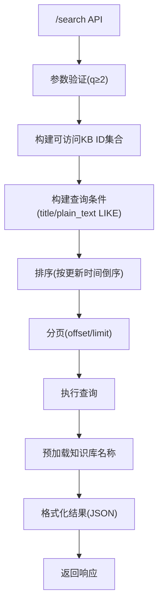

**图表来源**
- [app/blueprints/search.py:11-13](file://app/blueprints/search.py#L11-L13)
- [app/blueprints/search.py:24-29](file://app/blueprints/search.py#L24-L29)
- [app/blueprints/search.py:33-65](file://app/blueprints/search.py#L33-L65)
- [app/blueprints/search.py:70-107](file://app/blueprints/search.py#L70-L107)

**章节来源**
- [app/blueprints/search.py:1-130](file://app/blueprints/search.py#L1-L130)

### 搜索结果展示组件
**更新** 搜索结果下拉框提供丰富的文档信息展示：

- **下拉框设计**
  - 定位：绝对定位，距离输入框2px，右侧对齐
  - 尺寸：宽度80-96，最大高度70vh，支持滚动
  - 层级：z-index: 50，确保在其他元素之上

- **状态指示**
  - 搜索中：显示"搜索中..."提示
  - 无结果：关键词≥2且无匹配时显示提示
  - 有结果：循环渲染搜索结果列表

- **结果项结构**
  - 文档类型标识：📄(文档)/📊(表格)
  - 标题：截断显示，支持长标题
  - 知识库名称：显示所属知识库
  - 更新时间：格式化显示
  - 摘要：最多2行，支持省略号

- **交互功能**
  - 悬停效果：背景色变化
  - 点击外部关闭：@click.outside事件
  - 动画过渡：进入/离开动画效果
  - x-cloak：防止闪烁

- **响应式适配**
  - 不同屏幕尺寸下宽度自适应
  - 移动端优化，确保触摸友好
  - 滚动区域限制，避免超出视窗

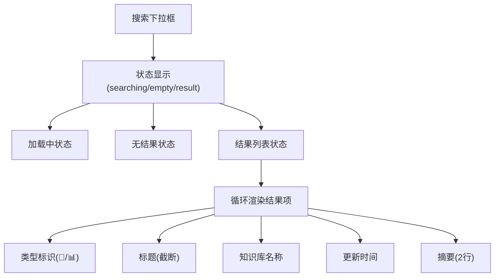

**图表来源**
- [app/templates/components/navbar.html:37-70](file://app/templates/components/navbar.html#L37-L70)
- [app/templates/components/navbar.html:55-67](file://app/templates/components/navbar.html#L55-L67)

**章节来源**
- [app/templates/components/navbar.html:37-70](file://app/templates/components/navbar.html#L37-L70)

### 键盘快捷键支持
**更新** 搜索功能支持多种键盘快捷键操作：

- **搜索框快捷键**
  - "/"键：快速聚焦搜索框，无需鼠标操作
  - Esc键：关闭搜索结果下拉框
  - Enter键：确认搜索（在搜索结果中）
  - Tab键：在搜索结果间导航

- **全局快捷键实现**
  - 事件监听：document.addEventListener('keydown')
  - 条件判断：排除INPUT、TEXTAREA、SELECT元素
  - 自动聚焦：通过querySelector定位搜索输入框

- **用户体验优化**
  - 减少鼠标操作，提升效率
  - 符合Web标准的键盘导航
  - 无障碍支持，屏幕阅读器友好

- **快捷键状态管理**
  - activeElement检查，避免影响输入框操作
  - preventDefault阻止默认行为
  - 条件执行，确保只在合适时机响应

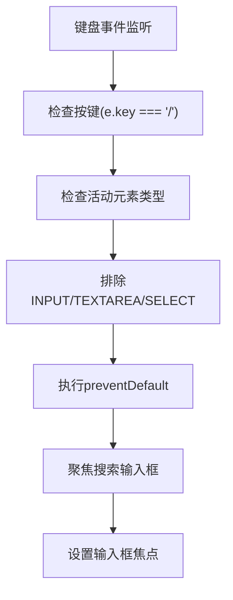

**图表来源**
- [app/templates/components/navbar.html:133-140](file://app/templates/components/navbar.html#L133-L140)

**章节来源**
- [app/templates/components/navbar.html:133-140](file://app/templates/components/navbar.html#L133-L140)

### 着陆页模板重写
**更新** 着陆页模板已完全重写，采用简洁的功能介绍和三步引导设计：

- **英雄区域设计**
  - 标题：使用大字号(4xl-5xl)强调产品价值主张
  - 副标题：简洁描述产品功能和价值
  - 标签：使用彩色标签展示开源、私有部署、AI驱动特性
  - 按钮：提供注册和登录入口，使用对比色突出行动号召

- **核心功能展示区**
  - 布局：采用3列网格布局(sm:2列，lg:3列)，展示六个核心功能
  - 设计：每个功能使用卡片式设计，包含图标、标题和描述
  - 图标：使用emoji表情符号，增强视觉识别度
  - 交互：使用hover:shadow-md和transition实现平滑的悬停效果
  - 颜色：每个功能使用不同的背景色和图标颜色，形成视觉层次

- **三步工作流程**
  - 布局：采用三等分网格布局，清晰展示三个步骤
  - 设计：每个步骤包含序号圆形徽章、标题和说明文字
  - 交互：使用居中对齐和统一的间距，确保视觉平衡
  - 信息密度：每个步骤提供简洁明了的信息，避免用户认知负担

- **行动号召区域**
  - 设计：使用深色背景(Indigo-600)创造强烈的视觉焦点
  - 内容：包含主要的行动号召文字和按钮
  - 按钮：使用对比色按钮，确保在深色背景上清晰可见

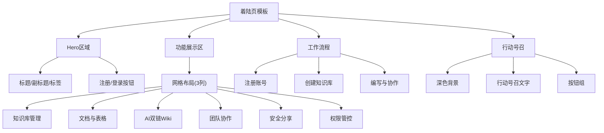

**图表来源**
- [app/templates/main/landing.html:6-25](file://app/templates/main/landing.html#L6-L25)
- [app/templates/main/landing.html:28-91](file://app/templates/main/landing.html#L28-L91)
- [app/templates/main/landing.html:94-117](file://app/templates/main/landing.html#L94-L117)
- [app/templates/main/landing.html:120-129](file://app/templates/main/landing.html#L120-L129)

**章节来源**
- [app/templates/main/landing.html:1-131](file://app/templates/main/landing.html#L1-L131)

### 空内容状态处理
**更新** 空内容状态处理已统一优化，提供更好的用户体验：

- **统一的空内容提示**
  - 位置：在内容容器下方显示，使用hidden类默认隐藏
  - 内容：显示"暂无内容"提示，根据用户权限显示编辑入口
  - 样式：使用text-slate-400颜色，提供清晰的视觉提示

- **智能显示逻辑**
  - 文档模式：当content_json为空或空白时，隐藏viewer容器，显示空内容提示
  - 表格模式：同样适用，但表格引擎未加载时显示"表格引擎未加载"提示
  - 编辑入口：当用户有编辑权限时，显示"点此开始编辑"的链接

- **状态切换机制**
  - 空内容：viewer.classList.add('hidden')，empty-tip.classList.remove('hidden')
  - 有内容：相反的状态切换，确保界面的一致性

- **错误处理**
  - 表格JSON解析失败：显示"表格数据已损坏"提示
  - 编辑器未加载：显示相应的错误信息，避免空白页面

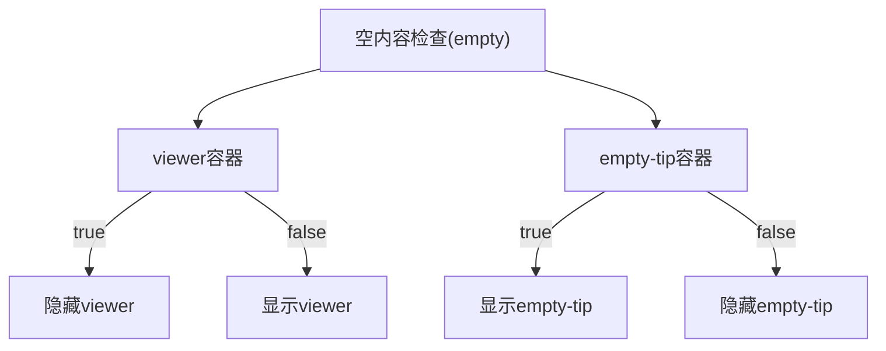

**图表来源**
- [app/templates/doc/view.html:147-152](file://app/templates/doc/view.html#L147-L152)
- [app/templates/doc/view.html:168-175](file://app/templates/doc/view.html#L168-L175)

**章节来源**
- [app/templates/doc/view.html:92-99](file://app/templates/doc/view.html#L92-L99)

### 滚动体验优化
**更新** 滚动体验已通过多种机制优化，确保良好的用户交互：

- **导航栏高度补偿**
  - CSS规则：#viewer h1, #viewer h2, #viewer h3, #viewer h4, #viewer h5, #viewer h6
  - 值：scroll-margin-top: 5.5rem，补偿导航栏高度
  - 目的：避免标题被固定在页面顶部的导航栏遮挡

- **平滑滚动导航**
  - 事件绑定：为大纲链接添加点击事件监听
  - 滚动行为：使用scrollIntoView({ behavior: 'smooth', block: 'start' })
  - URL同步：自动更新history.replaceState(null, '', '#' + id)

- **首次加载定位**
  - 哈希检查：location.hash && location.hash.length > 1
  - 重试机制：当viewer还未渲染完成时，提供重试滚动到目标位置
  - 行为设置：el.scrollIntoView({ behavior: 'auto', block: 'start' })

- **锚点生成机制**
  - DOM查询：target.querySelectorAll('h1, h2, h3')
  - 顺序对应：按outline数组顺序为标题分配锚点ID
  - 边界处理：Math.min(headings.length, OUTLINE.length)确保安全

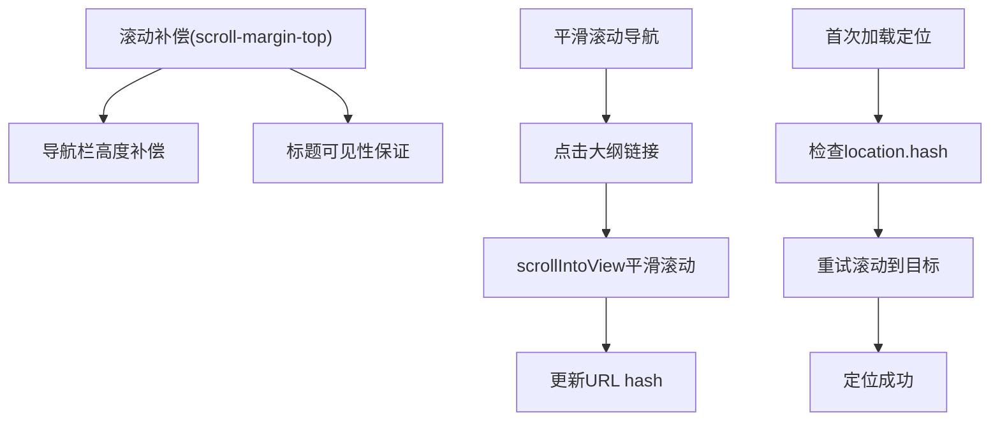

**图表来源**
- [app/templates/doc/view.html:133-137](file://app/templates/doc/view.html#L133-L137)
- [app/templates/doc/view.html:189-207](file://app/templates/doc/view.html#L189-L207)

**章节来源**
- [app/templates/doc/view.html:177-207](file://app/templates/doc/view.html#L177-L207)

### 知识库详情页面侧边栏布局重构
**更新** 知识库详情页面已完成侧边栏布局重构，新增粘性定位操作区：

- **粘性定位操作区设计**
  - 位置：侧边栏顶部，使用`sticky top-20`确保在滚动时保持可见
  - 结构：包含知识库设置链接、新建文档/表格按钮、成员管理入口
  - 布局：使用`space-y-2`垂直间距，确保按钮之间的合理间距
  - 条件渲染：根据用户权限显示相应操作按钮
- **文档树区域**
  - 使用`max-h-[60vh]`限制最大高度，超过部分滚动显示
  - 采用`overflow-y-auto`实现平滑滚动
  - 文档列表使用`ul`和`li`结构，支持嵌套显示
- **大纲占位区**
  - 文档详情页面右侧使用`lg:block`在大屏显示
  - 采用`sticky top-20`确保大纲在滚动时保持可见
  - 提供"打开文档后显示标题大纲"的占位提示
- **响应式设计**
  - 小屏设备：侧边栏在小屏设备上可能折叠或调整布局
  - 大屏设备：侧边栏宽度固定，确保操作区和文档树的合理分配
  - 使用`col-span-3 lg:col-span-2`实现响应式网格布局

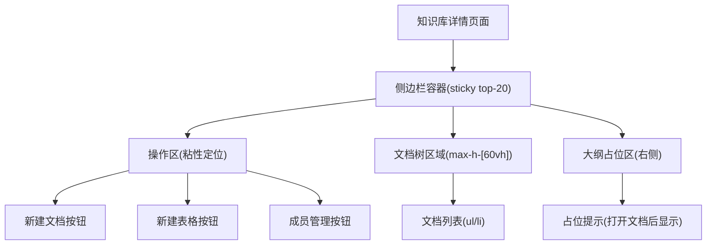

**图表来源**
- [app/templates/kb/detail.html:25-76](file://app/templates/kb/detail.html#L25-L76)
- [app/templates/kb/detail.html:103-108](file://app/templates/kb/detail.html#L103-L108)

**章节来源**
- [app/templates/kb/detail.html:1-112](file://app/templates/kb/detail.html#L1-L112)

### 文档详情页面侧边栏布局重构
**更新** 文档详情页面已完成侧边栏布局重构，采用与知识库详情页面一致的设计模式：

- **统一操作区设计**
  - 位置：侧边栏顶部，使用`sticky top-20`确保在滚动时保持可见
  - 结构：与知识库详情页面完全一致的操作区设计
  - 功能：包含新建文档/表格按钮、成员管理入口
  - 条件渲染：根据用户权限显示相应操作按钮
- **文档树导航**
  - 使用`max-h-[60vh]`限制最大高度，超过部分滚动显示
  - 采用`overflow-y-auto`实现平滑滚动
  - 支持当前文档的高亮显示(`active`类)
- **大纲导航**
  - 文档详情页面右侧使用`lg:block`在大屏显示
  - 采用`sticky top-20`确保大纲在滚动时保持可见
  - 支持层级缩进(`lvl-2`、`lvl-3`)和悬停效果
- **响应式布局**
  - 文档详情页面：主内容区使用`col-span-9 lg:col-span-7`
  - 表格模式：主内容区使用`col-span-9 lg:col-span-10`
  - 侧边栏：统一使用`col-span-3 lg:col-span-2`

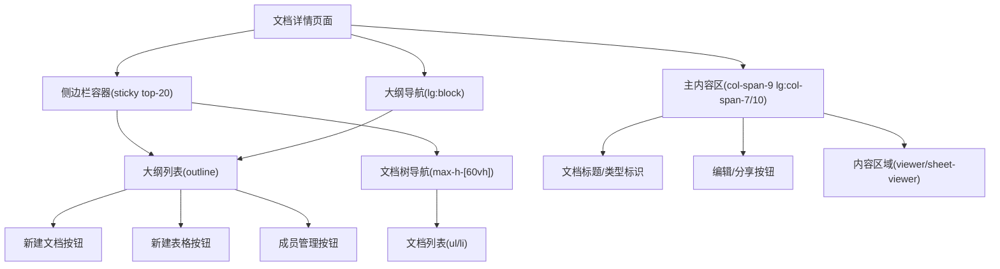

**图表来源**
- [app/templates/doc/view.html:20-64](file://app/templates/doc/view.html#L20-L64)
- [app/templates/doc/view.html:97-110](file://app/templates/doc/view.html#L97-L110)

**章节来源**
- [app/templates/doc/view.html:1-167](file://app/templates/doc/view.html#L1-L167)

### Excel/Spreadsheet在线表格编辑器集成
Excel/Spreadsheet在线表格编辑器已成功集成到系统中，提供Excel-like在线表格编辑体验：

- **编辑器配置**
  - 在线表格模式：x_spreadsheet函数提供完整的在线表格功能
  - 编辑模式：mode: 'edit' - 支持单元格编辑、公式计算和数据验证
  - 工具栏配置：showToolbar: true - 显示完整的工具栏
  - 网格显示：showGrid: true - 显示表格网格线
  - 右键菜单：showContextmenu: true - 支持右键菜单操作
  - 视图配置：view: { height: () => 600, width: () => holder.clientWidth || 1000 } - 响应式高度和宽度
  - 行列配置：row: { len: 100, height: 25 }, col: { len: 26, width: 100, indexWidth: 60, minWidth: 60 } - 默认行列设置

- **编辑器初始化**
  - 条件加载：通过IS_SHEET变量判断是否加载Excel编辑器
  - 容器要求：#sheet容器必须有明确的高度(min-height: 600px)，确保内部100%高度生效
  - 样式定制：#sheet .x-spreadsheet添加宽度100%样式，确保自适应
  - 错误处理：完善的错误检测和用户友好的错误提示
  - 事件监听：change事件实时更新保存状态

- **数据格式**
  - JSON格式：表格数据以JSON格式存储在content_json字段中
  - 数据加载：通过JSON.parse解析初始数据，loadData方法加载到编辑器
  - 数据序列化：通过JSON.stringify获取当前编辑器数据

- **多页面集成**
  - 编辑页：完整编辑器功能，支持保存、快捷键(Ctrl+S)
  - 视图页：只读模式，使用mode: 'read'配置
  - 分享页：简化版本，同样使用只读模式

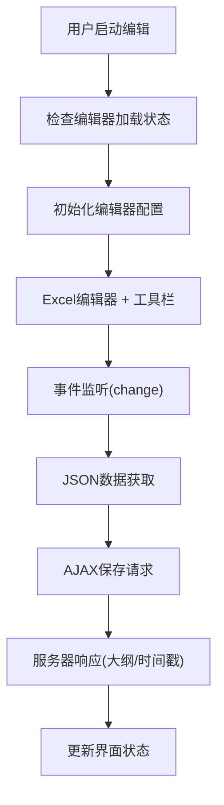

**图表来源**
- [app/templates/doc/edit.html:78-106](file://app/templates/doc/edit.html#L78-L106)
- [app/templates/doc/edit.html:107-133](file://app/templates/doc/edit.html#L107-L133)
- [app/blueprints/doc.py:76-84](file://app/blueprints/doc.py#L76-L84)

**章节来源**
- [app/templates/doc/edit.html:1-167](file://app/templates/doc/edit.html#L1-L167)
- [app/templates/doc/view.html:1-132](file://app/templates/doc/view.html#L1-L132)
- [app/templates/share/view.html:1-46](file://app/templates/share/view.html#L1-L46)
- [app/services/doc_service.py:56-62](file://app/services/doc_service.py#L56-L62)
- [scripts/fetch_vendors.py:51-60](file://scripts/fetch_vendors.py#L51-L60)

### 条件渲染逻辑
条件渲染逻辑通过doc.type判断文档类型，动态加载对应的编辑器和样式：

- **文档类型判断**
  - 文档类型：doc.type == 'doc' - 使用Markdown富文本编辑器
  - 表格类型：doc.type == 'sheet' - 使用Excel在线表格编辑器
  - 模板变量： - 在模板中创建布尔变量

- **动态资源加载**
  - 文档模式：加载toastui-editor样式和脚本
  - 表格模式：加载xspreadsheet样式和脚本
  - 中文本地化：文档模式加载toastui-editor-i18n-zh-cn.js，表格模式加载xspreadsheet-zh-cn.js

- **布局调整**
  - 文档模式：主内容区col-span-7，侧边栏大纲显示
  - 表格模式：主内容区col-span-10，隐藏侧边栏大纲
  - 容器差异：文档模式使用#editor，表格模式使用#sheet

- **JavaScript初始化**
  - 条件判断：const IS_SHEET = {{ 'true' if is_sheet else 'false' }}
  - 模式切换：根据IS_SHEET变量选择对应的初始化逻辑
  - 错误处理：针对不同编辑器提供相应的错误提示

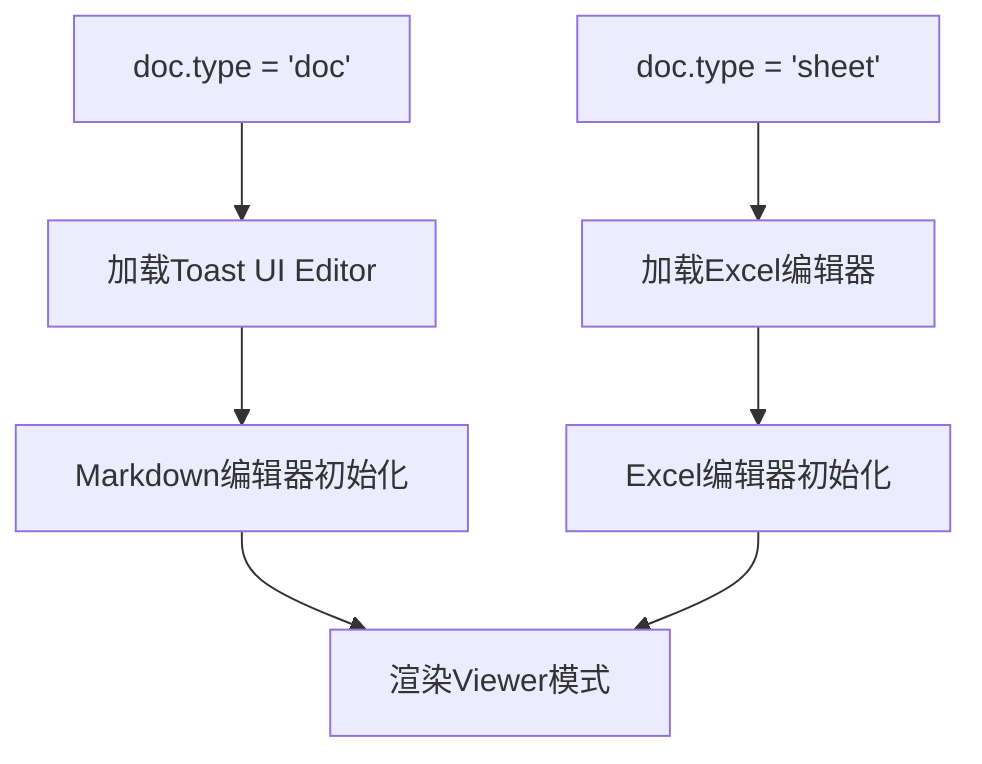

**图表来源**
- [app/templates/doc/edit.html:3, 29:3-3](file://app/templates/doc/edit.html#L3-L3)
- [app/templates/doc/view.html:3, 53:3-3](file://app/templates/doc/view.html#L3-L3)
- [app/models/document.py:10-12](file://app/models/document.py#L10-L12)

**章节来源**
- [app/templates/doc/edit.html:1-167](file://app/templates/doc/edit.html#L1-L167)
- [app/templates/doc/view.html:1-132](file://app/templates/doc/view.html#L1-L132)
- [app/models/document.py:1-98](file://app/models/document.py#L1-L98)

### 高级动画Flash通知系统
Flash通知系统已从简单静态显示升级为高级动画通知系统，提供更好的用户体验：

- **颜色编码系统**
  - 成功：绿色主题(#ecfdf5) + ✓图标，用于确认操作
  - 错误：红色主题(#fef2f2) + ✕图标，用于错误提示
  - 警告：橙色主题(#fffbeb) + ！图标，用于重要提醒
  - 信息：蓝色主题(#eff6ff) + i图标，用于一般信息
- **自动消失机制**
  - 4秒自动隐藏，提供及时的反馈但不干扰用户操作
  - 支持手动关闭按钮，用户可随时关闭通知
- **动画效果**
  - 进入动画：淡入 + 从上方滑入效果(200ms ease-out)
  - 离开动画：淡出 + 向上方滑出效果(300ms ease-in)
  - 使用x-transition指令实现流畅的Vue.js风格动画
- **定位与层级**
  - 固定定位居中显示(top-4, left-50%, transform:translateX(-50%))
  - z-index: 50确保通知显示在最顶层
  - 响应式宽度(max-w-md)适配不同屏幕尺寸
- **无障碍支持**
  - 关闭按钮提供aria-label="关闭"
  - 颜色对比度符合WCAG标准
  - 支持键盘操作和屏幕阅读器

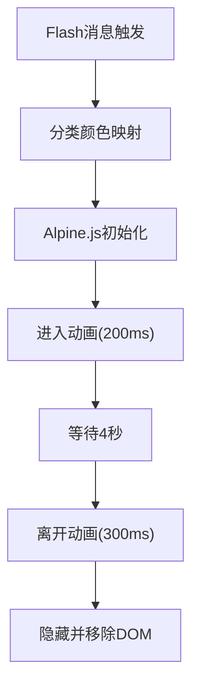

**图表来源**
- [app/templates/components/flash.html:7-12](file://app/templates/components/flash.html#L7-L12)
- [app/templates/components/flash.html:14-22](file://app/templates/components/flash.html#L14-L22)

**章节来源**
- [app/templates/components/flash.html:1-35](file://app/templates/components/flash.html#L1-L35)
- [app/static/js/app.js:16-30](file://app/static/js/app.js#L16-L30)

### 内容存储格式更新
内容存储格式已从Editor.js JSON格式迁移到Markdown格式，提升兼容性和性能：

- **格式迁移**
  - 编辑器变更：从Editor.js迁移到Toast UI Editor
  - 存储格式：content_json字段实际存储Markdown字符串
  - 兼容性：为避免破坏既有迁移，字段名保持不变
  - 服务层更新：doc_service.update_content直接存储Markdown内容

- **内容处理流程**
  - 编辑保存：编辑器获取Markdown内容，通过AJAX发送到服务器
  - 服务器处理：doc_service.update_content存储Markdown并生成纯文本
  - 视图渲染：编辑器使用viewer模式渲染Markdown为HTML
  - 大纲提取：outline工具从Markdown中提取标题层级

- **优势**
  - 性能提升：Markdown格式比JSON更紧凑，减少存储空间
  - 兼容性：Markdown是通用格式，便于与其他系统集成
  - 可读性：Markdown内容可直接阅读和编辑
  - 工具链：丰富的Markdown工具生态系统

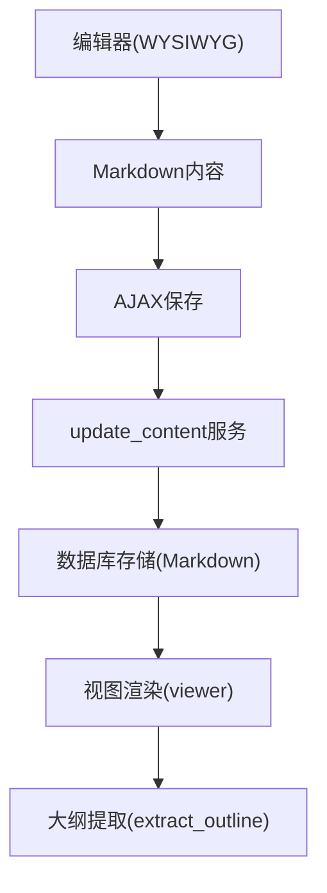

**图表来源**
- [app/services/doc_service.py:56-62](file://app/services/doc_service.py#L56-L62)
- [app/utils/outline.py:69-90](file://app/utils/outline.py#L69-L90)
- [app/blueprints/doc.py:76-84](file://app/blueprints/doc.py#L76-L84)

**章节来源**
- [app/services/doc_service.py:56-62](file://app/services/doc_service.py#L56-L62)
- [app/utils/outline.py:1-9](file://app/utils/outline.py#L1-L9)
- [app/blueprints/doc.py:76-84](file://app/blueprints/doc.py#L76-L84)

### Markdown 渲染引擎集成
- 扩展启用
  - 启用 extra、sane_lists、tables、fenced_code、toc、nl2br 等扩展，满足技术文档常见需求。
- 安全净化
  - 基于 bleach 对 HTML 进行白名单过滤，限制标签与属性，防止 XSS。
- 维基链接替换
  - 将 [[目标|显示]] 形式的维基链接转换为路由占位或红色链接，便于后续路由层改写为真实 URL。
- 返回格式
  - 输出 HTML5 格式字符串，供模板直接渲染。

```mermaid
flowchart TD
S["输入Markdown文本"] --> E["启用扩展并转换为HTML"]
E --> W["替换维基链接为占位锚点"]
W --> C["白名单净化HTML(标签/属性)"]
C --> R["返回安全HTML"]
```

**图表来源**
- [app/utils/markdown.py:31-39](file://app/utils/markdown.py#L31-L39)
- [app/utils/markdown.py:42-66](file://app/utils/markdown.py#L42-L66)

**章节来源**
- [app/utils/markdown.py:1-87](file://app/utils/markdown.py#L1-L87)

### 文档大纲生成与导航菜单
文档大纲提取工具已更新以支持新的Markdown内容格式：

- **大纲提取**
  - 从 Markdown 内容中提取 H1-H3 标题，生成带锚点的层级列表，用于侧边导航或目录索引。
  - 支持跳过代码块内容，避免影响大纲准确性.
  - 使用正则表达式匹配标题格式，提取纯文本内容。
  - **更新** 新增锚点生成机制，确保每个标题都有唯一的ID
- **纯文本与 Markdown 转换**
  - 支持将 Markdown 内容转为纯文本与简化 Markdown，便于搜索与 AI 使用。
  - 去除行内Markdown格式标记，保留可读文本。
- **在蓝图中的使用**
  - 视图中调用extract_outline函数，将大纲作为模板变量传入，页面模板据此渲染导航菜单。

```mermaid
flowchart TD
A["Markdown内容"] --> P["逐行解析"]
P --> H["匹配标题(#{1,3})"]
H --> S["提取纯文本"]
S --> SL["slugify生成锚点"]
SL --> U["去重/编号避免冲突"]
U --> O["输出大纲列表{level,text,anchor}"]
```

**图表来源**
- [app/utils/outline.py:69-90](file://app/utils/outline.py#L69-L90)
- [app/utils/outline.py:93-143](file://app/utils/outline.py#L93-L143)

**章节来源**
- [app/utils/outline.py:1-143](file://app/utils/outline.py#L1-L143)
- [app/blueprints/doc.py:83](file://app/blueprints/doc.py#L83)

### 页面模板与布局设计
- 主页/仪表盘重定向
  - 未登录用户访问根路径时渲染 landing 页面；登录后重定向至用户仪表盘。
- 着陆页模板
  - **更新** 采用简洁设计：移除复杂的文档预览和公共知识库网格布局
  - **更新** 新增功能展示区：六个核心功能的卡片式展示
  - **更新** 新增工作流程：三步引导用户快速上手
  - **更新** 优化信息架构：从功能介绍转向用户引导
- 知识库详情页
  - 展示知识库树形结构与默认打开的首篇文档，控制编辑/管理权限。
  - **更新** 采用粘性定位操作区，确保新建文档/表格按钮在滚动时保持可见
  - **更新** 侧边栏使用`max-h-[60vh]`限制高度，超过部分滚动显示
- 文档视图/编辑页
  - 文档模式：集成Toast UI Editor，提供WYSIWYG可视化编辑体验
  - 表格模式：集成Excel/Spreadsheet编辑器，提供Excel-like在线表格编辑
  - 视图页：使用对应编辑器viewer模式渲染内容
  - 分享页：简化版本，同样使用只读模式
  - **更新** 采用粘性头部设计，确保标题在滚动时保持可见
  - **更新** 分离标题区域和内容区域，提升视觉层次感
  - **更新** 统一空内容状态处理，提供更好的用户引导
  - **更新** 增强滚动体验，包括scroll-margin-top补偿和平滑滚动导航
  - **更新** 通过break-words、flex items-start、gap-4、whitespace-nowrap等样式改进，优化界面布局和显示效果
- 分享页
  - 生成/撤销分享链接，受权限控制。
- **更新** AI知识库页面
  - **更新** AI知识库列表：展示所有AI知识库，支持创建新知识库
  - **更新** AI知识库详情：展示构建状态、源文档、Wiki条目和功能入口
  - **更新** AI知识库编辑：支持配置聊天模型和RAG增强
  - **更新** 源文档管理：支持上传外部文件和选择现有文档
  - **更新** Wiki浏览：支持标签分组和全文浏览
  - **更新** AI对话：支持基于Wiki内容的问答功能

**章节来源**
- [app/blueprints/main.py:10-15](file://app/blueprints/main.py#L10-L15)
- [app/blueprints/kb.py:56-72](file://app/blueprints/kb.py#L56-L72)
- [app/blueprints/doc.py:60-66](file://app/blueprints/doc.py#L60-L66)
- [app/blueprints/doc.py:103-124](file://app/blueprints/doc.py#L103-L124)
- [app/blueprints/ai.py:32-395](file://app/blueprints/ai.py#L32-L395)

### 模板变量传递、过滤器与宏定义
- 变量传递
  - 蓝图通过 render_template 传入 doc、kb、tree、outline、can_edit、can_manage、public_kbs 等变量。
  - **更新** AI知识库蓝图传入 ai_kb、sources、articles、redlinks、kb_docs、existing_doc_ids 等变量。
- 过滤器
  - 模板中可使用 Jinja2 内置过滤器（如 safe、default、urlencode 等），也可在应用工厂中注册自定义过滤器。
- 宏定义
  - 可在公共模板中定义宏，复用按钮、表单控件、列表项等 UI 片段，减少重复代码。

**章节来源**
- [app/blueprints/doc.py:51-54](file://app/blueprints/doc.py#L51-L54)
- [app/blueprints/kb.py:68-72](file://app/blueprints/kb.py#L68-L72)
- [app/blueprints/main.py:14](file://app/blueprints/main.py#L14)
- [app/blueprints/ai.py:62-69](file://app/blueprints/ai.py#L62-L69)

### 前后端数据交互与 AJAX 请求
**更新** AJAX请求已更新以支持新的编辑器和内容格式：

- **编辑器状态管理**
  - 保存状态：实时显示保存状态(未变更/已修改/已保存/保存失败)
  - 快捷键支持：Ctrl+S快速保存文档
  - 错误处理：完善的错误检测和用户友好的错误提示
- **AJAX保存**
  - 请求格式：POST请求，JSON负载包含title、content_json、privacy
  - 响应格式：JSON包含ok标志、大纲数据、更新时间
  - 状态更新：根据响应更新界面状态和颜色
- **权限控制**
  - 蓝图在进入编辑/管理相关路由前进行权限校验，未授权返回 403。
- **CSRF保护增强**
  - JavaScript自动为fetch请求添加CSRF令牌
  - 支持轻量级后备toast通知系统
- **搜索功能AJAX请求**
  - 搜索API：/search?q=关键词
  - 防抖处理：200ms延迟，避免频繁请求
  - 权限验证：仅搜索用户可访问的文档
  - 结果格式：JSON数组，包含文档基本信息
- **AI知识库AJAX请求**
  - **更新** 源文档上传：multipart/form-data格式，支持多文件上传
  - **更新** 源文档管理：POST请求加入/移除源文档
  - **更新** 构建状态：GET请求获取构建状态和统计数据
  - **更新** AI对话：POST请求获取AI回复，支持流式响应

```mermaid
sequenceDiagram
participant FE as "前端(搜索组件)"
participant ALP as "Alpine.js数据"
participant API as "搜索API"
participant DB as "数据库"
FE->>ALP : 用户输入关键词
ALP->>ALP : 防抖延迟(200ms)
ALP->>API : GET /search?q=关键词
API->>DB : 查询可访问文档
DB-->>API : 返回搜索结果
API-->>ALP : JSON格式结果
ALP->>FE : 更新搜索结果UI
FE-->>U : 显示搜索结果列表
```

**图表来源**
- [app/templates/components/navbar.html:114-129](file://app/templates/components/navbar.html#L114-L129)
- [app/blueprints/search.py:11-13](file://app/blueprints/search.py#L11-L13)
- [app/blueprints/search.py:70-107](file://app/blueprints/search.py#L70-L107)

**章节来源**
- [app/blueprints/doc.py:69-84](file://app/blueprints/doc.py#L69-L84)
- [app/static/js/app.js:1-32](file://app/static/js/app.js#L1-L32)
- [app/templates/components/navbar.html:114-129](file://app/templates/components/navbar.html#L114-L129)
- [app/blueprints/search.py:11-13](file://app/blueprints/search.py#L11-L13)
- [app/blueprints/ai.py:153-205](file://app/blueprints/ai.py#L153-L205)

### 组件设计与样式规范
**更新** 组件设计已增强动画效果和交互体验：

- **组件嵌入**
  - 基础模板通过 include 引入 navbar、flash、footer，形成一致的头部、消息提示与底部布局。
- **样式规范**
  - 字体：Inter；UI 框架：TailwindCSS；代码高亮：highlight.js GitHub 主题。
  - 颜色方案：使用 Tailwind 的 slate 系列，保证浅色背景与文本对比度。
  - 动画系统：Alpine.js提供流畅的过渡效果
  - 编辑器样式：Excel编辑器圆角边框设计
  - 条件样式：根据文档类型动态应用不同的样式类
  - **更新** 粘性定位：使用position: sticky实现高性能滚动定位
  - **更新** 滚动补偿：使用scroll-margin-top补偿导航栏高度
  - **更新** 着陆页设计：采用卡片式布局和网格系统
  - **更新** 功能展示：使用emoji图标和统一的颜色编码
  - **更新** 工作流程：使用圆形序号和居中对齐设计
  - **更新** 搜索组件：使用x-data数据绑定和x-show条件显示
  - **更新** 动画过渡：使用x-transition实现流畅的进入/离开效果
  - **更新** 响应式设计：搜索框在不同屏幕尺寸下的自适应表现
  - **更新** 文档查看界面：通过break-words、flex items-start、gap-4、whitespace-nowrap等样式改进，优化界面布局和显示效果
  - **更新** AI知识库界面：采用卡片式设计和统一的颜色编码
  - **更新** 文件上传界面：使用渐变背景和图标增强视觉效果
  - **更新** 状态指示：使用颜色编码和徽章显示状态信息
- **响应式设计**
  - 使用 flex 布局与 min-h-full，使内容区域随内容增长而撑开，同时保持页脚贴底。
- **无障碍支持**
  - Flash通知提供aria-label和键盘支持
  - 粘性定位操作区支持键盘导航和屏幕阅读器
  - 颜色对比度符合WCAG标准
  - 编辑器支持中文本地化
  - **更新** 搜索组件支持键盘导航和屏幕阅读器
  - **更新** 搜索结果下拉框支持键盘操作
  - **更新** AI知识库界面支持无障碍访问
  - **更新** 文件上传界面提供屏幕阅读器支持

**章节来源**
- [app/templates/base.html:8-11](file://app/templates/base.html#L8-L11)
- [app/templates/base.html:17-24](file://app/templates/base.html#L17-L24)
- [app/templates/components/flash.html:23-29](file://app/templates/components/flash.html#L23-L29)
- [app/templates/components/navbar.html:22-72](file://app/templates/components/navbar.html#L22-L72)
- [app/templates/kb/detail.html:25-76](file://app/templates/kb/detail.html#L25-L76)
- [app/templates/doc/view.html:20-64](file://app/templates/doc/view.html#L20-L64)
- [app/templates/main/landing.html:35-89](file://app/templates/main/landing.html#L35-L89)
- [app/templates/ai/sources.html:4-9](file://app/templates/ai/sources.html#L4-L9)
- [scripts/fetch_vendors.py:23-62](file://scripts/fetch_vendors.py#L23-L62)

## 依赖分析
- 应用工厂与蓝图
  - 应用工厂注册 CSRF、登录管理、数据库与迁移等扩展，并注册各蓝图。
  - 错误处理器统一渲染错误页面模板。
- 模板上下文
  - 上下文处理器向所有模板注入站点名等全局变量。
- 静态资源
  - 第三方库通过脚本一次性拉取至 vendor 目录，避免运行时网络依赖。
- **更新** 前端交互增强
  - Alpine.js提供轻量级前端交互框架，支持全局搜索功能和AI知识库文件上传
  - App.js增强CSRF保护和后备通知系统
  - **更新** 增强的文档视图界面，包括粘性头部设计和空内容处理
  - **更新** 优化的文档查看界面，包括break-words、flex items-start、gap-4、whitespace-nowrap等样式改进
  - **更新** 搜索功能集成，提供实时文档检索体验
  - **更新** 搜索API设计，支持权限控制和分页查询
  - **更新** 键盘快捷键支持，提升用户操作效率
  - **更新** 滚动体验优化，包括scroll-margin-top补偿和平滑滚动导航
  - **更新** 重写的着陆页模板，包括功能展示区和工作流程
  - **更新** Excel/Spreadsheet编辑器依赖
  - **更新** 条件渲染依赖
  - **更新** 粘性定位依赖
  - **更新** 滚动体验依赖
  - **更新** 着陆页模板依赖
  - **更新** 搜索功能依赖
  - **更新** AI知识库功能依赖：蓝图、服务、模型和模板的完整集成
  - **更新** 文件上传依赖：Alpine.js数据绑定和文件处理
  - **更新** 异步构建依赖：后台线程和状态管理
- **更新** AI知识库依赖
  - Flask蓝图：app/blueprints/ai.py
  - AI服务：app/services/ai_service.py
  - 数据模型：app/models/ai_kb.py
  - 模板文件：app/templates/ai/*.html
  - LLM客户端：OpenAI兼容SDK
  - 异步处理：Python threading模块
  - 文件处理：app/utils/extract_upload.py

```mermaid
graph LR
EXT["扩展初始化<br/>app/extensions.py"] --> APP["应用工厂<br/>app/__init__.py"]
CFG["配置<br/>app/config.py"] --> APP
APP --> ERR["错误处理器<br/>app/__init__.py"]
APP --> CTX["上下文处理器<br/>app/__init__.py"]
APP --> BP["蓝图注册<br/>app/__init__.py"]
ALP["Alpine.js<br/>app/static/vendor/js/alpine.min.js"] --> APP
XSP["Excel编辑器<br/>app/static/vendor/js/xspreadsheet.js"] --> APP
TUI["Toast UI Editor<br/>app/static/vendor/js/toastui-editor-all.min.js"] --> APP
DOC["文档模型<br/>app/models/document.py"] --> BP
AI_BP["AI蓝图<br/>app/blueprints/ai.py"] --> AI_TPL["AI模板<br/>app/templates/ai/*.html"]
AI_SRV["AI服务<br/>app/services/ai_service.py"] --> AI_MD["AI模型<br/>app/models/ai_kb.py"]
AI_BP --> AI_SRV
AI_SRV --> LLM["LLM客户端"]
AI_SRV --> TH["后台线程"]
APP --> VEN["vendor脚本<br/>scripts/fetch_vendors.py"]
APP --> ST["静态资源<br/>app/static/vendor/*"]
SEB["搜索蓝图<br/>app/blueprints/search.py"] --> APP
```

**图表来源**
- [app/extensions.py:8-11](file://app/extensions.py#L8-L11)
- [app/__init__.py:39-53](file://app/__init__.py#L39-L53)
- [app/__init__.py:76-87](file://app/__init__.py#L76-L87)
- [app/__init__.py:90-95](file://app/__init__.py#L90-L95)
- [app/static/vendor/js/alpine.min.js](file://app/static/vendor/js/alpine.min.js)
- [app/static/vendor/js/xspreadsheet.js](file://app/static/vendor/js/xspreadsheet.js)
- [app/static/vendor/js/toastui-editor-all.min.js](file://app/static/vendor/js/toastui-editor-all.min.js)
- [app/models/document.py](file://app/models/document.py)
- [app/blueprints/ai.py:20](file://app/blueprints/ai.py#L20)
- [app/services/ai_service.py:47](file://app/services/ai_service.py#L47)
- [app/models/ai_kb.py:23](file://app/models/ai_kb.py#L23)
- [scripts/fetch_vendors.py:74-92](file://scripts/fetch_vendors.py#L74-L92)
- [app/blueprints/search.py:1-130](file://app/blueprints/search.py#L1-L130)

**章节来源**
- [app/extensions.py:1-16](file://app/extensions.py#L1-L16)
- [app/__init__.py:39-53](file://app/__init__.py#L39-L53)
- [app/__init__.py:76-87](file://app/__init__.py#L76-L87)
- [app/__init__.py:90-95](file://app/__init__.py#L90-L95)
- [scripts/fetch_vendors.py:74-92](file://scripts/fetch_vendors.py#L74-L92)

## 性能考虑
- 静态资源优化
  - 使用压缩版 CSS/JS，结合 CDN 缓存与本地 vendor 目录，减少加载时间。
  - Excel/Spreadsheet编辑器采用一体化版本，避免依赖缺失问题。
  - 条件加载策略，仅加载当前文档类型的编辑器资源。
- 模板渲染
  - 将计算密集型逻辑（如 Markdown 渲染、大纲提取）放在蓝图层，模板仅做展示，降低模板复杂度。
- 分页与查询
  - 使用分页助手限制查询规模，避免一次性加载过多数据。
  - **更新** 搜索功能采用防抖机制，200ms延迟避免频繁请求。
  - **更新** 搜索API支持分页查询，最大50条结果。
- 前端交互
  - 利用 Alpine.js 实现轻量前端行为，避免引入重型框架导致体积膨胀。
  - **更新** 搜索结果下拉框使用x-show条件显示，避免不必要的DOM操作。
  - **更新** 搜索组件使用x-data数据绑定，响应式更新UI状态。
  - **更新** 文件上传界面使用Alpine.js管理文件队列，避免频繁DOM操作。
  - **更新** AI知识库界面使用x-data管理状态，提供流畅的用户体验。
- **更新** 粘性定位性能优化
  - 使用CSS的position: sticky实现高性能滚动定位
  - 避免复杂的JavaScript滚动监听，减少性能开销
  - 合理设置max-height限制，避免过度渲染
- **更新** 响应式布局优化
  - 使用Tailwind的响应式类，避免媒体查询的性能问题
  - col-span类提供高效的网格布局
  - max-h-[60vh]限制滚动区域，提升滚动性能
- **更新** 编辑器性能优化**
  - 编辑器高度固定，避免布局重计算
  - 只读模式使用viewer配置，减少不必要的DOM操作
  - 中文本地化文件按需加载
  - 条件渲染避免加载不需要的编辑器资源
- **更新** 文档视图性能优化**
  - requestAnimationFrame确保在DOM渲染完成后执行锚点生成
  - 平滑滚动使用原生scrollIntoView API，避免第三方库依赖
  - CSS scroll-margin-top补偿导航栏高度，无需JavaScript处理
  - 首次加载哈希处理提供优雅降级，避免阻塞页面渲染
  - 空内容状态处理使用CSS类切换，避免DOM操作开销
  - **更新** 通过break-words、flex items-start、gap-4、whitespace-nowrap等样式优化，减少布局重计算
- **更新** 着陆页性能优化**
  - 简化的布局结构，减少DOM节点数量
  - 卡片式设计使用CSS hover效果，避免JavaScript交互
  - 响应式网格使用CSS Grid，提升渲染性能
  - 图标使用emoji，减少额外的字体加载
- **更新** 搜索功能性能优化**
  - 防抖机制避免频繁AJAX请求
  - 权限控制在服务端执行，减少前端计算
  - 搜索结果限制在20条以内，提升响应速度
  - 下拉框使用max-h-[70vh]限制滚动区域
- **更新** AI知识库性能优化**
  - 异步构建避免阻塞主线程
  - 增量构建仅处理待处理源文档
  - 后台线程池管理构建任务
  - 状态缓存减少重复查询
  - 文件上传使用DataTransfer API，避免内存泄漏
  - Alpine.js数据绑定优化文件队列操作

**章节来源**
- [scripts/fetch_vendors.py:51-60](file://scripts/fetch_vendors.py#L51-L60)
- [app/utils/markdown.py:31-39](file://app/utils/markdown.py#L31-L39)
- [app/utils/outline.py:34-55](file://app/utils/outline.py#L34-L55)
- [app/utils/pagination.py:5-9](file://app/utils/pagination.py#L5-L9)
- [app/templates/doc/edit.html:75-96](file://app/templates/doc/edit.html#L75-L96)
- [app/templates/components/navbar.html:114-129](file://app/templates/components/navbar.html#L114-L129)
- [app/blueprints/search.py:24-29](file://app/blueprints/search.py#L24-L29)
- [app/blueprints/ai.py:467-522](file://app/blueprints/ai.py#L467-L522)
- [app/services/ai_service.py:467-522](file://app/services/ai_service.py#L467-L522)

## 故障排查指南
- 403/404/500 错误页面
  - 应用工厂已注册错误处理器，统一渲染对应错误模板。
- CSRF 校验失败
  - 确认基础模板中已注入 CSRF Token，并在表单中正确携带。
- **更新** 粘性定位问题
  - 检查sticky top-14/top-20类是否正确应用
  - 确认父容器具有足够的高度和正确的定位上下文
  - 验证max-h-[60vh]是否影响滚动行为
  - 检查浏览器对position: sticky的支持情况
- **更新** 操作区显示问题
  - 确认操作区的space-y-2间距类正确应用
  - 检查条件渲染逻辑是否正确显示/隐藏按钮
  - 验证权限检查逻辑是否正常工作
- **更新** 侧边栏滚动问题
  - 检查max-h-[60vh]是否正确限制高度
  - 确认overflow-y-auto是否正常工作
  - 验证文档树的嵌套结构是否正确
- **更新** 文档视图界面问题
  - 检查粘性头部的sticky top-14设置是否正确
  - 确认空内容状态处理的CSS类切换逻辑
  - 验证scroll-margin-top样式是否正确应用到标题元素
  - 检查平滑滚动导航的JavaScript事件绑定
  - **更新** 检查break-words、flex items-start、gap-4、whitespace-nowrap等样式类是否正确应用
- **更新** 滚动体验问题
  - 检查scroll-margin-top: 5.5rem是否正确应用
  - 确认平滑滚动的scrollIntoView配置
  - 验证首次加载哈希处理的location.hash检查逻辑
- **更新** 着陆页模板问题
  - 检查网格布局类是否正确应用(sm:grid-cols-2, lg:grid-cols-3)
  - 确认卡片样式的hover效果是否正常
  - 验证功能展示区的图标和颜色编码
  - 检查工作流程的居中对齐和间距
- **更新** 全局搜索功能问题**
  - 检查Alpine.js是否正确加载
  - 确认搜索组件的x-data绑定是否正常
  - 验证防抖机制是否正常工作(200ms延迟)
  - 检查搜索API路径(/search)是否正确
  - 验证权限控制是否正确过滤不可访问的文档
  - 确认搜索结果下拉框的x-show条件是否正确
- **更新** 搜索键盘快捷键问题**
  - 检查keydown事件监听是否正常
  - 确认"/"键是否正确触发搜索框聚焦
  - 验证activeElement检查逻辑
  - 检查preventDefault是否正确执行
- **更新** AI知识库功能问题**
  - 检查AI蓝图路由是否正确注册
  - 确认AI服务是否正确初始化LLM客户端
  - 验证异步构建线程是否正常启动
  - 检查文件上传路径和权限设置
  - 确认状态管理是否正确更新
  - 验证双链解析是否正常工作
- **更新** 文件上传界面问题**
  - 检查Alpine.js数据绑定是否正常
  - 确认文件选择器的accept属性是否正确
  - 验证文件队列的add/remove操作
  - 检查DataTransfer API的使用是否正确
  - 确认上传按钮的禁用状态逻辑
- **更新** Wiki浏览功能问题**
  - 检查标签分组的展开/收起功能
  - 确认文章详情的渲染是否正常
  - 验证反向链接的显示逻辑
  - 检查来源文档的链接是否正确
- **更新** AI对话功能问题**
  - 检查fetch请求的URL是否正确
  - 确认消息列表的渲染逻辑
  - 验证加载状态的显示
  - 检查错误处理和用户反馈
- Markdown 渲染异常
  - 检查 Markdown 扩展是否启用，以及 bleach 白名单是否覆盖所需标签/属性。
- 大纲为空
  - 确认 Markdown 内容格式正确，且包含有效的标题格式；检查slugify与锚点生成逻辑。

**章节来源**
- [app/__init__.py:76-87](file://app/__init__.py#L76-L87)
- [app/templates/base.html:6](file://app/templates/base.html#L6)
- [app/templates/kb/detail.html:25-76](file://app/templates/kb/detail.html#L25-L76)
- [app/templates/doc/view.html:20-64](file://app/templates/doc/view.html#L20-L64)
- [app/templates/main/landing.html:35-117](file://app/templates/main/landing.html#L35-L117)
- [app/templates/components/navbar.html:22-72](file://app/templates/components/navbar.html#L22-L72)
- [app/blueprints/search.py:11-13](file://app/blueprints/search.py#L11-L13)
- [app/blueprints/ai.py:23-29](file://app/blueprints/ai.py#L23-L29)
- [app/services/ai_service.py:47-80](file://app/services/ai_service.py#L47-80)
- [app/utils/markdown.py:10-25](file://app/utils/markdown.py#L10-L25)
- [app/utils/outline.py:22-31](file://app/utils/outline.py#L22-L31)

## 结论
My Wiki 的模板系统以基础模板为核心，配合蓝图层的数据准备与工具层的渲染/提取能力，实现了清晰的职责分离与良好的可维护性。Excel/Spreadsheet在线表格编辑器的集成显著提升了文档编辑体验，提供专业的Excel-like在线表格功能。条件渲染逻辑通过doc.type判断文档类型，动态加载对应的编辑器资源，实现了文档与表格的统一管理。内容存储格式从Editor.js迁移到Markdown格式，提升了性能和兼容性。**更新** 通过引入全局搜索功能，显著提升了文档检索体验。**更新** 通过Alpine.js实现的实时搜索组件，提供流畅的用户体验和键盘快捷键支持。**更新** 通过搜索API的权限控制和分页机制，确保系统的安全性和性能。**更新** 通过防抖优化和响应式设计，进一步提升搜索功能的实用性和可用性。**更新** 通过重写的着陆页模板，显著提升了新用户的引导体验。**更新** 通过引入六个核心功能展示区，帮助用户快速了解产品价值。**更新** 通过引入三步工作流程，简化了用户入门路径。**更新** 通过引入重构的文档视图界面，显著提升了文档浏览体验。**更新** 通过break-words、flex items-start、gap-4、whitespace-nowrap等样式优化，进一步增强了界面的布局控制和显示效果。**更新** 粘性头部设计确保标题在滚动时保持可见，提升导航效率。**更新** 空内容状态处理提供了更好的用户引导。**更新** 滚动体验优化解决了导航栏遮挡标题的问题。**更新** 通过引入统一的粘性定位操作区，显著提升了知识库详情页面和文档详情页面的用户体验。**更新** 响应式布局优化确保在不同设备上的良好显示效果。**更新** 统一的操作区设计模式便于用户理解和使用。**更新** 新增AI知识库功能模块，提供完整的AI知识库管理能力，包括知识库创建、编辑、删除、状态管理和异步构建。**更新** 通过AI蓝图和AI服务的集成，实现从源文档到Wiki条目的自动化处理，支持外部文件上传和现有文档选择。**更新** 通过异步构建管道，支持后台处理大规模文档转换任务，提升系统性能和用户体验。**更新** 通过Alpine.js实现的文件上传队列管理，提供直观的用户界面和实时反馈。**更新** 通过完整的AI对话功能，支持基于Wiki内容的智能问答。通过 Alpine.js 动画系统、响应式样式与轻量前端交互，系统在功能与体验上达到平衡。建议后续完善页面模板与组件宏定义，进一步提升可复用性与一致性。

## 附录
- 模板变量清单（示例）
  - 全局：site_name
  - 文档视图：doc、kb、tree、outline、can_edit、can_manage
  - 知识库列表：kbs、tab
  - 管理统计：stats
  - 主页：public_kbs
  - Flash通知：messages(with_categories=true)
  - 知识库详情：kb、tree、first_doc、can_edit、can_manage
  - 编辑器：content_json(Markdown格式)
  - 条件渲染：is_sheet(布尔值)
  - 文档类型：doc.type('doc'/'sheet')
  - **更新** 全局搜索：current_user.is_authenticated
  - **更新** 搜索API：q(page,size)查询参数
  - **更新** 搜索结果：results数组，包含id,title,type,kb_name,snippet,updated_at
  - **更新** 着陆页模板：功能展示区、工作流程、行动号召
  - **更新** 文档视图界面：粘性头部设计、空内容处理、滚动体验优化、样式优化
  - **更新** 粘性定位：sticky top-14/20、max-h-[60vh]、col-span网格布局
  - **更新** 滚动补偿：scroll-margin-top: 5.5rem、平滑滚动导航
  - **更新** 样式优化：break-words、flex items-start、gap-4、whitespace-nowrap
  - **更新** AI知识库变量：ai_kb、sources、articles、redlinks、kb_docs、existing_doc_ids
  - **更新** AI知识库状态：status、last_built_at、error_msg
  - **更新** 源文档变量：display_title、kind、status、err_msg
  - **更新** Wiki文章变量：title、slug、summary、tags、content_md、updated_at
  - **更新** 文件上传变量：items、count、fmtSize、setFiles、removeAt、clearAll
  - **更新** 对话功能变量：messages、loading、q、ask
  - **更新** Alpine.js数据：globalSearch、chatApp、文件上传队列
- 建议
  - 在基础模板中预留更多块位（如 head_extra/body_extra），便于页面级定制。
  - 在应用工厂中注册常用过滤器与全局宏，减少模板重复代码。
  - 对热点页面增加缓存策略（如基于 ETag 或片段缓存）。
  - **更新** 考虑为Flash通知系统添加配置选项，允许用户自定义显示时长
  - **更新** 扩展粘性定位设计到其他页面，提升整体用户体验
  - **更新** 优化粘性定位的浏览器兼容性，提供降级方案
  - **更新** 添加侧边栏展开/收起功能，支持更灵活的布局控制
  - **更新** 继续维护粘性定位的一致性，确保所有新功能都使用相同的设计模式
  - **更新** 进一步优化文档视图界面性能，考虑使用Intersection Observer API
  - **更新** 增加文档视图界面的键盘导航支持，提升可访问性
  - **更新** 优化着陆页模板的加载性能，考虑懒加载非首屏内容
  - **更新** 增强着陆页模板的SEO优化，包括语义化标签和meta信息
  - **更新** 优化搜索功能的性能，考虑使用Web Workers处理大量数据
  - **更新** 增加搜索历史记录功能，提升用户使用体验
  - **更新** 考虑添加搜索建议功能，提供智能关键词推荐
  - **更新** 优化AI知识库的性能，考虑使用连接池和任务队列
  - **更新** 增强AI知识库的错误处理，提供更详细的诊断信息
  - **更新** 添加AI知识库的导出功能，支持数据备份和迁移
  - **更新** 优化文件上传的并发处理，支持更大的文件和更多的并发上传