# 前端模板系统

<cite>
**本文引用的文件**
- [app/templates/base.html](file://app/templates/base.html)
- [app/templates/components/flash.html](file://app/templates/components/flash.html)
- [app/templates/components/navbar.html](file://app/templates/components/navbar.html)
- [app/templates/components/footer.html](file://app/templates/components/footer.html)
- [app/templates/kb/new.html](file://app/templates/kb/new.html)
- [app/templates/doc/edit.html](file://app/templates/doc/edit.html)
- [app/templates/doc/view.html](file://app/templates/doc/view.html)
- [app/templates/share/view.html](file://app/templates/share/view.html)
- [app/utils/markdown.py](file://app/utils/markdown.py)
- [app/utils/outline.py](file://app/utils/outline.py)
- [app/services/doc_service.py](file://app/services/doc_service.py)
- [app/blueprints/main.py](file://app/blueprints/main.py)
- [app/blueprints/doc.py](file://app/blueprints/doc.py)
- [app/blueprints/kb.py](file://app/blueprints/kb.py)
- [app/blueprints/admin.py](file://app/blueprints/admin.py)
- [app/blueprints/ai.py](file://app/blueprints/ai.py)
- [app/blueprints/auth.py](file://app/blueprints/auth.py)
- [app/__init__.py](file://app/__init__.py)
- [app/extensions.py](file://app/extensions.py)
- [app/config.py](file://app/config.py)
- [app/static/css/app.css](file://app/static/css/app.css)
- [app/static/js/app.js](file://app/static/js/app.js)
- [app/models/document.py](file://app/models/document.py)
- [scripts/fetch_vendors.py](file://scripts/fetch_vendors.py)
- [app/static/vendor/js/xspreadsheet.js](file://app/static/vendor/js/xspreadsheet.js)
</cite>

## 更新摘要
**所做更改**
- 颜色方案一致性改进：将所有紫色主题替换为靛蓝色主题，包括新建按钮、空状态消息和其他交互元素的颜色统一
- 更新知识库创建界面的可见性卡片颜色方案，从紫色(#6366f1)改为靛蓝色(#4338ca)
- 更新文档类型标识的颜色编码，从紫色(#6366f1)改为靛蓝色(#4338ca)
- 更新Flash通知系统的颜色映射，保持靛蓝色主题的一致性
- 更新导航栏和管理界面的色彩使用，确保整体视觉统一

## 目录
1. [简介](#简介)
2. [项目结构](#项目结构)
3. [核心组件](#核心组件)
4. [架构总览](#架构总览)
5. [详细组件分析](#详细组件分析)
6. [依赖分析](#依赖分析)
7. [性能考虑](#性能考虑)
8. [故障排查指南](#故障排查指南)
9. [结论](#结论)
10. [附录](#附录)

## 简介
本文件系统化梳理 My Wiki 的前端模板体系，重点覆盖：
- Jinja2 模板结构与继承机制
- 基础模板 base.html 的区块设计与组件嵌入
- 页面模板的布局与内容区块组织
- **更新** 颜色方案一致性改进：将所有紫色主题替换为靛蓝色主题
- Excel/Spreadsheet在线表格编辑器集成与配置
- 条件渲染逻辑处理两种编辑模式（文档vs表格）
- JavaScript初始化代码支持新的编辑器
- 内容存储格式从Editor.js JSON迁移到Markdown格式
- 高级动画Flash通知系统与交互式卡片设计
- Markdown 渲染引擎集成与安全策略
- 文档大纲生成与导航菜单实现
- 响应式设计与样式规范
- 模板变量传递、过滤器使用与宏定义建议
- 前后端数据交互模式与 AJAX 请求处理
- 浏览器兼容性、性能优化与可访问性考虑

## 项目结构
模板系统位于 app/templates，当前仓库包含基础模板 base.html、组件模板和页面模板；页面模板由各蓝图在 render_template 中指定。静态资源通过 url_for 引入，第三方库通过脚本统一拉取至 app/static/vendor。

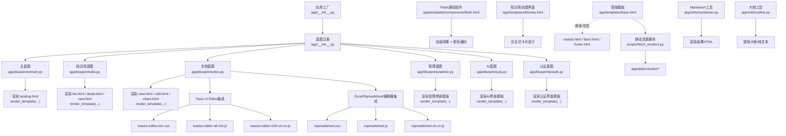

**图表来源**
- [app/__init__.py:56-74](file://app/__init__.py#L56-L74)
- [app/blueprints/main.py:10-15](file://app/blueprints/main.py#L10-L15)
- [app/blueprints/kb.py:21-72](file://app/blueprints/kb.py#L21-L72)
- [app/blueprints/doc.py:43-66](file://app/blueprints/doc.py#L43-L66)
- [app/blueprints/admin.py:24-33](file://app/blueprints/admin.py#L24-L33)
- [app/blueprints/ai.py:30-32](file://app/blueprints/ai.py#L30-L32)
- [app/blueprints/auth.py:25-48](file://app/blueprints/auth.py#L25-L48)
- [app/templates/base.html:16-25](file://app/templates/base.html#L16-L25)
- [app/templates/components/flash.html:1-35](file://app/templates/components/flash.html#L1-35)
- [app/templates/kb/new.html:18-38](file://app/templates/kb/new.html#L18-L38)
- [app/utils/markdown.py:31-39](file://app/utils/markdown.py#L31-L39)
- [app/utils/outline.py:34-55](file://app/utils/outline.py#L34-L55)
- [scripts/fetch_vendors.py:51-60](file://scripts/fetch_vendors.py#L51-L60)

**章节来源**
- [app/__init__.py:56-74](file://app/__init__.py#L56-L74)
- [app/templates/base.html:1-29](file://app/templates/base.html#L1-L29)
- [scripts/fetch_vendors.py:51-60](file://scripts/fetch_vendors.py#L51-L60)

## 核心组件
- 基础模板 base.html：定义全局 HTML 结构、样式与脚本引入、CSRF 元信息、块级占位符与组件包含点。
- Excel/Spreadsheet在线表格编辑器：提供Excel-like在线表格编辑体验，支持单元格操作、公式计算和数据验证。
- 条件渲染逻辑：通过doc.type判断文档类型，动态加载对应的编辑器和样式资源。
- Toast UI Editor富文本编辑器：提供WYSIWYG可视化编辑体验，支持Markdown语法和实时预览。
- **更新** 高级动画Flash通知系统：从简单静态显示升级为高级动画通知系统，支持颜色编码、自动消失和流畅动画效果。
- **更新** 交互式卡片设计：知识库创建界面采用交互式卡片替代传统单选按钮，提供更好的用户体验。
- 上下文注入器：向所有模板注入站点名等全局变量。
- 内容存储格式：从Editor.js JSON格式迁移到Markdown格式，数据库字段content_json实际存储Markdown字符串。
- Markdown 渲染工具：负责 Markdown 转换、扩展启用、HTML 安全净化与维基链接替换。
- 大纲提取工具：从 Markdown 内容中抽取标题层级、锚点与纯文本摘要。
- 静态资源管理：通过脚本集中拉取第三方库，确保离线可用与缓存友好。

**章节来源**
- [app/templates/base.html:1-29](file://app/templates/base.html#L1-L29)
- [app/templates/doc/edit.html:35-44](file://app/templates/doc/edit.html#L35-L44)
- [app/templates/components/flash.html:1-35](file://app/templates/components/flash.html#L1-35)
- [app/templates/kb/new.html:1-47](file://app/templates/kb/new.html#L1-L47)
- [app/__init__.py:90-95](file://app/__init__.py#L90-L95)
- [app/utils/markdown.py:31-66](file://app/utils/markdown.py#L31-L66)
- [app/utils/outline.py:1-9](file://app/utils/outline.py#L1-L9)
- [scripts/fetch_vendors.py:51-60](file://scripts/fetch_vendors.py#L51-L60)

## 架构总览
模板系统遵循"基础模板 + 页面模板"的继承模式，页面模板通过 render_template 注入上下文变量，再由基础模板统一渲染输出。Excel/Spreadsheet在线表格编辑器提供Excel-like在线表格编辑体验，条件渲染逻辑通过doc.type判断文档类型，动态加载对应的编辑器。内容存储格式从Editor.js迁移到Markdown格式。**更新** 通过引入高级动画Flash通知系统和交互式卡片设计，显著提升了用户体验。**更新** 颜色方案一致性改进确保所有交互元素使用统一的靛蓝色主题。Markdown 与大纲工具在蓝图视图中被调用，为页面模板提供渲染后的 HTML 与导航信息。

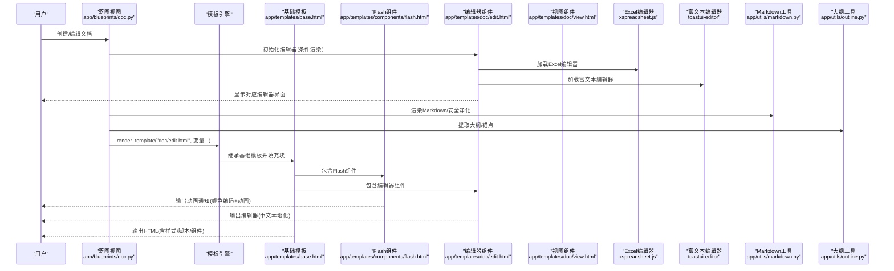

**图表来源**
- [app/blueprints/doc.py:69-84](file://app/blueprints/doc.py#L69-L84)
- [app/templates/components/flash.html:6-32](file://app/templates/components/flash.html#L6-L32)
- [app/templates/doc/edit.html:75-96](file://app/templates/doc/edit.html#L75-L96)
- [app/utils/markdown.py:31-39](file://app/utils/markdown.py#L31-L39)
- [app/utils/outline.py:69-90](file://app/utils/outline.py#L69-L90)
- [app/templates/base.html:16-25](file://app/templates/base.html#L16-L25)

## 详细组件分析

### 基础模板 base.html
- 结构与继承
  - 使用块占位符组织页面：title、head_extra、layout、content、body_extra。
  - 通过 include 将 navbar、flash、footer 组件拼装进主体布局。
- 样式与脚本
  - 引入字体、TailwindCSS、高亮主题与自定义样式。
  - 引入 Alpine.js 作为轻量前端交互框架。
- 安全与元信息
  - 注入 CSRF Token，供表单提交时携带。
  - 设置 viewport 与语言属性，支持响应式设计。
- 响应式设计
  - 使用 Tailwind 的 flex 与 min-h-full 实现主容器纵向铺满与内容自适应。

**章节来源**
- [app/templates/base.html:1-29](file://app/templates/base.html#L1-L29)

### 颜色方案一致性改进
**更新** 系统已完成颜色方案一致性改进，将所有紫色主题替换为靛蓝色主题：

- **知识库创建界面**
  - 私密可见性卡片：从紫色(#6366f1)改为靛蓝色(#4338ca)
  - 卡片选中状态：使用#4338ca边框色(#6366f1 → #4338ca)
  - 背景色：#eef2ff保持不变，确保对比度
  - 成员可见性：保持橙色(#f59e0b)不变
  - 公开可见性：保持绿色(#10b981)不变

- **文档类型标识**
  - 文档类型标识：从紫色(#6366f1)改为靛蓝色(#4338ca)
  - 表格类型标识：保持绿色(#10b981)不变
  - 状态样式：.doc-tree-item.active使用#4338ca(#6366f1 → #4338ca)

- **Flash通知系统**
  - 颜色映射保持靛蓝色主题一致性
  - 成功：#ecfdf5 + #047857
  - 错误：#fef2f2 + #b91c1c  
  - 警告：#fffbeb + #b45309
  - 信息：#eff6ff + #1d4ed8(#1d4ed8保持不变)

- **导航栏和管理界面**
  - 导航栏徽章：从紫色渐变改为靛蓝色渐变(#4338ca)
  - 管理界面统计：用户统计使用#4338ca(#6366f1 → #4338ca)
  - 按钮颜色：保持靛蓝色(#4338ca)一致性

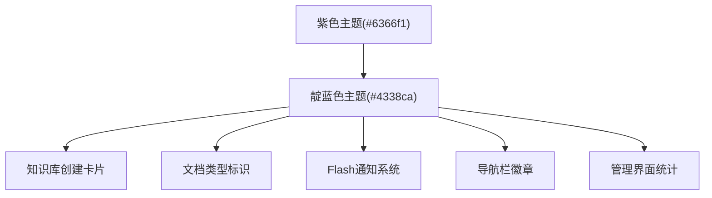

**图表来源**
- [app/templates/kb/new.html:21:22](file://app/templates/kb/new.html#L21-L22)
- [app/templates/doc/edit.html:10:11](file://app/templates/doc/edit.html#L10-L11)
- [app/templates/components/flash.html:7:12](file://app/templates/components/flash.html#L7-L12)
- [app/templates/components/navbar.html:24:25](file://app/templates/components/navbar.html#L24-L25)
- [app/templates/admin/index.html:13:14](file://app/templates/admin/index.html#L13-L14)

**章节来源**
- [app/templates/kb/new.html:18-38](file://app/templates/kb/new.html#L18-L38)
- [app/templates/doc/edit.html:10:13](file://app/templates/doc/edit.html#L10-L13)
- [app/templates/doc/view.html:71:74](file://app/templates/doc/view.html#L71-L74)
- [app/templates/components/flash.html:7:12](file://app/templates/components/flash.html#L7-L12)
- [app/templates/components/navbar.html:24:25](file://app/templates/components/navbar.html#L24-L25)
- [app/templates/admin/index.html:13:14](file://app/templates/admin/index.html#L13-L14)

### Excel/Spreadsheet在线表格编辑器集成
Excel/Spreadsheet在线表格编辑器已成功集成到系统中，提供Excel-like在线表格编辑体验：

- **编辑器配置**
  - 在线表格模式：x_spreadsheet函数提供完整的在线表格功能
  - 编辑模式：mode: 'edit' - 支持单元格编辑、公式计算和数据验证
  - 工具栏配置：showToolbar: true - 显示完整的工具栏
  - 网格显示：showGrid: true - 显示表格网格线
  - 右键菜单：showContextmenu: true - 支持右键菜单操作
  - 视图配置：view: { height: () => 600, width: () => holder.clientWidth || 1000 } - 响应式高度和宽度
  - 行列配置：row: { len: 100, height: 25 }, col: { len: 26, width: 100, indexWidth: 60, minWidth: 60 } - 默认行列设置

- **编辑器初始化**
  - 条件加载：通过IS_SHEET变量判断是否加载Excel编辑器
  - 容器要求：#sheet容器必须有明确的高度(min-height: 600px)，确保内部100%高度生效
  - 样式定制：#sheet .x-spreadsheet添加宽度100%样式，确保自适应
  - 错误处理：完善的错误检测和用户友好的错误提示
  - 事件监听：change事件实时更新保存状态

- **数据格式**
  - JSON格式：表格数据以JSON格式存储在content_json字段中
  - 数据加载：通过JSON.parse解析初始数据，loadData方法加载到编辑器
  - 数据序列化：通过JSON.stringify获取当前编辑器数据

- **多页面集成**
  - 编辑页：完整编辑器功能，支持保存、快捷键(Ctrl+S)
  - 视图页：只读模式，使用mode: 'read'配置
  - 分享页：简化版本，同样使用只读模式

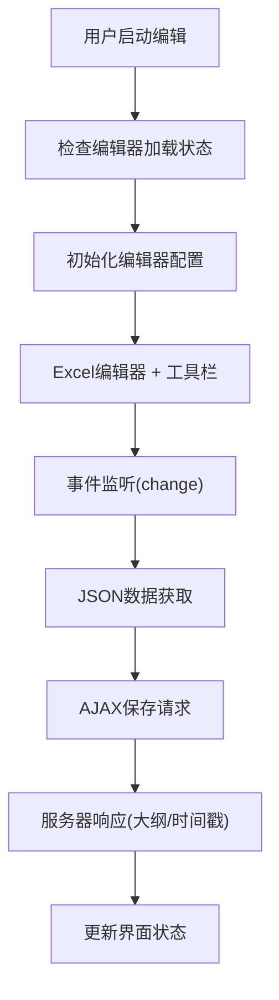

**图表来源**
- [app/templates/doc/edit.html:78-106](file://app/templates/doc/edit.html#L78-L106)
- [app/templates/doc/edit.html:107-133](file://app/templates/doc/edit.html#L107-L133)
- [app/blueprints/doc.py:76-84](file://app/blueprints/doc.py#L76-L84)

**章节来源**
- [app/templates/doc/edit.html:1-167](file://app/templates/doc/edit.html#L1-L167)
- [app/templates/doc/view.html:1-132](file://app/templates/doc/view.html#L1-L132)
- [app/templates/share/view.html:1-46](file://app/templates/share/view.html#L1-L46)
- [app/services/doc_service.py:56-62](file://app/services/doc_service.py#L56-L62)
- [scripts/fetch_vendors.py:51-60](file://scripts/fetch_vendors.py#L51-L60)

### 条件渲染逻辑
条件渲染逻辑通过doc.type判断文档类型，动态加载对应的编辑器和样式：

- **文档类型判断**
  - 文档类型：doc.type == 'doc' - 使用Markdown富文本编辑器
  - 表格类型：doc.type == 'sheet' - 使用Excel在线表格编辑器
  - 模板变量： - 在模板中创建布尔变量

- **动态资源加载**
  - 文档模式：加载toastui-editor样式和脚本
  - 表格模式：加载xspreadsheet样式和脚本
  - 中文本地化：文档模式加载toastui-editor-i18n-zh-cn.js，表格模式加载xspreadsheet-zh-cn.js

- **布局调整**
  - 文档模式：主内容区col-span-7，侧边栏大纲显示
  - 表格模式：主内容区col-span-10，隐藏侧边栏大纲
  - 容器差异：文档模式使用#editor，表格模式使用#sheet

- **JavaScript初始化**
  - 条件判断：const IS_SHEET = {{ 'true' if is_sheet else 'false' }}
  - 模式切换：根据IS_SHEET变量选择对应的初始化逻辑
  - 错误处理：针对不同编辑器提供相应的错误提示

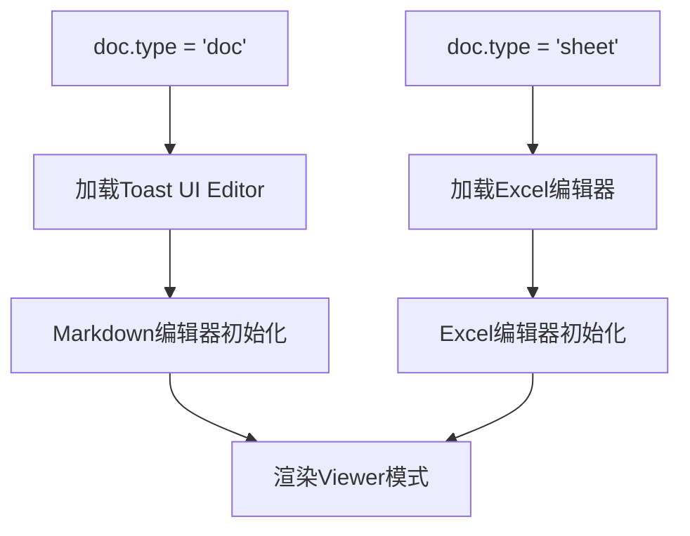

**图表来源**
- [app/templates/doc/edit.html:3, 29:3-3](file://app/templates/doc/edit.html#L3-L3)
- [app/templates/doc/view.html:3, 53:3-3](file://app/templates/doc/view.html#L3-L3)
- [app/models/document.py:10-12](file://app/models/document.py#L10-L12)

**章节来源**
- [app/templates/doc/edit.html:1-167](file://app/templates/doc/edit.html#L1-L167)
- [app/templates/doc/view.html:1-132](file://app/templates/doc/view.html#L1-L132)
- [app/models/document.py:1-98](file://app/models/document.py#L1-L98)

### 高级动画Flash通知系统
**更新** Flash通知系统已从简单静态显示升级为高级动画通知系统，提供更好的用户体验：

- **颜色编码系统**
  - 成功：绿色主题(#ecfdf5) + ✓图标，用于确认操作
  - 错误：红色主题(#fef2f2) + ✕图标，用于错误提示
  - 警告：橙色主题(#fffbeb) + ！图标，用于重要提醒
  - 信息：蓝色主题(#eff6ff) + i图标，用于一般信息
  - **更新** 颜色方案一致性：所有主题颜色保持靛蓝色系的视觉统一
- **自动消失机制**
  - 4秒自动隐藏，提供及时的反馈但不干扰用户操作
  - 支持手动关闭按钮，用户可随时关闭通知
- **动画效果**
  - 进入动画：淡入 + 从上方滑入效果(200ms ease-out)
  - 离开动画：淡出 + 向上方滑出效果(300ms ease-in)
  - 使用x-transition指令实现流畅的Vue.js风格动画
- **定位与层级**
  - 固定定位居中显示(top-4, left-50%, transform:translateX(-50%))
  - z-index: 50确保通知显示在最顶层
  - 响应式宽度(max-w-md)适配不同屏幕尺寸
- **无障碍支持**
  - 关闭按钮提供aria-label="关闭"
  - 颜色对比度符合WCAG标准
  - 支持键盘操作和屏幕阅读器

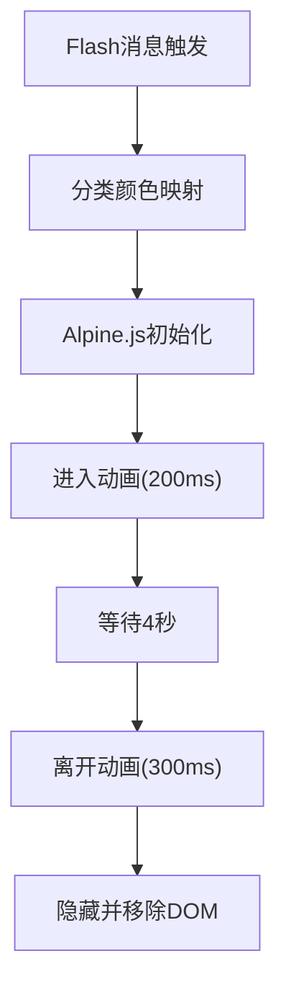

**图表来源**
- [app/templates/components/flash.html:7-12](file://app/templates/components/flash.html#L7-L12)
- [app/templates/components/flash.html:14-22](file://app/templates/components/flash.html#L14-L22)

**章节来源**
- [app/templates/components/flash.html:1-35](file://app/templates/components/flash.html#L1-L35)
- [app/static/js/app.js:16-30](file://app/static/js/app.js#L16-L30)

### 交互式卡片设计
**更新** 知识库创建界面已从传统的单选按钮改为交互式卡片设计，提供更直观的选择体验：

- **卡片布局**
  - 采用网格布局(sm:grid-cols-3)自适应不同屏幕尺寸
  - 每个卡片包含可见性标签、描述文本和视觉指示器
  - 支持点击选择，提供即时视觉反馈
- **视觉反馈系统**
  - 选中状态：加粗边框(2px solid) + 背景色变化
  - 未选中状态：灰色边框(#e2e8f0) + 白色背景
  - 使用x-data和x-bind指令实现动态样式绑定
- **颜色编码**
  - 私密：靛蓝色主题(#4338ca/#eef2ff) - 仅自己可见(#6366f1 → #4338ca)
  - 成员：橙色主题(#f59e0b/#fffbeb) - 已邀请成员可见
  - 公开：绿色主题(#10b981/#ecfdf5) - 全部人可见
- **交互行为**
  - 点击卡片触发JavaScript事件，更新隐藏的radio按钮状态
  - 实时样式更新，提供即时视觉反馈
  - 支持键盘导航和屏幕阅读器支持
- **无障碍设计**
  - 隐藏radio按钮(.sr-only)但仍保持可访问性
  - 使用label元素包裹卡片，支持点击选择
  - 提供清晰的视觉焦点指示

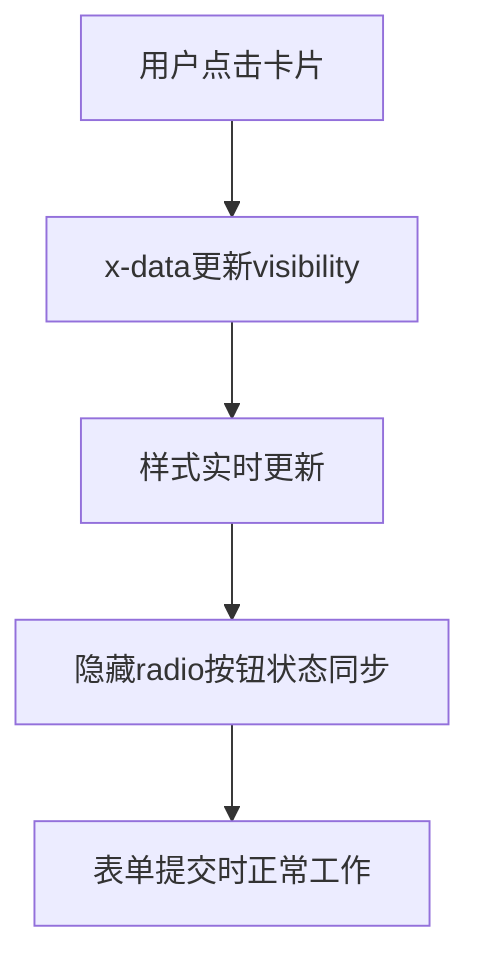

**图表来源**
- [app/templates/kb/new.html:18-38](file://app/templates/kb/new.html#L18-L38)

**章节来源**
- [app/templates/kb/new.html:1-47](file://app/templates/kb/new.html#L1-L47)

### 内容存储格式更新
内容存储格式已从Editor.js JSON格式迁移到Markdown格式，提升兼容性和性能：

- **格式迁移**
  - 编辑器变更：从Editor.js迁移到Toast UI Editor
  - 存储格式：content_json字段实际存储Markdown字符串
  - 兼容性：为避免破坏既有迁移，字段名保持不变
  - 服务层更新：doc_service.update_content直接存储Markdown内容

- **内容处理流程**
  - 编辑保存：编辑器获取Markdown内容，通过AJAX发送到服务器
  - 服务器处理：doc_service.update_content存储Markdown并生成纯文本
  - 视图渲染：编辑器使用viewer模式渲染Markdown为HTML
  - 大纲提取：outline工具从Markdown中提取标题层级

- **优势**
  - 性能提升：Markdown格式比JSON更紧凑，减少存储空间
  - 兼容性：Markdown是通用格式，便于与其他系统集成
  - 可读性：Markdown内容可直接阅读和编辑
  - 工具链：丰富的Markdown工具生态系统

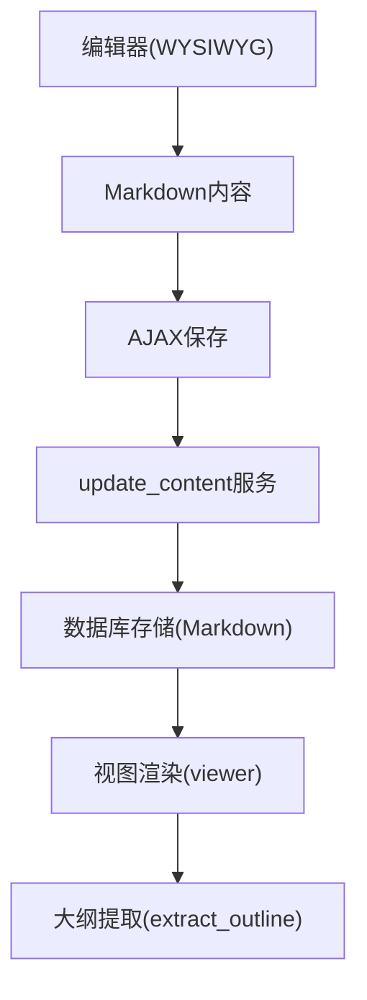

**图表来源**
- [app/services/doc_service.py:56-62](file://app/services/doc_service.py#L56-L62)
- [app/utils/outline.py:69-90](file://app/utils/outline.py#L69-L90)
- [app/blueprints/doc.py:76-84](file://app/blueprints/doc.py#L76-L84)

**章节来源**
- [app/services/doc_service.py:56-62](file://app/services/doc_service.py#L56-L62)
- [app/utils/outline.py:1-9](file://app/utils/outline.py#L1-L9)
- [app/blueprints/doc.py:76-84](file://app/blueprints/doc.py#L76-L84)

### Markdown 渲染引擎集成
- 扩展启用
  - 启用 extra、sane_lists、tables、fenced_code、toc、nl2br 等扩展，满足技术文档常见需求。
- 安全净化
  - 基于 bleach 对 HTML 进行白名单过滤，限制标签与属性，防止 XSS。
- 维基链接替换
  - 将 [[目标|显示]] 形式的维基链接转换为路由占位或红色链接，便于后续路由层改写为真实 URL。
- 返回格式
  - 输出 HTML5 格式字符串，供模板直接渲染。

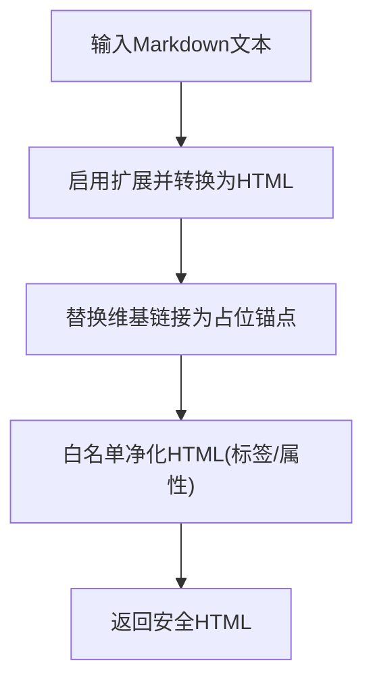

**图表来源**
- [app/utils/markdown.py:31-39](file://app/utils/markdown.py#L31-L39)
- [app/utils/markdown.py:42-66](file://app/utils/markdown.py#L42-L66)

**章节来源**
- [app/utils/markdown.py:1-87](file://app/utils/markdown.py#L1-L87)

### 文档大纲生成与导航菜单
文档大纲提取工具已更新以支持新的Markdown内容格式：

- **大纲提取**
  - 从 Markdown 内容中提取 H1-H3 标题，生成带锚点的层级列表，用于侧边导航或目录索引。
  - 支持跳过代码块内容，避免影响大纲准确性。
  - 使用正则表达式匹配标题格式，提取纯文本内容。
- **纯文本与 Markdown 转换**
  - 支持将 Markdown 内容转为纯文本与简化 Markdown，便于搜索与 AI 使用。
  - 去除行内Markdown格式标记，保留可读文本。
- **在蓝图中的使用**
  - 视图中调用extract_outline函数，将大纲作为模板变量传入，页面模板据此渲染导航菜单。

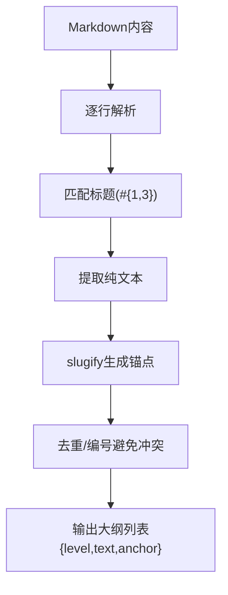

**图表来源**
- [app/utils/outline.py:69-90](file://app/utils/outline.py#L69-L90)
- [app/utils/outline.py:93-143](file://app/utils/outline.py#L93-L143)

**章节来源**
- [app/utils/outline.py:1-143](file://app/utils/outline.py#L1-L143)
- [app/blueprints/doc.py:83](file://app/blueprints/doc.py#L83)

### 页面模板与布局设计
- 主页/仪表盘重定向
  - 未登录用户访问根路径时渲染 landing 页面；登录后重定向至用户仪表盘。
- 知识库详情页
  - 展示知识库树形结构与默认打开的首篇文档，控制编辑/管理权限。
- **更新** 知识库创建页
  - 采用交互式卡片设计替代传统单选按钮
  - 提供实时视觉反馈和更好的用户体验
  - **更新** 颜色方案：私密可见性卡片使用靛蓝色(#4338ca)而非紫色(#6366f1)
- **更新** 文档视图/编辑页
  - 文档模式：集成Toast UI Editor，提供WYSIWYG可视化编辑体验
  - 表格模式：集成Excel/Spreadsheet编辑器，提供Excel-like在线表格编辑
  - 视图页：使用对应编辑器viewer模式渲染内容
  - 分享页：简化版本，同样使用只读模式
  - **更新** 文档类型标识：使用靛蓝色(#4338ca)而非紫色(#6366f1)
- 分享页
  - 生成/撤销分享链接，受权限控制。

**章节来源**
- [app/blueprints/main.py:10-15](file://app/blueprints/main.py#L10-L15)
- [app/blueprints/kb.py:56-72](file://app/blueprints/kb.py#L56-L72)
- [app/blueprints/doc.py:60-66](file://app/blueprints/doc.py#L60-L66)
- [app/blueprints/doc.py:103-124](file://app/blueprints/doc.py#L103-L124)

### 模板变量传递、过滤器与宏定义
- 变量传递
  - 蓝图通过 render_template 传入 doc、kb、tree、outline、can_edit、can_manage、public_kbs 等变量。
- 过滤器
  - 模板中可使用 Jinja2 内置过滤器（如 safe、default、urlencode 等），也可在应用工厂中注册自定义过滤器。
- 宏定义
  - 可在公共模板中定义宏，复用按钮、表单控件、列表项等 UI 片段，减少重复代码。

**章节来源**
- [app/blueprints/doc.py:51-54](file://app/blueprints/doc.py#L51-L54)
- [app/blueprints/kb.py:68-72](file://app/blueprints/kb.py#L68-L72)
- [app/blueprints/main.py:14](file://app/blueprints/main.py#L14)

### 前后端数据交互与 AJAX 请求
**更新** AJAX请求已更新以支持新的编辑器和内容格式：

- **编辑器状态管理**
  - 保存状态：实时显示保存状态(未变更/已修改/已保存/保存失败)
  - 快捷键支持：Ctrl+S快速保存文档
  - 错误处理：完善的错误检测和用户友好的错误提示
- **AJAX保存**
  - 请求格式：POST请求，JSON负载包含title、content_json、privacy
  - 响应格式：JSON包含ok标志、大纲数据、更新时间
  - 状态更新：根据响应更新界面状态和颜色
- **权限控制**
  - 蓝图在进入编辑/管理相关路由前进行权限校验，未授权返回 403。
- **CSRF保护增强**
  - JavaScript自动为fetch请求添加CSRF令牌
  - 支持轻量级后备toast通知系统

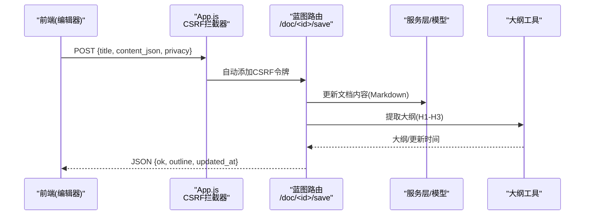

**图表来源**
- [app/blueprints/doc.py:69-84](file://app/blueprints/doc.py#L69-L84)
- [app/static/js/app.js:3-14](file://app/static/js/app.js#L3-L14)
- [app/utils/outline.py:69-90](file://app/utils/outline.py#L69-L90)

**章节来源**
- [app/blueprints/doc.py:69-84](file://app/blueprints/doc.py#L69-L84)
- [app/static/js/app.js:1-32](file://app/static/js/app.js#L1-L32)

### 组件设计与样式规范
**更新** 组件设计已增强动画效果和交互体验：

- **组件嵌入**
  - 基础模板通过 include 引入 navbar、flash、footer，形成一致的头部、消息提示与底部布局。
- **样式规范**
  - 字体：Inter；UI 框架：TailwindCSS；代码高亮：highlight.js GitHub 主题。
  - 颜色方案：使用 Tailwind 的 slate 系列，保证浅色背景与文本对比度。
  - 动画系统：Alpine.js提供流畅的过渡效果
  - 编辑器样式：Excel编辑器圆角边框设计
  - 条件样式：根据文档类型动态应用不同的样式类
  - **更新** 颜色方案一致性：所有交互元素使用靛蓝色(#4338ca)而非紫色(#6366f1)
- **响应式设计**
  - 使用 flex 布局与 min-h-full，使内容区域随内容增长而撑开，同时保持页脚贴底。
- **无障碍支持**
  - Flash通知提供aria-label和键盘支持
  - 交互式卡片支持键盘导航和屏幕阅读器
  - 颜色对比度符合WCAG标准
  - 编辑器支持中文本地化

**章节来源**
- [app/templates/base.html:8-11](file://app/templates/base.html#L8-L11)
- [app/templates/base.html:17-24](file://app/templates/base.html#L17-L24)
- [app/templates/components/flash.html:23-29](file://app/templates/components/flash.html#L23-L29)
- [app/templates/kb/new.html:20-36](file://app/templates/kb/new.html#L20-L36)
- [app/templates/doc/edit.html:39-43](file://app/templates/doc/edit.html#L39-L43)
- [scripts/fetch_vendors.py:23-62](file://scripts/fetch_vendors.py#L23-L62)

## 依赖分析
- 应用工厂与蓝图
  - 应用工厂注册 CSRF、登录管理、数据库与迁移等扩展，并注册各蓝图。
  - 错误处理器统一渲染错误页面模板。
- 模板上下文
  - 上下文处理器向所有模板注入站点名等全局变量。
- 静态资源
  - 第三方库通过脚本一次性拉取至 vendor 目录，避免运行时网络依赖。
- **更新** 前端交互增强
  - Alpine.js提供轻量级前端交互框架
  - App.js增强CSRF保护和后备通知系统
- **更新** Excel/Spreadsheet编辑器依赖
  - xspreadsheet.css：在线表格样式
  - xspreadsheet.js：在线表格核心功能
  - xspreadsheet-zh-cn.js：中文本地化支持
- **更新** 条件渲染依赖
  - DocumentType枚举：定义文档类型('doc'/'sheet')
  - 模板变量：is_sheet布尔变量
- **更新** 颜色方案依赖
  - 靛蓝色主题(#4338ca)统一应用于所有交互元素
  - 私密可见性卡片从紫色(#6366f1)迁移到靛蓝色(#4338ca)

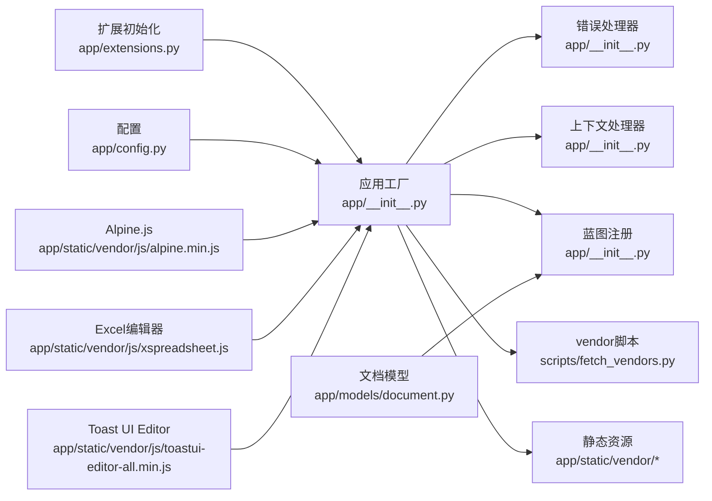

**图表来源**
- [app/extensions.py:8-11](file://app/extensions.py#L8-L11)
- [app/__init__.py:39-53](file://app/__init__.py#L39-L53)
- [app/__init__.py:76-87](file://app/__init__.py#L76-L87)
- [app/__init__.py:90-95](file://app/__init__.py#L90-L95)
- [app/static/vendor/js/alpine.min.js](file://app/static/vendor/js/alpine.min.js)
- [app/static/vendor/js/xspreadsheet.js](file://app/static/vendor/js/xspreadsheet.js)
- [app/static/vendor/js/toastui-editor-all.min.js](file://app/static/vendor/js/toastui-editor-all.min.js)
- [app/models/document.py](file://app/models/document.py)
- [scripts/fetch_vendors.py:74-92](file://scripts/fetch_vendors.py#L74-L92)

**章节来源**
- [app/extensions.py:1-16](file://app/extensions.py#L1-L16)
- [app/__init__.py:39-53](file://app/__init__.py#L39-L53)
- [app/__init__.py:76-87](file://app/__init__.py#L76-L87)
- [app/__init__.py:90-95](file://app/__init__.py#L90-L95)
- [scripts/fetch_vendors.py:74-92](file://scripts/fetch_vendors.py#L74-L92)

## 性能考虑
- 静态资源优化
  - 使用压缩版 CSS/JS，结合 CDN 缓存与本地 vendor 目录，减少加载时间。
  - Excel/Spreadsheet编辑器采用一体化版本，避免依赖缺失问题。
  - 条件加载策略，仅加载当前文档类型的编辑器资源。
- 模板渲染
  - 将计算密集型逻辑（如 Markdown 渲染、大纲提取）放在蓝图层，模板仅做展示，降低模板复杂度。
- 分页与查询
  - 使用分页助手限制查询规模，避免一次性加载过多数据。
- 前端交互
  - 利用 Alpine.js 实现轻量前端行为，避免引入重型框架导致体积膨胀。
- **更新** 动画性能优化
  - 使用硬件加速的CSS变换和透明度动画
  - 合理的动画持续时间和缓动函数
  - 避免复杂的布局重排
- **更新** 编辑器性能优化
  - 编辑器高度固定，避免布局重计算
  - 只读模式使用viewer配置，减少不必要的DOM操作
  - 中文本地化文件按需加载
  - 条件渲染避免加载不需要的编辑器资源
- **更新** 颜色方案优化
  - 靛蓝色主题(#4338ca)提供更好的视觉一致性
  - 减少颜色变体，简化样式维护

**章节来源**
- [scripts/fetch_vendors.py:51-60](file://scripts/fetch_vendors.py#L51-L60)
- [app/utils/markdown.py:31-39](file://app/utils/markdown.py#L31-L39)
- [app/utils/outline.py:34-55](file://app/utils/outline.py#L34-L55)
- [app/utils/pagination.py:5-9](file://app/utils/pagination.py#L5-L9)
- [app/templates/doc/edit.html:75-96](file://app/templates/doc/edit.html#L75-L96)

## 故障排查指南
- 403/404/500 错误页面
  - 应用工厂已注册错误处理器，统一渲染对应错误模板。
- CSRF 校验失败
  - 确认基础模板中已注入 CSRF Token，并在表单中正确携带。
- **更新** Flash通知问题
  - 检查Alpine.js是否正确加载
  - 确认x-data、x-show、x-transition指令语法正确
  - 验证CSS中[x-cloak]样式规则
- **更新** 交互式卡片问题
  - 确认x-data和x-bind指令正确绑定
  - 检查样式计算表达式语法
  - 验证radio按钮状态同步
- **更新** 颜色方案问题
  - 检查私密可见性卡片是否使用靛蓝色(#4338ca)而非紫色(#6366f1)
  - 确认文档类型标识颜色是否正确
  - 验证Flash通知颜色映射一致性
- **更新** Excel编辑器问题
  - 编辑器未加载：检查网络面板中xspreadsheet.js是否200 OK
  - 容器缺失：确认#sheet容器存在且有明确高度
  - 中文显示：检查xspreadsheet-zh-cn.js是否正确加载
  - 数据解析失败：检查content_json字段的JSON格式是否正确
  - 模式切换问题：确认IS_SHEET变量值与文档类型匹配
- **更新** 条件渲染问题
  - 模板变量未定义：确认正确设置
  - 文档类型错误：检查doc.type值是否为'doc'或'sheet'
  - 样式类冲突：确认col-span类名与当前模式匹配
- Markdown 渲染异常
  - 检查 Markdown 扩展是否启用，以及 bleach 白名单是否覆盖所需标签/属性。
- 大纲为空
  - 确认 Markdown 内容格式正确，且包含有效的标题格式；检查slugify与锚点生成逻辑。

**章节来源**
- [app/__init__.py:76-87](file://app/__init__.py#L76-L87)
- [app/templates/base.html:6](file://app/templates/base.html#L6)
- [app/templates/components/flash.html:14-22](file://app/templates/components/flash.html#L14-L22)
- [app/templates/kb/new.html:18-38](file://app/templates/kb/new.html#L18-L38)
- [app/templates/doc/edit.html:60-68](file://app/templates/doc/edit.html#L60-L68)
- [app/utils/markdown.py:10-25](file://app/utils/markdown.py#L10-L25)
- [app/utils/outline.py:22-31](file://app/utils/outline.py#L22-L31)

## 结论
My Wiki 的模板系统以基础模板为核心，配合蓝图层的数据准备与工具层的渲染/提取能力，实现了清晰的职责分离与良好的可维护性。Excel/Spreadsheet在线表格编辑器的集成显著提升了文档编辑体验，提供专业的Excel-like在线表格功能。条件渲染逻辑通过doc.type判断文档类型，动态加载对应的编辑器资源，实现了文档与表格的统一管理。内容存储格式从Editor.js迁移到Markdown格式，提升了性能和兼容性。**更新** 通过引入高级动画Flash通知系统和交互式卡片设计，显著提升了用户体验。**更新** 颜色方案一致性改进确保所有交互元素使用统一的靛蓝色主题，提升了视觉统一性和品牌识别度。通过 Alpine.js 动画系统、响应式样式与轻量前端交互，系统在功能与体验上达到平衡。建议后续完善页面模板与组件宏定义，进一步提升可复用性与一致性。

## 附录
- 模板变量清单（示例）
  - 全局：site_name
  - 文档视图：doc、kb、tree、outline、can_edit、can_manage
  - 知识库列表：kbs、tab
  - 管理统计：stats
  - 主页：public_kbs
  - Flash通知：messages(with_categories=true)
  - 知识库创建：form(表单数据)
  - 编辑器：content_json(Markdown格式)
  - 条件渲染：is_sheet(布尔值)
  - 文档类型：doc.type('doc'/'sheet')
- 建议
  - 在基础模板中预留更多块位（如 head_extra/body_extra），便于页面级定制。
  - 在应用工厂中注册常用过滤器与全局宏，减少模板重复代码。
  - 对热点页面增加缓存策略（如基于 ETag 或片段缓存）。
  - **更新** 考虑为Flash通知系统添加配置选项，允许用户自定义显示时长
  - **更新** 扩展交互式卡片设计到其他选择场景，提升整体用户体验
  - **更新** 考虑添加编辑器主题切换功能，支持深色模式
  - **更新** 优化编辑器懒加载，提升页面初始加载速度
  - **更新** 添加文档类型切换功能，允许用户在文档和表格间转换
  - **更新** 继续维护颜色方案一致性，确保所有新功能都使用靛蓝色主题