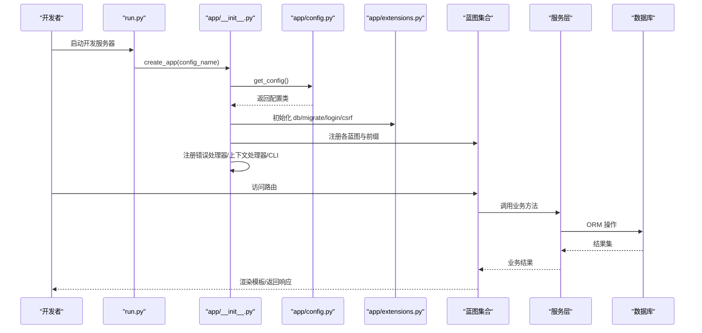
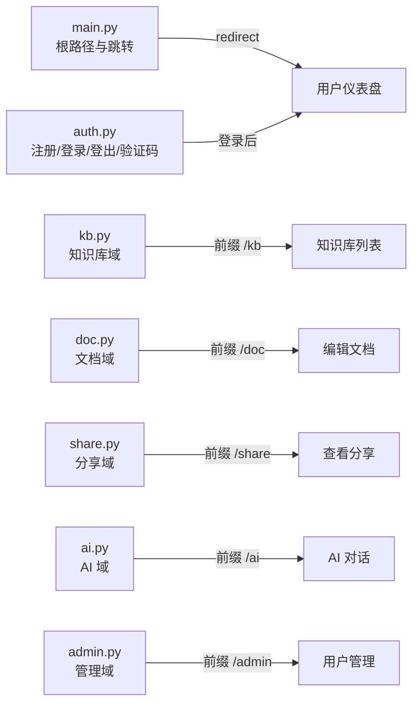
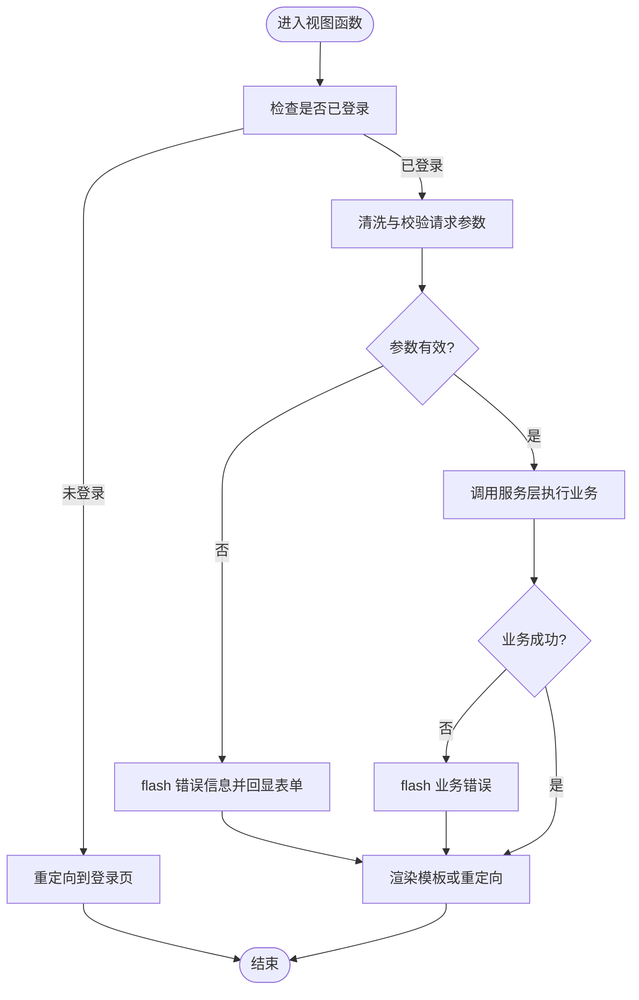
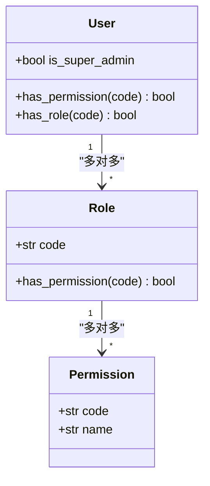
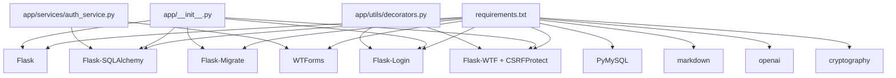

# 代码规范

<cite>
**本文引用的文件**
- [app/__init__.py](file://app/__init__.py)
- [app/config.py](file://app/config.py)
- [app/extensions.py](file://app/extensions.py)
- [run.py](file://run.py)
- [wsgi.py](file://wsgi.py)
- [app/blueprints/__init__.py](file://app/blueprints/__init__.py)
- [app/blueprints/main.py](file://app/blueprints/main.py)
- [app/blueprints/auth.py](file://app/blueprints/auth.py)
- [app/models/__init__.py](file://app/models/__init__.py)
- [app/models/user.py](file://app/models/user.py)
- [app/services/auth_service.py](file://app/services/auth_service.py)
- [app/utils/decorators.py](file://app/utils/decorators.py)
- [app/utils/security.py](file://app/utils/security.py)
- [app/cli.py](file://app/cli.py)
- [requirements.txt](file://requirements.txt)
</cite>

## 目录
1. [引言](#引言)
2. [项目结构](#项目结构)
3. [核心组件](#核心组件)
4. [架构总览](#架构总览)
5. [详细组件分析](#详细组件分析)
6. [依赖分析](#依赖分析)
7. [性能考虑](#性能考虑)
8. [故障排查指南](#故障排查指南)
9. [结论](#结论)
10. [附录](#附录)

## 引言
本文件旨在为 My Wiki 项目建立统一的 Python 代码风格与 Flask 应用开发规范，覆盖命名约定、导入顺序、注释规范、蓝图组织、视图函数设计、模板使用、装饰器与权限控制、安全实践、格式化与静态分析工具配置、代码审查清单、模块导入最佳实践、错误处理与日志记录等。目标是提升代码一致性、可读性与可维护性，并确保安全与性能。

## 项目结构
My Wiki 采用典型的 Flask 应用分层组织方式：
- 应用工厂与配置：通过应用工厂创建 Flask 实例，集中配置加载与扩展初始化。
- 蓝图模块：按功能域划分蓝图（如认证、用户、知识库、AI、分享、主入口），每个蓝图独立注册并可设置 URL 前缀。
- 模型层：基于 SQLAlchemy 的 ORM 模型，定义用户、角色、权限及知识库相关实体。
- 服务层：封装业务逻辑，避免在视图中直接操作数据库或外部服务。
- 工具与安全：通用装饰器与安全辅助函数，统一权限校验与令牌生成。
- CLI：自定义命令，用于数据库初始化、默认角色/权限注入与超级管理员创建。
- 运行入口：开发与生产分别提供入口脚本，支持环境变量驱动的配置切换。

```mermaid
graph TB
subgraph "应用入口"
RUN["run.py"]
WSGI["wsgi.py"]
end
subgraph "应用工厂"
APP_INIT["app/__init__.py"]
CFG["app/config.py"]
EXT["app/extensions.py"]
end
subgraph "蓝图"
BP_MAIN["app/blueprints/main.py"]
BP_AUTH["app/blueprints/auth.py"]
BP_ALL["app/blueprints/*"]
end
subgraph "模型与服务"
MODELS_PKG["app/models/__init__.py"]
MODELS_USER["app/models/user.py"]
SVC_AUTH["app/services/auth_service.py"]
end
subgraph "工具与安全"
DECOR["app/utils/decorators.py"]
SEC["app/utils/security.py"]
end
subgraph "CLI"
CLI["app/cli.py"]
end
RUN --> APP_INIT
WSGI --> APP_INIT
APP_INIT --> CFG
APP_INIT --> EXT
APP_INIT --> BP_ALL
BP_MAIN --> SVC_AUTH
BP_AUTH --> SVC_AUTH
SVC_AUTH --> MODELS_USER
MODELS_PKG --> MODELS_USER
DECOR --> BP_AUTH
CLI --> MODELS_PKG
```

图表来源
- [app/__init__.py:11-28](file://app/__init__.py#L11-L28)
- [app/config.py:80-83](file://app/config.py#L80-L83)
- [app/extensions.py:8-11](file://app/extensions.py#L8-L11)
- [app/blueprints/main.py:1-16](file://app/blueprints/main.py#L1-L16)
- [app/blueprints/auth.py:1-85](file://app/blueprints/auth.py#L1-L85)
- [app/models/__init__.py:1-38](file://app/models/__init__.py#L1-L38)
- [app/models/user.py:55-104](file://app/models/user.py#L55-L104)
- [app/services/auth_service.py:1-57](file://app/services/auth_service.py#L1-L57)
- [app/utils/decorators.py:1-33](file://app/utils/decorators.py#L1-L33)
- [app/utils/security.py:1-8](file://app/utils/security.py#L1-L8)
- [app/cli.py:1-114](file://app/cli.py#L1-L114)

章节来源
- [app/__init__.py:11-28](file://app/__init__.py#L11-L28)
- [app/config.py:80-83](file://app/config.py#L80-L83)
- [app/extensions.py:8-11](file://app/extensions.py#L8-L11)
- [app/blueprints/main.py:1-16](file://app/blueprints/main.py#L1-L16)
- [app/blueprints/auth.py:1-85](file://app/blueprints/auth.py#L1-L85)
- [app/models/__init__.py:1-38](file://app/models/__init__.py#L1-L38)
- [app/models/user.py:55-104](file://app/models/user.py#L55-L104)
- [app/services/auth_service.py:1-57](file://app/services/auth_service.py#L1-L57)
- [app/utils/decorators.py:1-33](file://app/utils/decorators.py#L1-L33)
- [app/utils/security.py:1-8](file://app/utils/security.py#L1-L8)
- [app/cli.py:1-114](file://app/cli.py#L1-L114)

## 核心组件
- 应用工厂与注册流程：集中初始化扩展、注册蓝图、错误处理器、上下文处理器与 CLI。
- 配置体系：基于环境变量的多配置映射，支持开发、生产与测试。
- 扩展单例：统一管理 SQLAlchemy、Migrate、LoginManager、CSRFProtect。
- 权限与角色模型：RBAC 模型，支持用户-角色-权限继承与超级管理员豁免。
- 安全装饰器：统一的权限校验与未登录拦截。
- CLI 初始化：自动建表、默认角色/权限注入与超级管理员保障。

章节来源
- [app/__init__.py:39-74](file://app/__init__.py#L39-L74)
- [app/config.py:15-83](file://app/config.py#L15-L83)
- [app/extensions.py:8-17](file://app/extensions.py#L8-L17)
- [app/models/user.py:55-104](file://app/models/user.py#L55-L104)
- [app/utils/decorators.py:8-33](file://app/utils/decorators.py#L8-L33)
- [app/cli.py:61-96](file://app/cli.py#L61-L96)

## 架构总览
应用通过工厂函数创建 Flask 实例，加载配置，初始化扩展，注册蓝图与错误处理，注入全局变量，并挂载 CLI 命令。蓝图按功能域拆分，视图函数仅负责请求处理与响应渲染，业务逻辑下沉到服务层，模型层专注数据持久化与关系定义。



图表来源
- [run.py:7-16](file://run.py#L7-L16)
- [app/__init__.py:11-28](file://app/__init__.py#L11-L28)
- [app/config.py:80-83](file://app/config.py#L80-L83)
- [app/extensions.py:8-11](file://app/extensions.py#L8-L11)
- [app/blueprints/main.py:10-16](file://app/blueprints/main.py#L10-L16)
- [app/blueprints/auth.py:19-85](file://app/blueprints/auth.py#L19-L85)
- [app/services/auth_service.py:21-57](file://app/services/auth_service.py#L21-L57)

## 详细组件分析

### Python 代码风格与项目规范
- PEP8 遵循
  - 行宽：建议不超过 100 列；长表达式分行时保持缩进对齐。
  - 空行：模块级函数与类之间空两行；方法之间空一行；逻辑段落间空一行。
  - 缩进：统一使用 4 空格，不混用制表符。
  - 空格：逗号后空一格；运算符两侧留空格；括号内不冗余空格。
  - 换行：长列表/字典/调用参数分行时，采用悬挂缩进并在行首对齐。
- 命名约定
  - 模块与包：小写短名称，避免下划线（蓝图与服务模块除外）。
  - 类名：大驼峰（CamelCase），如 User、KnowledgeBase。
  - 函数与方法：小写下划线（snake_case），如 list_public_kbs、set_password。
  - 常量：全大写+下划线，如 DEFAULT_PAGE_SIZE、CHAT_MODEL。
  - 私有成员：以下划线开头，如 _ensure_instance_dirs。
- 导入顺序
  - 标准库 → 第三方库 → 项目内相对导入（从同一包内的模块导入时使用点导入）。
  - 每组内部按字母序排序，组间以空行分隔。
- 注释规范
  - 模块级文档字符串：简述模块职责与用途。
  - 函数/方法注释：描述输入、输出、异常与副作用；复杂逻辑提供步骤说明。
  - 行内注释：仅在必要处解释“为什么”而非“是什么”。

章节来源
- [app/__init__.py:11-28](file://app/__init__.py#L11-L28)
- [app/config.py:15-83](file://app/config.py#L15-L83)
- [app/models/user.py:55-104](file://app/models/user.py#L55-L104)
- [app/services/auth_service.py:21-57](file://app/services/auth_service.py#L21-L57)

### Flask 蓝图组织原则
- 域划分：按功能域拆分蓝图，如认证、用户、知识库、AI、分享、主入口。
- URL 前缀：为不同域设置清晰前缀，便于路由识别与权限隔离。
- 模板目录：蓝图可指定模板目录，避免模板命名冲突。
- 注册顺序：先注册通用蓝图（如 main），再注册带前缀的域蓝图。



图表来源
- [app/__init__.py:56-74](file://app/__init__.py#L56-L74)
- [app/blueprints/main.py:10-16](file://app/blueprints/main.py#L10-L16)
- [app/blueprints/auth.py:7-85](file://app/blueprints/auth.py#L7-L85)

章节来源
- [app/__init__.py:56-74](file://app/__init__.py#L56-L74)
- [app/blueprints/main.py:1-16](file://app/blueprints/main.py#L1-L16)
- [app/blueprints/auth.py:1-85](file://app/blueprints/auth.py#L1-L85)

### 视图函数设计模式
- 单一职责：仅处理请求参数、调用服务、渲染模板或返回 JSON。
- 参数清洗：对表单字段进行 strip、类型转换与长度/格式校验。
- 错误反馈：使用 flash 传递错误信息，模板侧统一展示。
- 登录保护：使用 @login_required 或自定义装饰器进行权限校验。
- 响应类型：根据场景选择重定向、渲染模板或返回 JSON。



图表来源
- [app/blueprints/auth.py:19-85](file://app/blueprints/auth.py#L19-L85)
- [app/services/auth_service.py:21-57](file://app/services/auth_service.py#L21-L57)

章节来源
- [app/blueprints/auth.py:19-85](file://app/blueprints/auth.py#L19-L85)
- [app/services/auth_service.py:21-57](file://app/services/auth_service.py#L21-L57)

### 模板使用规范
- 全局变量：通过上下文处理器注入站点名称等全局数据。
- 错误页面：针对 403、404、500 统一渲染错误模板。
- 表单渲染：表单字段值回显，错误消息通过 flash 展示。
- 静态资源：遵循 Flask 默认静态目录策略，避免硬编码路径。

章节来源
- [app/__init__.py:90-96](file://app/__init__.py#L90-L96)
- [app/__init__.py:76-88](file://app/__init__.py#L76-L88)

### 装饰器使用规范与权限控制
- 登录必经：对需要登录的路由使用 @login_required。
- 自定义权限：提供 super_admin_required 与 permission_required 装饰器，前者仅允许超级管理员，后者支持细粒度权限码。
- 权限模型：用户具备超级管理员时拥有全部权限；否则由其角色继承的权限决定。



图表来源
- [app/models/user.py:55-104](file://app/models/user.py#L55-L104)

章节来源
- [app/utils/decorators.py:8-33](file://app/utils/decorators.py#L8-L33)
- [app/models/user.py:55-104](file://app/models/user.py#L55-L104)

### 安全编码实践
- 会话安全：启用 HttpOnly、设置 SameSite=Lax、合理设置 Cookie 有效期。
- CSRF 防护：全局启用 CSRFProtect，配合 WTForms 使用隐藏字段。
- 密码存储：使用 Werkzeug 提供的安全哈希，禁止明文存储。
- Token 生成：使用 secrets.token_urlsafe 生成安全链接令牌。
- 输入验证：服务层对用户名、邮箱、密码进行正则与长度校验。
- 最小权限：通过 RBAC 控制路由与操作权限，避免越权访问。

章节来源
- [app/config.py:28-31](file://app/config.py#L28-L31)
- [app/extensions.py:14-16](file://app/extensions.py#L14-L16)
- [app/models/user.py:81-85](file://app/models/user.py#L81-L85)
- [app/utils/security.py:5-8](file://app/utils/security.py#L5-L8)
- [app/services/auth_service.py:13-33](file://app/services/auth_service.py#L13-L33)

### 代码格式化与静态分析
- 格式化工具：推荐使用 ruff 或 black 配合 flake8/isort。
- 导入排序：使用 isort，按标准库、第三方、本地导入分组并排序。
- 静态分析：ruff/flake8/pylint 检查命名、复杂度、未使用变量与潜在问题。
- 配置文件：在仓库根目录添加 ruff.toml、.flake8、.isort.cfg，CI 中强制执行。

章节来源
- [requirements.txt:1-22](file://requirements.txt#L1-L22)

### 代码审查检查清单
- 风格与一致性：命名、缩进、空行、注释是否符合规范。
- 安全：是否启用 CSRF、HttpOnly、SameSite；密码是否哈希；敏感信息是否脱敏。
- 权限：是否正确使用 @login_required 与自定义权限装饰器。
- 错误处理：是否捕获并处理异常；错误信息是否友好且不泄露细节。
- 性能：避免 N+1 查询；合理使用延迟加载与联结查询。
- 可测试性：服务层是否解耦；是否便于单元测试与集成测试。

章节来源
- [app/utils/decorators.py:8-33](file://app/utils/decorators.py#L8-L33)
- [app/services/auth_service.py:21-57](file://app/services/auth_service.py#L21-L57)

### 模块导入最佳实践
- 优先使用绝对导入，同包内相对导入使用点导入。
- 在模块顶部集中导入，按标准库、第三方、项目内顺序分组。
- 避免循环导入：将相互依赖的逻辑拆分到独立模块或延迟导入。
- 蓝图内部导入：在函数内导入避免跨蓝图循环。

章节来源
- [app/__init__.py:46-53](file://app/__init__.py#L46-L53)
- [app/blueprints/auth.py:5-7](file://app/blueprints/auth.py#L5-L7)

### 错误处理模式
- 视图层：对业务异常捕获并 flash 错误信息，返回友好页面。
- 应用层：注册统一错误处理器，渲染错误模板并返回对应状态码。
- 数据库层：捕获连接/约束异常，转换为业务异常或统一错误响应。

章节来源
- [app/__init__.py:76-88](file://app/__init__.py#L76-L88)
- [app/services/auth_service.py:17-18](file://app/services/auth_service.py#L17-L18)

### 日志记录规范
- 开发：使用 Flask 的 app.logger 输出调试与错误信息。
- 生产：结合 WSGI 服务器与系统日志，避免在响应中输出敏感日志。
- 敏感信息：不要记录密码、Token、完整请求体；仅记录必要上下文。

章节来源
- [app/__init__.py:90-96](file://app/__init__.py#L90-L96)

## 依赖分析
- 外部依赖：Flask 生态链（SQLAlchemy、Migrate、Login、CSRF、WTForms）、数据库驱动、Markdown、Cryptography、OpenAI SDK 等。
- 内部依赖：蓝图依赖服务层，服务层依赖模型层与扩展；装饰器与安全工具被蓝图与服务共享使用。



图表来源
- [requirements.txt:1-22](file://requirements.txt#L1-L22)
- [app/__init__.py:56-74](file://app/__init__.py#L56-L74)
- [app/services/auth_service.py:1-11](file://app/services/auth_service.py#L1-L11)
- [app/utils/decorators.py:1-6](file://app/utils/decorators.py#L1-L6)

章节来源
- [requirements.txt:1-22](file://requirements.txt#L1-L22)
- [app/__init__.py:56-74](file://app/__init__.py#L56-L74)
- [app/services/auth_service.py:1-11](file://app/services/auth_service.py#L1-L11)
- [app/utils/decorators.py:1-6](file://app/utils/decorators.py#L1-L6)

## 性能考虑
- 数据库连接池：启用 pool_pre_ping，合理设置 pool_recycle，减少连接失效导致的失败。
- 分页与限制：默认分页大小与最大上传大小需与前端交互一致，避免过大请求。
- 查询优化：避免 N+1 查询，使用 joined/selectin 加载策略；对高频查询建立索引。
- 缓存：对静态资源与热点数据使用缓存，减少重复计算与数据库压力。
- CSRF 与会话：合理设置 SameSite 与 HttpOnly，平衡安全性与兼容性。

章节来源
- [app/config.py:23-26](file://app/config.py#L23-L26)
- [app/config.py:52-53](file://app/config.py#L52-L53)

## 故障排查指南
- 无法启动：检查环境变量与配置映射，确认 FLASK_CONFIG 与 SECRET_KEY 设置。
- 登录失败：核对用户名/邮箱正则、密码哈希与 is_active 状态；检查 CSRF 令牌与 Cookie 设置。
- 权限不足：确认用户角色与权限分配，检查装饰器是否正确应用。
- 数据库异常：查看连接池配置与迁移状态，确认表结构与外键约束。
- CLI 初始化：确认 init-db 是否成功创建表、默认角色/权限与超级管理员。

章节来源
- [app/config.py:80-83](file://app/config.py#L80-L83)
- [app/services/auth_service.py:44-57](file://app/services/auth_service.py#L44-L57)
- [app/utils/decorators.py:8-33](file://app/utils/decorators.py#L8-L33)
- [app/cli.py:61-96](file://app/cli.py#L61-L96)

## 结论
通过统一的代码风格、蓝图组织、权限模型与安全实践，My Wiki 项目能够在保证可维护性的同时提升安全性与性能。建议在 CI 中强制执行格式化与静态分析，并持续完善测试覆盖与文档更新。

## 附录
- 运行与部署
  - 开发：通过 run.py 启动，支持环境变量覆盖配置。
  - 生产：通过 wsgi.py 提供给 WSGI 服务器。
- CLI 命令
  - init-db：初始化数据库、默认角色/权限与超级管理员。
  - create-user：创建普通用户并分配默认角色。

章节来源
- [run.py:7-16](file://run.py#L7-L16)
- [wsgi.py:9](file://wsgi.py#L9)
- [app/cli.py:61-114](file://app/cli.py#L61-L114)