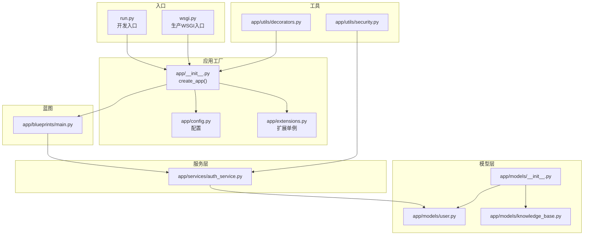
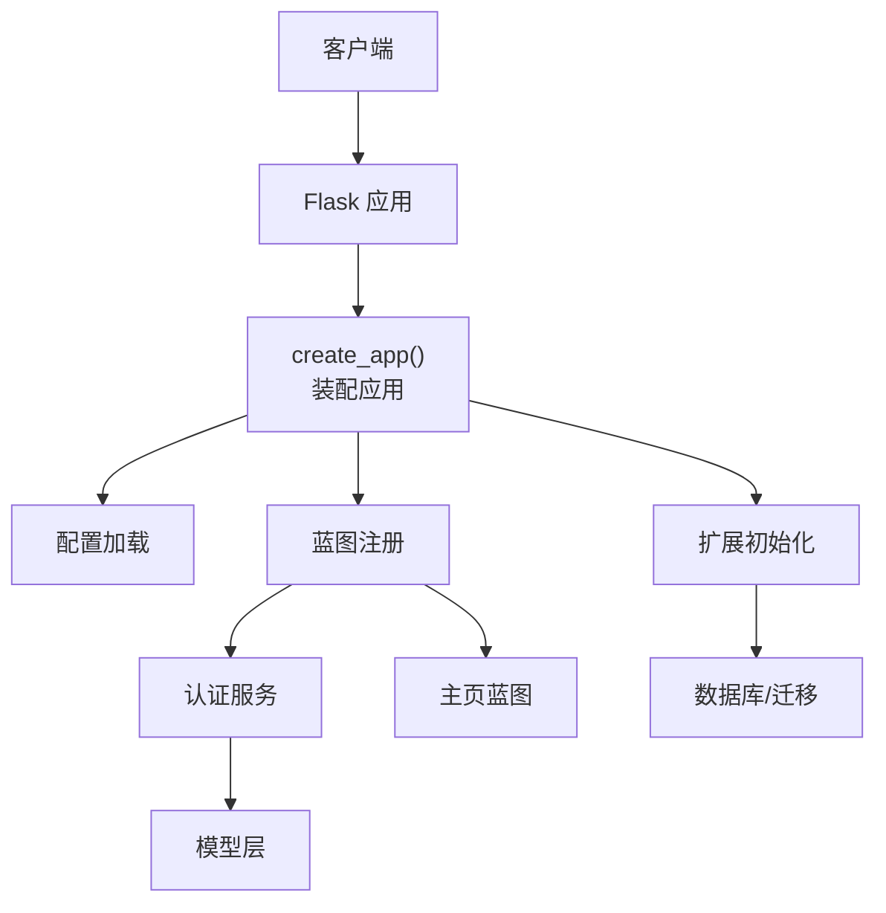
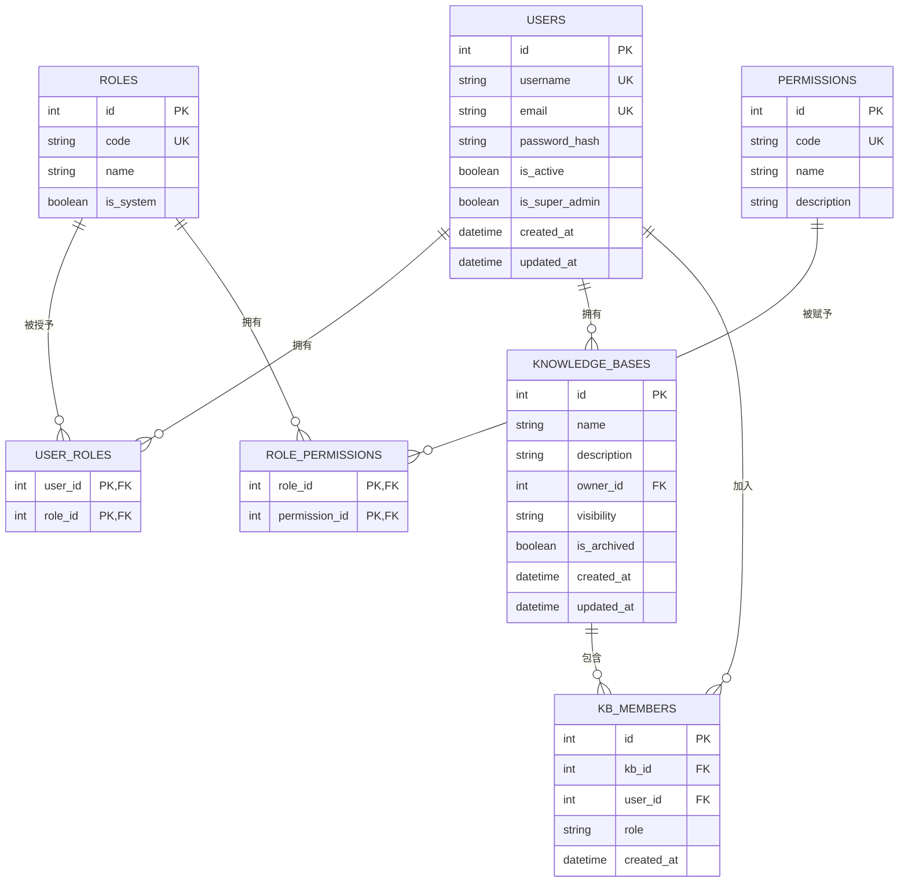
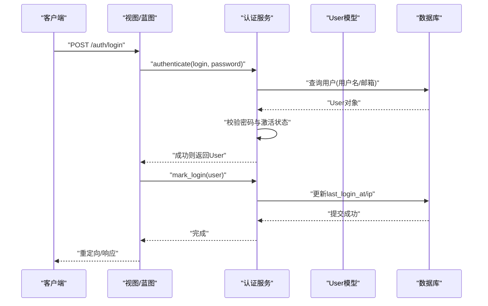
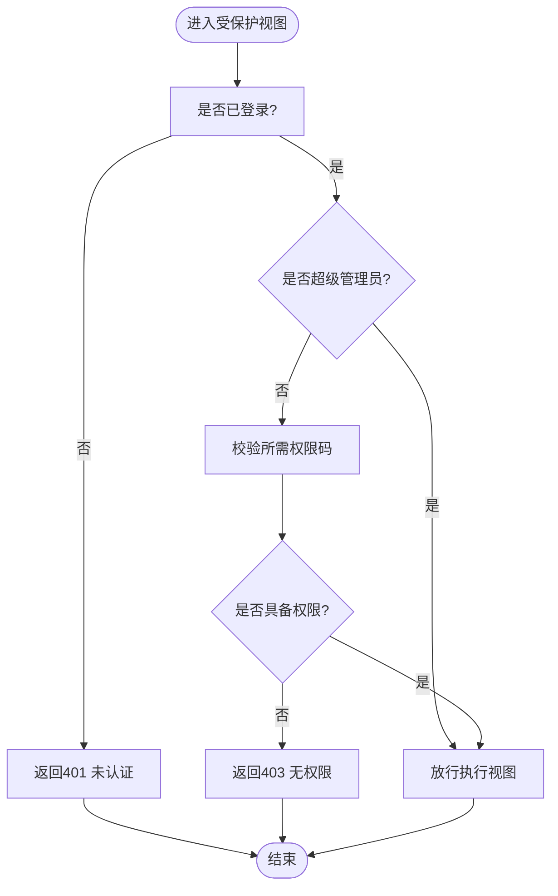
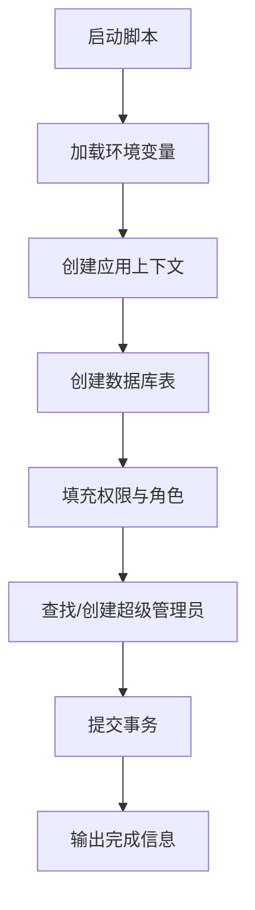
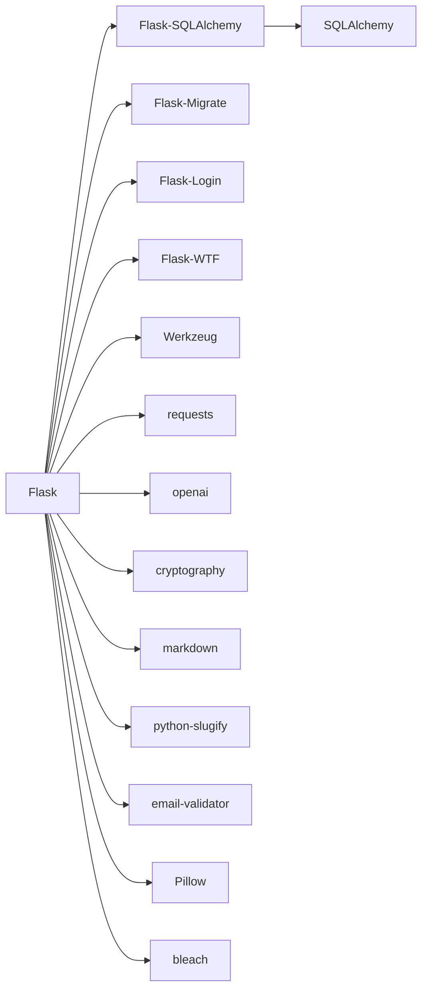

# 开发指南

<cite>
**本文引用的文件**
- [README.md](file://README.md)
- [requirements.txt](file://requirements.txt)
- [run.py](file://run.py)
- [wsgi.py](file://wsgi.py)
- [app/__init__.py](file://app/__init__.py)
- [app/config.py](file://app/config.py)
- [app/extensions.py](file://app/extensions.py)
- [app/utils/security.py](file://app/utils/security.py)
- [app/utils/decorators.py](file://app/utils/decorators.py)
- [app/models/__init__.py](file://app/models/__init__.py)
- [app/models/user.py](file://app/models/user.py)
- [app/models/knowledge_base.py](file://app/models/knowledge_base.py)
- [app/services/auth_service.py](file://app/services/auth_service.py)
- [app/blueprints/main.py](file://app/blueprints/main.py)
- [scripts/init_db.py](file://scripts/init_db.py)
</cite>

## 目录
1. [简介](#简介)
2. [项目结构](#项目结构)
3. [核心组件](#核心组件)
4. [架构总览](#架构总览)
5. [详细组件分析](#详细组件分析)
6. [依赖分析](#依赖分析)
7. [性能考虑](#性能考虑)
8. [故障排查指南](#故障排查指南)
9. [结论](#结论)
10. [附录](#附录)

## 简介
本开发指南面向参与 My Wiki 的开发者，目标是帮助团队建立统一的代码规范、测试策略与调试流程，并沉淀数据库模型设计与 API 设计规范。My Wiki 是一个基于 Flask 的个人知识库系统，支持用户认证、知识库与文档管理、分享链接、可选的 AI 检索增强（RAG）等功能。

## 项目结构
项目采用典型的 Flask 分层组织方式：应用工厂负责装配扩展、蓝图与 CLI；蓝图为路由分组；服务层封装业务逻辑；模型层定义数据结构与关系；工具模块提供通用装饰器与安全辅助函数；脚本目录提供初始化数据库等运维脚本。

图示来源
- [run.py:1-17](file://run.py#L1-L17)
- [wsgi.py:1-10](file://wsgi.py#L1-L10)
- [app/__init__.py:11-28](file://app/__init__.py#L11-L28)
- [app/config.py:15-83](file://app/config.py#L15-L83)
- [app/extensions.py:1-17](file://app/extensions.py#L1-L17)
- [app/blueprints/main.py:1-16](file://app/blueprints/main.py#L1-L16)
- [app/services/auth_service.py:1-57](file://app/services/auth_service.py#L1-L57)
- [app/models/__init__.py:1-38](file://app/models/__init__.py#L1-L38)
- [app/models/user.py:1-104](file://app/models/user.py#L1-L104)
- [app/models/knowledge_base.py:1-62](file://app/models/knowledge_base.py#L1-L62)
- [app/utils/decorators.py:1-33](file://app/utils/decorators.py#L1-L33)
- [app/utils/security.py:1-8](file://app/utils/security.py#L1-L8)

章节来源
- [README.md:1-3](file://README.md#L1-L3)
- [requirements.txt:1-22](file://requirements.txt#L1-L22)
- [run.py:1-17](file://run.py#L1-L17)
- [wsgi.py:1-10](file://wsgi.py#L1-L10)
- [app/__init__.py:11-28](file://app/__init__.py#L11-L28)
- [app/config.py:15-83](file://app/config.py#L15-L83)
- [app/extensions.py:1-17](file://app/extensions.py#L1-L17)

## 核心组件
- 应用工厂与装配
  - 应用通过工厂函数创建，集中加载配置、实例目录准备、扩展初始化、蓝图注册、错误处理器、上下文变量与 CLI 注册。
  - 关键路径参考：[app/__init__.py:11-28](file://app/__init__.py#L11-L28)、[app/__init__.py:31-54](file://app/__init__.py#L31-L54)、[app/__init__.py:56-74](file://app/__init__.py#L56-L74)、[app/__init__.py:76-88](file://app/__init__.py#L76-L88)、[app/__init__.py:90-96](file://app/__init__.py#L90-L96)、[app/__init__.py:98-101](file://app/__init__.py#L98-L101)
- 配置体系
  - 提供基础配置类与开发/生产/测试三套配置，支持从环境变量读取数据库连接、会话 Cookie、上传目录、AI 与 RAG 参数等。
  - 关键路径参考：[app/config.py:15-83](file://app/config.py#L15-L83)
- 扩展与登录
  - 统一管理 SQLAlchemy、Migrate、LoginManager、CSRFProtect；设置登录视图与消息。
  - 关键路径参考：[app/extensions.py:1-17](file://app/extensions.py#L1-L17)
- 安全与权限
  - 提供超级管理员与权限校验装饰器；生成 URL 安全的分享令牌。
  - 关键路径参考：[app/utils/decorators.py:8-33](file://app/utils/decorators.py#L8-L33)、[app/utils/security.py:5-8](file://app/utils/security.py#L5-L8)
- 蓝图与主页
  - 主页根据是否登录重定向至仪表盘或展示公开知识库列表。
  - 关键路径参考：[app/blueprints/main.py:10-16](file://app/blueprints/main.py#L10-L16)

章节来源
- [app/__init__.py:11-28](file://app/__init__.py#L11-L28)
- [app/config.py:15-83](file://app/config.py#L15-L83)
- [app/extensions.py:1-17](file://app/extensions.py#L1-L17)
- [app/utils/decorators.py:8-33](file://app/utils/decorators.py#L8-L33)
- [app/utils/security.py:5-8](file://app/utils/security.py#L5-L8)
- [app/blueprints/main.py:10-16](file://app/blueprints/main.py#L10-L16)

## 架构总览
下图展示了从入口到应用工厂、扩展、蓝图与服务层的整体交互关系。

图示来源
- [run.py:9-16](file://run.py#L9-L16)
- [wsgi.py:9](file://wsgi.py#L9)
- [app/__init__.py:11-28](file://app/__init__.py#L11-L28)
- [app/config.py:15-83](file://app/config.py#L15-L83)
- [app/extensions.py:8-11](file://app/extensions.py#L8-L11)
- [app/blueprints/main.py:10-16](file://app/blueprints/main.py#L10-L16)
- [app/services/auth_service.py:36-57](file://app/services/auth_service.py#L36-L57)

## 详细组件分析

### 数据库模型设计原则
- 实体与关系
  - 用户/角色/权限：采用多对多关联表实现灵活的权限控制；超级管理员拥有豁免检查。
  - 知识库：支持私有/成员/公开三种可见性；成员角色区分查看者与编辑者；外键级联删除保证数据一致性。
- 字段设计
  - 使用布尔字段表达状态；时间戳统一记录创建与更新；字符串长度限制与唯一索引约束。
- 可扩展性
  - 新增实体建议复用现有命名与约束风格；优先使用外键与级联策略维护一致性。

图示来源
- [app/models/user.py:10-104](file://app/models/user.py#L10-L104)
- [app/models/knowledge_base.py:19-62](file://app/models/knowledge_base.py#L19-L62)

章节来源
- [app/models/user.py:10-104](file://app/models/user.py#L10-L104)
- [app/models/knowledge_base.py:19-62](file://app/models/knowledge_base.py#L19-L62)

### 认证与授权服务
- 输入验证
  - 用户名、邮箱、密码长度与一致性校验；重复性检查。
- 登录与会话
  - 支持用户名或邮箱登录；记录最近登录时间与 IP。
- 权限控制
  - 装饰器提供超级管理员与细粒度权限校验；未认证返回 401，无权限返回 403。

图示来源
- [app/services/auth_service.py:44-57](file://app/services/auth_service.py#L44-L57)
- [app/services/auth_service.py:36-41](file://app/services/auth_service.py#L36-L41)
- [app/models/user.py:81-85](file://app/models/user.py#L81-L85)

章节来源
- [app/services/auth_service.py:21-57](file://app/services/auth_service.py#L21-L57)
- [app/utils/decorators.py:8-33](file://app/utils/decorators.py#L8-L33)
- [app/models/user.py:81-85](file://app/models/user.py#L81-L85)

### 权限与装饰器
- 超级管理员装饰器：仅允许 is_super_admin=True 的用户访问。
- 权限码装饰器：按指定权限码校验，超级管理员自动放行。

图示来源
- [app/utils/decorators.py:8-33](file://app/utils/decorators.py#L8-L33)

章节来源
- [app/utils/decorators.py:8-33](file://app/utils/decorators.py#L8-L33)

### 初始化数据库脚本
- 功能：创建所有表、填充默认权限与角色、创建或提升超级管理员账号。
- 入口：通过独立脚本运行，便于 CI 或本地快速初始化。

图示来源
- [scripts/init_db.py:23-47](file://scripts/init_db.py#L23-L47)

章节来源
- [scripts/init_db.py:23-47](file://scripts/init_db.py#L23-L47)

## 依赖分析
- 运行时依赖
  - Flask 生态：Flask、Flask-SQLAlchemy、Flask-Migrate、Flask-Login、Flask-WTF、Werkzeug 等。
  - 数据与网络：PyMySQL、SQLAlchemy、requests、openai。
  - 工具与安全：cryptography、bleach、markdown、python-slugify、email-validator。
- 可选依赖
  - 当启用 RAG 时需要 chromadb 与 tiktoken，当前 requirements 中以注释形式给出。

图示来源
- [requirements.txt:1-22](file://requirements.txt#L1-L22)

章节来源
- [requirements.txt:1-22](file://requirements.txt#L1-L22)

## 性能考虑
- 数据库连接池
  - 启用 pre_ping 与合理回收时间，降低连接失效导致的请求失败。
  - 参考：[app/config.py:23-26](file://app/config.py#L23-L26)
- 查询优化
  - 对高频过滤字段添加索引（如用户与知识库的唯一/索引字段）。
  - 使用延迟加载与联结策略减少 N+1 查询。
- 缓存与静态资源
  - 生产环境建议启用静态资源缓存与 CDN。
- 日志与监控
  - 在生产配置中开启适当日志级别，结合 APM 工具定位慢查询与异常。

## 故障排查指南
- 常见问题
  - 数据库连接失败：检查 DATABASE_URL 与数据库可达性。
  - CSRF 校验失败：确认表单携带 CSRF Token，或在测试配置中关闭 CSRF。
  - 登录失败：核对用户名/邮箱与密码，确认用户处于激活状态。
- 调试步骤
  - 开发模式启动：使用 run.py，设置 FLASK_DEBUG=1。
  - 日志级别：生产环境默认较低日志级别，必要时临时提高。
  - 数据库初始化：使用 scripts/init_db.py 快速重建与填充默认数据。
- 错误页面
  - 403/404/500 页面由应用错误处理器渲染，便于统一用户体验。

章节来源
- [app/__init__.py:76-88](file://app/__init__.py#L76-L88)
- [app/config.py:64-71](file://app/config.py#L64-L71)
- [scripts/init_db.py:23-47](file://scripts/init_db.py#L23-L47)

## 结论
本指南总结了 My Wiki 的应用架构、模型设计、认证授权与服务层实现要点，并给出了测试与调试建议。建议在后续迭代中补充单元测试与端到端测试覆盖，完善 CI 流程与安全扫描，持续优化数据库查询与缓存策略。

## 附录

### 代码规范与最佳实践
- Python 风格
  - 使用类型注解标注参数与返回值，保持函数签名清晰。
  - 异常处理：自定义业务异常（如认证服务中的 AuthError），并在视图中捕获并反馈。
  - 日志：使用 Flask/Werkzeug 日志机制，避免直接 print。
- Flask 最佳实践
  - 使用应用工厂模式，集中配置与扩展初始化。
  - 蓝图按功能域划分，url_prefix 明确前缀，避免路由冲突。
  - CSRF 保护开启，敏感操作必须携带 Token。
- 数据库模型
  - 外键与级联策略明确；枚举类型统一使用 Python Enum。
  - 字段长度与唯一性约束清晰；索引覆盖常用查询条件。
- API 设计
  - REST 风格路径与状态码；错误响应包含明确的消息。
  - 分页参数标准化（如 page/size），支持默认值与上限控制。

### 测试策略
- 单元测试
  - 针对服务层函数（如认证服务）进行输入边界与异常分支测试。
  - 使用测试配置禁用 CSRF，确保测试稳定性。
- 集成测试
  - 覆盖蓝图路由与数据库交互，验证权限装饰器与登录流程。
- 端到端测试
  - 使用浏览器自动化工具模拟真实用户操作，覆盖关键业务流（注册、登录、创建知识库、分享）。

### 调试技巧
- 开发入口
  - 使用 run.py 启动开发服务器，设置 FLASK_ENV=development。
- 日志
  - 在生产配置中设置合适的日志级别，必要时临时提升。
- 断点与检查点
  - 在蓝图视图与服务层关键节点插入日志，定位数据流转问题。

### 代码审查清单
- 代码风格：类型注解、异常处理、日志使用。
- 安全：CSRF、输入校验、权限校验、敏感信息脱敏。
- 性能：索引、查询复杂度、连接池配置。
- 可靠性：错误处理、事务提交、幂等性。
- 可测试性：服务层解耦、依赖注入、测试替身。

### 持续集成与自动化测试
- CI 配置建议
  - 环境准备：安装依赖、设置数据库、初始化迁移。
  - 测试阶段：运行单元测试、集成测试、端到端测试。
  - 安全扫描：依赖漏洞扫描、敏感信息检测。
- 自动化流程
  - 分支保护：主分支需要 CI 成功与审查通过。
  - 版本发布：打标签触发构建与部署。

### 新功能开发工作流
- 需求评审 → 设计模型与路由 → 编写服务层与蓝图 → 补充测试 → 代码审查 → 合并主分支 → 自动化部署。

### 代码提交规范与版本管理
- 提交信息
  - 类型(scope): 描述（不超过 50 字）
  - 类型：feat/fix/docs/chore/style/test/refactor
- 分支策略
  - 主分支只允许通过 Pull Request 合并，使用 squash/rebase 合并策略。
- 标签与发布
  - 使用语义化版本，变更日志随版本一起维护。

### 安全编码实践
- 输入校验与清理
  - 使用正则与白名单校验用户名、邮箱；HTML 内容使用 bleach 清洗。
- 认证与会话
  - 强制 HTTPS（生产）、Cookie SameSite/Lax、短 Token TTL。
- 权限控制
  - 所有敏感路由均需装饰器保护；超级管理员权限最小化授予。
- 依赖与密钥
  - 定期更新依赖；密钥与配置通过环境变量注入，不在仓库中提交。