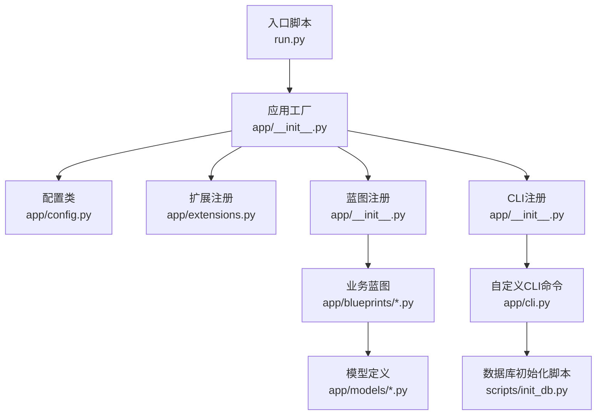
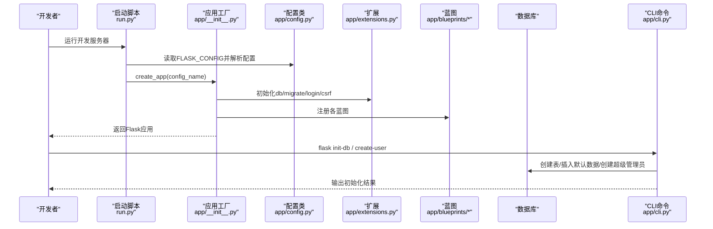
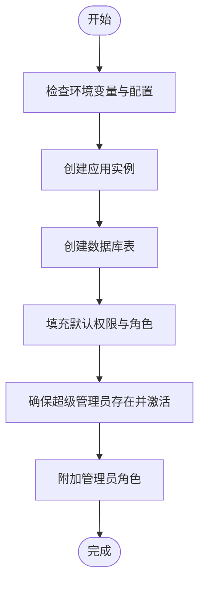
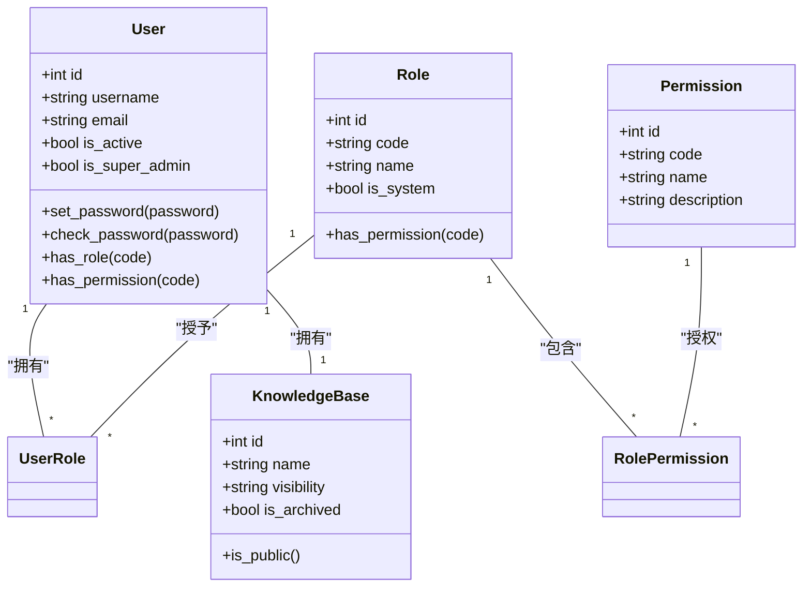
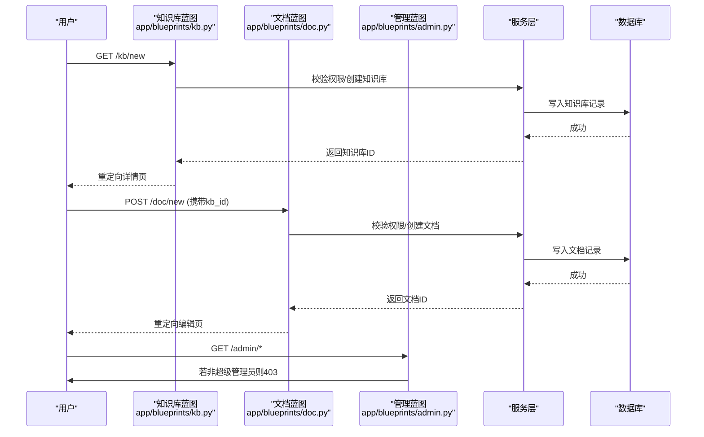
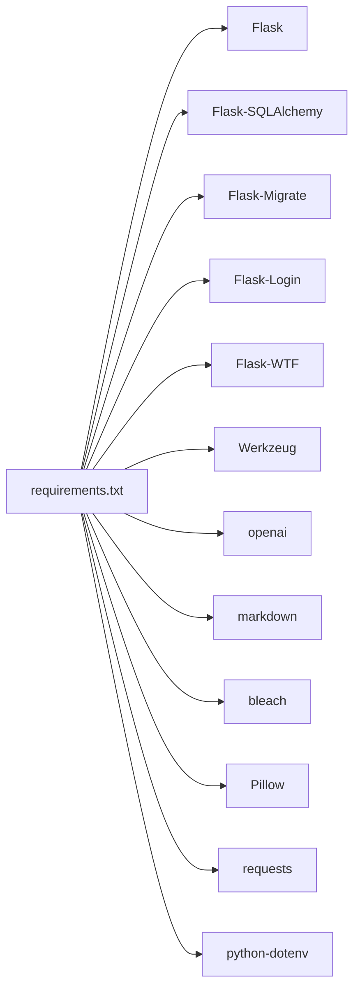

# 开发流程

<cite>
**本文引用的文件**
- [README.md](file://README.md)
- [requirements.txt](file://requirements.txt)
- [.gitignore](file://.gitignore)
- [run.py](file://run.py)
- [app/__init__.py](file://app/__init__.py)
- [app/config.py](file://app/config.py)
- [app/extensions.py](file://app/extensions.py)
- [app/cli.py](file://app/cli.py)
- [scripts/init_db.py](file://scripts/init_db.py)
- [app/blueprints/admin.py](file://app/blueprints/admin.py)
- [app/blueprints/doc.py](file://app/blueprints/doc.py)
- [app/blueprints/kb.py](file://app/blueprints/kb.py)
- [app/models/user.py](file://app/models/user.py)
- [app/models/knowledge_base.py](file://app/models/knowledge_base.py)
</cite>

## 目录
1. [简介](#简介)
2. [项目结构](#项目结构)
3. [核心组件](#核心组件)
4. [架构总览](#架构总览)
5. [详细组件分析](#详细组件分析)
6. [依赖分析](#依赖分析)
7. [性能考虑](#性能考虑)
8. [故障排查指南](#故障排查指南)
9. [结论](#结论)
10. [附录](#附录)

## 简介
本文件面向My Wiki项目的开发者与维护者，提供一套可执行、可复用的开发流程文档，覆盖以下方面：
- 新功能开发标准工作流程与代码提交规范
- 版本管理策略与Git分支管理
- 代码合并流程与冲突解决方法
- 本地开发环境搭建、数据库初始化与配置管理最佳实践
- 功能开发流程、代码审查流程与发布流程
- CLI工具使用、数据库迁移管理与环境切换
- 团队协作规范、文档更新要求与质量保证流程

## 项目结构
My Wiki采用Flask应用工厂模式组织代码，按“蓝图+模型+服务+工具”的分层方式组织模块；通过CLI命令提供数据库初始化与用户管理能力；通过dotenv加载运行时配置；通过Flask-Migrate进行数据库迁移。

**图示来源**
- [run.py:1-17](file://run.py#L1-L17)
- [app/__init__.py:11-28](file://app/__init__.py#L11-L28)
- [app/config.py:15-83](file://app/config.py#L15-L83)
- [app/extensions.py:1-17](file://app/extensions.py#L1-L17)
- [app/cli.py:61-96](file://app/cli.py#L61-L96)
- [scripts/init_db.py:23-47](file://scripts/init_db.py#L23-L47)

**章节来源**
- [README.md:1-3](file://README.md#L1-L3)
- [requirements.txt:1-22](file://requirements.txt#L1-L22)
- [run.py:1-17](file://run.py#L1-L17)
- [app/__init__.py:11-28](file://app/__init__.py#L11-L28)
- [app/config.py:15-83](file://app/config.py#L15-L83)
- [app/extensions.py:1-17](file://app/extensions.py#L1-L17)
- [app/cli.py:61-96](file://app/cli.py#L61-L96)
- [scripts/init_db.py:23-47](file://scripts/init_db.py#L23-L47)

## 核心组件
- 应用工厂与启动
  - 应用工厂负责加载配置、注册扩展、蓝图、错误处理、上下文变量与CLI命令，并确保实例目录存在。
  - 启动脚本通过dotenv加载环境变量，按环境变量选择配置并启动开发服务器。
- 配置管理
  - 提供开发、生产、测试三类配置，支持从环境变量覆盖数据库连接、上传目录、AI相关参数等。
- 扩展与蓝图
  - 扩展统一在单例中初始化，包括数据库、迁移、登录、CSRF保护。
  - 蓝图按功能域划分，如认证、用户、管理、知识库、文档、分享、AI、主页等。
- CLI与数据库初始化
  - 自定义CLI提供数据库初始化、创建普通用户等命令；同时提供独立脚本作为替代方案。
- 模型与RBAC
  - 用户、角色、权限构成RBAC体系；知识库与成员关系用于权限边界控制。

**章节来源**
- [app/__init__.py:11-28](file://app/__init__.py#L11-L28)
- [app/__init__.py:31-54](file://app/__init__.py#L31-L54)
- [app/__init__.py:56-74](file://app/__init__.py#L56-L74)
- [app/__init__.py:76-87](file://app/__init__.py#L76-L87)
- [app/__init__.py:90-96](file://app/__init__.py#L90-L96)
- [app/__init__.py:98-101](file://app/__init__.py#L98-L101)
- [run.py:1-17](file://run.py#L1-L17)
- [app/config.py:15-83](file://app/config.py#L15-L83)
- [app/extensions.py:1-17](file://app/extensions.py#L1-L17)
- [app/cli.py:61-96](file://app/cli.py#L61-L96)
- [scripts/init_db.py:23-47](file://scripts/init_db.py#L23-L47)
- [app/models/user.py:22-104](file://app/models/user.py#L22-L104)
- [app/models/knowledge_base.py:19-62](file://app/models/knowledge_base.py#L19-L62)

## 架构总览
下图展示从请求到响应的关键路径，以及数据库与CLI初始化流程。

**图示来源**
- [run.py:1-17](file://run.py#L1-L17)
- [app/__init__.py:11-28](file://app/__init__.py#L11-L28)
- [app/config.py:15-83](file://app/config.py#L15-L83)
- [app/extensions.py:1-17](file://app/extensions.py#L1-L17)
- [app/cli.py:61-96](file://app/cli.py#L61-L96)

## 详细组件分析

### 数据库初始化与CLI工具
- 初始化流程
  - CLI命令会创建数据库表、填充默认权限与角色、确保超级管理员存在并附加管理员角色。
  - 独立脚本提供相同能力，便于在不使用Flask CLI的环境中初始化。
- 用户管理
  - CLI提供创建普通用户的便捷命令，自动分配默认用户角色。

**图示来源**
- [app/cli.py:61-96](file://app/cli.py#L61-L96)
- [scripts/init_db.py:23-47](file://scripts/init_db.py#L23-L47)

**章节来源**
- [app/cli.py:61-96](file://app/cli.py#L61-L96)
- [scripts/init_db.py:23-47](file://scripts/init_db.py#L23-L47)

### 权限与角色模型（RBAC）
- 角色与权限
  - 角色与权限多对多关联，支持系统内置角色与动态角色。
  - 用户与角色多对多关联，超级管理员拥有全部权限。
- 知识库与成员
  - 知识库可见性分为私有、成员、公开三种；成员角色包含查看者与编辑者。

**图示来源**
- [app/models/user.py:22-104](file://app/models/user.py#L22-L104)
- [app/models/knowledge_base.py:19-62](file://app/models/knowledge_base.py#L19-L62)

**章节来源**
- [app/models/user.py:22-104](file://app/models/user.py#L22-L104)
- [app/models/knowledge_base.py:19-62](file://app/models/knowledge_base.py#L19-L62)

### 文档与知识库蓝图（路由与权限）
- 知识库蓝图
  - 支持创建、查看、编辑、删除、成员管理等操作；根据当前用户与知识库可见性决定访问权限。
- 文档蓝图
  - 支持新建、查看、编辑、保存、删除、分享等操作；分享前需满足文档隐私条件。
- 管理蓝图
  - 仅超级管理员可访问，提供用户、角色、权限、公开内容管理等功能。

**图示来源**
- [app/blueprints/kb.py:32-53](file://app/blueprints/kb.py#L32-L53)
- [app/blueprints/doc.py:20-40](file://app/blueprints/doc.py#L20-L40)
- [app/blueprints/admin.py:15-22](file://app/blueprints/admin.py#L15-L22)

**章节来源**
- [app/blueprints/kb.py:32-53](file://app/blueprints/kb.py#L32-L53)
- [app/blueprints/doc.py:20-40](file://app/blueprints/doc.py#L20-L40)
- [app/blueprints/admin.py:15-22](file://app/blueprints/admin.py#L15-L22)

## 依赖分析
- Python依赖
  - 使用Flask生态组件：Flask、Flask-SQLAlchemy、Flask-Migrate、Flask-Login、Flask-WTF、Werkzeug等。
  - 可选RAG相关依赖可通过环境变量启用。
- 运行时依赖
  - MySQL驱动、OpenAI SDK、Markdown处理、验证码等。

**图示来源**
- [requirements.txt:1-22](file://requirements.txt#L1-L22)

**章节来源**
- [requirements.txt:1-22](file://requirements.txt#L1-L22)

## 性能考虑
- 数据库连接池
  - 配置启用预检查与回收策略，降低连接失效导致的查询失败风险。
- 分页与索引
  - 列表查询使用分页与索引字段，避免全表扫描。
- 缓存与静态资源
  - 建议在生产环境启用CDN与缓存策略，减少静态资源与接口压力。
- AI与RAG
  - 当启用RAG时，注意向量存储路径与模型参数的合理配置，避免IO瓶颈。

**章节来源**
- [app/config.py:23-26](file://app/config.py#L23-L26)
- [app/blueprints/admin.py:38-47](file://app/blueprints/admin.py#L38-L47)
- [app/blueprints/doc.py:43-55](file://app/blueprints/doc.py#L43-L55)

## 故障排查指南
- 启动失败
  - 检查环境变量是否正确设置（如FLASK_CONFIG、DATABASE_URL），确认端口未被占用。
- 数据库无法连接
  - 核对数据库URL格式与凭据；确保数据库服务可用且网络连通。
- 初始化失败
  - 使用CLI命令或独立脚本重新初始化；确认数据库为空或允许覆盖。
- 权限问题
  - 确认用户角色与权限映射；检查超级管理员是否激活。
- 验证码/分享异常
  - 检查验证码服务可用性与TTL设置；确认分享令牌与过期时间配置。

**章节来源**
- [run.py:1-17](file://run.py#L1-L17)
- [app/config.py:18-21](file://app/config.py#L18-L21)
- [app/cli.py:61-96](file://app/cli.py#L61-L96)
- [scripts/init_db.py:23-47](file://scripts/init_db.py#L23-L47)
- [app/models/user.py:87-96](file://app/models/user.py#L87-L96)

## 结论
本开发流程文档基于现有代码实现，明确了从环境搭建、数据库初始化、功能开发、代码审查到发布的全流程规范。建议团队在实际执行中结合自身规模与风险偏好，补充自动化测试、CI/CD流水线与发布策略，持续优化开发体验与交付质量。

## 附录

### Git分支管理策略
- 主干分支
  - main：稳定发布分支，仅接受通过审查的合并请求。
- 功能分支
  - feature/*：从main切出，完成开发后发起合并请求至main。
- 修复分支
  - hotfix/*：从main切出，紧急修复后合并回main与release。
- 发布分支
  - release/*：准备发布版本时从main切出，进行最后验证与标签打点。

### 代码提交规范
- 提交信息
  - 类型: 摘要（不超过50字符）
  - 正文: 背景、变更点、影响范围
  - 脚注: 关联Issue/PR编号
- 提交粒度
  - 小步提交，聚焦单一功能或修复；避免大改动与无关变更混杂。

### 代码合并流程
- 合并前
  - 本地通过单元测试与静态检查；更新相关文档与变更日志。
- 审查流程
  - 提交合并请求，至少一名维护者审查；审查要点：逻辑正确性、安全性、性能与可维护性。
- 合并后
  - 合并后清理分支；如涉及数据库变更，同步更新迁移脚本并验证。

### 冲突解决方法
- 频繁同步主干分支，减少长时滞留的功能分支。
- 使用结构化冲突标记与注释，明确冲突原因与解决方案。
- 对复杂冲突进行小范围拆分，逐段解决并逐一验证。

### 本地开发环境搭建
- 安装依赖
  - 使用提供的依赖清单安装运行时组件。
- 配置环境
  - 设置环境变量（如FLASK_CONFIG、DATABASE_URL、OPENAI_*等），参考配置类中的默认值与说明。
- 启动应用
  - 通过启动脚本以开发模式运行，或使用Flask CLI命令。
- 初始化数据库
  - 使用CLI命令或独立脚本初始化数据库、默认角色与超级管理员。

**章节来源**
- [requirements.txt:1-22](file://requirements.txt#L1-L22)
- [app/config.py:15-83](file://app/config.py#L15-L83)
- [run.py:1-17](file://run.py#L1-L17)
- [app/cli.py:61-96](file://app/cli.py#L61-L96)
- [scripts/init_db.py:23-47](file://scripts/init_db.py#L23-L47)

### 数据库迁移管理
- 迁移脚本
  - 使用Flask-Migrate生成与升级迁移脚本，确保数据库结构演进可追踪。
- 迁移策略
  - 在开发环境先行验证；在生产环境执行前备份数据库；严格遵循“只增不改”原则，必要时使用数据迁移而非结构变更。

### 环境切换方法
- 环境变量
  - 通过设置FLASK_CONFIG选择开发/生产/测试配置；其他敏感参数通过dotenv注入。
- 实例目录
  - 应用工厂确保实例目录存在，上传与AI知识库目录在配置中指定。

**章节来源**
- [app/__init__.py:31-36](file://app/__init__.py#L31-L36)
- [app/config.py:15-83](file://app/config.py#L15-L83)

### 团队协作规范
- 任务分配
  - 使用Issue跟踪需求与缺陷；功能开发以Feature分支推进。
- 文档更新
  - 新增/变更API、配置项与流程需同步更新README与内部Wiki。
- 质量保证
  - 引入单元测试与集成测试；在CI中执行静态检查与安全扫描；发布前进行回归测试。

### 质量保证流程
- 单元测试
  - 针对服务层与工具函数编写测试用例，覆盖正常与异常路径。
- 集成测试
  - 模拟用户操作与API调用，验证端到端流程。
- 安全扫描
  - 定期扫描依赖漏洞与敏感信息泄露风险。
- 回归测试
  - 发布前执行关键路径回归，确保无破坏性变更。