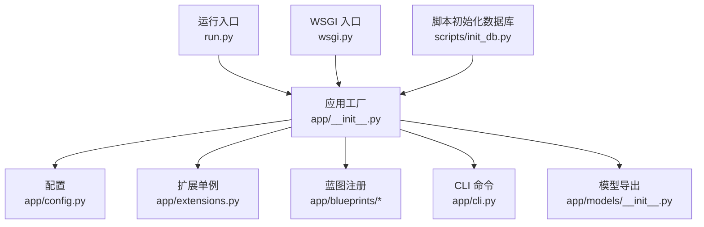
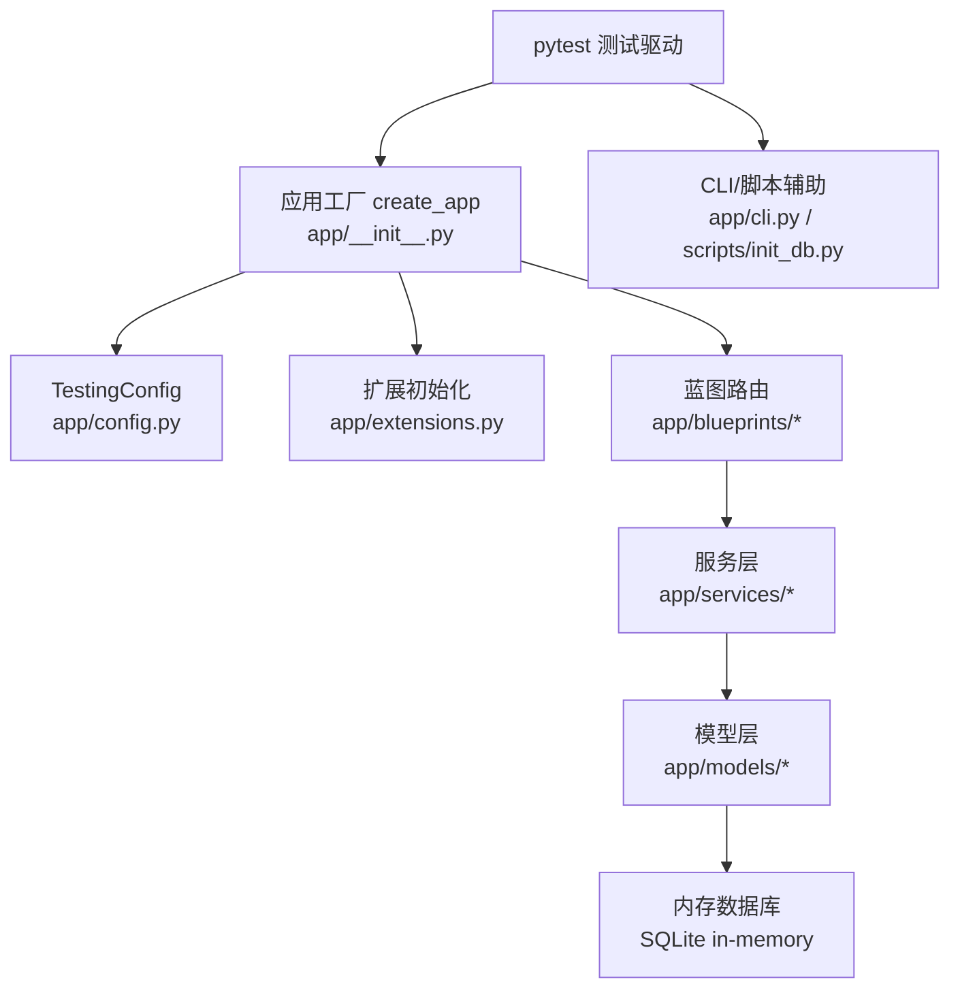
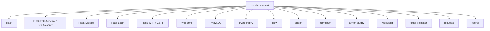

# 测试策略

<cite>
**本文引用的文件**
- [app/__init__.py](file://app/__init__.py)
- [app/config.py](file://app/config.py)
- [app/extensions.py](file://app/extensions.py)
- [app/models/__init__.py](file://app/models/__init__.py)
- [app/blueprints/__init__.py](file://app/blueprints/__init__.py)
- [app/cli.py](file://app/cli.py)
- [scripts/init_db.py](file://scripts/init_db.py)
- [run.py](file://run.py)
- [wsgi.py](file://wsgi.py)
- [.gitignore](file://.gitignore)
- [requirements.txt](file://requirements.txt)
</cite>

## 目录
1. [引言](#引言)
2. [项目结构](#项目结构)
3. [核心组件](#核心组件)
4. [架构总览](#架构总览)
5. [详细组件分析](#详细组件分析)
6. [依赖分析](#依赖分析)
7. [性能考虑](#性能考虑)
8. [故障排查指南](#故障排查指南)
9. [结论](#结论)
10. [附录](#附录)

## 引言
本测试策略文档面向 My Wiki 项目，旨在建立系统化的测试体系，覆盖单元测试、集成测试与端到端测试（E2E），明确 pytest 框架配置、测试用例设计原则、Mock 对象使用规范，并给出 Flask 应用测试、数据库测试、API 接口测试、用户认证、知识库管理与文档操作等场景的最佳实践。同时提供测试数据准备、测试环境配置与持续集成中的测试执行流程建议，以及测试覆盖率、性能测试与安全测试策略。

## 项目结构
My Wiki 采用 Flask 应用工厂模式，通过应用工厂函数集中初始化扩展、注册蓝图、错误处理与 CLI 命令。配置通过多环境类进行管理，支持开发、生产与测试三套配置；数据库与迁移由 SQLAlchemy 与 Flask-Migrate 提供；登录与 CSRF 保护由 Flask-Login 与 Flask-WTF-CSRF 提供。

图表来源
- [app/__init__.py:11-28](file://app/__init__.py#L11-L28)
- [app/config.py:80-83](file://app/config.py#L80-L83)
- [app/extensions.py:8-11](file://app/extensions.py#L8-L11)
- [app/cli.py:61-80](file://app/cli.py#L61-L80)
- [run.py:9](file://run.py#L9)
- [wsgi.py:9](file://wsgi.py#L9)
- [scripts/init_db.py:23-47](file://scripts/init_db.py#L23-L47)

章节来源
- [app/__init__.py:11-28](file://app/__init__.py#L11-L28)
- [app/config.py:80-83](file://app/config.py#L80-L83)
- [app/extensions.py:8-11](file://app/extensions.py#L8-L11)
- [app/cli.py:61-80](file://app/cli.py#L61-L80)
- [run.py:9](file://run.py#L9)
- [wsgi.py:9](file://wsgi.py#L9)
- [scripts/init_db.py:23-47](file://scripts/init_db.py#L23-L47)

## 核心组件
- 应用工厂：负责实例化 Flask 应用、加载配置、初始化扩展、注册蓝图与错误处理器、上下文变量与 CLI。
- 配置系统：提供 BaseConfig、DevelopmentConfig、ProductionConfig、TestingConfig 四类配置，TestingConfig 中关闭 CSRF 并使用内存数据库以提升测试效率与隔离性。
- 扩展单例：统一管理 db、migrate、login_manager、csrf 等扩展，便于在测试中替换或模拟。
- 蓝图模块：按功能域划分（认证、用户、管理、知识库、文档、分享、AI、主页），便于针对各模块进行独立测试。
- CLI 与数据库初始化：提供 init-db 命令与脚本化初始化，确保测试环境具备干净的数据库状态。

章节来源
- [app/__init__.py:11-28](file://app/__init__.py#L11-L28)
- [app/config.py:64-71](file://app/config.py#L64-L71)
- [app/extensions.py:8-11](file://app/extensions.py#L8-L11)
- [app/cli.py:61-80](file://app/cli.py#L61-L80)
- [scripts/init_db.py:23-47](file://scripts/init_db.py#L23-L47)

## 架构总览
下图展示测试视角下的系统交互：测试驱动器（pytest）通过应用工厂创建测试应用实例，注入 TestingConfig，连接内存数据库，利用 Flask 测试客户端发起请求，调用蓝图路由，经服务层与模型层完成业务逻辑，最终断言响应与数据库状态。

图表来源
- [app/__init__.py:11-28](file://app/__init__.py#L11-L28)
- [app/config.py:64-71](file://app/config.py#L64-L71)
- [app/extensions.py:8-11](file://app/extensions.py#L8-L11)
- [app/cli.py:61-80](file://app/cli.py#L61-L80)
- [scripts/init_db.py:23-47](file://scripts/init_db.py#L23-L47)

## 详细组件分析

### 单元测试（Unit Tests）
目标：验证模型、服务与工具函数的正确性，确保最小可测试单元的行为符合预期。

- 测试用例设计原则
  - 一个测试只验证一个行为或边界条件。
  - 使用小而具体的断言，避免“黑盒”式断言。
  - 优先使用参数化测试覆盖典型输入与异常路径。
- Mock 对象使用规范
  - 对外部依赖（如 OpenAI API、文件系统、会话存储）进行 Mock，确保测试稳定与可重复。
  - 在模型层避免直接访问数据库，通过服务层封装持久化逻辑以便 Mock。
- 关键测试点
  - 用户模型与权限校验、知识库可见性与成员角色、文档类型与隐私控制。
  - Markdown 解析、大纲生成、分页与安全过滤等工具函数。
  - 认证服务的登录流程、密码哈希与会话管理。
  - AI 知识库的来源抓取、切片与状态机。

章节来源
- [app/models/__init__.py:16-37](file://app/models/__init__.py#L16-L37)
- [app/utils/__init__.py:1](file://app/utils/__init__.py#L1)
- [app/services/auth_service.py](file://app/services/auth_service.py)
- [app/services/kb_service.py](file://app/services/kb_service.py)
- [app/services/doc_service.py](file://app/services/doc_service.py)
- [app/services/ai_service.py](file://app/services/ai_service.py)

### 集成测试（Integration Tests）
目标：验证模块间协作、数据库事务与路由到服务层的整体流程。

- Flask 应用测试最佳实践
  - 使用 Flask 的 test_client 或 test_request_context，结合 app.app_context() 与 db.create_all() 初始化数据库。
  - 针对不同蓝图（认证、知识库、文档、分享、AI）分别编写测试套件，确保路由、表单验证、CSRF 与权限控制。
  - 对需要上传的接口，使用临时文件与内存上传流进行测试。
- 数据库测试最佳实践
  - 使用 TestingConfig 的内存数据库，每个测试前后清理数据，避免跨用例污染。
  - 通过 CLI 命令或脚本初始化默认角色与超级管理员，保证权限测试一致性。
- API 接口测试最佳实践
  - 覆盖常见 HTTP 方法与状态码（200、302、401、403、404、500）。
  - 验证 JSON 响应结构、重定向目标与模板渲染触发。
  - 对分页、搜索、排序等通用参数进行参数化测试。

章节来源
- [app/__init__.py:39-54](file://app/__init__.py#L39-L54)
- [app/config.py:64-71](file://app/config.py#L64-L71)
- [app/cli.py:61-80](file://app/cli.py#L61-L80)
- [scripts/init_db.py:23-47](file://scripts/init_db.py#L23-L47)

### 端到端测试（E2E）
目标：模拟真实用户场景，从浏览器视角验证完整业务流程。

- 场景建议
  - 新用户注册与登录、修改资料与头像上传。
  - 创建知识库、邀请成员、设置可见性与成员角色。
  - 文档创建、编辑、删除、分享链接生成与访问。
  - AI 知识库同步、查询与结果展示。
- 工具与策略
  - 使用浏览器自动化（如 Playwright/Selenium）与测试框架（pytest + selenium 或 playwright）。
  - 将 E2E 与集成测试分离，仅保留关键路径于 E2E，其余细节下沉至集成测试。
  - 使用 Docker Compose 启动完整栈（Web + MySQL），在 CI 中运行 E2E。

章节来源
- [app/blueprints/auth.py](file://app/blueprints/auth.py)
- [app/blueprints/kb.py](file://app/blueprints/kb.py)
- [app/blueprints/doc.py](file://app/blueprints/doc.py)
- [app/blueprints/share.py](file://app/blueprints/share.py)
- [app/blueprints/ai.py](file://app/blueprints/ai.py)

### 用户认证测试
- 登录/登出流程：验证用户名/密码校验、会话创建与 CSRF 保护、未登录访问限制。
- 权限控制：基于角色与权限的访问控制，包括超级管理员与普通用户的差异。
- 安全要点：密码哈希强度、会话 Cookie 属性、暴力破解防护（如验证码）。

章节来源
- [app/config.py:28-36](file://app/config.py#L28-L36)
- [app/extensions.py:14-16](file://app/extensions.py#L14-L16)
- [app/services/auth_service.py](file://app/services/auth_service.py)

### 知识库管理测试
- 知识库 CRUD：创建、更新、删除、列表与详情。
- 成员管理：邀请、移除、角色变更与权限继承。
- 可见性控制：公开、私有与组织内可见的访问策略。
- 分享与导出：生成分享链接、访问权限与内容脱敏。

章节来源
- [app/blueprints/kb.py](file://app/blueprints/kb.py)
- [app/services/kb_service.py](file://app/services/kb_service.py)
- [app/models/knowledge_base.py](file://app/models/knowledge_base.py)

### 文档操作测试
- 文档 CRUD：标题、正文、类型与隐私设置。
- 富文本与 Markdown：解析、渲染与安全过滤。
- 分页与搜索：分页参数、关键词匹配与排序。
- 导入/导出：Markdown/HTML 导入与下载。

章节来源
- [app/blueprints/doc.py](file://app/blueprints/doc.py)
- [app/services/doc_service.py](file://app/services/doc_service.py)
- [app/utils/markdown.py](file://app/utils/markdown.py)
- [app/utils/security.py](file://app/utils/security.py)

## 依赖分析
- 外部依赖与测试相关的关键包
  - Flask、Flask-SQLAlchemy、Flask-Migrate、Flask-Login、Flask-WTF、WTForms、PyMySQL、SQLAlchemy、Werkzeug、python-dotenv、requests、openai。
- 测试相关环境与产物
  - .gitignore 中已忽略 pytest 缓存、覆盖率报告、.env、instance 目录等，确保 CI 清洁。

图表来源
- [requirements.txt:1-22](file://requirements.txt#L1-L22)

章节来源
- [requirements.txt:1-22](file://requirements.txt#L1-L22)
- [.gitignore:39-52](file://.gitignore#L39-L52)

## 性能考虑
- 测试数据库选择：TestingConfig 使用 SQLite 内存数据库，减少 IO 开销；若需更贴近生产，可在 CI 中使用轻量级 MySQL 实例。
- 并发与超时：对依赖外部 API（如 OpenAI）的测试，使用 Mock 或短超时策略，避免测试阻塞。
- 参数化与批量：对分页、搜索、批量导入等场景进行参数化测试，覆盖不同规模数据集。
- 覆盖率：建议为关键模块（服务层、模型层）达到较高覆盖率，对路由与模板渲染使用轻量断言。

## 故障排查指南
- 测试无法启动或找不到配置
  - 确认 FLASK_CONFIG 设置为 testing，或在测试入口显式传入。
  - 检查 .env 文件是否正确加载（dotenv）。
- 数据库连接失败
  - 确保在测试前执行数据库初始化（CLI 或脚本），或在测试 setUp 中调用 db.create_all()。
- CSRF 校验失败
  - 在 TestingConfig 中已禁用 CSRF；若仍失败，确认测试客户端未手动开启 CSRF。
- 权限与登录问题
  - 确保测试中创建了必要的角色与用户，并正确设置会话。
- 外部依赖不稳定
  - 对 OpenAI、文件上传等依赖进行 Mock，或在 CI 中使用缓存/代理。

章节来源
- [app/config.py:64-71](file://app/config.py#L64-L71)
- [run.py:5-9](file://run.py#L5-L9)
- [wsgi.py:5-9](file://wsgi.py#L5-L9)
- [scripts/init_db.py:23-47](file://scripts/init_db.py#L23-L47)

## 结论
通过将单元测试、集成测试与端到端测试有机结合，配合清晰的测试用例设计原则与 Mock 规范，My Wiki 可以在开发与 CI 中获得稳定、可重复且高价值的测试反馈。建议优先完善服务层与模型层的单元测试，再逐步扩展到蓝图与 E2E 覆盖关键业务路径，并持续优化覆盖率与性能指标。

## 附录

### pytest 框架配置与执行建议
- 配置项建议
  - 测试目录：tests/
  - 插件：pytest-html、pytest-cov、pytest-xdist（并发）、pytest-mock（Mock）
  - 标记：@pytest.mark.integration、@pytest.mark.e2e、@pytest.mark.slow
- 执行策略
  - 本地：pytest -v --cov=app --cov-report=term-missing
  - CI：pytest --tb=short -x --disable-warnings

### 测试数据准备与环境配置
- 测试数据库：使用 TestingConfig 的内存数据库，或在 CI 中使用临时 MySQL。
- 默认数据：通过 CLI 命令或脚本初始化默认角色与超级管理员。
- 环境变量：FLASK_CONFIG=testing、TEST_DATABASE_URL（可选）、OPENAI_*（可 Mock）。

### 持续集成中的测试执行流程
- 步骤建议
  - 安装依赖（含 optional 包）
  - 初始化数据库（CLI 或脚本）
  - 运行单元测试与集成测试
  - 可选：运行 E2E（Docker Compose 启动完整栈）
  - 上传覆盖率报告与测试结果

### 测试覆盖率与质量门禁
- 建议阈值
  - 服务层与模型层：语句覆盖率 ≥ 80%，分支覆盖率 ≥ 60%
  - 路由与模板：语句覆盖率 ≥ 60%
- 门禁策略：CI 中失败即阻止合并

### 性能测试方法
- 负载与压力：对高频接口（搜索、分页、上传）进行基准测试。
- 资源占用：监控内存与连接池使用情况，避免泄漏。

### 安全测试策略
- 输入验证：对所有用户输入进行边界与格式校验。
- 权限审计：定期检查路由与资源访问权限。
- 外部依赖：对外部 API 进行超时与熔断处理，必要时 Mock。