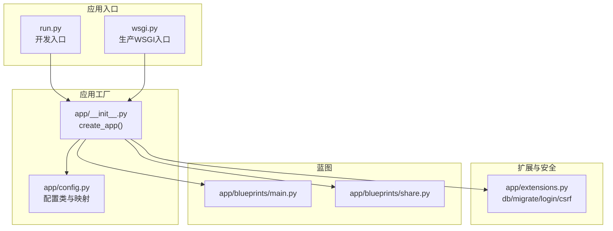
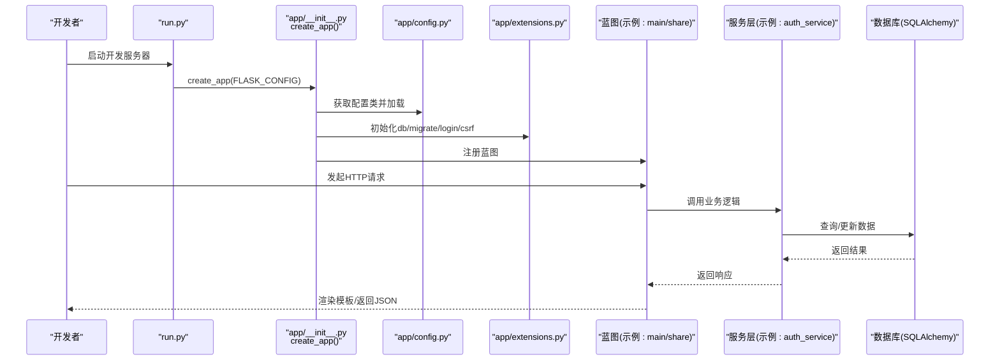
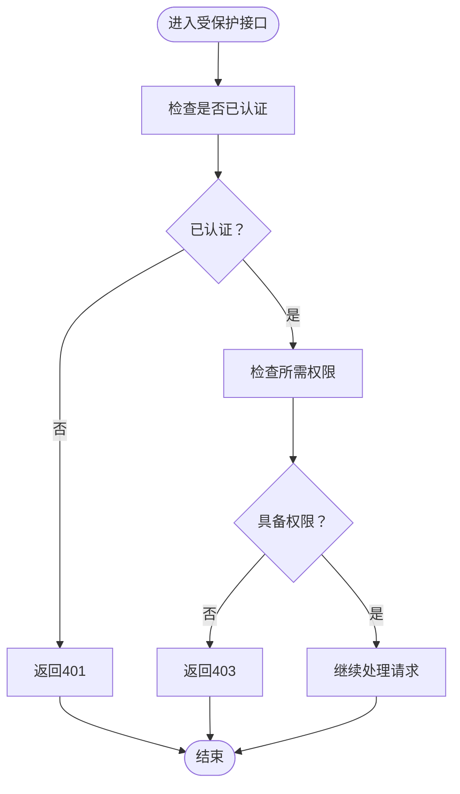
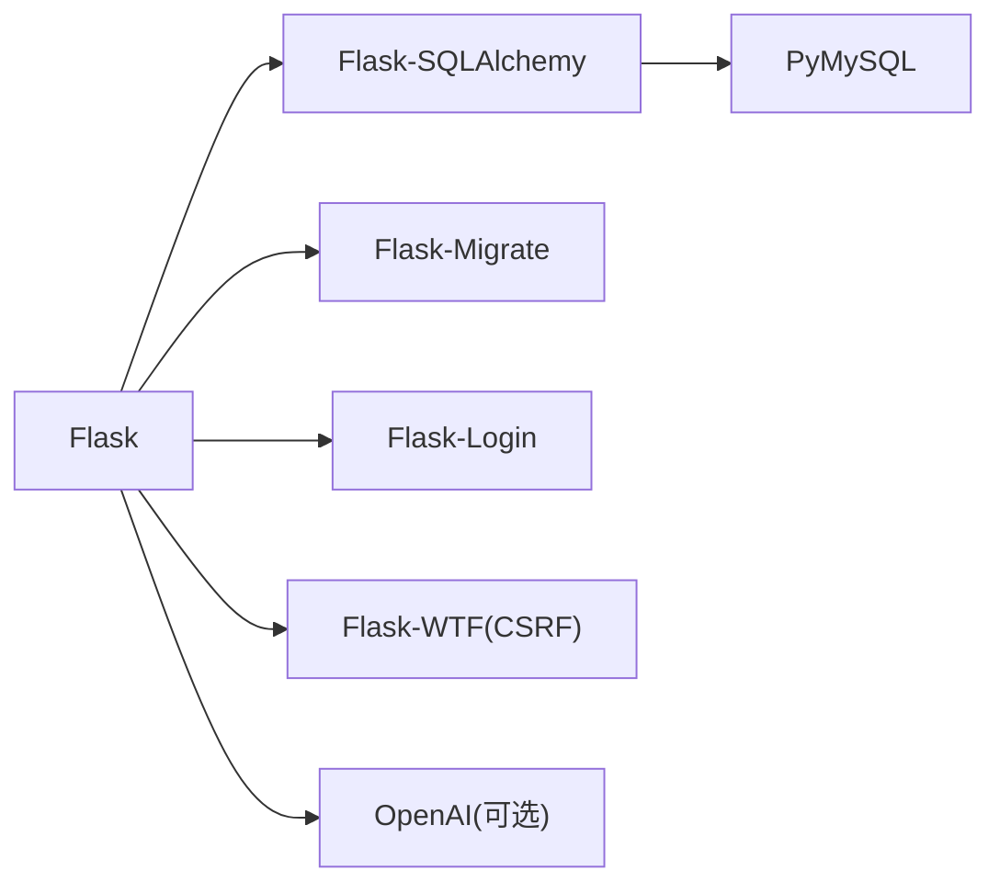

# 调试技巧

<cite>
**本文引用的文件**
- [app/config.py](file://app/config.py)
- [run.py](file://run.py)
- [wsgi.py](file://wsgi.py)
- [app/__init__.py](file://app/__init__.py)
- [app/extensions.py](file://app/extensions.py)
- [app/utils/decorators.py](file://app/utils/decorators.py)
- [app/cli.py](file://app/cli.py)
- [scripts/init_db.py](file://scripts/init_db.py)
- [app/blueprints/main.py](file://app/blueprints/main.py)
- [app/blueprints/share.py](file://app/blueprints/share.py)
- [app/services/auth_service.py](file://app/services/auth_service.py)
- [app/models/user.py](file://app/models/user.py)
- [requirements.txt](file://requirements.txt)
- [app/templates/base.html](file://app/templates/base.html)
</cite>

## 目录
1. [简介](#简介)
2. [项目结构](#项目结构)
3. [核心组件](#核心组件)
4. [架构总览](#架构总览)
5. [详细组件分析](#详细组件分析)
6. [依赖分析](#依赖分析)
7. [性能考虑](#性能考虑)
8. [故障排查指南](#故障排查指南)
9. [结论](#结论)
10. [附录](#附录)

## 简介
本文件面向My Wiki项目的开发与运维人员，提供一套系统化的调试技巧与问题排查方法，覆盖以下方面：
- Flask应用调试模式配置与启动方式
- 浏览器开发者工具与网络请求调试
- Python调试器(pdb)使用、断点与变量检查
- 数据库查询调试、API响应分析与权限问题排查
- 日志级别与错误追踪方法
- 性能瓶颈定位与生产环境诊断、错误监控与故障恢复策略

## 项目结构
My Wiki采用Flask应用工厂模式组织代码，核心目录与职责如下：
- app：应用主体，包含蓝图、模型、服务、工具、扩展与入口工厂
- app/blueprints：按功能域划分的蓝图模块
- app/models：SQLAlchemy模型定义
- app/services：业务逻辑层
- app/utils：通用装饰器与工具
- app/cli：自定义命令行工具
- scripts：辅助脚本（如初始化数据库）
- run.py/wsgi.py：开发与生产入口
- requirements.txt：依赖清单

图表来源
- [run.py:1-17](file://run.py#L1-L17)
- [wsgi.py:1-10](file://wsgi.py#L1-L10)
- [app/__init__.py:11-28](file://app/__init__.py#L11-L28)
- [app/config.py:56-83](file://app/config.py#L56-L83)
- [app/extensions.py:8-16](file://app/extensions.py#L8-L16)
- [app/blueprints/main.py:1-15](file://app/blueprints/main.py#L1-L15)
- [app/blueprints/share.py:1-41](file://app/blueprints/share.py#L1-L41)

章节来源
- [app/__init__.py:11-28](file://app/__init__.py#L11-L28)
- [app/config.py:56-83](file://app/config.py#L56-L83)
- [run.py:1-17](file://run.py#L1-L17)
- [wsgi.py:1-10](file://wsgi.py#L1-L10)

## 核心组件
- 应用工厂与配置
  - 应用通过工厂函数创建，支持开发、生产、测试三种配置，调试模式由配置类控制
  - 开发配置启用调试模式；生产配置关闭调试模式
- 扩展注册
  - 注册数据库、迁移、登录管理、CSRF保护等扩展，并在工厂中统一初始化
- 错误处理器
  - 注册403/404/500错误模板渲染，便于前端展示与日志追踪
- 权限装饰器
  - 提供超级管理员与细粒度权限校验装饰器，便于快速定位权限问题

章节来源
- [app/__init__.py:39-88](file://app/__init__.py#L39-L88)
- [app/utils/decorators.py:8-33](file://app/utils/decorators.py#L8-L33)
- [app/config.py:56-83](file://app/config.py#L56-L83)

## 架构总览
下图展示了从入口到蓝图、服务与数据库的调用链路，以及调试模式对运行行为的影响。

图表来源
- [run.py:9-16](file://run.py#L9-L16)
- [app/__init__.py:11-28](file://app/__init__.py#L11-L28)
- [app/config.py:80-83](file://app/config.py#L80-L83)
- [app/extensions.py:8-16](file://app/extensions.py#L8-L16)
- [app/blueprints/main.py:10-15](file://app/blueprints/main.py#L10-L15)
- [app/services/auth_service.py:44-56](file://app/services/auth_service.py#L44-L56)

## 详细组件分析

### Flask应用调试模式与启动
- 开发入口
  - 使用开发入口脚本启动时，会读取环境变量决定配置名称与调试开关
  - 调试模式由配置类的DEBUG字段控制，开发默认开启
- 生产入口
  - 生产WSGI入口固定使用生产配置，关闭调试模式
- 配置选择
  - 支持通过环境变量选择配置，若未指定则默认开发配置

调试要点
- 在开发阶段确保DEBUG为True，以便获得更详细的错误回溯与自动重载
- 如需在生产环境开启调试，请谨慎评估安全风险

章节来源
- [run.py:9-16](file://run.py#L9-L16)
- [app/config.py:56-67](file://app/config.py#L56-L67)
- [app/config.py:80-83](file://app/config.py#L80-L83)
- [wsgi.py:9](file://wsgi.py#L9)

### 浏览器开发者工具与网络请求调试
- 基础信息
  - 模板中注入了CSRF令牌，前端表单提交需携带该令牌
- 调试步骤
  - 打开“网络”面板，观察请求URL、方法、状态码、请求头与响应体
  - 关注CSRF令牌是否正确传递，避免400/403类错误
  - 查看响应时间与重定向链，定位慢请求或循环跳转
  - 在“预览/响应”标签中核对API返回结构，确认字段与类型
- 共享文档场景
  - 访问共享链接时，若需要密码解锁，观察表单提交流程与会话状态变化

章节来源
- [app/templates/base.html:6](file://app/templates/base.html#L6)
- [app/blueprints/share.py:22-41](file://app/blueprints/share.py#L22-L41)

### Python调试器(pdb)使用与断点设置
- 断点设置位置
  - 在蓝图视图函数中设置断点，验证路由参数与请求上下文
  - 在服务层函数中设置断点，检查业务逻辑分支与数据库操作
  - 在模型层或工具函数中设置断点，检查数据转换与权限判断
- 变量检查
  - 检查当前用户对象、请求头中的IP与代理信息、会话状态
  - 对比预期与实际的查询条件、返回值与异常信息
- 调试建议
  - 使用条件断点过滤特定用户或特定请求路径
  - 结合Flask上下文与SQLAlchemy查询日志，定位慢查询

章节来源
- [app/blueprints/main.py:10-15](file://app/blueprints/main.py#L10-L15)
- [app/services/auth_service.py:44-56](file://app/services/auth_service.py#L44-L56)
- [app/models/user.py:66-103](file://app/models/user.py#L66-L103)

### 数据库查询调试与性能定位
- 查询调试
  - 在开发配置下，数据库连接池参数已启用健康检查与回收策略
  - 使用SQLAlchemy查询日志（可通过Flask配置或环境变量开启）查看SQL语句与执行时间
- 性能定位
  - 关注JOIN与子查询复杂度，检查索引缺失导致的全表扫描
  - 分析分页参数与LIMIT/OFFSET，避免大偏移量导致的性能退化
- 初始化与种子数据
  - 使用CLI命令或脚本初始化数据库，确保默认角色与权限存在，减少运行期异常

章节来源
- [app/config.py:23-26](file://app/config.py#L23-L26)
- [app/cli.py:61-96](file://app/cli.py#L61-L96)
- [scripts/init_db.py:23-48](file://scripts/init_db.py#L23-L48)

### API响应分析与权限问题排查
- 权限装饰器
  - 使用超级管理员与细粒度权限装饰器快速定位权限不足问题
  - 若出现401/403，优先检查用户认证状态与角色/权限绑定
- 登录与会话
  - 登录成功后记录最近登录时间与IP，便于审计与异常登录检测
- 共享文档
  - 密码保护的共享文档需检查会话标记与解锁流程

图表来源
- [app/utils/decorators.py:8-33](file://app/utils/decorators.py#L8-L33)
- [app/services/auth_service.py:44-56](file://app/services/auth_service.py#L44-L56)
- [app/models/user.py:90-96](file://app/models/user.py#L90-L96)

章节来源
- [app/utils/decorators.py:8-33](file://app/utils/decorators.py#L8-L33)
- [app/services/auth_service.py:44-56](file://app/services/auth_service.py#L44-L56)
- [app/models/user.py:90-96](file://app/models/user.py#L90-L96)

### 日志级别与错误追踪
- 错误处理器
  - 已注册403/404/500错误模板，便于统一展示与日志记录
- 追踪建议
  - 在开发阶段开启更详细的错误回溯，结合浏览器网络面板与后端日志定位问题
  - 对于CSRF/认证/权限相关错误，结合会话与用户模型字段进行交叉验证

章节来源
- [app/__init__.py:76-88](file://app/__init__.py#L76-L88)

### 生产环境问题诊断与故障恢复
- 启动与配置
  - 生产环境使用WSGI入口，固定生产配置，关闭调试模式
- 故障恢复
  - 通过CLI命令或脚本重建数据库与默认角色/权限，恢复基础功能
  - 对共享文档等公开内容，检查激活状态与会话解锁流程

章节来源
- [wsgi.py:9](file://wsgi.py#L9)
- [app/cli.py:61-96](file://app/cli.py#L61-L96)
- [scripts/init_db.py:23-48](file://scripts/init_db.py#L23-L48)
- [app/blueprints/share.py:22-41](file://app/blueprints/share.py#L22-L41)

## 依赖分析
- Flask生态
  - 使用Flask及其官方扩展（SQLAlchemy、Migrate、Login、WTF/CSRF），保证调试与生产一致性
- 数据库驱动
  - 使用PyMySQL作为MySQL驱动，配合SQLAlchemy与连接池参数优化
- 外部服务
  - 支持OpenAI API与可选RAG能力，调试时关注网络超时与鉴权配置

图表来源
- [requirements.txt:1-22](file://requirements.txt#L1-L22)

章节来源
- [requirements.txt:1-22](file://requirements.txt#L1-L22)

## 性能考虑
- 数据库连接池
  - 启用pre_ping与合理recycle时间，有助于维持长连接稳定性
- 查询优化
  - 避免N+1查询，使用联结或选择性加载
  - 对高频查询建立必要索引，控制返回字段数量
- 缓存与会话
  - 利用会话存储解锁状态，减少重复校验成本
- 前端静态资源
  - 使用本地缓存的第三方静态资源，降低外部依赖带来的不稳定因素

章节来源
- [app/config.py:23-26](file://app/config.py#L23-L26)
- [app/blueprints/share.py:11-20](file://app/blueprints/share.py#L11-L20)

## 故障排查指南
- 路由与蓝图
  - 确认蓝图注册顺序与前缀，避免路径冲突
- 权限与认证
  - 使用装饰器快速定位权限不足；检查用户角色与系统默认角色是否正确初始化
- 数据库
  - 使用CLI命令或脚本重建表与默认数据；核对连接字符串与驱动版本
- 网络与CSRF
  - 确保前端表单携带CSRF令牌；检查代理头与IP记录
- 共享文档
  - 核对激活状态、密码校验与会话解锁流程

章节来源
- [app/__init__.py:56-74](file://app/__init__.py#L56-L74)
- [app/utils/decorators.py:8-33](file://app/utils/decorators.py#L8-L33)
- [app/cli.py:61-96](file://app/cli.py#L61-L96)
- [app/blueprints/share.py:22-41](file://app/blueprints/share.py#L22-L41)
- [app/templates/base.html:6](file://app/templates/base.html#L6)

## 结论
通过规范的调试流程与工具组合，可以高效定位My Wiki项目中的配置、权限、数据库与网络问题。建议在开发阶段充分利用调试模式与浏览器工具，在生产阶段严格遵循错误处理与初始化流程，确保系统的稳定性与可维护性。

## 附录
- 快速检查清单
  - 确认DEBUG与配置名称正确
  - 核对CSRF令牌与会话状态
  - 检查用户权限与角色绑定
  - 使用CLI命令初始化数据库与默认角色
  - 关注慢查询与连接池参数