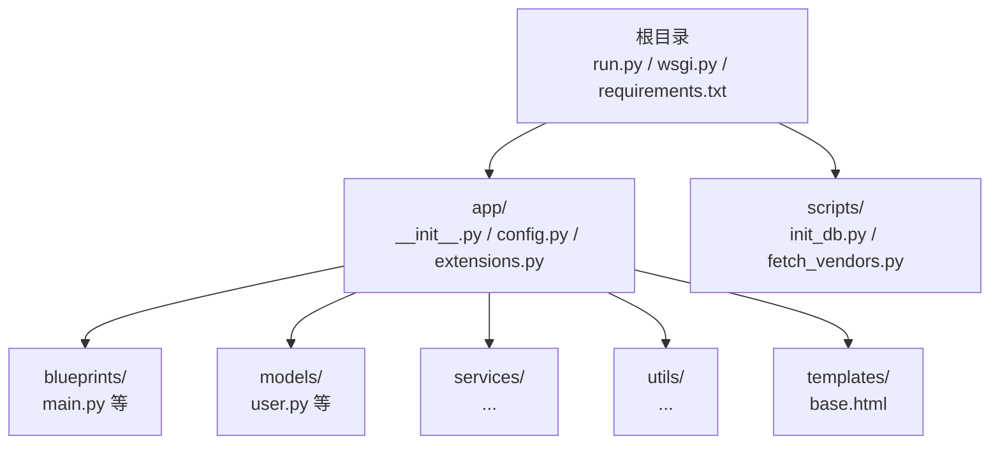
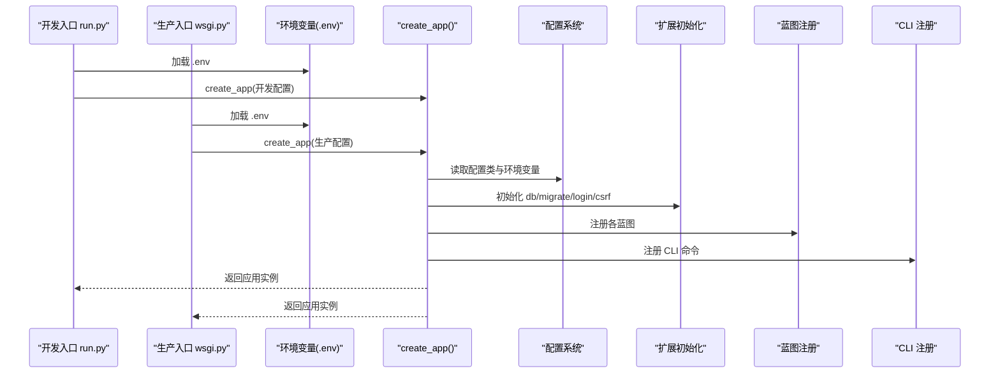
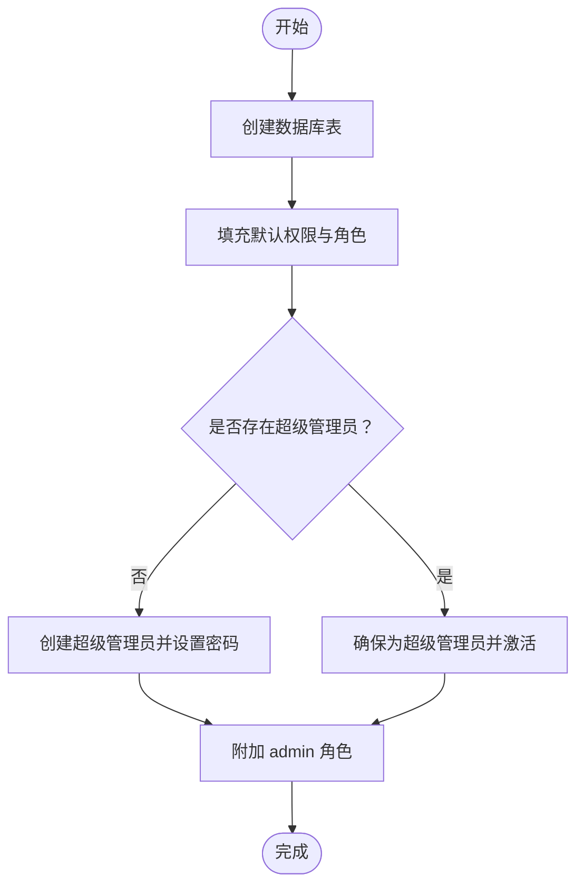
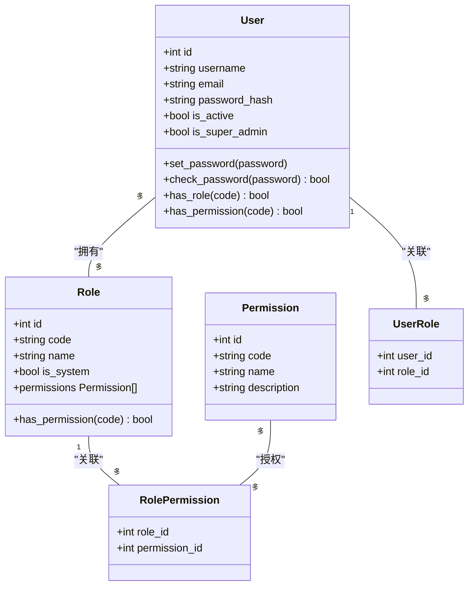

# 快速开始

<cite>
**本文引用的文件**
- [README.md](file://README.md)
- [requirements.txt](file://requirements.txt)
- [run.py](file://run.py)
- [wsgi.py](file://wsgi.py)
- [app/config.py](file://app/config.py)
- [app/__init__.py](file://app/__init__.py)
- [app/extensions.py](file://app/extensions.py)
- [app/cli.py](file://app/cli.py)
- [app/blueprints/main.py](file://app/blueprints/main.py)
- [app/models/user.py](file://app/models/user.py)
- [scripts/init_db.py](file://scripts/init_db.py)
- [scripts/fetch_vendors.py](file://scripts/fetch_vendors.py)
</cite>

## 目录
1. [简介](#简介)
2. [项目结构](#项目结构)
3. [核心组件](#核心组件)
4. [架构总览](#架构总览)
5. [详细组件分析](#详细组件分析)
6. [依赖分析](#依赖分析)
7. [性能考虑](#性能考虑)
8. [故障排除指南](#故障排除指南)
9. [结论](#结论)
10. [附录](#附录)

## 简介
本指南面向首次接触 My Wiki 的开发者与运维人员，帮助你在最短时间内完成环境准备、依赖安装、数据库初始化与应用启动，并覆盖开发与生产两种部署方式。你将学到：
- Python 版本与运行时要求
- 依赖安装与第三方静态资源准备
- 数据库连接配置与环境变量设置
- 开发与生产环境的启动方式
- 初始化数据库、默认权限与角色、超级管理员账户
- 常见问题与排错建议

## 项目结构
My Wiki 采用 Flask 应用工厂模式组织代码，核心目录与职责如下：
- app：应用主体，包含配置、扩展、模型、服务、蓝图与工具
- scripts：辅助脚本，如数据库初始化与第三方静态资源拉取
- 根目录入口：run.py（开发）、wsgi.py（生产）
- 依赖：requirements.txt 统一声明

图表来源
- [app/__init__.py:11-28](file://app/__init__.py#L11-L28)
- [app/config.py:15-83](file://app/config.py#L15-L83)
- [run.py:1-17](file://run.py#L1-L17)
- [wsgi.py:1-10](file://wsgi.py#L1-L10)
- [scripts/init_db.py:1-52](file://scripts/init_db.py#L1-L52)
- [scripts/fetch_vendors.py:1-97](file://scripts/fetch_vendors.py#L1-L97)

章节来源
- [README.md:1-3](file://README.md#L1-L3)
- [requirements.txt:1-22](file://requirements.txt#L1-L22)
- [app/__init__.py:11-28](file://app/__init__.py#L11-L28)
- [app/config.py:15-83](file://app/config.py#L15-L83)
- [run.py:1-17](file://run.py#L1-L17)
- [wsgi.py:1-10](file://wsgi.py#L1-L10)
- [scripts/init_db.py:1-52](file://scripts/init_db.py#L1-L52)
- [scripts/fetch_vendors.py:1-97](file://scripts/fetch_vendors.py#L1-L97)

## 核心组件
- 应用工厂：通过 create_app(config_name) 创建 Flask 应用，加载配置、注册扩展、蓝图、错误处理、上下文处理器与 CLI。
- 配置系统：BaseConfig 提供默认值，支持开发、生产、测试三类配置；可通过环境变量覆盖。
- 扩展：SQLAlchemy、Flask-Migrate、LoginManager、CSRFProtect 统一在 extensions.py 中初始化。
- CLI：提供 init-db、create-user 等自定义命令，用于数据库初始化与用户创建。
- 蓝图：main 蓝图为首页与仪表盘跳转逻辑，其他如 auth、user、admin、kb、doc、share、ai 等按功能划分。

章节来源
- [app/__init__.py:11-28](file://app/__init__.py#L11-L28)
- [app/config.py:15-83](file://app/config.py#L15-L83)
- [app/extensions.py:1-17](file://app/extensions.py#L1-17)
- [app/cli.py:61-96](file://app/cli.py#L61-L96)
- [app/blueprints/main.py:10-16](file://app/blueprints/main.py#L10-L16)

## 架构总览
下图展示了从入口到应用初始化的关键流程，以及开发与生产两种启动路径：

图表来源
- [run.py:1-17](file://run.py#L1-L17)
- [wsgi.py:1-10](file://wsgi.py#L1-L10)
- [app/__init__.py:11-28](file://app/__init__.py#L11-L28)
- [app/config.py:15-83](file://app/config.py#L15-L83)

## 详细组件分析

### 环境与依赖准备
- Python 版本：仓库未显式声明最低版本，但依赖中包含 Werkzeug 3.x、Flask 3.x 等较新版本，请确保使用 Python 3.10 或以上。
- 安装依赖：使用 pip 安装 requirements.txt 中列出的所有包。
- 第三方静态资源：首次克隆后执行 fetch_vendors.py 将前端依赖下载至 app/static/vendor/，避免后续网络依赖。

章节来源
- [requirements.txt:1-22](file://requirements.txt#L1-L22)
- [scripts/fetch_vendors.py:1-97](file://scripts/fetch_vendors.py#L1-L97)

### 数据库与环境变量
- 默认数据库连接：BaseConfig 提供默认的 DATABASE_URL（MySQL），可通过环境变量覆盖。
- 连接池参数：启用 pool_pre_ping，设置 pool_recycle，提升连接稳定性。
- 其他关键变量：SECRET_KEY、上传目录、AI 相关（OpenAI 地址、模型、RAG 开关与向量存储路径）等均可通过环境变量配置。
- 实例目录：应用会在启动时自动创建 instance 及上传、AI_wiki 目录。

章节来源
- [app/config.py:15-83](file://app/config.py#L15-L83)
- [app/__init__.py:31-36](file://app/__init__.py#L31-L36)

### 初始化数据库与默认数据
- 方式一：使用 Flask CLI（推荐）
  - 在项目根目录执行 flask init-db，会创建表、填充默认权限与角色、确保超级管理员存在。
  - 可通过命令行参数指定管理员用户名、邮箱与密码。
- 方式二：使用独立脚本
  - 执行 scripts/init_db.py，行为与 CLI 一致，适合无法使用 CLI 的场景。
- 默认权限与角色
  - CLI 内置默认权限与角色列表，初始化时写入数据库。
  - 超级管理员拥有所有权限，且会被附加 admin 角色。

图表来源
- [app/cli.py:61-96](file://app/cli.py#L61-L96)
- [scripts/init_db.py:23-47](file://scripts/init_db.py#L23-L47)

章节来源
- [app/cli.py:61-96](file://app/cli.py#L61-L96)
- [scripts/init_db.py:23-47](file://scripts/init_db.py#L23-L47)

### 用户模型与权限控制
- 用户、角色、权限三层关系，支持基于角色的权限控制（RBAC）。
- 用户可拥有多个角色，角色可拥有多个权限；超级管理员拥有所有权限。
- 密码使用哈希存储，提供校验方法。

图表来源
- [app/models/user.py:10-104](file://app/models/user.py#L10-L104)

章节来源
- [app/models/user.py:10-104](file://app/models/user.py#L10-L104)

### 开发环境启动
- 启动方式：直接运行 run.py，默认加载 development 配置，支持通过 FLASK_RUN_HOST、FLASK_RUN_PORT、FLASK_CONFIG 等环境变量调整。
- 调试模式：development 配置开启 DEBUG，便于开发调试。
- 建议流程：
  1) 安装依赖
  2) 准备数据库与环境变量
  3) 初始化数据库
  4) 运行 run.py

章节来源
- [run.py:1-17](file://run.py#L1-L17)
- [app/config.py:56-62](file://app/config.py#L56-L62)

### 生产环境部署（WSGI）
- 启动方式：使用 wsgi.py 作为 WSGI 入口，默认加载 production 配置，返回 application。
- 建议流程：
  1) 安装依赖
  2) 准备数据库与环境变量
  3) 初始化数据库
  4) 使用 WSGI 服务器（如 gunicorn、uWSGI）托管 wsgi.py 返回的应用对象
- 注意：生产环境需正确配置反向代理、静态资源与日志。

章节来源
- [wsgi.py:1-10](file://wsgi.py#L1-L10)
- [app/config.py:60-62](file://app/config.py#L60-L62)

### 首页与跳转逻辑
- main 蓝图的首页路由会根据是否登录决定跳转到用户仪表盘或展示公开知识库列表。
- 模板位于 app/templates/base.html（若存在），渲染主布局。

章节来源
- [app/blueprints/main.py:10-16](file://app/blueprints/main.py#L10-L16)

## 依赖分析
- 应用框架：Flask 3.x、Werkzeug 3.x
- ORM 与迁移：SQLAlchemy 2.x、Flask-SQLAlchemy、Flask-Migrate
- 认证与安全：Flask-Login、CSRFProtect、Werkzeug 安全工具
- 表单与验证：Flask-WTF、WTForms、email-validator
- 图像与文本：Pillow、bleach、markdown、python-slugify
- AI 与可选 RAG：openai、可选 chromadb、tiktoken
- 环境变量：python-dotenv
- 其他：requests（用于拉取静态资源）

章节来源
- [requirements.txt:1-22](file://requirements.txt#L1-L22)

## 性能考虑
- 连接池：启用 pool_pre_ping 与合理 pool_recycle，减少断连与回收异常。
- 上传限制：通过 MAX_CONTENT_LENGTH 控制上传大小，避免内存压力。
- 分页：DEFAULT_PAGE_SIZE 控制默认分页大小，平衡查询性能与用户体验。
- 缓存与静态资源：生产环境建议使用 CDN 与浏览器缓存策略，减少服务器负载。

## 故障排除指南
- 无法连接数据库
  - 检查 DATABASE_URL 是否正确，确认 MySQL 服务可达与凭据有效。
  - 若使用 SQLite（测试配置），确认路径与权限。
- 初始化失败或重复
  - 使用 flask init-db 或 scripts/init_db.py 重新初始化。
  - 若提示管理员已存在，确认是否需要更新其状态与角色。
- 权限不足或登录失败
  - 确认超级管理员已被创建并附加 admin 角色。
  - 检查 Flask-Login 的 session cookie 设置与 CSRF 配置。
- 静态资源缺失
  - 执行 scripts/fetch_vendors.py 下载第三方前端资源。
- 端口占用或主机绑定
  - 修改 FLASK_RUN_HOST/FLASK_RUN_PORT 或停止占用进程。
- OpenAI/RAG 相关
  - 若启用 RAG，确保 OPENAI_API_KEY、OPENAI_BASE_URL 正确，且可选依赖已安装。

章节来源
- [app/config.py:18-47](file://app/config.py#L18-L47)
- [app/cli.py:61-96](file://app/cli.py#L61-L96)
- [scripts/init_db.py:23-47](file://scripts/init_db.py#L23-L47)
- [scripts/fetch_vendors.py:74-92](file://scripts/fetch_vendors.py#L74-L92)

## 结论
通过本快速开始指南，你已经完成了 My Wiki 的环境准备、依赖安装、数据库初始化与应用启动。建议在开发阶段使用 run.py，生产阶段使用 wsgi.py 并配合 WSGI 服务器与反向代理进行部署。遇到问题时，优先检查数据库连接、环境变量与初始化流程。

## 附录

### 环境变量清单（节选）
- FLASK_CONFIG：development/production/testing
- DATABASE_URL：数据库连接字符串
- SECRET_KEY：密钥
- UPLOAD_DIR / MAX_CONTENT_LENGTH：上传目录与大小限制
- OPENAI_BASE_URL / OPENAI_API_KEY / CHAT_MODEL：AI 相关
- ENABLE_RAG / EMBEDDING_MODEL / CHROMA_PATH：RAG 相关
- FLASK_RUN_HOST / FLASK_RUN_PORT：开发服务器监听地址与端口

章节来源
- [app/config.py:15-83](file://app/config.py#L15-L83)
- [run.py:12-16](file://run.py#L12-L16)

### 命令行示例
- 安装依赖：pip install -r requirements.txt
- 拉取静态资源：python scripts/fetch_vendors.py
- 初始化数据库：flask init-db
- 创建普通用户：flask create-user <用户名> <邮箱> <密码>
- 启动开发服务器：python run.py
- 生产部署：使用 WSGI 服务器托管 wsgi.py 返回的 application

章节来源
- [requirements.txt:1-22](file://requirements.txt#L1-L22)
- [scripts/fetch_vendors.py:3-5](file://scripts/fetch_vendors.py#L3-L5)
- [app/cli.py:61-114](file://app/cli.py#L61-L114)
- [run.py:11-16](file://run.py#L11-L16)
- [wsgi.py:9](file://wsgi.py#L9)