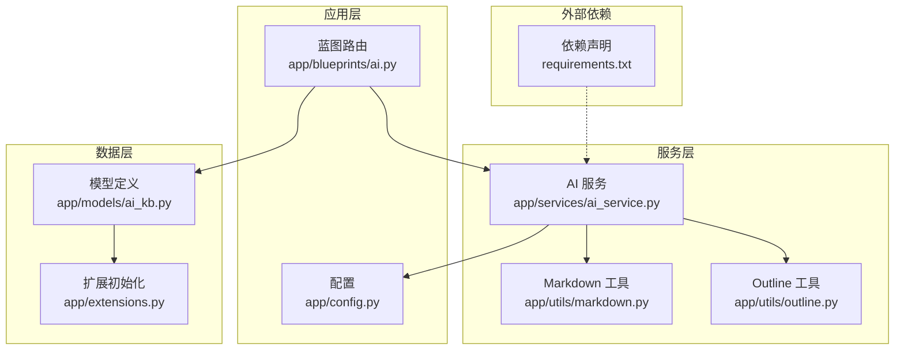
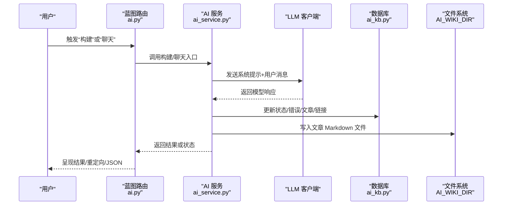
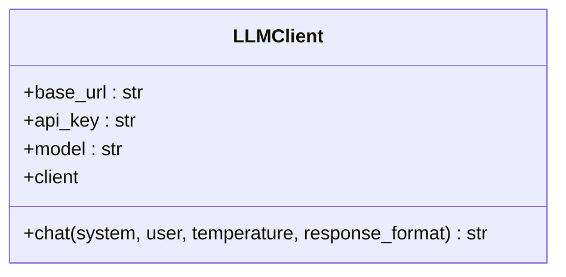
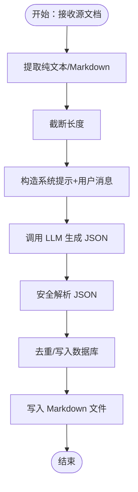
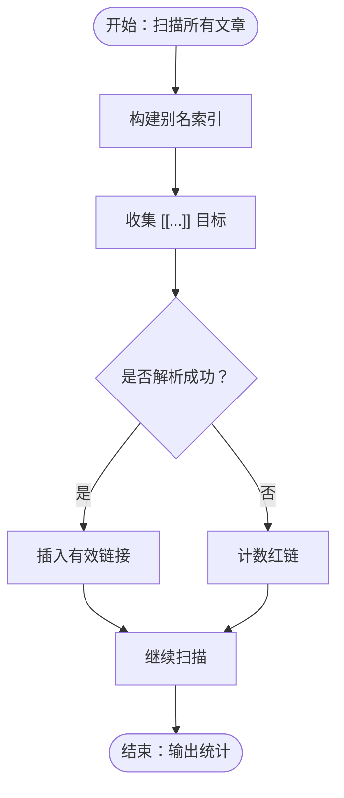
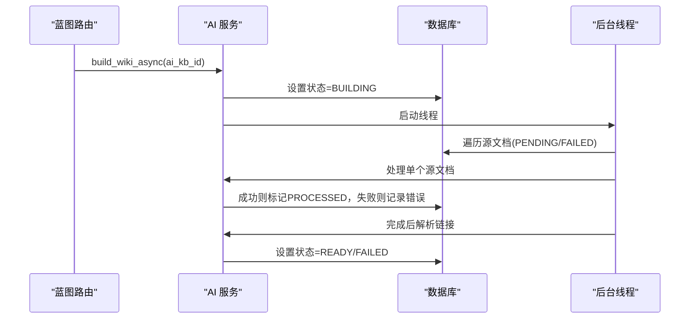
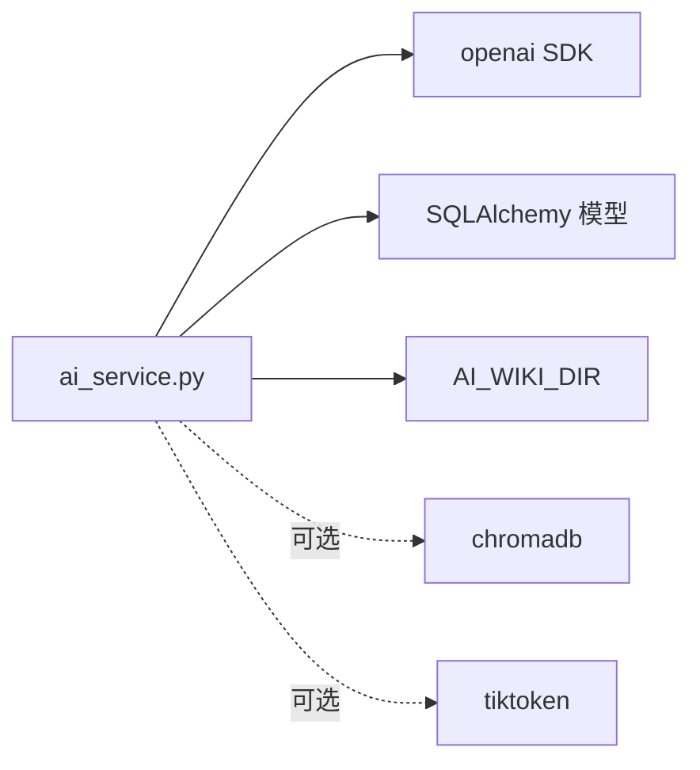

# AI知识库问题

<cite>
**本文引用的文件**
- [app/blueprints/ai.py](file://app/blueprints/ai.py)
- [app/services/ai_service.py](file://app/services/ai_service.py)
- [app/models/ai_kb.py](file://app/models/ai_kb.py)
- [app/config.py](file://app/config.py)
- [app/utils/markdown.py](file://app/utils/markdown.py)
- [app/utils/outline.py](file://app/utils/outline.py)
- [requirements.txt](file://requirements.txt)
- [scripts/init_db.py](file://scripts/init_db.py)
- [app/extensions.py](file://app/extensions.py)
</cite>

## 目录
1. [简介](#简介)
2. [项目结构](#项目结构)
3. [核心组件](#核心组件)
4. [架构总览](#架构总览)
5. [详细组件分析](#详细组件分析)
6. [依赖分析](#依赖分析)
7. [性能考量](#性能考量)
8. [故障排除指南](#故障排除指南)
9. [结论](#结论)
10. [附录](#附录)

## 简介
本指南面向 My Wiki 的 AI 知识库功能，聚焦于常见 AI 相关故障的诊断与修复，包括但不限于：
- AI API 调用错误（如连接超时、配额限制、鉴权失败）
- 模型响应异常（如 JSON 解析失败、响应格式不合规）
- Wiki 构建失败（LLM 调用失败、文章落盘失败、链接解析异常）
- 搜索索引问题（红链过多、链接解析失败）
- 数据预处理问题（Editor.js 内容提取、Markdown 渲染）
- 查询性能下降（关键词匹配、上下文拼接）
- AI 服务监控与日志分析

本指南提供从配置到运行时的端到端排查路径，帮助快速定位并解决问题。

## 项目结构
AI 知识库功能由蓝图路由、服务层、模型层、工具函数与配置共同组成。关键模块职责如下：
- 蓝图路由：负责接收请求、组织参数、触发异步构建与聊天流程
- 服务层：封装 LLM 客户端、文章构建、链接解析、异步任务调度
- 模型层：定义 AI 知识库、来源、文章、链接、分片等实体
- 工具函数：Markdown 渲染、[[Wiki 链接]] 收集、Editor.js 内容提取
- 配置：统一管理 OPENAI_BASE_URL、OPENAI_API_KEY、CHAT_MODEL、AI_WIKI_DIR 等

图表来源
- [app/blueprints/ai.py](file://app/blueprints/ai.py)
- [app/services/ai_service.py](file://app/services/ai_service.py)
- [app/models/ai_kb.py](file://app/models/ai_kb.py)
- [app/config.py](file://app/config.py)
- [app/utils/markdown.py](file://app/utils/markdown.py)
- [app/utils/outline.py](file://app/utils/outline.py)
- [requirements.txt](file://requirements.txt)

章节来源
- [app/blueprints/ai.py](file://app/blueprints/ai.py)
- [app/services/ai_service.py](file://app/services/ai_service.py)
- [app/models/ai_kb.py](file://app/models/ai_kb.py)
- [app/config.py](file://app/config.py)
- [app/utils/markdown.py](file://app/utils/markdown.py)
- [app/utils/outline.py](file://app/utils/outline.py)
- [requirements.txt](file://requirements.txt)

## 核心组件
- LLM 客户端：封装 OpenAI 兼容 SDK，支持 base_url、api_key、model 参数，负责 chat 接口调用
- 文章构建器：将源文档转换为 Wiki 条目草稿（标题、别名、摘要、标签、正文、相关条目），并持久化与落盘
- 链接解析器：扫描文章中的 [[目标]]，构建别名索引，生成正向/反向链接，统计红链
- 异步构建管线：后台线程执行构建任务，更新状态与错误信息
- 聊天接口：在启用 RAG 前置条件下进行检索增强问答（当前实现为关键词匹配的非向量化方案）

章节来源
- [app/services/ai_service.py](file://app/services/ai_service.py)
- [app/models/ai_kb.py](file://app/models/ai_kb.py)

## 架构总览
AI 知识库的运行时交互序列如下：

图表来源
- [app/blueprints/ai.py](file://app/blueprints/ai.py)
- [app/services/ai_service.py](file://app/services/ai_service.py)
- [app/models/ai_kb.py](file://app/models/ai_kb.py)
- [app/config.py](file://app/config.py)

## 详细组件分析

### LLM 客户端与聊天流程
- LLM 客户端负责加载配置（OPENAI_BASE_URL、OPENAI_API_KEY、CHAT_MODEL），实例化 OpenAI SDK 客户端，并提供 chat 方法
- 聊天接口在构建阶段用于生成文章草稿，在问答阶段用于检索后生成回答
- 错误处理：SDK 导入失败、网络异常、响应为空等均会被捕获并记录

图表来源
- [app/services/ai_service.py](file://app/services/ai_service.py)
- [app/config.py](file://app/config.py)

章节来源
- [app/services/ai_service.py](file://app/services/ai_service.py)
- [app/config.py](file://app/config.py)

### 文章构建与落盘
- 输入：单篇源文档（Editor.js JSON 或纯文本）
- 处理：提取纯文本/Markdown，截断长度，构造系统提示，调用 LLM 生成 JSON，解析草稿，去重别名与标签，写入数据库与 Markdown 文件
- 输出：AIKBArticle 记录与本地文件（AI_WIKI_DIR/{ai_kb_id}/{slug}.md）

图表来源
- [app/services/ai_service.py](file://app/services/ai_service.py)
- [app/utils/outline.py](file://app/utils/outline.py)
- [app/config.py](file://app/config.py)

章节来源
- [app/services/ai_service.py](file://app/services/ai_service.py)
- [app/utils/outline.py](file://app/utils/outline.py)
- [app/config.py](file://app/config.py)

### 链接解析与红链统计
- 别名索引：标题、slug、aliases 均可解析为目标文章
- 链接扫描：遍历所有文章的 [[...]]，生成正向/反向链接，统计红链数量
- 红链：目标无法解析到现有文章时产生

图表来源
- [app/services/ai_service.py](file://app/services/ai_service.py)
- [app/utils/markdown.py](file://app/utils/markdown.py)

章节来源
- [app/services/ai_service.py](file://app/services/ai_service.py)
- [app/utils/markdown.py](file://app/utils/markdown.py)

### 异步构建与状态管理
- 启动构建：设置状态为 BUILDING，清空错误信息
- 执行流程：逐条处理源文档，更新源状态与错误信息；完成后解析链接，设置状态为 READY 并记录时间
- 失败回退：捕获异常，设置状态为 FAILED 并记录错误摘要

图表来源
- [app/blueprints/ai.py](file://app/blueprints/ai.py)
- [app/services/ai_service.py](file://app/services/ai_service.py)
- [app/models/ai_kb.py](file://app/models/ai_kb.py)

章节来源
- [app/blueprints/ai.py](file://app/blueprints/ai.py)
- [app/services/ai_service.py](file://app/services/ai_service.py)
- [app/models/ai_kb.py](file://app/models/ai_kb.py)

## 依赖分析
- OpenAI SDK：用于 LLM 调用
- 可选向量化：当启用 RAG 时需要 chromadb/tiktoken，当前仓库未强制安装
- 数据库：通过 SQLAlchemy 操作 AI_KNOWLEDGE_BASES/AI_KB_SOURCES/AI_KB_ARTICLES/AI_KB_LINKS 等表
- 文件系统：AI_WIKI_DIR 存放生成的 Markdown 文件

图表来源
- [app/services/ai_service.py](file://app/services/ai_service.py)
- [requirements.txt](file://requirements.txt)
- [app/config.py](file://app/config.py)

章节来源
- [requirements.txt](file://requirements.txt)
- [app/config.py](file://app/config.py)
- [app/services/ai_service.py](file://app/services/ai_service.py)

## 性能考量
- 文本截断：对输入文本进行长度限制，避免超出模型上下文或成本过高
- 关键词匹配：问答阶段采用关键词重叠评分，复杂度与文章数量线性相关
- 文件 I/O：文章落盘为同步写入，建议确保磁盘性能与目录权限
- 线程并发：构建在后台线程执行，避免阻塞主线程

章节来源
- [app/services/ai_service.py](file://app/services/ai_service.py)

## 故障排除指南

### 一、API 连接与鉴权问题
症状
- LLM 调用报错（导入失败、连接超时、401/403）
- 无法生成文章或聊天失败

排查步骤
- 检查环境变量与配置
  - OPENAI_BASE_URL 是否正确指向供应商或代理地址
  - OPENAI_API_KEY 是否设置且未被遮蔽
  - CHAT_MODEL 是否为可用模型名称
- 验证 SDK 安装
  - requirements 中 openai 版本是否满足
- 网络连通性
  - 服务器能否访问 OPENAI_BASE_URL
  - 代理/防火墙是否允许出站请求
- 速率限制与配额
  - 供应商侧是否存在配额不足或限流
- 本地日志
  - 查看应用日志中 LLM 客户端初始化与调用栈

章节来源
- [app/config.py](file://app/config.py)
- [app/services/ai_service.py](file://app/services/ai_service.py)
- [requirements.txt](file://requirements.txt)

### 二、模型响应异常
症状
- JSON 解析失败、响应为空、格式不符
- 文章草稿字段缺失或异常

排查步骤
- 检查系统提示与用户消息构造
  - 系统提示是否要求 JSON 输出
  - 用户消息是否包含必要字段
- 安全解析策略
  - 是否启用 _safe_json_loads 并正确处理 JSON 片段
- 模型能力
  - 指定模型是否支持 JSON 响应格式
- 重试与降级
  - 对失败的源文档单独重试，避免整批中断

章节来源
- [app/services/ai_service.py](file://app/services/ai_service.py)

### 三、Wiki 构建失败
症状
- 状态停留在 BUILDING
- 源状态频繁切换为 FAILED
- 文章未生成或链接未解析

排查步骤
- 状态与错误信息
  - 通过状态接口查看 AI_KNOWLEDGE_BASES.error_msg 与各源的 err_msg
- 源文档有效性
  - 源文档是否存在、是否被删除
  - 用户是否有访问权限
- LLM 调用链路
  - 单个源文档失败时，检查其 err_msg 摘要
- 文件落盘
  - AI_WIKI_DIR 是否可写，权限是否足够
- 链接解析
  - 红链数量是否异常增多，影响渲染体验

章节来源
- [app/blueprints/ai.py](file://app/blueprints/ai.py)
- [app/services/ai_service.py](file://app/services/ai_service.py)
- [app/models/ai_kb.py](file://app/models/ai_kb.py)
- [app/config.py](file://app/config.py)

### 四、搜索索引与链接问题
症状
- 红链过多、跳转无效
- 链接解析不稳定

排查步骤
- 别名索引
  - 标题、slug、aliases 是否重复或大小写不一致
- 链接扫描
  - 文章内容中 [[...]] 是否规范，是否包含换行或非法字符
- 解析流程
  - 是否在构建完成后执行 resolve_links
  - 是否清理旧链接再重建

章节来源
- [app/services/ai_service.py](file://app/services/ai_service.py)
- [app/utils/markdown.py](file://app/utils/markdown.py)

### 五、数据预处理问题
症状
- 文章内容为空或缺失
- Markdown 渲染异常

排查步骤
- Editor.js 内容提取
  - content_json 是否为合法 JSON
  - 提取 Outline/Plain Text 是否为空
- Markdown 渲染
  - render_wiki_markdown 是否正确替换 [[...]] 为占位锚点
  - 最终 HTML 是否被清洗与转义

章节来源
- [app/utils/outline.py](file://app/utils/outline.py)
- [app/utils/markdown.py](file://app/utils/markdown.py)

### 六、查询性能下降
症状
- 问答响应慢、关键词匹配耗时长

排查步骤
- 评分逻辑
  - 关键词集合是否过大，导致匹配开销高
- 上下文拼接
  - 选择的文章数量与每篇内容长度是否合理
- 优化建议
  - 适当减少 max_articles
  - 对重复词进行去重

章节来源
- [app/services/ai_service.py](file://app/services/ai_service.py)

### 七、AI 服务监控与日志分析
建议措施
- 应用日志
  - 记录构建开始/结束、每个源的状态变更、错误摘要
- 数据库指标
  - 统计 AI_KNOWLEDGE_BASES.status 分布、红链数量趋势
- 健康检查
  - 定期调用状态接口，观察 last_built_at 与 error_msg
- 告警机制
  - 当状态长时间为 BUILDING 或 error_msg 频繁变化时触发告警

章节来源
- [app/blueprints/ai.py](file://app/blueprints/ai.py)
- [app/models/ai_kb.py](file://app/models/ai_kb.py)

## 结论
本指南围绕 My Wiki 的 AI 知识库功能，提供了从配置、服务、模型到工具函数的全链路故障排查路径。通过关注 LLM 客户端初始化、文章构建与落盘、链接解析、异步构建状态与错误记录，以及数据预处理与性能优化，可以系统性地定位并解决常见 AI 相关问题。建议在生产环境中结合应用日志与数据库指标建立持续监控与告警体系，保障知识库稳定运行。

## 附录

### A. 关键配置项速查
- OPENAI_BASE_URL：LLM 服务地址
- OPENAI_API_KEY：API 密钥
- CHAT_MODEL：默认对话模型
- AI_WIKI_DIR：文章 Markdown 文件存储目录
- ENABLE_RAG/EMBEDDING_MODEL/CHROMA_PATH：RAG 相关配置（可选）

章节来源
- [app/config.py](file://app/config.py)

### B. 初始化与数据库准备
- 使用脚本初始化数据库与管理员账号
- 确保数据库迁移与表结构完整

章节来源
- [scripts/init_db.py](file://scripts/init_db.py)