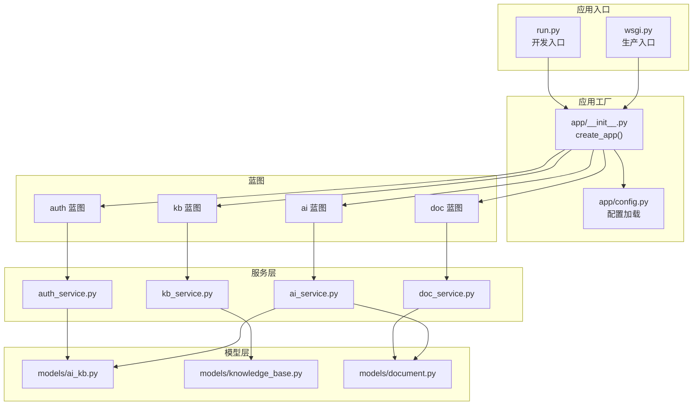
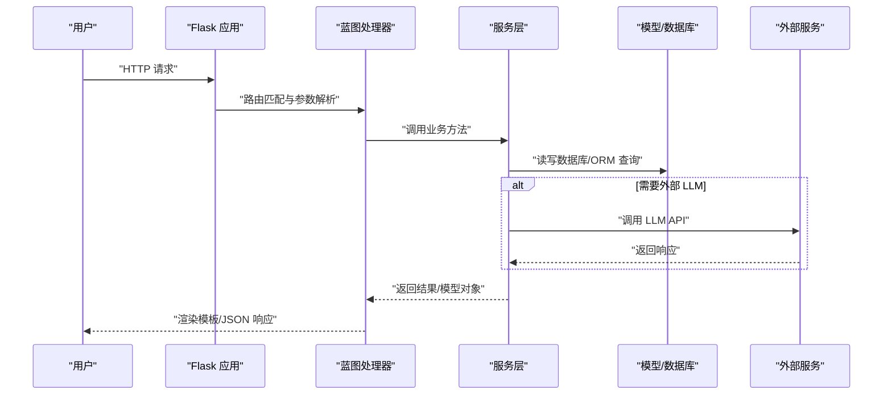
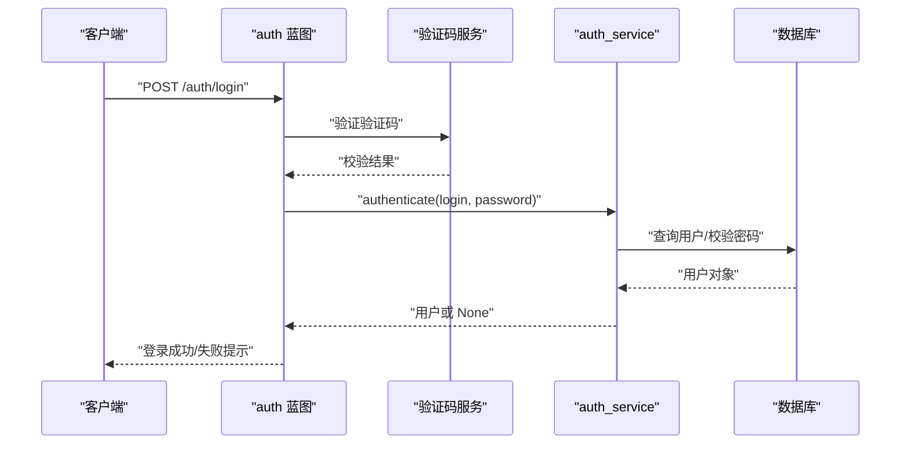
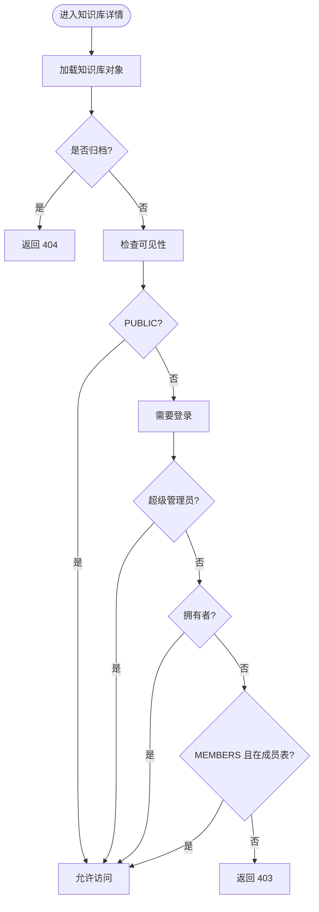
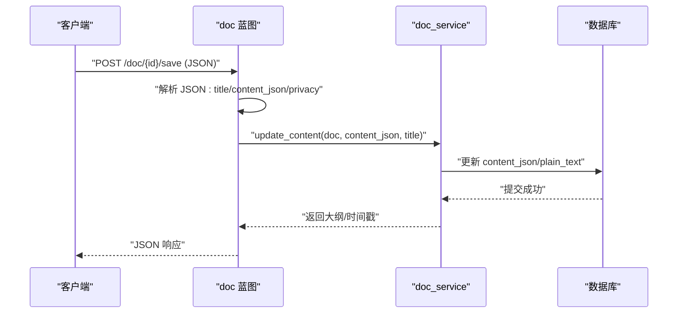
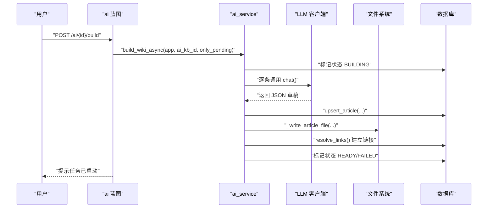
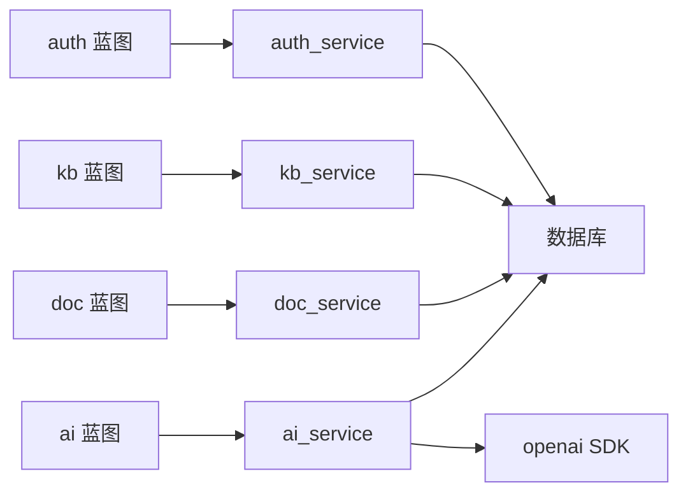

# 故障排除

<cite>
**本文引用的文件**
- [README.md](file://README.md)
- [app/__init__.py](file://app/__init__.py)
- [app/config.py](file://app/config.py)
- [run.py](file://run.py)
- [wsgi.py](file://wsgi.py)
- [app/blueprints/auth.py](file://app/blueprints/auth.py)
- [app/services/auth_service.py](file://app/services/auth_service.py)
- [app/blueprints/kb.py](file://app/blueprints/kb.py)
- [app/services/kb_service.py](file://app/services/kb_service.py)
- [app/blueprints/doc.py](file://app/blueprints/doc.py)
- [app/services/doc_service.py](file://app/services/doc_service.py)
- [app/blueprints/ai.py](file://app/blueprints/ai.py)
- [app/services/ai_service.py](file://app/services/ai_service.py)
- [app/models/ai_kb.py](file://app/models/ai_kb.py)
- [app/models/knowledge_base.py](file://app/models/knowledge_base.py)
- [app/models/document.py](file://app/models/document.py)
</cite>

## 目录
1. [简介](#简介)
2. [项目结构](#项目结构)
3. [核心组件](#核心组件)
4. [架构总览](#架构总览)
5. [详细组件分析](#详细组件分析)
6. [依赖关系分析](#依赖关系分析)
7. [性能考虑](#性能考虑)
8. [故障排除指南](#故障排除指南)
9. [结论](#结论)
10. [附录](#附录)

## 简介
本指南面向 My Wiki 的使用者与运维人员，聚焦于常见故障的诊断与解决，覆盖用户认证、知识库访问、文档编辑、AI 知识库、数据库连接、第三方服务集成以及系统资源等问题。文档提供可操作的排查步骤、日志分析技巧、调试工具使用与性能优化建议，并给出预防性维护与监控告警配置思路。

## 项目结构
My Wiki 基于 Flask 应用工厂模式构建，采用蓝图划分功能域，服务层封装业务逻辑，模型层定义数据结构，配置集中管理环境变量与默认值。开发与生产入口分别通过独立脚本加载环境变量并创建应用实例。

图表来源
- [app/__init__.py:11-28](file://app/__init__.py#L11-L28)
- [app/config.py:15-83](file://app/config.py#L15-L83)
- [run.py:7-16](file://run.py#L7-L16)
- [wsgi.py:7-9](file://wsgi.py#L7-L9)

章节来源
- [README.md:1-3](file://README.md#L1-L3)
- [app/__init__.py:11-28](file://app/__init__.py#L11-L28)
- [app/config.py:15-83](file://app/config.py#L15-L83)
- [run.py:7-16](file://run.py#L7-L16)
- [wsgi.py:7-9](file://wsgi.py#L7-L9)

## 核心组件
- 应用工厂与配置
  - 应用工厂负责初始化扩展、注册蓝图、错误处理与上下文注入，并根据环境变量选择配置类。
  - 配置类集中管理数据库连接、会话与 Cookie、上传目录与大小限制、AI 服务参数、RAG 开关与嵌入模型、验证码 TTL、分页参数等。
- 认证与会话
  - 认证蓝图提供注册、登录、登出与验证码接口；服务层执行输入校验、用户创建、密码校验与登录记录。
- 知识库与成员
  - 知识库蓝图提供列表、新建、详情、编辑、删除、成员管理等功能；服务层实现可见性判断、编辑/管理权限判定与成员增删。
- 文档与分享
  - 文档蓝图支持新建、查看、编辑、保存、删除与分享；服务层提供树形结构查询、内容更新、软删除与后代收集。
- AI 知识库
  - AI 蓝图实现 AI 知识库生命周期管理、源文档选择、异步构建、状态查询、文章浏览、图谱与聊天（可选）。
  - AI 服务封装 LLM 客户端、文章构建、别名索引与链接解析、异步构建与再生流程、RAG 聊天。

章节来源
- [app/__init__.py:39-74](file://app/__init__.py#L39-L74)
- [app/config.py:15-83](file://app/config.py#L15-L83)
- [app/blueprints/auth.py:19-76](file://app/blueprints/auth.py#L19-L76)
- [app/services/auth_service.py:21-56](file://app/services/auth_service.py#L21-L56)
- [app/blueprints/kb.py:21-141](file://app/blueprints/kb.py#L21-L141)
- [app/services/kb_service.py:10-80](file://app/services/kb_service.py#L10-L80)
- [app/blueprints/doc.py:20-139](file://app/blueprints/doc.py#L20-L139)
- [app/services/doc_service.py:11-81](file://app/services/doc_service.py#L11-L81)
- [app/blueprints/ai.py:27-279](file://app/blueprints/ai.py#L27-L279)
- [app/services/ai_service.py:47-408](file://app/services/ai_service.py#L47-L408)

## 架构总览
My Wiki 的运行时交互围绕“请求—蓝图—服务—模型—数据库/外部服务”的路径展开。认证与权限贯穿所有受保护路由；知识库与文档的访问控制由服务层统一判定；AI 知识库通过异步线程构建，必要时调用外部 LLM API。

图表来源
- [app/__init__.py:39-74](file://app/__init__.py#L39-L74)
- [app/blueprints/auth.py:51-76](file://app/blueprints/auth.py#L51-L76)
- [app/services/auth_service.py:44-56](file://app/services/auth_service.py#L44-L56)
- [app/services/ai_service.py:313-344](file://app/services/ai_service.py#L313-L344)

## 详细组件分析

### 认证与会话（登录失败、密码重置异常）
- 关键点
  - 登录流程：验证码校验 → 用户认证（用户名/邮箱 + 密码）→ 记住登录信息 → 成功跳转。
  - 注册流程：验证码校验 → 输入校验（用户名、邮箱、密码一致性）→ 创建用户 → 登录并记录。
  - 服务层对用户名、邮箱、密码长度与重复占用进行校验，抛出自定义异常供蓝图捕获并反馈。
- 常见问题定位
  - 登录失败：检查验证码是否过期、用户是否存在且激活、密码是否正确；确认会话 Cookie 配置与浏览器隐私设置。
  - 注册异常：核对用户名/邮箱正则、密码长度与一致性、唯一性约束；查看数据库连接与事务提交。
- 诊断步骤
  - 启用调试模式，观察蓝图返回的错误消息与状态码。
  - 检查验证码接口可用性与缓存头设置。
  - 核对 SECRET_KEY、SESSION_COOKIE_* 配置与反向代理头（如 X-Forwarded-For）。
- 解决方案
  - 修正配置项（如 SECRET_KEY、数据库 URL），确保实例目录可写。
  - 对外网暴露服务时，确保 Cookie SameSite/Lax 与 HttpOnly 设置合理。

图表来源
- [app/blueprints/auth.py:51-76](file://app/blueprints/auth.py#L51-L76)
- [app/services/auth_service.py:44-56](file://app/services/auth_service.py#L44-L56)

章节来源
- [app/blueprints/auth.py:19-76](file://app/blueprints/auth.py#L19-L76)
- [app/services/auth_service.py:21-56](file://app/services/auth_service.py#L21-L56)
- [app/config.py:28-31](file://app/config.py#L28-L31)

### 知识库访问（权限不足、可见性配置错误）
- 关键点
  - 可访问性判定：公开知识库直接允许；私有/成员可见需登录；超级管理员与拥有者始终允许；成员可见需在成员表中存在。
  - 编辑/管理权限：编辑需为拥有者或成员且角色为编辑；管理需为拥有者。
- 常见问题定位
  - 403 错误：确认当前用户身份、知识库可见性、成员角色与拥有者关系。
  - 可见性配置错误：检查知识库 visibility 字段与枚举值；确认成员表存在有效记录。
- 诊断步骤
  - 在蓝图中打印当前用户与知识库对象，核对 can_access/can_edit/can_manage 返回值。
  - 检查数据库中知识库与成员记录，确认 is_archived 与 owner_id。
- 解决方案
  - 将目标用户添加为成员并设置合适角色；调整知识库可见性为公开或成员可见；确保拥有者权限。

图表来源
- [app/blueprints/kb.py:56-72](file://app/blueprints/kb.py#L56-L72)
- [app/services/kb_service.py:10-23](file://app/services/kb_service.py#L10-L23)

章节来源
- [app/blueprints/kb.py:21-141](file://app/blueprints/kb.py#L21-L141)
- [app/services/kb_service.py:10-80](file://app/services/kb_service.py#L10-L80)
- [app/models/knowledge_base.py:8-42](file://app/models/knowledge_base.py#L8-L42)

### 文档编辑（富文本编辑器异常、文件上传失败）
- 关键点
  - 文档保存：蓝图接收 JSON 负载，服务层更新标题、内容与隐私字段，提取纯文本用于索引/检索。
  - 上传限制：最大内容长度与上传目录由配置控制；蓝图中对上传大小进行限制。
- 常见问题定位
  - 富文本编辑器异常：检查 content_json 结构是否符合预期；确认前端序列化与后端解析一致。
  - 文件上传失败：检查 MAX_CONTENT_LENGTH 与实际上传大小；确认 UPLOAD_DIR 可写。
- 诊断步骤
  - 查看蓝图保存接口的请求负载与返回 JSON；核对数据库 content_json 与 plain_text 字段。
  - 检查 Flask 的 MAX_CONTENT_LENGTH 与蓝图中的上传限制逻辑。
- 解决方案
  - 调整 MAX_CONTENT_LENGTH 与上传目录权限；修复前端编辑器输出结构；确保数据库引擎选项与连接池配置稳定。

图表来源
- [app/blueprints/doc.py:69-84](file://app/blueprints/doc.py#L69-L84)
- [app/services/doc_service.py:56-62](file://app/services/doc_service.py#L56-L62)

章节来源
- [app/blueprints/doc.py:20-139](file://app/blueprints/doc.py#L20-L139)
- [app/services/doc_service.py:11-81](file://app/services/doc_service.py#L11-L81)
- [app/config.py:33-35](file://app/config.py#L33-L35)

### AI 知识库（API 调用错误、模型响应异常）
- 关键点
  - LLM 客户端：封装 OpenAI 兼容 SDK，从配置读取 base_url、api_key、model；支持响应格式化。
  - 构建流程：异步线程遍历源文档，逐条调用 LLM 生成文章草稿，入库并写入 Markdown 文件；随后扫描 [[...]] 链接并建立索引。
  - 聊天能力：可选 RAG 或纯关键词检索；当启用 RAG 时需配置嵌入与向量存储（本模块默认不强制依赖）。
- 常见问题定位
  - API 调用错误：检查 OPENAI_BASE_URL、OPENAI_API_KEY、CHAT_MODEL 是否正确；确认网络可达与速率限制。
  - 模型响应异常：关注 JSON 解析失败、LLM 返回非期望格式；查看源文档内容长度与截断策略。
- 诊断步骤
  - 查看 AI 知识库状态接口返回的 error_msg 与 last_built_at；核对源文档状态（PENDING/PROCESSING/PROCESSED/FAILED）。
  - 在异步构建线程中捕获异常并写入源文档错误信息；检查线程是否正常启动与数据库上下文。
- 解决方案
  - 补充或修正 OPENAI_* 环境变量；必要时更换兼容供应商；控制单次输入长度与温度参数；确保 AI_WIKI_DIR 可写。

图表来源
- [app/blueprints/ai.py:143-156](file://app/blueprints/ai.py#L143-L156)
- [app/services/ai_service.py:313-344](file://app/services/ai_service.py#L313-L344)
- [app/services/ai_service.py:47-86](file://app/services/ai_service.py#L47-L86)

章节来源
- [app/blueprints/ai.py:27-279](file://app/blueprints/ai.py#L27-L279)
- [app/services/ai_service.py:47-408](file://app/services/ai_service.py#L47-L408)
- [app/config.py:37-47](file://app/config.py#L37-L47)

## 依赖关系分析
- 组件耦合
  - 蓝图依赖服务层；服务层依赖模型与数据库；AI 服务依赖外部 LLM SDK；配置贯穿全链路。
- 外部依赖
  - 数据库驱动与 ORM；Flask 扩展（SQLAlchemy、LoginManager、CSRF）；可选的 OpenAI SDK。
- 潜在循环依赖
  - 当前结构以蓝图→服务→模型→数据库单向依赖为主，未发现明显循环。

图表来源
- [app/blueprints/auth.py:5,6:5-6](file://app/blueprints/auth.py#L5-L6)
- [app/services/ai_service.py:66-70](file://app/services/ai_service.py#L66-L70)

章节来源
- [app/__init__.py:39-43](file://app/__init__.py#L39-L43)
- [app/services/ai_service.py:66-70](file://app/services/ai_service.py#L66-L70)

## 性能考虑
- 数据库连接
  - 使用 pool_pre_ping 与 pool_recycle 降低连接失效风险；建议在高并发场景下评估连接池大小与超时。
- 上传与文件
  - 控制 MAX_CONTENT_LENGTH 与上传目录磁盘空间；大文档建议分块上传或外部对象存储。
- AI 构建
  - 异步线程避免阻塞主线程；合理设置温度与输入长度上限；必要时开启 RAG 并配置嵌入模型与向量存储。
- 缓存与静态资源
  - 验证码接口设置无缓存头；生产环境建议启用 CDN 与静态资源压缩。

[本节为通用指导，无需具体文件来源]

## 故障排除指南

### 一、用户认证问题
- 症状
  - 登录失败、验证码无效、注册报错。
- 排查步骤
  - 确认 SECRET_KEY、SESSION_COOKIE_* 配置；检查登录/注册表单参数与验证码接口。
  - 查看 auth_service 的校验规则与异常抛出位置；核对数据库中用户记录与密码哈希。
- 解决方案
  - 修正配置；确保实例目录可写；检查浏览器 Cookie 设置与反向代理头透传。

章节来源
- [app/blueprints/auth.py:51-76](file://app/blueprints/auth.py#L51-L76)
- [app/services/auth_service.py:21-56](file://app/services/auth_service.py#L21-L56)
- [app/config.py:28-31](file://app/config.py#L28-L31)

### 二、知识库访问问题
- 症状
  - 403 权限不足、公开知识库无法访问。
- 排查步骤
  - 检查知识库 visibility、成员表与拥有者；确认 can_access/can_edit/can_manage 返回值。
- 解决方案
  - 添加成员并设置编辑/查看角色；调整可见性为公开或成员可见；确保拥有者权限。

章节来源
- [app/blueprints/kb.py:56-72](file://app/blueprints/kb.py#L56-L72)
- [app/services/kb_service.py:10-80](file://app/services/kb_service.py#L10-L80)
- [app/models/knowledge_base.py:8-42](file://app/models/knowledge_base.py#L8-L42)

### 三、文档编辑问题
- 症状
  - 保存失败、富文本内容异常、上传超限。
- 排查步骤
  - 检查请求 JSON 结构与 content_json；核对 MAX_CONTENT_LENGTH 与上传目录权限。
- 解决方案
  - 调整上传限制与目录权限；修复前端输出结构；确保数据库连接稳定。

章节来源
- [app/blueprints/doc.py:69-84](file://app/blueprints/doc.py#L69-L84)
- [app/services/doc_service.py:56-62](file://app/services/doc_service.py#L56-L62)
- [app/config.py:33-35](file://app/config.py#L33-L35)

### 四、AI 知识库问题
- 症状
  - 构建任务卡住、状态显示 FAILED、聊天无响应。
- 排查步骤
  - 查看状态接口返回的 error_msg 与 last_built_at；检查源文档状态与 LLM 返回格式。
- 解决方案
  - 补充 OPENAI_* 环境变量；更换兼容供应商；控制输入长度与温度；确保 AI_WIKI_DIR 可写。

章节来源
- [app/blueprints/ai.py:159-173](file://app/blueprints/ai.py#L159-L173)
- [app/services/ai_service.py:313-344](file://app/services/ai_service.py#L313-L344)
- [app/config.py:37-47](file://app/config.py#L37-L47)

### 五、数据库连接问题
- 症状
  - 连接超时、连接池耗尽、迁移失败。
- 排查步骤
  - 检查 DATABASE_URL 与 SQLALCHEMY_ENGINE_OPTIONS；确认数据库服务可达与账号权限。
- 解决方案
  - 调整 pool_pre_ping/pool_recycle；增加连接池大小；确保数据库版本兼容。

章节来源
- [app/config.py:18-26](file://app/config.py#L18-L26)
- [app/__init__.py:40-43](file://app/__init__.py#L40-L43)

### 六、第三方服务集成问题
- 症状
  - LLM API 调用失败、响应格式异常。
- 排查步骤
  - 校验 OPENAI_BASE_URL、OPENAI_API_KEY、CHAT_MODEL；检查网络连通与速率限制。
- 解决方案
  - 更换供应商或本地代理；调整温度与输入长度；增强 JSON 解析容错。

章节来源
- [app/services/ai_service.py:47-86](file://app/services/ai_service.py#L47-L86)
- [app/config.py:37-40](file://app/config.py#L37-L40)

### 七、系统资源问题
- 症状
  - 内存占用过高、CPU 使用率飙升、磁盘空间不足。
- 排查步骤
  - 监控进程资源使用；检查上传目录与 AI 知识库导出目录大小。
- 解决方案
  - 限制并发与批量操作；清理历史构建产物；扩容磁盘与内存。

[本节为通用指导，无需具体文件来源]

### 八、错误日志分析与调试工具
- 日志与调试
  - 开发模式下启用 debug；生产环境通过 WSGI 日志与系统日志收集错误堆栈。
  - 关注蓝图错误处理器返回的 403/404/500 页面与模板渲染。
- 调试工具
  - 使用 Flask shell 或 Python 调试器检查数据库查询与对象状态。
  - 对 AI 构建线程，可在异常处记录详细上下文与源文档 ID。

章节来源
- [app/__init__.py:76-87](file://app/__init__.py#L76-L87)
- [app/services/ai_service.py:307-310](file://app/services/ai_service.py#L307-L310)

### 九、预防性维护与监控告警
- 预防性维护
  - 定期备份数据库与上传/导出目录；轮换 SECRET_KEY；更新依赖包。
- 监控告警
  - 监控数据库连接数、响应时间与错误率；监控 AI 构建队列积压与失败率；监控磁盘使用率与 CPU/内存。
  - 告警阈值建议：数据库连接空闲超时、AI 构建失败率、上传失败率、页面 5xx 错误率。

[本节为通用指导，无需具体文件来源]

## 结论
通过梳理认证、知识库、文档与 AI 知识库的关键路径与数据流，结合配置与服务层的职责边界，可以系统化地定位与解决常见故障。建议在生产环境中完善日志与监控体系，定期进行资源与配置巡检，以保障系统稳定性与用户体验。

## 附录
- 快速检查清单
  - 配置项：DATABASE_URL、OPENAI_*、CHAT_MODEL、UPLOAD_DIR、MAX_CONTENT_LENGTH、AI_WIKI_DIR。
  - 权限：知识库可见性、成员角色、拥有者关系。
  - 资源：磁盘空间、数据库连接池、网络连通性。
  - 日志：Flask 错误页面、WSGI 日志、AI 构建异常信息。

[本节为通用指导，无需具体文件来源]