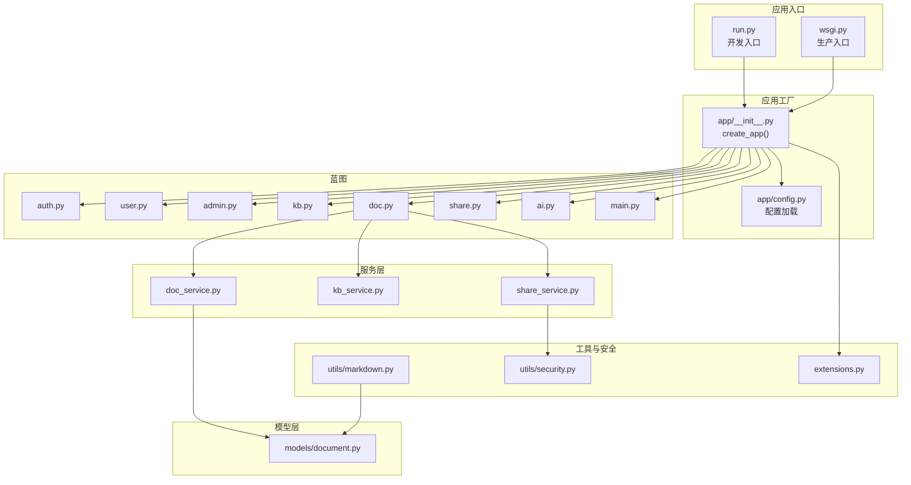
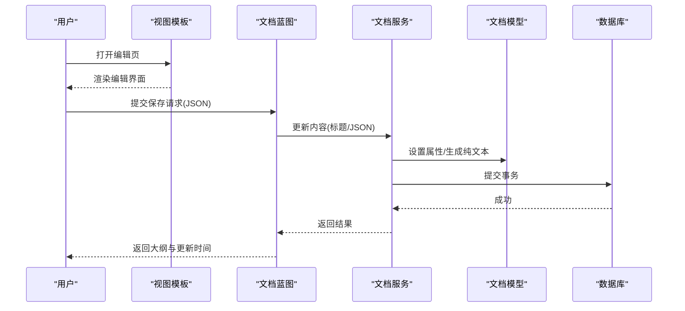
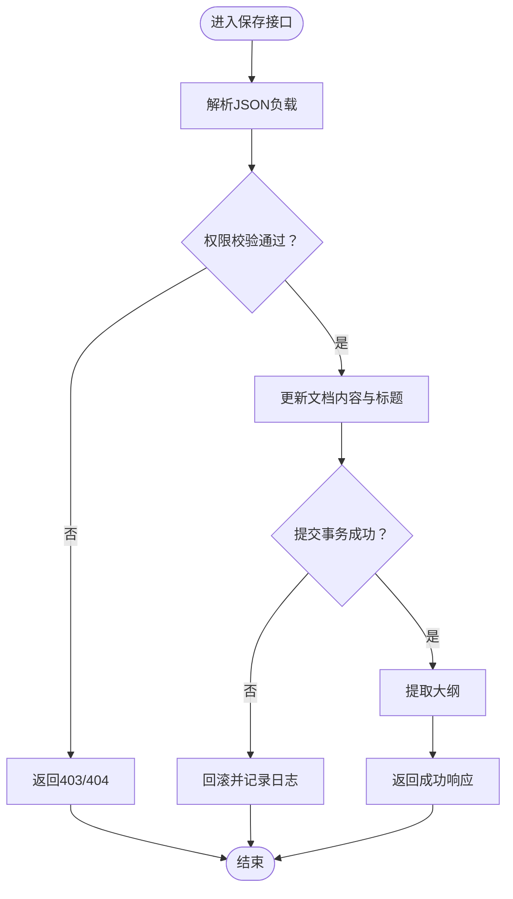
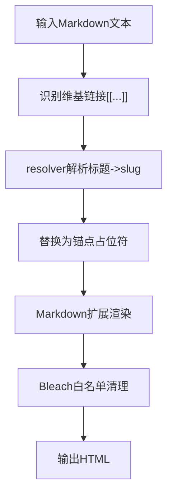
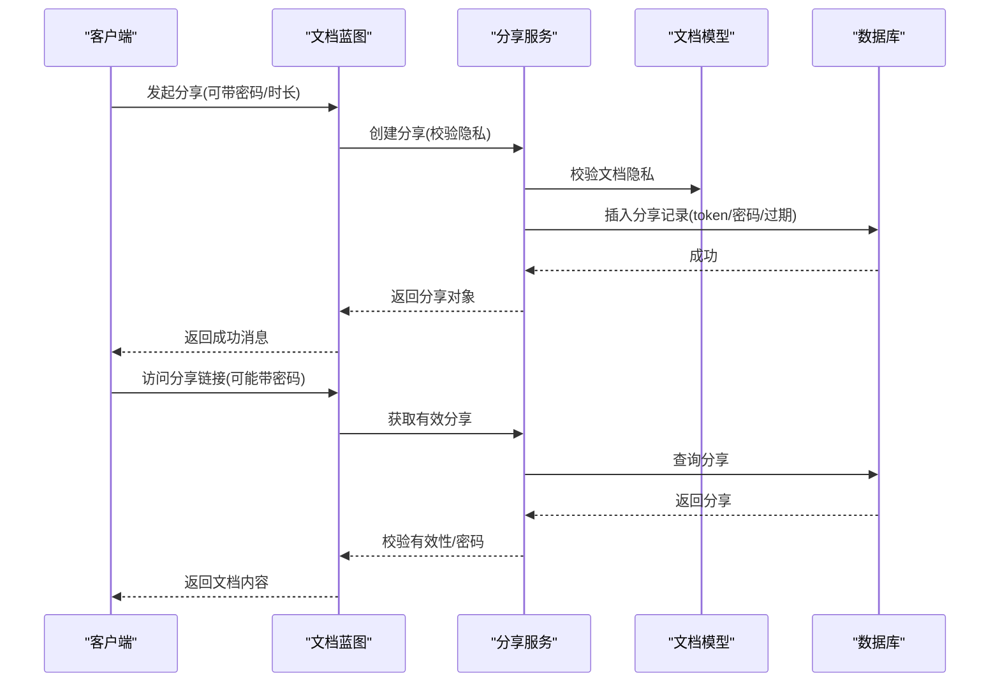
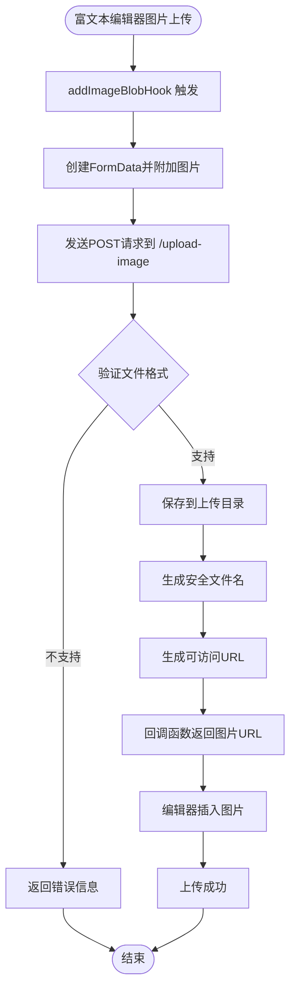
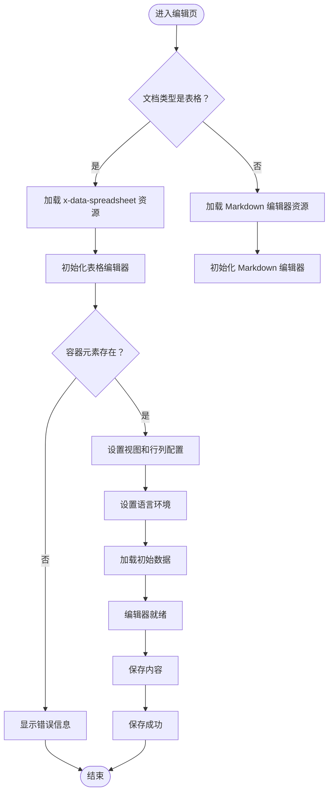
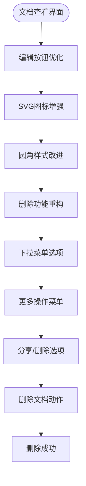
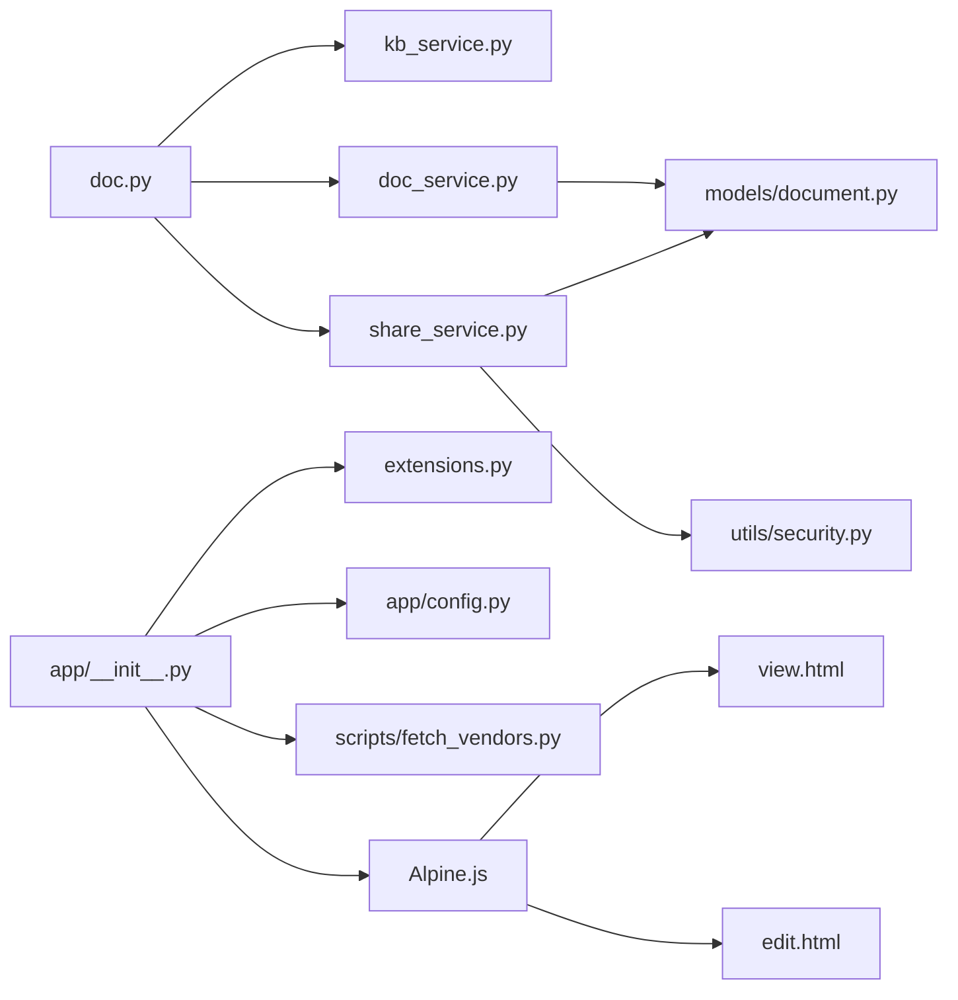

# 文档编辑问题

<cite>
**本文引用的文件**
- [README.md](file://README.md)
- [app/config.py](file://app/config.py)
- [app/__init__.py](file://app/__init__.py)
- [run.py](file://run.py)
- [wsgi.py](file://wsgi.py)
- [app/blueprints/doc.py](file://app/blueprints/doc.py)
- [app/models/document.py](file://app/models/document.py)
- [app/services/doc_service.py](file://app/services/doc_service.py)
- [app/services/kb_service.py](file://app/services/kb_service.py)
- [app/services/share_service.py](file://app/services/share_service.py)
- [app/utils/markdown.py](file://app/utils/markdown.py)
- [app/extensions.py](file://app/extensions.py)
- [app/templates/base.html](file://app/templates/base.html)
- [app/templates/doc/edit.html](file://app/templates/doc/edit.html)
- [app/templates/doc/view.html](file://app/templates/doc/view.html)
- [scripts/fetch_vendors.py](file://scripts/fetch_vendors.py)
- [app/static/js/app.js](file://app/static/js/app.js)
- [app/static/css/app.css](file://app/static/css/app.css)
- [app/templates/components/navbar.html](file://app/templates/components/navbar.html)
</cite>

## 更新摘要
**变更内容**
- 更新了文档查看界面UI优化部分，重点描述删除功能从直接按钮重构为下拉菜单选项
- 增强了编辑按钮的图标和样式改进说明
- 改进了用户界面的组织和可用性相关内容
- 更新了相关的故障排除指南以反映新的UI布局

## 目录
1. [简介](#简介)
2. [项目结构](#项目结构)
3. [核心组件](#核心组件)
4. [架构总览](#架构总览)
5. [详细组件分析](#详细组件分析)
6. [依赖分析](#依赖分析)
7. [性能考虑](#性能考虑)
8. [故障排除指南](#故障排除指南)
9. [结论](#结论)
10. [附录](#附录)

## 简介
本故障排除文档面向 My Wiki 文档编辑系统，聚焦于富文本编辑器异常、文档保存失败、文件上传问题、Markdown 渲染错误等常见编辑故障；同时覆盖版本冲突与并发编辑、文件格式不兼容、存储空间不足、数据库连接问题、浏览器兼容性、网络中断恢复、权限验证失败以及文档备份与恢复的最佳实践。文档基于实际源码进行分析，提供可操作的诊断步骤与修复建议。**新增** 图片上传功能和编辑器错误处理相关的故障排除指南，以及**更新** 文档查看界面UI优化相关的故障排除指导。

## 项目结构
My Wiki 采用 Flask 应用工厂模式，按蓝图划分功能模块（认证、用户、知识库、文档、分享、AI 等），数据持久化通过 SQLAlchemy + Alembic 迁移管理，静态资源与模板位于 app/templates 与 app/static 目录。开发与生产入口分别由 run.py 与 wsgi.py 提供。

**图表来源**
- [app/__init__.py:11-28](file://app/__init__.py#L11-L28)
- [app/config.py:80-83](file://app/config.py#L80-L83)
- [app/blueprints/doc.py:10](file://app/blueprints/doc.py#L10)
- [app/services/doc_service.py:1-81](file://app/services/doc_service.py#L1-L81)
- [app/services/kb_service.py:1-80](file://app/services/kb_service.py#L1-L80)
- [app/services/share_service.py:1-49](file://app/services/share_service.py#L1-L49)
- [app/models/document.py:1-98](file://app/models/document.py#L1-L98)
- [app/utils/markdown.py:1-87](file://app/utils/markdown.py#L1-L87)
- [app/utils/security.py:1-8](file://app/utils/security.py#L1-L8)
- [app/extensions.py:1-17](file://app/extensions.py#L1-L17)

**章节来源**
- [README.md:1-3](file://README.md#L1-L3)
- [app/__init__.py:11-28](file://app/__init__.py#L11-L28)
- [app/config.py:80-83](file://app/config.py#L80-L83)

## 核心组件
- 应用工厂与配置：负责实例目录初始化、扩展注册、蓝图注册、错误处理器与上下文注入，并根据环境变量选择配置类。
- 文档蓝图：提供新建、查看、编辑、保存、删除、分享等接口，校验知识库访问与编辑权限。
- 文档服务：封装文档树构建、创建、内容更新、软删除与后代收集。
- 知识库服务：封装访问、编辑、管理权限判定与成员管理。
- 分享服务：生成分享令牌、密码设置、有效期控制、撤销与计数。
- Markdown 工具：渲染 Markdown 并进行 HTML 白名单清理，支持维基链接替换。
- 安全与扩展：CSRF 保护、会话与登录管理、数据库与迁移。

**章节来源**
- [app/__init__.py:31-54](file://app/__init__.py#L31-L54)
- [app/blueprints/doc.py:20-100](file://app/blueprints/doc.py#L20-L100)
- [app/services/doc_service.py:11-62](file://app/services/doc_service.py#L11-L62)
- [app/services/kb_service.py:10-45](file://app/services/kb_service.py#L10-L45)
- [app/services/share_service.py:15-49](file://app/services/share_service.py#L15-L49)
- [app/utils/markdown.py:31-66](file://app/utils/markdown.py#L31-L66)
- [app/extensions.py:8-17](file://app/extensions.py#L8-L17)

## 架构总览
My Wiki 的编辑流程围绕"文档模型 + 服务层 + 蓝图接口 + 前端模板"展开。编辑器以 Editor.js JSON 形式提交内容，后端将其持久化到 documents 表的 content_json 字段，并同步生成 plain_text 用于搜索与 AI 处理。分享与权限控制贯穿知识库与文档层面。

**图表来源**
- [app/blueprints/doc.py:69-84](file://app/blueprints/doc.py#L69-L84)
- [app/services/doc_service.py:56-62](file://app/services/doc_service.py#L56-L62)
- [app/models/document.py:20-53](file://app/models/document.py#L20-L53)

## 详细组件分析

### 组件一：文档保存流程与并发控制
- 关键路径
  - 路由：文档保存接口接收 JSON 负载，调用服务层更新内容与标题。
  - 服务层：写入 content_json 与 plain_text，并提交事务。
  - 模型层：字段定义与默认值确保一致性。
- 并发与一致性
  - 当前实现未显式使用乐观锁或版本号字段，存在并发覆盖风险。建议在模型中引入版本号并在保存时校验版本。
  - 事务提交在服务层完成，若需跨表一致性可进一步封装为原子操作。

**图表来源**
- [app/blueprints/doc.py:69-84](file://app/blueprints/doc.py#L69-L84)
- [app/services/doc_service.py:56-62](file://app/services/doc_service.py#L56-L62)

**章节来源**
- [app/blueprints/doc.py:69-84](file://app/blueprints/doc.py#L69-L84)
- [app/services/doc_service.py:56-62](file://app/services/doc_service.py#L56-L62)
- [app/models/document.py:20-53](file://app/models/document.py#L20-L53)

### 组件二：Markdown 渲染与维基链接
- 关键路径
  - 渲染函数：使用 Markdown 扩展与 Bleach 白名单清理，输出安全 HTML。
  - 维基链接替换：将 [[目标|显示]] 替换为内部锚点占位符，再由路由层重写为真实 URL。
- 常见问题
  - 链接无法解析：检查目标标题是否存在于知识库，或 resolver 是否正确返回 slug。
  - 标签/属性被过滤：确认白名单允许所需标签与属性。

**图表来源**
- [app/utils/markdown.py:42-66](file://app/utils/markdown.py#L42-L66)

**章节来源**
- [app/utils/markdown.py:31-66](file://app/utils/markdown.py#L31-L66)

### 组件三：文档分享与权限
- 关键路径
  - 创建分享：校验隐私级别，生成唯一 token，可选密码与过期时间。
  - 访问校验：仅有效且未撤销的分享可访问，支持密码校验。
- 常见问题
  - 私密文档不可分享：需先修改为常规隐私。
  - 密码错误：确认分享口令与哈希匹配。

**图表来源**
- [app/blueprints/doc.py:103-124](file://app/blueprints/doc.py#L103-L124)
- [app/services/share_service.py:15-49](file://app/services/share_service.py#L15-L49)
- [app/models/document.py:48-50](file://app/models/document.py#L48-L50)

**章节来源**
- [app/blueprints/doc.py:103-124](file://app/blueprints/doc.py#L103-L124)
- [app/services/share_service.py:15-49](file://app/services/share_service.py#L15-L49)
- [app/models/document.py:48-50](file://app/models/document.py#L48-L50)

### 组件四：知识库权限与可见性
- 关键路径
  - 访问判定：公共知识库直接放行；成员可见需登录且为成员；所有者与超级管理员直通。
  - 编辑判定：仅拥有者或具有编辑角色成员可编辑。
- 常见问题
  - 无权限访问：检查用户登录状态、成员身份与角色。
  - 知识库归档：归档状态一律拒绝访问。

**章节来源**
- [app/services/kb_service.py:10-45](file://app/services/kb_service.py#L10-L45)

### 组件五：图片上传功能与富文本编辑器

**更新** 新增图片上传功能，支持富文本编辑器中的图片拖拽、粘贴和上传

- 关键路径
  - 图片上传接口：接收富文本编辑器的图片数据，验证格式并保存到指定目录。
  - 图片服务：提供上传后的图片访问接口，支持安全的文件名验证。
  - 富文本编辑器钩子：集成 addImageBlobHook 钩子，实现图片自动上传。
- 常见问题
  - 图片上传失败：检查上传目录权限、文件格式限制、网络连接。
  - 图片无法显示：确认图片URL生成正确，静态文件服务配置正常。
  - 编辑器图片功能异常：验证富文本引擎加载、钩子函数配置。

**图表来源**
- [app/blueprints/doc.py:28-44](file://app/blueprints/doc.py#L28-L44)
- [app/templates/doc/edit.html:129-146](file://app/templates/doc/edit.html#L129-L146)

**章节来源**
- [app/blueprints/doc.py:25-54](file://app/blueprints/doc.py#L25-L54)
- [app/templates/doc/edit.html:129-146](file://app/templates/doc/edit.html#L129-L146)

### 组件六：Excel/Spreadsheet 编辑器集成
- 关键路径
  - 类型判定：通过文档类型判断是否为表格类型，动态加载相应编辑器。
  - 资源加载：表格类型加载 x-data-spreadsheet CSS 和 JavaScript 文件。
  - 初始化逻辑：表格编辑器初始化时设置视图尺寸、行列配置、事件监听。
- 常见问题
  - x-data-spreadsheet 未加载：检查 vendor/js/xspreadsheet.js 是否正确加载。
  - 编辑器初始化失败：检查容器元素是否存在，配置参数是否正确。
  - 数据加载异常：检查 content_json 格式是否符合 x-data-spreadsheet 要求。

**图表来源**
- [app/templates/doc/edit.html:78-106](file://app/templates/doc/edit.html#L78-L106)
- [app/templates/doc/view.html:101-118](file://app/templates/doc/view.html#L101-L118)

**章节来源**
- [app/templates/doc/edit.html:3-167](file://app/templates/doc/edit.html#L3-L167)
- [app/templates/doc/view.html:80-131](file://app/templates/doc/view.html#L80-L131)
- [app/models/document.py:10-12](file://app/models/document.py#L10-L12)

### 组件七：文档查看界面UI优化与删除功能重构

**更新** 重点描述文档查看界面的UI优化，包括删除功能从直接按钮重构为下拉菜单选项，编辑按钮的图标和样式改进

- 关键路径
  - 删除功能重构：原直接的删除按钮改为下拉菜单选项，集成在"更多操作"菜单中。
  - 编辑按钮优化：增强编辑按钮的图标和样式，使用SVG图标和改进的圆角设计。
  - UI组织改进：优化操作按钮的布局和视觉层次，提升用户界面的可用性。
- 常见问题
  - 删除按钮不可见：检查下拉菜单是否正确加载和显示。
  - 编辑按钮样式异常：确认SVG图标是否正确渲染，CSS样式是否生效。
  - 菜单交互问题：验证Alpine.js数据绑定和事件处理是否正常。

**图表来源**
- [app/templates/doc/view.html:147-224](file://app/templates/doc/view.html#L147-L224)

**章节来源**
- [app/templates/doc/view.html:147-224](file://app/templates/doc/view.html#L147-L224)

## 依赖分析
- 组件耦合
  - 文档蓝图依赖知识库服务与文档服务；文档服务依赖模型与工具；分享服务依赖安全工具与模型。
- 外部依赖
  - 数据库连接池参数、上传目录与大小限制、AI 与 RAG 配置均来自配置模块。
  - **新增** 富文本编辑器第三方库（toastui-editor）、表格编辑器第三方库（x-data-spreadsheet）通过 scripts/fetch_vendors.py 管理。
  - **更新** UI优化依赖 Alpine.js 的 x-data 绑定和 x-show 显示控制。
- 潜在循环依赖
  - 蓝图与服务之间为单向依赖，未发现循环导入迹象。

**图表来源**
- [app/blueprints/doc.py:1-10](file://app/blueprints/doc.py#L1-L10)
- [app/services/doc_service.py:1-8](file://app/services/doc_service.py#L1-L8)
- [app/services/kb_service.py:1-8](file://app/services/kb_service.py#L1-L8)
- [app/services/share_service.py:1-8](file://app/services/share_service.py#L1-L8)
- [app/models/document.py:1-8](file://app/models/document.py#L1-L8)
- [app/utils/security.py:1-8](file://app/utils/security.py#L1-L8)
- [app/__init__.py:39-44](file://app/__init__.py#L39-L44)
- [app/config.py:15-54](file://app/config.py#L15-L54)
- [scripts/fetch_vendors.py:61-70](file://scripts/fetch_vendors.py#L61-L70)

**章节来源**
- [app/__init__.py:39-44](file://app/__init__.py#L39-L44)
- [app/config.py:15-54](file://app/config.py#L15-L54)
- [scripts/fetch_vendors.py:61-70](file://scripts/fetch_vendors.py#L61-L70)

## 性能考虑
- 数据库连接池
  - 预取与回收策略有助于降低连接失效带来的抖动，建议结合监控指标评估 pool_recycle 与 pool_pre_ping 的效果。
- 内容存储
  - content_json 使用 MySQL LONGTEXT，适合大文档；但需关注索引与查询性能，必要时拆分或缓存常用片段。
- Markdown 渲染
  - 渲染与清理过程为 CPU 密集，建议对热点内容做缓存或增量渲染。
- **新增** 图片上传性能优化
  - 图片上传采用异步处理，避免阻塞编辑器交互。
  - 支持图片格式验证，减少无效上传。
  - 图片缓存策略，避免重复上传相同图片。
- **新增** Excel/Spreadsheet 性能优化
  - 大表格数据分页加载，避免一次性渲染过多单元格。
  - 合理设置行列数量限制，防止内存溢出。
  - 使用增量更新减少不必要的重新计算。
- **更新** UI优化性能考虑
  - Alpine.js 的 x-data 和 x-show 优化了条件渲染性能。
  - SVG 图标相比字体图标具有更好的渲染性能。
  - 下拉菜单的懒加载减少了初始页面渲染负担。

## 故障排除指南

### 一、富文本编辑器异常
- 症状
  - 编辑器无法加载、保存按钮无效、粘贴内容丢失、图片上传失败。
- 诊断步骤
  - 检查模板是否正确引入 CSRF 令牌与脚本资源。
  - 确认保存接口返回的 JSON 结构与前端预期一致。
  - 查看浏览器开发者工具 Network 面板，定位 403/404/500 错误。
  - **新增** 检查富文本引擎加载状态和 addImageBlobHook 配置。
- 解决方案
  - 确保 base.html 中包含 CSRF 元标记与必要的 JS/CSS。
  - 在保存接口处增加更明确的错误提示与日志记录。
  - 若编辑器依赖特定扩展，确认其版本与 CDN 可达性。
  - **新增** 检查富文本编辑器的图片上传钩子配置，确保 UPLOAD_IMAGE_URL 正确设置。

**章节来源**
- [app/templates/base.html:6-13](file://app/templates/base.html#L6-L13)
- [app/blueprints/doc.py:69-84](file://app/blueprints/doc.py#L69-L84)
- [app/templates/doc/edit.html:129-146](file://app/templates/doc/edit.html#L129-L146)

### 二、文档保存失败
- 症状
  - 保存后内容未更新、返回错误、页面无反馈。
- 诊断步骤
  - 检查权限校验是否通过（编辑权限）。
  - 确认 JSON 负载是否正确传递，content_json 是否为空。
  - 观察数据库事务是否提交成功。
- 解决方案
  - 在服务层捕获异常并返回统一错误信息。
  - 对 content_json 进行基本校验（如 JSON 合法性），避免空字符串导致的逻辑歧义。
  - 引入版本号字段与乐观锁，避免并发覆盖。

**章节来源**
- [app/blueprints/doc.py:76-84](file://app/blueprints/doc.py#L76-L84)
- [app/services/doc_service.py:56-62](file://app/services/doc_service.py#L56-L62)

### 三、文件上传问题
- 症状
  - 上传失败、文件过大、路径不存在、图片上传失败。
- 诊断步骤
  - 检查上传目录是否存在且具备写权限。
  - 确认 MAX_CONTENT_LENGTH 是否过小。
  - 查看 Flask/Werkzeug 的上传限制与服务器 Nginx/Apache 配置。
  - **新增** 检查图片上传接口的文件格式验证和保存路径。
- 解决方案
  - 在运行环境中设置 UPLOAD_DIR 与 MAX_CONTENT_LENGTH。
  - 生产环境建议将上传目录置于独立磁盘并监控容量。
  - 如需图片/附件上传，可在蓝图中新增专用路由并加入 MIME 校验。
  - **新增** 确保图片上传目录存在且具备写权限，检查图片格式白名单配置。

**章节来源**
- [app/config.py:33-35](file://app/config.py#L33-L35)
- [app/__init__.py:31-36](file://app/__init__.py#L31-L36)
- [app/blueprints/doc.py:28-44](file://app/blueprints/doc.py#L28-L44)

### 四、图片上传功能故障排除

**新增** 专门针对图片上传功能的故障排除指南

#### 4.1 图片上传失败
- 症状
  - 富文本编辑器中拖拽或粘贴图片后显示"图片上传失败"。
- 诊断步骤
  - 检查浏览器 Network 面板，确认 /upload-image 接口返回状态码。
  - 验证图片格式是否在允许列表中（png, jpg, jpeg, gif, webp, svg）。
  - 确认上传目录权限和磁盘空间充足。
  - 检查 CSRF 令牌是否正确传递。
- 解决方案
  - 确保上传目录存在且具备写权限。
  - 检查图片格式是否在 _ALLOWED_IMAGE_EXTS 列表中。
  - 验证 MAX_CONTENT_LENGTH 配置足够大。
  - 确认 CSRF 保护配置正确，AJAX 请求包含正确的 CSRF 令牌。

#### 4.2 图片无法显示
- 症状
  - 图片上传成功但编辑器中无法显示图片。
- 诊断步骤
  - 检查生成的图片 URL 是否可访问。
  - 验证 uploaded_image 路由是否正确返回图片文件。
  - 确认 secure_filename 是否正确处理文件名。
- 解决方案
  - 检查图片 URL 生成逻辑，确保 url_for 正确指向 uploaded_image 路由。
  - 验证文件名安全检查，确保特殊字符被正确过滤。
  - 确认静态文件服务配置，确保 images 目录可被访问。

#### 4.3 富文本编辑器图片功能异常
- 症状
  - addImageBlobHook 未触发、编辑器无图片上传功能。
- 诊断步骤
  - 检查富文本引擎是否正确加载。
  - 验证 addImageBlobHook 配置是否正确。
  - 确认 UPLOAD_IMAGE_URL 变量是否正确设置。
- 解决方案
  - 确保 toastui-editor 脚本正确加载。
  - 检查钩子函数的回调逻辑，确保正确处理上传结果。
  - 验证前端 JavaScript 中的 UPLOAD_IMAGE_URL 变量值。

**章节来源**
- [app/blueprints/doc.py:25-54](file://app/blueprints/doc.py#L25-L54)
- [app/templates/doc/edit.html:129-146](file://app/templates/doc/edit.html#L129-L146)

### 五、Markdown 渲染错误
- 症状
  - 标题/表格/代码块显示异常、维基链接未解析。
- 诊断步骤
  - 确认 Markdown 扩展启用列表与表格等特性。
  - 检查 Bleach 白名单是否包含所需标签与属性。
  - 验证维基链接格式与 resolver 返回值。
- 解决方案
  - 将渲染与清理过程封装为独立函数，便于单元测试与调试。
  - 对异常输入进行降级处理（保留原文或转义）。

**章节来源**
- [app/utils/markdown.py:31-66](file://app/utils/markdown.py#L31-L66)

### 六、Excel/Spreadsheet 编辑器问题

#### 6.1 x-data-spreadsheet 加载失败
- 症状
  - 表格编辑器显示"未加载"或空白，控制台出现 x_spreadsheet 未定义错误。
- 诊断步骤
  - 检查浏览器 Network 面板，确认 vendor/js/xspreadsheet.js 和 xspreadsheet-zh-cn.js 是否 200 OK。
  - 验证 CSS 文件 vendor/css/xspreadsheet.css 是否正确加载。
  - 确认静态资源路径配置正确，CDN 可达性良好。
- 解决方案
  - 检查 scripts/fetch_vendors.py 中的 CDN 地址是否可用。
  - 在本地环境中预下载第三方资源到 static/vendor 目录。
  - 确保 CSP 策略允许加载外部脚本资源。
  - 添加备用 CDN 或使用本地托管的资源文件。

#### 6.2 编辑器初始化错误
- 症状
  - 编辑器创建失败，出现"创建失败"错误提示。
- 诊断步骤
  - 检查 #sheet 容器元素是否存在且有正确的尺寸。
  - 确认视图配置参数（height、width）是否合理。
  - 验证行列配置（row.len、col.len）是否超出合理范围。
- 解决方案
  - 确保容器元素在 DOM 中正确渲染后再初始化编辑器。
  - 调整视图高度为固定像素值而非百分比。
  - 限制最大行列数，避免内存溢出。
  - 添加初始化超时处理和错误回退机制。

#### 6.3 数据加载异常
- 症状
  - 表格内容无法显示或显示乱码，loadData 抛出异常。
- 诊断步骤
  - 检查 content_json 格式是否符合 x-data-spreadsheet 要求。
  - 确认 JSON 数据结构完整性和数据类型正确性。
  - 验证初始数据的行列维度与配置一致。
- 解决方案
  - 在解析 JSON 时添加 try-catch 包装，失败时使用空数据。
  - 实现数据格式验证和转换逻辑。
  - 提供数据修复功能，自动修正不规范的数据格式。
  - 添加数据版本兼容性检查。

#### 6.4 保存和序列化问题
- 症状
  - 保存后数据丢失或格式错误，getPayload 返回空数据。
- 诊断步骤
  - 检查 getPayload 函数是否正确获取表格数据。
  - 确认 JSON 序列化过程是否正常。
  - 验证 content_json 字段是否正确更新。
- 解决方案
  - 确保 getPayload 正确绑定到表格实例的方法。
  - 添加数据完整性检查，避免保存空数据。
  - 实现数据压缩和优化，减少存储空间占用。
  - 提供数据备份和恢复功能。

#### 6.5 语言和本地化问题
- 症状
  - 编辑器界面显示英文而非中文。
- 诊断步骤
  - 检查 xspreadsheet-zh-cn.js 是否正确加载。
  - 确认 locale('zh-cn') 调用是否成功执行。
- 解决方案
  - 确保语言包脚本在主库之后加载。
  - 添加语言切换功能，支持多语言环境。
  - 提供语言包缺失时的降级处理。

**章节来源**
- [app/templates/doc/edit.html:78-106](file://app/templates/doc/edit.html#L78-L106)
- [app/templates/doc/view.html:101-118](file://app/templates/doc/view.html#L101-L118)
- [scripts/fetch_vendors.py:61-70](file://scripts/fetch_vendors.py#L61-L70)

### 七、文档查看界面UI优化问题

**更新** 专门针对文档查看界面UI优化相关的故障排除指南

#### 7.1 删除功能重构问题
- 症状
  - 删除按钮不可见或无法点击，"更多操作"菜单无法打开。
- 诊断步骤
  - 检查 Alpine.js 是否正确加载和初始化。
  - 确认 x-data="{ open: false }" 数据绑定是否正常。
  - 验证 x-show 和 @click.outside 事件处理是否生效。
  - 检查下拉菜单的 CSS 样式和 z-index 层级。
- 解决方案
  - 确保 Alpine.js 脚本正确加载，版本兼容性良好。
  - 检查 x-data 绑定的语法是否正确，数据初始化是否成功。
  - 验证 @click.outside 事件是否正确绑定到文档元素。
  - 确认下拉菜单的绝对定位和 z-index 设置正确。

#### 7.2 编辑按钮样式异常
- 症状
  - 编辑按钮图标显示异常，样式不生效，颜色不正确。
- 诊断步骤
  - 检查 SVG 图标的 HTML 结构是否正确。
  - 确认 CSS 类名是否正确应用（px-3 py-1.5、bg-indigo-600 等）。
  - 验证 Tailwind CSS 是否正确编译和加载。
  - 检查浏览器开发者工具中的样式覆盖情况。
- 解决方案
  - 确保 SVG 图标代码完整且语法正确。
  - 检查 CSS 类名拼写，确认没有样式冲突。
  - 验证 Tailwind 配置文件中是否包含必要的样式类。
  - 检查浏览器缓存，清除缓存后重新加载页面。

#### 7.3 下拉菜单交互问题
- 症状
  - 点击"更多操作"按钮无反应，菜单不显示或立即消失。
- 诊断步骤
  - 检查 @click="open = !open" 事件绑定是否正确。
  - 确认 x-show="open" 条件渲染是否正常工作。
  - 验证 @click.outside="open = false" 外部点击处理。
  - 检查 x-transition 动画效果是否正常。
- 解决方案
  - 确保 Alpine.js 的事件绑定语法正确。
  - 检查 x-show 和 x-cloak 的配合使用。
  - 验证 @click.outside 事件的冒泡和捕获机制。
  - 确认 x-transition 的动画 CSS 类是否正确。

#### 7.4 响应式布局问题
- 症状
  - 在不同屏幕尺寸下按钮布局错乱，菜单位置异常。
- 诊断步骤
  - 检查响应式 CSS 类（lg:、md:、sm: 前缀）是否正确应用。
  - 确认容器的 grid 布局和间距类是否合适。
  - 验证媒体查询断点是否符合预期。
  - 检查浏览器开发者工具中的断点调试。
- 解决方案
  - 确保 Tailwind 的响应式断点配置正确。
  - 检查容器的 max-width 和 padding 设置。
  - 验证不同屏幕尺寸下的布局适配。
  - 调整关键的响应式类名以改善布局。

**章节来源**
- [app/templates/doc/view.html:147-224](file://app/templates/doc/view.html#L147-L224)

### 八、版本冲突与并发编辑
- 症状
  - A 用户覆盖 B 用户的修改、保存后内容回退。
- 诊断步骤
  - 当前模型未内置版本号字段，无法自动检测冲突。
- 解决方案
  - 为文档模型添加 version 字段，在保存时校验版本并回退冲突。
  - 或采用"最后写入获胜"策略时，提供冲突提示与合并建议。

**章节来源**
- [app/models/document.py:20-53](file://app/models/document.py#L20-L53)

### 九、文件格式不兼容
- 症状
  - 上传非预期格式文件导致解析失败。
- 诊断步骤
  - 明确允许的文件类型与大小阈值。
- 解决方案
  - 在上传路由中增加 MIME 类型与扩展名校验。
  - 对未知格式进行拦截并提示。

**章节来源**
- [app/config.py:33-35](file://app/config.py#L33-L35)

### 十、存储空间不足
- 症状
  - 上传失败、数据库写入报错、日志提示磁盘空间不足。
- 诊断步骤
  - 检查 UPLOAD_DIR 与数据库数据目录的磁盘使用率。
- 解决方案
  - 清理历史附件与临时文件，扩容磁盘或迁移至更大存储。
  - 设置告警阈值并定期巡检。

**章节来源**
- [app/config.py:33-35](file://app/config.py#L33-L35)

### 十一、数据库连接问题
- 症状
  - 页面报 500，数据库连接超时或拒绝。
- 诊断步骤
  - 检查 DATABASE_URL 与数据库服务状态。
  - 观察 pool_recycle 与 pool_pre_ping 是否触发连接重建。
- 解决方案
  - 调整连接池参数，确保生产环境具备高可用数据库。
  - 增加连接失败重试与降级策略。

**章节来源**
- [app/config.py:18-26](file://app/config.py#L18-L26)

### 十二、浏览器兼容性问题
- 症状
  - 某些浏览器下编辑器或样式异常。
- 诊断步骤
  - 使用多浏览器测试，定位具体差异。
- 解决方案
  - 确保基础样式与脚本在各主流浏览器可用，必要时引入 polyfill。

**章节来源**
- [app/templates/base.html:12-13](file://app/templates/base.html#L12-L13)

### 十三、网络中断恢复
- 症状
  - 保存过程中断，页面无响应。
- 诊断步骤
  - 检查前端是否有自动重试与断点续传机制。
- 解决方案
  - 在前端实现保存前本地缓存、失败重试与进度提示。
  - 后端提供幂等保存接口（基于客户端序列号或去重键）。

**章节来源**
- [app/blueprints/doc.py:69-84](file://app/blueprints/doc.py#L69-L84)

### 十四、权限验证失败
- 症状
  - 登录后仍提示需要登录或无权访问。
- 诊断步骤
  - 检查会话 Cookie、CSRF 令牌与登录视图配置。
  - 确认知识库可见性与成员角色。
- 解决方案
  - 确保登录视图与消息类别正确，刷新页面后重试。
  - 调整知识库可见性或申请成员角色。

**章节来源**
- [app/extensions.py:14-16](file://app/extensions.py#L14-L16)
- [app/services/kb_service.py:10-45](file://app/services/kb_service.py#L10-L45)

### 十五、文档备份与恢复最佳实践
- 备份
  - 定期导出数据库（含 documents、document_shares 等表）。
  - 备份上传目录中的附件与 AI 生成内容。
- 恢复
  - 先恢复数据库，再恢复文件目录，最后重启服务。
  - 恢复后验证关键页面与分享链接可用性。
- 建议
  - 使用自动化脚本执行定时备份与校验。
  - 在测试环境先行验证恢复流程。

**章节来源**
- [app/config.py:33-42](file://app/config.py#L33-L42)

## 结论
My Wiki 的文档编辑系统以清晰的蓝图与服务分层实现了核心功能。针对编辑异常、保存失败、上传与渲染问题、并发与权限、数据库与存储、浏览器兼容与网络中断等常见问题，本文提供了可落地的诊断步骤与修复建议。**新增** 图片上传功能和富文本编辑器错误处理相关的故障排除指南，包括图片上传失败、编辑器初始化错误、图片显示异常等问题的全面排查方法。**更新** 文档查看界面UI优化相关的故障排除指南，涵盖了删除功能重构、编辑按钮样式改进、下拉菜单交互等UI相关问题的诊断与解决方法。建议在现有基础上补充版本号与乐观锁、完善上传校验与告警、增强前端重试与断点续传能力、加强表格编辑器的容错处理、完善图片上传功能的错误处理机制、建立完善的备份与演练流程，以及持续优化UI交互体验，以提升系统稳定性与用户体验。

## 附录

### A. 关键配置项速查
- 数据库连接与池化
  - DATABASE_URL：数据库连接串
  - SQLALCHEMY_ENGINE_OPTIONS：pool_pre_ping、pool_recycle
- 会话与安全
  - SECRET_KEY：签名密钥
  - CSRF 保护：CSRFProtect 已启用
- 上传与容量
  - UPLOAD_DIR：上传目录
  - MAX_CONTENT_LENGTH：最大请求体大小
  - **新增** 图片上传格式：支持 png, jpg, jpeg, gif, webp, svg
- AI 与 RAG
  - OPENAI_BASE_URL、OPENAI_API_KEY、CHAT_MODEL
  - ENABLE_RAG、EMBEDDING_MODEL、CHROMA_PATH
- 分页
  - DEFAULT_PAGE_SIZE
- **新增** 第三方库配置
  - x-data-spreadsheet 版本：1.1.9
  - CDN 地址：jsdelivr.net
  - **新增** 富文本编辑器：toastui-editor
  - **新增** Alpine.js：用于UI交互和条件渲染

**章节来源**
- [app/config.py:15-54](file://app/config.py#L15-L54)
- [scripts/fetch_vendors.py:61-70](file://scripts/fetch_vendors.py#L61-L70)
- [app/blueprints/doc.py:25](file://app/blueprints/doc.py#L25)

### B. 入口与部署
- 开发入口：run.py 加载 .env 并启动 Flask 应用。
- 生产入口：wsgi.py 通过 Gunicorn/uWSGI 部署。

**章节来源**
- [run.py:1-17](file://run.py#L1-L17)
- [wsgi.py:1-10](file://wsgi.py#L1-L10)

### C. Excel/Spreadsheet 编辑器配置参考
- 编辑器参数
  - mode: 'edit'（编辑模式）
  - showToolbar: true（显示工具栏）
  - showGrid: true（显示网格）
  - showContextmenu: true（显示右键菜单）
  - view.height: () => 600（视图高度）
  - view.width: () => holder.clientWidth（视图宽度）
  - row.len: 100（行数）
  - col.len: 26（列数）
  - col.width: 100（列宽）
  - col.indexWidth: 60（索引列宽）
  - col.minWidth: 60（最小列宽）

### D. 富文本编辑器配置参考

**新增** 富文本编辑器相关配置

- 编辑器参数
  - height: '600px'
  - initialEditType: 'wysiwyg'
  - previewStyle: 'vertical'
  - language: 'zh-CN'
  - usageStatistics: false
  - hideModeSwitch: false
  - placeholder: '在此开始书写… 上方工具栏可一键插入标题/列表/表格/代码块'
- **新增** 图片上传钩子配置
  - addImageBlobHook: 自动处理图片上传
  - UPLOAD_IMAGE_URL: 图片上传接口URL
  - 支持格式：png, jpg, jpeg, gif, webp, svg

### E. UI优化配置参考

**新增** 文档查看界面UI优化相关配置

- 编辑按钮样式
  - 类名：px-3 py-1.5 bg-indigo-600 text-white rounded-lg
  - SVG图标：编辑SVG矢量图标
  - 悬停效果：hover:bg-indigo-500
- 下拉菜单配置
  - Alpine.js：x-data="{ open: false }"
  - 显示控制：x-show="open" x-transition x-cloak
  - 外部点击：@click.outside="open = false"
  - 菜单项：分享、删除文档
- 响应式设计
  - 移动端：紧凑布局，简化操作
  - 桌面端：完整功能，丰富交互
  - 断点：lg:、md:、sm: 前缀的响应式类

**章节来源**
- [app/templates/doc/edit.html:118-146](file://app/templates/doc/edit.html#L118-L146)
- [app/blueprints/doc.py:25](file://app/blueprints/doc.py#L25)
- [app/templates/doc/view.html:147-224](file://app/templates/doc/view.html#L147-L224)