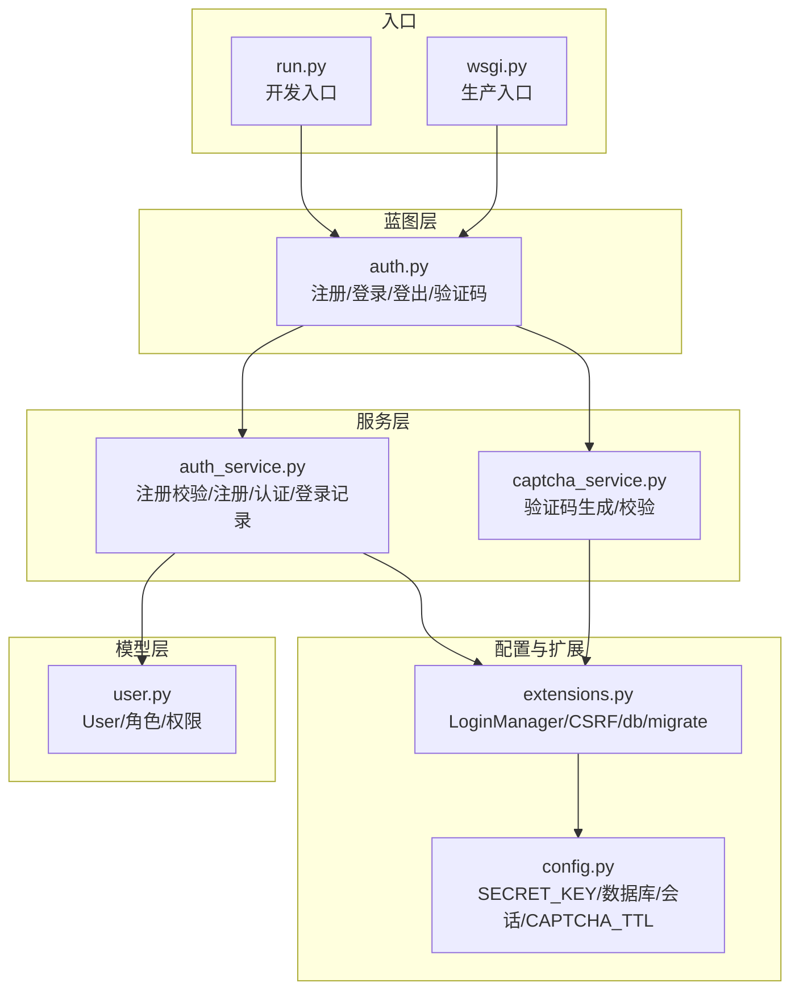
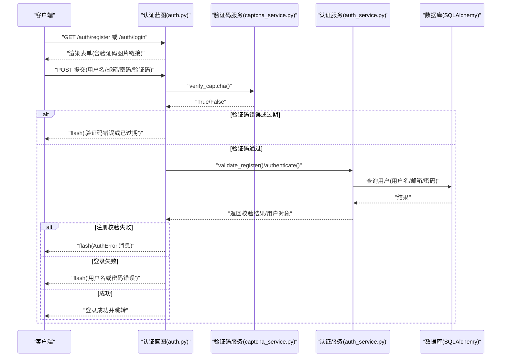
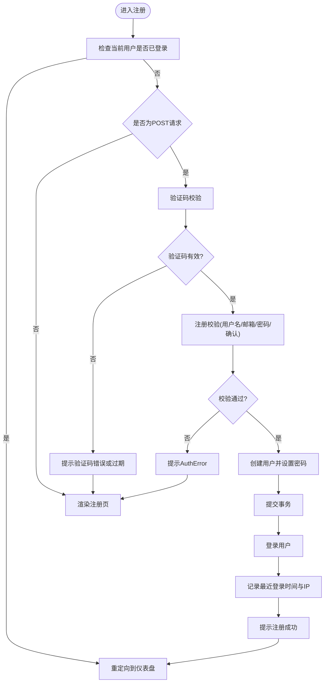
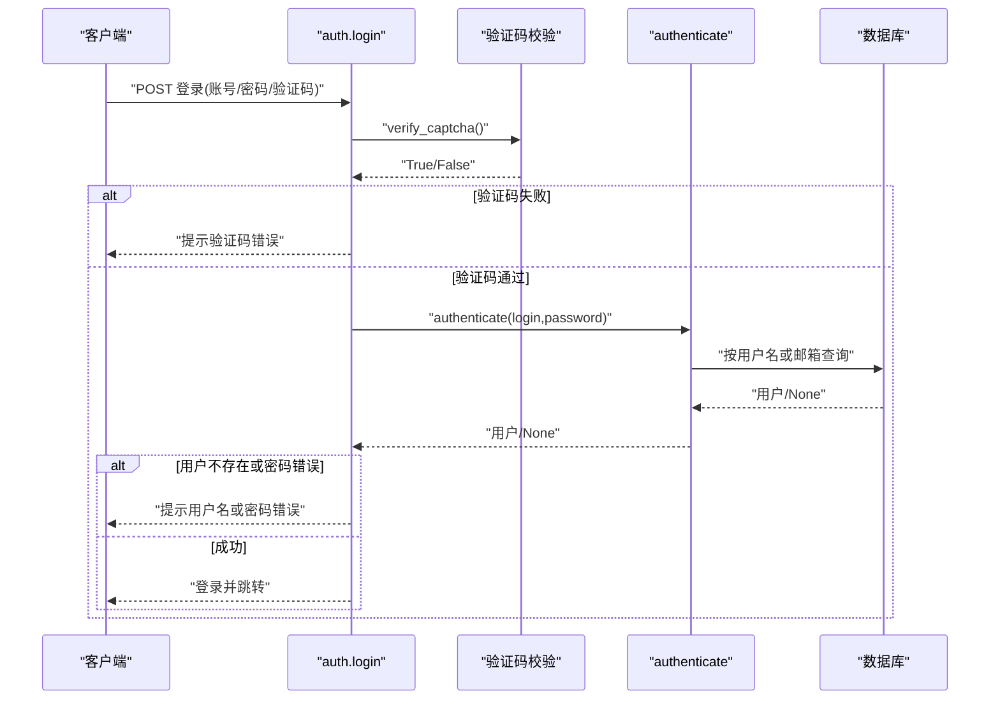
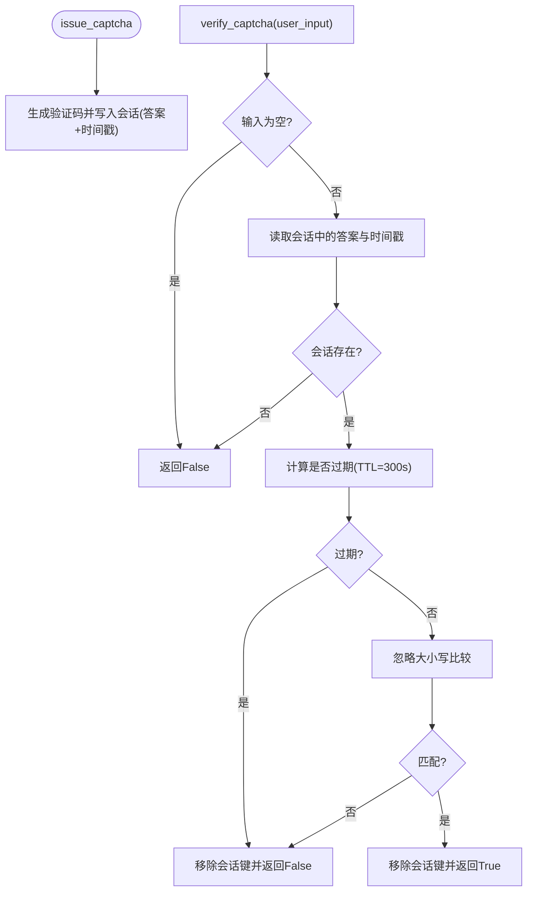
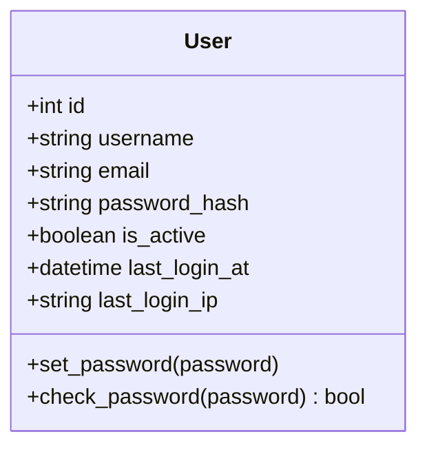
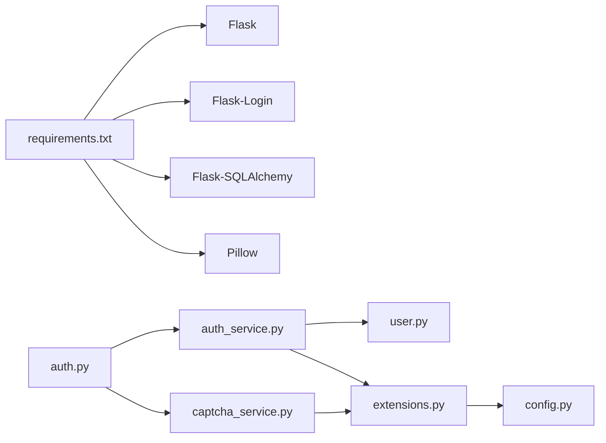

# 用户认证问题

<cite>
**本文引用的文件**
- [app/blueprints/auth.py](file://app/blueprints/auth.py)
- [app/services/auth_service.py](file://app/services/auth_service.py)
- [app/services/captcha_service.py](file://app/services/captcha_service.py)
- [app/models/user.py](file://app/models/user.py)
- [app/extensions.py](file://app/extensions.py)
- [app/config.py](file://app/config.py)
- [run.py](file://run.py)
- [wsgi.py](file://wsgi.py)
- [requirements.txt](file://requirements.txt)
</cite>

## 目录
1. [简介](#简介)
2. [项目结构](#项目结构)
3. [核心组件](#核心组件)
4. [架构总览](#架构总览)
5. [详细组件分析](#详细组件分析)
6. [依赖分析](#依赖分析)
7. [性能考虑](#性能考虑)
8. [故障排除指南](#故障排除指南)
9. [结论](#结论)
10. [附录](#附录)

## 简介
本文件面向 My Wiki 的用户认证系统，聚焦于登录失败、注册异常、验证码错误、密码重置问题等常见故障场景，提供从客户端到服务端的完整排查路径。内容覆盖：
- 认证流程关键节点：输入校验、验证码校验、数据库查询、会话建立、用户状态与权限检查
- 错误类型与错误消息：AuthError 异常、验证码过期/错误、用户名或密码错误、重复注册等
- 客户端与服务器端调试方法：浏览器控制台、网络面板、后端日志与配置
- 日志分析与根因定位：基于现有实现的关键字段（如登录 IP、时间戳）进行追踪

## 项目结构
认证相关模块主要分布在以下位置：
- 蓝图层：认证路由与视图逻辑（注册、登录、登出、验证码）
- 服务层：业务规则与数据访问（注册校验、登录认证、会话记录）
- 模型层：用户实体与密码哈希校验
- 工具层：验证码生成与校验、安全工具
- 配置与扩展：数据库、会话、登录管理器、验证码 TTL 等

图表来源
- [app/blueprints/auth.py:1-85](file://app/blueprints/auth.py#L1-L85)
- [app/services/auth_service.py:1-57](file://app/services/auth_service.py#L1-L57)
- [app/services/captcha_service.py:1-90](file://app/services/captcha_service.py#L1-L90)
- [app/models/user.py:1-104](file://app/models/user.py#L1-L104)
- [app/extensions.py:1-17](file://app/extensions.py#L1-L17)
- [app/config.py:1-83](file://app/config.py#L1-L83)
- [run.py:1-17](file://run.py#L1-L17)
- [wsgi.py:1-10](file://wsgi.py#L1-L10)

章节来源
- [app/blueprints/auth.py:1-85](file://app/blueprints/auth.py#L1-L85)
- [app/services/auth_service.py:1-57](file://app/services/auth_service.py#L1-L57)
- [app/services/captcha_service.py:1-90](file://app/services/captcha_service.py#L1-L90)
- [app/models/user.py:1-104](file://app/models/user.py#L1-L104)
- [app/extensions.py:1-17](file://app/extensions.py#L1-L17)
- [app/config.py:1-83](file://app/config.py#L1-L83)
- [run.py:1-17](file://run.py#L1-L17)
- [wsgi.py:1-10](file://wsgi.py#L1-L10)

## 核心组件
- 认证蓝图（auth.py）
  - 提供注册、登录、登出与验证码接口；对已登录用户进行重定向保护；在 POST 请求中执行验证码校验与业务校验。
- 认证服务（auth_service.py）
  - 注册校验：用户名/邮箱/密码/二次确认格式与唯一性校验；抛出 AuthError 异常。
  - 登录认证：按用户名或邮箱查找用户，检查是否激活且密码正确。
  - 登录记录：更新最近登录时间与 IP。
- 验证码服务（captcha_service.py）
  - 生成图片验证码并存入会话；校验用户输入，支持 TTL 过期与一次性使用。
- 用户模型（user.py）
  - 用户实体含密码哈希、激活状态、角色/权限关联；提供密码设置与校验方法。
- 扩展与配置（extensions.py、config.py）
  - 登录管理器与 CSRF 保护；数据库连接池参数；会话 Cookie 设置；验证码 TTL。

章节来源
- [app/blueprints/auth.py:10-85](file://app/blueprints/auth.py#L10-L85)
- [app/services/auth_service.py:17-57](file://app/services/auth_service.py#L17-L57)
- [app/services/captcha_service.py:65-90](file://app/services/captcha_service.py#L65-L90)
- [app/models/user.py:55-104](file://app/models/user.py#L55-L104)
- [app/extensions.py:8-17](file://app/extensions.py#L8-L17)
- [app/config.py:49-51](file://app/config.py#L49-L51)

## 架构总览
认证流程自上而下的交互如下：

图表来源
- [app/blueprints/auth.py:19-76](file://app/blueprints/auth.py#L19-L76)
- [app/services/captcha_service.py:75-90](file://app/services/captcha_service.py#L75-L90)
- [app/services/auth_service.py:21-50](file://app/services/auth_service.py#L21-L50)

## 详细组件分析

### 组件一：注册流程（register）
- 关键节点
  - 验证码校验：调用验证码服务校验用户输入，失败则提示“验证码错误或已过期，请重试”。
  - 注册校验：调用认证服务的注册校验函数，捕获 AuthError 并回显错误信息。
  - 数据持久化：创建用户实例、设置密码哈希、提交事务。
  - 登录与记录：登录用户并记录最近登录时间与 IP。
- 常见问题
  - 验证码过期：TTL 默认 300 秒，超时即失效。
  - 输入不合法：用户名/邮箱/密码长度/一致性校验失败。
  - 重复注册：用户名或邮箱已存在。
- 故障定位要点
  - 检查验证码会话键是否存在与是否过期。
  - 检查数据库中用户名/邮箱唯一约束是否被触发。
  - 检查密码哈希设置与提交事务是否成功。

图表来源
- [app/blueprints/auth.py:19-48](file://app/blueprints/auth.py#L19-L48)
- [app/services/auth_service.py:21-41](file://app/services/auth_service.py#L21-L41)
- [app/services/captcha_service.py:75-90](file://app/services/captcha_service.py#L75-L90)

章节来源
- [app/blueprints/auth.py:19-48](file://app/blueprints/auth.py#L19-L48)
- [app/services/auth_service.py:21-41](file://app/services/auth_service.py#L21-L41)
- [app/services/captcha_service.py:65-90](file://app/services/captcha_service.py#L65-L90)

### 组件二：登录流程（login）
- 关键节点
  - 验证码校验：同注册流程。
  - 用户认证：根据用户名或邮箱查询用户，检查激活状态与密码。
  - 登录与跳转：登录成功后记录最近登录信息，并根据 next 参数或默认跳转。
- 常见问题
  - 用户名或密码错误：认证返回空导致提示错误。
  - 账户未激活：认证过程中会检查激活状态。
  - 验证码过期或为空：提示验证码错误。
- 故障定位要点
  - 核对用户名/邮箱是否正确，确认用户存在且激活。
  - 核对密码哈希是否匹配。
  - 检查会话中验证码是否过期或被一次性消耗。

图表来源
- [app/blueprints/auth.py:51-76](file://app/blueprints/auth.py#L51-L76)
- [app/services/auth_service.py:44-50](file://app/services/auth_service.py#L44-L50)
- [app/services/captcha_service.py:75-90](file://app/services/captcha_service.py#L75-L90)

章节来源
- [app/blueprints/auth.py:51-76](file://app/blueprints/auth.py#L51-L76)
- [app/services/auth_service.py:44-50](file://app/services/auth_service.py#L44-L50)
- [app/services/captcha_service.py:75-90](file://app/services/captcha_service.py#L75-L90)

### 组件三：验证码服务（captcha_service）
- 功能要点
  - 生成图片验证码并写入会话，包含答案与时间戳。
  - 校验时比较用户输入与会话中的答案，支持 TTL 过期判断与一次性使用（校验后移除会话键）。
- 常见问题
  - 会话未设置：用户未先请求验证码图片即提交表单。
  - 输入大小写不敏感：校验前统一转小写。
  - 过期：默认 300 秒，超出即视为无效。
- 故障定位要点
  - 检查会话键是否存在与时间戳是否过期。
  - 检查验证码图片是否正常生成与缓存头设置。

图表来源
- [app/services/captcha_service.py:65-90](file://app/services/captcha_service.py#L65-L90)
- [app/config.py:49-51](file://app/config.py#L49-L51)

章节来源
- [app/services/captcha_service.py:65-90](file://app/services/captcha_service.py#L65-L90)
- [app/config.py:49-51](file://app/config.py#L49-L51)

### 组件四：用户模型与密码校验（user.py）
- 关键点
  - 密码设置：使用安全哈希算法生成哈希值。
  - 密码校验：使用哈希算法验证输入密码。
  - 激活状态：认证时会检查 is_active 字段。
- 常见问题
  - 密码哈希不匹配：新旧版本哈希策略差异或存储损坏。
  - 账户未激活：is_active 为 False 导致无法登录。
- 故障定位要点
  - 核对用户是否存在且 is_active 为真。
  - 核对密码哈希是否正确生成与保存。

图表来源
- [app/models/user.py:55-85](file://app/models/user.py#L55-L85)

章节来源
- [app/models/user.py:55-85](file://app/models/user.py#L55-L85)

### 组件五：会话与登录管理（extensions.py、auth.py）
- 关键点
  - LoginManager：未登录访问受保护资源时重定向至登录页，并设置提示信息。
  - 会话 Cookie：HttpOnly、SameSite=Lax；记住我 Cookie 时长可配置。
  - 登录成功后记录最近登录时间与 IP。
- 常见问题
  - 会话丢失：Cookie 配置不当或跨域场景导致。
  - 登录后仍被重定向：可能由于会话未正确建立或登录视图配置问题。
- 故障定位要点
  - 检查会话 Cookie 属性与 SameSite 设置。
  - 检查 LoginManager 的登录视图配置。

章节来源
- [app/extensions.py:8-17](file://app/extensions.py#L8-L17)
- [app/blueprints/auth.py:71-74](file://app/blueprints/auth.py#L71-L74)

## 依赖分析
- 外部依赖
  - Flask、Flask-Login、Flask-SQLAlchemy、Pillow 等用于 Web 框架、登录、数据库与验证码图像生成。
- 内部耦合
  - 蓝图依赖服务层；服务层依赖模型层与扩展；验证码服务依赖会话与配置。
- 风险点
  - 验证码 TTL 与会话生命周期耦合，需确保会话后端一致。
  - 登录记录依赖请求头中的 IP，代理场景下需确保 X-Forwarded-For 正确透传。

图表来源
- [requirements.txt:1-22](file://requirements.txt#L1-L22)
- [app/blueprints/auth.py:1-85](file://app/blueprints/auth.py#L1-L85)
- [app/services/auth_service.py:1-57](file://app/services/auth_service.py#L1-L57)
- [app/services/captcha_service.py:1-90](file://app/services/captcha_service.py#L1-L90)
- [app/models/user.py:1-104](file://app/models/user.py#L1-L104)
- [app/extensions.py:1-17](file://app/extensions.py#L1-L17)
- [app/config.py:1-83](file://app/config.py#L1-L83)

章节来源
- [requirements.txt:1-22](file://requirements.txt#L1-L22)
- [app/blueprints/auth.py:1-85](file://app/blueprints/auth.py#L1-L85)
- [app/services/auth_service.py:1-57](file://app/services/auth_service.py#L1-L57)
- [app/services/captcha_service.py:1-90](file://app/services/captcha_service.py#L1-L90)
- [app/models/user.py:1-104](file://app/models/user.py#L1-L104)
- [app/extensions.py:1-17](file://app/extensions.py#L1-L17)
- [app/config.py:1-83](file://app/config.py#L1-L83)

## 性能考虑
- 验证码生成与会话
  - 图像生成与会话写入为轻量操作，但需避免频繁刷新导致会话抖动。
- 数据库查询
  - 用户查询使用用户名或邮箱的索引列，建议保持索引健康与查询计划稳定。
- 会话与 Cookie
  - HttpOnly 与 SameSite 设置有助于安全与兼容性；代理场景需确保 IP 头正确透传以保证登录记录准确性。

## 故障排除指南

### 一、登录失败
- 现象
  - 页面提示“用户名或密码错误”。
- 可能原因
  - 用户名/邮箱不存在或拼写错误。
  - 密码不正确或哈希不匹配。
  - 账户未激活（is_active=False）。
  - 验证码错误或过期。
- 排查步骤
  - 在数据库中确认用户是否存在且 is_active 为真。
  - 使用相同凭据尝试登录，确认密码哈希是否正确。
  - 检查验证码是否过期或为空。
  - 查看后端日志中是否记录了最近登录时间与 IP，确认登录流程是否执行。
- 相关实现参考
  - [认证服务：authenticate:44-50](file://app/services/auth_service.py#L44-L50)
  - [蓝图：登录视图:51-76](file://app/blueprints/auth.py#L51-L76)
  - [验证码：verify_captcha:75-90](file://app/services/captcha_service.py#L75-L90)

章节来源
- [app/services/auth_service.py:44-50](file://app/services/auth_service.py#L44-L50)
- [app/blueprints/auth.py:51-76](file://app/blueprints/auth.py#L51-L76)
- [app/services/captcha_service.py:75-90](file://app/services/captcha_service.py#L75-L90)

### 二、注册异常
- 现象
  - 页面提示 AuthError 具体原因（如用户名/邮箱格式不正确、密码长度不足、两次密码不一致、用户名或邮箱已被占用）。
- 可能原因
  - 输入不符合正则或长度要求。
  - 两次密码输入不一致。
  - 用户名或邮箱在数据库中已存在。
  - 验证码错误或过期。
- 排查步骤
  - 检查用户名/邮箱/密码是否满足正则与长度限制。
  - 确认两次密码一致。
  - 在数据库中确认用户名与邮箱唯一性。
  - 检查验证码是否过期或为空。
- 相关实现参考
  - [注册校验：validate_register:21-34](file://app/services/auth_service.py#L21-L34)
  - [注册视图：注册流程:19-48](file://app/blueprints/auth.py#L19-L48)
  - [验证码：verify_captcha:75-90](file://app/services/captcha_service.py#L75-L90)

章节来源
- [app/services/auth_service.py:21-34](file://app/services/auth_service.py#L21-L34)
- [app/blueprints/auth.py:19-48](file://app/blueprints/auth.py#L19-L48)
- [app/services/captcha_service.py:75-90](file://app/services/captcha_service.py#L75-L90)

### 三、验证码错误或过期
- 现象
  - 页面提示“验证码错误或已过期，请重试”。
- 可能原因
  - 用户未先请求验证码图片即提交表单。
  - 输入为空或与会话中的答案不一致。
  - 会话过期（默认 300 秒）。
  - 会话后端不一致导致读取不到会话。
- 排查步骤
  - 确认先加载验证码图片再提交表单。
  - 检查会话中是否存在验证码键及时间戳。
  - 检查验证码 TTL 配置与当前时间差。
  - 在多进程或多实例部署时，确保会话后端一致（如 Redis）。
- 相关实现参考
  - [验证码：issue_captcha/verify_captcha:65-90](file://app/services/captcha_service.py#L65-L90)
  - [配置：CAPTCHA_TTL_SECONDS:49-51](file://app/config.py#L49-L51)

章节来源
- [app/services/captcha_service.py:65-90](file://app/services/captcha_service.py#L65-L90)
- [app/config.py:49-51](file://app/config.py#L49-L51)

### 四、密码重置问题
- 现象
  - 当前代码未提供密码重置接口，若用户反馈无法重置密码，应引导其联系管理员或等待后续功能上线。
- 排查步骤
  - 确认当前版本未包含密码重置逻辑。
  - 若有自定义扩展，请检查扩展是否正确集成并记录日志。

章节来源
- [app/blueprints/auth.py:1-85](file://app/blueprints/auth.py#L1-L85)

### 五、会话管理问题
- 现象
  - 登录后仍被重定向到登录页；记住我功能不生效；跨域场景下会话丢失。
- 可能原因
  - 会话 Cookie 配置不当（HttpOnly/SameSite）。
  - 未正确初始化 LoginManager 或登录视图配置错误。
  - 代理场景未正确透传 X-Forwarded-For 导致登录 IP 记录异常。
- 排查步骤
  - 检查 LoginManager 的登录视图配置与提示信息。
  - 检查会话 Cookie 的 HttpOnly 与 SameSite 设置。
  - 在代理场景下确认 X-Forwarded-For 是否正确传递。
- 相关实现参考
  - [LoginManager 配置:14-16](file://app/extensions.py#L14-L16)
  - [登录记录：mark_login:53-57](file://app/services/auth_service.py#L53-L57)

章节来源
- [app/extensions.py:14-16](file://app/extensions.py#L14-L16)
- [app/services/auth_service.py:53-57](file://app/services/auth_service.py#L53-L57)

### 六、客户端调试方法
- 浏览器开发者工具
  - Network 面板：观察注册/登录请求与响应，确认验证码图片加载与提交参数。
  - Application/Storage：查看 Cookie 与 Session Storage，确认会话键是否存在。
- 控制台：观察前端提示信息与页面跳转行为。
- 建议
  - 清理浏览器缓存与会话后重试，排除本地缓存干扰。

### 七、服务器端调试方法
- 启动方式
  - 开发环境：通过运行脚本启动，便于开启调试模式。
  - 生产环境：通过 WSGI 启动，注意日志级别与错误页面。
- 日志分析
  - 关注登录记录字段：最近登录时间与 IP，确认是否成功写入。
  - 关注验证码会话键：是否存在、是否过期。
  - 关注数据库事务：注册流程是否成功提交。
- 相关实现参考
  - [开发入口:1-17](file://run.py#L1-L17)
  - [WSGI 入口:1-10](file://wsgi.py#L1-L10)
  - [登录记录：mark_login:53-57](file://app/services/auth_service.py#L53-L57)

章节来源
- [run.py:1-17](file://run.py#L1-L17)
- [wsgi.py:1-10](file://wsgi.py#L1-L10)
- [app/services/auth_service.py:53-57](file://app/services/auth_service.py#L53-L57)

## 结论
本故障排除指南围绕注册、登录、验证码与会话管理四个核心环节，结合代码实现与配置参数，提供了可操作的诊断步骤与定位方法。建议在多实例部署时统一会话后端，在代理场景下确保 IP 头正确透传，并通过日志与会话键追踪验证码与登录记录，以快速定位问题根因。

## 附录
- 常见错误消息与对应场景
  - “验证码错误或已过期，请重试”：验证码为空、不匹配或过期。
  - “用户名或密码错误”：用户不存在、密码不正确或账户未激活。
  - AuthError 类错误：注册校验失败（用户名/邮箱/密码/确认密码/唯一性）。
- 相关配置项
  - 验证码 TTL：默认 300 秒。
  - 会话 Cookie：HttpOnly、SameSite=Lax。
  - 记住我 Cookie 时长：可配置。