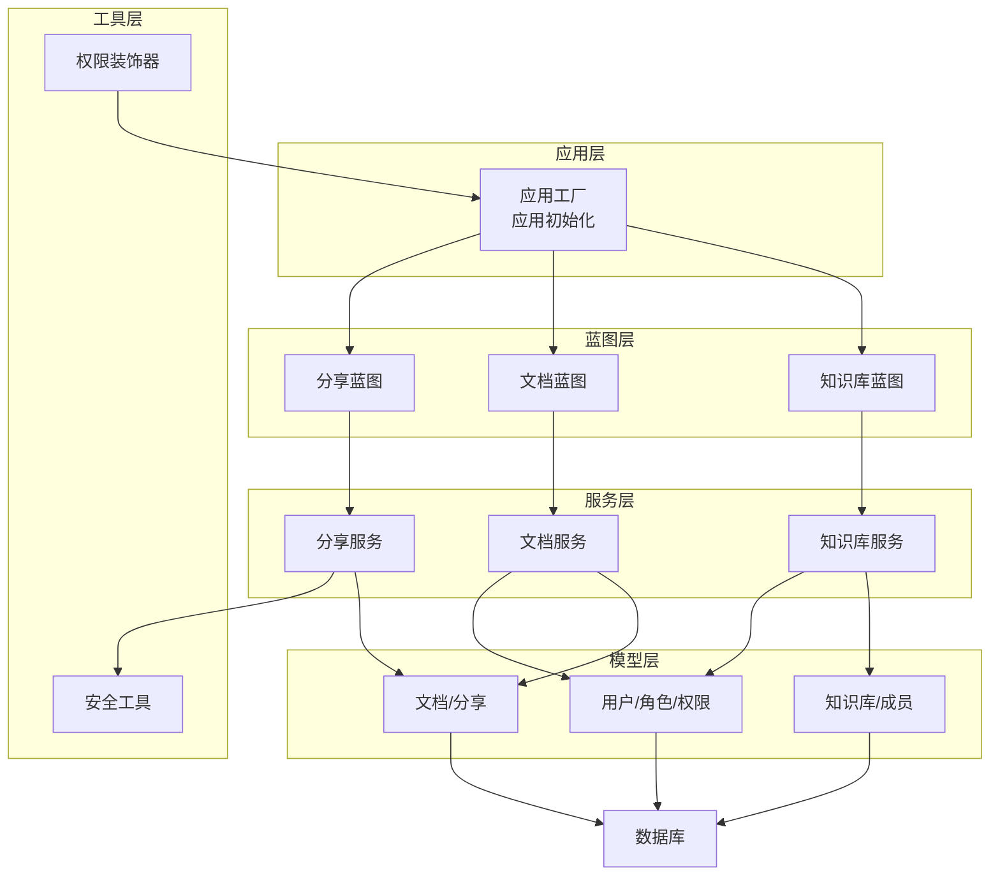
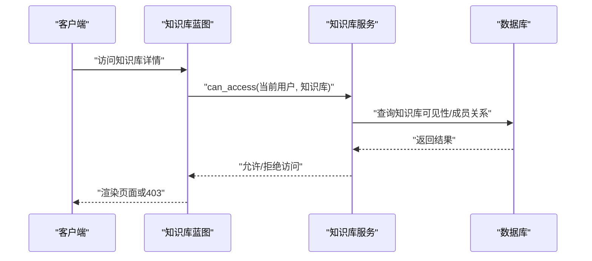
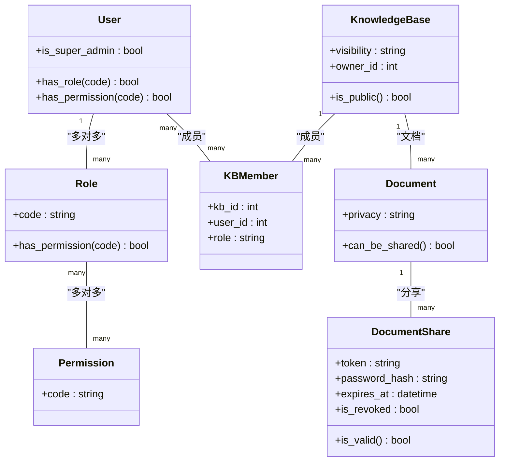
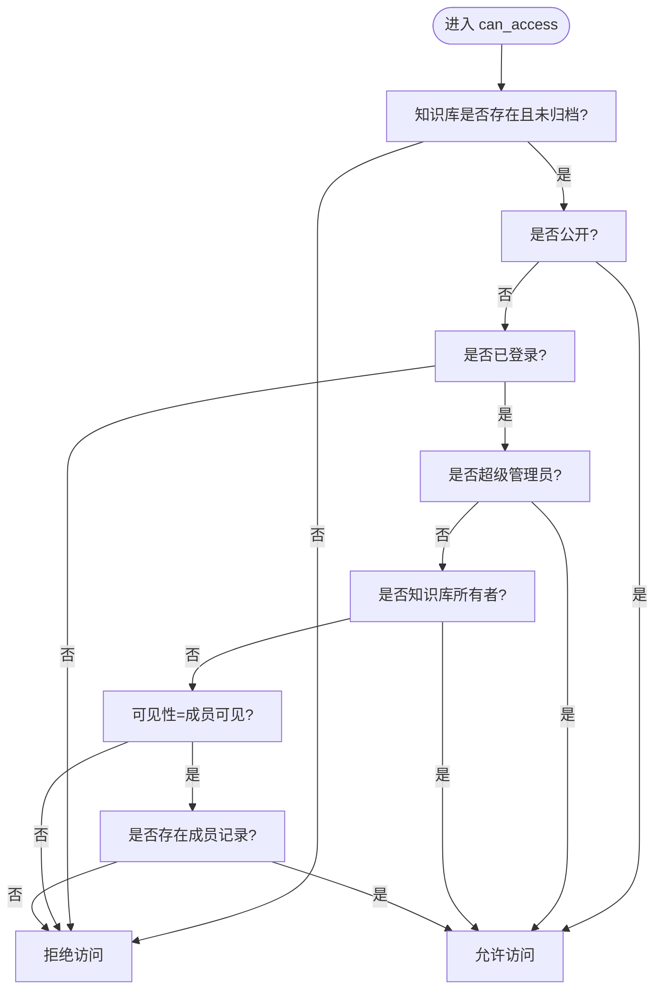
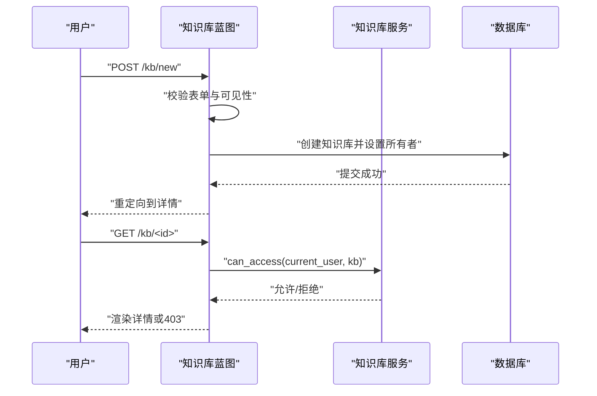
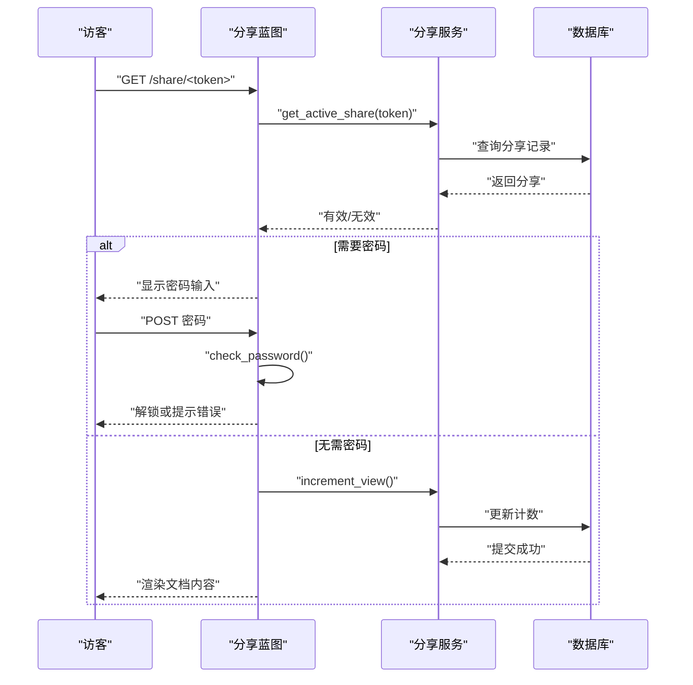
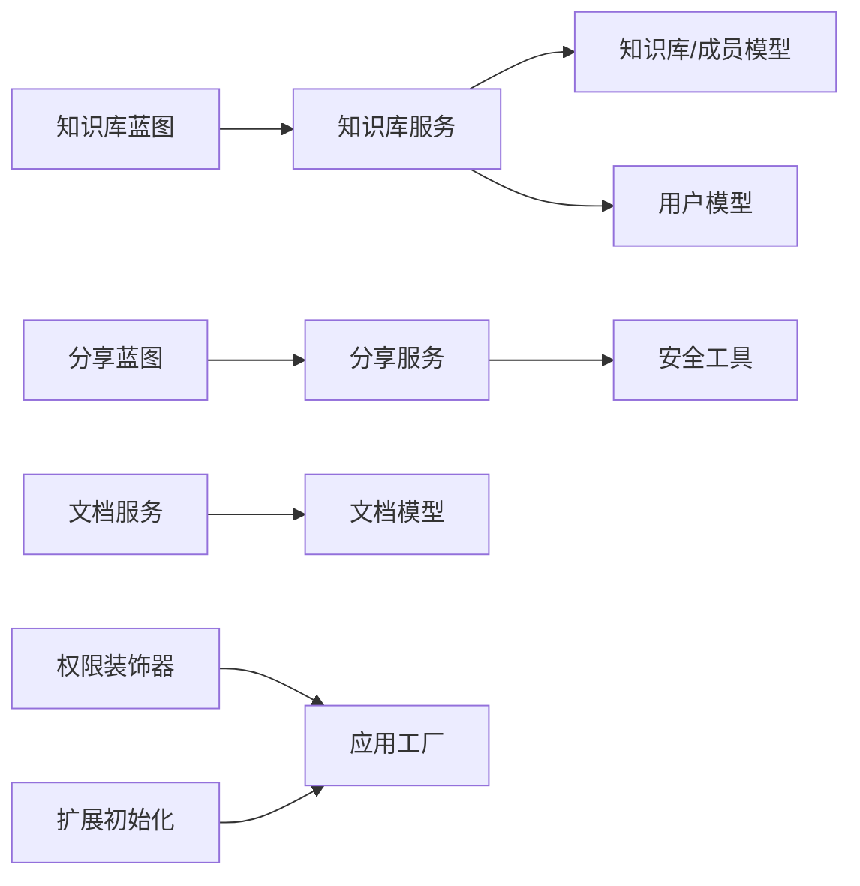

# 知识库访问问题

<cite>
**本文引用的文件**
- [app/models/knowledge_base.py](file://app/models/knowledge_base.py)
- [app/models/user.py](file://app/models/user.py)
- [app/services/kb_service.py](file://app/services/kb_service.py)
- [app/blueprints/kb.py](file://app/blueprints/kb.py)
- [app/utils/security.py](file://app/utils/security.py)
- [app/utils/decorators.py](file://app/utils/decorators.py)
- [app/services/doc_service.py](file://app/services/doc_service.py)
- [app/models/document.py](file://app/models/document.py)
- [app/services/share_service.py](file://app/services/share_service.py)
- [app/blueprints/share.py](file://app/blueprints/share.py)
- [app/extensions.py](file://app/extensions.py)
- [app/config.py](file://app/config.py)
- [app/__init__.py](file://app/__init__.py)
- [README.md](file://README.md)
</cite>

## 目录
1. [简介](#简介)
2. [项目结构](#项目结构)
3. [核心组件](#核心组件)
4. [架构总览](#架构总览)
5. [详细组件分析](#详细组件分析)
6. [依赖分析](#依赖分析)
7. [性能考虑](#性能考虑)
8. [故障排除指南](#故障排除指南)
9. [结论](#结论)
10. [附录](#附录)

## 简介
本指南面向 My Wiki 知识库访问系统的运维与开发人员，聚焦“知识库权限不足、可见性配置错误、成员管理异常”等常见问题，提供从系统架构到数据库层面的诊断与修复路径，并给出预防性维护与权限配置最佳实践。读者无需深入源码即可按步骤定位与解决问题。

## 项目结构
- 应用工厂与扩展初始化：应用通过工厂函数创建，注册扩展（数据库、迁移、登录、CSRF）与蓝图；错误处理与上下文注入在应用层集中配置。
- 蓝图模块：知识库、文档、分享、认证、用户、管理员等模块化路由，职责清晰。
- 模型层：知识库、成员、用户、角色、权限、文档、分享等实体及关系定义。
- 服务层：封装访问控制、成员管理、文档树构建、分享创建与校验等业务逻辑。
- 工具层：安全令牌生成、权限装饰器等通用能力。

图表来源
- [app/__init__.py:11-101](file://app/__init__.py#L11-L101)
- [app/blueprints/kb.py:1-141](file://app/blueprints/kb.py#L1-L141)
- [app/services/kb_service.py:1-80](file://app/services/kb_service.py#L1-L80)
- [app/models/knowledge_base.py:19-62](file://app/models/knowledge_base.py#L19-L62)
- [app/models/user.py:55-104](file://app/models/user.py#L55-L104)
- [app/services/doc_service.py:1-81](file://app/services/doc_service.py#L1-L81)
- [app/models/document.py:20-98](file://app/models/document.py#L20-L98)
- [app/services/share_service.py:1-49](file://app/services/share_service.py#L1-L49)
- [app/utils/security.py:5-8](file://app/utils/security.py#L5-L8)
- [app/utils/decorators.py:8-33](file://app/utils/decorators.py#L8-L33)

章节来源
- [app/__init__.py:11-101](file://app/__init__.py#L11-L101)
- [app/config.py:15-83](file://app/config.py#L15-L83)
- [app/extensions.py:8-17](file://app/extensions.py#L8-L17)

## 核心组件
- 权限与可见性模型
  - 知识库可见性：私有、成员可见、公开。
  - 成员角色：只读、可编辑。
  - 用户具备角色集合与权限集合，超级管理员拥有全局放行。
- 访问控制服务
  - can_access：判断是否可访问知识库。
  - can_edit：判断是否可编辑。
  - can_manage：判断是否可管理（邀请成员、修改可见性、删除）。
- 知识库蓝图
  - 列表、新建、详情、编辑、删除、成员管理等路由，均受相应权限校验保护。
- 分享与安全
  - 文档分享支持密码保护、过期时间、撤销与计数。
  - 安全工具提供 URL 安全的随机令牌生成。

章节来源
- [app/models/knowledge_base.py:8-62](file://app/models/knowledge_base.py#L8-L62)
- [app/models/user.py:10-104](file://app/models/user.py#L10-L104)
- [app/services/kb_service.py:10-80](file://app/services/kb_service.py#L10-L80)
- [app/blueprints/kb.py:14-141](file://app/blueprints/kb.py#L14-L141)
- [app/services/share_service.py:15-49](file://app/services/share_service.py#L15-L49)
- [app/utils/security.py:5-8](file://app/utils/security.py#L5-L8)

## 架构总览
My Wiki 采用 Flask 蓝图分层设计，权限控制贯穿请求生命周期：蓝图路由负责参数解析与鉴权入口，服务层执行细粒度的访问控制与业务操作，模型层承载数据与关系，工具层提供通用能力。数据库连接由 SQLAlchemy 统一管理，迁移与登录会话由扩展负责。

图表来源
- [app/blueprints/kb.py:56-72](file://app/blueprints/kb.py#L56-L72)
- [app/services/kb_service.py:10-23](file://app/services/kb_service.py#L10-L23)

## 详细组件分析

### 权限与可见性模型
- 知识库实体包含可见性字段与所有者外键，成员关系通过独立表维护，唯一约束避免重复成员。
- 用户模型支持多角色与多权限，角色与权限为多对多关系，系统级超级管理员拥有全局放行。
- 文档隐私分为普通与私密两类，私密文档禁止分享。

图表来源
- [app/models/user.py:33-104](file://app/models/user.py#L33-L104)
- [app/models/knowledge_base.py:19-62](file://app/models/knowledge_base.py#L19-L62)
- [app/models/document.py:20-98](file://app/models/document.py#L20-L98)

章节来源
- [app/models/user.py:33-104](file://app/models/user.py#L33-L104)
- [app/models/knowledge_base.py:19-62](file://app/models/knowledge_base.py#L19-L62)
- [app/models/document.py:20-98](file://app/models/document.py#L20-L98)

### 访问控制服务
- can_access：优先判断公开知识库、超级管理员、所有者身份；成员可见时需存在有效成员记录。
- can_edit：在 can_access 基础上，要求成员角色为可编辑。
- can_manage：仅所有者或超级管理员可管理。
- 成员管理：添加/更新成员角色、移除成员。

图表来源
- [app/services/kb_service.py:10-23](file://app/services/kb_service.py#L10-L23)

章节来源
- [app/services/kb_service.py:10-46](file://app/services/kb_service.py#L10-L46)

### 知识库蓝图与成员管理
- 新建知识库：登录后提交表单，校验可见性枚举，设置所有者并持久化。
- 详情页：根据 can_access 决定 403 或渲染；注入 can_edit/can_manage 控制界面元素。
- 成员管理：校验 can_manage，支持按用户名或邮箱查找用户并添加成员，角色默认只读。
- 删除知识库：归档处理，防止误删。

图表来源
- [app/blueprints/kb.py:32-53](file://app/blueprints/kb.py#L32-L53)
- [app/blueprints/kb.py:56-72](file://app/blueprints/kb.py#L56-L72)
- [app/services/kb_service.py:10-23](file://app/services/kb_service.py#L10-L23)

章节来源
- [app/blueprints/kb.py:32-104](file://app/blueprints/kb.py#L32-L104)
- [app/services/kb_service.py:65-80](file://app/services/kb_service.py#L65-L80)

### 分享与密码保护
- 创建分享：校验文档隐私非私密，可选设置过期时间与密码，生成唯一 token 并持久化。
- 查看分享：若需要密码则先校验密码再解锁；统计访问次数；无效或撤销的分享返回失效页面。
- 安全工具：使用 URL 安全的随机字符串作为 token，降低碰撞风险。

图表来源
- [app/blueprints/share.py:22-42](file://app/blueprints/share.py#L22-L42)
- [app/services/share_service.py:39-49](file://app/services/share_service.py#L39-L49)
- [app/utils/security.py:5-8](file://app/utils/security.py#L5-L8)

章节来源
- [app/services/share_service.py:15-49](file://app/services/share_service.py#L15-L49)
- [app/blueprints/share.py:22-42](file://app/blueprints/share.py#L22-L42)

## 依赖分析
- 蓝图到服务：知识库蓝图调用知识库服务进行权限判定与成员管理；分享蓝图调用分享服务进行分享生命周期管理。
- 服务到模型：服务层通过查询模型关系实现权限与成员判定；文档服务负责文档树构建与内容更新。
- 工具到服务：分享服务依赖安全工具生成 token；权限装饰器用于强制超级管理员访问。
- 扩展到应用：SQLAlchemy 提供 ORM 与会话管理；LoginManager 提供用户加载与登录视图；CSRFProtect 保护跨站请求。

图表来源
- [app/blueprints/kb.py:1-141](file://app/blueprints/kb.py#L1-L141)
- [app/services/kb_service.py:1-80](file://app/services/kb_service.py#L1-L80)
- [app/services/share_service.py:1-49](file://app/services/share_service.py#L1-L49)
- [app/utils/security.py:5-8](file://app/utils/security.py#L5-L8)
- [app/utils/decorators.py:8-33](file://app/utils/decorators.py#L8-L33)
- [app/__init__.py:39-54](file://app/__init__.py#L39-L54)

章节来源
- [app/__init__.py:39-54](file://app/__init__.py#L39-L54)
- [app/extensions.py:8-17](file://app/extensions.py#L8-L17)

## 性能考虑
- 查询优化
  - 知识库与成员表均建立索引，减少权限判定与成员列表查询成本。
  - can_access 使用单次成员查询，避免 N+1 查询。
- 连接池与超时
  - 数据库连接池预热与回收策略有助于稳定高并发场景下的响应时间。
- 缓存建议
  - 对热点知识库元数据与成员列表可引入进程内缓存（如 LRU），降低频繁查询数据库的压力。
- 并发冲突
  - 成员变更涉及唯一约束，建议在事务中执行并捕获重复键异常，重试或提示用户。

[本节为通用指导，不直接分析具体文件]

## 故障排除指南

### 一、知识库创建失败
- 现象
  - 表单提交后无响应或报错。
- 排查步骤
  - 登录状态：确认已登录，蓝图路由对登录有要求。
  - 可见性参数：确认传入值属于可见性枚举，否则回退为私有。
  - 数据库连接：检查数据库连接配置与可用性。
  - 权限装饰器：若使用超级管理员专用接口，请确认当前用户具备超级管理员身份。
- 处理建议
  - 在表单提交前进行前端校验；后端统一回退默认值以保证健壮性。
  - 若数据库连接异常，检查连接串与网络连通性。

章节来源
- [app/blueprints/kb.py:32-53](file://app/blueprints/kb.py#L32-L53)
- [app/config.py:18-26](file://app/config.py#L18-L26)
- [app/utils/decorators.py:8-18](file://app/utils/decorators.py#L8-L18)

### 二、访问被拒绝（403）
- 现象
  - 访问知识库详情或编辑页面返回 403。
- 排查步骤
  - 公开知识库：确认知识库可见性为公开。
  - 登录状态：确认用户已登录。
  - 超级管理员：确认当前用户为超级管理员。
  - 所有者身份：确认当前用户为知识库所有者。
  - 成员可见：确认成员表中存在当前用户的成员记录。
  - 归档状态：确认知识库未被归档。
- 处理建议
  - 将知识库可见性调整为公开或邀请用户成为成员。
  - 如需编辑权限，提升成员角色为可编辑。

章节来源
- [app/services/kb_service.py:10-23](file://app/services/kb_service.py#L10-L23)
- [app/blueprints/kb.py:56-72](file://app/blueprints/kb.py#L56-L72)

### 三、成员管理异常
- 现象
  - 添加成员失败、角色未生效、成员无法移除。
- 排查步骤
  - 管理权限：确认当前用户具备管理权限（所有者或超级管理员）。
  - 用户存在性：确认按用户名或邮箱能找到目标用户且非所有者本人。
  - 角色有效性：确认角色属于成员角色枚举，否则回退为只读。
  - 唯一约束：确认成员关系唯一，避免重复添加导致异常。
  - 数据一致性：确认数据库提交成功，必要时查看日志。
- 处理建议
  - 通过成员管理页面进行添加/移除，确保流程正确。
  - 如遇重复成员，先移除再添加以更新角色。

章节来源
- [app/blueprints/kb.py:106-141](file://app/blueprints/kb.py#L106-L141)
- [app/services/kb_service.py:65-80](file://app/services/kb_service.py#L65-L80)
- [app/models/knowledge_base.py:45-62](file://app/models/knowledge_base.py#L45-L62)

### 四、可见性配置错误
- 现象
  - 知识库对外不可见或对成员不可见。
- 排查步骤
  - 当前可见性：确认知识库当前可见性设置。
  - 访问路径：区分公开访问与成员访问。
  - 成员列表：确认成员表中存在有效成员。
- 处理建议
  - 将可见性设为公开以测试访问；或邀请成员后设为成员可见。

章节来源
- [app/services/kb_service.py:57-62](file://app/services/kb_service.py#L57-L62)
- [app/blueprints/kb.py:75-91](file://app/blueprints/kb.py#L75-L91)

### 五、成员邀请链接失效
- 现象
  - 成员收到邀请但无法加入。
- 排查步骤
  - 管理权限：确认邀请发起人具备管理权限。
  - 用户存在性：确认被邀请用户存在且非所有者本人。
  - 成员关系：确认成员关系唯一，避免重复添加。
- 处理建议
  - 重新邀请成员；如仍失败，检查用户状态与数据库唯一约束。

章节来源
- [app/blueprints/kb.py:106-129](file://app/blueprints/kb.py#L106-L129)
- [app/services/kb_service.py:65-74](file://app/services/kb_service.py#L65-L74)

### 六、权限继承问题
- 现象
  - 用户具备角色但无对应权限，或超级管理员被拒绝。
- 排查步骤
  - 用户角色：确认用户角色集合是否包含所需角色。
  - 角色权限：确认角色权限集合包含所需权限代码。
  - 超级管理员：确认 is_super_admin 标记正确。
- 处理建议
  - 为用户分配正确角色；为角色绑定正确权限；确保超级管理员标记一致。

章节来源
- [app/models/user.py:87-96](file://app/models/user.py#L87-L96)
- [app/utils/decorators.py:21-32](file://app/utils/decorators.py#L21-L32)

### 七、知识库状态检查
- 检查点
  - 是否归档：归档知识库不可访问。
  - 可见性：是否符合预期。
  - 所有者：是否为当前用户。
  - 成员：是否存在有效成员记录。
- 工具
  - 使用 can_access/can_edit/can_manage 进行快速验证。
  - 通过成员管理页面核对成员列表与角色。

章节来源
- [app/services/kb_service.py:10-46](file://app/services/kb_service.py#L10-L46)
- [app/blueprints/kb.py:106-141](file://app/blueprints/kb.py#L106-L141)

### 八、用户权限验证
- 验证点
  - 登录状态：current_user 是否已登录。
  - 超级管理员：is_super_admin 是否为真。
  - 角色权限：用户角色是否具备所需权限代码。
- 工具
  - 使用装饰器 permission_required 强制权限校验。
  - 在服务层调用 has_permission 进行条件判断。

章节来源
- [app/utils/decorators.py:21-32](file://app/utils/decorators.py#L21-L32)
- [app/models/user.py:90-96](file://app/models/user.py#L90-L96)

### 九、角色分配确认
- 确认点
  - 用户角色：用户角色集合是否包含目标角色。
  - 角色权限：角色权限集合是否包含目标权限。
- 工具
  - 通过 has_role/has_permission 快速验证。
  - 在角色管理界面核对角色与权限映射。

章节来源
- [app/models/user.py:87-96](file://app/models/user.py#L87-L96)

### 十、数据库层面的权限表检查
- 关注表
  - 知识库与成员：确认知识库可见性、成员角色、唯一约束。
  - 用户与角色/权限：确认用户角色与权限映射。
- 检查要点
  - 成员关系唯一性：避免重复成员。
  - 外键约束：确保所有者与用户存在。
  - 归档状态：确认知识库未被归档。
- 工具
  - 使用数据库客户端查询相关表，核对数据一致性。

章节来源
- [app/models/knowledge_base.py:45-62](file://app/models/knowledge_base.py#L45-L62)
- [app/models/user.py:10-53](file://app/models/user.py#L10-L53)

### 十一、缓存同步问题
- 现象
  - 权限变更后短期内仍沿用旧权限。
- 排查步骤
  - 缓存命中：确认是否命中了旧缓存。
  - 缓存失效：确认权限变更后是否触发缓存清理。
- 处理建议
  - 在权限变更后主动清理相关缓存键。
  - 降低缓存 TTL 或采用写后失效策略。

[本节为通用指导，不直接分析具体文件]

### 十二、并发访问冲突
- 现象
  - 成员添加/更新时出现唯一约束冲突。
- 排查步骤
  - 唯一约束：确认成员关系唯一。
  - 事务边界：确认在事务中执行并捕获异常。
- 处理建议
  - 使用 try-catch 捕获重复键异常，提示用户或重试。

章节来源
- [app/models/knowledge_base.py:47-49](file://app/models/knowledge_base.py#L47-L49)
- [app/services/kb_service.py:65-74](file://app/services/kb_service.py#L65-L74)

### 十三、分享链接失效
- 现象
  - 分享链接返回失效页面或密码错误。
- 排查步骤
  - 分享状态：确认分享未被撤销且未过期。
  - 密码保护：确认密码正确或无需密码。
  - 文档状态：确认文档未被软删除。
- 处理建议
  - 重新创建分享；检查 TTL 设置与密码哈希。

章节来源
- [app/services/share_service.py:39-49](file://app/services/share_service.py#L39-L49)
- [app/blueprints/share.py:22-42](file://app/blueprints/share.py#L22-L42)
- [app/models/document.py:56-98](file://app/models/document.py#L56-L98)

## 结论
本指南从架构与代码层面梳理了 My Wiki 的权限体系与常见问题定位方法。通过结合服务层的访问控制逻辑、蓝图的权限入口、模型的数据约束以及工具层的安全能力，可以系统性地诊断与修复知识库访问问题。建议在生产环境中配合缓存策略与监控告警，持续优化权限配置与用户体验。

## 附录
- 预防性维护建议
  - 定期审计知识库可见性与成员列表，清理长期无人使用的公开知识库。
  - 对权限变更实施最小权限原则，避免授予不必要的角色与权限。
  - 启用数据库连接池健康检查与慢查询日志，及时发现性能瓶颈。
- 权限配置最佳实践
  - 使用成员可见而非公开，除非确有需要。
  - 成员角色遵循最小权限原则：只读用于浏览，可编辑用于协作。
  - 超级管理员账号严格管控，避免滥用。

[本节为通用指导，不直接分析具体文件]