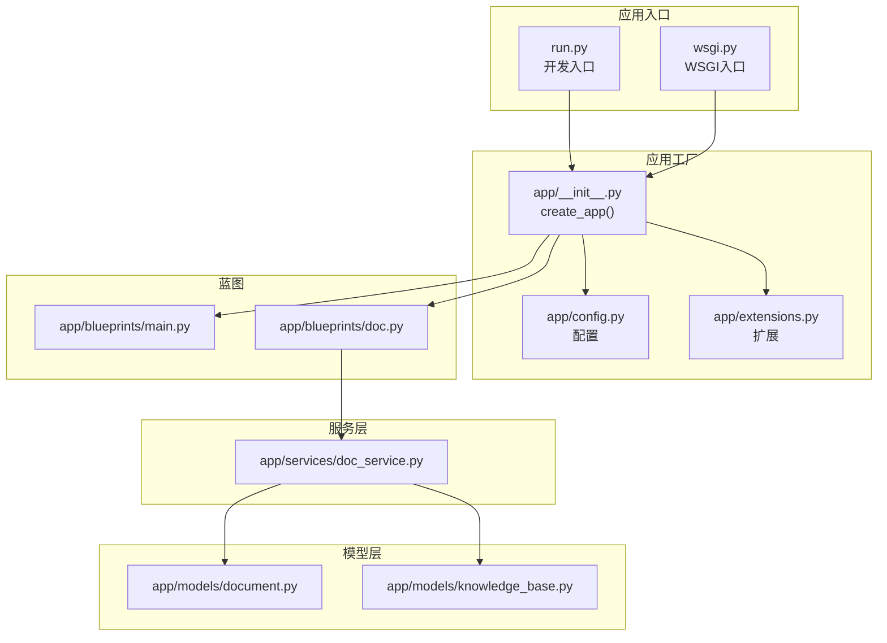
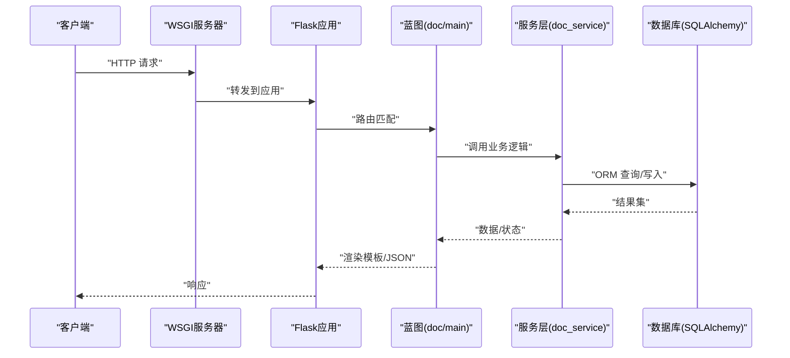
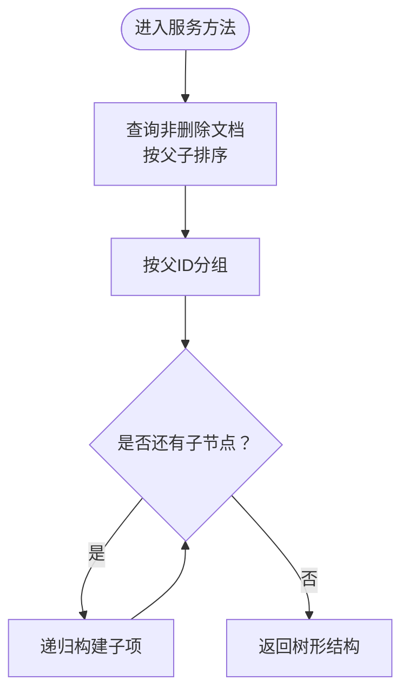
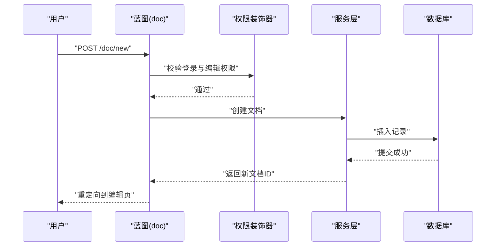
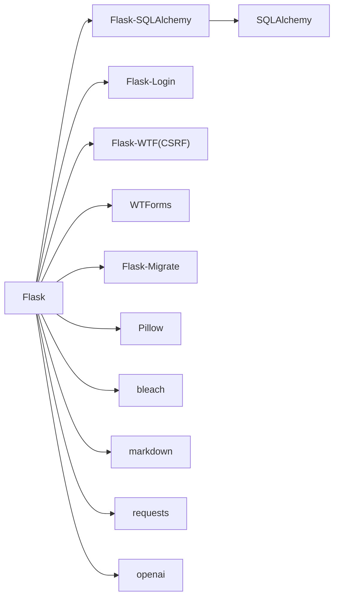

# 系统性能问题

<cite>
**本文引用的文件**
- [app/__init__.py](file://app/__init__.py)
- [app/config.py](file://app/config.py)
- [app/extensions.py](file://app/extensions.py)
- [app/blueprints/main.py](file://app/blueprints/main.py)
- [app/blueprints/doc.py](file://app/blueprints/doc.py)
- [app/services/doc_service.py](file://app/services/doc_service.py)
- [app/models/document.py](file://app/models/document.py)
- [app/models/knowledge_base.py](file://app/models/knowledge_base.py)
- [app/utils/decorators.py](file://app/utils/decorators.py)
- [run.py](file://run.py)
- [wsgi.py](file://wsgi.py)
- [requirements.txt](file://requirements.txt)
- [scripts/init_db.py](file://scripts/init_db.py)
</cite>

## 目录
1. [简介](#简介)
2. [项目结构](#项目结构)
3. [核心组件](#核心组件)
4. [架构总览](#架构总览)
5. [详细组件分析](#详细组件分析)
6. [依赖分析](#依赖分析)
7. [性能考虑](#性能考虑)
8. [故障排除指南](#故障排除指南)
9. [结论](#结论)
10. [附录](#附录)

## 简介
本文件面向 My Wiki 系统的性能问题排查与优化，聚焦以下方面：
- 数据库连接池耗尽与查询性能
- 内存与 CPU 使用异常
- 响应时间延迟与并发处理
- 缓存配置与静态资源优化
- 负载均衡与生产部署建议
- 性能监控指标与基准测试方法

目标是帮助运维与开发人员快速定位瓶颈、验证修复效果，并制定长期优化策略。

## 项目结构
My Wiki 采用 Flask 应用工厂模式，模块化组织蓝图、模型、服务与工具函数；数据库通过 SQLAlchemy 集成，生产通过 WSGI 启动，开发通过独立入口启动。

图表来源
- [app/__init__.py:11-28](file://app/__init__.py#L11-L28)
- [app/config.py:15-54](file://app/config.py#L15-L54)
- [app/extensions.py:8-11](file://app/extensions.py#L8-L11)
- [app/blueprints/main.py:1-16](file://app/blueprints/main.py#L1-L16)
- [app/blueprints/doc.py:1-139](file://app/blueprints/doc.py#L1-L139)
- [app/services/doc_service.py:1-81](file://app/services/doc_service.py#L1-L81)
- [app/models/document.py:20-98](file://app/models/document.py#L20-L98)
- [app/models/knowledge_base.py:19-62](file://app/models/knowledge_base.py#L19-L62)

章节来源
- [app/__init__.py:11-28](file://app/__init__.py#L11-L28)
- [app/config.py:15-54](file://app/config.py#L15-L54)
- [app/extensions.py:8-11](file://app/extensions.py#L8-L11)
- [run.py:1-17](file://run.py#L1-L17)
- [wsgi.py:1-10](file://wsgi.py#L1-L10)

## 核心组件
- 应用工厂与注册流程：负责加载配置、初始化扩展、注册蓝图、错误处理器与上下文变量。
- 数据库与会话：通过 SQLAlchemy 连接 MySQL，启用连接池预热与回收策略；会话 Cookie 安全策略配置。
- 蓝图路由：主页面与文档编辑/查看/保存/分享等业务路径。
- 服务层：文档树构建、内容更新、软删除、后代收集等逻辑封装。
- 模型层：文档、知识库、分享等实体及外键关系。

章节来源
- [app/__init__.py:39-74](file://app/__init__.py#L39-L74)
- [app/config.py:18-26](file://app/config.py#L18-L26)
- [app/config.py:28-31](file://app/config.py#L28-L31)
- [app/blueprints/doc.py:20-139](file://app/blueprints/doc.py#L20-L139)
- [app/services/doc_service.py:11-81](file://app/services/doc_service.py#L11-L81)
- [app/models/document.py:20-98](file://app/models/document.py#L20-L98)
- [app/models/knowledge_base.py:19-62](file://app/models/knowledge_base.py#L19-L62)

## 架构总览
下图展示请求从 WSGI 到蓝图再到服务与数据库的典型链路，以及可能的性能瓶颈点（连接池、查询、序列化）。

图表来源
- [wsgi.py:9](file://wsgi.py#L9)
- [app/__init__.py:56-74](file://app/__init__.py#L56-L74)
- [app/blueprints/doc.py:43-84](file://app/blueprints/doc.py#L43-L84)
- [app/services/doc_service.py:11-62](file://app/services/doc_service.py#L11-L62)
- [app/models/document.py:20-46](file://app/models/document.py#L20-L46)

## 详细组件分析

### 文档服务与查询路径
- 文档树构建：按父节点分组后递归构建嵌套列表，适合小中规模树形结构；大规模树建议分页或懒加载。
- 内容更新：计算纯文本摘要，写入数据库；注意大文档 JSON 的序列化与存储成本。
- 软删除：级联删除后代文档，需关注删除数量与事务开销。
- 继承关系：文档与知识库、用户存在多对一/一对多关系，查询时注意外键索引与过滤条件。

图表来源
- [app/services/doc_service.py:11-35](file://app/services/doc_service.py#L11-L35)

章节来源
- [app/services/doc_service.py:11-81](file://app/services/doc_service.py#L11-L81)
- [app/models/document.py:20-46](file://app/models/document.py#L20-L46)

### 蓝图路由与权限控制
- 权限装饰器：超级管理员与细粒度权限校验，避免重复鉴权逻辑。
- 文档操作：新建、查看、编辑、保存、删除、分享；其中保存接口返回大纲与更新时间，前端频繁轮询可能带来压力。
- 主页重定向：已登录用户跳转仪表盘，否则展示公开知识库列表。

图表来源
- [app/blueprints/doc.py:20-41](file://app/blueprints/doc.py#L20-L41)
- [app/utils/decorators.py:8-18](file://app/utils/decorators.py#L8-L18)
- [app/services/doc_service.py:37-53](file://app/services/doc_service.py#L37-L53)

章节来源
- [app/blueprints/doc.py:20-139](file://app/blueprints/doc.py#L20-L139)
- [app/utils/decorators.py:8-33](file://app/utils/decorators.py#L8-L33)

### 数据库连接与会话配置
- 连接池：启用连接前 ping 与定期回收，有助于维持连接健康与释放僵尸连接。
- 会话 Cookie：HttpOnly、SameSite=Lax、记住我时长配置，降低会话劫持风险并减少跨站请求负担。
- ORM 使用：在视图与服务层直接进行查询与提交，注意每个请求边界内的事务管理。

章节来源
- [app/config.py:18-26](file://app/config.py#L18-L26)
- [app/config.py:28-31](file://app/config.py#L28-L31)
- [app/__init__.py:39-54](file://app/__init__.py#L39-L54)

## 依赖分析
- Python 依赖集中在 Web 框架、数据库 ORM、迁移、登录、CSRF、图像处理、Markdown 解析、OpenAI SDK 等。
- 生产与开发环境差异：开发开启调试，生产关闭调试并通过 WSGI 启动。

图表来源
- [requirements.txt:1-22](file://requirements.txt#L1-L22)

章节来源
- [requirements.txt:1-22](file://requirements.txt#L1-L22)
- [run.py:12-16](file://run.py#L12-L16)
- [wsgi.py:9](file://wsgi.py#L9)

## 性能考虑
- 数据库连接池
  - 当前已启用 pool_pre_ping 与 pool_recycle，建议结合数据库端连接超时与最大连接数评估是否需要调整池大小与回收周期。
  - 在高并发场景下，确保每个请求结束时正确提交/回滚并关闭 session，避免连接泄漏。
- 查询优化
  - 文档树构建使用一次全量查询后内存分组，建议对大规模树采用分页或仅加载必要层级。
  - 对频繁访问的字段（如知识库可见性、文档隐私、删除标记）建立合适索引，避免全表扫描。
- 缓存与静态资源
  - 对热点页面（如公共知识库列表）增加 HTTP 缓存头或反向代理缓存。
  - 静态资源建议 CDN 与压缩，模板中使用版本戳避免缓存污染。
- 并发与会话
  - 会话 Cookie 安全配置合理；若使用分布式部署，建议统一会话存储（如 Redis）以支持横向扩展。
- 响应时间
  - 大 JSON 内容序列化与纯文本提取可能成为瓶颈，建议异步处理或分片传输。
- 日志与监控
  - 开启请求耗时日志、慢查询日志与数据库连接池状态监控，结合 APM 工具定位热点函数。

[本节为通用指导，不直接分析具体文件，故无“章节来源”]

## 故障排除指南

### 数据库连接池耗尽
- 现象
  - 请求堆积、超时、连接拒绝。
- 排查步骤
  - 检查数据库最大连接数与当前活跃连接数。
  - 查看应用日志中的数据库连接异常与超时信息。
  - 确认每个请求是否正确提交/回滚并释放连接。
- 优化建议
  - 调整连接池参数（池大小、回收周期），结合数据库端设置。
  - 将长事务拆分为短事务，避免长时间占用连接。
  - 对只读查询使用只读会话或连接复用策略。

章节来源
- [app/config.py:23-26](file://app/config.py#L23-L26)
- [app/__init__.py:39-54](file://app/__init__.py#L39-L54)

### 内存泄漏
- 现象
  - 进程内存持续增长，GC 无法回收。
- 排查步骤
  - 使用内存分析工具（如 tracemalloc、memory_profiler）定位对象保留。
  - 关注大对象（JSON、图片）、全局缓存、闭包持有。
- 优化建议
  - 避免在请求间缓存大对象；使用惰性加载与分页。
  - 及时释放临时资源，如下载流、图像对象。

[本节为通用指导，不直接分析具体文件，故无“章节来源”]

### CPU 使用率过高
- 现象
  - 单核 CPU 使用率高，响应变慢。
- 排查步骤
  - 使用性能分析工具（如 cProfile、py-spy）定位热点函数。
  - 检查是否存在 O(n^2) 或 N+1 查询。
- 优化建议
  - 减少循环内数据库查询，合并批量查询。
  - 异步处理耗时任务（如内容解析、图片压缩）。

章节来源
- [app/services/doc_service.py:11-35](file://app/services/doc_service.py#L11-L35)

### 响应时间延迟
- 现象
  - P95/P99 延迟升高，用户感知差。
- 排查步骤
  - 分层测量：网络、应用、数据库、IO。
  - 检查慢查询日志与热点路由。
- 优化建议
  - 对热点接口增加缓存；优化模板渲染与静态资源。
  - 将重型计算移至后台任务队列。

章节来源
- [app/blueprints/doc.py:43-84](file://app/blueprints/doc.py#L43-L84)

### Flask 应用性能瓶颈
- 现象
  - 单进程吞吐受限，CPU 利用率低。
- 排查步骤
  - 使用 gunicorn/uwsgi + 多 worker，观察并发与队列长度。
  - 检查阻塞 I/O 与同步调用。
- 优化建议
  - 异步化外部调用（如 OpenAI API）。
  - 使用连接池与超时控制。

章节来源
- [wsgi.py:9](file://wsgi.py#L9)
- [app/config.py:38-40](file://app/config.py#L38-L40)

### SQL 查询优化
- 现象
  - 查询慢、锁等待、死锁。
- 排查步骤
  - EXPLAIN 分析关键查询，确认索引使用。
  - 检查是否遗漏必要的过滤条件或排序字段。
- 优化建议
  - 为常用过滤字段添加索引；避免 SELECT *。
  - 使用分页与 LIMIT 控制结果集大小。

章节来源
- [app/models/document.py:24-37](file://app/models/document.py#L24-L37)
- [app/models/knowledge_base.py:28-33](file://app/models/knowledge_base.py#L28-L33)

### 缓存配置问题
- 现象
  - 缓存命中率低、热点数据频繁失效。
- 排查步骤
  - 检查缓存键设计与过期策略。
  - 观察缓存后端（如 Redis）的内存与连接。
- 优化建议
  - 对热点数据设置更长 TTL；对变更频繁的数据使用短 TTL 并增量更新。

[本节为通用指导，不直接分析具体文件，故无“章节来源”]

### 并发处理异常
- 现象
  - 高并发下数据不一致、竞态条件。
- 排查步骤
  - 检查事务边界与锁策略。
  - 关注幂等性与重试机制。
- 优化建议
  - 使用数据库事务与唯一约束保证一致性。
  - 对外部 API 调用增加指数退避与熔断。

章节来源
- [app/services/doc_service.py:37-67](file://app/services/doc_service.py#L37-L67)

### 性能监控指标与资源检查
- 指标建议
  - 应用：请求速率、P50/P90/P95 延迟、错误率、并发连接数、线程/进程数。
  - 数据库：连接数、慢查询数、锁等待、缓冲池命中率。
  - 系统：CPU 使用率、内存占用、磁盘 IO、网络带宽。
- 工具建议
  - 应用：Flask 扩展或中间件记录请求日志与耗时。
  - 数据库：MySQL 慢查询日志与性能模式。
  - APM：如 Prometheus + Grafana 或云厂商监控。

[本节为通用指导，不直接分析具体文件，故无“章节来源”]

### 负载均衡与扩容
- 配置要点
  - 会话粘性或共享会话存储；健康检查与自动扩缩容。
  - 静态资源走 CDN；动态请求走应用集群。
- 扩容策略
  - 垂直扩容：提升实例规格；水平扩容：增加副本数。
  - 数据库读写分离与缓存层扩容。

[本节为通用指导，不直接分析具体文件，故无“章节来源”]

### 数据库性能调优
- 索引优化：为过滤与排序字段建立复合索引；定期分析碎片。
- 查询优化：避免 N+1；使用原生 SQL 或 ORM 批处理。
- 存储优化：大字段拆分、压缩存储、冷热数据分离。

章节来源
- [app/models/document.py:24-37](file://app/models/document.py#L24-L37)
- [app/models/knowledge_base.py:28-33](file://app/models/knowledge_base.py#L28-L33)

### 静态资源优化
- 压缩与合并：CSS/JS 压缩与版本号。
- CDN：静态资源分发与缓存策略。
- 懒加载：图片与非首屏资源延迟加载。

[本节为通用指导，不直接分析具体文件，故无“章节来源”]

### 会话管理优化
- Cookie 安全：HttpOnly、Secure、SameSite。
- 会话存储：分布式部署建议 Redis 等共享存储。
- TTL 与清理：合理设置过期时间与清理策略。

章节来源
- [app/config.py:28-31](file://app/config.py#L28-L31)

### 系统扩容建议
- 应用层：多实例 + 负载均衡；异步任务队列。
- 数据层：主从复制、分库分表、缓存层。
- 存储层：对象存储与 CDN。

[本节为通用指导，不直接分析具体文件，故无“章节来源”]

### 性能基准测试方法
- 压力测试：JMeter/Loader.io/Artillery，模拟并发用户与典型路径。
- 端到端链路：覆盖路由、服务、数据库、缓存。
- 指标采集：RPS、延迟分布、错误率、资源使用率。
- 回归对比：每次优化后对比基线，验证收益。

[本节为通用指导，不直接分析具体文件，故无“章节来源”]

## 结论
My Wiki 的性能问题多源于数据库连接池、查询效率与并发处理不当。通过合理的连接池配置、查询优化、缓存与静态资源优化、并发与会话治理，以及完善的监控与基准测试体系，可显著提升系统稳定性与响应能力。建议优先解决连接池与慢查询问题，再逐步引入缓存与异步化策略。

[本节为总结性内容，不直接分析具体文件，故无“章节来源”]

## 附录

### 快速检查清单
- 数据库
  - 最大连接数与当前连接数
  - 慢查询日志与索引使用
  - 连接池参数（池大小、回收周期）
- 应用
  - 请求耗时与错误率
  - 会话 Cookie 配置
  - 静态资源缓存与压缩
- 并发
  - Worker 数量与队列长度
  - 事务边界与锁竞争
- 监控
  - 指标采集与告警阈值
  - APM 与日志聚合

[本节为通用指导，不直接分析具体文件，故无“章节来源”]