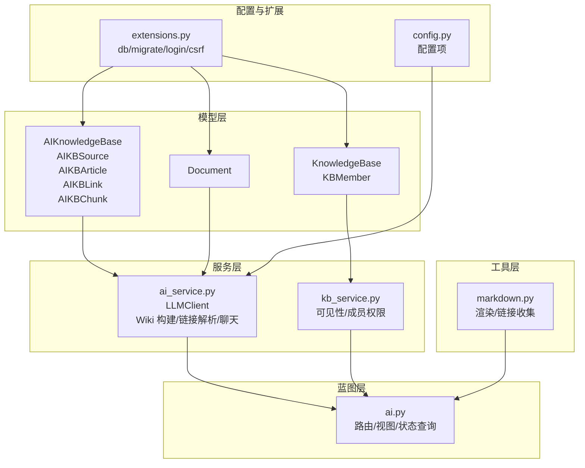
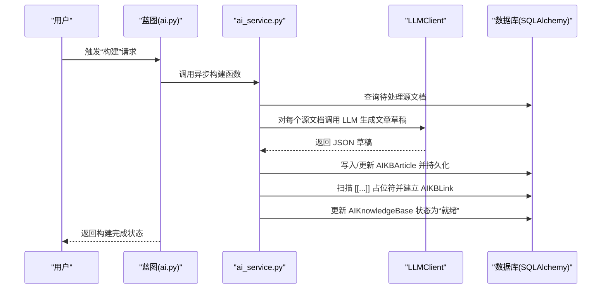
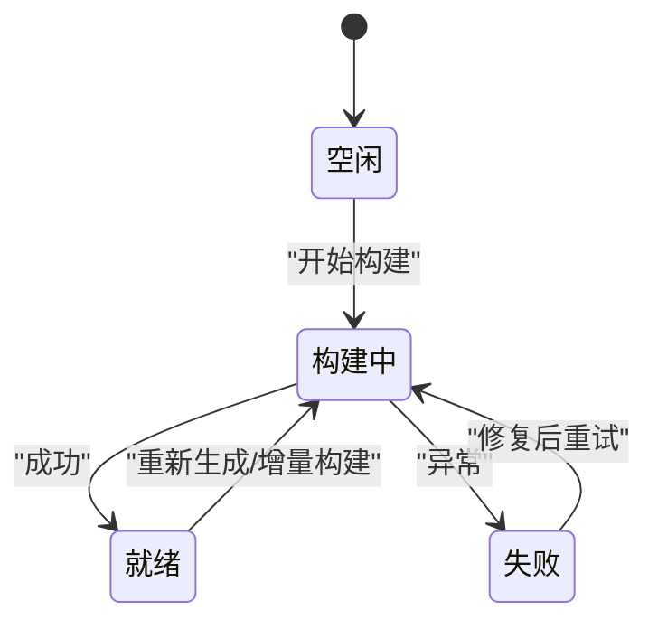
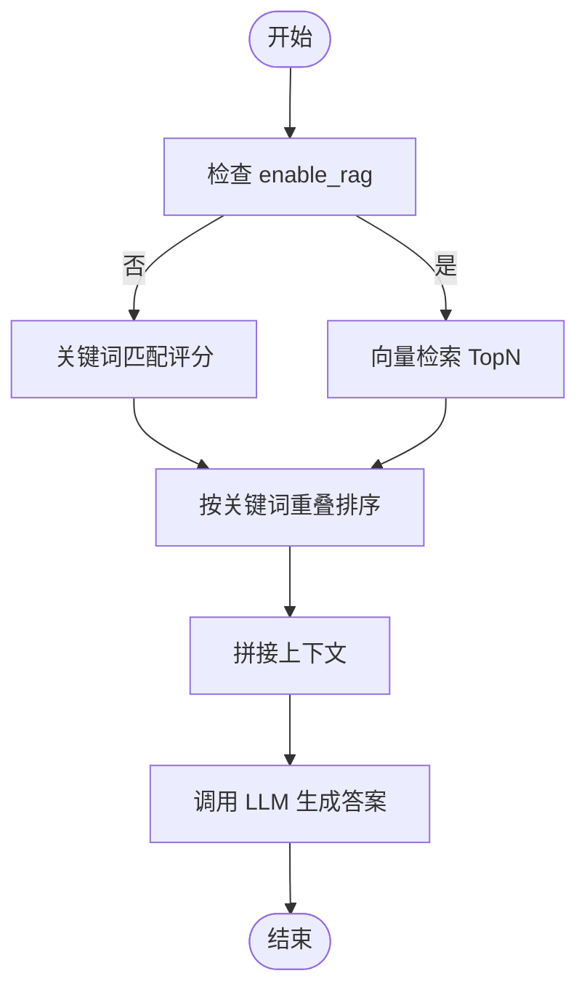
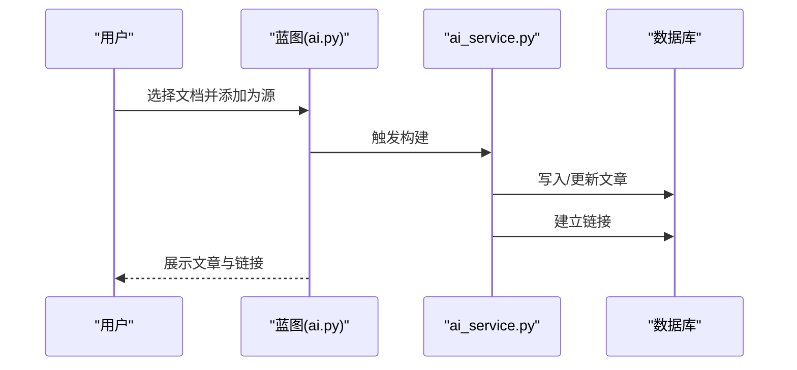
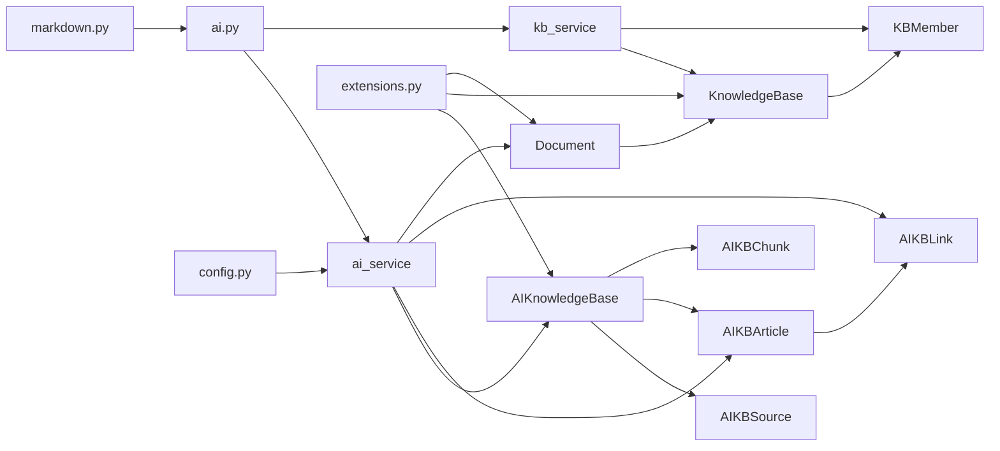

# AI知识库模型

<cite>
**本文档引用的文件**
- [app/models/ai_kb.py](file://app/models/ai_kb.py)
- [app/models/knowledge_base.py](file://app/models/knowledge_base.py)
- [app/models/document.py](file://app/models/document.py)
- [app/services/ai_service.py](file://app/services/ai_service.py)
- [app/services/kb_service.py](file://app/services/kb_service.py)
- [app/blueprints/ai.py](file://app/blueprints/ai.py)
- [app/utils/markdown.py](file://app/utils/markdown.py)
- [app/config.py](file://app/config.py)
- [app/extensions.py](file://app/extensions.py)
</cite>

## 目录
1. [简介](#简介)
2. [项目结构](#项目结构)
3. [核心组件](#核心组件)
4. [架构总览](#架构总览)
5. [详细组件分析](#详细组件分析)
6. [依赖关系分析](#依赖关系分析)
7. [性能考虑](#性能考虑)
8. [故障排查指南](#故障排查指南)
9. [结论](#结论)
10. [附录](#附录)

## 简介
本文件聚焦于“AI知识库模型”的数据模型设计与实现，系统性阐述 AIKnowledgeBase 数据模型的字段定义、数据类型与业务规则，以及其与传统知识库（KnowledgeBase）的差异与联系。文档还覆盖了 AI 知识库的构建状态管理（索引创建、更新与维护）、搜索机制（关键词匹配与可选的向量检索）、性能优化策略（索引压缩、缓存与查询优化），并给出典型使用场景与数据处理流程。

## 项目结构
该项目采用 Flask + SQLAlchemy 的分层架构，围绕“知识库”与“AI知识库”两条主线组织代码：
- 模型层：定义数据库表结构与关系
- 服务层：封装业务逻辑（LLM 调用、Wiki 构建、链接解析、聊天）
- 蓝图层：路由与视图控制
- 工具层：Markdown 渲染与链接收集
- 配置层：应用配置与环境变量

图表来源
- [app/models/ai_kb.py:22-121](file://app/models/ai_kb.py#L22-L121)
- [app/models/knowledge_base.py:19-62](file://app/models/knowledge_base.py#L19-L62)
- [app/models/document.py:20-98](file://app/models/document.py#L20-L98)
- [app/services/ai_service.py:1-408](file://app/services/ai_service.py#L1-L408)
- [app/services/kb_service.py:1-80](file://app/services/kb_service.py#L1-L80)
- [app/blueprints/ai.py:1-279](file://app/blueprints/ai.py#L1-L279)
- [app/utils/markdown.py:1-87](file://app/utils/markdown.py#L1-L87)
- [app/config.py:1-83](file://app/config.py#L1-L83)
- [app/extensions.py:1-17](file://app/extensions.py#L1-L17)

章节来源
- [app/models/ai_kb.py:22-121](file://app/models/ai_kb.py#L22-L121)
- [app/models/knowledge_base.py:19-62](file://app/models/knowledge_base.py#L19-L62)
- [app/models/document.py:20-98](file://app/models/document.py#L20-L98)
- [app/services/ai_service.py:1-408](file://app/services/ai_service.py#L1-L408)
- [app/services/kb_service.py:1-80](file://app/services/kb_service.py#L1-L80)
- [app/blueprints/ai.py:1-279](file://app/blueprints/ai.py#L1-L279)
- [app/utils/markdown.py:1-87](file://app/utils/markdown.py#L1-L87)
- [app/config.py:1-83](file://app/config.py#L1-L83)
- [app/extensions.py:1-17](file://app/extensions.py#L1-L17)

## 核心组件
本节聚焦 AI 知识库的核心数据模型及其关键字段、枚举与关系。

- AIKBStatus 枚举：表示 AI 知识库整体构建状态（空闲、构建中、就绪、失败）
- AIKBSourceStatus 枚举：表示单个源文档的处理状态（待处理、处理中、已处理、失败）
- AIKnowledgeBase 实体：AI 知识库主表，包含所有者、名称、描述、模型配置、RAG 开关、状态、错误信息、时间戳等
- AIKBSource 实体：记录加入 AI 知识库的源文档，支持唯一约束（AI知识库+源文档）
- AIKBArticle 实体：Karpathy 风格的 Wiki 条目，包含标题、slug、摘要、标签、别名、内容、来源文档集合、时间戳
- AIKBLink 实体：条目间的双向链接，支持红链（未命中的占位）
- AIKBChunk 实体：可选的文档切片元数据，向量本体存储于外部向量库（默认不启用）

章节来源
- [app/models/ai_kb.py:8-121](file://app/models/ai_kb.py#L8-L121)

## 架构总览
AI 知识库的实现遵循“文档 → 文章 → 链接”的三层结构，结合可选的 RAG 向量检索能力。整体流程如下：

图表来源
- [app/blueprints/ai.py:143-156](file://app/blueprints/ai.py#L143-L156)
- [app/services/ai_service.py:313-344](file://app/services/ai_service.py#L313-L344)
- [app/services/ai_service.py:296-311](file://app/services/ai_service.py#L296-L311)
- [app/services/ai_service.py:147-161](file://app/services/ai_service.py#L147-L161)

## 详细组件分析

### AIKnowledgeBase 数据模型详解
- 字段与类型
  - id: 整数主键
  - owner_id: 整数外键，指向用户表，级联删除；非空且建立索引
  - name: 字符串，长度上限 128，非空
  - description: 字符串，长度上限 500，缺省为空
  - chat_model: 字符串，长度上限 64，为空时回退到全局配置的 CHAT_MODEL
  - enable_rag: 布尔值，缺省 false
  - status: 字符串，取值来自 AIKBStatus 枚举，默认 idle，非空且建立索引
  - last_built_at: 日期时间，记录上次构建完成时间
  - error_msg: 字符串，长度上限 500，记录构建错误信息
  - created_at/updated_at: 日期时间，自动填充与更新
- 关系
  - 与 User 的多对一关系，反向为 ai_kbs
- 业务规则
  - chat_model 为空时使用全局配置的模型
  - enable_rag 控制是否启用向量检索（本仓库当前实现默认不强制依赖向量库）
  - status 字段驱动 UI 与后台任务的状态机

章节来源
- [app/models/ai_kb.py:22-44](file://app/models/ai_kb.py#L22-L44)

### AIKBSource 数据模型详解
- 字段与类型
  - id: 整数主键
  - ai_kb_id: 整数外键，指向 AIKnowledgeBase，级联删除；非空且建立索引
  - doc_id: 整数外键，指向 Document，级联删除；非空且建立索引
  - status: 字符串，取值来自 AIKBSourceStatus 枚举，默认 pending，非空且建立索引
  - err_msg: 字符串，长度上限 500
  - created_at/updated_at: 日期时间
- 唯一约束
  - (ai_kb_id, doc_id) 唯一键，避免重复加入同一文档
- 关系
  - 与 AIKnowledgeBase 的一对多关系（反向为 sources）
  - 与 Document 的多对一关系

章节来源
- [app/models/ai_kb.py:46-64](file://app/models/ai_kb.py#L46-L64)

### AIKBArticle 数据模型详解
- 字段与类型
  - id: 整数主键
  - ai_kb_id: 整数外键，指向 AIKnowledgeBase，级联删除；非空且建立索引
  - title: 字符串，长度上限 255，非空
  - slug: 字符串，长度上限 255，非空且建立索引
  - summary: 字符串，长度上限 500
  - tags_json: 文本，JSON 数组字符串，存储标签列表
  - aliases_json: 文本，JSON 数组字符串，存储别名列表，用于链接解析
  - content_md: 文本，存储 Markdown 正文
  - source_doc_ids_json: 文本，JSON 数组字符串，存储来源文档 ID 列表
  - created_at/updated_at: 日期时间
- 唯一约束
  - (ai_kb_id, slug) 唯一键，保证同一知识库内条目 slug 唯一
- 关系
  - 与 AIKnowledgeBase 的一对多关系（反向为 articles）

章节来源
- [app/models/ai_kb.py:66-91](file://app/models/ai_kb.py#L66-L91)

### AIKBLink 数据模型详解
- 字段与类型
  - id: 整数主键
  - ai_kb_id: 整数外键，指向 AIKnowledgeBase，级联删除；非空且建立索引
  - from_article_id: 整数外键，指向 AIKBArticle，级联删除；非空且建立索引
  - to_article_id: 整数外键，指向 AIKBArticle，删除时置空；可为空（红链）
  - anchor_text: 字符串，长度上限 255，存储锚文本
  - created_at: 日期时间
- 关系
  - 与 AIKBArticle 的多对一关系（from_article/to_article），分别反向为 outgoing_links/incoming_links

章节来源
- [app/models/ai_kb.py:93-108](file://app/models/ai_kb.py#L93-L108)

### AIKBChunk 数据模型详解
- 字段与类型
  - id: 整数主键
  - ai_kb_id: 整数外键，指向 AIKnowledgeBase，级联删除；非空且建立索引
  - article_id: 整数外键，指向 AIKBArticle，级联删除；非空且建立索引
  - chunk_idx: 整数，切片序号
  - content: 文本，切片内容
  - vector_id: 字符串，长度上限 64，建立索引
  - created_at: 日期时间
- 使用说明
  - 当 enable_rag=true 时启用；向量本体存储于外部向量库（本仓库默认不强制依赖向量库）

章节来源
- [app/models/ai_kb.py:110-121](file://app/models/ai_kb.py#L110-L121)

### 与传统知识库的关系与差异
- 关系
  - AI 知识库以“文档”为输入源，通过 LLM 重写为“文章”，再进行链接解析，形成 Wiki 图谱
  - 传统知识库以“知识库”为单位，强调可见性与成员管理
- 差异
  - 数据来源：AI 知识库来源于文档（Document），传统知识库来源于知识库（KnowledgeBase）
  - 处理流程：AI 知识库包含 LLM 重写、链接解析、可选向量检索；传统知识库侧重内容管理与权限控制
  - 存储方式：AI 知识库以 Markdown 文件形式落地（可选向量本体），传统知识库以数据库表为主

章节来源
- [app/models/ai_kb.py:46-91](file://app/models/ai_kb.py#L46-L91)
- [app/models/knowledge_base.py:19-62](file://app/models/knowledge_base.py#L19-L62)
- [app/models/document.py:20-98](file://app/models/document.py#L20-L98)

### 构建状态管理（索引创建/更新/维护）
- 状态机
  - AIKBStatus：idle → building → ready 或 failed
  - AIKBSourceStatus：pending → processing → processed 或 failed
- 生命周期
  - 新建 AI 知识库后，添加源文档（AIKBSource），触发异步构建
  - 构建过程：逐个处理源文档，生成文章草稿并写入 AIKBArticle，随后扫描并建立 AIKBLink
  - 成功后状态置为 ready，并更新 last_built_at；失败则记录 error_msg
- 更新与维护
  - 支持针对单篇文章重新生成（regenerate_one_async）
  - 支持增量构建（仅处理 pending/failed 的源文档）

图表来源
- [app/models/ai_kb.py:8-13](file://app/models/ai_kb.py#L8-L13)
- [app/models/ai_kb.py:15-19](file://app/models/ai_kb.py#L15-L19)
- [app/services/ai_service.py:313-344](file://app/services/ai_service.py#L313-L344)

章节来源
- [app/services/ai_service.py:296-382](file://app/services/ai_service.py#L296-L382)
- [app/blueprints/ai.py:143-173](file://app/blueprints/ai.py#L143-L173)

### 搜索机制（关键词匹配与可选向量检索）
- 关键词匹配（默认）
  - chat_with_wiki 通过简单关键词重叠评分，选取前 N 篇文章作为上下文，调用 LLM 生成回答
  - 评分依据：问题分词与文章标题/摘要/正文的交集
- 可选向量检索（RAG）
  - 通过配置项开启（ENABLE_RAG），使用嵌入模型与向量库（默认 CHROMA_PATH）
  - 本仓库当前实现默认不强制依赖向量库，可在启用 RAG 时配合 AIKBChunk 存储切片元数据

图表来源
- [app/services/ai_service.py:391-408](file://app/services/ai_service.py#L391-L408)
- [app/config.py:44-47](file://app/config.py#L44-L47)

章节来源
- [app/services/ai_service.py:391-408](file://app/services/ai_service.py#L391-L408)
- [app/config.py:44-47](file://app/config.py#L44-L47)

### 典型使用场景与数据处理流程
- 场景一：从文档库导入文档，生成 AI 知识库文章并建立链接
  - 步骤：选择文档 → 添加为源文档 → 异步构建 → 查看文章与链接图谱
- 场景二：对单篇文档进行重新生成
  - 步骤：定位文章 → 触发“重生”任务 → 重新生成并更新链接
- 场景三：启用 RAG 进行问答
  - 步骤：开启 enable_rag → 构建完成后进行向量检索与问答

图表来源
- [app/blueprints/ai.py:108-127](file://app/blueprints/ai.py#L108-L127)
- [app/services/ai_service.py:204-231](file://app/services/ai_service.py#L204-L231)
- [app/services/ai_service.py:251-278](file://app/services/ai_service.py#L251-L278)

章节来源
- [app/blueprints/ai.py:108-127](file://app/blueprints/ai.py#L108-L127)
- [app/services/ai_service.py:204-231](file://app/services/ai_service.py#L204-L231)
- [app/services/ai_service.py:251-278](file://app/services/ai_service.py#L251-L278)

## 依赖关系分析
- 模型间依赖
  - AIKnowledgeBase ←→ AIKBSource/Article/Link/Chunk（一对多/多对一）
  - KnowledgeBase ←→ KBMember（一对多/多对一）
  - Document ←→ KnowledgeBase（一对多/多对一）
- 服务与模型依赖
  - ai_service 依赖 AIKnowledgeBase/AIKBSource/AIKBArticle/AIKBLink/Document
  - kb_service 依赖 KnowledgeBase/KBMember/User
- 蓝图与服务依赖
  - ai.py 依赖 ai_service 与 kb_service，负责路由与视图
- 工具与渲染
  - markdown.py 提供 Wiki 链接解析与渲染
- 配置与扩展
  - config.py 提供 OPENAI_BASE_URL/API_KEY/CHAT_MODEL/AI_WIKI_DIR/ENABLE_RAG/CHROMA_PATH 等配置
  - extensions.py 提供 db/migrate/login/csrf 单例

图表来源
- [app/models/ai_kb.py:22-121](file://app/models/ai_kb.py#L22-L121)
- [app/models/knowledge_base.py:19-62](file://app/models/knowledge_base.py#L19-L62)
- [app/models/document.py:20-98](file://app/models/document.py#L20-L98)
- [app/services/ai_service.py:1-408](file://app/services/ai_service.py#L1-L408)
- [app/services/kb_service.py:1-80](file://app/services/kb_service.py#L1-L80)
- [app/blueprints/ai.py:1-279](file://app/blueprints/ai.py#L1-L279)
- [app/utils/markdown.py:1-87](file://app/utils/markdown.py#L1-L87)
- [app/config.py:1-83](file://app/config.py#L1-L83)
- [app/extensions.py:1-17](file://app/extensions.py#L1-L17)

章节来源
- [app/models/ai_kb.py:22-121](file://app/models/ai_kb.py#L22-L121)
- [app/models/knowledge_base.py:19-62](file://app/models/knowledge_base.py#L19-L62)
- [app/models/document.py:20-98](file://app/models/document.py#L20-L98)
- [app/services/ai_service.py:1-408](file://app/services/ai_service.py#L1-L408)
- [app/services/kb_service.py:1-80](file://app/services/kb_service.py#L1-L80)
- [app/blueprints/ai.py:1-279](file://app/blueprints/ai.py#L1-L279)
- [app/utils/markdown.py:1-87](file://app/utils/markdown.py#L1-L87)
- [app/config.py:1-83](file://app/config.py#L1-L83)
- [app/extensions.py:1-17](file://app/extensions.py#L1-L17)

## 性能考虑
- 索引与查询优化
  - 为 owner_id、ai_kb_id、doc_id、slug、vector_id 等关键字段建立索引，提升过滤与连接效率
  - 在 AIKBArticle 上对 slug 建立唯一索引，确保链接解析高效
- 文档与文章规模控制
  - 对 LLM 输入进行长度限制（如安全上限），减少无效计算
  - 分页加载文章列表，避免一次性查询过多数据
- 缓存与文件系统
  - AI 知识库文章以 Markdown 文件形式落盘（AI_WIKI_DIR），可结合静态资源缓存与 CDN 加速
- 向量检索（可选）
  - 启用 RAG 时，合理设置向量维度与相似度阈值，避免过度召回
  - 定期清理无效向量与冗余切片，保持向量库健康

章节来源
- [app/models/ai_kb.py:26-38](file://app/models/ai_kb.py#L26-L38)
- [app/models/ai_kb.py:77-82](file://app/models/ai_kb.py#L77-L82)
- [app/models/ai_kb.py:119](file://app/models/ai_kb.py#L119)
- [app/services/ai_service.py:149-150](file://app/services/ai_service.py#L149-L150)
- [app/config.py:42-47](file://app/config.py#L42-L47)

## 故障排查指南
- 构建失败
  - 检查 AIKnowledgeBase.error_msg 获取错误详情
  - 确认 OPENAI_BASE_URL/API_KEY/CHAT_MODEL 配置正确
- 源文档缺失
  - 若源文档被删除或不可见，构建会标记为失败；需重新选择有效文档
- 链接解析异常
  - 检查 AIKBArticle.aliases_json 与标题大小写映射是否正确
  - 确认 collect_wikilinks 是否正确提取占位符
- RAG 未生效
  - 确认 ENABLE_RAG 已开启，CHROMA_PATH 指向有效路径
  - 检查 AIKBChunk.vector_id 是否正确写入

章节来源
- [app/services/ai_service.py:338-341](file://app/services/ai_service.py#L338-L341)
- [app/services/ai_service.py:307-310](file://app/services/ai_service.py#L307-L310)
- [app/utils/markdown.py:69-87](file://app/utils/markdown.py#L69-L87)
- [app/config.py:44-47](file://app/config.py#L44-L47)

## 结论
本项目以“Karpathy LLM Wiki”方法论为核心，将文档转换为结构化的 Wiki 条目，通过双向链接形成知识图谱，并提供可选的向量检索增强问答能力。AIKnowledgeBase 模型通过状态机与唯一约束保障构建流程的可靠性，配合蓝图与服务层实现完整的生命周期管理。在性能方面，通过索引、文件落盘与可选向量库实现平衡的读写与查询体验。

## 附录
- 关键配置项
  - OPENAI_BASE_URL、OPENAI_API_KEY、CHAT_MODEL：LLM 访问参数
  - AI_WIKI_DIR：文章文件落盘目录
  - ENABLE_RAG、EMBEDDING_MODEL、CHROMA_PATH：RAG 相关配置
- 关键枚举
  - AIKBStatus：idle/building/ready/failed
  - AIKBSourceStatus：pending/processing/processed/failed
  - KBVisibility：private/members/public
  - KBMemberRole：viewer/editor

章节来源
- [app/config.py:37-47](file://app/config.py#L37-L47)
- [app/models/ai_kb.py:8-19](file://app/models/ai_kb.py#L8-L19)
- [app/models/knowledge_base.py:8-17](file://app/models/knowledge_base.py#L8-L17)