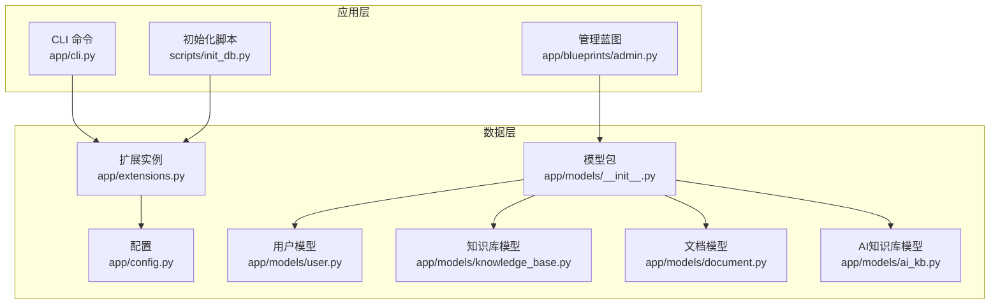
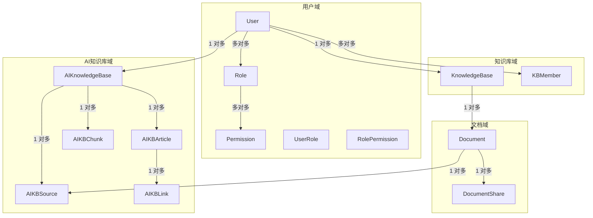
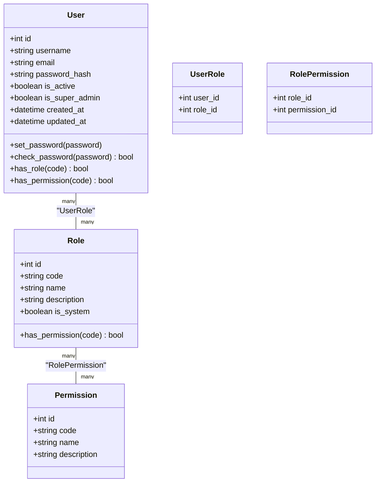
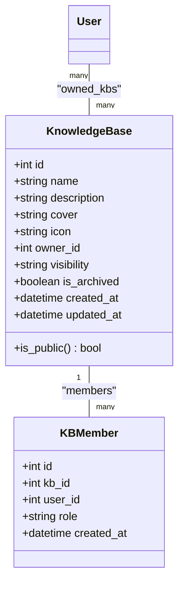
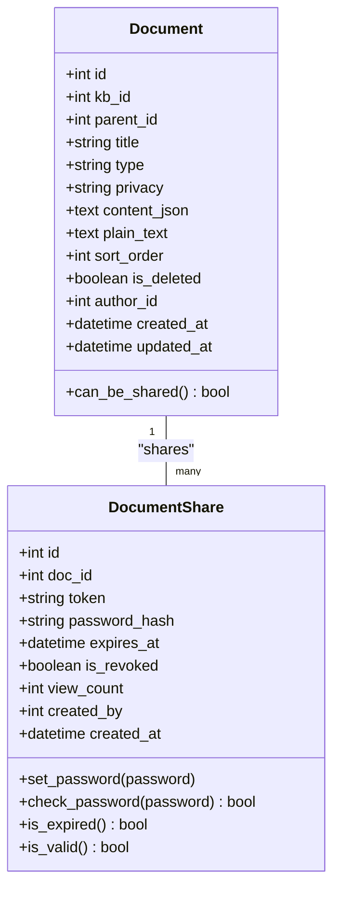
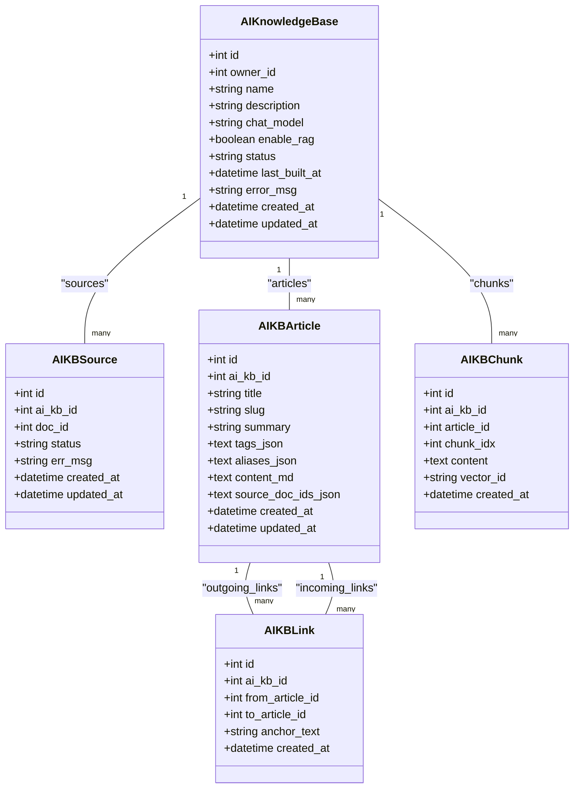
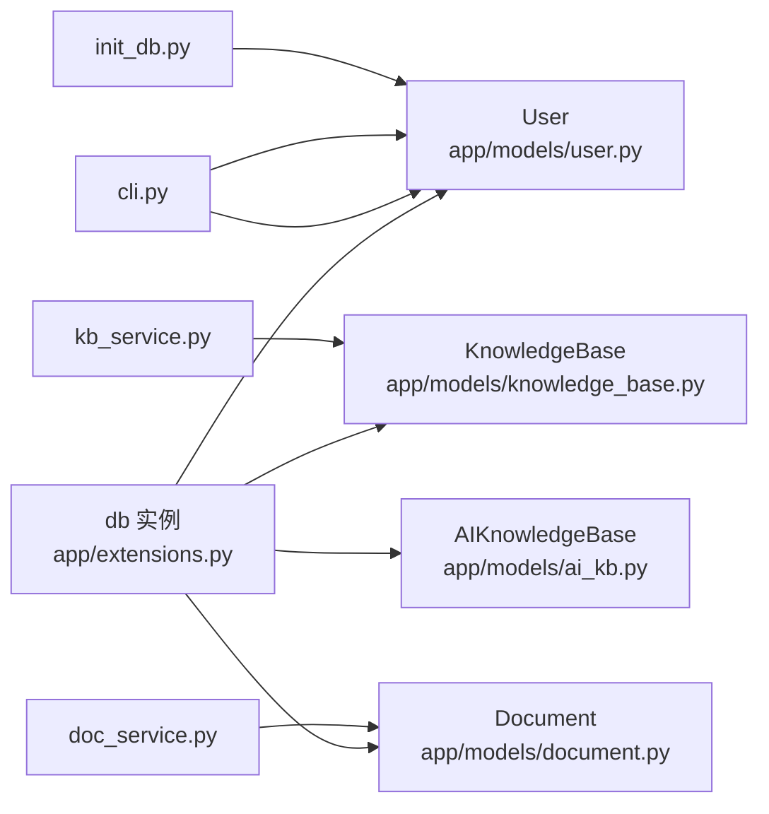

# 数据模型设计

<cite>
**本文档引用的文件**
- [app/models/__init__.py](file://app/models/__init__.py)
- [app/models/user.py](file://app/models/user.py)
- [app/models/knowledge_base.py](file://app/models/knowledge_base.py)
- [app/models/document.py](file://app/models/document.py)
- [app/models/ai_kb.py](file://app/models/ai_kb.py)
- [app/services/doc_service.py](file://app/services/doc_service.py)
- [app/services/kb_service.py](file://app/services/kb_service.py)
- [app/utils/security.py](file://app/utils/security.py)
- [app/cli.py](file://app/cli.py)
- [app/blueprints/admin.py](file://app/blueprints/admin.py)
- [app/extensions.py](file://app/extensions.py)
- [app/config.py](file://app/config.py)
- [scripts/init_db.py](file://scripts/init_db.py)
</cite>

## 目录
1. [简介](#简介)
2. [项目结构](#项目结构)
3. [核心组件](#核心组件)
4. [架构总览](#架构总览)
5. [详细组件分析](#详细组件分析)
6. [依赖关系分析](#依赖关系分析)
7. [性能考量](#性能考量)
8. [故障排查指南](#故障排查指南)
9. [结论](#结论)
10. [附录](#附录)

## 简介
本文件面向 My Wiki 的数据模型与实体关系设计，聚焦于 User、KnowledgeBase、Document、AIKnowledgeBase 等核心数据模型，系统阐述字段定义、数据类型、约束条件、业务规则、索引策略、数据访问模式、缓存策略、数据生命周期管理以及安全与隐私保护机制。同时提供 ER 关系图与实体关系图，帮助读者快速理解表之间的主外键关系与关联模式，并给出典型查询场景与示例数据。

## 项目结构
My Wiki 使用 Flask + SQLAlchemy 构建，数据模型集中在 app/models 下，通过 app/extensions.py 统一注入 db 实例，配合 app/config.py 提供数据库连接与 AI/RAG 相关配置。CLI 命令与初始化脚本负责创建表结构、种子默认角色/权限及超级管理员。

图表来源
- [app/models/__init__.py:1-38](file://app/models/__init__.py#L1-L38)
- [app/extensions.py:1-17](file://app/extensions.py#L1-L17)
- [app/config.py:1-83](file://app/config.py#L1-L83)
- [app/cli.py:1-114](file://app/cli.py#L1-L114)
- [scripts/init_db.py:1-52](file://scripts/init_db.py#L1-L52)
- [app/blueprints/admin.py:1-217](file://app/blueprints/admin.py#L1-L217)

章节来源
- [app/models/__init__.py:1-38](file://app/models/__init__.py#L1-L38)
- [app/extensions.py:1-17](file://app/extensions.py#L1-L17)
- [app/config.py:1-83](file://app/config.py#L1-L83)
- [app/cli.py:1-114](file://app/cli.py#L1-L114)
- [scripts/init_db.py:1-52](file://scripts/init_db.py#L1-L52)
- [app/blueprints/admin.py:1-217](file://app/blueprints/admin.py#L1-L217)

## 核心组件
本节对四大核心数据模型进行字段定义、数据类型、约束条件与业务规则的梳理，并说明其在系统中的职责边界。

- 用户模型 User
  - 职责：存储用户基本信息、认证凭据、角色归属、活跃状态与时间戳。
  - 关键字段：id、username、email、password_hash、avatar、bio、is_active、is_super_admin、last_login_at、last_login_ip、created_at、updated_at。
  - 约束与索引：username/email 唯一且建立索引；is_super_admin 建有索引；密码采用哈希存储。
  - 业务规则：支持超级管理员全局放行；支持基于角色与权限的细粒度授权。

- 角色与权限模型
  - 职责：RBAC 基础设施，支持多对多的角色-权限与用户-角色映射。
  - 关键实体：Role、Permission、UserRole、RolePermission。
  - 约束与索引：code 唯一且建立索引；系统内置角色标记 is_system。

- 知识库模型 KnowledgeBase
  - 职责：组织文档集合，控制可见性与成员管理。
  - 关键字段：id、name、description、cover、icon、owner_id、visibility、is_archived、created_at、updated_at。
  - 约束与索引：owner_id、visibility 建有索引；visibility 为枚举值 PRIVATE/MEMBERS/PUBLIC。
  - 业务规则：公开知识库对匿名用户开放；成员可见需加入成员表；归档状态影响访问。

- 成员模型 KBMember
  - 职责：记录用户在知识库中的成员身份与角色。
  - 关键字段：id、kb_id、user_id、role、created_at。
  - 约束与索引：kb_id、user_id 建有索引；唯一约束 kb_id+user_id。
  - 业务规则：角色枚举 VIEWER/EDITOR，编辑权限需要 EDITOR。

- 文档模型 Document
  - 职责：承载知识库内的树形文档，支持隐私控制与分享。
  - 关键字段：id、kb_id、parent_id、title、type、privacy、content_json、plain_text、sort_order、is_deleted、author_id、created_at、updated_at。
  - 约束与索引：kb_id、parent_id、privacy、is_deleted、author_id 建有索引；type/privacy 为枚举。
  - 业务规则：树形父子关系；软删除；隐私 NORMAL 可分享，PRIVATE 不可分享。

- 文档分享模型 DocumentShare
  - 职责：生成分享令牌，支持口令保护与过期控制。
  - 关键字段：id、doc_id、token、password_hash、expires_at、is_revoked、view_count、created_by、created_at。
  - 约束与索引：token 唯一且建立索引；doc_id 建有索引；支持空口令（无需密码）。
  - 业务规则：口令校验、过期判断、失效标记、计数统计。

- AI 知识库模型 AIKnowledgeBase
  - 职责：管理 AI 智能检索的知识库实例，支持构建状态与错误追踪。
  - 关键字段：id、owner_id、name、description、chat_model、enable_rag、status、last_built_at、error_msg、created_at、updated_at。
  - 约束与索引：owner_id、status 建有索引；status 为枚举 IDLE/BUILDING/READY/FAILED。
  - 业务规则：支持 RAG 开关；构建失败保留错误信息。

- AI 源与文章模型
  - AIKBSource：记录 AI 知识库所引用的文档源，唯一约束 ai_kb_id+doc_id，状态枚举 PENDING/PROCESSING/PROCESSED/FAILED。
  - AIKBArticle：以 slug 唯一标识的 Wiki 条目，包含标题、别名、摘要、标签、源文档列表、Markdown 内容等。
  - AIKBLink：条目间超链接，支持红链（to_article_id 为空）。
  - AIKBChunk：RAG 切片元数据，向量本体存储于外部 ChromaDB。

章节来源
- [app/models/user.py:1-104](file://app/models/user.py#L1-L104)
- [app/models/knowledge_base.py:1-62](file://app/models/knowledge_base.py#L1-L62)
- [app/models/document.py:1-98](file://app/models/document.py#L1-L98)
- [app/models/ai_kb.py:1-121](file://app/models/ai_kb.py#L1-L121)

## 架构总览
下图展示 My Wiki 的数据模型与服务层交互关系，强调模型间的主外键约束与业务访问控制。

图表来源
- [app/models/user.py:55-104](file://app/models/user.py#L55-L104)
- [app/models/knowledge_base.py:19-62](file://app/models/knowledge_base.py#L19-L62)
- [app/models/document.py:20-98](file://app/models/document.py#L20-L98)
- [app/models/ai_kb.py:22-121](file://app/models/ai_kb.py#L22-L121)

## 详细组件分析

### 用户与权限模型（RBAC）
- 设计要点
  - 多对多映射：User-Role、Role-Permission 通过中间表实现灵活授权。
  - 超级管理员：is_super_admin 字段提供全局放行能力。
  - 密码安全：使用哈希存储，不保存明文密码。
- 访问控制流程
  - can_access/can_edit/can_manage 在服务层根据用户身份与知识库可见性/成员角色判定。
  - CLI 初始化时创建默认权限与角色，并为超级管理员附加系统角色。

图表来源
- [app/models/user.py:10-104](file://app/models/user.py#L10-L104)

章节来源
- [app/models/user.py:1-104](file://app/models/user.py#L1-L104)
- [app/services/kb_service.py:10-46](file://app/services/kb_service.py#L10-L46)
- [app/cli.py:41-59](file://app/cli.py#L41-L59)

### 知识库与成员模型
- 设计要点
  - 可见性控制：PRIVATE/MEMBERS/PUBLIC 三态，结合成员表实现细粒度访问。
  - 归档状态：is_archived 用于逻辑删除与访问屏蔽。
  - 成员角色：VIEWER/EDITOR，编辑权限需要 EDITOR。
- 典型查询
  - 列出用户所有知识库（拥有+成员）并去重排序。
  - 列出公开知识库并按更新时间倒序。

图表来源
- [app/models/knowledge_base.py:19-62](file://app/models/knowledge_base.py#L19-L62)

章节来源
- [app/models/knowledge_base.py:1-62](file://app/models/knowledge_base.py#L1-L62)
- [app/services/kb_service.py:48-54](file://app/services/kb_service.py#L48-L54)
- [app/services/kb_service.py:57-62](file://app/services/kb_service.py#L57-L62)

### 文档与分享模型
- 设计要点
  - 树形结构：parent_id 支持父子关系，软删除 is_deleted 控制可见性。
  - 隐私控制：NORMAL 可分享，PRIVATE 不可分享。
  - 分享令牌：token 唯一，支持口令保护与过期控制。
- 典型操作
  - 创建文档：设置 kb_id、parent_id、title、type、privacy、author_id。
  - 更新内容：同步 Editor.js JSON 与纯文本摘要，便于搜索与 AI 吸纳。
  - 软删除：递归删除子节点（通过收集后代 ID 实现）。

图表来源
- [app/models/document.py:20-98](file://app/models/document.py#L20-L98)

章节来源
- [app/models/document.py:1-98](file://app/models/document.py#L1-L98)
- [app/services/doc_service.py:11-35](file://app/services/doc_service.py#L11-L35)
- [app/services/doc_service.py:37-62](file://app/services/doc_service.py#L37-L62)
- [app/services/doc_service.py:65-68](file://app/services/doc_service.py#L65-L68)
- [app/services/doc_service.py:70-81](file://app/services/doc_service.py#L70-L81)
- [app/utils/security.py:5-8](file://app/utils/security.py#L5-L8)

### AI 知识库模型
- 设计要点
  - 构建状态：IDLE/BUILDING/READY/FAILED，支持错误信息记录。
  - RAG 支持：enable_rag=true 时启用切片与向量存储（ChromaDB）。
  - 文章唯一：以 ai_kb_id+slug 唯一，支持别名与标签。
  - 链接解析：条目间超链接，支持红链（未命中目标）。
- 典型流程
  - 将文档加入 AI 知识库作为源文档，跟踪处理状态。
  - 生成文章条目，解析内部链接，维护入链/出链关系。

图表来源
- [app/models/ai_kb.py:22-121](file://app/models/ai_kb.py#L22-L121)

章节来源
- [app/models/ai_kb.py:1-121](file://app/models/ai_kb.py#L1-L121)

## 依赖关系分析
- 组件耦合
  - 所有模型统一通过 app/extensions.py 中的 db 实例注册，确保一致的 ORM 行为。
  - 服务层（doc_service、kb_service）封装业务逻辑，避免控制器直接操作模型。
  - 管理蓝图 admin 对用户、角色、权限与公开内容进行集中治理。
- 外部依赖
  - 数据库：MySQL（通过配置项指定），使用 utf8mb4 字符集。
  - AI/RAG：OpenAI 接口、嵌入模型、ChromaDB 向量存储（由配置项控制）。
- 循环依赖
  - 模型之间通过外键引用形成清晰的单向依赖，未发现循环依赖迹象。

图表来源
- [app/extensions.py:8-11](file://app/extensions.py#L8-L11)
- [app/models/user.py:55-104](file://app/models/user.py#L55-L104)
- [app/models/knowledge_base.py:19-62](file://app/models/knowledge_base.py#L19-L62)
- [app/models/document.py:20-98](file://app/models/document.py#L20-L98)
- [app/models/ai_kb.py:22-121](file://app/models/ai_kb.py#L22-L121)
- [app/services/doc_service.py:1-81](file://app/services/doc_service.py#L1-L81)
- [app/services/kb_service.py:1-80](file://app/services/kb_service.py#L1-L80)
- [app/cli.py:41-59](file://app/cli.py#L41-L59)
- [scripts/init_db.py:23-47](file://scripts/init_db.py#L23-L47)

章节来源
- [app/extensions.py:1-17](file://app/extensions.py#L1-L17)
- [app/services/doc_service.py:1-81](file://app/services/doc_service.py#L1-L81)
- [app/services/kb_service.py:1-80](file://app/services/kb_service.py#L1-L80)
- [app/cli.py:1-114](file://app/cli.py#L1-L114)
- [scripts/init_db.py:1-52](file://scripts/init_db.py#L1-L52)

## 性能考量
- 索引策略
  - 高频过滤字段：username、email、is_super_admin（用户）、owner_id、visibility（知识库）、kb_id、parent_id、privacy、is_deleted、author_id（文档）、token（分享）、status（AI 知识库）均建立索引或唯一约束，降低查询成本。
  - 唯一约束：kb_members(kb_id,user_id)、ai_kb_sources(ai_kb_id,doc_id)、ai_kb_articles(ai_kb_id,slug)，保证数据一致性并加速查找。
- 查询优化
  - 树形文档遍历：通过 parent_id 与排序字段组合，优先返回父节点在前的顺序，减少多次往返。
  - 联合查询：管理端列出公开文档时，通过 JOIN 知识库表并结合可见性与归档状态过滤，避免 N+1 查询。
- 连接池与会话
  - 配置 pool_pre_ping 与 pool_recycle，提升连接稳定性与回收效率。
- 缓存策略
  - 当前模型未显式引入缓存层；建议对热点查询（如用户角色/权限、知识库成员列表、热门文章）采用应用层缓存（Redis/LRU）与失效策略。
- 存储与大文本
  - content_json/plain_text 使用 Text 类型，注意 MySQL 变体的 LONGTEXT 支持；对全文检索与 AI 吸纳，建议在应用层预处理并建立独立索引或使用专用搜索引擎。

[本节为通用性能建议，不直接分析具体文件，故无章节来源]

## 故障排查指南
- 常见问题定位
  - 访问被拒绝：检查 can_access/can_edit/can_manage 的判定逻辑，确认用户是否为超级管理员、是否为知识库拥有者、成员角色是否为 EDITOR。
  - 分享链接无效：检查 DocumentShare 的 is_revoked、is_expired、has_password 校验，确认 token 是否唯一且未过期。
  - 文档树异常：核对 parent_id 与 sort_order，确认 is_deleted 状态与软删除逻辑。
  - AI 知识库构建失败：查看 AIKnowledgeBase.error_msg 与 AIKBSource.status/err_msg。
- 数据初始化
  - 使用 CLI 或初始化脚本创建表结构、默认角色/权限与超级管理员；若重复执行，确保幂等性（CLI 已处理）。
- 安全与隐私
  - 密码必须哈希存储；分享口令可为空表示无需密码；敏感字段（如密码哈希）不应暴露给前端。

章节来源
- [app/services/kb_service.py:10-46](file://app/services/kb_service.py#L10-L46)
- [app/models/document.py:56-98](file://app/models/document.py#L56-L98)
- [app/models/ai_kb.py:22-121](file://app/models/ai_kb.py#L22-L121)
- [app/cli.py:67-96](file://app/cli.py#L67-L96)
- [scripts/init_db.py:23-47](file://scripts/init_db.py#L23-L47)

## 结论
My Wiki 的数据模型围绕“用户-角色-权限”、“知识库-成员-文档”与“AI 知识库-文章-链接”的三层结构展开，通过明确的枚举、索引与唯一约束保障数据一致性与查询效率。服务层封装了访问控制与常用业务流程，CLI 与初始化脚本提供了便捷的部署与运维支持。建议在现有基础上引入应用层缓存与全文检索/向量引擎，进一步提升性能与可扩展性。

[本节为总结性内容，不直接分析具体文件，故无章节来源]

## 附录

### 示例数据
- 用户
  - username: "alice"
  - email: "alice@example.com"
  - is_super_admin: true
  - is_active: true
- 知识库
  - name: "技术笔记"
  - description: "日常技术整理"
  - owner_id: 1
  - visibility: "members"
  - is_archived: false
- 文档
  - kb_id: 1
  - parent_id: null
  - title: "首页"
  - type: "doc"
  - privacy: "normal"
  - is_deleted: false
  - author_id: 1
- 分享
  - doc_id: 1
  - token: "生成的安全令牌"
  - password_hash: null 或哈希值
  - expires_at: 未来某个时间点
  - is_revoked: false
- AI 知识库
  - owner_id: 1
  - name: "AI 智能问答"
  - enable_rag: true
  - status: "ready"

### 典型查询场景
- 列出某用户的所有知识库（拥有+成员）
  - 使用 union 并按更新时间倒序。
- 列出公开知识库
  - 过滤 visibility=PUBLIC 且 is_archived=false。
- 列出某知识库下的文档树
  - 按 parent_id 分组，先父后子，再按 sort_order/id 排序。
- 管理公开内容
  - 管理员查询公开文档并将其设为私密（privacy=private）。

章节来源
- [app/services/kb_service.py:48-54](file://app/services/kb_service.py#L48-L54)
- [app/services/kb_service.py:57-62](file://app/services/kb_service.py#L57-L62)
- [app/services/doc_service.py:11-35](file://app/services/doc_service.py#L11-L35)
- [app/blueprints/admin.py:193-216](file://app/blueprints/admin.py#L193-L216)