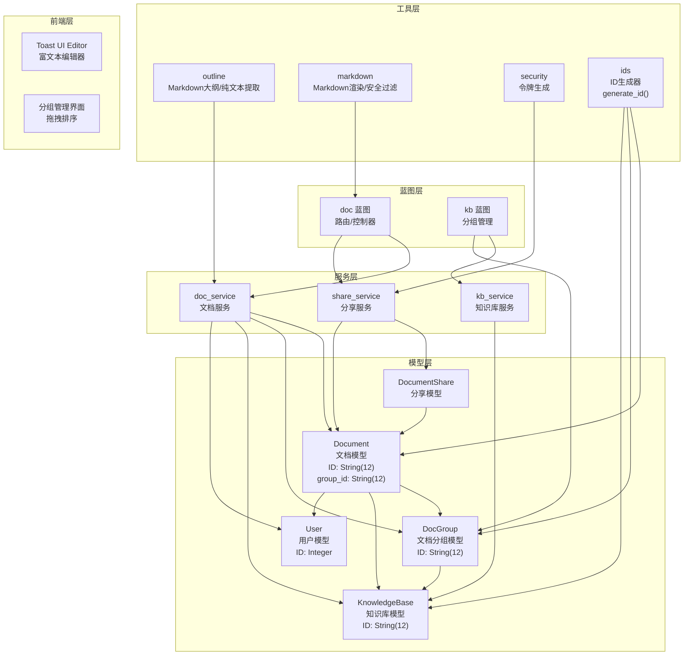
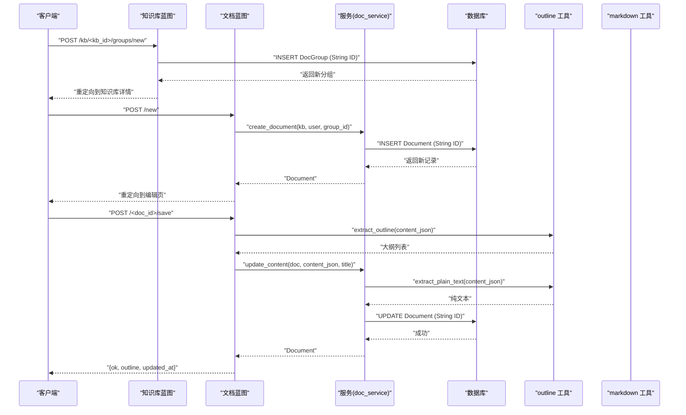
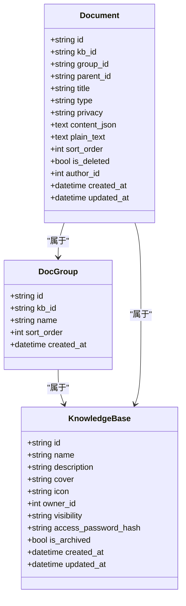
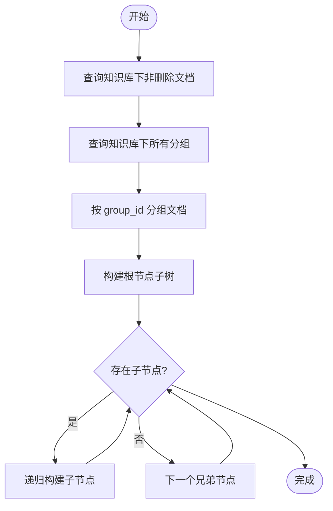
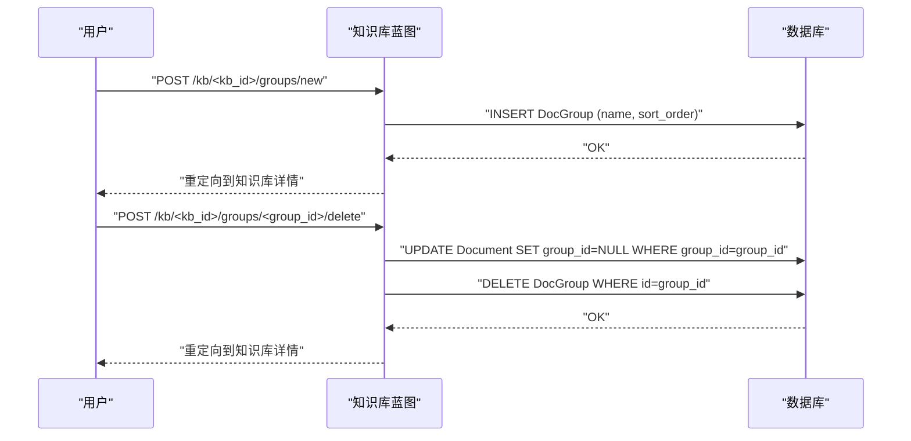
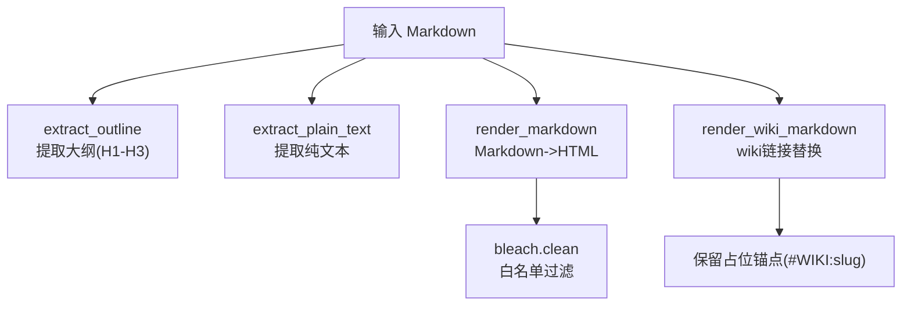
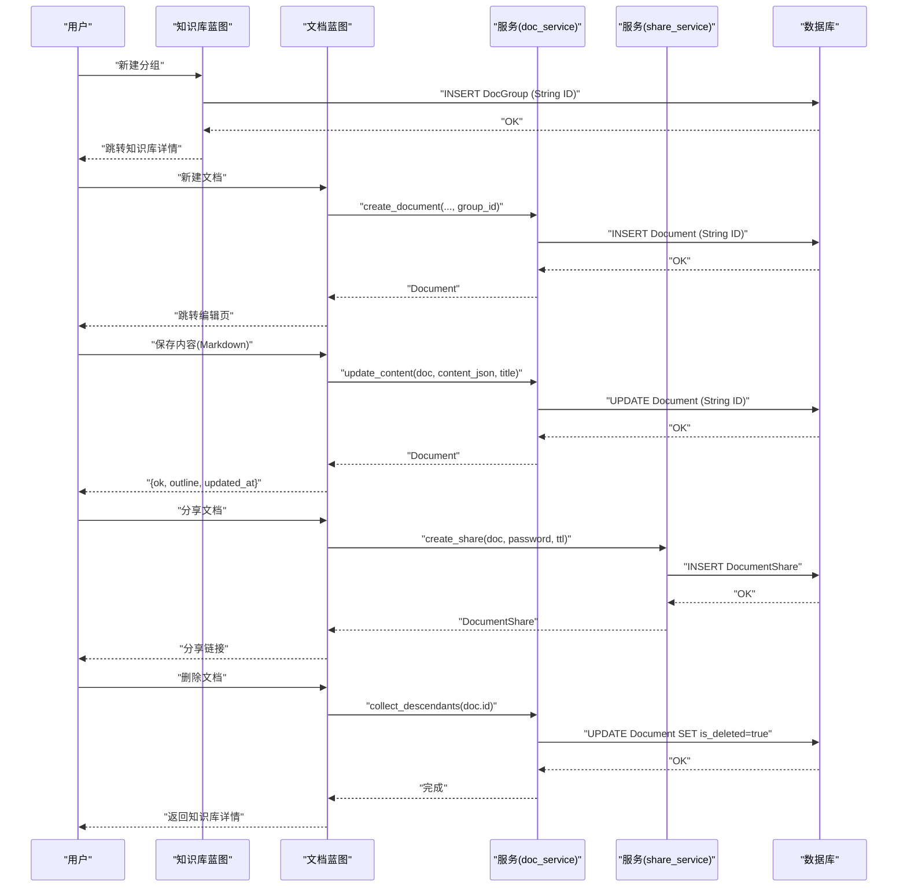
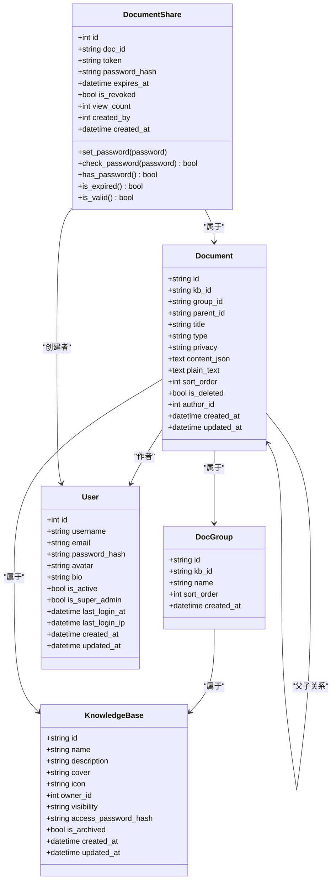

# 文档模型

<cite>
**本文引用的文件**
- [app/models/document.py](file://app/models/document.py)
- [app/models/knowledge_base.py](file://app/models/knowledge_base.py)
- [app/models/user.py](file://app/models/user.py)
- [app/services/doc_service.py](file://app/services/doc_service.py)
- [app/services/kb_service.py](file://app/services/kb_service.py)
- [app/services/share_service.py](file://app/services/share_service.py)
- [app/utils/ids.py](file://app/utils/ids.py)
- [app/utils/outline.py](file://app/utils/outline.py)
- [app/utils/markdown.py](file://app/utils/markdown.py)
- [app/utils/security.py](file://app/utils/security.py)
- [app/blueprints/doc.py](file://app/blueprints/doc.py)
- [app/blueprints/kb.py](file://app/blueprints/kb.py)
- [app/templates/doc/edit.html](file://app/templates/doc/edit.html)
- [app/templates/doc/view.html](file://app/templates/doc/view.html)
- [app/templates/kb/detail.html](file://app/templates/kb/detail.html)
</cite>

## 更新摘要
**所做更改**
- 新增DocGroup模型用于文档分组管理
- 在Document模型中添加group_id字段建立与DocGroup的关联
- 更新文档树构建逻辑以支持分组显示
- 新增分组管理的蓝图路由和前端界面
- 更新文档生命周期处理以支持分组操作

## 目录
1. [简介](#简介)
2. [项目结构](#项目结构)
3. [核心组件](#核心组件)
4. [架构总览](#架构总览)
5. [详细组件分析](#详细组件分析)
6. [依赖关系分析](#依赖关系分析)
7. [性能考虑](#性能考虑)
8. [故障排除指南](#故障排除指南)
9. [结论](#结论)

## 简介
本文件面向"文档模型"的数据模型与业务流程，聚焦以下目标：
- 深入解释 Document 数据模型的字段定义、数据类型与业务规则
- 解释DocGroup分组模型与文档组织机制
- 解释文档的父子关系建模（文档树结构）与层级关系维护
- 提供文档版本控制机制的设计说明（版本历史、差异比较、回滚）
- 解释文档的搜索索引字段、标签系统与分类机制
- 包含文档的富文本内容存储、Markdown 渲染与内容安全处理
- 展示文档从创建、编辑、发布到删除的完整生命周期数据处理流程

**更新** 本版本新增了DocGroup分组模型，支持文档的层次化组织管理，提升了文档系统的可管理性和用户体验。

## 项目结构
围绕文档模型的关键模块与职责如下：
- 模型层：定义数据库表结构与关系（Document、DocGroup、DocumentShare、KnowledgeBase、User）
- 服务层：封装业务逻辑（文档树构建、内容更新、软删除、分享管理、分组管理）
- 工具层：内容解析与渲染（Markdown内容解析、纯文本提取、Markdown渲染与安全过滤、ID生成）
- 蓝图层：路由与控制器（文档 CRUD、分组管理、分享、大纲提取）
- 前端层：Toast UI Editor富文本编辑器集成和分组管理界面

**图表来源**
- [app/models/document.py:11-25](file://app/models/document.py#L11-L25)
- [app/models/document.py:37-72](file://app/models/document.py#L37-L72)
- [app/models/knowledge_base.py:22-41](file://app/models/knowledge_base.py#L22-L41)
- [app/utils/ids.py:14-20](file://app/utils/ids.py#L14-L20)
- [app/services/doc_service.py:11-72](file://app/services/doc_service.py#L11-L72)
- [app/services/kb_service.py:1-115](file://app/services/kb_service.py#L1-L115)

**章节来源**
- [app/models/document.py:1-130](file://app/models/document.py#L1-L130)
- [app/models/knowledge_base.py:1-82](file://app/models/knowledge_base.py#L1-L82)
- [app/models/user.py:1-104](file://app/models/user.py#L1-L104)
- [app/services/doc_service.py:1-130](file://app/services/doc_service.py#L1-L130)
- [app/services/kb_service.py:1-115](file://app/services/kb_service.py#L1-L115)
- [app/services/share_service.py:1-49](file://app/services/share_service.py#L1-L49)
- [app/utils/ids.py:1-21](file://app/utils/ids.py#L1-L21)

## 核心组件
本节聚焦 Document 数据模型及其相关实体的字段、类型与业务规则。

- DocGroup（文档分组）
  - 字段与类型
    - id: 字符串，长度12，主键，使用`generate_id()`函数生成
    - kb_id: 字符串，长度12，外键指向知识库，级联删除；非空，建立索引
    - name: 字符串，最大长度 128，默认"未命名分组"，非空
    - sort_order: 整数，默认 0，非空
    - created_at: 时间戳，默认当前时间，非空
  - 关系
    - belongs to KnowledgeBase
  - 属性
    - 用于组织文档的分组容器

- Document（文档）
  - 字段与类型
    - id: 字符串，长度12，主键，使用`generate_id()`函数生成
    - kb_id: 字符串，长度12，外键指向知识库，级联删除；非空，建立索引
    - group_id: 字符串，长度12，外键指向DocGroup，设置为 NULL 的级联行为；建立索引
    - parent_id: 字符串，长度12，自引用外键，指向 documents.id；设置为 NULL 的级联行为；建立索引
    - title: 字符串，最大长度 255，默认"未命名"，非空
    - type: 字符串，枚举值，支持"doc""sheet"，默认"doc"，非空
    - privacy: 字符串，枚举值，支持"normal""private"，默认"normal"，非空，建立索引
    - content_json: 文本，**更新**：现在存储Markdown字符串而非Editor.js JSON内容，用于富文本存储
    - plain_text: 文本，纯文本表示，用于搜索与 AI 索引
    - sort_order: 整数，默认 0，非空
    - is_deleted: 布尔，默认 False，非空，建立索引
    - author_id: 整数，外键指向用户，设置为 NULL 的级联行为；建立索引
    - created_at/updated_at: 时间戳，默认当前时间，更新时自动刷新
  - 关系
    - belongs to KnowledgeBase
    - belongs to DocGroup
    - belongs to User（作者）
    - 自引用 parent/children（一对多）
  - 属性
    - can_be_shared：当隐私为"normal"时可分享

- DocumentShare（文档分享）
  - 字段与类型
    - id: 整数，主键
    - doc_id: 字符串，长度12，外键 documents.id，级联删除；非空，建立索引
    - token: 字符串，唯一且非空，建立索引
    - password_hash: 字符串，可空（无密码时为 NULL）
    - expires_at: 时间戳，可空
    - is_revoked: 布尔，默认 False，非空
    - view_count: 整数，默认 0，非空
    - created_by: 整数，外键 users.id，设置为 NULL 的级联行为；建立索引
    - created_at: 时间戳，默认当前时间，非空
  - 关系
    - belongs to Document
    - belongs to User（创建者）
  - 方法与属性
    - set_password/password_hash/check_password：密码哈希设置与校验
    - has_password：是否存在密码
    - is_expired/is_valid：过期与有效性判断

- KnowledgeBase（知识库）
  - 字段与类型
    - id: 字符串，长度12，主键，使用`generate_id()`函数生成
    - name: 字符串，最大长度 128
    - description: 字符串，最大长度 500
    - cover: 字符串，最大长度 255
    - icon: 字符串，最大长度 32
    - owner_id: 整数，外键 users.id，级联删除；非空，建立索引
    - visibility: 字符串，枚举值，支持"private""members""public"
    - access_password_hash: 字符串，可空（无密码时为 NULL）
    - is_archived: 布尔，默认 False，非空
    - created_at/updated_at: 时间戳，默认当前时间，更新时自动刷新
  - 关系
    - belongs to User（所有者）

- 枚举
  - DocumentType：DOC/SHEET
  - DocumentPrivacy：NORMAL/PRIVATE
  - KBVisibility：PRIVATE/MEMBERS/PUBLIC
  - KBMemberRole：VIEWER/EDITOR

**章节来源**
- [app/models/document.py:11-25](file://app/models/document.py#L11-L25)
- [app/models/document.py:37-72](file://app/models/document.py#L37-L72)
- [app/models/knowledge_base.py:22-62](file://app/models/knowledge_base.py#L22-L62)

## 架构总览
文档模型的端到端数据流如下：
- 创建：用户通过蓝图提交创建请求，服务层创建 Document 记录并持久化
- 编辑：用户使用 Toast UI Editor 编辑Markdown内容，服务层解析并生成纯文本，更新记录
- 查看：蓝图加载文档、知识库、文档树与大纲，渲染视图
- 分组管理：支持创建、重命名、删除分组，以及文档在分组间的移动
- 分享：服务层生成分享令牌与有效期，支持密码保护
- 删除：软删除文档及其所有后代节点

**更新** 新增了DocGroup分组模型，支持文档的层次化组织管理，所有查询和操作现在使用字符串ID进行。

**图表来源**
- [app/blueprints/kb.py:175-187](file://app/blueprints/kb.py#L175-L187)
- [app/blueprints/doc.py:57-79](file://app/blueprints/doc.py#L57-L79)
- [app/services/doc_service.py:84-102](file://app/services/doc_service.py#L84-L102)
- [app/utils/outline.py:69-90](file://app/utils/outline.py#L69-L90)

## 详细组件分析

### DocGroup分组模型
**新增** DocGroup模型用于文档的分组管理。

- 设计要点
  - 作为DocGroup表的ORM映射，提供文档分组的基本功能
  - 通过kb_id与KnowledgeBase建立多对一关系
  - 通过sort_order字段控制分组的显示顺序
- 关系映射
  - DocGroup -> KnowledgeBase：一个知识库可以包含多个分组
  - DocGroup -> Document：一个分组可以包含多个文档
  - Document -> DocGroup：一个文档只能属于一个分组（或无分组）

**图表来源**
- [app/models/document.py:11-25](file://app/models/document.py#L11-L25)
- [app/models/document.py:37-72](file://app/models/document.py#L37-L72)
- [app/models/knowledge_base.py:22-41](file://app/models/knowledge_base.py#L22-L41)

**章节来源**
- [app/models/document.py:11-25](file://app/models/document.py#L11-L25)

### 文档树结构与分组组织
**更新** 文档树构建现在支持分组显示。

- 设计要点
  - 使用 parent_id 实现自引用外键，形成文档树
  - 通过 group_id 将文档分配到对应的分组
  - 通过排序字段 sort_order 与层级顺序控制显示顺序
  - 查询时按"是否为根节点优先、sort_order 升序、id 升序"排序
- 树构建算法
  - 将文档按 parent_id 分组，递归构建嵌套列表
  - 按分组聚合文档：未分组文档和每个分组内的文档
  - 非删除文档参与树构建
- 后代收集
  - 支持广度优先遍历收集所有后代 ID（含自身），用于批量软删除

**图表来源**
- [app/services/doc_service.py:11-72](file://app/services/doc_service.py#L11-L72)

**章节来源**
- [app/services/doc_service.py:11-72](file://app/services/doc_service.py#L11-L72)

### 分组管理功能
**新增** 完整的分组管理功能，包括创建、重命名、删除和文档移动。

- 分组创建
  - 通过知识库蓝图的new_group路由处理
  - 自动生成最大排序号，确保新分组在末尾显示
  - 支持默认名称"未命名分组"
- 分组重命名
  - 通过rename_group路由处理
  - 验证分组归属知识库，防止跨知识库操作
- 分组删除
  - 通过delete_group路由处理
  - 删除前将分组内文档移回"未分组"
- 文档移动
  - 通过move_doc_to_group路由处理
  - 支持拖拽操作和JSON/表单两种提交方式
  - 验证目标分组归属知识库

**图表来源**
- [app/blueprints/kb.py:175-187](file://app/blueprints/kb.py#L175-L187)
- [app/blueprints/kb.py:205-217](file://app/blueprints/kb.py#L205-L217)

**章节来源**
- [app/blueprints/kb.py:175-241](file://app/blueprints/kb.py#L175-L241)

### Markdown内容存储与渲染
**更新** 内容存储格式已从Editor.js JSON迁移到Markdown字符串。

- Markdown 存储
  - content_json 字段现在存储原始Markdown字符串
  - 通过 outline 工具提取纯文本与大纲，用于搜索与导航
  - 前端使用 Toast UI Editor 进行富文本编辑，但最终保存为Markdown
- 大纲提取与纯文本处理
  - extract_outline：从Markdown提取 H1-H3 标题，生成大纲列表
  - extract_plain_text：去除Markdown标记，生成纯文本（用于搜索/AI）
  - 基于正则表达式的解析，支持标题、列表、表格、代码块等格式
- Markdown 渲染与安全过滤
  - render_markdown：将 Markdown 转 HTML，并使用 bleach 进行白名单过滤
  - render_wiki_markdown：支持 wiki 链接替换，保留占位锚点以便路由层重写
  - collect_wikilinks：提取 wiki 链接目标
- 内容安全
  - 仅允许特定 HTML 标签与属性，避免 XSS
  - 对图片、表格、代码块等进行结构化处理

**图表来源**
- [app/utils/outline.py:69-90](file://app/utils/outline.py#L69-L90)
- [app/utils/outline.py:93-137](file://app/utils/outline.py#L93-L137)
- [app/utils/outline.py:34-55](file://app/utils/outline.py#L34-L55)
- [app/utils/markdown.py:31-39](file://app/utils/markdown.py#L31-L39)
- [app/utils/markdown.py:42-66](file://app/utils/markdown.py#L42-L66)

**章节来源**
- [app/utils/outline.py:1-143](file://app/utils/outline.py#L1-L143)
- [app/utils/markdown.py:1-87](file://app/utils/markdown.py#L1-L87)

### 版本控制机制设计
- 当前实现
  - 文档模型未提供显式的版本历史记录字段或版本表
  - 更新内容时直接覆盖 content_json 与 plain_text
- 设计建议（扩展方向）
  - 新增版本表（如 DocumentVersion），包含文档 ID、快照 Markdown、摘要、作者、创建时间
  - 提供差异比较（diff）与回滚接口（基于版本号）
  - 引入"草稿/发布"状态机，配合权限控制
- 影响范围
  - 若引入版本表，需同步调整服务层与蓝图层的保存逻辑
  - 大纲与纯文本提取仍可沿用现有工具

**章节来源**
- [app/models/document.py:49-52](file://app/models/document.py#L49-L52)
- [app/services/doc_service.py:105-111](file://app/services/doc_service.py#L105-L111)

### 搜索索引、标签与分类
- 搜索索引字段
  - plain_text：由 Markdown 内容解析生成，适合全文检索与 AI 索引
- 标签系统
  - 代码中未发现显式标签字段或标签表
  - 可通过 wiki 链接或富文本中的分类标记实现弱分类
- 分类机制
  - 文档类型 type 支持"doc/sheet"，可用于简单分类
  - 知识库 knowledge_base 提供更宏观的分类维度
  - **新增** DocGroup提供细粒度的文档分类和组织

**章节来源**
- [app/models/document.py:49-52](file://app/models/document.py#L49-L52)
- [app/models/document.py:45-47](file://app/models/document.py#L45-L47)
- [app/models/knowledge_base.py:19-42](file://app/models/knowledge_base.py#L19-L42)

### 生命周期数据处理流程
**更新** 编辑流程已从Editor.js JSON转换为直接的Markdown字符串处理，ID类型从整数改为字符串，新增分组管理。

- 创建
  - 蓝图接收参数（知识库、父节点、类型、隐私、标题、分组），调用服务层创建
  - 默认 content_json 与 plain_text 为空字符串
  - 使用`generate_id()`生成12字符字符串ID
- 编辑
  - 接收 Toast UI Editor 生成的 Markdown，更新标题、Markdown与纯文本
  - **新增** 支持更新文档分组设置
  - 重新计算大纲并返回
- 分组管理
  - **新增** 支持创建、重命名、删除分组
  - **新增** 支持文档在分组间的移动
- 发布/分享
  - 仅当隐私为"normal"时允许分享
  - 生成 token，可选密码与过期时间
- 删除
  - 软删除：将 is_deleted 标记为 True
  - 批量删除：收集所有后代 ID 并一并软删除

**图表来源**
- [app/blueprints/kb.py:175-187](file://app/blueprints/kb.py#L175-L187)
- [app/blueprints/doc.py:57-79](file://app/blueprints/doc.py#L57-L79)
- [app/blueprints/doc.py:111-135](file://app/blueprints/doc.py#L111-L135)
- [app/blueprints/doc.py:154-175](file://app/blueprints/doc.py#L154-L175)
- [app/services/doc_service.py:84-102](file://app/services/doc_service.py#L84-L102)
- [app/services/doc_service.py:119-129](file://app/services/doc_service.py#L119-L129)
- [app/services/share_service.py:15-31](file://app/services/share_service.py#L15-L31)

**章节来源**
- [app/blueprints/doc.py:1-190](file://app/blueprints/doc.py#L1-L190)
- [app/blueprints/kb.py:175-241](file://app/blueprints/kb.py#L175-L241)
- [app/services/doc_service.py:1-130](file://app/services/doc_service.py#L1-L130)
- [app/services/share_service.py:1-49](file://app/services/share_service.py#L1-L49)

### 前端编辑器集成
**新增** 详细的前端编辑器实现说明，包括分组管理界面。

- Toast UI Editor 集成
  - 使用 toastui.Editor 进行富文本编辑
  - 支持 Markdown + WYSIWYG 双模式编辑
  - 集成中文本地化支持
- 编辑器初始化
  - 从数据库加载 Markdown 内容作为初始值
  - 配置编辑器高度、预览样式、占位符等参数
- 保存流程
  - 通过 editor.getMarkdown() 获取当前编辑的Markdown
  - 发送 POST 请求到 /save 接口
  - 更新标题、Markdown内容、隐私设置和分组设置
- 分组管理界面
  - **新增** 在编辑页面显示分组下拉框
  - **新增** 支持实时更新文档分组
  - **新增** 知识库详情页支持分组的创建、重命名、删除操作
  - **新增** 支持拖拽文档到不同分组进行移动

**章节来源**
- [app/templates/doc/edit.html:28-35](file://app/templates/doc/edit.html#L28-L35)
- [app/templates/doc/edit.html:176-177](file://app/templates/doc/edit.html#L176-L177)
- [app/templates/kb/detail.html:56-68](file://app/templates/kb/detail.html#L56-L68)
- [app/templates/kb/detail.html:85-108](file://app/templates/kb/detail.html#L85-L108)

## 依赖关系分析
- 模型间依赖
  - Document -> KnowledgeBase（多对一）
  - Document -> DocGroup（多对一）
  - Document -> User（作者，多对一）
  - Document -> Document（父子关系，一对多）
  - DocumentShare -> Document（多对一）
  - DocumentShare -> User（创建者，多对一）
  - DocGroup -> KnowledgeBase（多对一）
- 服务层依赖
  - doc_service 依赖 outline 工具（纯文本与大纲提取）
  - share_service 依赖 security 工具（令牌生成）
  - kb_service 依赖知识库模型（权限验证）
- 蓝图层依赖
  - doc 蓝图依赖 kb_service、doc_service、share_service（权限与业务逻辑）
  - kb 蓝图依赖 kb_service、doc_service（分组管理）
  - 使用 outline 工具生成大纲
- 前端依赖
  - 编辑器依赖 Toast UI Editor 库
  - 分组管理依赖 Alpine.js 框架
  - 需要正确的CDN资源加载

**图表来源**
- [app/models/document.py:11-25](file://app/models/document.py#L11-L25)
- [app/models/document.py:37-72](file://app/models/document.py#L37-L72)
- [app/models/knowledge_base.py:22-41](file://app/models/knowledge_base.py#L22-L41)
- [app/models/user.py:58](file://app/models/user.py#L58)

**章节来源**
- [app/models/document.py:1-130](file://app/models/document.py#L1-L130)
- [app/models/knowledge_base.py:1-82](file://app/models/knowledge_base.py#L1-L82)
- [app/models/user.py:1-104](file://app/models/user.py#L1-L104)

## 性能考虑
- 索引策略
  - 文档表对 kb_id、group_id、parent_id、privacy、is_deleted 建有索引，有利于树查询与筛选
  - **新增** DocGroup表对kb_id、sort_order建立索引，优化分组查询
  - 建议在 content_json 上根据需要评估全文索引（取决于搜索引擎集成）
- 查询优化
  - 树构建采用一次全量查询 + 内存分组 + 递归构建，适合中小规模文档树
  - 大规模场景可考虑物化路径或邻接列表优化
  - **新增** 分组查询采用分组聚合策略，减少重复查询
- 存储与传输
  - **更新** 字符串ID相比整数ID略增加存储开销，但提供更好的URL可读性和安全性
  - **新增** DocGroup表相对较小，索引开销可控
  - Markdown字符串通常比Editor.js JSON更紧凑，减少存储空间占用
  - 纯文本提取与渲染在服务端执行，注意缓存与异步处理
- 前端性能
  - Toast UI Editor 使用 -all 一体化版本，虽然包体积较大但避免了依赖加载问题
  - **新增** 分组管理界面使用Alpine.js，轻量级响应式框架

## 故障排除指南
- 分享失败
  - 私密文档不可分享：检查 privacy 是否为"normal"
  - 令牌冲突：确保 token 唯一性
  - 过期或撤销：确认 is_valid 条件
- 内容渲染异常
  - **更新** Markdown 渲染后出现不安全标签：检查白名单配置
  - 大纲为空：确认 Markdown 中包含 H1-H3 标题
  - 编辑器加载失败：检查 toastui-editor-all.min.js 是否正确加载
- 删除问题
  - 删除后仍可见：确认 is_deleted 状态与查询条件
  - 误删子节点：使用 collect_descendants 确认影响范围
- 编辑器问题
  - **新增** Toast UI Editor 未定义：检查网络面板中静态资源是否加载成功
  - 编辑器容器找不到：确认 #editor 容器存在且具有明确高度
- 分组管理问题
  - **新增** 分组创建失败：检查用户权限和分组名称
  - **新增** 文档移动失败：确认目标分组归属知识库和文档状态
  - **新增** 分组重命名无效：检查分组归属和名称有效性
- ID相关问题
  - **新增** 字符串ID处理错误：确认服务层和蓝图层的类型注解正确
  - **新增** 外键关联失败：检查字符串ID的格式和长度
  - **新增** 分组外键约束：确认group_id引用的有效性

**章节来源**
- [app/services/share_service.py:17-18](file://app/services/share_service.py#L17-L18)
- [app/services/share_service.py:39-43](file://app/services/share_service.py#L39-L43)
- [app/utils/markdown.py:10-25](file://app/utils/markdown.py#L10-L25)
- [app/utils/outline.py:69-90](file://app/utils/outline.py#L69-L90)
- [app/services/doc_service.py:119-129](file://app/services/doc_service.py#L119-L129)
- [app/blueprints/kb.py:175-187](file://app/blueprints/kb.py#L175-L187)
- [app/blueprints/kb.py:205-217](file://app/blueprints/kb.py#L205-L217)

## 结论
本文档模型以轻量方式实现了文档树、富文本存储与分享能力，并新增了DocGroup分组管理功能。**更新后的核心优势**在于：
- 明确的父子关系与排序字段，便于构建层级结构
- **更新** 字符串ID + 纯文本提取，兼顾富文本与检索需求，相比Editor.js JSON更高效
- **新增** DocGroup分组模型，支持文档的层次化组织管理
- 安全渲染与白名单过滤，降低 XSS 风险
- 分享令牌与有效期控制，满足开放协作场景
- **新增** URL友好的字符串ID，提高安全性并改善URL可读性
- **新增** 自定义ID生成器，基于安全随机数的12字符ID
- **新增** 完整的分组管理功能，包括创建、重命名、删除和文档移动

**扩展建议**：
- 引入版本表与差异比较，完善版本控制
- 增加标签与分类字段，提升检索与组织能力
- 在大规模场景下优化树查询与存储结构
- 考虑引入内容缓存机制以提升渲染性能
- 评估字符串ID对数据库索引性能的影响
- **新增** 考虑分组的嵌套结构，支持更复杂的文档组织