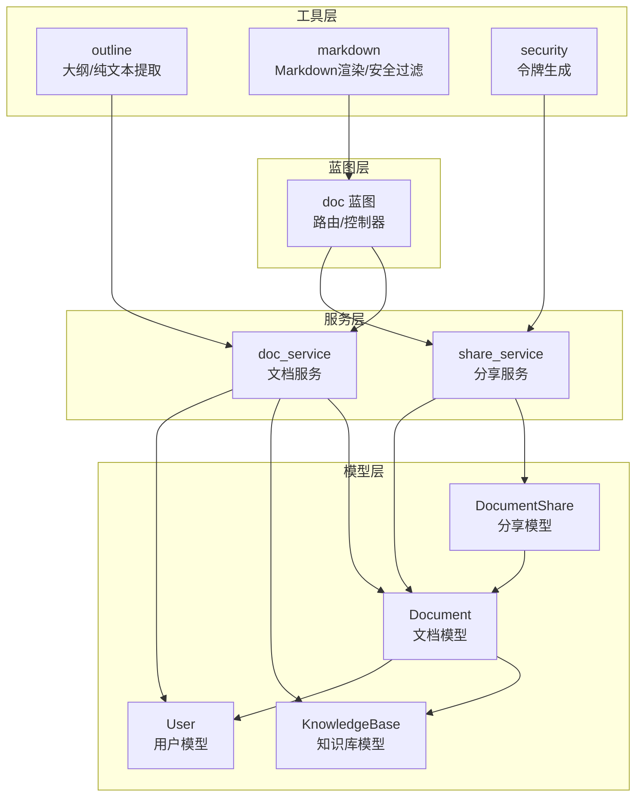
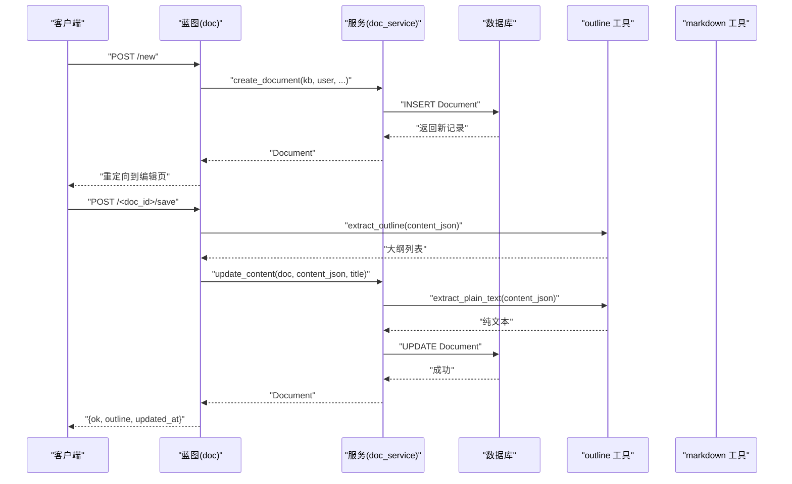
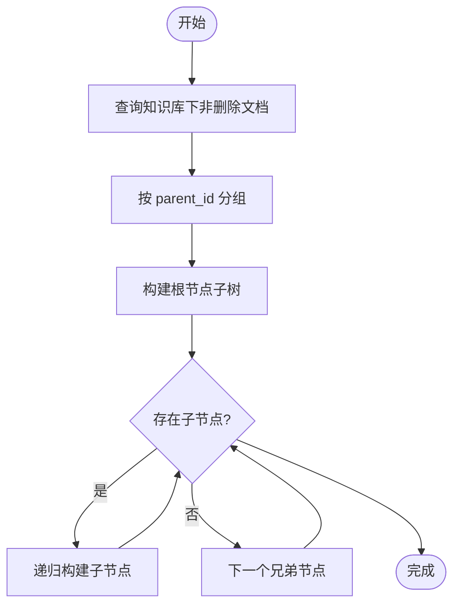
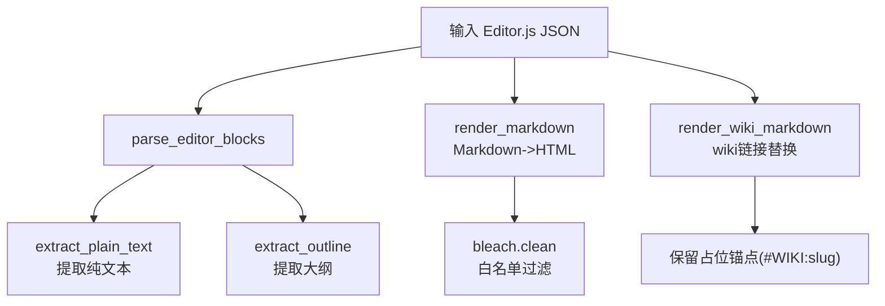
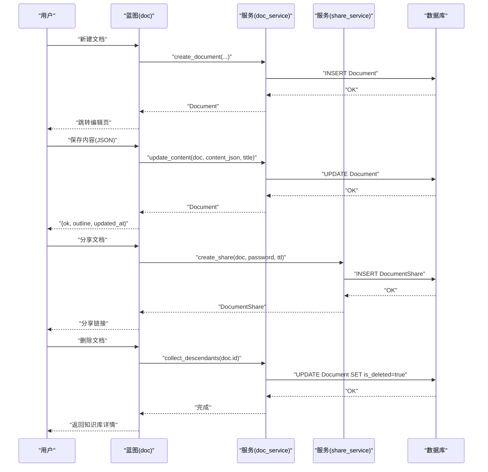
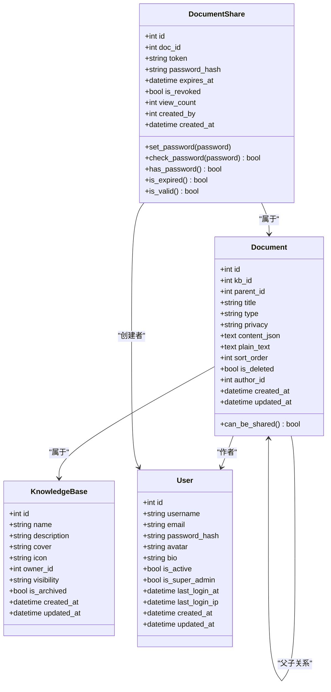

# 文档模型

<cite>
**本文引用的文件**
- [app/models/document.py](file://app/models/document.py)
- [app/services/doc_service.py](file://app/services/doc_service.py)
- [app/services/share_service.py](file://app/services/share_service.py)
- [app/utils/outline.py](file://app/utils/outline.py)
- [app/utils/markdown.py](file://app/utils/markdown.py)
- [app/utils/security.py](file://app/utils/security.py)
- [app/blueprints/doc.py](file://app/blueprints/doc.py)
- [app/models/knowledge_base.py](file://app/models/knowledge_base.py)
- [app/models/user.py](file://app/models/user.py)
- [app/config.py](file://app/config.py)
- [app/extensions.py](file://app/extensions.py)
</cite>

## 目录
1. [简介](#简介)
2. [项目结构](#项目结构)
3. [核心组件](#核心组件)
4. [架构总览](#架构总览)
5. [详细组件分析](#详细组件分析)
6. [依赖关系分析](#依赖关系分析)
7. [性能考虑](#性能考虑)
8. [故障排除指南](#故障排除指南)
9. [结论](#结论)

## 简介
本文件面向“文档模型”的数据模型与业务流程，聚焦以下目标：
- 深入解释 Document 数据模型的字段定义、数据类型与业务规则
- 解释文档的父子关系建模（文档树结构）与层级关系维护
- 提供文档版本控制机制的设计说明（版本历史、差异比较、回滚）
- 解释文档的搜索索引字段、标签系统与分类机制
- 包含文档的富文本内容存储、Markdown 渲染与内容安全处理
- 展示文档从创建、编辑、发布到删除的完整生命周期数据处理流程

## 项目结构
围绕文档模型的关键模块与职责如下：
- 模型层：定义数据库表结构与关系（Document、DocumentShare、KnowledgeBase、User）
- 服务层：封装业务逻辑（文档树构建、内容更新、软删除、分享管理）
- 工具层：内容解析与渲染（Editor.js 内容解析、纯文本提取、Markdown 渲染与安全过滤）
- 蓝图层：路由与控制器（文档 CRUD、分享、大纲提取）

图表来源
- [app/models/document.py:20-53](file://app/models/document.py#L20-L53)
- [app/models/knowledge_base.py:19-42](file://app/models/knowledge_base.py#L19-L42)
- [app/models/user.py:55-103](file://app/models/user.py#L55-L103)
- [app/services/doc_service.py:11-34](file://app/services/doc_service.py#L11-L34)
- [app/services/share_service.py:15-31](file://app/services/share_service.py#L15-L31)
- [app/utils/outline.py:34-55](file://app/utils/outline.py#L34-L55)
- [app/utils/markdown.py:31-39](file://app/utils/markdown.py#L31-L39)
- [app/utils/security.py:5-7](file://app/utils/security.py#L5-L7)
- [app/blueprints/doc.py:20-40](file://app/blueprints/doc.py#L20-L40)

章节来源
- [app/models/document.py:1-98](file://app/models/document.py#L1-L98)
- [app/services/doc_service.py:1-81](file://app/services/doc_service.py#L1-L81)
- [app/services/share_service.py:1-49](file://app/services/share_service.py#L1-L49)
- [app/utils/outline.py:1-136](file://app/utils/outline.py#L1-L136)
- [app/utils/markdown.py:1-87](file://app/utils/markdown.py#L1-L87)
- [app/utils/security.py:1-8](file://app/utils/security.py#L1-L8)
- [app/blueprints/doc.py:1-139](file://app/blueprints/doc.py#L1-L139)

## 核心组件
本节聚焦 Document 数据模型及其相关实体的字段、类型与业务规则。

- Document（文档）
  - 字段与类型
    - id: 整数，主键
    - kb_id: 整数，外键指向知识库，级联删除；非空，建立索引
    - parent_id: 整数，自引用外键，指向 documents.id；设置为 NULL 的级联行为；建立索引
    - title: 字符串，最大长度 255，默认“未命名”，非空
    - type: 字符串，枚举值，支持“doc”“sheet”，默认“doc”，非空
    - privacy: 字符串，枚举值，支持“normal”“private”，默认“normal”，非空，建立索引
    - content_json: 文本，Editor.js JSON 内容，用于富文本存储
    - plain_text: 文本，纯文本表示，用于搜索与 AI 索引
    - sort_order: 整数，默认 0，非空
    - is_deleted: 布尔，默认 False，非空，建立索引
    - author_id: 整数，外键指向用户，设置为 NULL 的级联行为；建立索引
    - created_at/updated_at: 时间戳，默认当前时间，更新时自动刷新
  - 关系
    - belongs to KnowledgeBase
    - belongs to User（作者）
    - 自引用 parent/children（一对多）
  - 属性
    - can_be_shared：当隐私为“normal”时可分享

- DocumentShare（文档分享）
  - 字段与类型
    - id: 整数，主键
    - doc_id: 整数，外键 documents.id，级联删除；非空，建立索引
    - token: 字符串，唯一且非空，建立索引
    - password_hash: 字符串，可空（无密码时为 NULL）
    - expires_at: 时间戳，可空
    - is_revoked: 布尔，默认 False，非空
    - view_count: 整数，默认 0，非空
    - created_by: 整数，外键 users.id，设置为 NULL 的级联行为；建立索引
    - created_at: 时间戳，默认当前时间，非空
  - 关系
    - belongs to Document
    - belongs to User（创建者）
  - 方法与属性
    - set_password/password_hash/check_password：密码哈希设置与校验
    - has_password：是否存在密码
    - is_expired/is_valid：过期与有效性判断

- 枚举
  - DocumentType：DOC/SHEET
  - DocumentPrivacy：NORMAL/PRIVATE

章节来源
- [app/models/document.py:10-53](file://app/models/document.py#L10-L53)
- [app/models/document.py:56-97](file://app/models/document.py#L56-L97)

## 架构总览
文档模型的端到端数据流如下：
- 创建：用户通过蓝图提交创建请求，服务层创建 Document 记录并持久化
- 编辑：用户提交 Editor.js JSON，服务层解析并生成纯文本，更新记录
- 查看：蓝图加载文档、知识库、文档树与大纲，渲染视图
- 分享：服务层生成分享令牌与有效期，支持密码保护
- 删除：软删除文档及其所有后代节点

图表来源
- [app/blueprints/doc.py:20-40](file://app/blueprints/doc.py#L20-L40)
- [app/blueprints/doc.py:69-84](file://app/blueprints/doc.py#L69-L84)
- [app/services/doc_service.py:37-53](file://app/services/doc_service.py#L37-L53)
- [app/services/doc_service.py:56-62](file://app/services/doc_service.py#L56-L62)
- [app/utils/outline.py:34-55](file://app/utils/outline.py#L34-L55)

## 详细组件分析

### 文档树结构与层级关系
- 设计要点
  - 使用 parent_id 实现自引用外键，形成文档树
  - 通过排序字段 sort_order 与层级顺序控制显示顺序
  - 查询时按“是否为根节点优先、sort_order 升序、id 升序”排序
- 树构建算法
  - 将文档按 parent_id 分组，递归构建嵌套列表
  - 非删除文档参与树构建
- 后代收集
  - 支持广度优先遍历收集所有后代 ID（含自身），用于批量软删除

图表来源
- [app/services/doc_service.py:11-34](file://app/services/doc_service.py#L11-L34)
- [app/services/doc_service.py:70-80](file://app/services/doc_service.py#L70-L80)

章节来源
- [app/services/doc_service.py:11-34](file://app/services/doc_service.py#L11-L34)
- [app/services/doc_service.py:70-80](file://app/services/doc_service.py#L70-L80)

### 富文本内容存储与渲染
- Editor.js JSON 存储
  - content_json 字段保存 Editor.js 的 blocks 结构
  - 通过 outline 工具提取纯文本与大纲，用于搜索与导航
- Markdown 渲染与安全过滤
  - render_markdown：将 Markdown 转 HTML，并使用 bleach 进行白名单过滤
  - render_wiki_markdown：支持 wiki 链接替换，保留占位锚点以便路由层重写
  - collect_wikilinks：提取 wiki 链接目标
- 内容安全
  - 仅允许特定 HTML 标签与属性，避免 XSS
  - 对图片、表格、代码块等进行结构化处理

图表来源
- [app/utils/outline.py:22-31](file://app/utils/outline.py#L22-L31)
- [app/utils/outline.py:58-87](file://app/utils/outline.py#L58-L87)
- [app/utils/outline.py:34-55](file://app/utils/outline.py#L34-L55)
- [app/utils/markdown.py:31-39](file://app/utils/markdown.py#L31-L39)
- [app/utils/markdown.py:42-66](file://app/utils/markdown.py#L42-L66)

章节来源
- [app/utils/outline.py:1-136](file://app/utils/outline.py#L1-L136)
- [app/utils/markdown.py:1-87](file://app/utils/markdown.py#L1-L87)

### 版本控制机制设计
- 当前实现
  - 文档模型未提供显式的版本历史记录字段或版本表
  - 更新内容时直接覆盖 content_json 与 plain_text
- 设计建议（扩展方向）
  - 新增版本表（如 DocumentVersion），包含文档 ID、快照 JSON、摘要、作者、创建时间
  - 提供差异比较（diff）与回滚接口（基于版本号）
  - 引入“草稿/发布”状态机，配合权限控制
- 影响范围
  - 若引入版本表，需同步调整服务层与蓝图层的保存逻辑
  - 大纲与纯文本提取仍可沿用现有工具

章节来源
- [app/models/document.py:31-34](file://app/models/document.py#L31-L34)
- [app/services/doc_service.py:56-62](file://app/services/doc_service.py#L56-L62)

### 搜索索引、标签与分类
- 搜索索引字段
  - plain_text：由 Editor.js 内容解析生成，适合全文检索与 AI 索引
- 标签系统
  - 代码中未发现显式标签字段或标签表
  - 可通过 wiki 链接或富文本中的分类标记实现弱分类
- 分类机制
  - 文档类型 type 支持“doc/sheet”，可用于简单分类
  - 知识库 knowledge_base 提供更宏观的分类维度

章节来源
- [app/models/document.py:31-34](file://app/models/document.py#L31-L34)
- [app/models/document.py:27-29](file://app/models/document.py#L27-L29)
- [app/models/knowledge_base.py:19-42](file://app/models/knowledge_base.py#L19-L42)

### 生命周期数据处理流程
- 创建
  - 蓝图接收参数（知识库、父节点、类型、隐私、标题），调用服务层创建
  - 默认 content_json 与 plain_text 为空字符串
- 编辑
  - 接收 Editor.js JSON，更新标题、JSON 与纯文本
  - 重新计算大纲并返回
- 发布/分享
  - 仅当隐私为“normal”时允许分享
  - 生成 token，可选密码与过期时间
- 删除
  - 软删除：将 is_deleted 标记为 True
  - 批量删除：收集所有后代 ID 并一并软删除

图表来源
- [app/blueprints/doc.py:20-40](file://app/blueprints/doc.py#L20-L40)
- [app/blueprints/doc.py:69-84](file://app/blueprints/doc.py#L69-L84)
- [app/blueprints/doc.py:87-100](file://app/blueprints/doc.py#L87-L100)
- [app/blueprints/doc.py:103-124](file://app/blueprints/doc.py#L103-L124)
- [app/services/doc_service.py:37-53](file://app/services/doc_service.py#L37-L53)
- [app/services/doc_service.py:56-62](file://app/services/doc_service.py#L56-L62)
- [app/services/doc_service.py:70-80](file://app/services/doc_service.py#L70-L80)
- [app/services/share_service.py:15-31](file://app/services/share_service.py#L15-L31)

章节来源
- [app/blueprints/doc.py:1-139](file://app/blueprints/doc.py#L1-L139)
- [app/services/doc_service.py:1-81](file://app/services/doc_service.py#L1-L81)
- [app/services/share_service.py:1-49](file://app/services/share_service.py#L1-L49)

## 依赖关系分析
- 模型间依赖
  - Document -> KnowledgeBase（多对一）
  - Document -> User（作者，多对一）
  - Document -> Document（父子关系，一对多）
  - DocumentShare -> Document（多对一）
  - DocumentShare -> User（创建者，多对一）
- 服务层依赖
  - doc_service 依赖 outline 工具（纯文本与大纲提取）
  - share_service 依赖 security 工具（令牌生成）
- 蓝图层依赖
  - doc 蓝图依赖 kb_service、doc_service、share_service（权限与业务逻辑）
  - 使用 outline 工具生成大纲

图表来源
- [app/models/document.py:20-53](file://app/models/document.py#L20-L53)
- [app/models/document.py:56-97](file://app/models/document.py#L56-L97)
- [app/models/knowledge_base.py:19-42](file://app/models/knowledge_base.py#L19-L42)
- [app/models/user.py:55-103](file://app/models/user.py#L55-L103)

章节来源
- [app/models/document.py:1-98](file://app/models/document.py#L1-L98)
- [app/models/knowledge_base.py:1-62](file://app/models/knowledge_base.py#L1-L62)
- [app/models/user.py:1-104](file://app/models/user.py#L1-L104)

## 性能考虑
- 索引策略
  - 文档表对 kb_id、parent_id、privacy、is_deleted 建有索引，有利于树查询与筛选
  - 建议在 content_json 上根据需要评估全文索引（取决于搜索引擎集成）
- 查询优化
  - 树构建采用一次全量查询 + 内存分组 + 递归构建，适合中小规模文档树
  - 大规模场景可考虑物化路径或邻接列表优化
- 存储与传输
  - Editor.js JSON 可能较大，建议在前端分块保存与增量更新
  - 纯文本提取与渲染在服务端执行，注意缓存与异步处理

## 故障排除指南
- 分享失败
  - 私密文档不可分享：检查 privacy 是否为“normal”
  - 令牌冲突：确保 token 唯一性
  - 过期或撤销：确认 is_valid 条件
- 内容渲染异常
  - Markdown 渲染后出现不安全标签：检查白名单配置
  - 大纲为空：确认 Editor.js blocks 中包含 header 类型
- 删除问题
  - 删除后仍可见：确认 is_deleted 状态与查询条件
  - 误删子节点：使用 collect_descendants 确认影响范围

章节来源
- [app/services/share_service.py:17-18](file://app/services/share_service.py#L17-L18)
- [app/services/share_service.py:39-43](file://app/services/share_service.py#L39-L43)
- [app/utils/markdown.py:10-25](file://app/utils/markdown.py#L10-L25)
- [app/utils/outline.py:34-55](file://app/utils/outline.py#L34-L55)
- [app/services/doc_service.py:65-67](file://app/services/doc_service.py#L65-L67)
- [app/services/doc_service.py:70-80](file://app/services/doc_service.py#L70-L80)

## 结论
本文档模型以轻量方式实现了文档树、富文本存储与分享能力。核心优势在于：
- 明确的父子关系与排序字段，便于构建层级结构
- Editor.js JSON + 纯文本提取，兼顾富文本与检索需求
- 安全渲染与白名单过滤，降低 XSS 风险
- 分享令牌与有效期控制，满足开放协作场景

扩展建议：
- 引入版本表与差异比较，完善版本控制
- 增加标签与分类字段，提升检索与组织能力
- 在大规模场景下优化树查询与存储结构