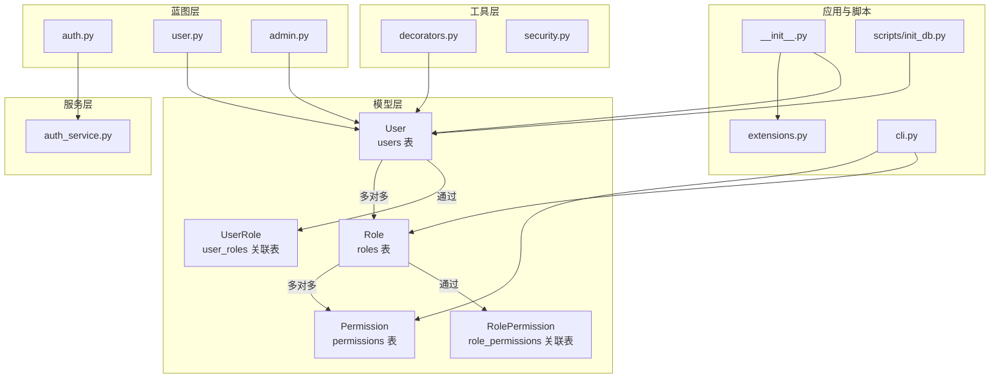
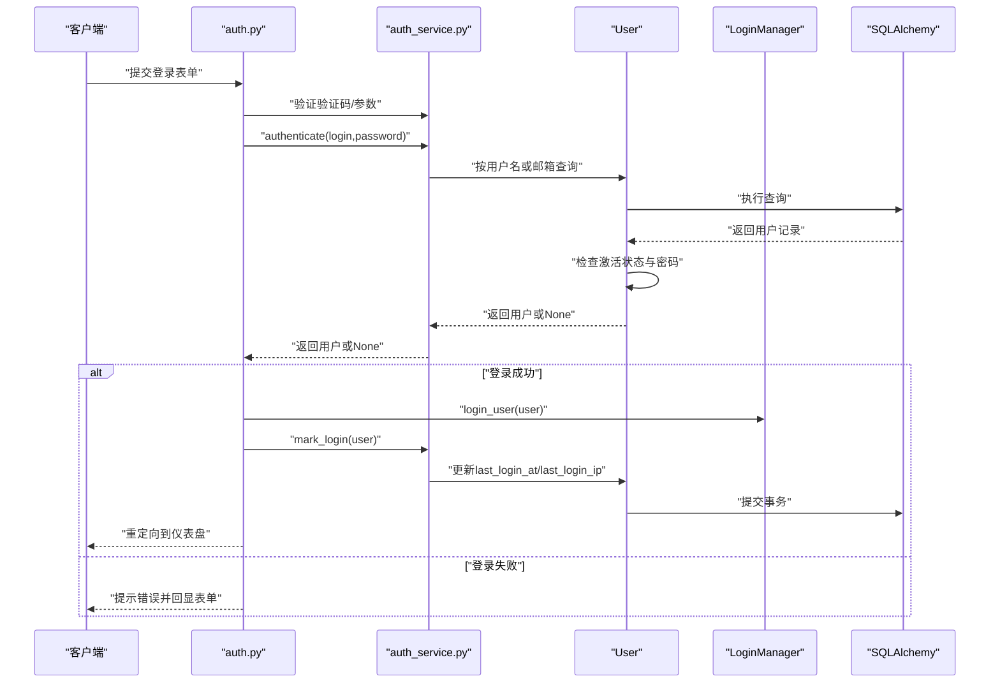
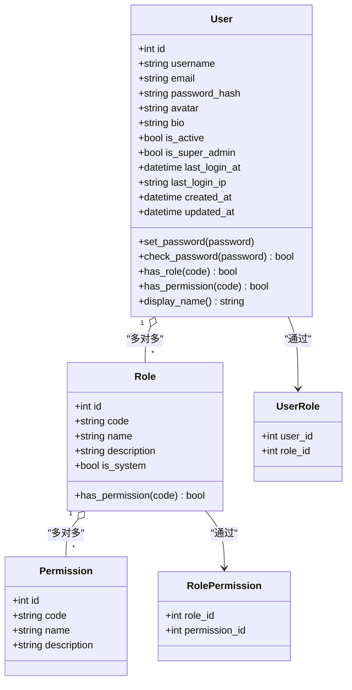
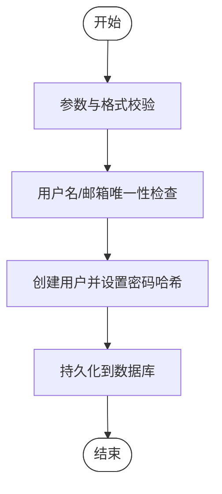
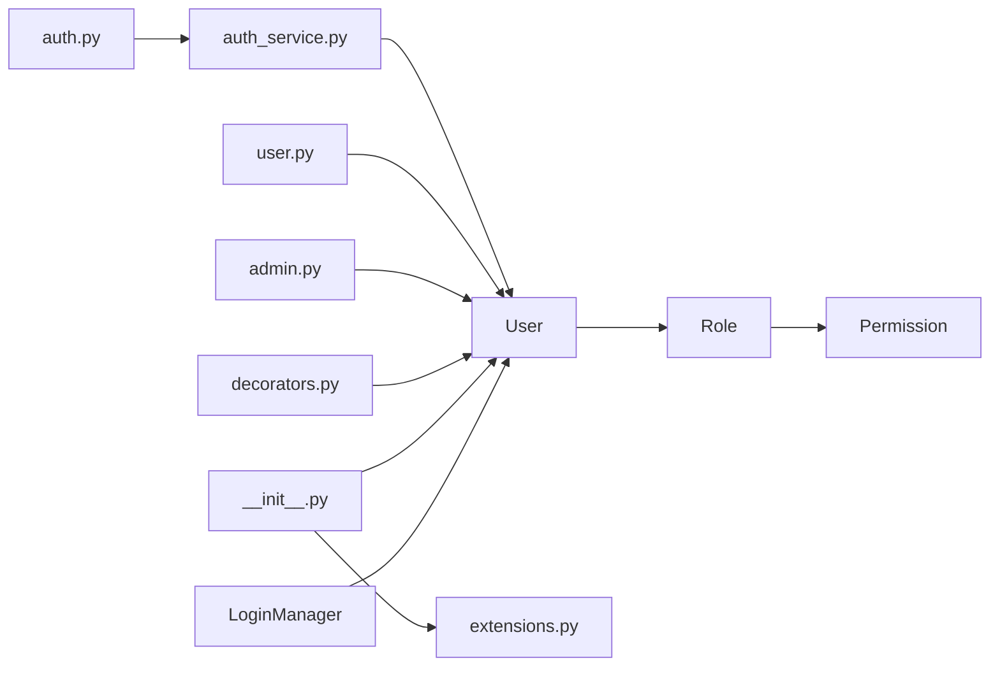

# 用户模型

<cite>
**本文引用的文件**
- [app/models/user.py](file://app/models/user.py)
- [app/services/auth_service.py](file://app/services/auth_service.py)
- [app/blueprints/auth.py](file://app/blueprints/auth.py)
- [app/blueprints/user.py](file://app/blueprints/user.py)
- [app/blueprints/admin.py](file://app/blueprints/admin.py)
- [app/utils/decorators.py](file://app/utils/decorators.py)
- [app/utils/security.py](file://app/utils/security.py)
- [app/cli.py](file://app/cli.py)
- [app/__init__.py](file://app/__init__.py)
- [app/extensions.py](file://app/extensions.py)
- [scripts/init_db.py](file://scripts/init_db.py)
</cite>

## 目录
1. [简介](#简介)
2. [项目结构](#项目结构)
3. [核心组件](#核心组件)
4. [架构总览](#架构总览)
5. [详细组件分析](#详细组件分析)
6. [依赖分析](#依赖分析)
7. [性能考虑](#性能考虑)
8. [故障排查指南](#故障排查指南)
9. [结论](#结论)
10. [附录](#附录)

## 简介
本文件聚焦于用户模型与基于角色的权限控制（RBAC）设计，覆盖以下主题：
- 数据模型：User、Role、Permission 及其关联表 UserRole、RolePermission 的字段定义、约束与业务含义
- 权限控制：用户角色分配、权限继承机制、超级管理员权限
- 认证流程：密码加密存储、会话管理、权限验证
- 查询优化：索引策略、查询模式与性能考量
- 典型场景：注册、登录、角色/权限管理、权限校验

## 项目结构
围绕用户与权限的核心文件分布如下：
- 模型层：用户、角色、权限及关联表定义
- 服务层：认证与注册逻辑
- 蓝图层：认证、用户仪表盘、管理员后台
- 工具层：权限装饰器、安全工具
- CLI/脚本：默认权限与角色种子数据、超级管理员初始化
- 应用工厂：扩展初始化、用户加载器注册

图表来源
- [app/models/user.py:10-103](file://app/models/user.py#L10-L103)
- [app/services/auth_service.py:1-57](file://app/services/auth_service.py#L1-L57)
- [app/blueprints/auth.py:1-85](file://app/blueprints/auth.py#L1-L85)
- [app/blueprints/user.py:1-35](file://app/blueprints/user.py#L1-L35)
- [app/blueprints/admin.py:1-148](file://app/blueprints/admin.py#L1-L148)
- [app/utils/decorators.py:1-33](file://app/utils/decorators.py#L1-L33)
- [app/utils/security.py:1-8](file://app/utils/security.py#L1-L8)
- [app/cli.py:1-114](file://app/cli.py#L1-L114)
- [app/__init__.py:39-54](file://app/__init__.py#L39-L54)
- [app/extensions.py:1-17](file://app/extensions.py#L1-L17)
- [scripts/init_db.py:1-52](file://scripts/init_db.py#L1-L52)

章节来源
- [app/models/user.py:10-103](file://app/models/user.py#L10-L103)
- [app/__init__.py:39-54](file://app/__init__.py#L39-L54)

## 核心组件
- User（用户）
  - 字段与约束：主键、唯一且非空的用户名与邮箱、密码哈希、头像、个人简介、激活状态、超级管理员标志、最后登录时间与IP、创建与更新时间戳；对用户名、邮箱、超级管理员标志建立索引
  - 关系：与 Role 多对多，通过中间表 user_roles 维护
  - 方法：设置/校验密码、判断角色/权限、显示名属性
- Role（角色）
  - 字段与约束：主键、唯一且非空的角色编码与名称、描述、是否系统内置标志
  - 关系：与 Permission 多对多，通过中间表 role_permissions 维护
  - 方法：判断是否拥有某权限
- Permission（权限）
  - 字段与约束：主键、唯一且非空的权限编码与名称、描述
- 关联表
  - UserRole：用户与角色的多对多关联
  - RolePermission：角色与权限的多对多关联

章节来源
- [app/models/user.py:10-103](file://app/models/user.py#L10-L103)

## 架构总览
用户认证与权限控制的整体流程如下：

图表来源
- [app/blueprints/auth.py:51-76](file://app/blueprints/auth.py#L51-L76)
- [app/services/auth_service.py:44-57](file://app/services/auth_service.py#L44-L57)
- [app/models/user.py:55-103](file://app/models/user.py#L55-L103)
- [app/__init__.py:48-53](file://app/__init__.py#L48-L53)

## 详细组件分析

### 数据模型类图

图表来源
- [app/models/user.py:10-103](file://app/models/user.py#L10-L103)

章节来源
- [app/models/user.py:10-103](file://app/models/user.py#L10-L103)

### 字段定义、约束与业务含义
- User（users 表）
  - id：自增主键
  - username：唯一、非空、带索引，用于登录标识与显示
  - email：唯一、非空、带索引，支持邮箱登录
  - password_hash：非空，存储密码哈希
  - avatar：字符串，头像URL
  - bio：字符串，个人简介
  - is_active：布尔，账户是否启用
  - is_super_admin：布尔、带索引，超级管理员标志
  - last_login_at/last_login_ip：最近登录时间与IP
  - created_at/updated_at：创建与更新时间戳
  - 关系：与 Role 多对多（通过 user_roles）
- Role（roles 表）
  - id：自增主键
  - code：唯一、非空、带索引，角色编码
  - name：非空，角色名称
  - description：描述
  - is_system：布尔，是否系统内置角色
  - 关系：与 Permission 多对多（通过 role_permissions）
  - 方法：has_permission(code)
- Permission（permissions 表）
  - id：自增主键
  - code：唯一、非空、带索引，权限编码
  - name：非空，权限名称
  - description：描述
- 关联表
  - user_roles：user_id、role_id 为主键，级联删除
  - role_permissions：role_id、permission_id 为主键，级联删除

章节来源
- [app/models/user.py:55-103](file://app/models/user.py#L55-L103)
- [app/models/user.py:33-52](file://app/models/user.py#L33-L52)
- [app/models/user.py:22-30](file://app/models/user.py#L22-L30)
- [app/models/user.py:10-19](file://app/models/user.py#L10-L19)

### RBAC 权限控制模型
- 角色与权限
  - 角色由 code 唯一标识，可绑定多个权限
  - 权限由 code 唯一标识，可被多个角色持有
- 用户与角色
  - 用户可拥有多个角色，角色可分配给多个用户
- 权限继承与超级管理员
  - 用户的最终权限集合为其所有角色所授予权限的并集
  - 超级管理员（is_super_admin=True）拥有全部权限，绕过常规权限校验
- 默认权限与角色
  - CLI 中预置了若干权限与角色，并在初始化时写入数据库
  - 系统管理员拥有全部权限，内容审核员仅拥有公开内容审核权限，普通用户具备基础能力

章节来源
- [app/models/user.py:90-96](file://app/models/user.py#L90-L96)
- [app/cli.py:8-58](file://app/cli.py#L8-L58)
- [app/blueprints/admin.py:108-117](file://app/blueprints/admin.py#L108-L117)

### 认证流程与密码存储
- 注册
  - 参数校验：用户名、邮箱、密码长度与一致性
  - 去重校验：用户名与邮箱唯一性
  - 创建用户并设置密码哈希，持久化
- 登录
  - 支持用户名或邮箱登录
  - 校验激活状态与密码
  - 登录成功后更新 last_login_at 与 last_login_ip
- 密码存储
  - 使用安全哈希算法生成密码哈希并存储
  - 验证时使用对应算法进行比对
- 会话管理
  - 使用 Flask-Login 管理会话
  - 应用工厂中注册用户加载器，从数据库按ID加载用户

图表来源
- [app/services/auth_service.py:21-41](file://app/services/auth_service.py#L21-L41)

章节来源
- [app/services/auth_service.py:21-57](file://app/services/auth_service.py#L21-L57)
- [app/models/user.py:81-85](file://app/models/user.py#L81-L85)
- [app/__init__.py:48-53](file://app/__init__.py#L48-L53)

### 权限验证与装饰器
- 装饰器
  - super_admin_required：仅允许超级管理员访问
  - permission_required(code)：要求具备指定权限（超级管理员自动放行）
- 后台管理
  - 管理员蓝图在请求前统一校验登录与超级管理员身份
  - 提供角色与权限的增删改查与分配接口

章节来源
- [app/utils/decorators.py:8-32](file://app/utils/decorators.py#L8-L32)
- [app/blueprints/admin.py:15-22](file://app/blueprints/admin.py#L15-L22)

### 初始化与默认数据
- CLI 初始化
  - 创建表、填充默认权限与角色、确保超级管理员存在并赋予管理员角色
- 脚本初始化
  - 独立脚本可替代命令行初始化，创建表、填充默认数据并设置超级管理员

章节来源
- [app/cli.py:62-95](file://app/cli.py#L62-L95)
- [scripts/init_db.py:23-47](file://scripts/init_db.py#L23-L47)

### 典型用户操作场景与数据访问模式
- 用户仪表盘
  - 登录后展示个人知识库、公开知识库、最近文档、AI知识库与统计信息
- 权限校验
  - 使用装饰器在视图层快速校验权限
- 管理员后台
  - 分配用户角色、维护角色与权限映射、提升/管理超级管理员

章节来源
- [app/blueprints/user.py:12-34](file://app/blueprints/user.py#L12-L34)
- [app/utils/decorators.py:21-32](file://app/utils/decorators.py#L21-L32)
- [app/blueprints/admin.py:76-85](file://app/blueprints/admin.py#L76-L85)
- [app/blueprints/admin.py:108-117](file://app/blueprints/admin.py#L108-L117)

## 依赖分析
- 模型层
  - User 依赖 Role（多对多），Role 依赖 Permission（多对多）
  - 关联表承担多对多关系的桥接
- 服务层
  - 认证服务依赖 User 模型与请求上下文，负责注册与登录校验
- 蓝图层
  - 认证蓝图调用认证服务，处理验证码、登录/注册路由
  - 用户蓝图提供仪表盘与个人资料
  - 管理员蓝图提供权限与角色管理
- 工具层
  - 权限装饰器依赖当前用户状态
  - 安全工具提供随机令牌生成
- 应用层
  - 应用工厂注册扩展、蓝图与用户加载器
  - LoginManager 依赖 SQLAlchemy 会话加载用户

图表来源
- [app/blueprints/auth.py:1-85](file://app/blueprints/auth.py#L1-L85)
- [app/services/auth_service.py:1-57](file://app/services/auth_service.py#L1-L57)
- [app/models/user.py:55-103](file://app/models/user.py#L55-L103)
- [app/blueprints/user.py:1-35](file://app/blueprints/user.py#L1-L35)
- [app/blueprints/admin.py:1-148](file://app/blueprints/admin.py#L1-L148)
- [app/utils/decorators.py:1-33](file://app/utils/decorators.py#L1-L33)
- [app/__init__.py:39-54](file://app/__init__.py#L39-L54)
- [app/extensions.py:1-17](file://app/extensions.py#L1-L17)

章节来源
- [app/models/user.py:55-103](file://app/models/user.py#L55-L103)
- [app/__init__.py:39-54](file://app/__init__.py#L39-L54)

## 性能考虑
- 索引策略
  - 用户名、邮箱、超级管理员标志建立索引，加速登录与唯一性校验
  - 权限与角色编码建立索引，加速权限匹配
- 查询模式
  - 登录采用“用户名或邮箱”查询，结合索引减少扫描
  - 权限判断在内存中遍历用户角色与其权限，避免复杂JOIN
- 批量操作
  - 角色/权限批量分配时使用 IN 查询与一次性提交，降低往返次数
- 缓存与会话
  - Flask-Login 在会话中缓存用户标识，避免频繁数据库查询
- 建议
  - 对高频查询字段保持索引
  - 控制权限/角色数量，避免过深嵌套导致权限判断开销增大
  - 对大规模用户/角色/权限表，考虑分页与延迟加载策略

章节来源
- [app/models/user.py:59-65](file://app/models/user.py#L59-L65)
- [app/models/user.py:25-27](file://app/models/user.py#L25-L27)
- [app/models/user.py:36-39](file://app/models/user.py#L36-L39)
- [app/blueprints/admin.py:82](file://app/blueprints/admin.py#L82)
- [app/blueprints/admin.py:114](file://app/blueprints/admin.py#L114)

## 故障排查指南
- 登录失败
  - 检查验证码是否正确、用户是否激活、用户名/邮箱是否存在
  - 查看 last_login_at/last_login_ip 是否更新
- 权限不足
  - 确认用户是否为超级管理员
  - 检查用户角色是否包含所需权限
  - 管理员后台确认角色与权限映射是否正确
- 初始化问题
  - 确认默认权限与角色是否已写入
  - 确认超级管理员是否存在并被赋予管理员角色
- 会话异常
  - 检查 Flask-Login 用户加载器是否正确注册
  - 确认用户ID类型转换是否有效

章节来源
- [app/services/auth_service.py:44-57](file://app/services/auth_service.py#L44-L57)
- [app/models/user.py:90-96](file://app/models/user.py#L90-L96)
- [app/cli.py:62-95](file://app/cli.py#L62-L95)
- [app/__init__.py:48-53](file://app/__init__.py#L48-L53)

## 结论
本用户模型采用清晰的三层关系（User-Role-Permission）与中间表实现多对多关联，配合装饰器与后台管理界面，实现了灵活可控的权限体系。密码采用安全哈希存储，登录流程简洁可靠。通过索引与查询优化策略，可在中等规模场景下获得良好性能表现。建议在生产环境中持续关注权限粒度与查询负载，必要时引入缓存与分页策略。

## 附录
- 默认权限与角色清单（来自 CLI 种子数据）
  - 权限：创建知识库、管理个人知识库、创建文档、分享文档、使用 AI 知识库、用户管理、角色管理、公开内容审核
  - 角色：普通用户（具备基础能力）、内容审核员（公开内容审核）、系统管理员（全部权限）

章节来源
- [app/cli.py:8-58](file://app/cli.py#L8-L58)