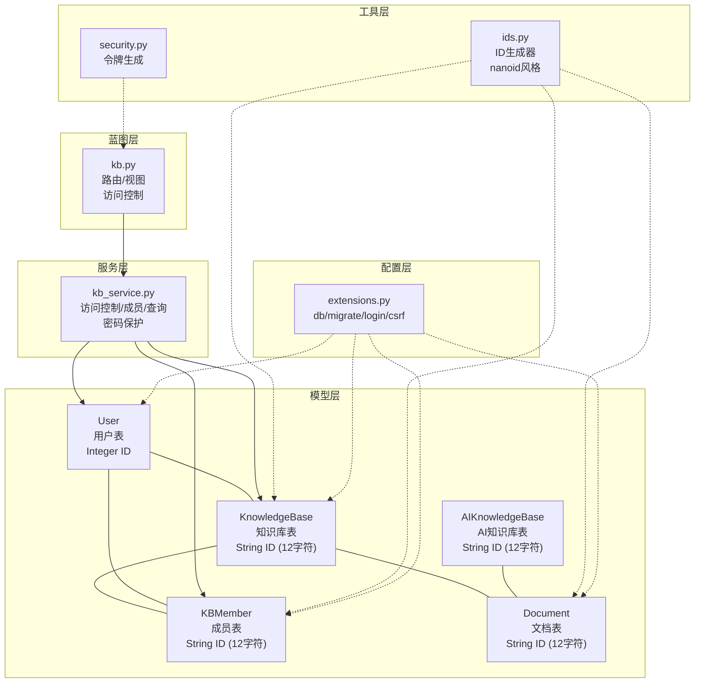
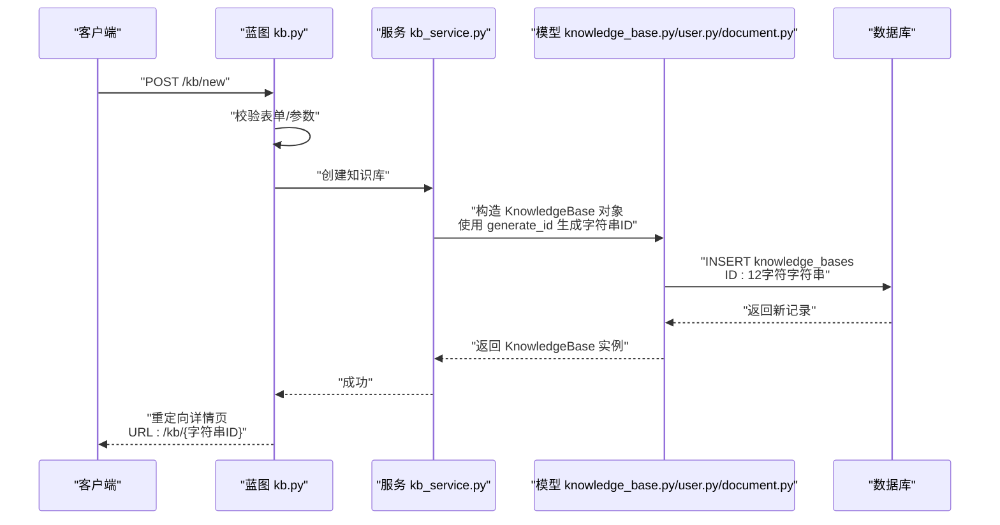
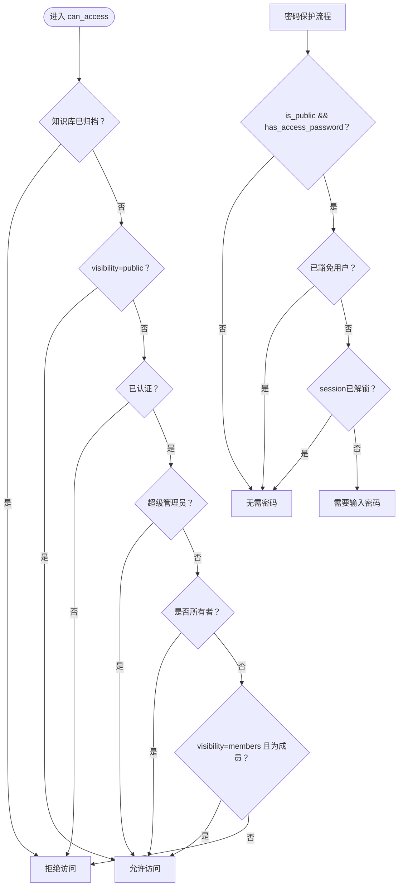
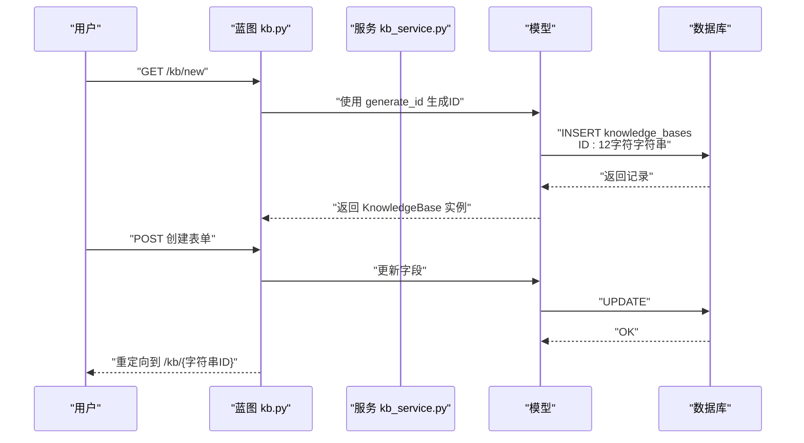
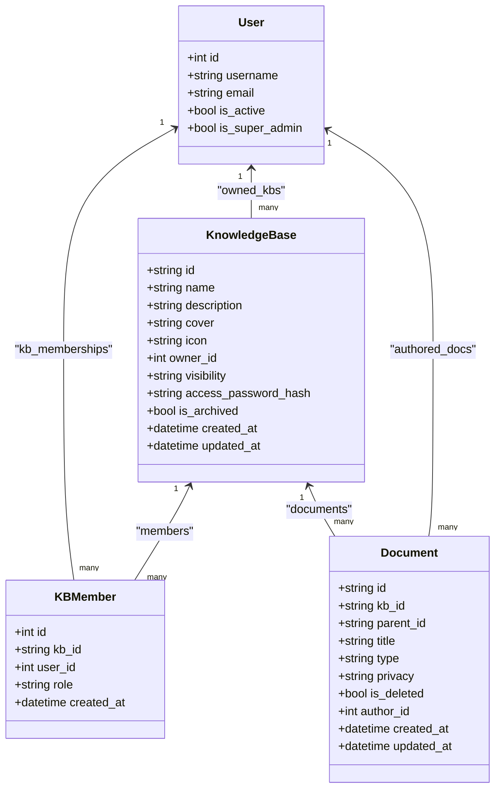
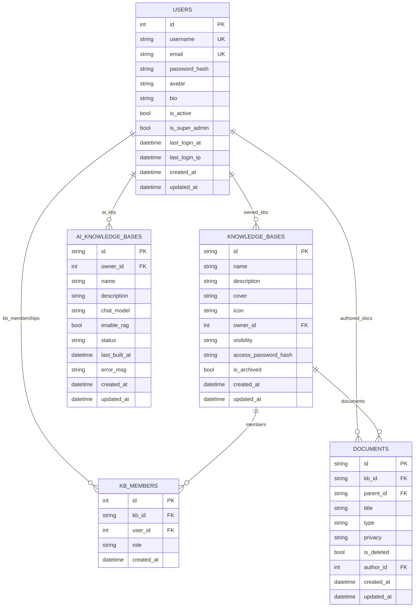

# 知识库模型

<cite>
**本文引用的文件**
- [knowledge_base.py](file://app/models/knowledge_base.py)
- [user.py](file://app/models/user.py)
- [kb_service.py](file://app/services/kb_service.py)
- [kb.py](file://app/blueprints/kb.py)
- [document.py](file://app/models/document.py)
- [extensions.py](file://app/extensions.py)
- [security.py](file://app/utils/security.py)
- [ai_kb.py](file://app/models/ai_kb.py)
- [ids.py](file://app/utils/ids.py)
</cite>

## 更新摘要
**变更内容**
- 更新了知识库和成员表的ID系统，从整数ID迁移到字符串ID（12字符随机字符串）
- 新增了访问密码功能，支持公开知识库的密码保护
- 更新了所有相关模型的字段定义和关系映射
- 完善了ID生成工具和安全令牌生成机制

## 目录
1. [简介](#简介)
2. [项目结构](#项目结构)
3. [核心组件](#核心组件)
4. [架构总览](#架构总览)
5. [详细组件分析](#详细组件分析)
6. [依赖关系分析](#依赖关系分析)
7. [性能考量与查询优化](#性能考量与查询优化)
8. [故障排查指南](#故障排查指南)
9. [结论](#结论)
10. [附录：数据模型图谱](#附录数据模型图谱)

## 简介
本文件面向"知识库模型"的数据建模与业务规则，系统化梳理 KnowledgeBase 数据模型的字段定义、数据类型、业务约束，以及与用户、文档的关系建模；同时阐述权限控制机制（公开、成员、私有）与角色（所有者、管理员、成员）的权限定义；最后给出查询优化策略、索引设计建议与典型操作流程（创建、修改、删除）的数据流与业务逻辑。

**更新** 本次更新反映了ID系统迁移对知识库和成员表的影响，包括新的字符串ID格式、访问密码功能以及相关的安全增强措施。

## 项目结构
围绕知识库模型的关键文件组织如下：
- 模型层：知识库、成员、用户、文档、AI知识库等模型定义
- 服务层：知识库访问控制、成员管理、列表查询等服务函数
- 蓝图层：知识库路由与视图处理
- 工具层：安全令牌生成、ID生成等辅助工具
- 配置层：数据库扩展初始化

**图表来源**
- [knowledge_base.py:25](file://app/models/knowledge_base.py#L25)
- [knowledge_base.py:71](file://app/models/knowledge_base.py#L71)
- [document.py:24](file://app/models/document.py#L24)
- [ai_kb.py:26](file://app/models/ai_kb.py#L26)
- [kb_service.py:51](file://app/services/kb_service.py#L51)
- [kb.py:14](file://app/blueprints/kb.py#L14)
- [security.py:5](file://app/utils/security.py#L5)
- [ids.py:14](file://app/utils/ids.py#L14)

**章节来源**
- [knowledge_base.py:1-82](file://app/models/knowledge_base.py#L1-L82)
- [user.py:1-104](file://app/models/user.py#L1-L104)
- [kb_service.py:1-115](file://app/services/kb_service.py#L1-L115)
- [kb.py:1-171](file://app/blueprints/kb.py#L1-L171)
- [document.py:1-99](file://app/models/document.py#L1-L99)
- [extensions.py:1-17](file://app/extensions.py#L1-L17)
- [security.py:1-8](file://app/utils/security.py#L1-L8)
- [ids.py:1-21](file://app/utils/ids.py#L1-L21)

## 核心组件
- KnowledgeBase：知识库实体，包含标识、元信息、可见性、归档状态与时间戳，并通过外键关联到用户（所有者）
- KBMember：知识库成员关系，唯一约束 kb_id+user_id，记录成员角色与加入时间
- User：用户实体，支持角色与权限体系（RBAC），用于知识库成员与所有者身份判定
- Document：知识库内的文档实体，与知识库存在一对多关系
- KBVisibility、KBMemberRole：枚举类型，分别定义知识库可见性与成员角色
- kb_service：封装访问控制、成员管理、列表查询等业务逻辑，新增密码保护功能
- kb 蓝图：提供知识库的创建、编辑、删除、成员管理等路由与视图
- ID生成器：提供12字符的字符串ID生成，采用nanoid风格，支持URL友好格式

**更新** 新增了访问密码功能和ID生成工具，所有模型都采用了新的字符串ID格式。

**章节来源**
- [knowledge_base.py:22-62](file://app/models/knowledge_base.py#L22-L62)
- [knowledge_base.py:65-82](file://app/models/knowledge_base.py#L65-L82)
- [user.py:55-104](file://app/models/user.py#L55-L104)
- [kb_service.py:10-115](file://app/services/kb_service.py#L10-L115)
- [kb.py:14-171](file://app/blueprints/kb.py#L14-L171)
- [document.py:21-54](file://app/models/document.py#L21-L54)
- [ids.py:14-21](file://app/utils/ids.py#L14-L21)

## 架构总览
知识库模型在应用中的交互路径：
- 路由层接收请求，调用服务层进行权限校验与业务处理
- 服务层基于模型层执行数据库读写与关系查询，支持密码验证
- 模型层定义表结构、索引与关系，确保数据一致性与查询效率
- 工具层提供安全能力（如令牌生成、ID生成），蓝图层负责渲染与响应

**图表来源**
- [kb.py:32-53](file://app/blueprints/kb.py#L32-L53)
- [kb_service.py:10-23](file://app/services/kb_service.py#L10-L23)
- [knowledge_base.py:25](file://app/models/knowledge_base.py#L25)
- [ids.py:14](file://app/utils/ids.py#L14)

## 详细组件分析

### KnowledgeBase 数据模型
- 表名：knowledge_bases
- 主键：id（字符串，12字符，使用 generate_id 生成）
- 关键字段与约束
  - name：字符串，最大长度 128，非空
  - description：字符串，最大长度 500，默认空串
  - cover/icon：封面与图标，字符串，用于展示
  - owner_id：整数，外键 users.id，级联删除，非空，建立索引
  - visibility：字符串，枚举值 private/members/public，默认 private，非空，建立索引
  - access_password_hash：访问密码哈希，字符串，用于公开知识库的密码保护
  - is_archived：布尔，归档标记，默认 false
  - created_at/updated_at：时间戳，默认当前时间，更新时自动刷新
- 关系
  - owner：反向引用 users 的 owned_kbs 动态集合
  - members：反向引用 kb_members 的动态集合（级联删除孤儿）
  - documents：反向引用 documents 的动态集合
- 属性
  - is_public：基于 visibility 判断是否为公开
  - has_access_password：判断是否设置了访问密码
  - set_access_password：设置访问密码（使用 Werkzeug 密码哈希）
  - check_access_password：验证访问密码

**更新** 新增了访问密码功能，支持公开知识库的密码保护机制。

**章节来源**
- [knowledge_base.py:22-62](file://app/models/knowledge_base.py#L22-L62)

### KBMember 成员关系模型
- 表名：kb_members
- 主键：id（整数，自增）
- 唯一约束：kb_id + user_id
- 字段
  - id：整数，自增主键
  - kb_id：字符串，12字符，外键 knowledge_bases.id，级联删除，非空，索引
  - user_id：整数，外键 users.id，级联删除，非空，索引
  - role：字符串，枚举 viewer/editor，默认 viewer
  - created_at：时间戳
- 关系
  - kb：反向引用 KnowledgeBase 的 members 动态集合（级联删除孤儿）
  - user：反向引用 User 的 kb_memberships 动态集合

**更新** 成员表的 kb_id 字段从整数改为字符串，与知识库表的ID格式保持一致。

**章节来源**
- [knowledge_base.py:65-82](file://app/models/knowledge_base.py#L65-L82)

### 用户与权限模型（RBAC）
- 用户 User：包含用户名、邮箱、密码哈希、头像、简介、激活状态、超级管理员标志、登录时间与IP、创建/更新时间等
- 角色 Role 与权限 Permission：通过中间表 user_roles、role_permissions 组织
- 权限判断：超级管理员拥有全部权限；否则按角色权限集合判断
- 在知识库场景中，KBMember 的 role 决定成员对知识库的操作权限

**章节来源**
- [user.py:55-104](file://app/models/user.py#L55-L104)

### 访问控制与权限规则
- 可访问 can_access
  - 归档知识库不可访问
  - 公开知识库允许访问
  - 成员访问需为已认证用户且在成员表中存在
  - 超级管理员或所有者始终可访问
- 可编辑 can_edit
  - 需为已认证用户
  - 超级管理员或所有者可编辑
  - 成员需为编辑角色
- 可管理 can_manage
  - 仅限已认证用户
  - 超级管理员或所有者可管理（邀请成员、变更可见性、删除）
- 密码保护 requires_unlock
  - 公开知识库且设置了访问密码时，需要先输入密码
  - 已豁免用户（所有者、成员、超级管理员）不需要密码
  - 已解锁的会话不需要再次输入密码

**图表来源**
- [kb_service.py:10-23](file://app/services/kb_service.py#L10-L23)
- [kb_service.py:66-81](file://app/services/kb_service.py#L66-L81)

**章节来源**
- [kb_service.py:10-115](file://app/services/kb_service.py#L10-L115)

### 知识库与文档的关系
- 文档 Document 与知识库 KnowledgeBase 为一对多关系
- 文档支持类型与隐私枚举，便于后续分享与检索
- 文档与分享 DocumentShare 支持密码保护与过期控制
- 所有文档ID都采用12字符字符串格式，与知识库保持一致

**更新** 文档表也采用了新的字符串ID格式，确保整个系统的ID一致性。

**章节来源**
- [document.py:21-54](file://app/models/document.py#L21-L54)

### 路由与业务流程（创建/编辑/删除/成员管理）
- 创建知识库
  - 登录后访问 /kb/new，提交表单后服务层校验并持久化
  - 使用 generate_id 生成12字符字符串ID，所有者为当前用户
- 编辑知识库
  - 仅可管理用户可访问 /kb/<kb_id>/edit，支持修改名称、描述、可见性、图标
  - 支持设置访问密码（仅公开知识库生效）
- 删除知识库
  - 通过归档 is_archived 标记实现软删除
- 成员管理
  - 仅可管理用户可访问 /kb/<kb_id>/members，支持添加/移除成员与调整角色

**图表来源**
- [kb.py:32-53](file://app/blueprints/kb.py#L32-L53)
- [kb_service.py:10-23](file://app/services/kb_service.py#L10-L23)
- [ids.py:14](file://app/utils/ids.py#L14)

**章节来源**
- [kb.py:14-171](file://app/blueprints/kb.py#L14-L171)
- [kb_service.py:83-115](file://app/services/kb_service.py#L83-L115)

## 依赖关系分析
- 模型依赖
  - KnowledgeBase 外键依赖 User
  - KBMember 同时依赖 KnowledgeBase 与 User
  - Document 外键依赖 KnowledgeBase 与 User
  - 所有模型都依赖 ID生成器工具
- 服务依赖
  - kb_service 依赖 KnowledgeBase、KBMember、User、KBVisibility、KBMemberRole、ID生成器
- 蓝图依赖
  - kb 蓝图依赖 kb_service、doc_service、KnowledgeBase、KBMember、User、Document
- 扩展依赖
  - db、migrate、login_manager、csrf 由 extensions 提供

**图表来源**
- [knowledge_base.py:22-82](file://app/models/knowledge_base.py#L22-L82)
- [user.py:55-104](file://app/models/user.py#L55-L104)
- [document.py:21-54](file://app/models/document.py#L21-L54)

**章节来源**
- [knowledge_base.py:22-82](file://app/models/knowledge_base.py#L22-L82)
- [user.py:55-104](file://app/models/user.py#L55-L104)
- [document.py:21-54](file://app/models/document.py#L21-L54)

## 性能考量与查询优化
- 索引设计
  - KnowledgeBase：owner_id、visibility、is_archived、updated_at、access_password_hash
  - KBMember：kb_id、user_id（唯一约束）、created_at
  - User：username、email（唯一索引）、is_super_admin
  - Document：kb_id、parent_id、privacy、is_deleted、author_id
- 查询优化策略
  - 列表查询：使用过滤条件组合与排序，避免 N+1 查询
  - 成员查询：优先使用唯一约束查询，减少 JOIN
  - 访问控制：can_access 中按优先级短路判断，减少数据库查询次数
  - 密码验证：使用 session 缓存已解锁状态，避免重复验证
- 约束与一致性
  - 外键级联删除保证数据一致性
  - KBMember 的唯一约束防止重复成员
  - 字符串ID确保URL友好性和安全性
- 可扩展性
  - AI知识库模型（AIKnowledgeBase、AIKBSource、AIKBArticle、AIKBChunk）与文档模型解耦，便于独立扩展
  - ID生成器支持自定义长度，便于未来扩展

**更新** 新增了访问密码相关的索引和查询优化策略。

**章节来源**
- [knowledge_base.py:31](file://app/models/knowledge_base.py#L31)
- [knowledge_base.py:72](file://app/models/knowledge_base.py#L72)
- [user.py:58](file://app/models/user.py#L58)
- [document.py:25](file://app/models/document.py#L25)
- [kb_service.py:58](file://app/services/kb_service.py#L58)

## 故障排查指南
- 403 无权限
  - 确认当前用户是否为知识库所有者或具有编辑/管理权限
  - 检查可见性设置与成员关系
  - 验证访问密码是否正确（仅公开知识库且设置了密码时）
- 404 知识库不存在或已归档
  - 确认 kb_id 是否为12字符字符串格式
  - 检查 is_archived 标志
- 成员添加失败
  - 检查唯一约束冲突（同一 kb_id+user_id）
  - 确认目标用户不是所有者本人
- 访问控制异常
  - 检查 can_access/can_edit/can_manage 的分支逻辑
  - 确认用户认证状态与超级管理员标志
  - 验证密码保护功能是否正常工作
- ID相关问题
  - 确认所有ID都是12字符的字符串格式
  - 检查ID生成器是否正常工作
  - 验证URL中是否正确传递了字符串ID

**更新** 新增了访问密码和ID格式相关的故障排查指南。

**章节来源**
- [kb.py:14](file://app/blueprints/kb.py#L14)
- [kb_service.py:10-115](file://app/services/kb_service.py#L10-L115)
- [kb.py:106-129](file://app/blueprints/kb.py#L106-L129)

## 结论
知识库模型以清晰的枚举与外键约束为基础，结合服务层的访问控制与蓝图层的路由处理，实现了从创建到管理的完整闭环。通过采用12字符字符串ID和访问密码功能，系统在保持数据一致性的同时提升了安全性和用户体验。合理的索引与查询策略，可在保证数据一致性的前提下提升查询性能。未来可进一步引入缓存、分页与全文检索以支撑更大规模的知识库场景。

**更新** 新的ID系统和访问密码功能为系统带来了更好的安全性和用户体验，同时保持了良好的性能表现。

## 附录：数据模型图谱

**图表来源**
- [knowledge_base.py:22-82](file://app/models/knowledge_base.py#L22-L82)
- [user.py:55-104](file://app/models/user.py#L55-L104)
- [document.py:21-54](file://app/models/document.py#L21-L54)
- [ai_kb.py:23-44](file://app/models/ai_kb.py#L23-L44)