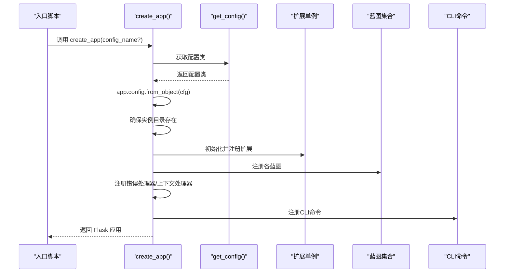
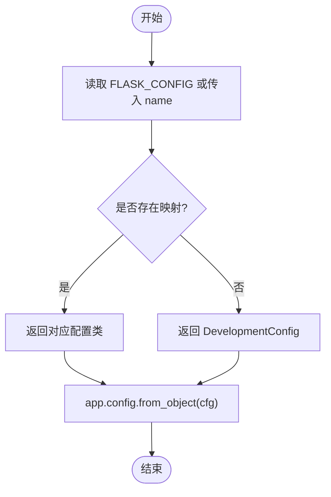
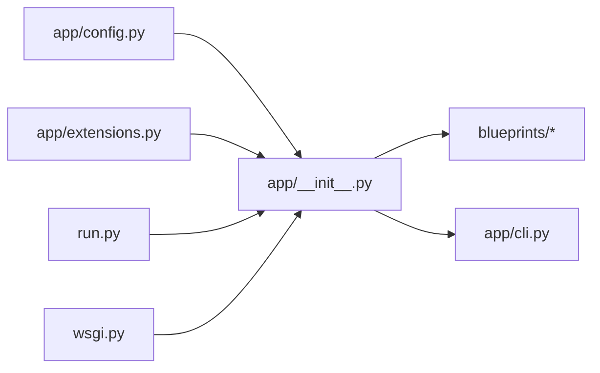

# 应用工厂架构

<cite>
**本文引用的文件**
- [app/__init__.py](file://app/__init__.py)
- [app/config.py](file://app/config.py)
- [app/extensions.py](file://app/extensions.py)
- [run.py](file://run.py)
- [wsgi.py](file://wsgi.py)
- [app/cli.py](file://app/cli.py)
- [app/models/user.py](file://app/models/user.py)
- [app/blueprints/main.py](file://app/blueprints/main.py)
- [app/blueprints/auth.py](file://app/blueprints/auth.py)
- [app/blueprints/admin.py](file://app/blueprints/admin.py)
</cite>

## 目录
1. [引言](#引言)
2. [项目结构](#项目结构)
3. [核心组件](#核心组件)
4. [架构总览](#架构总览)
5. [详细组件分析](#详细组件分析)
6. [依赖分析](#依赖分析)
7. [性能考虑](#性能考虑)
8. [故障排查指南](#故障排查指南)
9. [结论](#结论)
10. [附录](#附录)

## 引言
本文件系统性阐述 My Wiki 的“应用工厂”架构与实现，重点围绕 create_app 函数的设计思路、配置加载机制、实例目录创建与应用初始化流程展开；同时详解配置系统通过 get_config() 动态加载不同环境配置的方式，以及应用工厂如何确保所有必要初始化步骤按正确顺序执行。文档还涵盖配置优先级、环境变量处理与错误处理策略，并给出扩展应用工厂以添加新初始化功能的实际示例路径。

## 项目结构
My Wiki 采用典型的 Flask 分层组织方式：
- 应用工厂与入口：app/__init__.py 提供 create_app 工厂函数；run.py 和 wsgi.py 分别作为开发与生产入口。
- 配置系统：app/config.py 定义基础配置类与环境映射，并提供 get_config() 动态选择配置。
- 扩展与单例：app/extensions.py 统一声明 SQLAlchemy、Migrate、LoginManager、CSRFProtect 等扩展实例。
- 蓝图与路由：app/blueprints 下按功能域划分蓝图，如 main、auth、admin、kb、doc、share、ai 等。
- 模型与服务：app/models 下定义用户、角色、权限等模型；app/services 提供业务逻辑封装。
- CLI 命令：app/cli.py 注册数据库初始化、用户创建等命令。
- 实例目录：应用运行时在 instance 目录下创建上传与 AI Wiki 相关目录。

```mermaid
graph TB
subgraph "入口"
RUN["run.py<br/>开发入口"]
WSGI["wsgi.py<br/>WSGI入口"]
end
subgraph "应用工厂"
FACTORY["app/__init__.py<br/>create_app()"]
CFG["app/config.py<br/>get_config()"]
EXT["app/extensions.py<br/>扩展单例"]
end
subgraph "蓝图"
MAIN["blueprints/main.py"]
AUTH["blueprints/auth.py"]
ADMIN["blueprints/admin.py"]
end
subgraph "CLI"
CLI["app/cli.py"]
end
RUN --> FACTORY
WSGI --> FACTORY
FACTORY --> CFG
FACTORY --> EXT
FACTORY --> MAIN
FACTORY --> AUTH
FACTORY --> ADMIN
FACTORY --> CLI
```

图表来源
- [app/__init__.py:11-28](file://app/__init__.py#L11-L28)
- [app/config.py:80-83](file://app/config.py#L80-L83)
- [app/extensions.py:8-17](file://app/extensions.py#L8-L17)
- [run.py:9](file://run.py#L9)
- [wsgi.py:9](file://wsgi.py#L9)

章节来源
- [app/__init__.py:11-28](file://app/__init__.py#L11-L28)
- [app/config.py:80-83](file://app/config.py#L80-L83)
- [app/extensions.py:8-17](file://app/extensions.py#L8-L17)
- [run.py:9](file://run.py#L9)
- [wsgi.py:9](file://wsgi.py#L9)

## 核心组件
- 应用工厂 create_app
  - 职责：创建 Flask 应用实例、加载配置、创建实例目录、注册扩展、蓝图、错误处理器、上下文处理器、CLI 命令。
  - 关键步骤：从对象加载配置、确保实例目录存在、注册扩展与蓝图、注册错误处理与上下文处理器、注册 CLI。
- 配置系统 get_config
  - 职责：根据传入名称或环境变量选择配置类，默认 development。
  - 支持环境：development、production、testing。
- 扩展单例
  - 职责：集中声明 SQLAlchemy、Migrate、LoginManager、CSRFProtect，避免循环导入。
- 入口脚本
  - run.py：开发模式入口，支持 FLASK_RUN_HOST、FLASK_RUN_PORT 环境变量。
  - wsgi.py：生产 WSGI 入口，固定 production 环境。

章节来源
- [app/__init__.py:11-28](file://app/__init__.py#L11-L28)
- [app/config.py:80-83](file://app/config.py#L80-L83)
- [app/extensions.py:8-17](file://app/extensions.py#L8-L17)
- [run.py:9](file://run.py#L9)
- [wsgi.py:9](file://wsgi.py#L9)

## 架构总览
应用工厂模式将 Flask 应用的创建过程抽象为一个可复用的工厂函数，使应用在开发、测试、生产等不同环境中以一致的方式初始化。其核心流程如下：



图表来源
- [app/__init__.py:11-28](file://app/__init__.py#L11-L28)
- [app/config.py:80-83](file://app/config.py#L80-L83)

## 详细组件分析

### 应用工厂 create_app 设计与初始化流程
- 设计要点
  - 使用 Flask 构造函数并启用 instance_relative_config，便于读取 instance 目录下的配置与静态资源。
  - 通过 get_config() 动态选择配置类，再用 app.config.from_object(cfg) 加载。
  - 严格顺序：先加载配置，再创建实例目录，然后注册扩展、蓝图、错误处理、上下文处理器、CLI。
- 实例目录创建
  - 依据配置中的 UPLOAD_DIR、AI_WIKI_DIR 创建目录，确保 instance_path 存在。
- 扩展注册
  - db、migrate、login_manager、csrf 依次初始化并绑定到 app。
  - 在工厂内注册用户加载器，基于 db.session.get(User, int(user_id)) 实现登录态恢复。
- 蓝图注册
  - 注册 main、auth、user、admin、kb、doc、share、ai 等蓝图，并设置 url_prefix。
- 错误处理与上下文处理器
  - 注册 403/404/500 错误模板渲染。
  - 注册上下文处理器注入站点名称等全局变量。
- CLI 注册
  - 将 register_cli(app) 注册到 app.cli，提供 init-db、create-user 等命令。

章节来源
- [app/__init__.py:11-28](file://app/__init__.py#L11-L28)
- [app/__init__.py:31-54](file://app/__init__.py#L31-L54)
- [app/__init__.py:56-74](file://app/__init__.py#L56-L74)
- [app/__init__.py:76-88](file://app/__init__.py#L76-L88)
- [app/__init__.py:90-96](file://app/__init__.py#L90-L96)
- [app/__init__.py:98-101](file://app/__init__.py#L98-L101)

### 配置系统 get_config 与环境变量处理
- 配置类层次
  - BaseConfig：定义通用配置项，如数据库连接、会话 Cookie、上传目录、AI 相关参数、RAG 开关与嵌入模型、分页大小等。
  - DevelopmentConfig、ProductionConfig、TestingConfig：分别覆盖调试、测试场景下的差异化配置。
- get_config 选择逻辑
  - 优先使用显式传入的 name；否则读取环境变量 FLASK_CONFIG；默认 development。
  - 返回 CONFIG_MAP 中对应的配置类，若未匹配则回退到 DevelopmentConfig。
- 环境变量优先级
  - 数据库连接、密钥、上传目录、最大内容长度、AI 与 RAG 参数均来自环境变量，体现“环境优先”的原则。
  - 特殊布尔值解析通过 _bool() 辅助函数处理字符串化布尔值。
- 配置加载流程



图表来源
- [app/config.py:80-83](file://app/config.py#L80-L83)
- [app/config.py:73-77](file://app/config.py#L73-L77)
- [app/config.py:9-12](file://app/config.py#L9-L12)

章节来源
- [app/config.py:15-54](file://app/config.py#L15-L54)
- [app/config.py:56-71](file://app/config.py#L56-L71)
- [app/config.py:73-77](file://app/config.py#L73-L77)
- [app/config.py:80-83](file://app/config.py#L80-L83)
- [app/config.py:9-12](file://app/config.py#L9-L12)

### 实例目录创建与应用初始化顺序
- 目录创建
  - 依据 UPLOAD_DIR、AI_WIKI_DIR 与 instance_path 自动创建目录，确保应用运行时具备写入能力。
- 初始化顺序的重要性
  - 必须在注册蓝图之前完成扩展初始化，以保证蓝图内的视图可以使用 db、login_manager 等扩展。
  - 错误处理器与上下文处理器应在蓝图之后注册，以便覆盖蓝图中未捕获的异常并注入全局变量。
- 登录用户加载器
  - 在工厂内注册 user_loader，避免在蓝图内部重复初始化导致循环导入问题。

章节来源
- [app/__init__.py:31-36](file://app/__init__.py#L31-L36)
- [app/__init__.py:39-54](file://app/__init__.py#L39-L54)
- [app/models/user.py:55-104](file://app/models/user.py#L55-L104)

### 蓝图注册与路由前缀
- 注册顺序与前缀
  - main 蓝图不带前缀，auth/admin/kb/doc/share/ai 各自带有 url_prefix。
- 路由示例
  - main.index：根据登录状态跳转至仪表盘或首页。
  - auth.login/register/logout/captcha：认证相关路由。
  - admin：超级管理员后台，包含用户、角色、权限、公开内容管理等。

章节来源
- [app/__init__.py:56-74](file://app/__init__.py#L56-L74)
- [app/blueprints/main.py:10-16](file://app/blueprints/main.py#L10-L16)
- [app/blueprints/auth.py:10-85](file://app/blueprints/auth.py#L10-L85)
- [app/blueprints/admin.py:15-33](file://app/blueprints/admin.py#L15-L33)

### 错误处理与上下文处理器
- 错误处理
  - 403/404/500 分别渲染对应模板，返回相应状态码。
- 上下文处理器
  - 注入 site_name 等全局变量，供模板使用。

章节来源
- [app/__init__.py:76-88](file://app/__init__.py#L76-L88)
- [app/__init__.py:90-96](file://app/__init__.py#L90-L96)

### CLI 命令与数据库初始化
- init-db：创建表、填充默认权限与角色、确保超级管理员存在并赋予 admin 角色。
- create-user：创建普通用户并分配 user 角色。
- 注册位置：在工厂中调用 register_cli(app)，将命令挂载到 app.cli。

章节来源
- [app/cli.py:61-96](file://app/cli.py#L61-L96)
- [app/cli.py:97-114](file://app/cli.py#L97-L114)
- [app/__init__.py:98-101](file://app/__init__.py#L98-L101)

### 入口脚本与环境切换
- run.py：开发入口，加载 .env，调用 create_app(默认 development)，支持 FLASK_RUN_HOST、FLASK_RUN_PORT。
- wsgi.py：生产入口，加载 .env，调用 create_app(默认 production)。

章节来源
- [run.py:5-16](file://run.py#L5-L16)
- [wsgi.py:5-9](file://wsgi.py#L5-L9)

## 依赖分析
- 组件耦合与职责分离
  - app/__init__.py 仅依赖 app/config.py 与 app/extensions.py，保持低耦合。
  - 扩展单例集中管理，避免在蓝图中重复初始化。
  - 蓝图与 CLI 通过工厂统一注册，形成清晰的控制流。
- 外部依赖
  - Flask、Flask-SQLAlchemy、Flask-Migrate、Flask-Login、Flask-WTF 等。
- 可能的循环依赖风险
  - 将 user_loader 注册在工厂内，避免蓝图中导入导致循环。



图表来源
- [app/__init__.py:7-8](file://app/__init__.py#L7-L8)
- [app/config.py:1-4](file://app/config.py#L1-L4)
- [app/extensions.py:1-6](file://app/extensions.py#L1-L6)
- [run.py:7-9](file://run.py#L7-L9)
- [wsgi.py:7-9](file://wsgi.py#L7-L9)

章节来源
- [app/__init__.py:7-8](file://app/__init__.py#L7-L8)
- [app/config.py:1-4](file://app/config.py#L1-L4)
- [app/extensions.py:1-6](file://app/extensions.py#L1-L6)
- [run.py:7-9](file://run.py#L7-L9)
- [wsgi.py:7-9](file://wsgi.py#L7-L9)

## 性能考虑
- 连接池与引擎选项
  - BaseConfig 中设置 pool_pre_ping 与 pool_recycle，有助于维持长连接稳定性，减少断连重试开销。
- 调试与测试
  - DevelopmentConfig 开启 DEBUG；TestingConfig 关闭 CSRF 并使用内存数据库，适合快速回归测试。
- 文件系统 I/O
  - 实例目录创建在应用启动阶段一次性完成，避免运行时频繁 mkdir。
- 建议
  - 生产环境关闭 DEBUG，合理设置 MAX_CONTENT_LENGTH 与分页大小，避免大文件上传带来的内存压力。

章节来源
- [app/config.py:23-26](file://app/config.py#L23-L26)
- [app/config.py:56-61](file://app/config.py#L56-L61)
- [app/config.py:64-71](file://app/config.py#L64-L71)

## 故障排查指南
- 配置未生效
  - 检查 FLASK_CONFIG 是否正确设置；确认 get_config() 返回的配置类是否符合预期。
  - 确认环境变量是否被 .env 正确加载（run.py/wsgi.py 均调用了 load_dotenv）。
- 实例目录无法创建
  - 检查 UPLOAD_DIR、AI_WIKI_DIR 是否为空或非法路径；确认运行用户对 instance 目录有写权限。
- 登录失败或用户加载异常
  - 确认 user_loader 注册成功且 User 模型字段类型与 db.session.get 匹配。
- 蓝图路由 404
  - 检查蓝图注册顺序与 url_prefix 设置；确认请求路径与蓝图路由定义一致。
- CLI 命令不可用
  - 确认工厂中已调用 register_cli(app)；在终端使用 flask init-db 或 flask create-user。

章节来源
- [app/__init__.py:18](file://app/__init__.py#L18)
- [app/__init__.py:31-36](file://app/__init__.py#L31-L36)
- [app/__init__.py:48-54](file://app/__init__.py#L48-L54)
- [app/__init__.py:56-74](file://app/__init__.py#L56-L74)
- [app/__init__.py:98-101](file://app/__init__.py#L98-L101)
- [run.py:5](file://run.py#L5)
- [wsgi.py:5](file://wsgi.py#L5)

## 结论
My Wiki 的应用工厂模式通过 create_app 将配置加载、实例目录创建、扩展与蓝图注册、错误处理与上下文处理器、CLI 命令等初始化步骤标准化，实现了在多环境（开发/生产/测试）下的一致行为。配置系统通过 get_config() 与环境变量协同工作，确保部署灵活性；工厂内的严格初始化顺序保障了应用的稳定运行。该架构易于扩展，可在工厂中新增初始化步骤，满足未来功能演进需求。

## 附录

### 如何扩展应用工厂以添加新的初始化功能
以下示例展示在工厂中添加新初始化步骤的路径与注意事项（不直接粘贴代码，仅提供路径参考）：
- 在工厂函数末尾添加新步骤：参考 [app/__init__.py:26](file://app/__init__.py#L26) 的注释位置，插入新初始化函数调用。
- 新增扩展与注册：在扩展模块中声明新扩展实例，参考 [app/extensions.py:8-17](file://app/extensions.py#L8-L17)，并在工厂中注册，参考 [app/__init__.py:39-44](file://app/__init__.py#L39-L44)。
- 新增蓝图：在工厂中注册新蓝图，参考 [app/__init__.py:56-74](file://app/__init__.py#L56-L74)。
- 新增 CLI 命令：在 CLI 模块中注册命令，参考 [app/cli.py:61-96](file://app/cli.py#L61-L96)，并在工厂中调用 register_cli，参考 [app/__init__.py:98-101](file://app/__init__.py#L98-L101)。
- 新增错误处理或上下文处理器：参考 [app/__init__.py:76-88](file://app/__init__.py#L76-L88) 与 [app/__init__.py:90-96](file://app/__init__.py#L90-L96)。