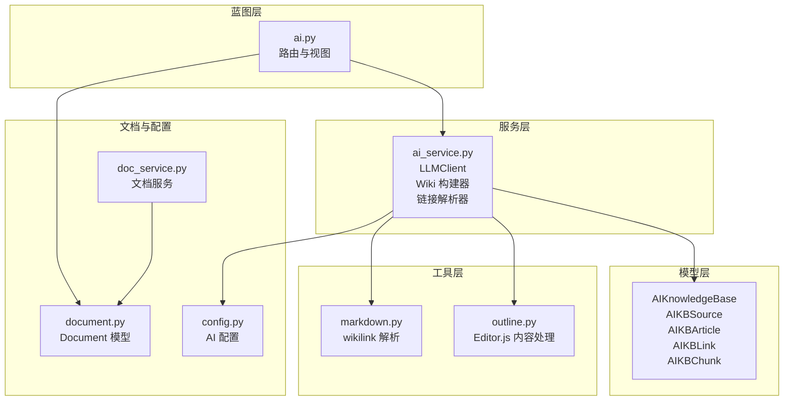
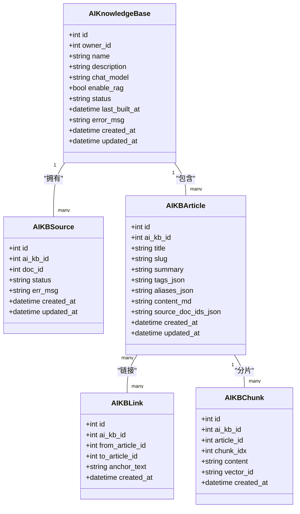
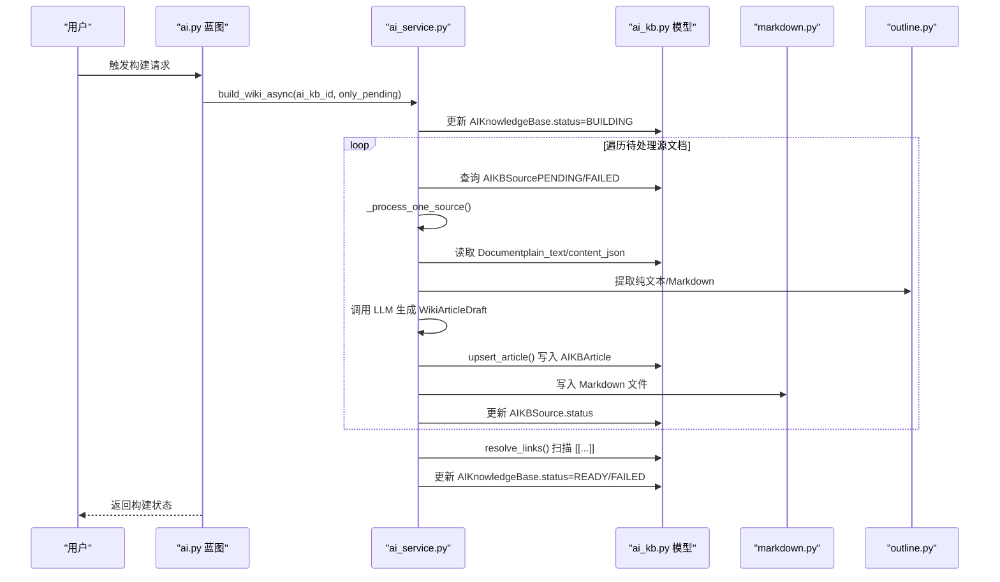
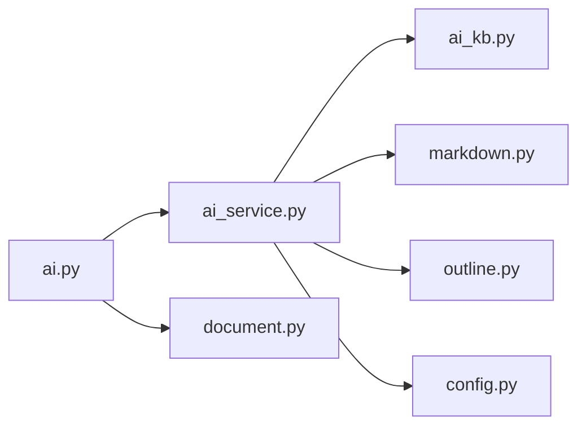

# AI知识库数据模型

<cite>
**本文引用的文件**
- [app/models/ai_kb.py](file://app/models/ai_kb.py)
- [app/services/ai_service.py](file://app/services/ai_service.py)
- [app/blueprints/ai.py](file://app/blueprints/ai.py)
- [app/utils/markdown.py](file://app/utils/markdown.py)
- [app/utils/outline.py](file://app/utils/outline.py)
- [app/models/document.py](file://app/models/document.py)
- [app/services/doc_service.py](file://app/services/doc_service.py)
- [app/config.py](file://app/config.py)
</cite>

## 目录
1. [简介](#简介)
2. [项目结构](#项目结构)
3. [核心组件](#核心组件)
4. [架构总览](#架构总览)
5. [组件详解](#组件详解)
6. [依赖关系分析](#依赖关系分析)
7. [性能考量](#性能考量)
8. [故障排查指南](#故障排查指南)
9. [结论](#结论)
10. [附录](#附录)

## 简介
本技术文档聚焦于 My Wiki 的 AI 知识库数据模型，系统化阐述 Karpathy 风格 LLM Wiki 的知识组织方式与构建流程。重点包括：
- AIKnowledgeBase 模型的架构设计与状态管理
- AIKBSource 模型的源文档跟踪机制
- AIKBArticle 模型的文章内容存储与组织
- AIKBLink 模型的链接解析与双向链接图谱
- AIKBChunk 模型的可选文本分片与向量化策略
- 构建流程、索引设计与搜索优化策略
- 扩展性与性能优化建议

## 项目结构
AI 知识库相关代码主要分布在以下模块：
- 数据模型层：app/models/ai_kb.py
- 服务层：app/services/ai_service.py
- 蓝图路由层：app/blueprints/ai.py
- 工具层：app/utils/markdown.py、app/utils/outline.py
- 文档模型与服务：app/models/document.py、app/services/doc_service.py
- 配置：app/config.py

图表来源
- [app/models/ai_kb.py:22-121](file://app/models/ai_kb.py#L22-L121)
- [app/services/ai_service.py:47-408](file://app/services/ai_service.py#L47-L408)
- [app/blueprints/ai.py:18-279](file://app/blueprints/ai.py#L18-L279)
- [app/utils/markdown.py:28-87](file://app/utils/markdown.py#L28-L87)
- [app/utils/outline.py:22-136](file://app/utils/outline.py#L22-L136)
- [app/models/document.py:20-98](file://app/models/document.py#L20-L98)
- [app/services/doc_service.py:11-81](file://app/services/doc_service.py#L11-L81)
- [app/config.py:37-47](file://app/config.py#L37-L47)

章节来源
- [app/models/ai_kb.py:22-121](file://app/models/ai_kb.py#L22-L121)
- [app/services/ai_service.py:47-408](file://app/services/ai_service.py#L47-L408)
- [app/blueprints/ai.py:18-279](file://app/blueprints/ai.py#L18-L279)
- [app/utils/markdown.py:28-87](file://app/utils/markdown.py#L28-L87)
- [app/utils/outline.py:22-136](file://app/utils/outline.py#L22-L136)
- [app/models/document.py:20-98](file://app/models/document.py#L20-L98)
- [app/services/doc_service.py:11-81](file://app/services/doc_service.py#L11-L81)
- [app/config.py:37-47](file://app/config.py#L37-L47)

## 核心组件
- AIKBStatus 与 AIKBSourceStatus：定义知识库与源文档的生命周期状态，支持异步构建与失败重试。
- AIKnowledgeBase：知识库实体，记录拥有者、名称、描述、聊天模型、是否启用 RAG、状态与错误信息等。
- AIKBSource：源文档与知识库的多对多关联表，唯一约束确保同一文档不会重复加入。
- AIKBArticle：Karpathy 风格的 wiki 条目，包含标题、slug、摘要、标签、别名、内容与来源文档集合。
- AIKBLink：条目间的超链接，支持红链（未命中的占位链接）与双向链接统计。
- AIKBChunk：可选的文本分片与向量 ID 存储，配合外部向量数据库实现 RAG。

章节来源
- [app/models/ai_kb.py:8-121](file://app/models/ai_kb.py#L8-L121)

## 架构总览
AI 知识库采用“文档 -> 文章 -> 链接”的三层结构：
- 源文档来自知识库内的文档模型，通过 AI 服务转换为统一格式的文章。
- 文章之间通过双链引用形成链接图谱，支持解析与渲染。
- 可选启用 RAG 时，文章内容被切分为片段并建立向量索引，用于检索增强问答。

图表来源
- [app/models/ai_kb.py:22-121](file://app/models/ai_kb.py#L22-L121)

## 组件详解

### AIKnowledgeBase 模型与状态管理
- 关键字段：owner_id、name、description、chat_model、enable_rag、status、last_built_at、error_msg。
- 状态机：IDLE -> BUILDING -> READY/FAILED，支持失败重试与错误信息记录。
- 与用户的关系：通过外键关联到用户，实现按拥有者隔离。
- 与文档的关系：通过中间表 AIKBSource 关联到多个文档。

章节来源
- [app/models/ai_kb.py:22-44](file://app/models/ai_kb.py#L22-L44)

### AIKBSource 模型与源文档管理
- 唯一约束：同一知识库内同一文档只能加入一次。
- 字段：ai_kb_id、doc_id、status、err_msg、时间戳。
- 状态：PENDING、PROCESSING、PROCESSED、FAILED，支持增量构建与失败重试。
- 与文档的关联：通过 Document 外键，支持软删除后的状态判定。

章节来源
- [app/models/ai_kb.py:46-64](file://app/models/ai_kb.py#L46-L64)

### AIKBArticle 模型与文章组织
- 唯一约束：同一知识库内 slug 唯一，避免冲突。
- 字段：title、slug、summary、tags_json、aliases_json、content_md、source_doc_ids_json。
- 内容组织：采用 Markdown + 前言头（frontmatter）形式，便于静态文件输出与渲染。
- 别名与来源：支持别名解析与多源文档聚合，提升链接解析准确度。

章节来源
- [app/models/ai_kb.py:66-91](file://app/models/ai_kb.py#L66-L91)

### AIKBLink 模型与链接解析机制
- 双向链接：from_article_id -> to_article_id，支持红链（to_article_id 为空）。
- 解析流程：扫描文章内容中的 [[Title]]，构建别名索引（标题/别名/slug），生成链接记录。
- 渲染：支持将占位链接转换为实际路由，未命中的链接标记为红链。

章节来源
- [app/models/ai_kb.py:93-108](file://app/models/ai_kb.py#L93-L108)
- [app/services/ai_service.py:251-278](file://app/services/ai_service.py#L251-L278)
- [app/utils/markdown.py:28-87](file://app/utils/markdown.py#L28-L87)

### AIKBChunk 模型与文本分片策略
- 可选启用：仅当知识库开启 enable_rag 时使用。
- 字段：article_id、chunk_idx、content、vector_id。
- 设计意图：将长文章切分为固定大小的片段，便于向量化与检索；向量本体存储在外部向量数据库中，模型仅保留元数据与索引。

章节来源
- [app/models/ai_kb.py:110-121](file://app/models/ai_kb.py#L110-L121)

### 文档模型与内容提取
- Document 模型：包含 Editor.js JSON 内容与 plain_text，支持类型与隐私控制。
- 内容提取：从 Editor.js JSON 提取纯文本与简单 Markdown，供 AI 服务与搜索使用。
- 文档服务：提供树形结构展示、内容更新、软删除与后代收集等能力。

章节来源
- [app/models/document.py:20-98](file://app/models/document.py#L20-L98)
- [app/services/doc_service.py:11-81](file://app/services/doc_service.py#L11-L81)
- [app/utils/outline.py:22-136](file://app/utils/outline.py#L22-L136)

### AI 服务与构建流程
- LLM 客户端：封装 OpenAI 兼容 SDK，支持自定义 base_url、api_key、model。
- 文章构建：将文档内容转为统一的 WikiArticleDraft，写入 AIKBArticle 并持久化为 Markdown 文件。
- 链接解析：扫描所有文章的 [[...]]，重建 AIKBLink 表，统计解析数与红链数。
- 异步构建：后台线程执行构建任务，更新知识库状态与错误信息。
- 问答接口：基于关键词匹配选择 Top-N 文章作为上下文，调用 LLM 返回答案。

图表来源
- [app/blueprints/ai.py:143-156](file://app/blueprints/ai.py#L143-L156)
- [app/services/ai_service.py:296-344](file://app/services/ai_service.py#L296-L344)
- [app/services/ai_service.py:251-278](file://app/services/ai_service.py#L251-L278)
- [app/utils/outline.py:58-87](file://app/utils/outline.py#L58-L87)
- [app/utils/markdown.py:196-201](file://app/utils/markdown.py#L196-L201)

章节来源
- [app/services/ai_service.py:47-408](file://app/services/ai_service.py#L47-L408)
- [app/blueprints/ai.py:143-156](file://app/blueprints/ai.py#L143-L156)

### 链接解析算法
- 别名索引：标题、slug、aliases_json 构建大小写不敏感映射。
- 链接扫描：正则提取 [[Target|Anchor]] 或 [[Target]]，去重后逐项解析。
- 红链统计：未命中的链接计入 redlink 计数，便于可视化与修复。

图表来源
- [app/services/ai_service.py:237-278](file://app/services/ai_service.py#L237-L278)
- [app/utils/markdown.py:69-87](file://app/utils/markdown.py#L69-L87)

章节来源
- [app/services/ai_service.py:237-278](file://app/services/ai_service.py#L237-L278)
- [app/utils/markdown.py:69-87](file://app/utils/markdown.py#L69-L87)

### 搜索与索引设计
- 关键词重叠评分：对问题进行分词，统计每个文章中命中词的数量，Top-N 作为上下文。
- 上下文截断：限制单篇文章上下文长度，平衡性能与召回。
- 纯文本提取：从 Editor.js JSON 中抽取纯文本，用于快速检索与 AI 输入。

章节来源
- [app/services/ai_service.py:391-407](file://app/services/ai_service.py#L391-L407)
- [app/utils/outline.py:58-87](file://app/utils/outline.py#L58-L87)

## 依赖关系分析
- 模型间依赖：AIKnowledgeBase 与 AIKBSource、AIKBArticle、AIKBLink、AIKBChunk 通过外键关联。
- 服务依赖：ai_service 依赖 models、utils、config，负责构建、解析与问答。
- 蓝图依赖：ai.py 负责路由与视图渲染，调用 ai_service 与 kb_service。
- 工具依赖：markdown.py 提供 wiki 链接解析与渲染；outline.py 提供 Editor.js 内容处理。

图表来源
- [app/blueprints/ai.py:18-279](file://app/blueprints/ai.py#L18-L279)
- [app/services/ai_service.py:47-408](file://app/services/ai_service.py#L47-L408)
- [app/models/ai_kb.py:22-121](file://app/models/ai_kb.py#L22-L121)
- [app/utils/markdown.py:28-87](file://app/utils/markdown.py#L28-L87)
- [app/utils/outline.py:22-136](file://app/utils/outline.py#L22-L136)
- [app/models/document.py:20-98](file://app/models/document.py#L20-L98)
- [app/config.py:37-47](file://app/config.py#L37-L47)

章节来源
- [app/blueprints/ai.py:18-279](file://app/blueprints/ai.py#L18-L279)
- [app/services/ai_service.py:47-408](file://app/services/ai_service.py#L47-L408)
- [app/models/ai_kb.py:22-121](file://app/models/ai_kb.py#L22-L121)
- [app/utils/markdown.py:28-87](file://app/utils/markdown.py#L28-L87)
- [app/utils/outline.py:22-136](file://app/utils/outline.py#L22-L136)
- [app/models/document.py:20-98](file://app/models/document.py#L20-L98)
- [app/config.py:37-47](file://app/config.py#L37-L47)

## 性能考量
- 异步构建：后台线程执行构建，避免阻塞主线程，提高用户体验。
- 状态与增量：仅处理 PENDING/FAILED 的源文档，支持失败重试与断点续做。
- 文本截断：问答时限制上下文长度，减少 LLM 调用成本与延迟。
- 索引与查询：别名索引与唯一约束减少重复计算与冲突；链接解析前先去重，降低扫描开销。
- 向量化可选：仅在启用 RAG 时进行分片与向量化，避免不必要的存储与计算。

[本节为通用性能建议，不直接分析具体文件]

## 故障排查指南
- 构建失败：检查知识库状态与错误信息字段，定位 LLM 调用异常或文档缺失。
- 红链过多：通过链接解析统计与可视化页面识别未命中的链接，补充或修正别名。
- 文档不可见：确认文档隐私设置与访问权限，确保用户具备访问知识库的权限。
- 链接渲染异常：检查 wiki 链接正则与解析器逻辑，确保锚文本与 slug 映射正确。

章节来源
- [app/blueprints/ai.py:159-173](file://app/blueprints/ai.py#L159-L173)
- [app/services/ai_service.py:296-344](file://app/services/ai_service.py#L296-L344)
- [app/utils/markdown.py:42-66](file://app/utils/markdown.py#L42-L66)

## 结论
该数据模型以 Karpathy 的 LLM Wiki 方法为基础，结合双向链接与可选 RAG，实现了从文档到知识图谱再到问答的完整闭环。通过清晰的状态机、唯一约束与异步构建流程，保证了系统的可靠性与可维护性。未来可在向量检索、分片策略与缓存层进一步优化，以支撑更大规模的知识库。

[本节为总结性内容，不直接分析具体文件]

## 附录

### 配置要点
- OPENAI_BASE_URL、OPENAI_API_KEY、CHAT_MODEL：LLM 客户端参数。
- AI_WIKI_DIR：Markdown 文件输出目录。
- ENABLE_RAG、EMBEDDING_MODEL、CHROMA_PATH：可选 RAG 参数。

章节来源
- [app/config.py:37-47](file://app/config.py#L37-L47)