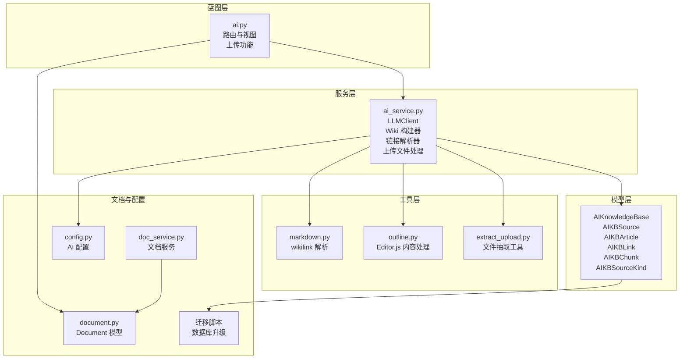
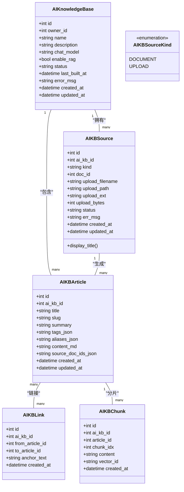
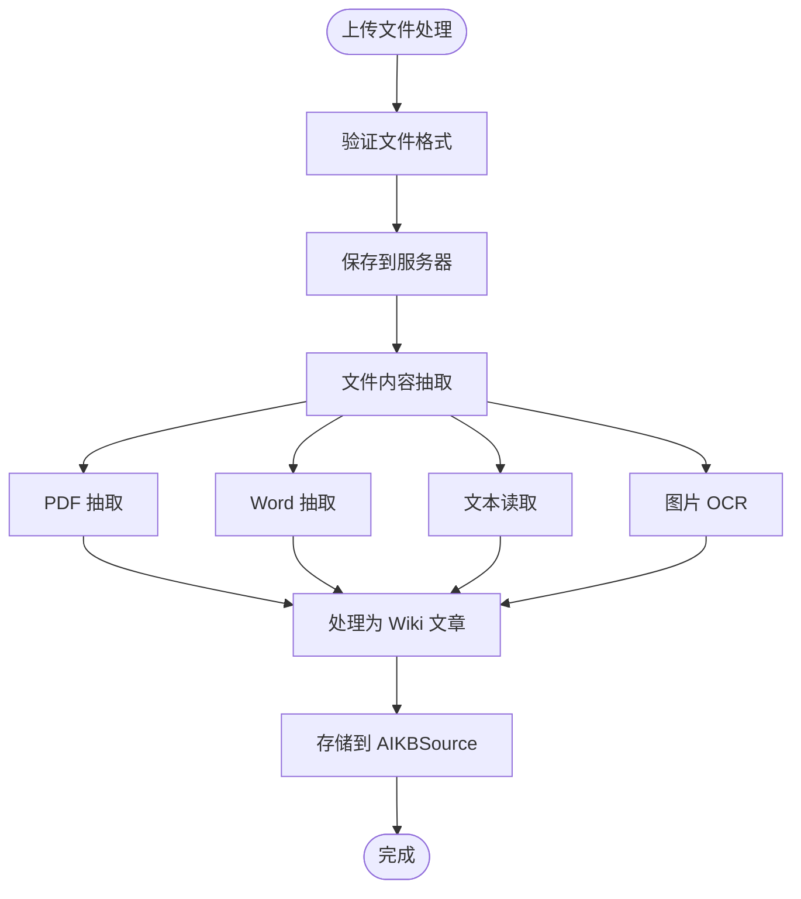
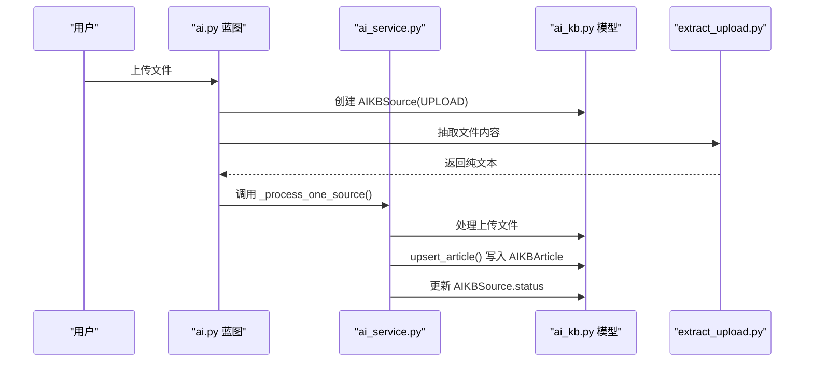
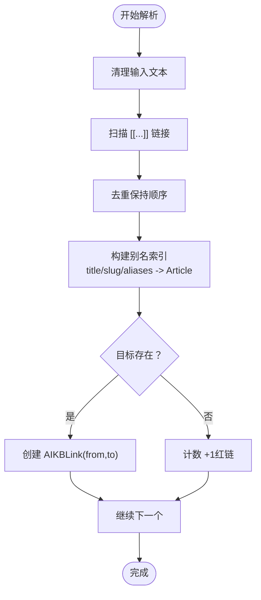
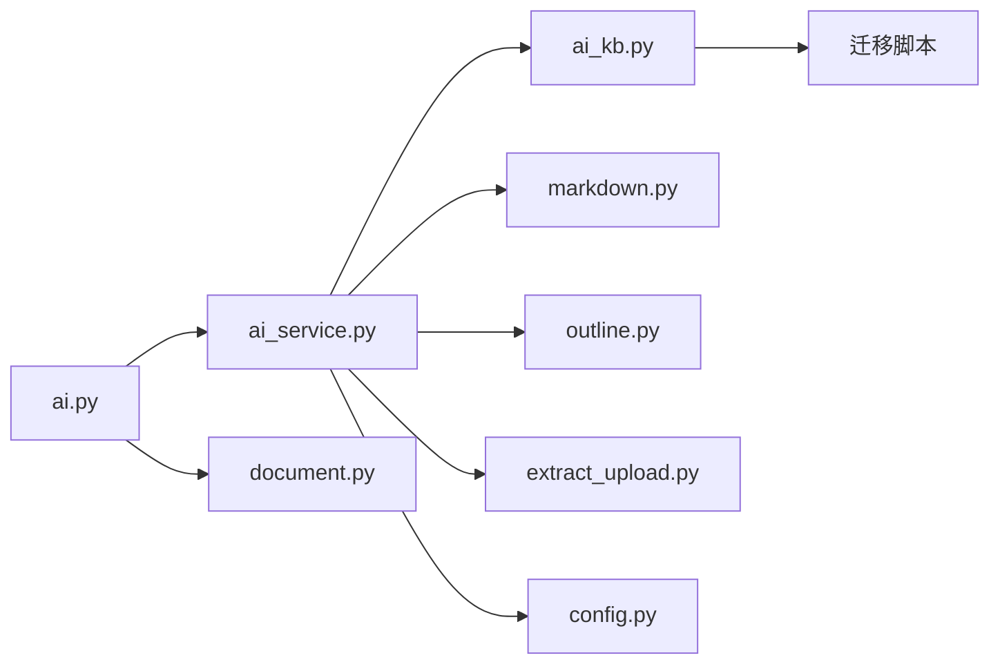

# AI知识库数据模型

<cite>
**本文引用的文件**
- [app/models/ai_kb.py](file://app/models/ai_kb.py)
- [app/services/ai_service.py](file://app/services/ai_service.py)
- [app/blueprints/ai.py](file://app/blueprints/ai.py)
- [app/utils/extract_upload.py](file://app/utils/extract_upload.py)
- [app/utils/markdown.py](file://app/utils/markdown.py)
- [app/utils/outline.py](file://app/utils/outline.py)
- [app/models/document.py](file://app/models/document.py)
- [app/services/doc_service.py](file://app/services/doc_service.py)
- [app/config.py](file://app/config.py)
- [scripts/migrate_aikb_source_uploads.sql](file://scripts/migrate_aikb_source_uploads.sql)
- [scripts/run_migrate_aikb_source_uploads.py](file://scripts/run_migrate_aikb_source_uploads.py)
</cite>

## 更新摘要
**变更内容**
- 新增 AIKBSourceKind 枚举，支持文档和上传两种源文档类型
- 添加上传功能相关的数据库字段和迁移脚本
- 新增上传文件抽取工具函数和处理流程
- 更新 AIKBSource 模型以支持外部上传文件
- 新增 display_title 属性用于区分显示标题

## 目录
1. [简介](#简介)
2. [项目结构](#项目结构)
3. [核心组件](#核心组件)
4. [架构总览](#架构总览)
5. [组件详解](#组件详解)
6. [依赖关系分析](#依赖关系分析)
7. [性能考量](#性能考量)
8. [故障排查指南](#故障排查指南)
9. [结论](#结论)
10. [附录](#附录)

## 简介
本技术文档聚焦于 My Wiki 的 AI 知识库数据模型，系统化阐述 Karpathy 风格 LLM Wiki 的知识组织方式与构建流程。重点包括：
- AIKnowledgeBase 模型的架构设计与状态管理
- AIKBSource 模型的源文档跟踪机制（支持文档和上传两种类型）
- AIKBArticle 模型的文章内容存储与组织
- AIKBLink 模型的链接解析与双向链接图谱
- AIKBChunk 模型的可选文本分片与向量化策略
- 上传功能的文件抽取与处理机制
- 构建流程、索引设计与搜索优化策略
- 扩展性与性能优化建议

## 项目结构
AI 知识库相关代码主要分布在以下模块：
- 数据模型层：app/models/ai_kb.py
- 服务层：app/services/ai_service.py
- 蓝图路由层：app/blueprints/ai.py
- 工具层：app/utils/markdown.py、app/utils/outline.py、app/utils/extract_upload.py
- 文档模型与服务：app/models/document.py、app/services/doc_service.py
- 配置：app/config.py
- 数据库迁移：scripts/migrate_aikb_source_uploads.sql、scripts/run_migrate_aikb_source_uploads.py

**图表来源**
- [app/models/ai_kb.py:22-146](file://app/models/ai_kb.py#L22-L146)
- [app/services/ai_service.py:430-470](file://app/services/ai_service.py#L430-L470)
- [app/blueprints/ai.py:153-206](file://app/blueprints/ai.py#L153-L206)
- [app/utils/extract_upload.py:1-126](file://app/utils/extract_upload.py#L1-L126)
- [scripts/migrate_aikb_source_uploads.sql:1-32](file://scripts/migrate_aikb_source_uploads.sql#L1-L32)
- [scripts/run_migrate_aikb_source_uploads.py:1-137](file://scripts/run_migrate_aikb_source_uploads.py#L1-L137)

**章节来源**
- [app/models/ai_kb.py:22-146](file://app/models/ai_kb.py#L22-L146)
- [app/services/ai_service.py:430-470](file://app/services/ai_service.py#L430-L470)
- [app/blueprints/ai.py:153-206](file://app/blueprints/ai.py#L153-L206)
- [app/utils/extract_upload.py:1-126](file://app/utils/extract_upload.py#L1-L126)
- [scripts/migrate_aikb_source_uploads.sql:1-32](file://scripts/migrate_aikb_source_uploads.sql#L1-L32)
- [scripts/run_migrate_aikb_source_uploads.py:1-137](file://scripts/run_migrate_aikb_source_uploads.py#L1-L137)

## 核心组件
- AIKBStatus 与 AIKBSourceStatus：定义知识库与源文档的生命周期状态，支持异步构建与失败重试。
- AIKBSourceKind：新增枚举，定义源文档类型（DOCUMENT：关联现有知识库文档；UPLOAD：上传的外部文件）。
- AIKnowledgeBase：知识库实体，记录拥有者、名称、描述、聊天模型、是否启用 RAG、状态与错误信息等。
- AIKBSource：源文档与知识库的多对多关联表，支持文档类型和上传类型，唯一约束确保同一文档不会重复加入。
- AIKBArticle：Karpathy 风格的 wiki 条目，包含标题、slug、摘要、标签、别名、内容与来源文档集合。
- AIKBLink：条目间的超链接，支持红链（未命中的占位链接）与双向链接统计。
- AIKBChunk：可选的文本分片与向量 ID 存储，配合外部向量数据库实现 RAG。

**章节来源**
- [app/models/ai_kb.py:8-146](file://app/models/ai_kb.py#L8-L146)

## 架构总览
AI 知识库采用"文档 -> 文章 -> 链接"的三层结构，现已扩展支持上传文件：
- 源文档来自知识库内的文档模型或外部上传文件，通过 AI 服务转换为统一格式的文章。
- 文章之间通过双链引用形成链接图谱，支持解析与渲染。
- 可选启用 RAG 时，文章内容被切分为片段并建立向量索引，用于检索增强问答。
- 上传文件支持 PDF、Word、文本、图片等多种格式，通过专用抽取器处理。

**图表来源**
- [app/models/ai_kb.py:22-146](file://app/models/ai_kb.py#L22-L146)

## 组件详解

### AIKnowledgeBase 模型与状态管理
- 关键字段：owner_id、name、description、chat_model、enable_rag、status、last_built_at、error_msg。
- 状态机：IDLE -> BUILDING -> READY/FAILED，支持失败重试与错误信息记录。
- 与用户的关系：通过外键关联到用户，实现按拥有者隔离。
- 与文档的关系：通过中间表 AIKBSource 关联到多个文档。

**章节来源**
- [app/models/ai_kb.py:22-44](file://app/models/ai_kb.py#L22-L44)

### AIKBSourceKind 枚举与源文档类型
- 新增枚举类型，定义两种源文档类型：
  - DOCUMENT：关联现有知识库文档，使用 doc_id 字段
  - UPLOAD：上传的外部文件，使用 upload_filename、upload_path、upload_ext、upload_bytes 字段
- 默认值为 DOCUMENT，确保向后兼容性
- 支持按类型索引查询，提高性能

**更新** 新增 AIKBSourceKind 枚举，支持文档和上传两种源文档类型

**章节来源**
- [app/models/ai_kb.py:47-50](file://app/models/ai_kb.py#L47-L50)

### AIKBSource 模型与源文档管理
- 唯一约束：同一知识库内同一文档只能加入一次。
- 字段：ai_kb_id、kind（新增）、doc_id（可空，新增）、upload_filename（新增）、upload_path（新增）、upload_ext（新增）、upload_bytes（新增）、status、err_msg、时间戳。
- 状态：PENDING、PROCESSING、PROCESSED、FAILED，支持增量构建与失败重试。
- 与文档的关联：通过 Document 外键，支持软删除后的状态判定。
- display_title 属性：根据 kind 返回不同的显示标题，上传文件显示原始文件名，文档显示文档标题。

**更新** 新增上传功能相关字段和 display_title 属性

**章节来源**
- [app/models/ai_kb.py:52-90](file://app/models/ai_kb.py#L52-L90)

### AIKBArticle 模型与文章组织
- 唯一约束：同一知识库内 slug 唯一，避免冲突。
- 字段：title、slug、summary、tags_json、aliases_json、content_md、source_doc_ids_json。
- 内容组织：采用 Markdown + 前言头（frontmatter）形式，便于静态文件输出与渲染。
- 别名与来源：支持别名解析与多源文档聚合，提升链接解析准确度。
- 源文档标识：上传文件使用 "upload:<source_id>" 格式标识，避免空值问题。

**更新** 上传文件使用特殊标识格式避免空值问题

**章节来源**
- [app/models/ai_kb.py:91-116](file://app/models/ai_kb.py#L91-L116)

### AIKBLink 模型与链接解析机制
- 双向链接：from_article_id -> to_article_id，支持红链（to_article_id 为空）。
- 解析流程：扫描文章内容中的 [[Title]]，构建别名索引（标题/别名/slug），生成链接记录。
- 渲染：支持将占位链接转换为实际路由，未命中的链接标记为红链。

**章节来源**
- [app/models/ai_kb.py:118-133](file://app/models/ai_kb.py#L118-L133)
- [app/services/ai_service.py:398-413](file://app/services/ai_service.py#L398-L413)
- [app/utils/markdown.py:28-87](file://app/utils/markdown.py#L28-L87)

### AIKBChunk 模型与文本分片策略
- 可选启用：仅当知识库开启 enable_rag 时使用。
- 字段：article_id、chunk_idx、content、vector_id。
- 设计意图：将长文章切分为固定大小的片段，便于向量化与检索；向量本体存储在外部向量数据库中，模型仅保留元数据与索引。

**章节来源**
- [app/models/ai_kb.py:135-146](file://app/models/ai_kb.py#L135-L146)

### 文档模型与内容提取
- Document 模型：包含 Editor.js JSON 内容与 plain_text，支持类型与隐私控制。
- 内容提取：从 Editor.js JSON 提取纯文本与简单 Markdown，供 AI 服务与搜索使用。
- 文档服务：提供树形结构展示、内容更新、软删除与后代收集等能力。

**章节来源**
- [app/models/document.py:20-98](file://app/models/document.py#L20-L98)
- [app/services/doc_service.py:11-81](file://app/services/doc_service.py#L11-L81)
- [app/utils/outline.py:22-136](file://app/utils/outline.py#L22-L136)

### 上传功能与文件抽取
- 支持格式：PDF、Word(.docx)、文本(.txt/.md)、图片(.png/.jpg/.jpeg/.webp/.gif/.bmp)
- 文件处理：安全文件名处理、扩展名保留、唯一文件名生成
- 服务器存储：相对 instance_path 的存储路径，便于跨平台部署
- 抽取工具：统一的文件内容抽取接口，支持不同格式的专业处理
- 多模态支持：图片文件通过多模态 LLM 进行 OCR 处理

**新增** 上传功能的文件抽取与处理机制

**图表来源**
- [app/blueprints/ai.py:153-206](file://app/blueprints/ai.py#L153-L206)
- [app/utils/extract_upload.py:99-126](file://app/utils/extract_upload.py#L99-L126)

**章节来源**
- [app/blueprints/ai.py:153-206](file://app/blueprints/ai.py#L153-L206)
- [app/utils/extract_upload.py:1-126](file://app/utils/extract_upload.py#L1-L126)

### AI 服务与构建流程
- LLM 客户端：封装 OpenAI 兼容 SDK，支持自定义 base_url、api_key、model。
- 文章构建：将文档内容转为统一的 WikiArticleDraft，写入 AIKBArticle 并持久化为 Markdown 文件。
- 链接解析：扫描所有文章的 [[...]]，重建 AIKBLink 表，统计解析数与红链数。
- 异步构建：后台线程执行构建任务，更新知识库状态与错误信息。
- 问答接口：基于关键词匹配选择 Top-N 文章作为上下文，调用 LLM 返回答案。
- 上传处理：上传文件先抽取为纯文本，再走通用 wiki 化流程。

**更新** 新增上传文件的处理流程

**图表来源**
- [app/blueprints/ai.py:153-206](file://app/blueprints/ai.py#L153-L206)
- [app/services/ai_service.py:430-465](file://app/services/ai_service.py#L430-L465)
- [app/utils/extract_upload.py:99-126](file://app/utils/extract_upload.py#L99-L126)

**章节来源**
- [app/services/ai_service.py:430-465](file://app/services/ai_service.py#L430-L465)
- [app/blueprints/ai.py:153-206](file://app/blueprints/ai.py#L153-L206)

### 数据库迁移与升级
- 迁移脚本：支持 MySQL 5.7+ / 8.x，提供幂等执行能力
- 字段升级：doc_id 改为可空，新增 kind、upload_* 相关字段
- 索引优化：为 kind 字段创建索引，提高查询性能
- 兼容性：自动回填历史数据为 DOCUMENT 类型

**新增** 数据库迁移脚本支持上传功能

**章节来源**
- [scripts/migrate_aikb_source_uploads.sql:1-32](file://scripts/migrate_aikb_source_uploads.sql#L1-L32)
- [scripts/run_migrate_aikb_source_uploads.py:1-137](file://scripts/run_migrate_aikb_source_uploads.py#L1-L137)

### 链接解析算法
- 别名索引：标题、slug、aliases_json 构建大小写不敏感映射。
- 链接扫描：正则提取 [[Target|Anchor]] 或 [[Target]]，去重后逐项解析。
- 红链统计：未命中的链接计入 redlink 计数，便于可视化与修复。

**图表来源**
- [app/services/ai_service.py:398-413](file://app/services/ai_service.py#L398-L413)
- [app/utils/markdown.py:69-87](file://app/utils/markdown.py#L69-L87)

**章节来源**
- [app/services/ai_service.py:398-413](file://app/services/ai_service.py#L398-L413)
- [app/utils/markdown.py:69-87](file://app/utils/markdown.py#L69-L87)

### 搜索与索引设计
- 关键词重叠评分：对问题进行分词，统计每个文章中命中词的数量，Top-N 作为上下文。
- 上下文截断：限制单篇文章上下文长度，平衡性能与召回。
- 纯文本提取：从 Editor.js JSON 中抽取纯文本，用于快速检索与 AI 输入。

**章节来源**
- [app/services/ai_service.py:568-585](file://app/services/ai_service.py#L568-L585)
- [app/utils/outline.py:58-87](file://app/utils/outline.py#L58-L87)

## 依赖关系分析
- 模型间依赖：AIKnowledgeBase 与 AIKBSource、AIKBArticle、AIKBLink、AIKBChunk 通过外键关联。
- 服务依赖：ai_service 依赖 models、utils、config，负责构建、解析与问答。
- 蓝图依赖：ai.py 负责路由与视图渲染，调用 ai_service 与 kb_service。
- 工具依赖：markdown.py 提供 wiki 链接解析与渲染；outline.py 提供 Editor.js 内容处理；extract_upload.py 提供文件抽取功能。
- 迁移依赖：数据库迁移脚本依赖 pymysql 进行动态 SQL 执行。

**图表来源**
- [app/blueprints/ai.py:153-206](file://app/blueprints/ai.py#L153-L206)
- [app/services/ai_service.py:430-470](file://app/services/ai_service.py#L430-L470)
- [app/models/ai_kb.py:22-146](file://app/models/ai_kb.py#L22-L146)
- [app/utils/extract_upload.py:1-126](file://app/utils/extract_upload.py#L1-L126)
- [scripts/migrate_aikb_source_uploads.sql:1-32](file://scripts/migrate_aikb_source_uploads.sql#L1-L32)

**章节来源**
- [app/blueprints/ai.py:153-206](file://app/blueprints/ai.py#L153-L206)
- [app/services/ai_service.py:430-470](file://app/services/ai_service.py#L430-L470)
- [app/models/ai_kb.py:22-146](file://app/models/ai_kb.py#L22-L146)
- [app/utils/extract_upload.py:1-126](file://app/utils/extract_upload.py#L1-L126)
- [scripts/migrate_aikb_source_uploads.sql:1-32](file://scripts/migrate_aikb_source_uploads.sql#L1-L32)

## 性能考量
- 异步构建：后台线程执行构建，避免阻塞主线程，提高用户体验。
- 状态与增量：仅处理 PENDING/FAILED 的源文档，支持失败重试与断点续做。
- 文本截断：问答时限制上下文长度，减少 LLM 调用成本与延迟。
- 索引与查询：别名索引与唯一约束减少重复计算与冲突；链接解析前先去重，降低扫描开销。
- 向量化可选：仅在启用 RAG 时进行分片与向量化，避免不必要的存储与计算。
- 上传优化：上传文件使用相对路径存储，支持并发处理，避免磁盘空间不足。
- 数据库索引：kind 字段索引提高上传类型查询性能。

**更新** 新增上传功能的性能考量

## 故障排查指南
- 构建失败：检查知识库状态与错误信息字段，定位 LLM 调用异常或文档缺失。
- 红链过多：通过链接解析统计与可视化页面识别未命中的链接，补充或修正别名。
- 文档不可见：确认文档隐私设置与访问权限，确保用户具备访问知识库的权限。
- 链接渲染异常：检查 wiki 链接正则与解析器逻辑，确保锚文本与 slug 映射正确。
- 上传失败：检查文件格式支持、磁盘空间、文件权限，查看上传日志。
- 数据库迁移：确认 DATABASE_URL 配置、MySQL 版本兼容性，查看迁移脚本输出。

**更新** 新增上传功能和数据库迁移的故障排查

**章节来源**
- [app/blueprints/ai.py:159-173](file://app/blueprints/ai.py#L159-L173)
- [app/services/ai_service.py:461-465](file://app/services/ai_service.py#L461-L465)
- [app/utils/markdown.py:42-66](file://app/utils/markdown.py#L42-L66)

## 结论
该数据模型以 Karpathy 的 LLM Wiki 方法为基础，结合双向链接与可选 RAG，实现了从文档到知识图谱再到问答的完整闭环。通过清晰的状态机、唯一约束与异步构建流程，保证了系统的可靠性与可维护性。新增的上传功能进一步扩展了知识库的数据来源，支持多种格式的文件处理。通过向量检索、分片策略与缓存层的持续优化，系统能够支撑更大规模的知识库需求。

**更新** 新增上传功能和数据库迁移支持

## 附录

### 配置要点
- OPENAI_BASE_URL、OPENAI_API_KEY、CHAT_MODEL：LLM 客户端参数。
- AI_WIKI_DIR：Markdown 文件输出目录。
- ENABLE_RAG、EMBEDDING_MODEL、CHROMA_PATH：可选 RAG 参数。

**章节来源**
- [app/config.py:37-47](file://app/config.py#L37-L47)

### 支持的上传格式
- 文本文件：.txt、.md、.markdown
- PDF 文件：.pdf
- Word 文档：.docx
- 图片文件：.png、.jpg、.jpeg、.webp、.gif、.bmp

**新增** 上传格式支持列表

**章节来源**
- [app/utils/extract_upload.py:15-22](file://app/utils/extract_upload.py#L15-L22)

### 数据库迁移步骤
1. 运行迁移脚本：`python scripts/run_migrate_aikb_source_uploads.py`
2. 验证迁移结果：检查 ai_kb_sources 表结构变化
3. 测试上传功能：尝试上传不同类型文件
4. 清理历史数据：确认 kind 字段回填正确

**新增** 数据库迁移操作指南

**章节来源**
- [scripts/run_migrate_aikb_source_uploads.py:67-132](file://scripts/run_migrate_aikb_source_uploads.py#L67-L132)