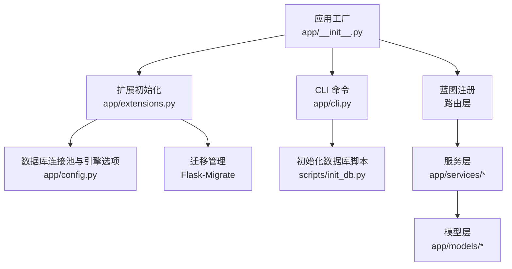
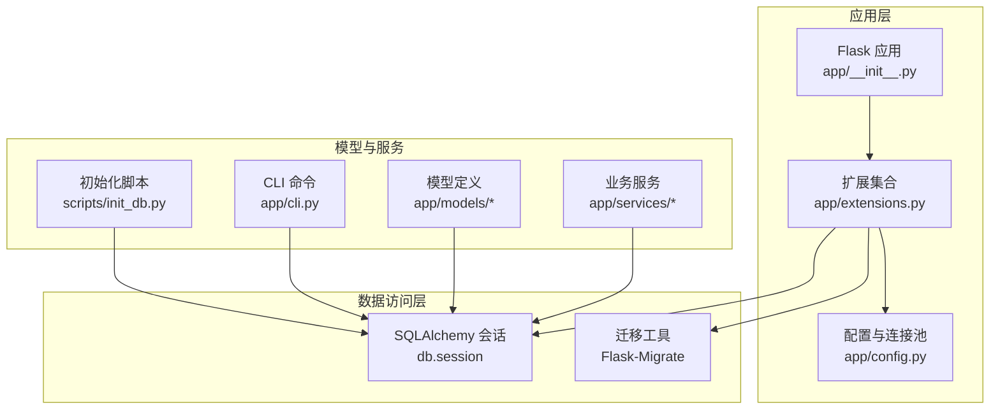
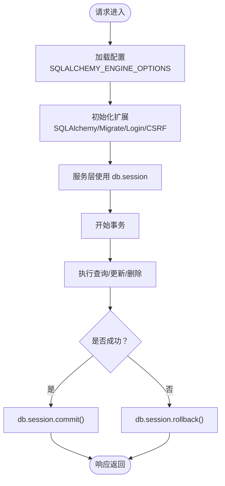
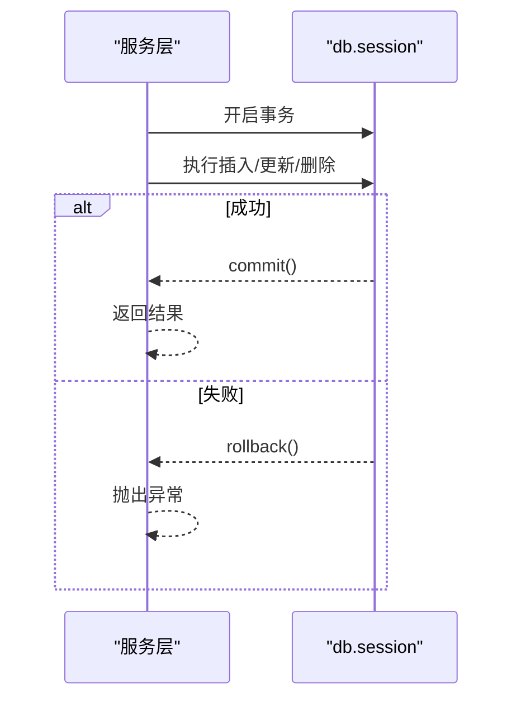
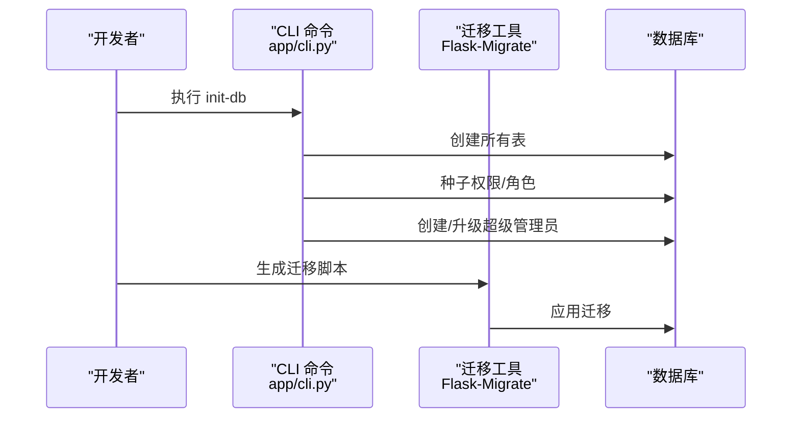
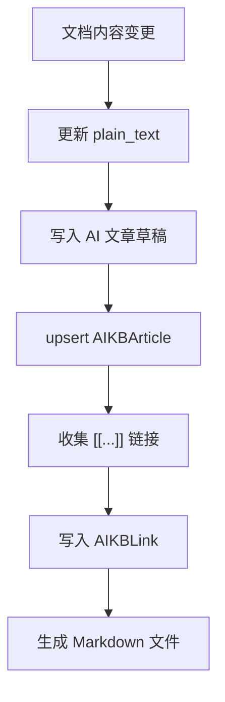
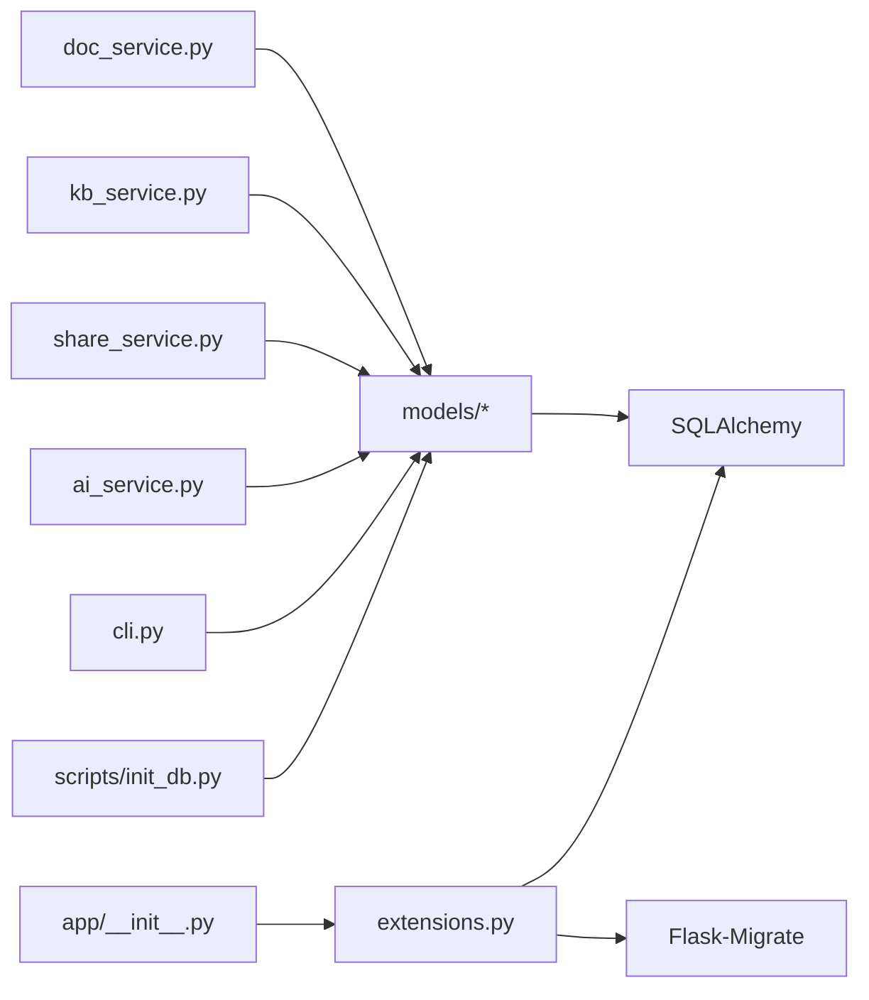

# 数据库管理

<cite>
**本文引用的文件**
- [app/config.py](file://app/config.py)
- [app/extensions.py](file://app/extensions.py)
- [app/__init__.py](file://app/__init__.py)
- [app/cli.py](file://app/cli.py)
- [scripts/init_db.py](file://scripts/init_db.py)
- [requirements.txt](file://requirements.txt)
- [app/models/__init__.py](file://app/models/__init__.py)
- [app/models/user.py](file://app/models/user.py)
- [app/models/document.py](file://app/models/document.py)
- [app/models/knowledge_base.py](file://app/models/knowledge_base.py)
- [app/models/ai_kb.py](file://app/models/ai_kb.py)
- [app/services/doc_service.py](file://app/services/doc_service.py)
- [app/services/kb_service.py](file://app/services/kb_service.py)
- [app/services/share_service.py](file://app/services/share_service.py)
- [app/services/ai_service.py](file://app/services/ai_service.py)
</cite>

## 目录
1. [简介](#简介)
2. [项目结构](#项目结构)
3. [核心组件](#核心组件)
4. [架构总览](#架构总览)
5. [详细组件分析](#详细组件分析)
6. [依赖分析](#依赖分析)
7. [性能考虑](#性能考虑)
8. [故障排查指南](#故障排查指南)
9. [结论](#结论)
10. [附录](#附录)

## 简介
本文件面向 My Wiki 的数据库管理，围绕以下主题展开：数据库连接池与会话管理、事务处理机制、数据库迁移与版本管理、数据同步策略、索引与查询优化、缓存策略、备份恢复与监控告警、安全配置与访问控制、审计日志、以及生产环境部署中的高可用设计与配置优化。文档以代码为依据，结合架构图与流程图，帮助开发者与运维人员快速理解并落地数据库相关实践。

## 项目结构
My Wiki 使用 Flask + Flask-SQLAlchemy 构建，数据库相关能力集中在应用工厂、扩展初始化、模型定义、服务层与 CLI 命令中。核心路径如下：
- 配置与连接池：app/config.py、app/extensions.py
- 应用工厂与扩展注册：app/__init__.py
- 迁移与版本管理：Flask-Migrate（通过 app/extensions.py 与 app/cli.py 集成）
- 模型与业务服务：app/models/*、app/services/*
- 初始化与种子数据：scripts/init_db.py、app/cli.py

图表来源
- [app/__init__.py:11-28](file://app/__init__.py#L11-L28)
- [app/extensions.py:8-11](file://app/extensions.py#L8-L11)
- [app/config.py:18-26](file://app/config.py#L18-L26)
- [app/cli.py:61-95](file://app/cli.py#L61-L95)
- [scripts/init_db.py:23-47](file://scripts/init_db.py#L23-L47)

章节来源
- [app/config.py:15-26](file://app/config.py#L15-L26)
- [app/extensions.py:8-11](file://app/extensions.py#L8-L11)
- [app/__init__.py:39-43](file://app/__init__.py#L39-L43)
- [app/cli.py:61-95](file://app/cli.py#L61-L95)
- [scripts/init_db.py:23-47](file://scripts/init_db.py#L23-L47)

## 核心组件
- 数据库连接池与引擎选项
  - 通过 SQLALCHEMY_ENGINE_OPTIONS 设置 pool_pre_ping 与 pool_recycle，确保连接健康与回收。
  - 默认使用 MySQL（PyMySQL），可通过 DATABASE_URL 覆盖。
- 扩展与应用工厂
  - SQLAlchemy、Migrate、LoginManager、CSRFProtect 在 app/extensions.py 中集中初始化。
  - 应用工厂在 app/__init__.py 中注册扩展、蓝图、错误处理、上下文处理器与 CLI。
- 迁移与版本管理
  - Flask-Migrate 与 SQLAlchemy 集成，支持数据库模式变更与版本演进。
- 模型与关系
  - 用户/角色/权限 RBAC、知识库/成员/可见性、文档/分享、AI 知识库/文章/链接等。
- 服务层与事务
  - 服务层统一使用 db.session 进行增删改查与提交，遵循“一次请求一个事务”的实践。

章节来源
- [app/config.py:18-26](file://app/config.py#L18-L26)
- [app/extensions.py:8-11](file://app/extensions.py#L8-L11)
- [app/__init__.py:39-53](file://app/__init__.py#L39-L53)
- [app/models/__init__.py:16-37](file://app/models/__init__.py#L16-L37)

## 架构总览
下图展示数据库相关模块的交互关系：应用工厂负责装配扩展与配置；服务层通过 db.session 访问模型；迁移工具维护数据库版本；CLI 提供初始化与种子数据能力。

图表来源
- [app/__init__.py:39-43](file://app/__init__.py#L39-L43)
- [app/extensions.py:8-11](file://app/extensions.py#L8-L11)
- [app/config.py:18-26](file://app/config.py#L18-L26)
- [app/cli.py:61-95](file://app/cli.py#L61-L95)
- [scripts/init_db.py:23-47](file://scripts/init_db.py#L23-L47)

## 详细组件分析

### 数据库连接池与会话管理
- 连接池配置
  - pool_pre_ping：每次获取连接前进行健康检查，自动剔除失效连接。
  - pool_recycle：连接最大生命周期，避免长时间占用导致的资源泄漏。
- 会话与事务
  - 服务层与 CLI 中统一使用 db.session 进行读写与提交，遵循“一次请求一个事务”的原则。
  - 登录状态与权限判断均通过 db.session 查询与提交完成。
- 会话 Cookie 安全
  - 通过 SESSION_COOKIE_HTTPONLY、SESSION_COOKIE_SAMESITE 等配置降低 XSS 与 CSRF 风险。

图表来源
- [app/config.py:23-26](file://app/config.py#L23-L26)
- [app/extensions.py:8-11](file://app/extensions.py#L8-L11)
- [app/__init__.py:39-53](file://app/__init__.py#L39-L53)
- [app/services/doc_service.py:56-62](file://app/services/doc_service.py#L56-L62)

章节来源
- [app/config.py:23-26](file://app/config.py#L23-L26)
- [app/__init__.py:39-53](file://app/__init__.py#L39-L53)
- [app/services/doc_service.py:56-62](file://app/services/doc_service.py#L56-L62)

### 事务处理机制
- 事务边界
  - 每个服务方法通常包裹在一个事务内，失败则回滚，成功则提交。
- 典型场景
  - 创建文档、更新内容、软删除、添加成员、创建分享等均在单次事务中完成。
- 错误处理
  - 服务层捕获异常并回滚，保证数据一致性。

图表来源
- [app/services/doc_service.py:37-53](file://app/services/doc_service.py#L37-L53)
- [app/services/kb_service.py:65-74](file://app/services/kb_service.py#L65-L74)
- [app/services/share_service.py:15-31](file://app/services/share_service.py#L15-L31)

章节来源
- [app/services/doc_service.py:37-62](file://app/services/doc_service.py#L37-L62)
- [app/services/kb_service.py:65-74](file://app/services/kb_service.py#L65-L74)
- [app/services/share_service.py:15-31](file://app/services/share_service.py#L15-L31)

### 数据库迁移策略与版本管理
- 工具链
  - Flask-Migrate 与 SQLAlchemy 集成，通过 app/extensions.py 初始化。
  - CLI 命令 app/cli.py 提供初始化数据库与种子数据。
- 迁移流程
  - 修改模型后生成迁移脚本，应用迁移以保持数据库与代码一致。
- 初始化流程
  - scripts/init_db.py 或 flask init-db 命令创建表、填充默认权限/角色、创建超级管理员。

图表来源
- [app/extensions.py:9](file://app/extensions.py#L9)
- [app/cli.py:61-95](file://app/cli.py#L61-L95)
- [scripts/init_db.py:23-47](file://scripts/init_db.py#L23-L47)

章节来源
- [app/extensions.py:9](file://app/extensions.py#L9)
- [app/cli.py:61-95](file://app/cli.py#L61-L95)
- [scripts/init_db.py:23-47](file://scripts/init_db.py#L23-L47)

### 数据同步方案
- 内容同步
  - 文档内容变更时，同时更新 plain_text 字段，便于搜索与 AI 索引。
- 分享与访问控制
  - 文档分享通过 DocumentShare 表记录 token、密码、有效期与访问计数，配合服务层校验有效性。
- AI 知识库同步
  - AIKBSource 记录源文档到 AI 文章的映射，AIKBLink 建立条目间双向链接，支持异步构建与重生成。

图表来源
- [app/services/doc_service.py:56-62](file://app/services/doc_service.py#L56-L62)
- [app/services/ai_service.py:204-230](file://app/services/ai_service.py#L204-L230)
- [app/services/ai_service.py:251-278](file://app/services/ai_service.py#L251-L278)

章节来源
- [app/services/doc_service.py:56-62](file://app/services/doc_service.py#L56-L62)
- [app/services/ai_service.py:204-230](file://app/services/ai_service.py#L204-L230)
- [app/services/ai_service.py:251-278](file://app/services/ai_service.py#L251-L278)

### 索引优化与查询性能调优
- 索引策略
  - 用户：username、email、is_super_admin、id 主键。
  - 角色/权限：code 唯一且带索引。
  - 知识库：owner_id、visibility、is_archived、id 主键。
  - 文档：kb_id、parent_id、privacy、is_deleted、author_id、id 主键。
  - 分享：token 唯一且带索引，doc_id 带索引。
  - AI 知识库：owner_id、status、id 主键。
  - AI 文章：ai_kb_id、slug 唯一索引。
  - AI 链接：ai_kb_id、from_article_id、to_article_id。
- 查询优化建议
  - 使用 select 加载与联结（如 lazy="joined"）减少 N+1 查询。
  - 对高频过滤字段（如 is_deleted、privacy、visibility）建立复合索引。
  - 对分页查询使用 order_by + limit，避免全表扫描。

章节来源
- [app/models/user.py:55-103](file://app/models/user.py#L55-L103)
- [app/models/knowledge_base.py:19-61](file://app/models/knowledge_base.py#L19-L61)
- [app/models/document.py:20-97](file://app/models/document.py#L20-L97)
- [app/models/ai_kb.py:22-120](file://app/models/ai_kb.py#L22-L120)

### 缓存策略
- 应用层缓存
  - 可在服务层对热点查询结果进行短期缓存（如基于内存的简单字典缓存或 Redis）。
- 数据层缓存
  - 合理使用数据库索引与物化视图（如需要）提升查询性能。
- 注意事项
  - 缓存需与写操作保持一致性，采用写后失效或写时更新策略。

[本节为通用指导，不直接分析具体文件，故无章节来源]

### 备份恢复、监控告警与故障处理
- 备份恢复
  - 建议使用数据库原生命令或管理工具定期导出/导入（如 mysqldump）。
  - 生产环境建议开启二进制日志与增量备份，确保时间点恢复能力。
- 监控告警
  - 监控指标：连接池使用率、慢查询、事务等待时间、锁等待、QPS/TPS。
  - 告警阈值：连接池空闲/耗尽、事务超时、慢查询超过阈值。
- 故障处理
  - 连接池耗尽：扩容实例或优化连接复用；检查 pool_recycle 与 pool_pre_ping。
  - 死锁/长事务：定位慢查询与大事务，拆分批量操作，缩短事务时间。

[本节为通用指导，不直接分析具体文件，故无章节来源]

### 安全配置、访问控制与审计日志
- 安全配置
  - 使用强密码与独立数据库账号；限制网络访问；启用 TLS。
  - 通过 SQLALCHEMY_ENGINE_OPTIONS 的 pool_pre_ping 与 pool_recycle 提升连接安全性。
- 访问控制
  - RBAC：用户、角色、权限三者关系通过中间表维护，权限继承于角色。
  - 知识库访问：根据可见性（私有/成员/公开）、成员角色与拥有者判定。
- 审计日志
  - 建议在 db.session.commit() 前后记录关键操作日志（如用户、对象、操作类型、时间戳），并落库或输出到集中日志系统。

章节来源
- [app/config.py:23-26](file://app/config.py#L23-L26)
- [app/models/user.py:10-53](file://app/models/user.py#L10-L53)
- [app/services/kb_service.py:10-23](file://app/services/kb_service.py#L10-L23)

### 生产环境部署中的数据库配置优化与高可用
- 连接池优化
  - pool_size 与 max_overflow：根据并发与数据库承载能力设置；结合 pool_pre_ping 与 pool_recycle。
- 高可用
  - 主从复制/集群：使用 MySQL Group Replication 或 Proxy 层（如 MaxScale/HAProxy）实现读写分离与故障切换。
- 配置隔离
  - 通过 DATABASE_URL 环境变量区分开发/测试/生产数据库；生产环境使用只读副本用于查询。
- 性能基线
  - 基于慢查询日志与性能监控持续优化索引与查询计划。

[本节为通用指导，不直接分析具体文件，故无章节来源]

## 依赖分析
- 组件耦合
  - 服务层依赖 db.session 与模型层；模型层依赖 SQLAlchemy；应用工厂与扩展负责装配。
- 外部依赖
  - Flask-SQLAlchemy、Flask-Migrate、PyMySQL、SQLAlchemy。
- 循环依赖
  - 当前结构清晰，无明显循环依赖。

图表来源
- [app/services/doc_service.py:6-8](file://app/services/doc_service.py#L6-L8)
- [app/services/kb_service.py:6-7](file://app/services/kb_service.py#L6-L7)
- [app/services/share_service.py:6-8](file://app/services/share_service.py#L6-L8)
- [app/services/ai_service.py:29-38](file://app/services/ai_service.py#L29-L38)
- [app/cli.py:4-5](file://app/cli.py#L4-L5)
- [scripts/init_db.py:17-20](file://scripts/init_db.py#L17-L20)
- [app/__init__.py:39-43](file://app/__init__.py#L39-L43)
- [app/extensions.py:8-11](file://app/extensions.py#L8-L11)

章节来源
- [requirements.txt:1-21](file://requirements.txt#L1-L21)
- [app/__init__.py:39-43](file://app/__init__.py#L39-L43)
- [app/extensions.py:8-11](file://app/extensions.py#L8-L11)

## 性能考虑
- 连接池参数
  - pool_pre_ping：提升连接可用性，减少无效连接。
  - pool_recycle：避免长时间占用导致的资源泄漏。
- 查询与索引
  - 对高频过滤字段建立索引；使用 select 加载与联结减少 N+1。
- 事务与批处理
  - 将多个写操作合并到单个事务中，减少提交次数；对大批量写入使用分批处理。
- 缓存与归档
  - 对热点数据进行缓存；对历史数据进行归档或分区，降低主表压力。

[本节提供通用指导，不直接分析具体文件，故无章节来源]

## 故障排查指南
- 连接池耗尽
  - 现象：请求阻塞或超时。
  - 排查：检查 pool_size/max_overflow 设置；确认是否存在未关闭的连接；观察 pool_pre_ping 是否生效。
- 事务冲突与死锁
  - 现象：提交失败或长时间等待。
  - 排查：定位慢查询与大事务；拆分批量操作；调整锁粒度。
- 权限不足
  - 现象：访问被拒绝。
  - 排查：确认用户角色与权限分配；检查角色权限继承链。
- 分享链接失效
  - 现象：分享链接无法访问或提示过期。
  - 排查：检查 DocumentShare 的有效期、密码与撤销状态。

章节来源
- [app/config.py:23-26](file://app/config.py#L23-L26)
- [app/services/kb_service.py:10-23](file://app/services/kb_service.py#L10-L23)
- [app/services/share_service.py:39-43](file://app/services/share_service.py#L39-L43)

## 结论
My Wiki 的数据库管理以 Flask-SQLAlchemy 为核心，结合 Flask-Migrate 实现迁移与版本控制，通过服务层统一事务管理与数据访问。配置层面采用连接池健康检查与回收策略，模型层通过合理的索引与关系设计支撑业务查询。生产环境中应进一步完善备份恢复、监控告警与高可用方案，并强化安全与审计能力，确保系统稳定与数据安全。

## 附录
- 关键配置项
  - DATABASE_URL：数据库连接字符串。
  - SQLALCHEMY_ENGINE_OPTIONS：pool_pre_ping、pool_recycle。
  - SESSION_COOKIE_HTTPONLY/SAMESITE：会话安全配置。
- 常用命令
  - flask init-db：初始化数据库、种子数据与超级管理员。
  - 自定义脚本 scripts/init_db.py：独立初始化入口。

章节来源
- [app/config.py:18-31](file://app/config.py#L18-L31)
- [app/cli.py:61-95](file://app/cli.py#L61-L95)
- [scripts/init_db.py:23-47](file://scripts/init_db.py#L23-L47)