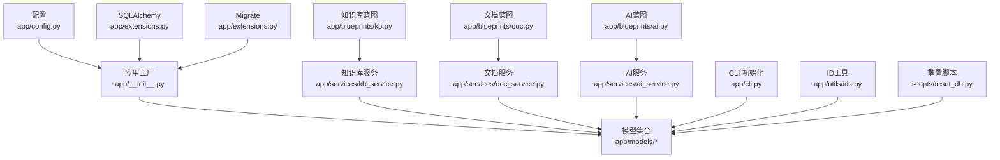
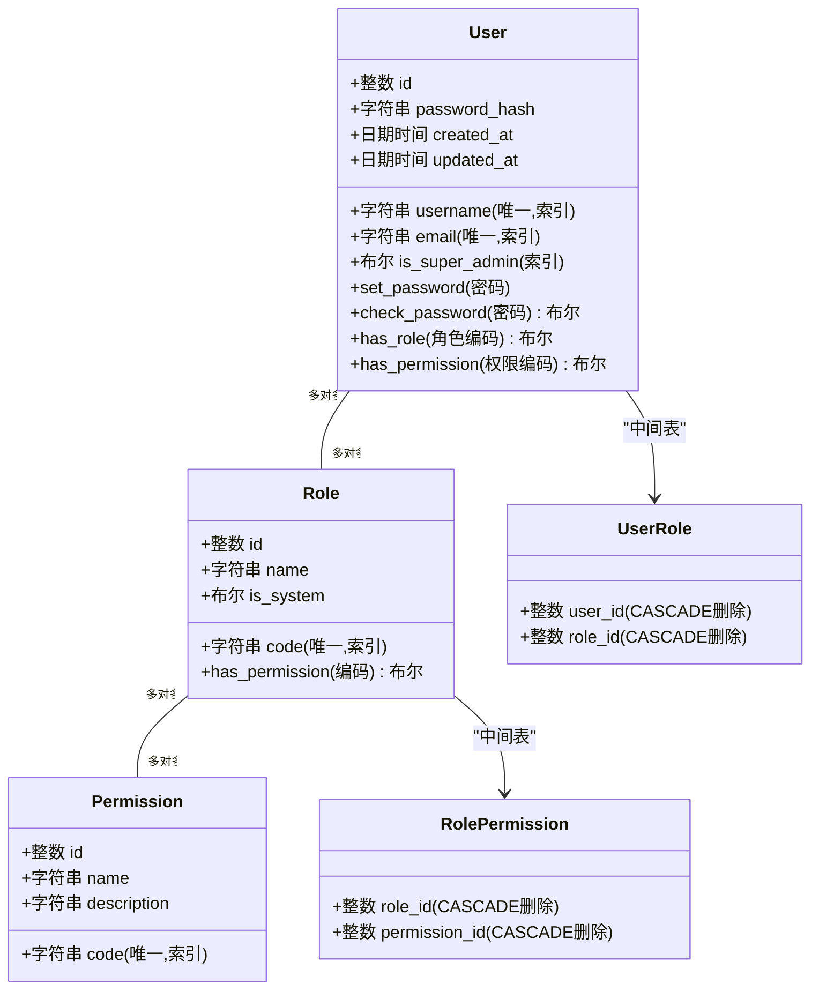
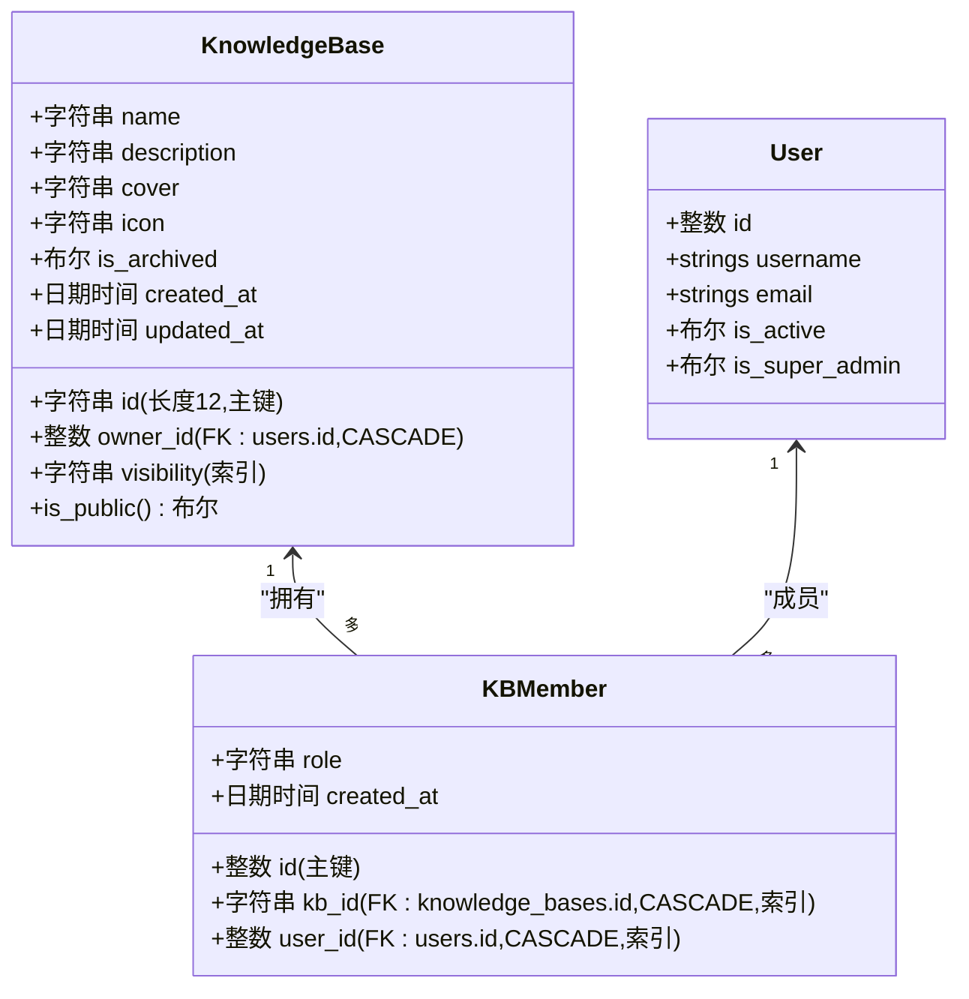
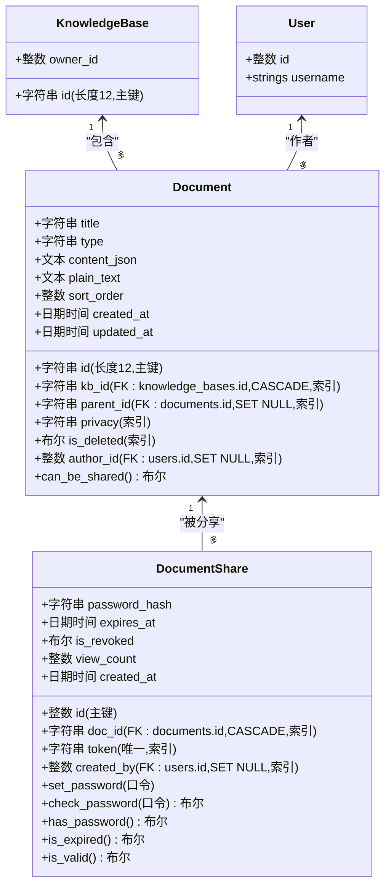
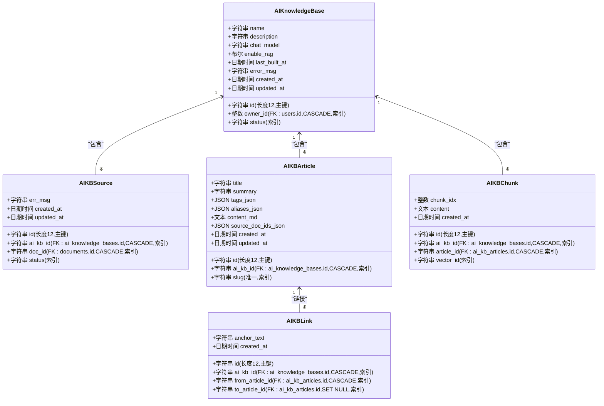
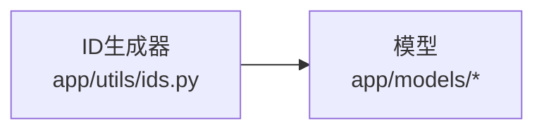
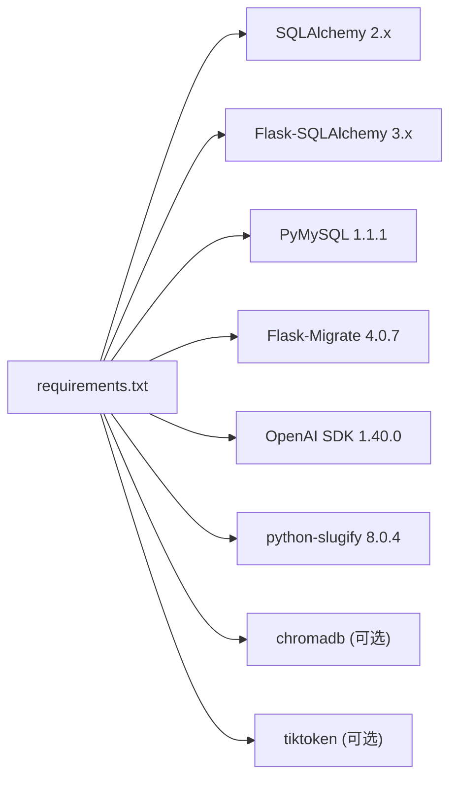

# 数据持久化架构

<cite>
**本文引用的文件**
- [app/models/__init__.py](file://app/models/__init__.py)
- [app/extensions.py](file://app/extensions.py)
- [app/models/user.py](file://app/models/user.py)
- [app/models/knowledge_base.py](file://app/models/knowledge_base.py)
- [app/models/document.py](file://app/models/document.py)
- [app/models/ai_kb.py](file://app/models/ai_kb.py)
- [app/__init__.py](file://app/__init__.py)
- [app/config.py](file://app/config.py)
- [app/services/kb_service.py](file://app/services/kb_service.py)
- [app/services/doc_service.py](file://app/services/doc_service.py)
- [app/services/ai_service.py](file://app/services/ai_service.py)
- [app/cli.py](file://app/cli.py)
- [app/blueprints/ai.py](file://app/blueprints/ai.py)
- [app/blueprints/kb.py](file://app/blueprints/kb.py)
- [app/blueprints/doc.py](file://app/blueprints/doc.py)
- [app/utils/ids.py](file://app/utils/ids.py)
- [scripts/reset_db.py](file://scripts/reset_db.py)
- [requirements.txt](file://requirements.txt)
</cite>

## 更新摘要
**变更内容**
- 完成ID系统从整数主键到字符串主键的全面迁移，所有核心模型采用长度为12的字符串ID
- 新增通用ID生成器工具类，支持URL友好型随机ID生成
- 更新数据库重置脚本以适配新的字符串主键结构
- 所有服务层和蓝图层代码已更新以支持新的字符串ID类型

## 目录
1. [简介](#简介)
2. [项目结构](#项目结构)
3. [核心组件](#核心组件)
4. [架构总览](#架构总览)
5. [详细组件分析](#详细组件分析)
6. [ID系统迁移影响](#id系统迁移影响)
7. [依赖关系分析](#依赖关系分析)
8. [性能考量](#性能考量)
9. [故障排查指南](#故障排查指南)
10. [结论](#结论)
11. [附录](#附录)

## 简介
本文件系统性阐述 My Wiki 的数据持久化架构，重点覆盖 SQLAlchemy ORM 的配置与使用、数据库连接管理、模型定义规范与关系映射策略，并深入解析以下核心模型的设计理念与交互关系：User 模型（用户信息与权限）、KnowledgeBase 模型（知识库结构）、Document 模型（文档存储）、AIKnowledgeBase 模型（AI 知识库实现）。同时，文档涵盖模型间关系设计、外键约束、索引优化、查询性能考虑，以及数据库迁移机制、版本管理与数据一致性保障策略。

**更新** 完成ID系统从整数主键到字符串主键的全面迁移，所有核心模型采用长度为12的字符串ID，提升了URL友好性和安全性。

## 项目结构
My Wiki 的数据层采用"应用工厂 + 扩展单例"的模式组织，SQLAlchemy 与 Flask-Migrate 通过扩展单例集中管理，模型在统一入口导出，服务层通过 db.session 进行事务控制与查询封装。ID系统迁移后，所有模型主键统一采用字符串类型，配合专用ID生成器确保全局唯一性。

```mermaid
graph TB
subgraph "应用层"
APP["应用工厂<br/>app/__init__.py"]
CFG["配置模块<br/>app/config.py"]
EXT["扩展单例<br/>app/extensions.py"]
AI_BP["AI蓝图<br/>app/blueprints/ai.py"]
KB_BP["知识库蓝图<br/>app/blueprints/kb.py"]
DOC_BP["文档蓝图<br/>app/blueprints/doc.py"]
END
subgraph "数据层"
DB["SQLAlchemy 实例<br/>db"]
MIG["迁移实例<br/>migrate"]
MODELS["模型包<br/>app/models/*"]
SVC_KB["知识库服务<br/>app/services/kb_service.py"]
SVC_DOC["文档服务<br/>app/services/doc_service.py"]
SVC_AI["AI服务<br/>app/services/ai_service.py"]
UTILS["ID工具<br/>app/utils/ids.py"]
RESET_SCRIPT["重置脚本<br/>scripts/reset_db.py"]
END
subgraph "外部依赖"
REQ["依赖清单<br/>requirements.txt"]
OPENAI["OpenAI SDK"]
CHROMA["ChromaDB (可选)"]
END
CFG --> APP
EXT --> APP
APP --> DB
APP --> MIG
DB --> MODELS
MIG --> MODELS
SVC_KB --> DB
SVC_DOC --> DB
SVC_AI --> DB
AI_BP --> SVC_AI
KB_BP --> SVC_KB
DOC_BP --> SVC_DOC
UTILS --> MODELS
RESET_SCRIPT --> DB
REQ --> APP
REQ --> OPENAI
REQ --> CHROMA
```

**图表来源**
- [app/__init__.py:11-54](file://app/__init__.py#L11-L54)
- [app/config.py:15-26](file://app/config.py#L15-L26)
- [app/extensions.py:8-11](file://app/extensions.py#L8-L11)
- [app/blueprints/ai.py:1-281](file://app/blueprints/ai.py#L1-L281)
- [app/blueprints/kb.py:1-171](file://app/blueprints/kb.py#L1-L171)
- [app/blueprints/doc.py:1-142](file://app/blueprints/doc.py#L1-L142)
- [app/utils/ids.py:1-21](file://app/utils/ids.py#L1-L21)
- [scripts/reset_db.py:1-56](file://scripts/reset_db.py#L1-L56)
- [requirements.txt:1-22](file://requirements.txt#L1-L22)

**章节来源**
- [app/__init__.py:11-54](file://app/__init__.py#L11-L54)
- [app/config.py:15-26](file://app/config.py#L15-L26)
- [app/extensions.py:8-11](file://app/extensions.py#L8-L11)
- [app/blueprints/ai.py:1-281](file://app/blueprints/ai.py#L1-L281)
- [app/blueprints/kb.py:1-171](file://app/blueprints/kb.py#L1-L171)
- [app/blueprints/doc.py:1-142](file://app/blueprints/doc.py#L1-L142)
- [app/utils/ids.py:1-21](file://app/utils/ids.py#L1-L21)
- [scripts/reset_db.py:1-56](file://scripts/reset_db.py#L1-L56)
- [requirements.txt:1-22](file://requirements.txt#L1-L22)

## 核心组件
- 扩展单例与初始化
  - SQLAlchemy 实例与 Flask-Migrate 实例通过扩展单例集中管理，应用工厂在启动时调用 init_app 完成绑定。
  - 登录管理器注册用户加载器，从 db.session 获取用户对象。
- 配置与连接池
  - 通过环境变量 DATABASE_URL 设置数据库连接字符串，默认 MySQL（utf8mb4 字符集）。
  - 启用 pool_pre_ping 与 pool_recycle，确保连接健康与回收。
- 模型导出
  - 模型包统一导出所有实体，便于服务层按需导入。
- ID系统迁移
  - 所有核心模型主键从整数类型迁移到字符串类型（长度12）。
  - 新增通用ID生成器工具类，支持URL友好型随机ID生成。
  - 数据库重置脚本已更新以适配新的字符串主键结构。

**章节来源**
- [app/extensions.py:8-11](file://app/extensions.py#L8-L11)
- [app/__init__.py:39-54](file://app/__init__.py#L39-L54)
- [app/config.py:18-26](file://app/config.py#L18-L26)
- [app/models/__init__.py:16-37](file://app/models/__init__.py#L16-L37)
- [app/utils/ids.py:1-21](file://app/utils/ids.py#L1-L21)
- [scripts/reset_db.py:1-56](file://scripts/reset_db.py#L1-L56)

## 架构总览
下图展示数据持久化层的整体交互：应用工厂负责装配扩展与注册蓝图；模型定义承载业务实体与关系；服务层通过 db.session 执行事务与查询；CLI 提供初始化与种子数据能力；迁移框架负责版本演进与一致性；AI服务层提供异步构建和链接解析功能。ID系统迁移后，所有模型统一采用字符串主键，提升了系统的可扩展性和安全性。



**图表来源**
- [app/__init__.py:11-54](file://app/__init__.py#L11-L54)
- [app/extensions.py:8-11](file://app/extensions.py#L8-L11)
- [app/config.py:18-26](file://app/config.py#L18-L26)
- [app/services/kb_service.py:1-115](file://app/services/kb_service.py#L1-L115)
- [app/services/doc_service.py:1-81](file://app/services/doc_service.py#L1-L81)
- [app/services/ai_service.py:1-408](file://app/services/ai_service.py#L1-L408)
- [app/cli.py:61-114](file://app/cli.py#L61-L114)
- [app/utils/ids.py:1-21](file://app/utils/ids.py#L1-L21)
- [scripts/reset_db.py:1-56](file://scripts/reset_db.py#L1-L56)

## 详细组件分析

### 用户与权限模型（RBAC）
- 设计要点
  - 用户表 users 存储认证与基本信息，主键仍为整数类型，支持唯一索引以提升查询效率。
  - 角色表 roles 与权限表 permissions 通过中间表 role_permissions 建立多对多关系。
  - 用户与角色通过中间表 user_roles 建立多对多关系，支持"超级管理员"快速授权路径。
  - 密码采用哈希存储，提供便捷的校验方法。
- 关系映射
  - User 与 Role 通过 user_roles 中间表关联，使用 joined 加载策略减少 N+1 查询。
  - Role 与 Permission 通过 role_permissions 中间表关联，支持动态回溯。
- 外键与约束
  - 中间表 user_roles 与 role_permissions 使用 CASCADE 删除策略，保持级联一致性。
  - 用户与角色/权限字段均设置外键约束，确保引用完整性。
- 查询与性能
  - 在 User.has_permission 中优先判断超级管理员，避免不必要的中间表查询。
  - 对 username、email、role.code、permission.code 等关键字段建立唯一索引或普通索引，加速过滤与去重。



**图表来源**
- [app/models/user.py:10-104](file://app/models/user.py#L10-L104)

**章节来源**
- [app/models/user.py:10-104](file://app/models/user.py#L10-L104)

### 知识库模型（KnowledgeBase 与成员）
- 设计要点
  - KnowledgeBase 记录知识库元信息与可见性，主键采用长度为12的字符串ID，owner_id 外键指向用户，支持私有/成员/公开三种可见性。
  - KBMember 表记录成员与角色，使用唯一约束防止重复成员，主键仍为整数类型，支持 viewer/editor 角色。
  - 可见性与成员查询在服务层进行组合判断，确保访问控制一致性。
- 关系映射
  - KnowledgeBase 与 User 为一对多（拥有者），通过 backref 暴露 owned_kbs。
  - KBMember 与 KnowledgeBase/User 为多对一，成员列表使用 cascade="all, delete-orphan" 确保孤儿删除。
- 外键与约束
  - 所有外键均设置 CASCADE 删除，保证父实体删除时子实体一致性。
  - 成员表使用唯一约束 (kb_id, user_id)，避免重复成员。
- 查询与性能
  - 通过索引字段 visibility、owner_id、member.user_id 等加速过滤与关联查询。
  - 服务层提供 can_access/can_edit/can_manage 等策略函数，统一权限判定逻辑。



**图表来源**
- [app/models/knowledge_base.py:19-82](file://app/models/knowledge_base.py#L19-L82)

**章节来源**
- [app/models/knowledge_base.py:19-82](file://app/models/knowledge_base.py#L19-L82)
- [app/services/kb_service.py:10-115](file://app/services/kb_service.py#L10-L115)

### 文档模型（Document 与分享）
- 设计要点
  - Document 支持树形结构（父子关系），主键采用长度为12的字符串ID，通过 parent_id 外键自关联，支持层级排序与软删除。
  - 内容采用 Editor.js JSON 结构存储，同时维护纯文本用于搜索与 AI 索引。
  - 分享模型 DocumentShare 支持口令保护、过期时间与访问计数，令牌唯一且带索引。
- 关系映射
  - Document 与 KnowledgeBase 为多对一，作者与用户为多对一。
  - Document 与自身通过 parent_id 自关联，形成树形层级。
  - DocumentShare 与 Document 为一对一（通过 backref），使用 cascade="all, delete-orphan"。
- 外键与约束
  - 父节点删除时设置为 NULL（SET NULL），避免级联删除影响树结构。
  - 分享令牌唯一，防止重复生成。
- 查询与性能
  - 通过索引字段 kb_id、parent_id、author_id、is_deleted 等优化树形遍历与过滤。
  - 服务层提供树形构建与后代收集算法，结合数据库索引实现高效查询。



**图表来源**
- [app/models/document.py:20-99](file://app/models/document.py#L20-L99)

**章节来源**
- [app/models/document.py:20-99](file://app/models/document.py#L20-L99)
- [app/services/doc_service.py:11-81](file://app/services/doc_service.py#L11-L81)

### AI 知识库模型（Karpathy 风格）
- 设计要点
  - AIKnowledgeBase 记录 AI 知识库状态（空闲/构建中/就绪/失败）、启用 RAG、模型选择等，主键采用长度为12的字符串ID。
  - AIKBSource 跟踪已加入 AI 知识库的源文档，记录处理状态与错误信息，主键采用长度为12的字符串ID。
  - AIKBArticle 对应 Wiki 条目，采用 slug 唯一约束，支持别名与来源文档集合。
  - AIKBLink 维护条目间的链接关系，支持红链（未命中的链接）。
  - AIKBChunk 存储切分元数据（向量本体存储于外部 ChromaDB）。
- 关系映射
  - AIKnowledgeBase 与 User 为多对一（拥有者）。
  - AIKBSource 与 AIKnowledgeBase/Document 为多对一。
  - AIKBArticle 与 AIKnowledgeBase 为多对一，文章间通过 links 建立自关联。
  - AIKBChunk 与 AIKnowledgeBase/AIKBArticle 为多对一。
- 外键与约束
  - 所有外键均设置 CASCADE 删除，保证 AI 知识库生命周期内的一致性。
  - 源文档与文章均使用唯一约束避免重复。
- 查询与性能
  - 通过索引字段 status、ai_kb_id、slug、vector_id 等优化状态筛选与检索。
  - 服务层可基于这些模型实现 AI 知识库的构建、更新与查询流程。



**图表来源**
- [app/models/ai_kb.py:22-122](file://app/models/ai_kb.py#L22-L122)

**章节来源**
- [app/models/ai_kb.py:22-122](file://app/models/ai_kb.py#L22-L122)

### 数据库迁移机制与版本管理
- 迁移集成
  - 应用工厂在启动时将 db 实例与迁移实例绑定，确保迁移命令可用。
  - 迁移实例默认使用 SQLAlchemy 元数据作为变更源，自动检测模型变化。
- 版本管理
  - 通过 Flask-Migrate 的命令行工具生成与应用迁移脚本，保持数据库结构与模型同步。
  - 建议在开发与生产环境中遵循"先迁移，后部署"的流程，确保一致性。
- 数据一致性
  - 外键约束与 CASCADE 删除策略在模型层面明确声明，配合数据库引擎保证参照完整性。
  - 服务层在关键操作中使用 db.session 进行事务封装，避免部分写入导致的数据不一致。

**章节来源**
- [app/__init__.py:40-43](file://app/__init__.py#L40-L43)
- [app/extensions.py:8-11](file://app/extensions.py#L8-L11)

### CLI 初始化与种子数据
- 初始化流程
  - CLI 提供 init-db 命令，自动创建表结构、填充默认权限与角色、创建或激活超级管理员，并附加系统角色。
  - create-user 命令用于创建普通用户并分配默认角色。
  - 新增AI相关权限（ai.use）和默认角色（user、moderator、admin）。
- 种子数据
  - 默认权限与角色在 CLI 中集中定义，确保新环境具备最小可用权限体系。
  - 包含AI知识库使用的权限，支持用户创建和管理AI知识库。
- 事务与幂等
  - CLI 对重复项进行查询与更新，避免重复创建；提交事务确保原子性。

**章节来源**
- [app/cli.py:61-114](file://app/cli.py#L61-L114)

### AI服务与异步处理
- LLM客户端
  - 封装OpenAI兼容SDK，支持多种AI供应商（OpenAI、DeepSeek、Tongyi、本地代理）。
  - 从应用配置读取base_url、api_key和model，提供统一的聊天接口。
- Wiki构建器
  - 实现Karpathy风格的LLM Wiki方法论，将源文档转换为结构化的wiki条目。
  - 支持别名、标签、相关条目引用和前置元数据生成。
- 链接解析器
  - 扫描文章中的[[...]]占位符，解析为双向超链接关系。
  - 维护红链（未命中的链接）统计，支持图谱渲染。
- 异步构建管道
  - 支持后台线程执行构建任务，避免阻塞主线程。
  - 提供增量构建和重新生成功能，支持部分文档更新。

**章节来源**
- [app/services/ai_service.py:1-408](file://app/services/ai_service.py#L1-L408)

### AI蓝图与前端集成
- 路由设计
  - 提供AI知识库的完整CRUD操作，包括创建、编辑、删除和状态管理。
  - 支持源文档添加、构建任务启动和状态查询。
- Wiki浏览
  - 实现wiki条目的浏览、标签分组和链接重写功能。
  - 支持条目再生和图谱可视化。
- 聊天功能
  - 提供基于wiki内容的问答功能，支持纯文本检索和可选的RAG增强。
  - 支持引用条目的标注和答案生成。

**章节来源**
- [app/blueprints/ai.py:1-281](file://app/blueprints/ai.py#L1-L281)

## ID系统迁移影响

### 迁移概述
My Wiki 完成了从整数主键到字符串主键的全面迁移，所有核心业务模型均采用长度为12的字符串ID。这一变更提升了系统的URL友好性、安全性和可扩展性。

### 主要变更点
- **主键类型统一**：KnowledgeBase、Document、AIKnowledgeBase、AIKBSource、AIKBArticle、AIKBLink、AIKBChunk 等模型的主键全部从整数类型迁移到字符串类型
- **ID生成策略**：引入专用的ID生成器，使用长度为12的随机字符串作为主键，字符集经过精心设计以提升可读性
- **外键关系调整**：所有外键字段相应更新为字符串类型，保持引用完整性
- **索引优化**：针对字符串ID的查询特点重新评估和优化索引策略

### ID生成器实现
系统采用URL友好型的随机ID生成器，基于安全的随机数生成器，字符集去除了易混淆字符（0、O、1、l、I），确保生成的ID既安全又易于阅读。



**图表来源**
- [app/utils/ids.py:1-21](file://app/utils/ids.py#L1-L21)

### 迁移后的模型结构
所有核心模型的主键都已更新为字符串类型，具体变更如下：

- **KnowledgeBase**：主键从 `db.Integer` 迁移到 `db.String(12)`，默认值使用 `generate_id` 函数
- **Document**：主键从 `db.Integer` 迁移到 `db.String(12)`，默认值使用 `generate_id` 函数  
- **AIKnowledgeBase**：主键从 `db.Integer` 迁移到 `db.String(12)`，默认值使用 `generate_id` 函数
- **AIKBSource**：主键从 `db.Integer` 迁移到 `db.String(12)`，默认值使用 `generate_id` 函数
- **AIKBArticle**：主键从 `db.Integer` 迁移到 `db.String(12)`，默认值使用 `generate_id` 函数
- **AIKBLink**：主键从 `db.Integer` 迁移到 `db.String(12)`，默认值使用 `generate_id` 函数
- **AIKBChunk**：主键从 `db.Integer` 迁移到 `db.String(12)`，默认值使用 `generate_id` 函数

### 服务层适配
所有服务层代码已更新以支持新的字符串ID类型，包括：
- 查询方法中的ID参数类型从 `int` 更新为 `str`
- 外键赋值时使用字符串ID而非整数ID
- 事务处理和错误处理逻辑保持不变

### 蓝图层适配
路由处理函数已更新以接受字符串ID参数：
- `_get_kb_or_404`、`_get_doc_or_404`、`_get_ai_kb_or_404` 等辅助函数的参数类型更新
- URL路由中的ID参数类型从 `int` 更新为 `str`
- 错误处理和权限验证逻辑保持不变

### 数据库重置
专门的重置脚本已更新以适配新的字符串主键结构：
- 自动删除所有现有表并重新创建
- 使用字符串主键类型创建新表结构
- 重新填充权限和角色数据

**章节来源**
- [app/utils/ids.py:1-21](file://app/utils/ids.py#L1-L21)
- [app/models/knowledge_base.py:25](file://app/models/knowledge_base.py#L25)
- [app/models/document.py:24](file://app/models/document.py#L24)
- [app/models/ai_kb.py:26](file://app/models/ai_kb.py#L26)
- [app/services/kb_service.py:14](file://app/services/kb_service.py#L14)
- [app/services/doc_service.py:37](file://app/services/doc_service.py#L37)
- [app/blueprints/ai.py:18](file://app/blueprints/ai.py#L18)
- [app/blueprints/kb.py:14](file://app/blueprints/kb.py#L14)
- [app/blueprints/doc.py:13](file://app/blueprints/doc.py#L13)
- [scripts/reset_db.py:22-56](file://scripts/reset_db.py#L22-L56)

## 依赖关系分析
- 组件耦合
  - 模型层仅依赖扩展单例 db，低耦合便于测试与替换。
  - 服务层通过 db.session 与模型交互，职责清晰。
- 外部依赖
  - SQLAlchemy 2.x 与 Flask-SQLAlchemy 3.x 提供 ORM 能力与 Flask 集成。
  - PyMySQL 1.1.1 作为 MySQL 驱动，支持 utf8mb4 字符集。
  - Flask-Migrate 4.0.7 提供迁移能力，配合 Alembic 实现版本演进。
  - OpenAI SDK 1.40.0 支持AI知识库的LLM功能。
  - python-slugify 8.0.4 提供URL友好的slug生成。
  - 可选：chromadb 和 tiktoken 用于RAG增强功能。



**图表来源**
- [requirements.txt:1-22](file://requirements.txt#L1-L22)

**章节来源**
- [requirements.txt:1-22](file://requirements.txt#L1-L22)

## 性能考量
- 索引策略
  - 在高频过滤字段（如 username、email、role.code、permission.code、visibility、owner_id、kb_id、parent_id、author_id、is_deleted、token、slug、vector_id）建立索引，显著降低查询成本。
  - AI知识库新增索引：ai_knowledge_bases.status、ai_kb_sources.status、ai_kb_articles.slug、ai_kb_chunks.vector_id。
  - 字符串ID查询性能优化：针对长度固定的12字符ID，数据库引擎可以更好地优化索引查找。
- 查询模式
  - 使用 joined 加载策略减少 N+1 查询；对树形结构采用一次性全量加载与内存构建，避免深层递归。
  - 在服务层聚合查询（如 union）时注意索引与排序字段的匹配。
  - AI知识库查询优化：使用状态过滤、slug唯一约束和向量ID索引。
- 连接池与回收
  - pool_pre_ping 与 pool_recycle 配置确保连接健康与资源回收，降低长连接失效带来的异常。
- 文本与 JSON
  - 大文本字段（content_json、plain_text、content_md）使用合适的数据类型与索引策略，必要时分离全文检索与结构化查询。
  - JSON字段使用Text类型存储，避免索引限制。
- 异步处理
  - AI知识库构建使用后台线程，避免阻塞请求处理。
  - 支持增量构建，只处理状态为pending或failed的源文档。
- ID系统优化
  - 字符串ID采用固定长度设计，便于数据库索引优化和内存管理。
  - URL友好型字符集设计，提升用户体验和安全性。

## 故障排查指南
- 迁移相关
  - 若迁移失败，检查模型外键与索引是否符合数据库约束；确认迁移脚本未手动修改导致与元数据不一致。
  - 验证所有外键关系是否正确更新为字符串类型。
- 权限与访问
  - 若用户无法访问知识库，检查可见性、成员表与超级管理员标记；核对服务层 can_access 判定逻辑。
- 文档树与分享
  - 若树形显示异常，检查 parent_id 与 is_deleted 字段；确认排序字段与空值处理。
  - 若分享链接无效，检查令牌唯一性、口令校验、过期时间与撤销状态。
- 初始化问题
  - 若初始化失败，确认数据库连接字符串与字符集设置；检查 CLI 是否正确创建表与种子数据。
  - 验证ID生成器是否正常工作，确保生成的ID符合预期格式。
- AI知识库问题
  - 若构建失败，检查OpenAI API配置、网络连接和模型可用性。
  - 若链接解析异常，检查别名索引构建和占位符格式。
  - 若RAG功能异常，确认向量数据库配置和嵌入模型设置。
- ID系统问题
  - 若出现ID格式错误，检查ID生成器配置和使用方式。
  - 验证所有字符串ID参数传递是否正确，避免类型转换错误。

**章节来源**
- [app/services/kb_service.py:10-115](file://app/services/kb_service.py#L10-L115)
- [app/services/doc_service.py:11-81](file://app/services/doc_service.py#L11-L81)
- [app/cli.py:61-114](file://app/cli.py#L61-L114)
- [app/services/ai_service.py:1-408](file://app/services/ai_service.py#L1-L408)
- [app/utils/ids.py:1-21](file://app/utils/ids.py#L1-L21)

## 结论
My Wiki 的数据持久化架构以 SQLAlchemy ORM 为核心，结合 Flask 扩展与服务层封装，实现了清晰的模型边界与稳定的查询性能。通过合理的索引策略、外键约束与迁移机制，系统在功能扩展与数据一致性之间取得了良好平衡。

**更新** 完成ID系统从整数主键到字符串主键的全面迁移，所有核心模型采用长度为12的字符串ID，显著提升了系统的URL友好性、安全性和可扩展性。新增的ID生成器工具类确保了全局唯一性和良好的可读性。迁移后的系统在保持原有功能的基础上，进一步增强了用户体验和系统安全性。

建议在后续迭代中持续关注查询性能指标与索引覆盖率，并完善自动化测试与监控告警，以保障生产环境的稳定性与可维护性。同时，随着AI功能的不断完善，建议增加专门的AI知识库监控和性能优化策略。

## 附录
- 关键字段与索引建议
  - 用户：username、email（唯一+索引）、is_super_admin（索引）
  - 角色/权限：code（唯一+索引）
  - 知识库：owner_id、visibility（索引）、id（字符串主键）
  - 成员：kb_id、user_id（唯一约束）、索引
  - 文档：kb_id、parent_id、author_id、is_deleted（索引）、id（字符串主键）
  - 分享：doc_id、token（唯一+索引）
  - AI 知识库：owner_id、status（索引）、id（字符串主键）
  - AI源文档：ai_kb_id、doc_id（唯一约束）、status（索引）、id（字符串主键）
  - AI文章：ai_kb_id、slug（唯一约束）、title（索引）、id（字符串主键）
  - AI链接：ai_kb_id、from_article_id、to_article_id（索引）、id（字符串主键）
  - AI分块：ai_kb_id、article_id、chunk_idx、vector_id（索引）、id（字符串主键）

- AI配置参数
  - OPENAI_BASE_URL：OpenAI兼容API的基础URL
  - OPENAI_API_KEY：API密钥
  - CHAT_MODEL：默认聊天模型
  - ENABLE_RAG：是否启用RAG增强
  - EMBEDDING_MODEL：嵌入模型
  - CHROMA_PATH：向量数据库路径
  - AI_WIKI_DIR：AI wiki文件存储目录

- ID生成器参数
  - 字符长度：12
  - 字符集：去除易混淆字符的URL友好型字符集
  - 碰撞概率：约5.8e20，满足个人wiki规模需求
  - 用途：所有核心模型的主键生成