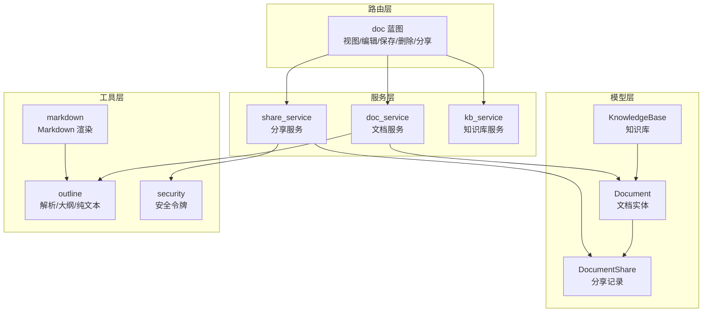
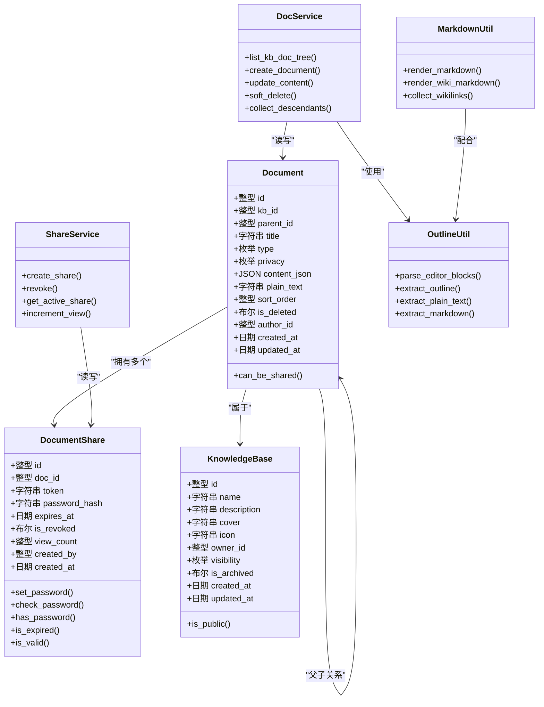
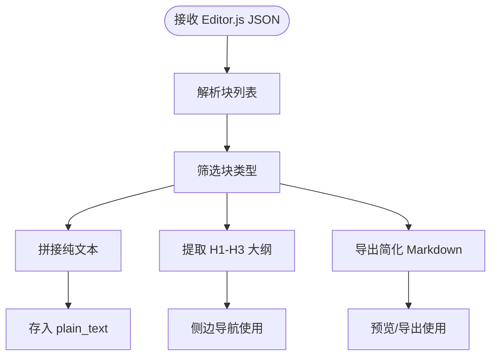
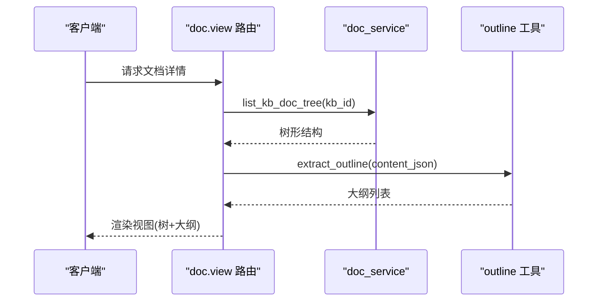
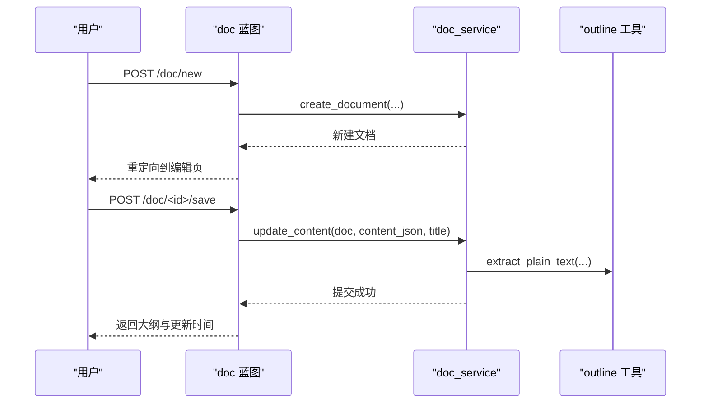
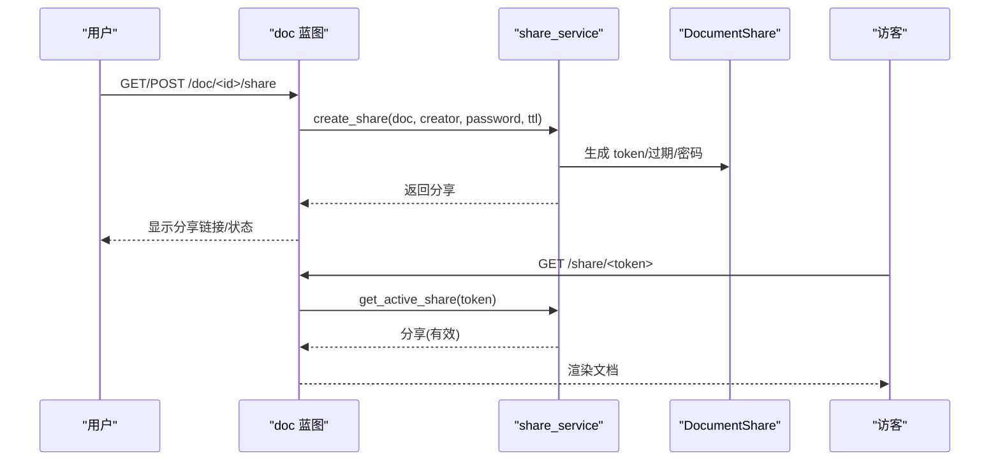
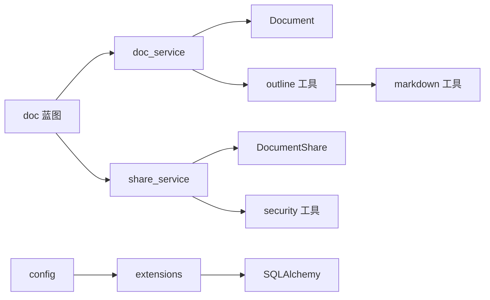

# 文档模型

<cite>
**本文引用的文件**
- [app/models/document.py](file://app/models/document.py)
- [app/services/doc_service.py](file://app/services/doc_service.py)
- [app/blueprints/doc.py](file://app/blueprints/doc.py)
- [app/utils/outline.py](file://app/utils/outline.py)
- [app/utils/markdown.py](file://app/utils/markdown.py)
- [app/services/share_service.py](file://app/services/share_service.py)
- [app/models/knowledge_base.py](file://app/models/knowledge_base.py)
- [app/services/kb_service.py](file://app/services/kb_service.py)
- [app/utils/security.py](file://app/utils/security.py)
- [app/extensions.py](file://app/extensions.py)
- [app/config.py](file://app/config.py)
</cite>

## 目录
1. [简介](#简介)
2. [项目结构](#项目结构)
3. [核心组件](#核心组件)
4. [架构总览](#架构总览)
5. [详细组件分析](#详细组件分析)
6. [依赖分析](#依赖分析)
7. [性能考虑](#性能考虑)
8. [故障排查指南](#故障排查指南)
9. [结论](#结论)
10. [附录](#附录)

## 简介
本文件面向 My Wiki 的“文档模型”，系统性阐述文档的数据结构设计、富文本内容存储与渲染、文档树组织与导航、文档生命周期操作（创建/编辑/删除/移动）、内容检索与摘要、以及分享与访问控制机制。文档模型以 Editor.js JSON 作为富文本载体，通过纯文本抽取支持搜索与 AI 摘要，并以层级树形结构组织知识库内的文档。

## 项目结构
My Wiki 采用 Flask + SQLAlchemy 架构，文档模型位于 models 层，业务逻辑封装在 services 层，路由入口在 blueprints 层，工具函数位于 utils 层。核心模块如下：
- 数据模型：Document、DocumentShare、KnowledgeBase
- 服务层：doc_service、share_service、kb_service
- 路由层：doc 蓝图
- 工具层：outline（编辑器块解析、大纲/纯文本提取）、markdown（Markdown 渲染）
- 安全与配置：security（令牌生成）、extensions（扩展初始化）、config（配置）

图表来源
- [app/models/document.py:20-53](file://app/models/document.py#L20-L53)
- [app/models/knowledge_base.py:19-42](file://app/models/knowledge_base.py#L19-L42)
- [app/services/doc_service.py:11-34](file://app/services/doc_service.py#L11-L34)
- [app/services/share_service.py:15-31](file://app/services/share_service.py#L15-L31)
- [app/blueprints/doc.py:20-40](file://app/blueprints/doc.py#L20-L40)
- [app/utils/outline.py:22-55](file://app/utils/outline.py#L22-L55)
- [app/utils/markdown.py:31-39](file://app/utils/markdown.py#L31-L39)
- [app/utils/security.py:5-7](file://app/utils/security.py#L5-L7)

章节来源
- [app/models/document.py:1-98](file://app/models/document.py#L1-L98)
- [app/services/doc_service.py:1-81](file://app/services/doc_service.py#L1-L81)
- [app/blueprints/doc.py:1-139](file://app/blueprints/doc.py#L1-L139)
- [app/utils/outline.py:1-136](file://app/utils/outline.py#L1-L136)
- [app/utils/markdown.py:1-87](file://app/utils/markdown.py#L1-L87)
- [app/services/share_service.py:1-49](file://app/services/share_service.py#L1-L49)
- [app/models/knowledge_base.py:1-62](file://app/models/knowledge_base.py#L1-L62)
- [app/services/kb_service.py:1-80](file://app/services/kb_service.py#L1-L80)
- [app/utils/security.py:1-8](file://app/utils/security.py#L1-L8)
- [app/extensions.py:1-17](file://app/extensions.py#L1-L17)
- [app/config.py:1-83](file://app/config.py#L1-L83)

## 核心组件
- 文档实体 Document：包含标题、类型、隐私、Editor.js JSON 内容、纯文本摘要、排序、软删除标记、作者、创建/更新时间等字段；支持与知识库、用户、父子文档的关系映射。
- 分享实体 DocumentShare：记录分享令牌、密码哈希、过期时间、是否撤销、访问计数、创建者与时间；提供密码设置/校验、有效期判断、有效性判定。
- 文档服务 doc_service：提供文档树构建、创建、内容更新（含纯文本抽取）、软删除、后代收集等能力。
- 分享服务 share_service：负责分享创建（含过期时间与密码）、撤销、有效分享查询、访问计数递增。
- 知识库服务 kb_service：基于可见性与成员角色判定访问/编辑/管理权限。
- 工具 outline：解析 Editor.js JSON 块、提取大纲（H1-H3）、提取纯文本、导出简化 Markdown。
- 工具 markdown：渲染 Markdown 并进行 HTML 白名单清理，支持维基链接替换与去重。

章节来源
- [app/models/document.py:20-98](file://app/models/document.py#L20-L98)
- [app/services/doc_service.py:11-81](file://app/services/doc_service.py#L11-L81)
- [app/services/share_service.py:15-49](file://app/services/share_service.py#L15-L49)
- [app/services/kb_service.py:10-45](file://app/services/kb_service.py#L10-L45)
- [app/utils/outline.py:22-136](file://app/utils/outline.py#L22-L136)
- [app/utils/markdown.py:31-87](file://app/utils/markdown.py#L31-L87)

## 架构总览
文档模型围绕“知识库-文档-分享”三层展开，蓝图负责请求处理与权限校验，服务层封装数据操作与转换，工具层提供内容解析与渲染。

图表来源
- [app/models/document.py:20-98](file://app/models/document.py#L20-L98)
- [app/models/knowledge_base.py:19-42](file://app/models/knowledge_base.py#L19-L42)
- [app/services/doc_service.py:11-81](file://app/services/doc_service.py#L11-L81)
- [app/services/share_service.py:15-49](file://app/services/share_service.py#L15-L49)
- [app/utils/outline.py:22-136](file://app/utils/outline.py#L22-L136)
- [app/utils/markdown.py:31-87](file://app/utils/markdown.py#L31-L87)

## 详细组件分析

### 文档实体与数据结构
- 字段设计要点
  - 标题与类型：标题默认值与类型枚举确保一致性；类型支持“文档/表格”两类。
  - 隐私与分享：隐私枚举控制是否允许分享；can_be_shared 属性用于快速判断。
  - 富文本存储：content_json 使用 JSON 存储 Editor.js blocks；plain_text 用于搜索与 AI 摘要。
  - 排序与删除：sort_order 控制同级顺序；is_deleted 支持软删除。
  - 关系映射：kb、author、parent、children 实现知识库归属、作者归属与父子树形关系。
- 复杂度与索引
  - 外键与索引覆盖 kb_id、parent_id、privacy、is_deleted 等常用过滤字段，有利于树查询与隐私筛选。
  - 父子自引用外键支持动态回溯与子节点查询。

章节来源
- [app/models/document.py:20-53](file://app/models/document.py#L20-L53)

### 富文本内容存储与渲染
- Editor.js JSON 结构
  - 解析入口：parse_editor_blocks 将 JSON 字符串转为块数组，兼容顶层对象或空结构。
  - 块类型覆盖：标题、段落、列表、任务清单、引用、代码、表格、分隔线、图片等。
- 大纲提取
  - extract_outline 仅提取 H1-H3，生成锚点（含重复去重），便于侧边栏导航。
- 纯文本与简化 Markdown
  - extract_plain_text 将块内容拼接为纯文本，适配搜索与 AI 输入。
  - extract_markdown 将块转换为简化 Markdown，便于预览或导出。
- Markdown 渲染
  - render_markdown 使用 Markdown 扩展与 Bleach 白名单清理，保证安全输出。
  - render_wiki_markdown 支持维基链接替换，保留占位锚点供路由层重写。

图表来源
- [app/utils/outline.py:22-55](file://app/utils/outline.py#L22-L55)
- [app/utils/outline.py:58-87](file://app/utils/outline.py#L58-L87)
- [app/utils/outline.py:90-136](file://app/utils/outline.py#L90-L136)
- [app/utils/markdown.py:31-39](file://app/utils/markdown.py#L31-L39)

章节来源
- [app/utils/outline.py:22-136](file://app/utils/outline.py#L22-L136)
- [app/utils/markdown.py:31-87](file://app/utils/markdown.py#L31-L87)

### 文档树结构与导航
- 树构建算法
  - 先按父节点分组，再递归构建嵌套列表，优先显示根节点，随后按 sort_order 与 id 排序。
  - 仅包含非删除文档，确保树稳定。
- 导航逻辑
  - 视图页加载时，调用 list_kb_doc_tree 获取树结构，结合当前文档的 outline 生成侧边导航。
  - 编辑页同样加载树，便于移动/重组文档位置。

图表来源
- [app/blueprints/doc.py:43-55](file://app/blueprints/doc.py#L43-L55)
- [app/services/doc_service.py:11-34](file://app/services/doc_service.py#L11-L34)
- [app/utils/outline.py:34-55](file://app/utils/outline.py#L34-L55)

章节来源
- [app/services/doc_service.py:11-34](file://app/services/doc_service.py#L11-L34)
- [app/blueprints/doc.py:43-55](file://app/blueprints/doc.py#L43-L55)

### 文档生命周期操作
- 创建
  - 参数：知识库、当前用户、标题、父节点、类型、隐私。
  - 行为：填充默认值，清空 content_json 与 plain_text，提交事务。
- 编辑与保存
  - 保存接口接收 JSON 负载，更新标题、内容 JSON，并重新抽取纯文本摘要。
  - 返回最新大纲与更新时间，前端可即时刷新。
- 删除
  - 采用软删除策略，递归收集所有后代 ID，批量标记删除。
- 移动
  - 当前实现通过父节点变更实现移动（蓝图中传入 parent_id 即可）。若需更复杂的树形移动，可在服务层增加 move_document 方法以处理兄弟排序与层级变更。

图表来源
- [app/blueprints/doc.py:20-40](file://app/blueprints/doc.py#L20-L40)
- [app/blueprints/doc.py:69-84](file://app/blueprints/doc.py#L69-L84)
- [app/services/doc_service.py:37-62](file://app/services/doc_service.py#L37-L62)
- [app/utils/outline.py:58-60](file://app/utils/outline.py#L58-L60)

章节来源
- [app/blueprints/doc.py:20-40](file://app/blueprints/doc.py#L20-L40)
- [app/blueprints/doc.py:69-84](file://app/blueprints/doc.py#L69-L84)
- [app/services/doc_service.py:37-62](file://app/services/doc_service.py#L37-L62)

### 内容检索与摘要
- 检索路径
  - 索引字段：privacy、is_deleted、kb_id、parent_id、sort_order 等。
  - 查询示例：后台公开文档列表按标题模糊匹配与更新时间排序。
- 摘要生成
  - 保存时自动从 Editor.js JSON 抽取纯文本，作为搜索与 AI 摘要输入。
  - 简化 Markdown 用于预览与导出场景。

章节来源
- [app/blueprints/admin.py:193-216](file://app/blueprints/admin.py#L193-L216)
- [app/services/doc_service.py:56-62](file://app/services/doc_service.py#L56-L62)
- [app/utils/outline.py:58-87](file://app/utils/outline.py#L58-L87)

### 分享功能与访问控制
- 分享流程
  - 创建：仅当文档隐私为“常规”时允许创建分享；可选设置过期时间与密码；生成 URL 安全令牌。
  - 访问：通过分享令牌访问，若设置密码则需校验；支持访问计数递增。
  - 撤销：编辑者可撤销分享，标记 is_revoked。
- 权限验证
  - 文档分享页要求当前用户具备知识库编辑权限；分享创建/撤销均受此限制。
  - 知识库服务根据可见性与成员角色判定访问/编辑/管理权限。

图表来源
- [app/blueprints/doc.py:103-124](file://app/blueprints/doc.py#L103-L124)
- [app/services/share_service.py:15-49](file://app/services/share_service.py#L15-L49)
- [app/models/document.py:48-50](file://app/models/document.py#L48-L50)
- [app/services/kb_service.py:26-36](file://app/services/kb_service.py#L26-L36)

章节来源
- [app/services/share_service.py:15-49](file://app/services/share_service.py#L15-L49)
- [app/blueprints/doc.py:103-124](file://app/blueprints/doc.py#L103-L124)
- [app/models/document.py:48-50](file://app/models/document.py#L48-L50)
- [app/services/kb_service.py:26-36](file://app/services/kb_service.py#L26-L36)

## 依赖分析
- 组件耦合
  - 蓝图依赖服务层与工具层；服务层依赖模型与工具层；模型间通过外键建立关系。
- 外部依赖
  - Flask、SQLAlchemy、Werkzeug、bleach、markdown 库等。
- 安全与配置
  - 安全令牌生成来自 secrets；数据库连接与迁移通过 extensions 初始化；配置集中于 config。

图表来源
- [app/blueprints/doc.py:1-10](file://app/blueprints/doc.py#L1-L10)
- [app/services/doc_service.py:1-8](file://app/services/doc_service.py#L1-L8)
- [app/services/share_service.py:1-8](file://app/services/share_service.py#L1-L8)
- [app/utils/outline.py:1-6](file://app/utils/outline.py#L1-L6)
- [app/utils/markdown.py:1-7](file://app/utils/markdown.py#L1-L7)
- [app/utils/security.py:1-7](file://app/utils/security.py#L1-L7)
- [app/extensions.py:8-11](file://app/extensions.py#L8-L11)
- [app/config.py:18-26](file://app/config.py#L18-L26)

章节来源
- [app/extensions.py:8-11](file://app/extensions.py#L8-L11)
- [app/config.py:18-26](file://app/config.py#L18-L26)

## 性能考虑
- 查询优化
  - 对 kb_id、parent_id、privacy、is_deleted 建立索引，减少树查询与过滤成本。
  - 树构建采用一次查询+内存分组+递归，避免 N+1 查询。
- 存储与渲染
  - content_json 与 plain_text 双字段设计，平衡富文本渲染与检索效率。
  - 大块内容建议使用 MySQL 的长文本变体以提升容量与性能。
- 缓存与并发
  - 可在热点文档上引入缓存（如 Redis）以降低重复解析成本。
  - 分享访问计数可异步更新或批量写入，避免高并发下的写放大。

## 故障排查指南
- 文档无法访问
  - 检查知识库可见性与用户权限；确认 is_deleted 为 False。
- 分享无效
  - 校验 is_revoked 与 is_expired；确认密码正确；检查 token 是否存在。
- 大纲不显示
  - 确认 content_json 含有 Editor.js header 块且级别不超过 H3；检查解析逻辑。
- 搜索无结果
  - 确认文档 privacy 与 is_deleted 状态；检查 plain_text 是否为空。

章节来源
- [app/services/kb_service.py:10-23](file://app/services/kb_service.py#L10-L23)
- [app/models/document.py:36-37](file://app/models/document.py#L36-L37)
- [app/services/share_service.py:39-43](file://app/services/share_service.py#L39-L43)
- [app/utils/outline.py:34-55](file://app/utils/outline.py#L34-L55)

## 结论
My Wiki 的文档模型以清晰的实体设计、完善的富文本处理与树形导航为核心，辅以严格的访问控制与分享机制。通过纯文本抽取与简化 Markdown 输出，兼顾了检索效率与展示灵活性。建议后续增强移动操作的原子性与排序一致性，并在高并发场景下引入缓存与异步处理以进一步提升性能。

## 附录
- 配置项参考
  - 数据库连接、会话 Cookie、上传大小、AI 与 RAG 开关、分页参数等。
- 安全建议
  - 分享令牌长度与随机性；密码哈希策略；CSRF 保护；敏感字段脱敏输出。

章节来源
- [app/config.py:15-54](file://app/config.py#L15-L54)
- [app/extensions.py:14-16](file://app/extensions.py#L14-L16)