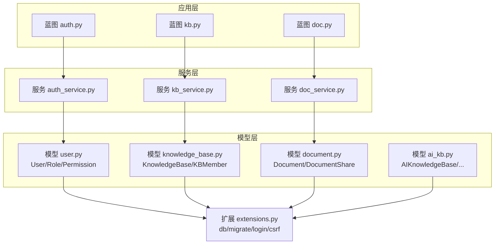
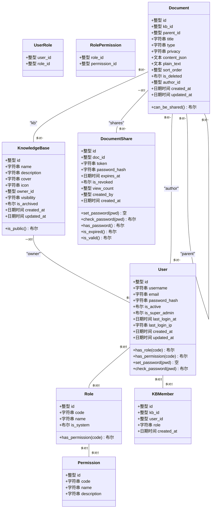
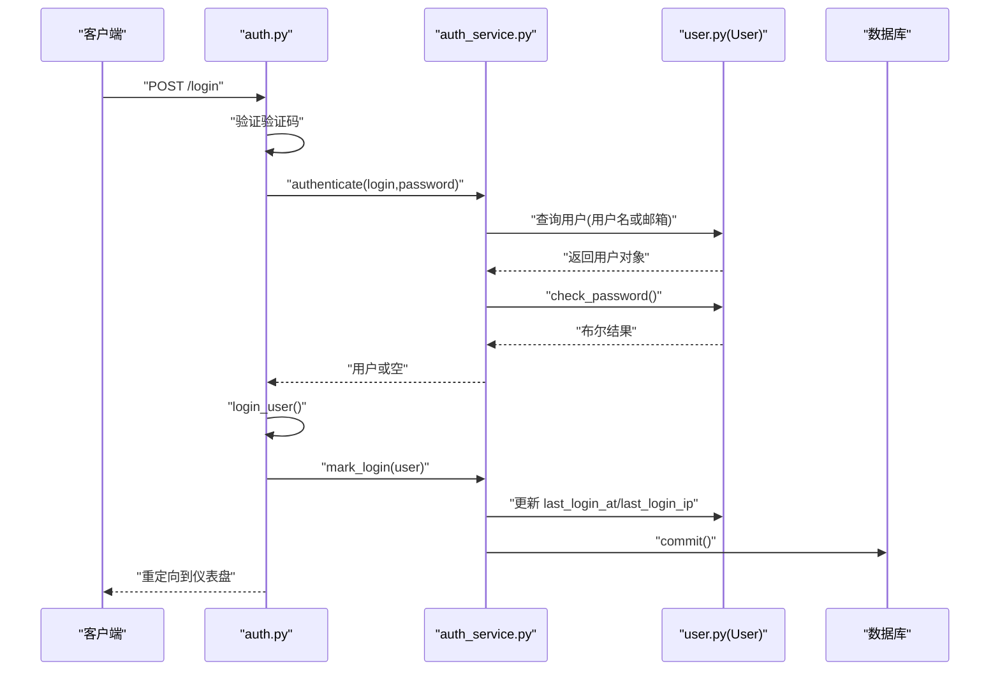
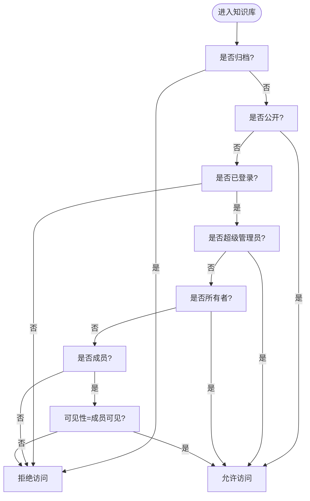
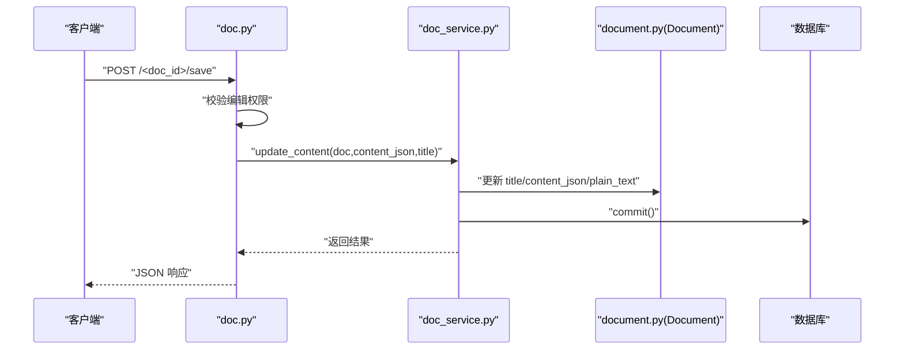
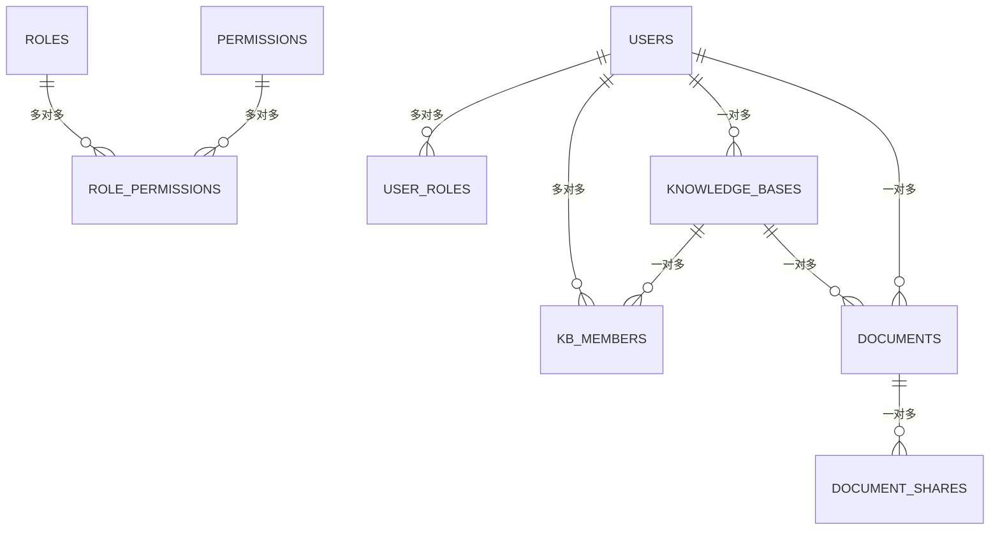

# 核心数据模型

<cite>
**本文引用的文件**
- [app/models/user.py](file://app/models/user.py)
- [app/models/knowledge_base.py](file://app/models/knowledge_base.py)
- [app/models/document.py](file://app/models/document.py)
- [app/models/ai_kb.py](file://app/models/ai_kb.py)
- [app/models/__init__.py](file://app/models/__init__.py)
- [app/extensions.py](file://app/extensions.py)
- [app/cli.py](file://app/cli.py)
- [scripts/init_db.py](file://scripts/init_db.py)
- [app/services/auth_service.py](file://app/services/auth_service.py)
- [app/services/doc_service.py](file://app/services/doc_service.py)
- [app/services/kb_service.py](file://app/services/kb_service.py)
- [app/blueprints/auth.py](file://app/blueprints/auth.py)
- [app/blueprints/doc.py](file://app/blueprints/doc.py)
- [app/blueprints/kb.py](file://app/blueprints/kb.py)
- [app/config.py](file://app/config.py)
</cite>

## 目录
1. [简介](#简介)
2. [项目结构](#项目结构)
3. [核心组件](#核心组件)
4. [架构总览](#架构总览)
5. [详细组件分析](#详细组件分析)
6. [依赖分析](#依赖分析)
7. [性能考虑](#性能考虑)
8. [故障排查指南](#故障排查指南)
9. [结论](#结论)
10. [附录](#附录)

## 简介
本文件聚焦 My Wiki 的核心数据模型，系统化梳理以下三类模型及其交互关系：
- 用户与权限模型：User、Role、Permission 及其多对多关联表，支撑 RBAC 权限体系与会话状态维护。
- 知识库模型：KnowledgeBase、KBMember 及其可见性与成员管理策略。
- 文档模型：Document、DocumentShare 及其富文本内容与分享机制。

同时，结合服务层与蓝图层的使用方式，说明模型间外键约束、级联策略、数据完整性保障、并发控制与事务管理的实现要点，并给出可操作的优化建议与排障指引。

## 项目结构
My Wiki 使用 Flask + SQLAlchemy 构建，数据模型集中于 app/models，通过 app/extensions.py 统一注入 db 实例；默认权限与角色由 CLI 初始化脚本写入；服务层封装业务逻辑，蓝图层处理路由与权限校验。

图表来源
- [app/blueprints/auth.py:1-85](file://app/blueprints/auth.py#L1-L85)
- [app/blueprints/kb.py:1-141](file://app/blueprints/kb.py#L1-L141)
- [app/blueprints/doc.py:1-139](file://app/blueprints/doc.py#L1-L139)
- [app/services/auth_service.py:1-57](file://app/services/auth_service.py#L1-L57)
- [app/services/kb_service.py:1-80](file://app/services/kb_service.py#L1-L80)
- [app/services/doc_service.py:1-81](file://app/services/doc_service.py#L1-L81)
- [app/models/user.py:1-104](file://app/models/user.py#L1-L104)
- [app/models/knowledge_base.py:1-62](file://app/models/knowledge_base.py#L1-L62)
- [app/models/document.py:1-98](file://app/models/document.py#L1-L98)
- [app/models/ai_kb.py:1-121](file://app/models/ai_kb.py#L1-L121)
- [app/extensions.py:1-17](file://app/extensions.py#L1-L17)

章节来源
- [app/models/__init__.py:1-38](file://app/models/__init__.py#L1-L38)
- [app/extensions.py:1-17](file://app/extensions.py#L1-L17)
- [app/config.py:1-83](file://app/config.py#L1-L83)

## 核心组件
本节从数据模型视角，逐项解析 User、KnowledgeBase、Document 的字段设计、关系映射、约束策略与典型用法。

- 用户与权限模型（RBAC）
  - 用户实体：用户名、邮箱唯一索引、头像、个人简介、激活状态、超级管理员标记、最近登录时间与 IP、创建/更新时间等。
  - 角色与权限：角色具备系统标识与描述，权限具备唯一编码与描述；角色与权限为多对多，用户与角色为多对多。
  - 会话状态：通过 Flask-Login 的 UserMixin 提供 is_authenticated 等能力，登录成功后由服务层更新 last_login_at 与 last_login_ip 并持久化。

- 知识库模型
  - 知识库实体：名称、描述、封面、图标、所有者、可见性（私有/成员可见/公开）、归档标志、创建/更新时间。
  - 成员管理：KBMember 记录成员与角色（浏览者/编辑者），唯一约束 kb_id+user_id，支持按成员查询与批量聚合。
  - 可见性控制：通过可见性枚举与成员表共同决定访问与编辑权限。

- 文档模型
  - 文档实体：所属知识库、父子层级（树形结构）、标题、类型（文档/表格）、隐私（常规/私密）、Editor.js JSON 内容与纯文本摘要、排序、软删除、作者、创建/更新时间。
  - 分享模型：DocumentShare 记录分享令牌、可选口令哈希、过期时间、撤销标志、访问计数、创建者与时间；提供口令校验与有效期判断。

章节来源
- [app/models/user.py:1-104](file://app/models/user.py#L1-L104)
- [app/models/knowledge_base.py:1-62](file://app/models/knowledge_base.py#L1-L62)
- [app/models/document.py:1-98](file://app/models/document.py#L1-L98)

## 架构总览
下图展示核心模型的类关系与外键约束，体现“用户-知识库-文档-分享”的主干关系及“角色-权限”的授权关系。

图表来源
- [app/models/user.py:1-104](file://app/models/user.py#L1-L104)
- [app/models/knowledge_base.py:1-62](file://app/models/knowledge_base.py#L1-L62)
- [app/models/document.py:1-98](file://app/models/document.py#L1-L98)

## 详细组件分析

### 用户与权限模型（RBAC）分析
- 身份管理
  - 密码安全：使用哈希存储与校验，提供 set_password 与 check_password 方法。
  - 激活与超级管理员：is_active 控制账户启用状态；is_super_admin 绕过多数权限校验。
  - 登录状态：last_login_at 与 last_login_ip 在认证成功后由服务层更新并提交。

- 角色与权限
  - 多对多关系：UserRole 连接用户与角色；RolePermission 连接角色与权限。
  - 权限判定：用户 has_permission 会优先检查 is_super_admin，否则遍历角色权限集合匹配。

- 会话状态维护
  - 通过 Flask-Login 的 UserMixin 提供 is_authenticated 等属性，蓝图层在登录成功后调用服务层记录登录信息。

图表来源
- [app/blueprints/auth.py:51-76](file://app/blueprints/auth.py#L51-L76)
- [app/services/auth_service.py:44-57](file://app/services/auth_service.py#L44-L57)
- [app/models/user.py:81-85](file://app/models/user.py#L81-L85)

章节来源
- [app/models/user.py:55-104](file://app/models/user.py#L55-L104)
- [app/services/auth_service.py:44-57](file://app/services/auth_service.py#L44-L57)
- [app/blueprints/auth.py:51-76](file://app/blueprints/auth.py#L51-L76)

### 知识库模型分析
- 结构设计
  - 知识库字段包含名称、描述、封面、图标、所有者、可见性、归档标志与时间戳。
  - 可见性枚举：私有（仅所有者）、成员可见（所有者+成员）、公开（任何人）。

- 成员管理机制
  - KBMember 记录成员与角色，唯一约束 kb_id+user_id，防止重复添加。
  - 支持按用户查询其参与的所有知识库，用于“我的知识库”列表聚合。

- 可见性控制策略
  - 访问控制：can_access 判断公开、超级管理员、所有者、成员身份与可见性。
  - 编辑控制：can_edit 在 can_access 基础上进一步要求成员角色为编辑者。
  - 管理控制：can_manage 仅允许所有者执行成员邀请、变更可见性与删除等操作。

图表来源
- [app/services/kb_service.py:10-23](file://app/services/kb_service.py#L10-L23)

章节来源
- [app/models/knowledge_base.py:19-62](file://app/models/knowledge_base.py#L19-L62)
- [app/services/kb_service.py:10-80](file://app/services/kb_service.py#L10-L80)
- [app/blueprints/kb.py:56-72](file://app/blueprints/kb.py#L56-L72)

### 文档模型分析
- 存储格式与富文本管理
  - Editor.js JSON 内容存储于 content_json，便于前端渲染与编辑。
  - 通过工具模块提取纯文本用于搜索与 AI 索引，字段为 plain_text。
  - 类型枚举区分文档与表格；隐私枚举区分常规与私密，私密文档不可分享。

- 版本控制与树形结构
  - 文档采用 parent_id 指向自身实现层级关系，支持构建嵌套树形目录。
  - 软删除 is_deleted 标记，避免物理删除影响关联完整性。

- 分享机制
  - DocumentShare 记录分享令牌、可选口令、过期时间、撤销标志与访问计数。
  - 提供 set_password/check_password 接口，支持无口令开放分享与受保护分享。
  - is_valid 综合判断撤销与过期状态，确保分享有效性。

图表来源
- [app/blueprints/doc.py:69-84](file://app/blueprints/doc.py#L69-L84)
- [app/services/doc_service.py:56-62](file://app/services/doc_service.py#L56-L62)
- [app/models/document.py:20-53](file://app/models/document.py#L20-L53)

章节来源
- [app/models/document.py:20-98](file://app/models/document.py#L20-L98)
- [app/services/doc_service.py:11-81](file://app/services/doc_service.py#L11-L81)
- [app/blueprints/doc.py:43-84](file://app/blueprints/doc.py#L43-L84)

### AI 知识库模型（补充）
- AIKnowledgeBase：拥有者、名称、描述、聊天模型、RAG 开关、状态、错误信息与时间戳。
- AIKBSource：将文档加入 AI 知识库的来源记录，唯一约束 ai_kb_id+doc_id，跟踪处理状态。
- AIKBArticle：Karpathy 风格的 wiki 条目，含标题、slug、摘要、标签与别名 JSON、内容 Markdown、来源文档 ID 列表。
- AIKBLink：条目间链接，支持红链（未命中目标）。
- AIKBChunk：当启用 RAG 时的切片元数据，向量本体存储于外部向量库。

章节来源
- [app/models/ai_kb.py:1-121](file://app/models/ai_kb.py#L1-L121)

## 依赖分析
- 外键与级联策略
  - 用户删除：user_roles、roles 的 CASCADE 删除，确保角色解绑。
  - 知识库删除：knowledge_bases.owner_id CASCADE 删除，导致所有成员与文档级联清理。
  - 文档删除：documents.kb_id CASCADE 删除，导致分享与子节点按需处理；父节点删除时 parent_id 设为 NULL。
  - 分享删除：document_shares.doc_id CASCADE 删除，配合 backref 的 delete-orphan 级联清理。

- 关系与反向引用
  - User 与 KnowledgeBase：User.owned_kbs（反向）。
  - KnowledgeBase 与 Document：KnowledgeBase.documents（反向，带 delete-orphan）。
  - Document 与 DocumentShare：Document.shares（反向，带 delete-orphan）。
  - Document 与 User/Document：author、parent（双向导航）。

- 数据完整性与并发控制
  - 唯一约束：kb_members(uq_kb_user)、ai_kb_sources(uq_aikb_doc)、ai_kb_articles(uq_aikb_slug)。
  - 索引：多处字段建立索引（如 users.username/email、knowledge_bases.owner_id/visibility 等）以提升查询效率。
  - 事务：服务层在单次请求内统一 commit，保证读写一致性；CLI 初始化脚本分步提交以确保种子数据完整。

图表来源
- [app/models/user.py:10-53](file://app/models/user.py#L10-L53)
- [app/models/knowledge_base.py:45-61](file://app/models/knowledge_base.py#L45-L61)
- [app/models/document.py:56-98](file://app/models/document.py#L56-L98)

章节来源
- [app/models/user.py:10-53](file://app/models/user.py#L10-L53)
- [app/models/knowledge_base.py:45-61](file://app/models/knowledge_base.py#L45-L61)
- [app/models/document.py:56-98](file://app/models/document.py#L56-L98)

## 性能考虑
- 查询优化
  - 为高频过滤字段建立索引（如 users.username/email、knowledge_bases.owner_id/visibility、documents.kb_id/parent_id/is_deleted 等）。
  - 树形目录查询按 parent_id 分组与排序，建议在数据库层面使用合适的索引组合。

- 写入与事务
  - 服务层在单次请求中统一提交，减少事务开销；批量操作（如删除整棵子树）建议合并为一次事务提交。
  - 对大字段（content_json、plain_text）写入，注意数据库字符集与存储引擎对 TEXT 的限制。

- 缓存与分页
  - 公共知识库列表与“我的知识库”列表可引入缓存；结合分页参数控制返回数量。
  - 对频繁访问的权限判定结果可做短期缓存，降低 ORM 查询压力。

- 连接池与会话
  - 配置 pool_pre_ping 与 pool_recycle，确保连接可用性与资源回收。
  - 合理设置会话 Cookie 属性（HttpOnly、SameSite、过期时间）以平衡安全与体验。

章节来源
- [app/config.py:18-26](file://app/config.py#L18-L26)
- [app/services/doc_service.py:11-34](file://app/services/doc_service.py#L11-L34)
- [app/services/kb_service.py:48-54](file://app/services/kb_service.py#L48-L54)

## 故障排查指南
- 初始化失败
  - 现象：首次启动无默认角色/权限或超管账号。
  - 处理：运行 CLI 命令初始化数据库并写入默认角色/权限，必要时手动创建超管账号并附加管理员角色。

- 权限不足
  - 现象：访问/编辑知识库或文档时报 403。
  - 处理：确认当前用户是否为超级管理员、知识库所有者或成员且具备相应角色；检查知识库可见性与归档状态。

- 分享失效
  - 现象：分享链接无法打开或提示已撤销/过期。
  - 处理：检查 DocumentShare 的 is_revoked 与 expires_at 字段；确认分享口令（如有）正确。

- 登录异常
  - 现象：登录成功但未记录登录信息或会话异常。
  - 处理：确认服务层 mark_login 是否执行；检查 Flask-Login 配置与会话 Cookie 设置。

章节来源
- [app/cli.py:61-95](file://app/cli.py#L61-L95)
- [scripts/init_db.py:23-47](file://scripts/init_db.py#L23-L47)
- [app/services/kb_service.py:10-45](file://app/services/kb_service.py#L10-L45)
- [app/services/auth_service.py:53-57](file://app/services/auth_service.py#L53-L57)
- [app/models/document.py:73-95](file://app/models/document.py#L73-L95)

## 结论
My Wiki 的核心数据模型围绕 RBAC 权限、知识库可见性与成员管理、以及富文本文档与分享机制展开。通过明确的外键约束与级联策略、合理的索引与事务管理，系统在功能完备的同时兼顾了数据一致性与可维护性。建议在生产环境中强化连接池配置、引入缓存与分页、完善监控与日志，持续优化性能与稳定性。

## 附录
- 初始化流程（命令行）
  - 执行数据库初始化、写入默认权限与角色、创建/激活超管账号并附加管理员角色。

- 关键路径参考
  - 用户注册与登录：[app/blueprints/auth.py:19-76](file://app/blueprints/auth.py#L19-L76)、[app/services/auth_service.py:36-57](file://app/services/auth_service.py#L36-L57)
  - 知识库访问与编辑：[app/blueprints/kb.py:56-91](file://app/blueprints/kb.py#L56-L91)、[app/services/kb_service.py:10-45](file://app/services/kb_service.py#L10-L45)
  - 文档创建、编辑与分享：[app/blueprints/doc.py:20-124](file://app/blueprints/doc.py#L20-L124)、[app/services/doc_service.py:37-81](file://app/services/doc_service.py#L37-L81)