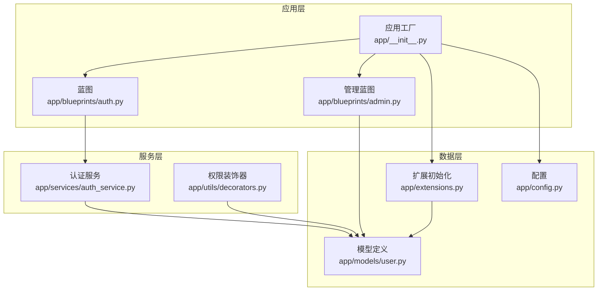
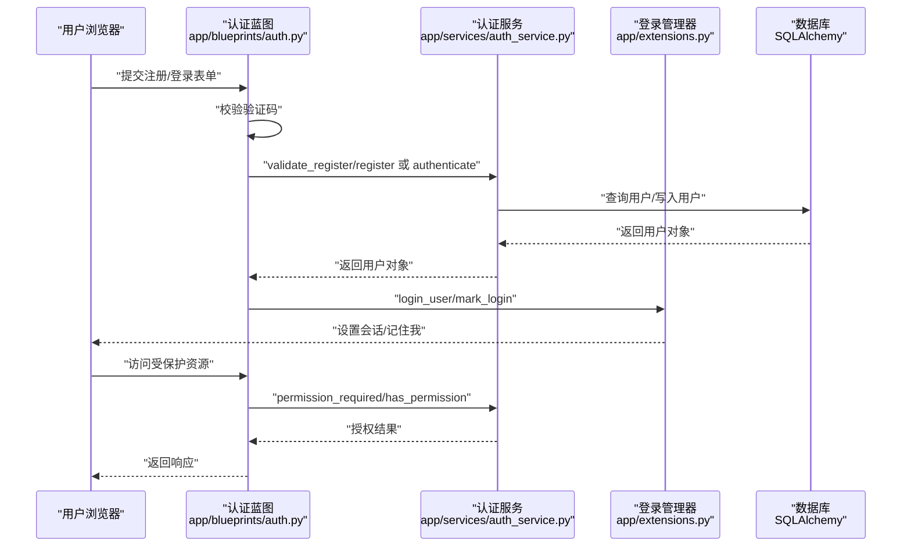
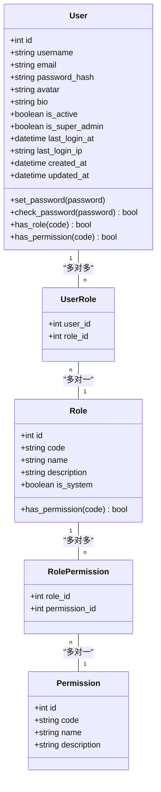
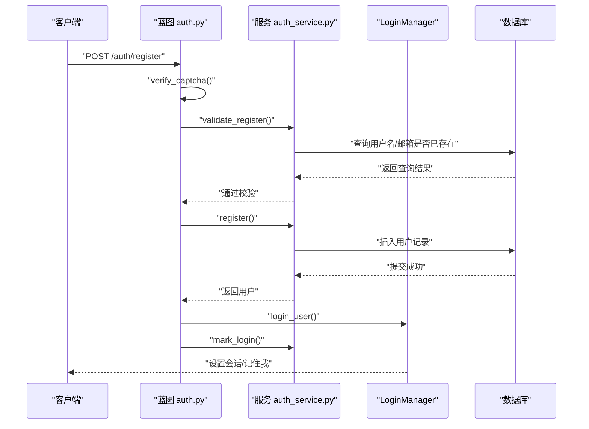
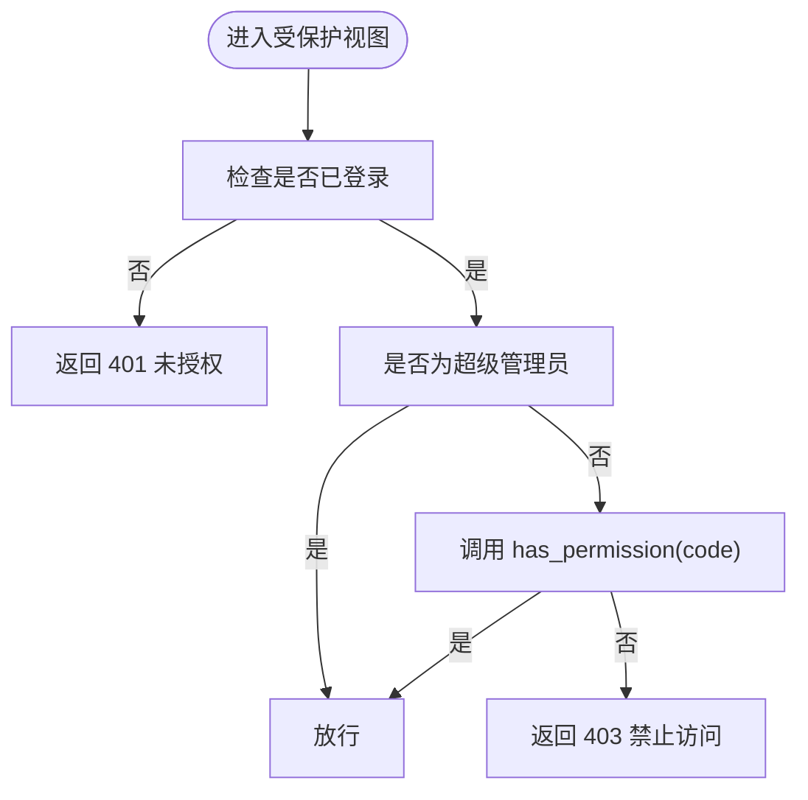
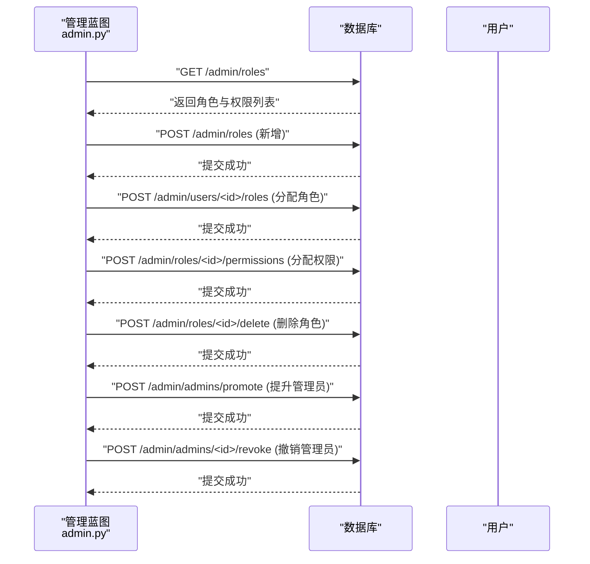
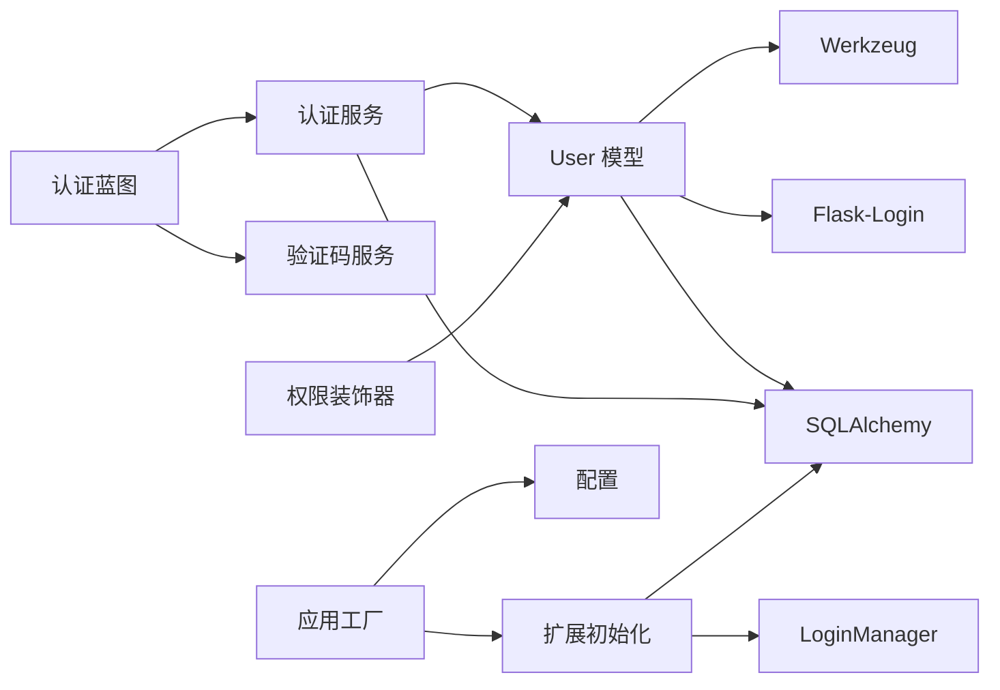

# 用户模型

<cite>
**本文引用的文件**
- [app/models/user.py](file://app/models/user.py)
- [app/services/auth_service.py](file://app/services/auth_service.py)
- [app/blueprints/auth.py](file://app/blueprints/auth.py)
- [app/utils/decorators.py](file://app/utils/decorators.py)
- [app/__init__.py](file://app/__init__.py)
- [app/extensions.py](file://app/extensions.py)
- [app/config.py](file://app/config.py)
- [app/blueprints/admin.py](file://app/blueprints/admin.py)
- [scripts/init_db.py](file://scripts/init_db.py)
</cite>

## 目录
1. [简介](#简介)
2. [项目结构](#项目结构)
3. [核心组件](#核心组件)
4. [架构总览](#架构总览)
5. [详细组件分析](#详细组件分析)
6. [依赖分析](#依赖分析)
7. [性能考虑](#性能考虑)
8. [故障排查指南](#故障排查指南)
9. [结论](#结论)
10. [附录](#附录)

## 简介
本文件围绕 My Wiki 的用户模型与基于角色的权限控制（RBAC）进行系统化技术文档编写。重点覆盖以下方面：
- User 模型的字段设计、密码哈希机制与用户状态管理
- UserRole 多对多关联表的设计原理与级联删除策略
- RBAC 架构：Role、Permission 及 RolePermission 关联表的完整实现
- 用户认证流程、会话管理与权限验证的端到端实现路径
- 用户注册、登录、密码安全与权限继承的实现细节

## 项目结构
本项目采用 Flask 应用工厂模式，数据库 ORM 使用 SQLAlchemy，登录状态管理由 Flask-Login 提供。用户模型与 RBAC 相关的核心文件如下：
- 用户与权限模型：app/models/user.py
- 认证服务：app/services/auth_service.py
- 认证蓝图：app/blueprints/auth.py
- 权限装饰器：app/utils/decorators.py
- 应用工厂与扩展初始化：app/__init__.py、app/extensions.py
- 配置：app/config.py
- 管理后台（角色与权限维护）：app/blueprints/admin.py
- 数据库初始化脚本：scripts/init_db.py

图表来源
- [app/__init__.py:11-74](file://app/__init__.py#L11-L74)
- [app/blueprints/auth.py:1-85](file://app/blueprints/auth.py#L1-L85)
- [app/blueprints/admin.py:74-131](file://app/blueprints/admin.py#L74-L131)
- [app/services/auth_service.py:1-57](file://app/services/auth_service.py#L1-L57)
- [app/utils/decorators.py:1-33](file://app/utils/decorators.py#L1-L33)
- [app/extensions.py:1-17](file://app/extensions.py#L1-L17)
- [app/models/user.py:10-104](file://app/models/user.py#L10-L104)
- [app/config.py:15-54](file://app/config.py#L15-L54)

章节来源
- [app/__init__.py:11-74](file://app/__init__.py#L11-L74)
- [app/extensions.py:1-17](file://app/extensions.py#L1-L17)
- [app/config.py:15-54](file://app/config.py#L15-L54)

## 核心组件
本节聚焦用户模型与 RBAC 的核心实体及其职责。

- User 模型
  - 字段设计：包含唯一用户名、唯一邮箱、密码哈希、头像、个人简介、激活状态、超级管理员标记、最近登录时间与 IP、创建与更新时间等。
  - 关系：通过中间表 user_roles 与 Role 建立多对多关系；提供 has_role 与 has_permission 辅助方法。
  - 密码安全：set_password 与 check_password 基于 Werkzeug 安全库实现。
  - 超级管理员：is_super_admin 为 True 时拥有全部权限。

- Role 模型
  - 字段：唯一 code、name、description、is_system 标记。
  - 关系：通过中间表 role_permissions 与 Permission 建立多对多关系；提供 has_permission 判断。

- Permission 模型
  - 字段：唯一 code、name、description。
  - 用途：作为最小权限单元，用于授权判断。

- 中间表
  - UserRole：用户-角色关联，外键均设置 CASCADE 删除，确保级联清理。
  - RolePermission：角色-权限关联，外键均设置 CASCADE 删除，确保级联清理。

章节来源
- [app/models/user.py:55-104](file://app/models/user.py#L55-L104)
- [app/models/user.py:33-52](file://app/models/user.py#L33-L52)
- [app/models/user.py:22-31](file://app/models/user.py#L22-L31)
- [app/models/user.py:10-20](file://app/models/user.py#L10-L20)

## 架构总览
下图展示从请求到数据库的用户认证与权限检查的整体流程。

图表来源
- [app/blueprints/auth.py:19-85](file://app/blueprints/auth.py#L19-L85)
- [app/services/auth_service.py:21-57](file://app/services/auth_service.py#L21-L57)
- [app/utils/decorators.py:8-33](file://app/utils/decorators.py#L8-L33)
- [app/extensions.py:8-17](file://app/extensions.py#L8-L17)

## 详细组件分析

### User 模型与密码安全
- 字段与索引
  - username、email 均为唯一且建立索引，便于登录与检索。
  - is_active 控制账户启用状态；is_super_admin 提供全局权限豁免。
  - 时间戳字段 created_at、updated_at 支持审计与排序。
- 密码哈希
  - set_password 使用安全库生成哈希；check_password 用于比对。
  - 登录态记录：last_login_at 与 last_login_ip 在认证后更新。
- 权限继承
  - has_permission 优先判断 is_super_admin；否则遍历角色集合，委托角色的 has_permission 判断。

图表来源
- [app/models/user.py:55-104](file://app/models/user.py#L55-L104)
- [app/models/user.py:33-52](file://app/models/user.py#L33-L52)
- [app/models/user.py:22-31](file://app/models/user.py#L22-L31)
- [app/models/user.py:10-20](file://app/models/user.py#L10-L20)

章节来源
- [app/models/user.py:55-104](file://app/models/user.py#L55-L104)

### 认证流程与会话管理
- 注册流程
  - 表单提交 → 验证码校验 → 服务层 validate_register → 创建用户并写入数据库 → 登录用户 → 更新登录信息。
- 登录流程
  - 表单提交 → 验证码校验 → 服务层 authenticate 查询用户并校验密码与激活状态 → 登录用户 → 更新登录信息。
- 会话与记住我
  - Flask-Login 设置登录视图与消息；配置中启用 HttpOnly Cookie、SameSite 策略与记住我时长。

图表来源
- [app/blueprints/auth.py:19-48](file://app/blueprints/auth.py#L19-L48)
- [app/services/auth_service.py:21-41](file://app/services/auth_service.py#L21-L41)
- [app/services/auth_service.py:53-57](file://app/services/auth_service.py#L53-L57)
- [app/extensions.py:14-16](file://app/extensions.py#L14-L16)
- [app/config.py:28-32](file://app/config.py#L28-L32)

章节来源
- [app/blueprints/auth.py:19-85](file://app/blueprints/auth.py#L19-L85)
- [app/services/auth_service.py:21-57](file://app/services/auth_service.py#L21-L57)
- [app/extensions.py:14-16](file://app/extensions.py#L14-L16)
- [app/config.py:28-32](file://app/config.py#L28-L32)

### 权限验证与装饰器
- permission_required(code)
  - 对未登录用户返回 401；对未满足权限的用户返回 403；超级管理员直接放行。
- super_admin_required
  - 仅允许 is_super_admin=True 的用户访问。

图表来源
- [app/utils/decorators.py:8-33](file://app/utils/decorators.py#L8-L33)
- [app/models/user.py:90-96](file://app/models/user.py#L90-L96)

章节来源
- [app/utils/decorators.py:8-33](file://app/utils/decorators.py#L8-L33)
- [app/models/user.py:90-96](file://app/models/user.py#L90-L96)

### 角色与权限管理（后台）
- 角色管理
  - 新增角色：校验 code 唯一性后写入数据库。
  - 分配角色给用户：根据表单选择的角色 ID 列表，批量更新用户的角色集合。
  - 删除角色：内置角色不可删除；非内置角色可删除。
- 权限管理
  - 给角色分配权限：根据表单选择的权限 ID 列表，批量更新角色的权限集合。
- 超级管理员
  - 提升/撤销管理员：支持按用户名或邮箱查找用户并修改 is_super_admin 标记。

图表来源
- [app/blueprints/admin.py:76-131](file://app/blueprints/admin.py#L76-L131)
- [app/blueprints/admin.py:90-117](file://app/blueprints/admin.py#L90-L117)
- [app/blueprints/admin.py:142-166](file://app/blueprints/admin.py#L142-L166)

章节来源
- [app/blueprints/admin.py:76-131](file://app/blueprints/admin.py#L76-L131)
- [app/blueprints/admin.py:90-117](file://app/blueprints/admin.py#L90-L117)
- [app/blueprints/admin.py:142-166](file://app/blueprints/admin.py#L142-L166)

### 数据库初始化与默认管理员
- 初始化脚本
  - 创建所有表并填充权限与角色种子数据。
  - 若默认管理员不存在则创建并设置 is_super_admin 与激活状态；若存在则确保其为超级管理员并附加角色。
- 默认账号
  - 通过环境变量可配置初始管理员的用户名、邮箱与密码。

章节来源
- [scripts/init_db.py:23-47](file://scripts/init_db.py#L23-L47)

## 依赖分析
- 组件耦合
  - User 模型依赖 SQLAlchemy 与 Flask-Login；密码处理依赖 Werkzeug。
  - 认证蓝图依赖认证服务与验证码服务；权限装饰器依赖当前用户状态。
  - 应用工厂负责初始化扩展（SQLAlchemy、Migrate、LoginManager、CSRF），并注册蓝图与用户加载器。
- 外部依赖
  - MySQL/SQLAlchemy 连接配置在配置文件中集中管理。
  - 会话 Cookie 的安全策略在配置中统一设定。

图表来源
- [app/models/user.py:4-7](file://app/models/user.py#L4-L7)
- [app/services/auth_service.py:7-10](file://app/services/auth_service.py#L7-L10)
- [app/blueprints/auth.py:2-6](file://app/blueprints/auth.py#L2-L6)
- [app/utils/decorators.py:4-6](file://app/utils/decorators.py#L4-L6)
- [app/__init__.py:39-54](file://app/__init__.py#L39-L54)
- [app/extensions.py:8-11](file://app/extensions.py#L8-L11)
- [app/config.py:18-26](file://app/config.py#L18-L26)

章节来源
- [app/__init__.py:39-54](file://app/__init__.py#L39-L54)
- [app/extensions.py:8-11](file://app/extensions.py#L8-L11)
- [app/config.py:18-26](file://app/config.py#L18-L26)

## 性能考虑
- 查询优化
  - 用户名与邮箱字段建立唯一索引，登录查询使用 OR 条件时建议保持索引命中效率。
  - 角色与权限关系使用 joined 加载，减少 N+1 查询风险。
- 会话与 Cookie
  - 启用 HttpOnly 降低 XSS 风险；SameSite=Lax 平衡跨站安全性与可用性；记住我时长合理设置以平衡安全与体验。
- 密码存储
  - 使用安全库生成哈希，避免明文存储；登录失败不应暴露具体失败原因（已在服务层实现）。

## 故障排查指南
- 登录失败
  - 检查验证码是否正确且未过期；确认用户 is_active 为真；确认密码哈希匹配。
- 权限不足
  - 确认用户是否为超级管理员；确认用户是否被赋予对应角色；确认角色是否被授予相应权限。
- 会话异常
  - 检查 Cookie 配置（HttpOnly、SameSite、Domain/Path）；确认 LoginManager 的用户加载器正常工作。
- 数据库一致性
  - 确认中间表的 CASCADE 删除策略是否符合预期；角色/权限删除后应自动清理关联。

章节来源
- [app/services/auth_service.py:44-50](file://app/services/auth_service.py#L44-L50)
- [app/utils/decorators.py:25-30](file://app/utils/decorators.py#L25-L30)
- [app/extensions.py:48-53](file://app/extensions.py#L48-L53)
- [app/models/user.py:10-20](file://app/models/user.py#L10-L20)

## 结论
本项目以清晰的模型设计与服务分层实现了完整的用户与权限体系。User 模型结合 Flask-Login 实现会话管理，认证服务提供输入校验与登录态更新，装饰器统一了权限判定逻辑。后台管理功能支持角色与权限的动态维护，并通过初始化脚本快速搭建默认管理员与基础权限。整体架构具备良好的可扩展性与安全性。

## 附录
- 关键实现路径参考
  - 用户模型与关系：[app/models/user.py:55-104](file://app/models/user.py#L55-L104)
  - 角色与权限模型：[app/models/user.py:33-52](file://app/models/user.py#L33-L52)
  - 中间表与级联删除：[app/models/user.py:10-20](file://app/models/user.py#L10-L20)
  - 注册与登录流程：[app/blueprints/auth.py:19-85](file://app/blueprints/auth.py#L19-L85)
  - 权限装饰器：[app/utils/decorators.py:8-33](file://app/utils/decorators.py#L8-L33)
  - 应用工厂与扩展初始化：[app/__init__.py:39-54](file://app/__init__.py#L39-L54)
  - 配置与会话策略：[app/config.py:28-32](file://app/config.py#L28-L32)
  - 管理后台角色/权限维护：[app/blueprints/admin.py:76-131](file://app/blueprints/admin.py#L76-L131)
  - 初始化脚本与默认管理员：[scripts/init_db.py:23-47](file://scripts/init_db.py#L23-L47)