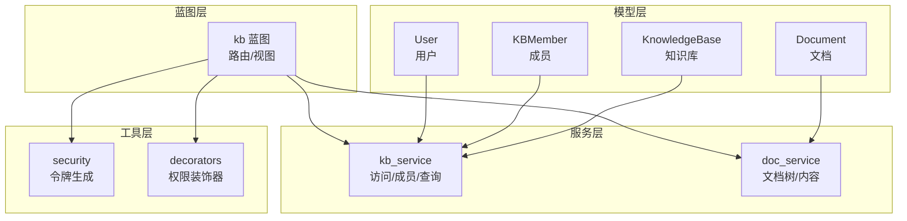
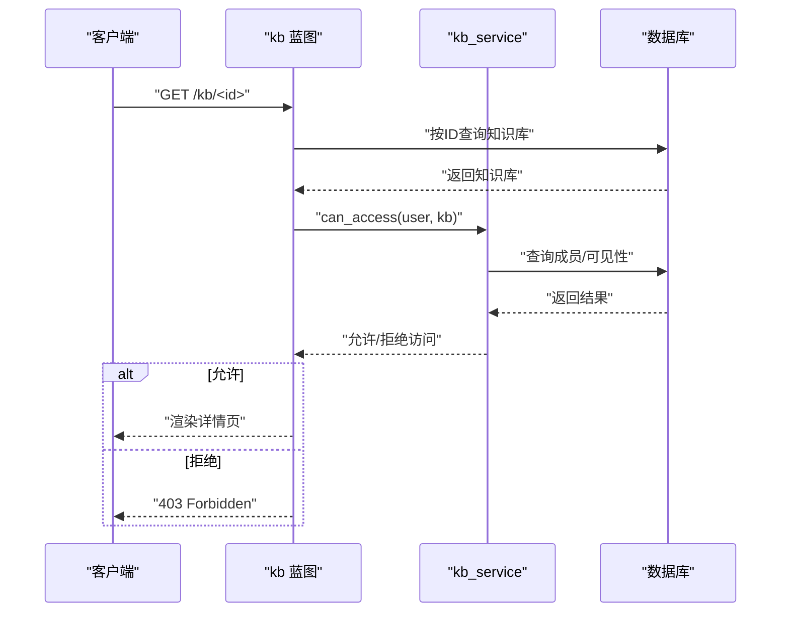
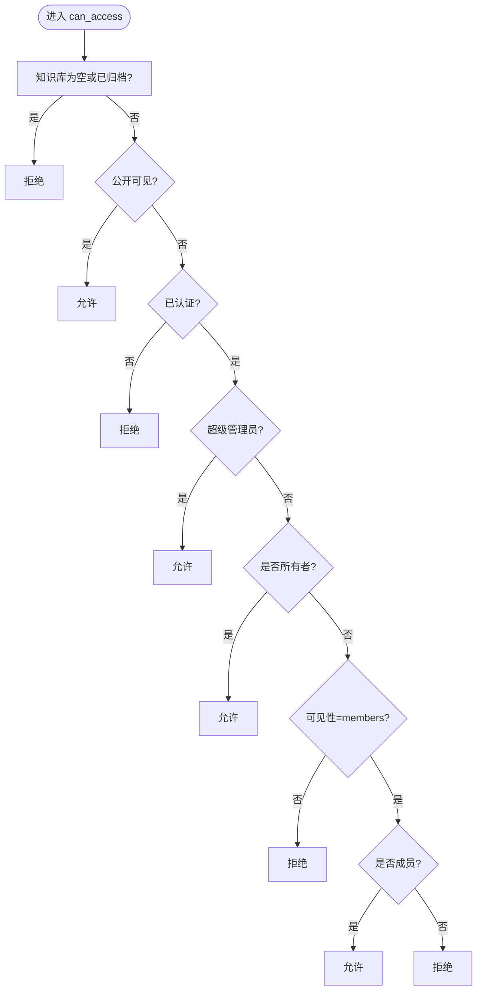
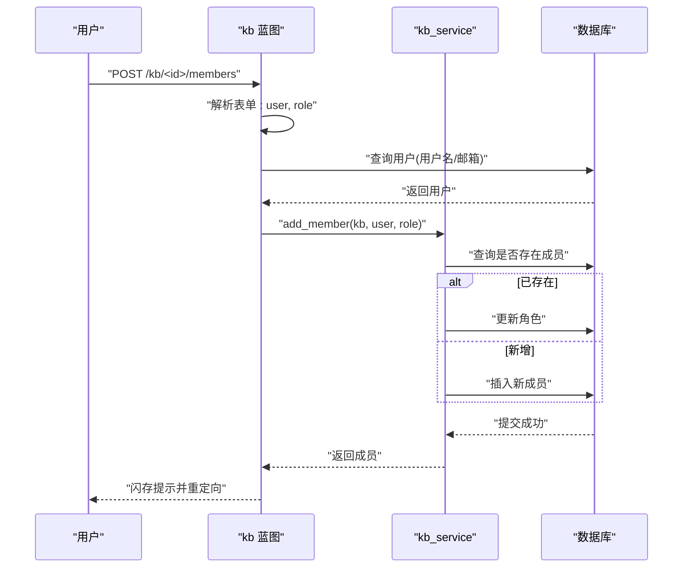
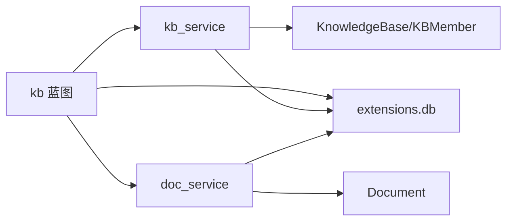

# 知识库模型

<cite>
**本文引用的文件**
- [app/models/knowledge_base.py](file://app/models/knowledge_base.py)
- [app/services/kb_service.py](file://app/services/kb_service.py)
- [app/blueprints/kb.py](file://app/blueprints/kb.py)
- [app/models/user.py](file://app/models/user.py)
- [app/models/document.py](file://app/models/document.py)
- [app/services/doc_service.py](file://app/services/doc_service.py)
- [app/extensions.py](file://app/extensions.py)
- [app/config.py](file://app/config.py)
- [app/utils/security.py](file://app/utils/security.py)
- [app/utils/decorators.py](file://app/utils/decorators.py)
</cite>

## 目录
1. [简介](#简介)
2. [项目结构](#项目结构)
3. [核心组件](#核心组件)
4. [架构总览](#架构总览)
5. [详细组件分析](#详细组件分析)
6. [依赖分析](#依赖分析)
7. [性能考虑](#性能考虑)
8. [故障排查指南](#故障排查指南)
9. [结论](#结论)
10. [附录](#附录)

## 简介
本技术文档围绕 My Wiki 的“知识库模型”展开，系统化阐述以下主题：
- 数据库结构设计与字段约束
- 可见性控制机制（公开、私有、受限制访问）
- 成员管理系统（邀请、权限分配、角色变更）
- 知识库创建、编辑、删除与成员管理的 API 接口说明
- 搜索索引、统计信息与性能优化方案

## 项目结构
本项目采用 Flask + SQLAlchemy 的分层组织方式：
- models 层：定义领域模型与枚举（知识库、成员、用户、文档等）
- services 层：封装业务逻辑（访问控制、成员管理、查询聚合）
- blueprints 层：路由与视图（知识库 CRUD、成员管理、详情页）
- utils 层：通用工具（安全令牌、装饰器、Markdown/大纲处理）
- extensions：应用扩展（数据库、迁移、登录、CSRF）

图表来源
- [app/models/knowledge_base.py:19-61](file://app/models/knowledge_base.py#L19-L61)
- [app/services/kb_service.py:1-80](file://app/services/kb_service.py#L1-L80)
- [app/blueprints/kb.py:1-141](file://app/blueprints/kb.py#L1-L141)
- [app/models/document.py:20-53](file://app/models/document.py#L20-L53)
- [app/utils/security.py:5-7](file://app/utils/security.py#L5-L7)
- [app/utils/decorators.py:8-32](file://app/utils/decorators.py#L8-L32)

章节来源
- [app/models/knowledge_base.py:1-62](file://app/models/knowledge_base.py#L1-L62)
- [app/services/kb_service.py:1-80](file://app/services/kb_service.py#L1-L80)
- [app/blueprints/kb.py:1-141](file://app/blueprints/kb.py#L1-L141)
- [app/models/document.py:1-98](file://app/models/document.py#L1-L98)
- [app/utils/security.py:1-8](file://app/utils/security.py#L1-L8)
- [app/utils/decorators.py:1-33](file://app/utils/decorators.py#L1-L33)

## 核心组件
- 知识库模型 KnowledgeBase：存储知识库元数据、所有者、可见性、归档状态与时间戳；提供 is_public 属性判断是否公开。
- 成员模型 KBMember：记录用户在知识库中的角色（只读/编辑），并建立与知识库、用户的多对一关系；唯一约束 kb_id+user_id。
- 访问控制服务 kb_service：统一实现 can_access/can_edit/can_manage 三类权限判定；提供列表查询与成员增删改。
- 文档模型与服务：文档树构建、内容更新、软删除与后代收集，支撑知识库内的内容管理。
- 蓝图 kb：对外暴露知识库 CRUD 与成员管理的 HTTP 接口。

章节来源
- [app/models/knowledge_base.py:19-61](file://app/models/knowledge_base.py#L19-L61)
- [app/services/kb_service.py:10-80](file://app/services/kb_service.py#L10-L80)
- [app/blueprints/kb.py:14-141](file://app/blueprints/kb.py#L14-L141)
- [app/models/document.py:20-53](file://app/models/document.py#L20-L53)
- [app/services/doc_service.py:11-81](file://app/services/doc_service.py#L11-L81)

## 架构总览
知识库模型的运行时交互由蓝图触发，服务层进行权限校验与数据聚合，模型层负责持久化与关系映射。

图表来源
- [app/blueprints/kb.py:56-72](file://app/blueprints/kb.py#L56-L72)
- [app/services/kb_service.py:10-23](file://app/services/kb_service.py#L10-L23)

## 详细组件分析

### 数据库结构与字段定义
- 知识库表 knowledge_bases
  - 主键 id
  - 名称 name（长度 128，非空）
  - 描述 description（长度 500，默认空字符串）
  - 封面 cover（长度 255，默认空字符串）
  - 图标 icon（长度 32，默认 book）
  - 所有者 owner_id（外键 users.id，级联删除，非空，带索引）
  - 可见性 visibility（枚举 private/members/public，默认 private，非空，带索引）
  - 归档标志 is_archived（布尔，默认 false，非空）
  - 时间 created_at/updated_at（默认当前 UTC，非空；更新时自动刷新）
  - 关系 owner -> User 的反向引用 owned_kbs
  - 辅助属性 is_public 判断是否公开

- 成员表 kb_members
  - 主键 id
  - 知识库 kb_id（外键 knowledge_bases.id，级联删除，非空，带索引）
  - 用户 user_id（外键 users.id，级联删除，非空，带索引）
  - 角色 role（枚举 viewer/editor，默认 viewer，非空）
  - 创建时间 created_at（默认当前 UTC，非空）
  - 唯一约束 (kb_id, user_id)
  - 关系 kb -> KnowledgeBase、user -> User
  - 级联删除 orphan 支持成员删除时清理

- 用户表 users
  - 主键 id
  - 用户名 username（唯一、索引，非空）
  - 邮箱 email（唯一、索引，非空）
  - 密码哈希 password_hash（非空）
  - 头像 avatar、简介 bio（默认空字符串）
  - 活跃标志 is_active（默认 true，非空）
  - 超级管理员 is_super_admin（布尔，默认 false，带索引）
  - 登录信息 last_login_at/last_login_ip
  - 时间 created_at/updated_at（默认当前 UTC，非空；更新时自动刷新）
  - 关系 roles -> Role 的多对多（通过中间表 user_roles）

- 文档表 documents
  - 主键 id
  - 知识库 kb_id（外键 knowledge_bases.id，级联删除，非空，带索引）
  - 父文档 parent_id（自引用外键，SET NULL，带索引）
  - 标题 title（默认“未命名”，非空）
  - 类型 type（枚举 doc/sheet，默认 doc，非空，带索引）
  - 隐私 privacy（枚举 normal/private，默认 normal，非空，带索引）
  - 内容 content_json（Editor.js JSON，大文本）
  - 明文 plain_text（用于搜索/AI抽取）
  - 排序 sort_order（整数，默认 0，非空）
  - 删除标志 is_deleted（布尔，默认 false，非空，带索引）
  - 作者 author_id（外键 users.id，SET NULL，带索引）
  - 时间 created_at/updated_at（默认当前 UTC，非空；更新时自动刷新）
  - 关系 kb -> KnowledgeBase、author -> User、parent -> Document（自引用）

章节来源
- [app/models/knowledge_base.py:19-61](file://app/models/knowledge_base.py#L19-L61)
- [app/models/user.py:55-104](file://app/models/user.py#L55-L104)
- [app/models/document.py:20-53](file://app/models/document.py#L20-L53)

### 可见性控制机制
- 可见性枚举 KBVisibility：private（仅所有者）、members（所有者+成员）、public（任何人）。
- 访问判定 can_access(user, kb)
  - 若知识库为空或已归档，拒绝
  - 若公开，直接允许
  - 若匿名或非认证用户，拒绝
  - 若超级管理员，允许
  - 若为所有者，允许
  - 若为 members 且用户为成员，允许；否则拒绝
- 编辑判定 can_edit(user, kb)
  - 非认证用户拒绝
  - 超级管理员允许
  - 所有者允许
  - 成员需为 editor 角色才允许
- 管理判定 can_manage(user, kb)
  - 非认证用户拒绝
  - 超级管理员允许
  - 仅所有者允许（邀请成员、修改可见性、删除知识库）

图表来源
- [app/services/kb_service.py:10-23](file://app/services/kb_service.py#L10-L23)

章节来源
- [app/services/kb_service.py:10-46](file://app/services/kb_service.py#L10-L46)

### 成员管理系统
- 角色枚举 KBMemberRole：viewer（只读）、editor（编辑）
- 成员邀请/变更
  - add_member(kb, user, role)：若存在则更新角色，否则新增；提交事务后返回成员
  - remove_member(kb, user_id)：按 kb_id+user_id 删除成员并提交
- 角色变更流程
  - 蓝图 members POST：解析表单参数，校验角色合法性，查找用户（用户名或邮箱），排除所有者本人，调用服务更新角色
  - 蓝图 remove_member POST：校验管理权限后调用服务删除成员

图表来源
- [app/blueprints/kb.py:106-129](file://app/blueprints/kb.py#L106-L129)
- [app/services/kb_service.py:65-74](file://app/services/kb_service.py#L65-L74)

章节来源
- [app/services/kb_service.py:65-80](file://app/services/kb_service.py#L65-L80)
- [app/blueprints/kb.py:106-141](file://app/blueprints/kb.py#L106-L141)

### 知识库 API 接口说明
- 列出知识库
  - 方法与路径：GET /kb/
  - 查询参数：tab（mine/public，默认 mine）
  - 认证：需要登录
  - 行为：根据 tab 返回我的知识库或公开知识库列表
- 创建知识库
  - 方法与路径：GET/POST /kb/new
  - 表单字段：name（必填）、description、visibility（private/members/public，默认 private）、icon
  - 认证：需要登录
  - 行为：校验名称，创建知识库并设置 owner_id 为当前用户，提交后重定向到详情页
- 查看知识库详情
  - 方法与路径：GET /kb/<id>
  - 认证：需要登录（但访问策略由 can_access 决定）
  - 行为：校验访问权限，构建文档树，计算可编辑/可管理权限，渲染详情页
- 编辑知识库
  - 方法与路径：GET/POST /kb/<id>/edit
  - 表单字段：name、description、visibility、icon
  - 认证：需要登录
  - 权限：can_manage
  - 行为：更新字段并提交
- 删除知识库
  - 方法与路径：POST /kb/<id>/delete
  - 认证：需要登录
  - 权限：can_manage
  - 行为：标记 is_archived=true 并提交
- 成员管理
  - GET/POST /kb/<id>/members
  - 表单字段：user（用户名或邮箱）、role（viewer/editor）
  - 认证：需要登录
  - 权限：can_manage
  - 行为：邀请成员或变更角色；支持删除成员 /kb/<id>/members/<user_id>/delete

章节来源
- [app/blueprints/kb.py:21-141](file://app/blueprints/kb.py#L21-L141)

### 搜索索引、统计信息与性能优化
- 搜索索引
  - 文档模型包含 plain_text 字段，用于提取明文以供搜索与 AI 抽取
  - 文档服务提供内容更新时的明文提取与落库
- 统计信息
  - 用户仪表盘统计：知识库数量、文档数量、AI 知识库数量
  - 知识库列表：按更新时间倒序展示
- 性能优化
  - 数据库索引：知识库 owner_id、visibility、成员 kb_id+user_id、文档 kb_id+is_deleted、文档 privacy 等
  - 查询优化：服务层使用 union 合并“我创建的”和“我加入的”知识库，避免 N+1 查询
  - 连接池与引擎选项：配置 pool_pre_ping 与 pool_recycle，提升连接稳定性
  - 可选 RAG：通过环境变量启用向量化检索，降低全文扫描成本

章节来源
- [app/models/document.py:32-34](file://app/models/document.py#L32-L34)
- [app/services/doc_service.py:56-62](file://app/services/doc_service.py#L56-L62)
- [app/blueprints/user.py:22-26](file://app/blueprints/user.py#L22-L26)
- [app/config.py:23-26](file://app/config.py#L23-L26)

## 依赖分析
- 模块耦合
  - 蓝图依赖服务层进行权限与数据聚合
  - 服务层依赖模型层进行 ORM 操作
  - 蓝图与服务层均依赖扩展模块 db
- 外部依赖
  - Flask、Flask-Login、Flask-SQLAlchemy、Flask-Migrate、Flask-WTF
  - MySQL（默认）作为数据库后端

图表来源
- [app/blueprints/kb.py:1-11](file://app/blueprints/kb.py#L1-L11)
- [app/services/kb_service.py:6-7](file://app/services/kb_service.py#L6-L7)
- [app/services/doc_service.py:6-8](file://app/services/doc_service.py#L6-L8)
- [app/extensions.py:8-11](file://app/extensions.py#L8-L11)

章节来源
- [app/blueprints/kb.py:1-11](file://app/blueprints/kb.py#L1-L11)
- [app/services/kb_service.py:6-7](file://app/services/kb_service.py#L6-L7)
- [app/services/doc_service.py:6-8](file://app/services/doc_service.py#L6-L8)
- [app/extensions.py:8-11](file://app/extensions.py#L8-L11)

## 性能考虑
- 索引策略
  - 在知识库 owner_id、visibility、成员 kb_id+user_id、文档 kb_id+is_deleted、文档 privacy 等列建立索引，加速过滤与关联
- 查询优化
  - 使用 union 合并“我创建的”和“我加入的”知识库，减少重复查询
  - 对列表查询使用 limit 与 order_by，避免全表扫描
- 连接池与引擎
  - 启用 pool_pre_ping 与合理 pool_recycle，提升高并发下的连接可用性
- 可选向量化检索
  - 通过环境变量开启 RAG，使用 Chroma 向量库进行相似度检索，降低关键词匹配的误判与性能开销

章节来源
- [app/services/kb_service.py:48-54](file://app/services/kb_service.py#L48-L54)
- [app/config.py:23-26](file://app/config.py#L23-L26)
- [app/models/document.py:24-29](file://app/models/document.py#L24-L29)

## 故障排查指南
- 403 禁止访问
  - 检查用户是否认证、是否超级管理员、是否知识库所有者、是否成员且角色满足要求
  - 检查知识库是否归档
- 404 未找到
  - 确认知识库 ID 存在且未归档
- 成员邀请失败
  - 确认用户存在（用户名或邮箱任一匹配）
  - 排除所有者本人（不允许添加所有者为成员）
  - 检查角色值是否合法
- 权限装饰器
  - 超级管理员装饰器与权限装饰器可用于更细粒度的权限控制

章节来源
- [app/blueprints/kb.py:14-18](file://app/blueprints/kb.py#L14-L18)
- [app/services/kb_service.py:10-46](file://app/services/kb_service.py#L10-L46)
- [app/utils/decorators.py:8-32](file://app/utils/decorators.py#L8-L32)

## 结论
本知识库模型通过清晰的数据结构、严格的权限控制与完善的成员管理，实现了从创建到协作的全生命周期管理。配合索引与查询优化、可选的 RAG 检索，可在中大型场景下保持良好的性能与可维护性。

## 附录
- 安全令牌
  - 提供 URL 安全的令牌生成函数，适用于分享链接等场景
- 配置项
  - 数据库连接、上传目录、AI 模型、RAG 开关、分页大小等

章节来源
- [app/utils/security.py:5-7](file://app/utils/security.py#L5-L7)
- [app/config.py:18-53](file://app/config.py#L18-L53)