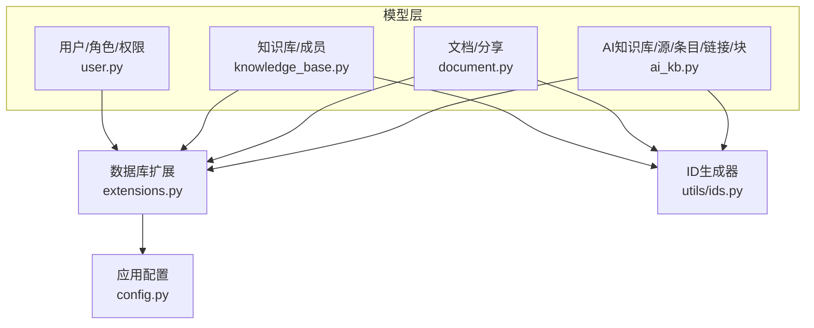
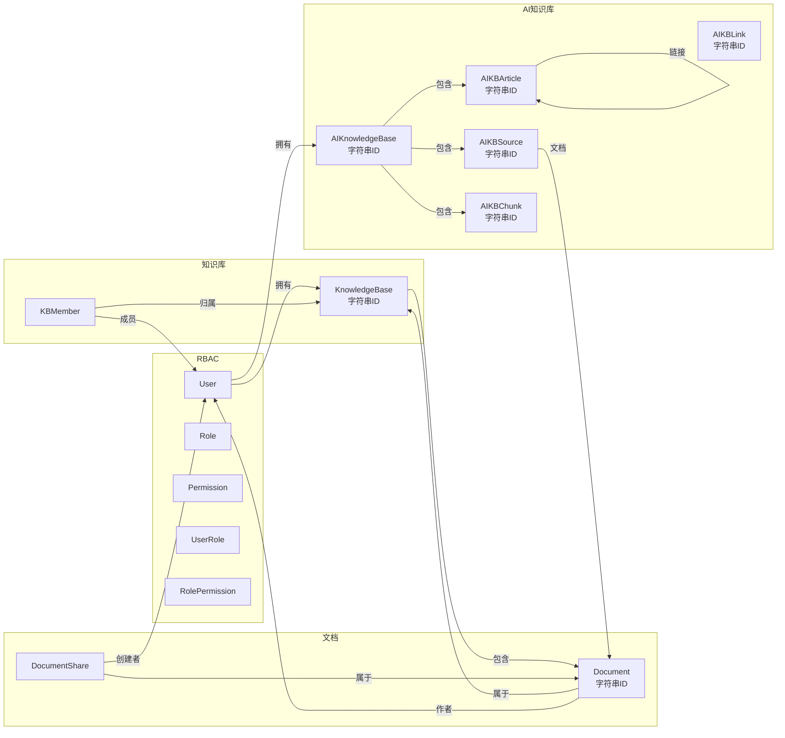
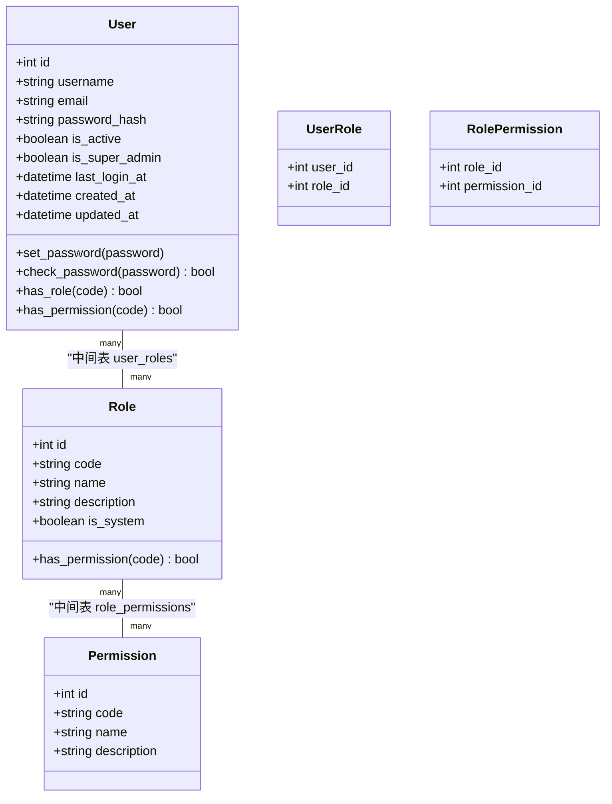
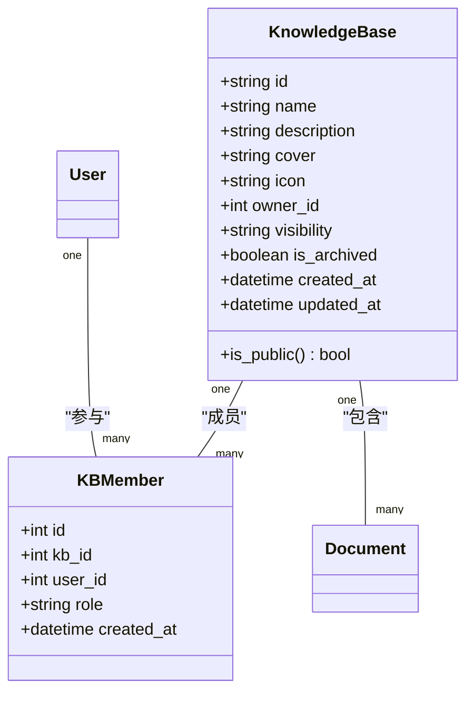
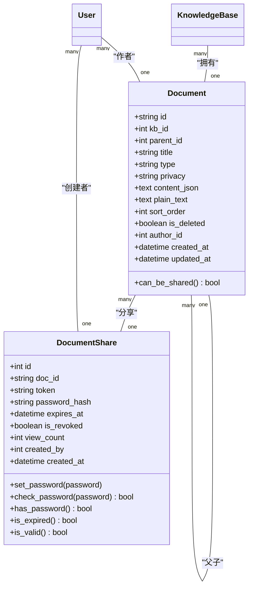
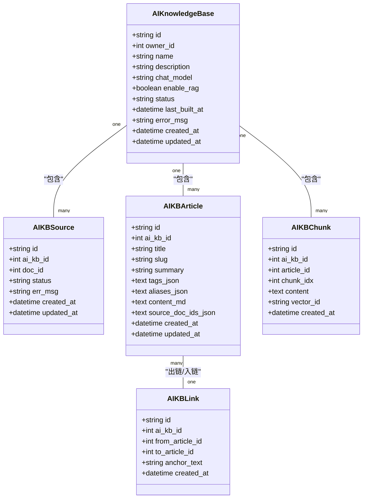
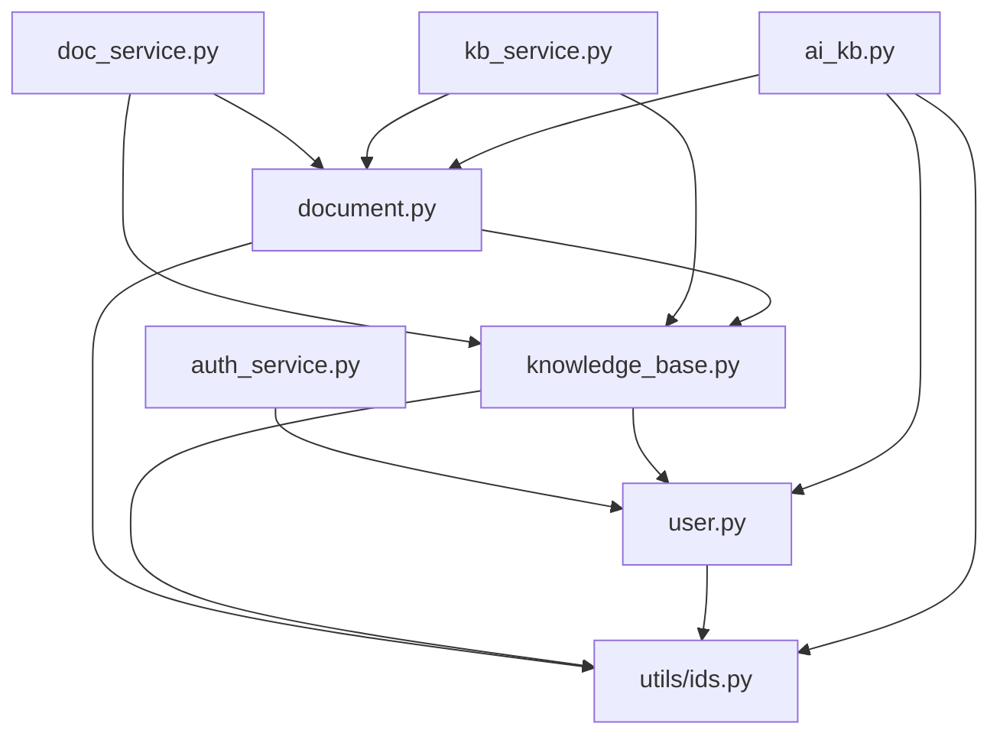

# 模型设计原则

<cite>
**本文引用的文件列表**
- [app/models/__init__.py](file://app/models/__init__.py)
- [app/models/user.py](file://app/models/user.py)
- [app/models/knowledge_base.py](file://app/models/knowledge_base.py)
- [app/models/document.py](file://app/models/document.py)
- [app/models/ai_kb.py](file://app/models/ai_kb.py)
- [app/extensions.py](file://app/extensions.py)
- [app/config.py](file://app/config.py)
- [app/utils/ids.py](file://app/utils/ids.py)
- [app/services/doc_service.py](file://app/services/doc_service.py)
- [app/services/kb_service.py](file://app/services/kb_service.py)
- [app/services/auth_service.py](file://app/services/auth_service.py)
</cite>

## 目录
1. [简介](#简介)
2. [项目结构与模型组织](#项目结构与模型组织)
3. [核心组件与模型概览](#核心组件与模型概览)
4. [架构总览](#架构总览)
5. [详细组件分析](#详细组件分析)
6. [依赖关系分析](#依赖关系分析)
7. [ID生成系统设计](#id生成系统设计)
8. [性能与可扩展性](#性能与可扩展性)
9. [故障排查指南](#故障排查指南)
10. [结论](#结论)
11. [附录](#附录)

## 简介
本文件系统化梳理 My Wiki 的 SQLAlchemy 模型设计原则，覆盖命名规范、字段定义标准、关系映射策略、模型继承与抽象基类设计、通用字段模式、元数据配置、表名约定、列定义最佳实践、验证规则、数据类型选择、索引设计原则，以及扩展性、版本兼容性与性能优化策略。文档以代码为依据，结合服务层使用方式，给出可操作的设计建议与图示说明。

**更新** 新增ID生成系统设计章节，详细介绍URL友好的随机ID生成策略及其在模型中的应用。

## 项目结构与模型组织
- 模型集中于 app/models 目录，按功能域拆分模块：
  - 用户与权限：user.py
  - 知识库与成员：knowledge_base.py
  - 文档与分享：document.py
  - AI 知识库相关：ai_kb.py
- 模型统一通过 app/extensions.py 中的 db 实例进行声明与管理，避免循环依赖并集中配置。
- 模型导出在 app/models/__init__.py 中统一聚合，便于蓝图与服务层按需导入。
- **ID生成系统**：通过 app/utils/ids.py 提供统一的随机ID生成器，支持所有需要字符串主键的模型。



**图表来源**
- [app/models/user.py:1-104](file://app/models/user.py#L1-L104)
- [app/models/knowledge_base.py:1-82](file://app/models/knowledge_base.py#L1-L82)
- [app/models/document.py:1-99](file://app/models/document.py#L1-L99)
- [app/models/ai_kb.py:1-122](file://app/models/ai_kb.py#L1-L122)
- [app/extensions.py:1-17](file://app/extensions.py#L1-L17)
- [app/config.py:1-83](file://app/config.py#L1-L83)
- [app/utils/ids.py:1-21](file://app/utils/ids.py#L1-L21)

**章节来源**
- [app/models/__init__.py:1-38](file://app/models/__init__.py#L1-L38)
- [app/extensions.py:1-17](file://app/extensions.py#L1-L17)
- [app/config.py:1-83](file://app/config.py#L1-L83)
- [app/utils/ids.py:1-21](file://app/utils/ids.py#L1-L21)

## 核心组件与模型概览
- 用户与权限模型：采用 RBAC 架构，支持多对多的角色与权限关联，并通过中间表维护用户-角色与角色-权限关系。
- 知识库模型：支持可见性控制、归档状态与拥有者关系；成员模型通过唯一约束防止重复加入；**使用字符串ID生成器**。
- 文档模型：支持树形父子关系、隐私控制、软删除、作者与知识库关系；分享模型支持口令保护与过期控制；**使用字符串ID生成器**。
- AI 知识库模型：支持构建状态、RAG 开关、文章与链接的层级关系，以及分块存储与向量化集成点；**使用字符串ID生成器**。

**更新** 所有需要字符串主键的模型都统一使用ID生成器，确保ID的一致性和安全性。

**章节来源**
- [app/models/user.py:1-104](file://app/models/user.py#L1-L104)
- [app/models/knowledge_base.py:1-82](file://app/models/knowledge_base.py#L1-L82)
- [app/models/document.py:1-99](file://app/models/document.py#L1-L99)
- [app/models/ai_kb.py:1-122](file://app/models/ai_kb.py#L1-L122)

## 架构总览
下图展示模型间的主要关系与依赖流向，体现"用户-知识库-文档-分享"和"用户-AI知识库-源/文章/链接/块"的双路径设计，以及ID生成系统的统一应用。



**图表来源**
- [app/models/user.py:1-104](file://app/models/user.py#L1-L104)
- [app/models/knowledge_base.py:1-82](file://app/models/knowledge_base.py#L1-L82)
- [app/models/document.py:1-99](file://app/models/document.py#L1-L99)
- [app/models/ai_kb.py:1-122](file://app/models/ai_kb.py#L1-L122)

## 详细组件分析

### 用户与权限模型（RBAC）
- 设计要点
  - 多对多关系通过中间表维护，避免冗余字段与更新复杂度。
  - 角色与权限均以字符串编码标识，配合唯一索引保证检索效率。
  - 用户模型继承 Flask-Login 的 UserMixin，便于会话管理。
- 关系映射
  - 用户与角色：多对多，通过 user_roles 中间表。
  - 角色与权限：多对多，通过 role_permissions 中间表。
- 字段与索引
  - 唯一约束字段（如用户名、邮箱、权限码、角色码）建立唯一索引。
  - 超级管理员与活跃状态等布尔字段建立索引以加速过滤。
- 验证与安全
  - 密码采用哈希存储，提供 set_password/check_password 方法。
  - has_permission 支持超级管理员直通判断，简化权限判定逻辑。



**图表来源**
- [app/models/user.py:1-104](file://app/models/user.py#L1-L104)

**章节来源**
- [app/models/user.py:1-104](file://app/models/user.py#L1-L104)

### 知识库与成员模型
- 设计要点
  - 知识库支持三种可见性（私有/成员/公开），通过枚举统一取值。
  - 成员模型使用唯一约束确保同一用户在同一知识库仅有一条记录。
  - 归档状态用于逻辑删除与查询隔离。
  - **使用字符串ID生成器，提供URL友好的标识符**。
- 关系映射
  - 知识库与拥有者一对一回溯，与文档一对多。
  - 成员与用户、知识库双向回溯，支持成员列表与用户参与的知识库列表。
- 索引与约束
  - owner_id、visibility、is_archived 等字段建立索引以提升查询效率。
  - 唯一约束 uq_kb_user 防止重复加入。



**图表来源**
- [app/models/knowledge_base.py:1-82](file://app/models/knowledge_base.py#L1-L82)

**章节来源**
- [app/models/knowledge_base.py:1-82](file://app/models/knowledge_base.py#L1-L82)

### 文档与分享模型
- 设计要点
  - 文档支持树形父子关系，父节点为空表示根节点；软删除字段 is_deleted 控制可见性。
  - 隐私字段 privacy 控制是否允许分享；can_be_shared 属性提供便捷判断。
  - 内容采用 Editor.js JSON 存储，同时维护纯文本以便搜索与 AI 索引。
  - **使用字符串ID生成器，支持分享链接的简洁标识**。
- 关系映射
  - 文档与知识库、作者、父子文档的多向关系。
  - 分享与文档、创建者的关系，支持级联删除孤儿分享。
- 安全与验证
  - 分享支持口令保护与过期控制，提供 has_password/is_expired/is_valid 属性。
  - 服务层在创建文档时统一设置默认值与排序字段。



**图表来源**
- [app/models/document.py:1-99](file://app/models/document.py#L1-L99)

**章节来源**
- [app/models/document.py:1-99](file://app/models/document.py#L1-L99)
- [app/services/doc_service.py:1-81](file://app/services/doc_service.py#L1-L81)

### AI 知识库相关模型
- 设计要点
  - AI 知识库支持构建状态与错误信息，RAG 开关控制是否启用分块与向量化。
  - 源文档模型通过唯一约束绑定 AI 知识库与文档，避免重复加入。
  - 文章模型以 slug 唯一，支持别名与标签 JSON 存储，便于链接解析与检索。
  - 链接模型支持红链（空目标）与双向链接统计。
  - 分块模型在启用 RAG 时使用，向量化本体存储于外部向量库，此处保留元数据与索引。
  - **所有模型均使用字符串ID生成器，确保URL友好性和一致性**。
- 关系映射
  - AI 知识库与源、文章、分块的包含关系。
  - 文章与文章的链接关系，支持出链与入链统计。
- 索引与约束
  - 多处字段建立索引以加速状态筛选与时间排序。
  - 唯一约束确保源文档与文章 slug 的全局唯一性。



**图表来源**
- [app/models/ai_kb.py:1-122](file://app/models/ai_kb.py#L1-L122)

**章节来源**
- [app/models/ai_kb.py:1-122](file://app/models/ai_kb.py#L1-L122)

## 依赖关系分析
- 模型依赖
  - 所有模型均依赖 app/extensions.py 中的 db 实例，确保统一的数据库连接与迁移能力。
  - 模型之间通过外键与回溯关系相互引用，形成清晰的领域边界。
  - **字符串ID模型统一依赖 app/utils/ids.py 中的 generate_id 函数**。
- 服务层依赖
  - 服务层通过查询与事务封装业务逻辑，减少模型层的业务耦合。
  - 例如文档服务负责树形遍历、内容更新与软删除；知识库服务负责访问控制与成员管理；认证服务负责注册与登录校验。



**图表来源**
- [app/services/doc_service.py:1-81](file://app/services/doc_service.py#L1-L81)
- [app/services/kb_service.py:1-80](file://app/services/kb_service.py#L1-L80)
- [app/services/auth_service.py:1-57](file://app/services/auth_service.py#L1-L57)
- [app/models/document.py:1-99](file://app/models/document.py#L1-L99)
- [app/models/knowledge_base.py:1-82](file://app/models/knowledge_base.py#L1-L82)
- [app/models/user.py:1-104](file://app/models/user.py#L1-L104)
- [app/models/ai_kb.py:1-122](file://app/models/ai_kb.py#L1-L122)
- [app/utils/ids.py:1-21](file://app/utils/ids.py#L1-L21)

**章节来源**
- [app/services/doc_service.py:1-81](file://app/services/doc_service.py#L1-L81)
- [app/services/kb_service.py:1-80](file://app/services/kb_service.py#L1-L80)
- [app/services/auth_service.py:1-57](file://app/services/auth_service.py#L1-L57)

## ID生成系统设计

### 设计理念
My Wiki采用URL友好的随机ID生成系统，旨在解决传统自增ID在以下场景中的不足：
- **分享友好性**：字符串ID比数字ID更适合URL分享，无需额外的编码转换
- **安全性考虑**：随机ID难以预测，避免了序列号泄露和枚举攻击
- **分布式友好**：不需要中心化的序列号管理，各节点可独立生成唯一ID
- **可读性优化**：去除了易混淆字符，提升用户可读性和输入准确性

### 技术实现
- **算法基础**：基于Python标准库 `secrets` 模块，提供加密安全的随机数生成
- **字符集设计**：使用base62字符集，去除0、O、1、l、I等易混淆字符，共56个可用字符
- **长度配置**：默认12字符长度，提供约5.8×10^20的碰撞空间，完全满足个人Wiki的使用需求
- **无依赖特性**：不依赖任何第三方库，仅使用Python标准库

### 在模型中的应用
所有需要字符串主键的模型都统一使用ID生成器：
- KnowledgeBase：知识库的主键
- Document：文档的主键  
- AIKnowledgeBase：AI知识库的主键
- AIKBSource：AI知识库源文档的主键
- AIKBArticle：AI知识库文章的主键
- AIKBLink：AI知识库链接的主键
- AIKBChunk：AI知识库分块的主键

### 使用方式
```python
from app.utils.ids import generate_id

class KnowledgeBase(db.Model):
    id = db.Column(db.String(12), primary_key=True, default=generate_id)
    # ...
```

### 安全性考量
- **碰撞概率**：12字符长度的base62 ID，碰撞概率极低，适合个人到小团队使用
- **随机性保证**：使用 `secrets` 模块而非 `random` 模块，确保加密安全的随机性
- **字符集优化**：去除易混淆字符，减少用户输入错误和解析歧义

**章节来源**
- [app/utils/ids.py:1-21](file://app/utils/ids.py#L1-L21)
- [app/models/knowledge_base.py:25](file://app/models/knowledge_base.py#L25)
- [app/models/document.py:24](file://app/models/document.py#L24)
- [app/models/ai_kb.py:26](file://app/models/ai_kb.py#L26)
- [app/models/ai_kb.py:54](file://app/models/ai_kb.py#L54)
- [app/models/ai_kb.py:74](file://app/models/ai_kb.py#L74)
- [app/models/ai_kb.py:98](file://app/models/ai_kb.py#L98)
- [app/models/ai_kb.py:115](file://app/models/ai_kb.py#L115)

## 性能与可扩展性
- 索引设计原则
  - 高频过滤字段（如 owner_id、visibility、is_archived、is_deleted、type、privacy、status）建立索引，降低查询成本。
  - 唯一约束字段（如用户名、邮箱、权限码、角色码、唯一组合）建立唯一索引，保证一致性与查询效率。
  - 时间字段（created_at、updated_at）用于排序与范围查询，建议配合复合索引或分区策略（视数据规模而定）。
  - **字符串ID字段建立索引以支持快速查找**。
- 查询优化
  - 使用回溯关系与延迟加载策略（如 lazy="dynamic" 或 "joined"）平衡内存与查询次数。
  - 对树形结构（文档父子关系）采用批量查询与缓存，减少 N+1 查询风险。
- 数据类型选择
  - 文本内容优先使用 Text 类型，必要时使用长文本变体（如 LONGTEXT）以满足大内容存储需求。
  - JSON 字段使用 Text 存储 JSON 字符串，避免复杂 JSON 列带来的迁移与查询限制。
  - **字符串ID字段使用 String(12) 类型，确保足够的长度和性能**。
- 版本兼容性与迁移
  - 使用 Flask-Migrate 进行数据库迁移，保持模型变更与历史版本的兼容。
  - 在新增字段时提供默认值与非空约束，确保迁移过程中的数据完整性。
- 性能优化策略
  - 合理使用索引与查询条件，避免全表扫描。
  - 对热点查询结果进行缓存（如知识库列表、公共知识库列表）。
  - 对大对象（如内容 JSON、纯文本）进行分表或外部存储（如向量库）分离。
  - **字符串ID的URL友好性有助于前端缓存和浏览器书签管理**。

**章节来源**
- [app/models/document.py:1-99](file://app/models/document.py#L1-L99)
- [app/models/knowledge_base.py:1-82](file://app/models/knowledge_base.py#L1-L82)
- [app/models/ai_kb.py:1-122](file://app/models/ai_kb.py#L1-L122)
- [app/extensions.py:1-17](file://app/extensions.py#L1-L17)

## 故障排查指南
- 常见问题与定位
  - 唯一约束冲突：检查唯一约束字段（如用户名、邮箱、权限码、角色码、知识库成员、AI 源/文章）是否重复。
  - 外键约束失败：确认关联实体是否存在且未被软删除或归档。
  - 查询性能下降：检查是否缺少必要的索引，或是否存在 N+1 查询。
  - 密码校验失败：确认密码哈希是否正确生成与存储。
  - **ID生成冲突**：检查字符串ID是否重复，虽然概率极低，但仍需确认生成逻辑正确。
- 排查步骤
  - 使用服务层方法进行最小复现，逐步缩小问题范围。
  - 查看数据库日志与慢查询分析，定位热点 SQL。
  - 对关键字段添加索引或调整查询条件，观察性能变化。
  - **验证ID生成器的字符集和长度配置是否正确**。
- 相关实现参考
  - 用户注册与登录校验、权限判断与会话管理。
  - 知识库访问控制与成员管理。
  - 文档树形遍历与内容更新流程。

**章节来源**
- [app/services/auth_service.py:1-57](file://app/services/auth_service.py#L1-L57)
- [app/services/kb_service.py:1-80](file://app/services/kb_service.py#L1-L80)
- [app/services/doc_service.py:1-81](file://app/services/doc_service.py#L1-L81)
- [app/models/user.py:1-104](file://app/models/user.py#L1-L104)
- [app/models/knowledge_base.py:1-82](file://app/models/knowledge_base.py#L1-L82)
- [app/models/document.py:1-99](file://app/models/document.py#L1-L99)

## 结论
My Wiki 的模型设计遵循清晰的领域划分与关系映射，通过枚举统一取值、唯一约束保障一致性、索引优化查询性能，并以服务层封装业务逻辑，提升可维护性与可扩展性。**新增的ID生成系统进一步增强了系统的安全性、可读性和URL友好性**。建议在后续演进中持续关注查询性能、索引策略与迁移兼容性，结合实际业务增长情况引入缓存与分表方案。

## 附录

### 命名规范与表名约定
- 模型类名：采用帕斯卡命名法，单数形式表达实体。
- 表名：默认使用小写加下划线的蛇形命名，可通过 __tablename__ 显式指定。
- 关系名称：使用 backref 指定反向关系，保持语义清晰与查询便利。
- **ID类型**：字符串ID模型使用 String(12) 类型，整数ID模型使用 Integer 类型。

**章节来源**
- [app/models/user.py:1-104](file://app/models/user.py#L1-L104)
- [app/models/knowledge_base.py:1-82](file://app/models/knowledge_base.py#L1-L82)
- [app/models/document.py:1-99](file://app/models/document.py#L1-L99)
- [app/models/ai_kb.py:1-122](file://app/models/ai_kb.py#L1-L122)

### 字段定义标准与验证规则
- 字符串字段：明确长度上限与默认值，必要时设置非空与唯一索引。
- 数值字段：整型主键与外键，布尔字段用于状态与开关，注意默认值与索引策略。
- 时间字段：统一使用 DateTime，提供创建与更新时间戳，支持 onupdate 自动更新。
- JSON 字段：使用 Text 存储 JSON 字符串，避免复杂 JSON 列的迁移限制。
- 枚举字段：统一使用 Python Enum，保证取值范围可控与查询高效。
- **ID字段**：字符串ID使用 generate_id() 函数生成，默认长度12字符，使用 String(12) 类型。

**章节来源**
- [app/models/user.py:1-104](file://app/models/user.py#L1-L104)
- [app/models/knowledge_base.py:1-82](file://app/models/knowledge_base.py#L1-L82)
- [app/models/document.py:1-99](file://app/models/document.py#L1-L99)
- [app/models/ai_kb.py:1-122](file://app/models/ai_kb.py#L1-L122)

### 关系映射策略
- 一对一/一对多：使用 ForeignKey 与 backref 建立直接关系。
- 多对多：通过中间表维护，提供 clear/add/update 的管理能力。
- 树形关系：使用自引用外键与 parent_id/children 回溯，支持层级查询与遍历。
- 级联删除：根据业务需求合理设置 ondelete（如 CASCADE、SET NULL），避免悬挂数据。

**章节来源**
- [app/models/user.py:1-104](file://app/models/user.py#L1-L104)
- [app/models/knowledge_base.py:1-82](file://app/models/knowledge_base.py#L1-L82)
- [app/models/document.py:1-99](file://app/models/document.py#L1-L99)
- [app/models/ai_kb.py:1-122](file://app/models/ai_kb.py#L1-L122)

### 元数据配置与数据库连接
- 数据库 URI：通过环境变量配置，支持不同环境切换。
- 连接池参数：启用 pool_pre_ping 与 pool_recycle，提升连接稳定性。
- 迁移工具：使用 Flask-Migrate 统一管理数据库版本与迁移脚本。

**章节来源**
- [app/config.py:1-83](file://app/config.py#L1-L83)
- [app/extensions.py:1-17](file://app/extensions.py#L1-L17)

### ID生成系统详细实现
- **算法原理**：基于 `secrets` 模块的加密安全随机数生成
- **字符集**：base62字符集，去除了易混淆字符（0、O、1、l、I）
- **长度配置**：默认12字符，提供约5.8×10^20的碰撞空间
- **使用方式**：`db.Column(db.String(12), primary_key=True, default=generate_id)`
- **适用场景**：URL分享、API接口、分布式系统、安全性要求较高的场景

**章节来源**
- [app/utils/ids.py:1-21](file://app/utils/ids.py#L1-L21)