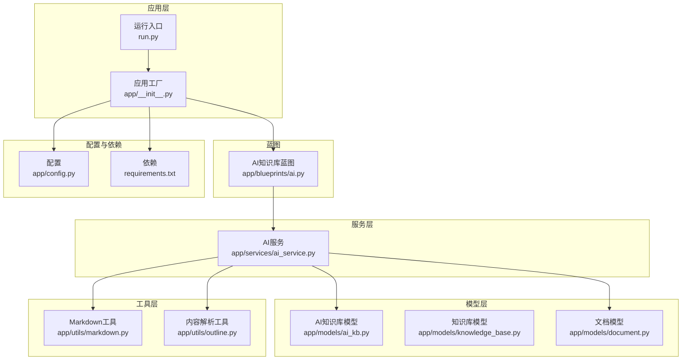
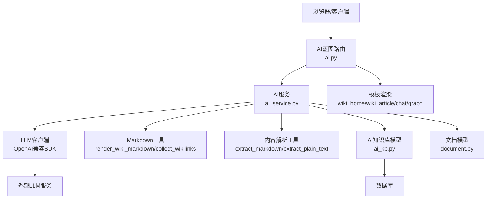
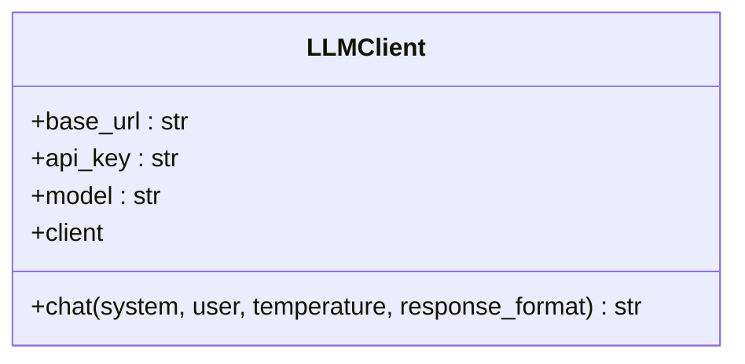
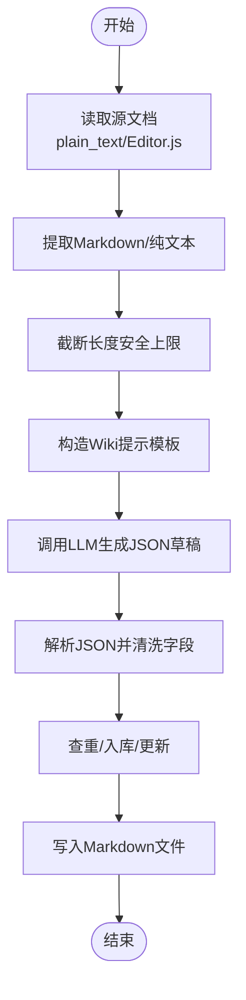
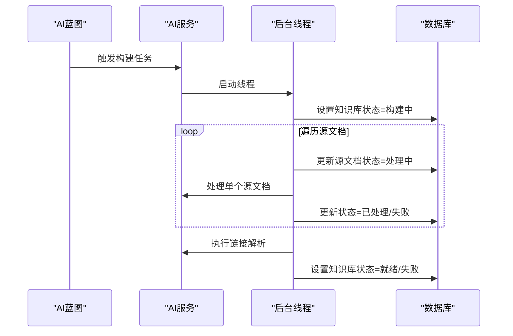
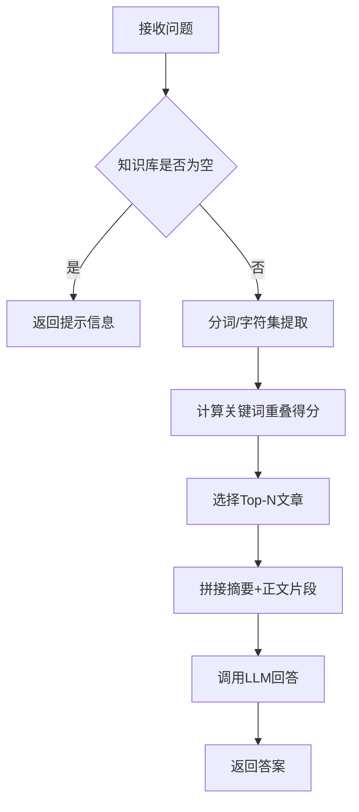
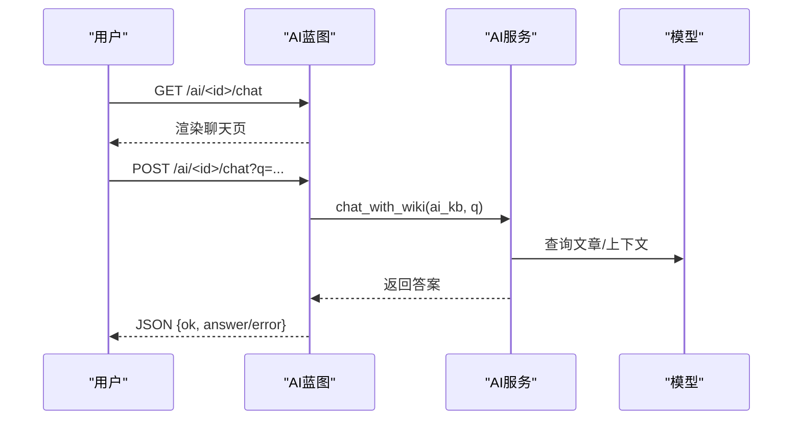
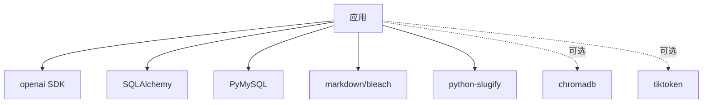

# AI知识库服务

<cite>
**本文引用的文件**
- [ai_service.py](file://app/services/ai_service.py)
- [ai.py](file://app/blueprints/ai.py)
- [ai_kb.py](file://app/models/ai_kb.py)
- [knowledge_base.py](file://app/models/knowledge_base.py)
- [kb_service.py](file://app/services/kb_service.py)
- [markdown.py](file://app/utils/markdown.py)
- [outline.py](file://app/utils/outline.py)
- [document.py](file://app/models/document.py)
- [config.py](file://app/config.py)
- [__init__.py](file://app/__init__.py)
- [run.py](file://run.py)
- [requirements.txt](file://requirements.txt)
</cite>

## 目录
1. [简介](#简介)
2. [项目结构](#项目结构)
3. [核心组件](#核心组件)
4. [架构总览](#架构总览)
5. [详细组件分析](#详细组件分析)
6. [依赖分析](#依赖分析)
7. [性能考虑](#性能考虑)
8. [故障排查指南](#故障排查指南)
9. [结论](#结论)
10. [附录](#附录)

## 简介
本项目提供“基于Karpathy LLM Wiki方法论”的AI知识库服务，支持：
- 文档到Markdown Wiki条目的转换与统一模板化
- Wiki链接解析与反链构建，形成双向超链接图谱
- 基于关键词重叠的简单检索与问答（可选RAG增强）
- OpenAI兼容SDK集成，支持多厂商模型
- 可选向量嵌入与ChromaDB存储（RAG模式）

该服务以Flask应用工厂模式组织，通过蓝图暴露管理与浏览接口，后端服务模块负责LLM调用、Wiki构建、链接解析、问答等核心逻辑。

## 项目结构
- 应用入口与工厂：[run.py](file://run.py)，[__init__.py](file://app/__init__.py)
- 蓝图：AI知识库蓝图位于[ai.py](file://app/blueprints/ai.py)
- 服务层：AI服务实现位于[ai_service.py](file://app/services/ai_service.py)
- 模型层：AI知识库相关模型位于[ai_kb.py](file://app/models/ai_kb.py)，通用知识库模型位于[knowledge_base.py](file://app/models/knowledge_base.py)，文档模型位于[document.py](file://app/models/document.py)
- 工具层：Markdown渲染与Wiki链接解析位于[markdown.py](file://app/utils/markdown.py)，Editor.js内容解析位于[outline.py](file://app/utils/outline.py)
- 配置与依赖：配置位于[config.py](file://app/config.py)，依赖声明位于[requirements.txt](file://requirements.txt)



图表来源
- [run.py:1-17](file://run.py#L1-L17)
- [__init__.py:11-28](file://app/__init__.py#L11-L28)
- [ai.py:1-279](file://app/blueprints/ai.py#L1-L279)
- [ai_service.py:1-408](file://app/services/ai_service.py#L1-L408)
- [ai_kb.py:1-121](file://app/models/ai_kb.py#L1-L121)
- [knowledge_base.py:1-62](file://app/models/knowledge_base.py#L1-L62)
- [document.py:1-98](file://app/models/document.py#L1-L98)
- [markdown.py:1-87](file://app/utils/markdown.py#L1-L87)
- [outline.py:1-136](file://app/utils/outline.py#L1-L136)
- [config.py:1-83](file://app/config.py#L1-L83)
- [requirements.txt:1-22](file://requirements.txt#L1-L22)

章节来源
- [run.py:1-17](file://run.py#L1-L17)
- [__init__.py:11-28](file://app/__init__.py#L11-L28)
- [ai.py:1-279](file://app/blueprints/ai.py#L1-L279)
- [ai_service.py:1-408](file://app/services/ai_service.py#L1-L408)
- [ai_kb.py:1-121](file://app/models/ai_kb.py#L1-L121)
- [knowledge_base.py:1-62](file://app/models/knowledge_base.py#L1-L62)
- [document.py:1-98](file://app/models/document.py#L1-L98)
- [markdown.py:1-87](file://app/utils/markdown.py#L1-L87)
- [outline.py:1-136](file://app/utils/outline.py#L1-L136)
- [config.py:1-83](file://app/config.py#L1-L83)
- [requirements.txt:1-22](file://requirements.txt#L1-L22)

## 核心组件
- LLM客户端：封装OpenAI兼容SDK，支持自定义base_url、api_key、model，提供chat接口。
- Wiki构建器：将文档内容转换为标准化的Wiki条目（标题、摘要、标签、正文、相关条目），并写入Markdown文件。
- 链接解析器：扫描条目中的[[...]]占位符，构建alias索引，解析为具体条目或红链。
- 异步构建流水线：后台线程批量处理源文档，更新状态，完成后执行链接解析。
- 对话问答：基于关键词重叠选择Top-N条目，拼接上下文后调用LLM回答；可选启用RAG增强。
- 蓝图路由：提供知识库创建、编辑、构建、浏览、图谱、聊天等接口。
- 模型与数据：AI知识库、源文档、文章、链接、可选分片等模型定义。

章节来源
- [ai_service.py:47-86](file://app/services/ai_service.py#L47-L86)
- [ai_service.py:147-161](file://app/services/ai_service.py#L147-L161)
- [ai_service.py:251-278](file://app/services/ai_service.py#L251-L278)
- [ai_service.py:313-344](file://app/services/ai_service.py#L313-L344)
- [ai_service.py:391-407](file://app/services/ai_service.py#L391-L407)
- [ai.py:18-85](file://app/blueprints/ai.py#L18-L85)
- [ai_kb.py:22-121](file://app/models/ai_kb.py#L22-L121)

## 架构总览
系统采用“蓝图+服务层+模型层+工具层”的分层设计，AI知识库功能由蓝图路由触发，服务层完成LLM调用、内容处理与状态管理，模型层持久化数据，工具层提供Markdown与内容解析能力。



图表来源
- [ai.py:176-279](file://app/blueprints/ai.py#L176-L279)
- [ai_service.py:47-86](file://app/services/ai_service.py#L47-L86)
- [ai_service.py:147-161](file://app/services/ai_service.py#L147-L161)
- [ai_service.py:251-278](file://app/services/ai_service.py#L251-L278)
- [ai_service.py:391-407](file://app/services/ai_service.py#L391-L407)
- [markdown.py:42-66](file://app/utils/markdown.py#L42-L66)
- [outline.py:90-136](file://app/utils/outline.py#L90-L136)
- [ai_kb.py:22-121](file://app/models/ai_kb.py#L22-L121)
- [document.py:20-46](file://app/models/document.py#L20-L46)

## 详细组件分析

### LLM客户端与提示工程
- 客户端封装：根据应用配置加载base_url、api_key、model，延迟初始化SDK客户端，提供chat接口。
- 提示工程：
  - Wiki系统提示：指导输出纯Markdown、摘要、标签、相关条目、引用格式。
  - Wiki用户模板：将原始文档内容注入模板，要求返回JSON结构。
  - 对话系统提示：基于上下文回答问题，要求引用来源条目。
- 温度与响应格式：问答场景使用较低温度，Wiki生成场景使用JSON响应格式以提升稳定性。



图表来源
- [ai_service.py:47-86](file://app/services/ai_service.py#L47-L86)

章节来源
- [ai_service.py:47-86](file://app/services/ai_service.py#L47-L86)
- [ai_service.py:92-119](file://app/services/ai_service.py#L92-L119)
- [ai_service.py:388-407](file://app/services/ai_service.py#L388-L407)

### Wiki构建与内容处理
- 文档到草稿：从Document中抽取plain_text或Editor.js内容转为Markdown，截断长度，调用LLM生成标准化草稿。
- 文章入库与去重：根据标题查找或新建AIKBArticle，合并多个源文档ID，确保slug唯一性。
- 文件落盘：生成Frontmatter（标题、slug、摘要、标签、时间戳）与正文，写入Markdown文件。
- 内容提取：提供Markdown与纯文本提取工具，便于后续检索与问答。



图表来源
- [ai_service.py:147-161](file://app/services/ai_service.py#L147-L161)
- [ai_service.py:204-230](file://app/services/ai_service.py#L204-L230)
- [outline.py:58-87](file://app/utils/outline.py#L58-L87)
- [outline.py:90-136](file://app/utils/outline.py#L90-L136)

章节来源
- [ai_service.py:147-161](file://app/services/ai_service.py#L147-L161)
- [ai_service.py:204-230](file://app/services/ai_service.py#L204-L230)
- [outline.py:58-87](file://app/utils/outline.py#L58-L87)
- [outline.py:90-136](file://app/utils/outline.py#L90-L136)

### 链接解析与反链图谱
- 别名索引：聚合标题、slug、别名，构建大小写不敏感的索引表。
- 解析过程：遍历所有文章的[[...]]占位符，尝试匹配索引，建立from/to关系，未命中的标记为红链。
- 运行时机：构建完成后清理旧链接，重新扫描并落库，支持实时解析器返回slug或None。

```mermaid
sequenceDiagram
participant Svc as "AI服务"
participant Art as "AIKBArticle"
participant Link as "AIKBLink"
participant MD as "collect_wikilinks"
Svc->>Svc : 清理旧链接
Svc->>Svc : 构建别名索引
loop 遍历文章
Svc->>Art : 读取content_md
Svc->>MD : 提取[[...]]占位符
MD-->>Svc : 返回目标列表
Svc->>Svc : 查找目标文章
Svc->>Link : 创建/更新链接记录
end
Svc-->>Svc : 返回解析统计
```

图表来源
- [ai_service.py:251-278](file://app/services/ai_service.py#L251-L278)
- [ai_service.py:237-248](file://app/services/ai_service.py#L237-L248)
- [markdown.py:69-86](file://app/utils/markdown.py#L69-L86)

章节来源
- [ai_service.py:251-278](file://app/services/ai_service.py#L251-L278)
- [ai_service.py:237-248](file://app/services/ai_service.py#L237-L248)
- [markdown.py:69-86](file://app/utils/markdown.py#L69-L86)

### 异步构建流水线
- 后台线程：启动独立线程执行构建任务，避免阻塞请求。
- 状态机：源文档状态（待处理/处理中/已处理/失败），知识库状态（空闲/构建中/就绪/失败）。
- 重试策略：仅处理待处理与失败的任务，默认只处理未完成项，支持全量重置。
- 单条重建：针对单篇文章重新生成，保留slug并重新解析链接。



图表来源
- [ai.py:143-156](file://app/blueprints/ai.py#L143-L156)
- [ai_service.py:313-344](file://app/services/ai_service.py#L313-L344)
- [ai_service.py:296-311](file://app/services/ai_service.py#L296-L311)
- [ai_service.py:347-381](file://app/services/ai_service.py#L347-L381)

章节来源
- [ai.py:143-156](file://app/blueprints/ai.py#L143-L156)
- [ai_service.py:313-344](file://app/services/ai_service.py#L313-L344)
- [ai_service.py:296-311](file://app/services/ai_service.py#L296-L311)
- [ai_service.py:347-381](file://app/services/ai_service.py#L347-L381)

### 对话问答与RAG增强
- 简单问答：按关键词重叠评分Top-N文章，拼接摘要与正文片段，调用LLM回答。
- RAG开关：当enable_rag为真时，可扩展为向量化检索与上下文增强（当前模型定义包含分片表，但服务层默认实现为关键词重叠）。
- 模型优先级：知识库级别chat_model优先，否则回退到全局配置。



图表来源
- [ai_service.py:391-407](file://app/services/ai_service.py#L391-L407)

章节来源
- [ai_service.py:391-407](file://app/services/ai_service.py#L391-L407)
- [ai_kb.py:30-31](file://app/models/ai_kb.py#L30-L31)
- [config.py:37-47](file://app/config.py#L37-L47)

### 蓝图路由与UI交互
- 知识库管理：创建、编辑、删除、状态查询。
- 源文档管理：添加/移除，权限控制基于知识库可见性与成员角色。
- Wiki浏览：首页按标签分组，文章页渲染Markdown并替换[[...]]为内部链接，支持反链显示。
- 图谱视图：导出节点与边，用于可视化。
- 聊天接口：支持GET/POST，POST返回JSON结果。



图表来源
- [ai.py:265-279](file://app/blueprints/ai.py#L265-L279)
- [ai_service.py:391-407](file://app/services/ai_service.py#L391-L407)

章节来源
- [ai.py:27-85](file://app/blueprints/ai.py#L27-L85)
- [ai.py:90-139](file://app/blueprints/ai.py#L90-L139)
- [ai.py:176-279](file://app/blueprints/ai.py#L176-L279)

## 依赖分析
- 外部SDK：OpenAI兼容SDK用于LLM调用。
- 数据库：SQLAlchemy ORM，MySQL驱动。
- 渲染与安全：Markdown、Bleach用于HTML安全渲染。
- Slug化：python-slugify用于URL友好的slug生成。
- 可选RAG：ChromaDB与tiktoken（在ENABLE_RAG=true时启用）。



图表来源
- [requirements.txt:1-22](file://requirements.txt#L1-L22)
- [config.py:37-47](file://app/config.py#L37-L47)

章节来源
- [requirements.txt:1-22](file://requirements.txt#L1-L22)
- [config.py:37-47](file://app/config.py#L37-L47)

## 性能考虑
- 并发与异步：构建任务在后台线程执行，避免阻塞主线程。
- 文本截断：对输入文本设置安全上限，减少LLM负载与成本。
- 索引与去重：别名索引与wikilink去重，降低重复解析开销。
- 关键词重叠：无需向量检索，适合中小规模知识库快速迭代。
- 可选RAG：大规模场景建议启用RAG，结合向量检索提升召回质量。

## 故障排查指南
- LLM SDK缺失：初始化LLM客户端时如未安装openai SDK，将抛出运行时异常，需安装依赖。
- 外部API错误：构建过程中捕获异常并记录错误消息，可在状态接口查看。
- 权限问题：蓝图对知识库拥有者与超级管理员开放访问，非授权用户将收到403。
- 红链检测：链接解析后可统计红链数量，辅助识别未解析的目标。
- 配置检查：确认OPENAI_BASE_URL、OPENAI_API_KEY、CHAT_MODEL、AI_WIKI_DIR等环境变量正确。

章节来源
- [ai_service.py:66-70](file://app/services/ai_service.py#L66-L70)
- [ai_service.py:307-310](file://app/services/ai_service.py#L307-L310)
- [ai.py:18-24](file://app/blueprints/ai.py#L18-L24)
- [ai.py:159-173](file://app/blueprints/ai.py#L159-L173)
- [config.py:37-47](file://app/config.py#L37-L47)

## 结论
本AI知识库服务以Karpathy LLM Wiki为核心思想，通过LLM将多源文档转化为结构化的Markdown条目，借助别名索引与wikilink实现双向链接与反链图谱。服务层提供异步构建、链接解析与问答能力，蓝图提供完整的管理与浏览界面。对于大规模知识库，可结合可选RAG增强实现更精准的检索与问答。

## 附录
- 实际使用步骤（示例路径，非代码内容）：
  - 创建知识库：POST /ai/new，表单包含name、description、chat_model。
  - 添加源文档：GET /ai/<id>/sources，勾选文档后POST /ai/<id>/sources/add。
  - 启动构建：POST /ai/<id>/build，支持仅处理未完成项或全量重置。
  - 浏览Wiki：GET /ai/<id>/wiki 或 /ai/<id>/wiki/<slug>。
  - 查看图谱：GET /ai/<id>/graph。
  - 聊天问答：GET /ai/<id>/chat 或 POST /ai/<id>/chat?q=...

章节来源
- [ai.py:34-52](file://app/blueprints/ai.py#L34-L52)
- [ai.py:90-126](file://app/blueprints/ai.py#L90-L126)
- [ai.py:143-156](file://app/blueprints/ai.py#L143-L156)
- [ai.py:194-236](file://app/blueprints/ai.py#L194-L236)
- [ai.py:251-260](file://app/blueprints/ai.py#L251-L260)
- [ai.py:265-279](file://app/blueprints/ai.py#L265-L279)