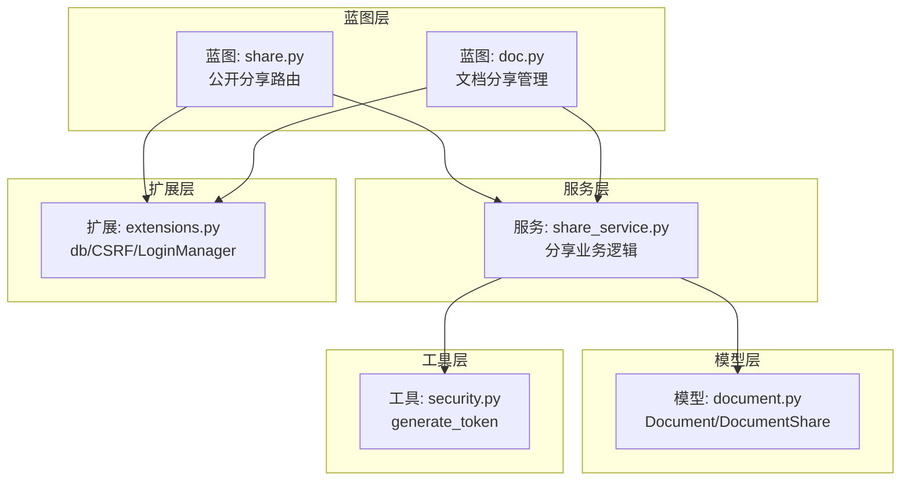
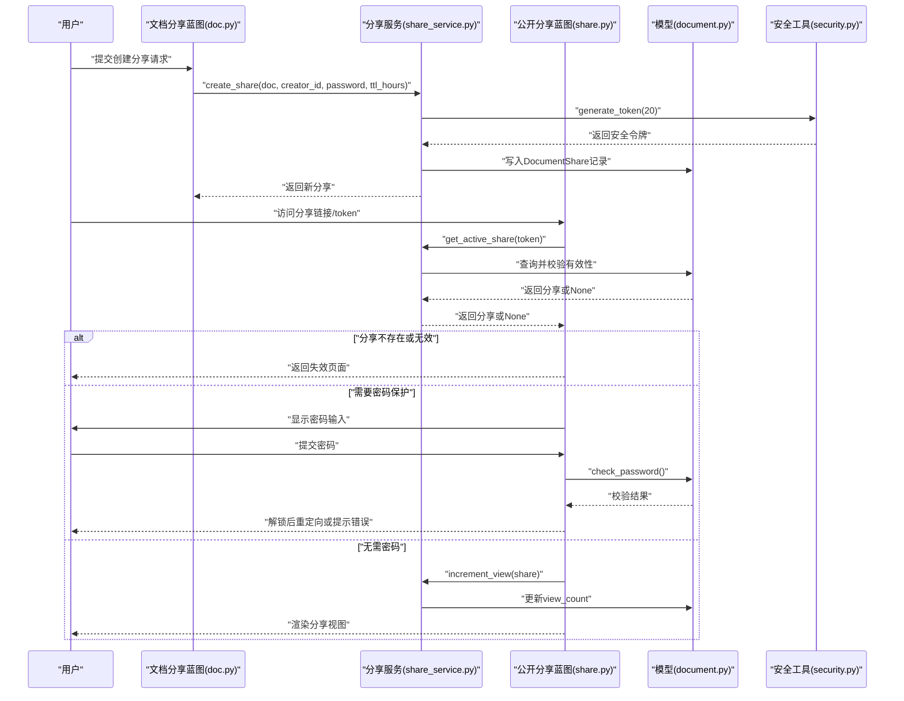
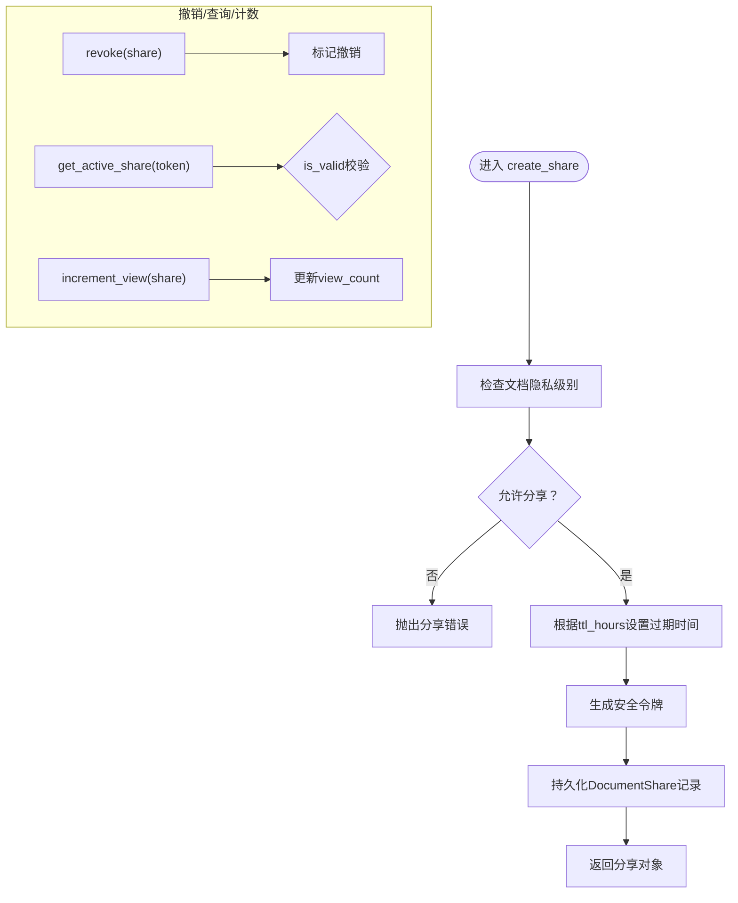
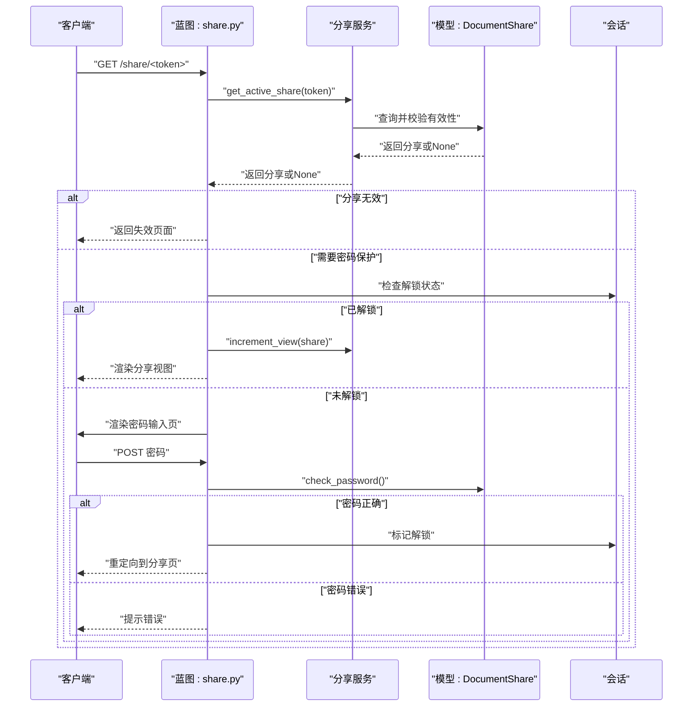
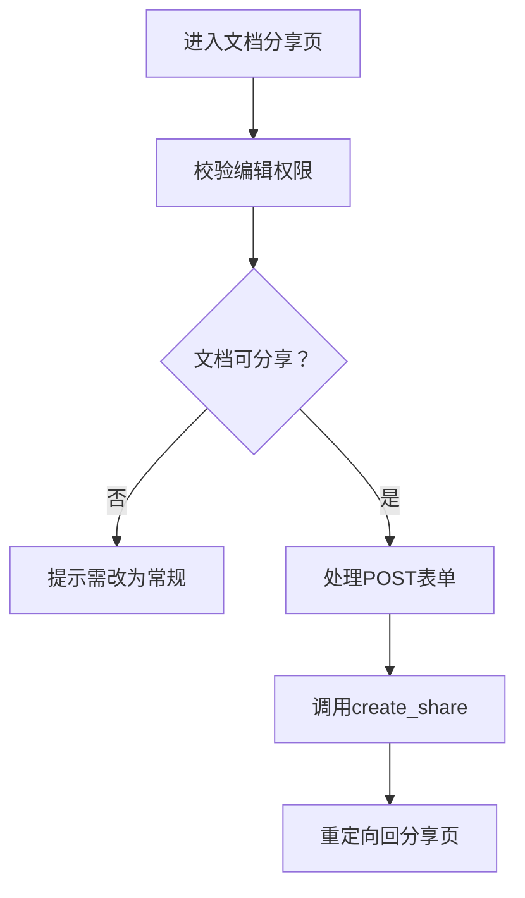
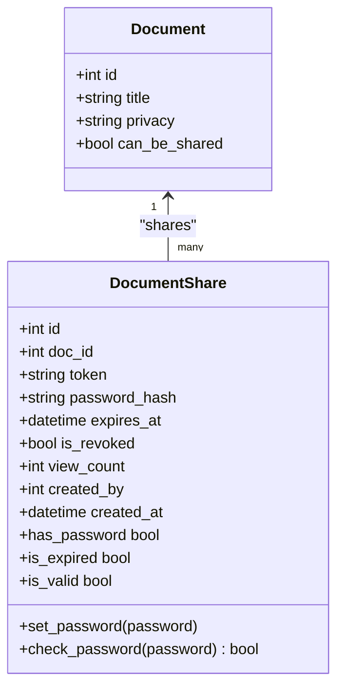
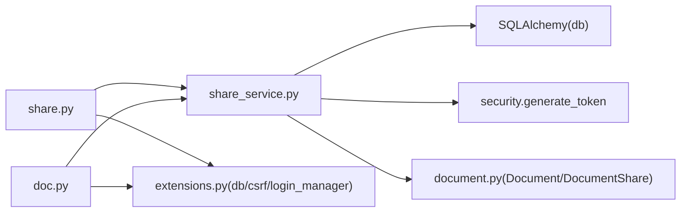

# 分享服务

<cite>
**本文引用的文件**
- [app/services/share_service.py](file://app/services/share_service.py)
- [app/blueprints/share.py](file://app/blueprints/share.py)
- [app/blueprints/doc.py](file://app/blueprints/doc.py)
- [app/models/document.py](file://app/models/document.py)
- [app/utils/security.py](file://app/utils/security.py)
- [app/extensions.py](file://app/extensions.py)
</cite>

## 目录
1. [简介](#简介)
2. [项目结构](#项目结构)
3. [核心组件](#核心组件)
4. [架构总览](#架构总览)
5. [详细组件分析](#详细组件分析)
6. [依赖分析](#依赖分析)
7. [性能考虑](#性能考虑)
8. [故障排查指南](#故障排查指南)
9. [结论](#结论)
10. [附录](#附录)

## 简介
本文件面向“分享服务”的技术文档，聚焦于文档与知识库的公开分享能力，涵盖分享链接生成、访问权限控制（含密码保护）、分享统计与过期管理、分享令牌机制、访问验证流程、匿名访问支持与安全防护、分享链接生命周期管理、访问日志记录与用户体验优化策略，并通过具体代码路径示例展示如何实现安全的分享功能与访问控制。

## 项目结构
分享服务由三层协作构成：
- 蓝图层：对外暴露分享入口路由与交互逻辑（公开分享蓝图与文档分享蓝图）
- 服务层：封装分享业务规则（创建、撤销、有效性校验、计数）
- 模型层：持久化存储分享状态、文档与令牌信息
- 工具层：提供安全令牌生成等辅助能力
- 扩展层：统一注入数据库、CSRF、登录管理等基础设施

图表来源
- [app/blueprints/share.py:1-42](file://app/blueprints/share.py#L1-L42)
- [app/blueprints/doc.py:100-139](file://app/blueprints/doc.py#L100-L139)
- [app/services/share_service.py:1-49](file://app/services/share_service.py#L1-L49)
- [app/models/document.py:56-98](file://app/models/document.py#L56-L98)
- [app/utils/security.py:5-8](file://app/utils/security.py#L5-L8)
- [app/extensions.py:8-17](file://app/extensions.py#L8-L17)

章节来源
- [app/blueprints/share.py:1-42](file://app/blueprints/share.py#L1-L42)
- [app/blueprints/doc.py:100-139](file://app/blueprints/doc.py#L100-L139)
- [app/services/share_service.py:1-49](file://app/services/share_service.py#L1-L49)
- [app/models/document.py:56-98](file://app/models/document.py#L56-L98)
- [app/utils/security.py:5-8](file://app/utils/security.py#L5-L8)
- [app/extensions.py:8-17](file://app/extensions.py#L8-L17)

## 核心组件
- 分享服务（share_service.py）
  - 提供分享创建、撤销、有效分享查询、访问计数等能力
  - 关键函数路径：[create_share:15-31](file://app/services/share_service.py#L15-L31)、[revoke:34-36](file://app/services/share_service.py#L34-L36)、[get_active_share:39-43](file://app/services/share_service.py#L39-L43)、[increment_view:46-48](file://app/services/share_service.py#L46-L48)
- 公开分享蓝图（share.py）
  - 处理公开分享入口、密码保护、会话解锁标记、渲染分享视图
  - 关键函数路径：[view:22-41](file://app/blueprints/share.py#L22-L41)
- 文档分享蓝图（doc.py）
  - 管理文档的分享创建、撤销、列表展示
  - 关键函数路径：[share:103-124](file://app/blueprints/doc.py#L103-L124)、[revoke_share:127-138](file://app/blueprints/doc.py#L127-L138)
- 数据模型（document.py）
  - 定义文档与分享实体、密码哈希、过期与撤销字段、有效性判断
  - 关键属性与方法路径：[DocumentShare.set_password:73-77](file://app/models/document.py#L73-L77)、[DocumentShare.check_password:79-82](file://app/models/document.py#L79-L82)、[DocumentShare.is_valid:92-94](file://app/models/document.py#L92-L94)
- 安全工具（security.py）
  - 提供安全随机令牌生成
  - 关键函数路径：[generate_token:5-7](file://app/utils/security.py#L5-L7)
- 应用扩展（extensions.py）
  - 注入数据库、CSRF、登录管理等
  - 关键对象路径：[db](file://app/extensions.py#L8)、[csrf](file://app/extensions.py#LL10-L11)、[login_manager:14-16](file://app/extensions.py#L14-L16)

章节来源
- [app/services/share_service.py:15-48](file://app/services/share_service.py#L15-L48)
- [app/blueprints/share.py:22-41](file://app/blueprints/share.py#L22-L41)
- [app/blueprints/doc.py:103-138](file://app/blueprints/doc.py#L103-L138)
- [app/models/document.py:73-94](file://app/models/document.py#L73-L94)
- [app/utils/security.py:5-7](file://app/utils/security.py#L5-L7)
- [app/extensions.py:8-16](file://app/extensions.py#L8-L16)

## 架构总览
分享服务采用“蓝图-服务-模型-工具-扩展”分层架构，围绕 DocumentShare 实体完成分享令牌的生成、存储与校验，结合 Flask 会话实现密码保护的临时解锁，最终渲染公开分享视图。

图表来源
- [app/blueprints/doc.py:113-122](file://app/blueprints/doc.py#L113-L122)
- [app/services/share_service.py:15-31](file://app/services/share_service.py#L15-L31)
- [app/utils/security.py:5-7](file://app/utils/security.py#L5-L7)
- [app/blueprints/share.py:22-41](file://app/blueprints/share.py#L22-L41)
- [app/services/share_service.py:39-43](file://app/services/share_service.py#L39-L43)
- [app/models/document.py:79-82](file://app/models/document.py#L79-L82)
- [app/services/share_service.py:46-48](file://app/services/share_service.py#L46-L48)

## 详细组件分析

### 组件一：分享服务（share_service.py）
- 职责
  - 创建分享：校验文档隐私级别，生成唯一令牌，设置可选密码与过期时间，持久化保存
  - 撤销分享：将分享标记为撤销
  - 查询有效分享：按令牌查询并校验是否有效（未撤销且未过期）
  - 访问计数：每次成功访问增加浏览次数
- 关键点
  - 令牌生成使用安全随机算法，长度适中，适合URL分享
  - 过期时间基于UTC时间计算，支持小时级配置
  - 密码采用哈希存储，校验时使用安全比对
- 复杂度
  - 查询与更新均为单表操作，时间复杂度近似O(1)，受索引影响
- 错误处理
  - 私密文档禁止分享，抛出自定义异常
- 性能建议
  - 对分享令牌与创建时间建立索引；对view_count更新采用批量策略（如需）

图表来源
- [app/services/share_service.py:15-31](file://app/services/share_service.py#L15-L31)
- [app/utils/security.py:5-7](file://app/utils/security.py#L5-L7)
- [app/models/document.py:88-94](file://app/models/document.py#L88-L94)
- [app/services/share_service.py:34-48](file://app/services/share_service.py#L34-L48)

章节来源
- [app/services/share_service.py:15-48](file://app/services/share_service.py#L15-L48)
- [app/utils/security.py:5-7](file://app/utils/security.py#L5-L7)
- [app/models/document.py:73-94](file://app/models/document.py#L73-L94)

### 组件二：公开分享蓝图（share.py）
- 职责
  - 公开入口：处理分享链接访问，支持GET/POST
  - 密码保护：若分享设置了密码，使用会话标记进行临时解锁
  - 渲染视图：成功访问后提取大纲并渲染分享视图
- 访问流程
  - 获取有效分享
  - 若需要密码且未解锁：渲染密码页并校验
  - 成功解锁或无需密码：计数+渲染视图
  - 文档不存在或已删除：返回失效页面
- 安全要点
  - 使用会话前缀区分不同分享的解锁状态
  - 结合CSRF保护（蓝图依赖CSRF）防止跨站请求伪造

图表来源
- [app/blueprints/share.py:22-41](file://app/blueprints/share.py#L22-L41)
- [app/services/share_service.py:39-43](file://app/services/share_service.py#L39-L43)
- [app/models/document.py:79-82](file://app/models/document.py#L79-L82)
- [app/services/share_service.py:46-48](file://app/services/share_service.py#L46-L48)

章节来源
- [app/blueprints/share.py:14-41](file://app/blueprints/share.py#L14-L41)
- [app/services/share_service.py:39-48](file://app/services/share_service.py#L39-L48)
- [app/models/document.py:79-82](file://app/models/document.py#L79-L82)

### 组件三：文档分享蓝图（doc.py）
- 职责
  - 展示与创建分享：校验编辑权限，检查文档是否可分享，提交后调用服务创建分享
  - 撤销分享：校验编辑权限，调用服务撤销分享
  - 列表展示：按创建时间倒序展示当前文档的所有分享
- 权限控制
  - 仅知识库编辑者可创建/撤销分享
  - 私密文档禁止分享，需先修改为常规

图表来源
- [app/blueprints/doc.py:103-124](file://app/blueprints/doc.py#L103-L124)
- [app/blueprints/doc.py:127-138](file://app/blueprints/doc.py#L127-L138)
- [app/services/share_service.py:15-31](file://app/services/share_service.py#L15-L31)

章节来源
- [app/blueprints/doc.py:103-138](file://app/blueprints/doc.py#L103-L138)
- [app/services/share_service.py:15-31](file://app/services/share_service.py#L15-L31)

### 组件四：数据模型（document.py）
- DocumentShare
  - 字段：关联文档、令牌、密码哈希、过期时间、撤销标志、访问计数、创建者与时间
  - 方法：设置/校验密码、判断是否设密码、是否过期、是否有效
- Document
  - 字段：标题、类型、隐私级别、内容JSON、作者、创建/更新时间等
  - 属性：can_be_shared用于判定是否允许分享

图表来源
- [app/models/document.py:20-51](file://app/models/document.py#L20-L51)
- [app/models/document.py:56-98](file://app/models/document.py#L56-L98)

章节来源
- [app/models/document.py:20-51](file://app/models/document.py#L20-L51)
- [app/models/document.py:56-98](file://app/models/document.py#L56-L98)

### 组件五：安全工具（security.py）
- generate_token：使用安全随机源生成URL安全的令牌字符串，适合分享链接使用

章节来源
- [app/utils/security.py:5-7](file://app/utils/security.py#L5-L7)

### 组件六：应用扩展（extensions.py）
- db：SQLAlchemy数据库实例
- csrf：CSRF保护
- login_manager：登录管理器，统一登录视图与消息

章节来源
- [app/extensions.py:8-16](file://app/extensions.py#L8-L16)

## 依赖分析
- 组件耦合
  - share.py 依赖 share_service 与 DocumentShare 模型
  - doc.py 依赖 share_service 与 Document/DocumentShare 模型
  - share_service 依赖 db、DocumentShare、security.generate_token
  - 模型间通过外键关联，确保级联删除与一致性
- 外部依赖
  - Flask、SQLAlchemy、Werkzeug安全工具
  - CSRF保护与会话管理

图表来源
- [app/blueprints/share.py:1-8](file://app/blueprints/share.py#L1-L8)
- [app/blueprints/doc.py:1-7](file://app/blueprints/doc.py#L1-L7)
- [app/services/share_service.py:1-8](file://app/services/share_service.py#L1-L8)
- [app/models/document.py:1-7](file://app/models/document.py#L1-L7)
- [app/utils/security.py:1-7](file://app/utils/security.py#L1-L7)
- [app/extensions.py:1-11](file://app/extensions.py#L1-L11)

章节来源
- [app/blueprints/share.py:1-8](file://app/blueprints/share.py#L1-L8)
- [app/blueprints/doc.py:1-7](file://app/blueprints/doc.py#L1-L7)
- [app/services/share_service.py:1-8](file://app/services/share_service.py#L1-L8)
- [app/models/document.py:1-7](file://app/models/document.py#L1-L7)
- [app/utils/security.py:1-7](file://app/utils/security.py#L1-L7)
- [app/extensions.py:1-11](file://app/extensions.py#L1-L11)

## 性能考虑
- 索引优化
  - 在 DocumentShare.token 上建立唯一索引，加速查找
  - 在 DocumentShare.created_at 上建立索引，提升分享列表排序效率
- 计数策略
  - 访问计数每次更新可能带来写放大，可考虑批量更新或异步计数
- 缓存策略
  - 对热点分享链接的元信息进行短期缓存，降低数据库压力
- 并发控制
  - 增加并发访问下的计数更新原子性（如使用数据库自增或乐观锁）

## 故障排查指南
- 分享链接返回失效页面
  - 检查分享是否存在、是否被撤销、是否过期
  - 参考路径：[get_active_share:39-43](file://app/services/share_service.py#L39-L43)、[DocumentShare.is_valid:92-94](file://app/models/document.py#L92-L94)
- 密码错误
  - 确认提交的密码与哈希一致
  - 参考路径：[DocumentShare.check_password:79-82](file://app/models/document.py#L79-L82)
- 私密文档无法分享
  - 需先将文档隐私级别调整为常规
  - 参考路径：[Document.can_be_shared:48-50](file://app/models/document.py#L48-L50)
- 无法访问分享页（403）
  - 知识库编辑权限不足
  - 参考路径：[doc.py 权限校验:107-109](file://app/blueprints/doc.py#L107-L109)
- CSRF相关问题
  - 确保表单包含CSRF令牌
  - 参考路径：[extensions.py CSRF:10-11](file://app/extensions.py#L10-L11)

章节来源
- [app/services/share_service.py:39-43](file://app/services/share_service.py#L39-L43)
- [app/models/document.py:79-94](file://app/models/document.py#L79-L94)
- [app/blueprints/doc.py:107-112](file://app/blueprints/doc.py#L107-L112)
- [app/extensions.py:10-11](file://app/extensions.py#L10-L11)

## 结论
分享服务通过简洁的令牌机制与严格的访问控制，实现了文档的公开分享与统计。其设计遵循最小可用原则：仅在必要时要求密码，支持过期与撤销，具备良好的可审计性与可维护性。建议在生产环境中进一步完善索引、计数策略与缓存，以提升性能与稳定性。

## 附录
- 分享链接生命周期管理
  - 创建：生成令牌、可选密码与过期时间
  - 生效：未撤销且未过期
  - 统计：每次成功访问增加计数
  - 终止：撤销或过期
- 访问日志记录
  - 当前实现未内置访问日志，可在以下位置扩展：[increment_view:46-48](file://app/services/share_service.py#L46-L48) 或 [share.py 视图渲染前后:36-41](file://app/blueprints/share.py#L36-L41)
- 用户体验优化
  - 密码保护：一次性解锁，避免重复输入
  - 失效提示：清晰的失效页面与错误提示
  - 列表展示：按创建时间倒序，便于管理