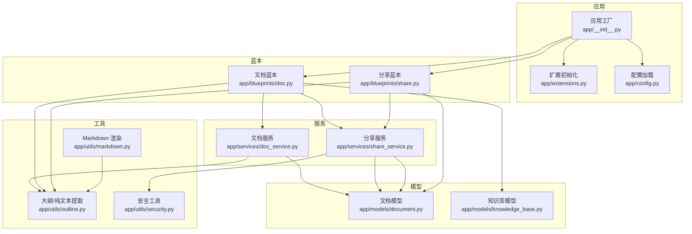
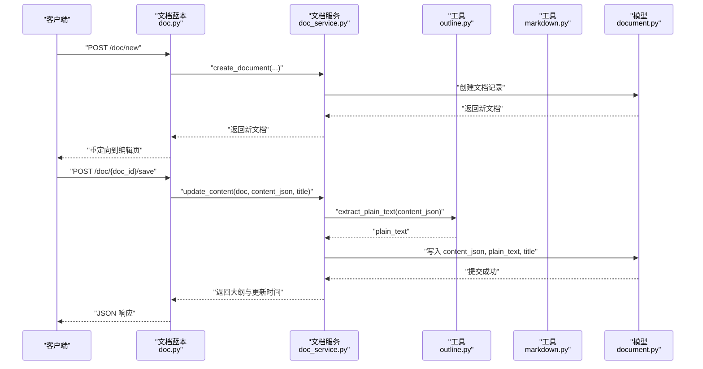
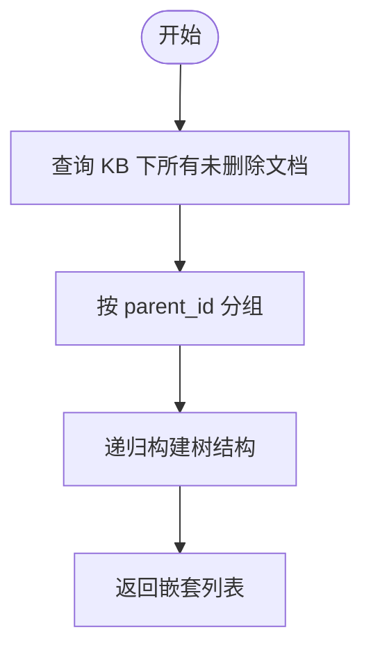
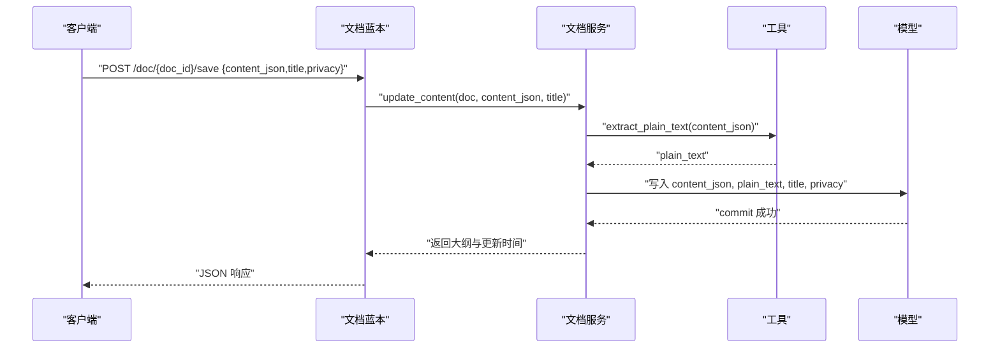
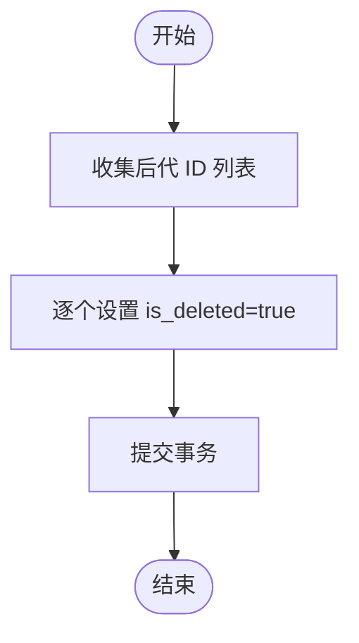
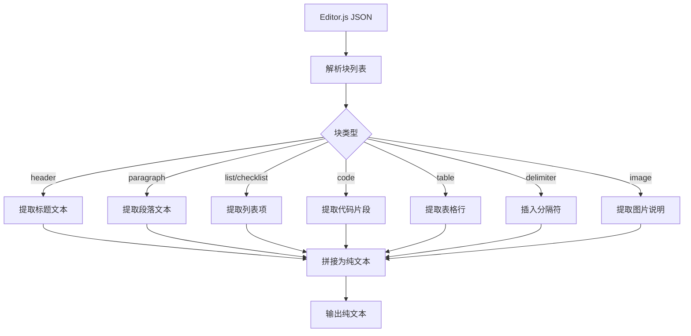
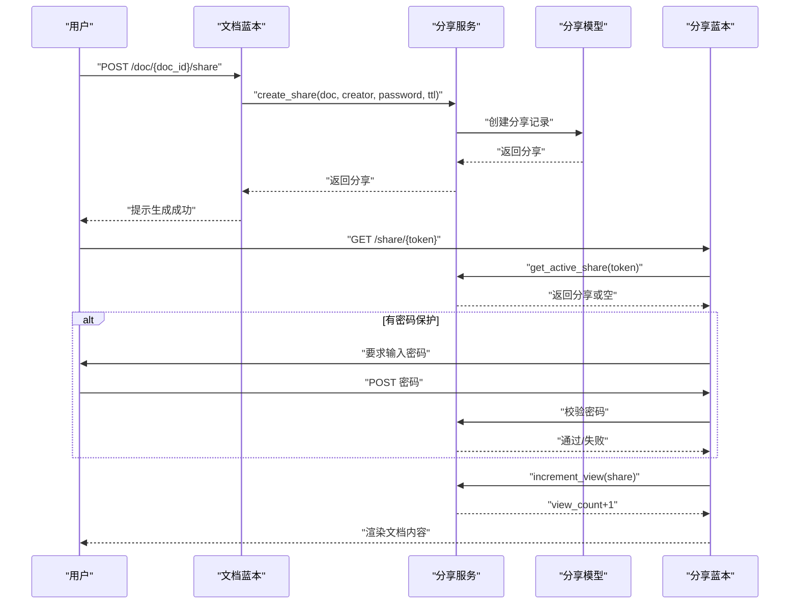
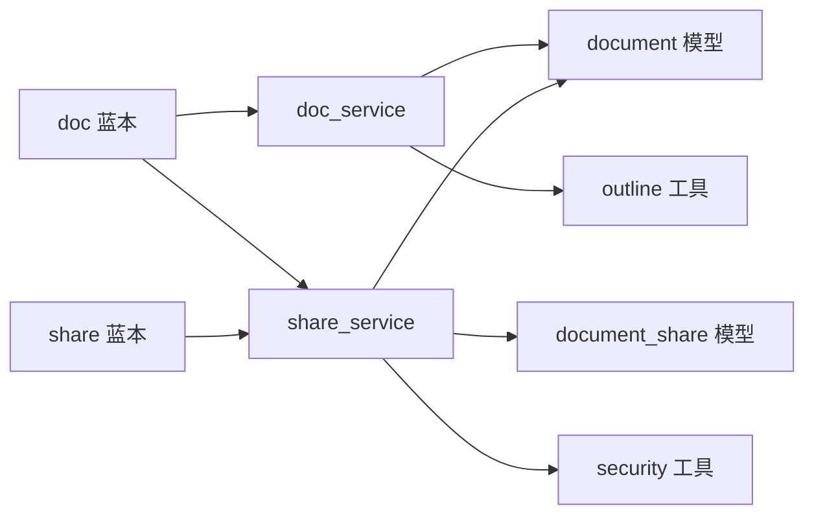

# 文档管理服务

<cite>
**本文引用的文件**
- [app/services/doc_service.py](file://app/services/doc_service.py)
- [app/models/document.py](file://app/models/document.py)
- [app/blueprints/doc.py](file://app/blueprints/doc.py)
- [app/utils/outline.py](file://app/utils/outline.py)
- [app/utils/markdown.py](file://app/utils/markdown.py)
- [app/services/share_service.py](file://app/services/share_service.py)
- [app/blueprints/share.py](file://app/blueprints/share.py)
- [app/models/knowledge_base.py](file://app/models/knowledge_base.py)
- [app/utils/security.py](file://app/utils/security.py)
- [app/extensions.py](file://app/extensions.py)
- [app/config.py](file://app/config.py)
- [app/__init__.py](file://app/__init__.py)
</cite>

## 目录
1. [简介](#简介)
2. [项目结构](#项目结构)
3. [核心组件](#核心组件)
4. [架构总览](#架构总览)
5. [详细组件分析](#详细组件分析)
6. [依赖分析](#依赖分析)
7. [性能考虑](#性能考虑)
8. [故障排查指南](#故障排查指南)
9. [结论](#结论)
10. [附录](#附录)

## 简介
本技术文档围绕“文档管理服务”展开，重点阐述 doc_service 如何支撑文档的创建、编辑、删除、版本控制（当前实现为内容覆盖式）、富文本处理与文档树结构管理；同时说明文档内容存储、Markdown 渲染、文件上传处理、文档分享机制与访问统计、元数据管理、搜索索引构建思路、缓存策略与性能优化方案，并提供具体 API 使用与操作流程的示例路径。

## 项目结构
后端采用 Flask 应用工厂模式，蓝本按功能域划分：认证、用户、知识库、文档、分享、AI、主页面等。文档相关的核心逻辑集中在以下模块：
- 蓝本层：负责路由、鉴权、参数校验与响应渲染
- 服务层：封装业务逻辑（文档树、内容更新、分享）
- 模型层：定义文档、分享、知识库等实体及关系
- 工具层：富文本解析与 Markdown 渲染、目录提取、安全令牌生成
- 配置与扩展：数据库、CSRF、会话、上传目录等

图表来源
- [app/__init__.py:11-28](file://app/__init__.py#L11-L28)
- [app/__init__.py:39-74](file://app/__init__.py#L39-L74)
- [app/blueprints/doc.py:1-139](file://app/blueprints/doc.py#L1-L139)
- [app/blueprints/share.py:1-42](file://app/blueprints/share.py#L1-L42)
- [app/services/doc_service.py:1-81](file://app/services/doc_service.py#L1-L81)
- [app/services/share_service.py:1-49](file://app/services/share_service.py#L1-L49)
- [app/models/document.py:1-98](file://app/models/document.py#L1-L98)
- [app/models/knowledge_base.py:1-62](file://app/models/knowledge_base.py#L1-L62)
- [app/utils/outline.py:1-136](file://app/utils/outline.py#L1-L136)
- [app/utils/markdown.py:1-87](file://app/utils/markdown.py#L1-L87)
- [app/utils/security.py:1-8](file://app/utils/security.py#L1-L8)

章节来源
- [app/__init__.py:11-28](file://app/__init__.py#L11-L28)
- [app/__init__.py:39-74](file://app/__init__.py#L39-L74)
- [app/config.py:15-83](file://app/config.py#L15-L83)
- [app/extensions.py:1-17](file://app/extensions.py#L1-L17)

## 核心组件
- 文档服务（doc_service）：提供文档树构建、文档创建、内容更新（富文本 JSON）、软删除、后代收集等能力
- 分享服务（share_service）：生成分享令牌、密码保护、过期控制、访问计数
- 文档模型（document）：定义文档字段、隐私与可分享性、作者与知识库关系、软删除标记
- 知识库模型（knowledge_base）：定义可见性、成员角色与权限边界
- 蓝本（doc、share）：路由入口、鉴权与参数校验、渲染与响应
- 工具（outline、markdown、security）：富文本块解析、纯文本提取、Markdown 渲染、安全令牌生成

章节来源
- [app/services/doc_service.py:11-81](file://app/services/doc_service.py#L11-L81)
- [app/services/share_service.py:15-49](file://app/services/share_service.py#L15-L49)
- [app/models/document.py:20-98](file://app/models/document.py#L20-L98)
- [app/models/knowledge_base.py:19-62](file://app/models/knowledge_base.py#L19-L62)
- [app/blueprints/doc.py:20-139](file://app/blueprints/doc.py#L20-L139)
- [app/blueprints/share.py:22-42](file://app/blueprints/share.py#L22-L42)
- [app/utils/outline.py:22-136](file://app/utils/outline.py#L22-L136)
- [app/utils/markdown.py:31-87](file://app/utils/markdown.py#L31-L87)
- [app/utils/security.py:5-8](file://app/utils/security.py#L5-L8)

## 架构总览
文档管理服务遵循“蓝本-服务-模型-工具”的分层设计，富文本以 Editor.js JSON 存储，通过工具层进行纯文本提取与大纲生成，分享通过独立令牌与可选密码实现访问控制与统计。

图表来源
- [app/blueprints/doc.py:20-84](file://app/blueprints/doc.py#L20-L84)
- [app/services/doc_service.py:37-62](file://app/services/doc_service.py#L37-L62)
- [app/utils/outline.py:58-87](file://app/utils/outline.py#L58-L87)
- [app/models/document.py:20-46](file://app/models/document.py#L20-L46)

## 详细组件分析

### 文档树结构管理
- 功能要点
  - 按父节点分组，排序优先级：父节点排在子节点前，再按 sort_order 升序，最后按 id 升序
  - 递归构建嵌套列表，包含 id、标题、类型、隐私级别与子节点
  - 仅返回未删除文档
- 复杂度
  - 时间复杂度 O(n)，空间复杂度 O(n)
- 关键实现路径
  - [list_kb_doc_tree:11-34](file://app/services/doc_service.py#L11-L34)

图表来源
- [app/services/doc_service.py:11-34](file://app/services/doc_service.py#L11-L34)

章节来源
- [app/services/doc_service.py:11-34](file://app/services/doc_service.py#L11-L34)

### 文档创建与内容更新
- 创建流程
  - 参数校验：知识库存在性、编辑权限、类型与隐私枚举合法性
  - 默认值：未命名标题、空内容 JSON 与纯文本、排序号 0、作者来自当前用户
  - 返回新文档并重定向至编辑页
- 内容更新流程
  - 支持更新标题、内容 JSON 与隐私级别
  - 将 Editor.js JSON 转换为纯文本用于搜索/AI 索引
  - 返回更新后的大纲与更新时间
- 关键实现路径
  - [create_document:37-53](file://app/services/doc_service.py#L37-L53)
  - [update_content:56-62](file://app/services/doc_service.py#L56-L62)
  - [蓝本保存接口:69-84](file://app/blueprints/doc.py#L69-L84)
  - [纯文本提取:58-87](file://app/utils/outline.py#L58-87)

图表来源
- [app/blueprints/doc.py:69-84](file://app/blueprints/doc.py#L69-L84)
- [app/services/doc_service.py:56-62](file://app/services/doc_service.py#L56-L62)
- [app/utils/outline.py:58-87](file://app/utils/outline.py#L58-L87)
- [app/models/document.py:20-46](file://app/models/document.py#L20-L46)

章节来源
- [app/blueprints/doc.py:20-41](file://app/blueprints/doc.py#L20-L41)
- [app/blueprints/doc.py:69-84](file://app/blueprints/doc.py#L69-L84)
- [app/services/doc_service.py:37-62](file://app/services/doc_service.py#L37-L62)
- [app/utils/outline.py:58-87](file://app/utils/outline.py#L58-L87)

### 文档删除与版本控制
- 删除策略
  - 软删除：将自身与所有后代文档标记为已删除
  - 后代收集使用广度优先遍历，确保完整清理
- 版本控制现状
  - 当前未实现历史版本存储；内容更新为覆盖式写入
- 关键实现路径
  - [collect_descendants:70-80](file://app/services/doc_service.py#L70-L80)
  - [软删除接口:87-100](file://app/blueprints/doc.py#L87-100)

图表来源
- [app/services/doc_service.py:70-80](file://app/services/doc_service.py#L70-L80)
- [app/blueprints/doc.py:87-100](file://app/blueprints/doc.py#L87-L100)

章节来源
- [app/services/doc_service.py:70-80](file://app/services/doc_service.py#L70-L80)
- [app/blueprints/doc.py:87-100](file://app/blueprints/doc.py#L87-L100)

### 富文本处理与渲染
- Editor.js JSON 解析
  - 提取块类型与数据，支持标题、段落、列表、检查清单、代码、表格、分割线、图片等
  - 生成纯文本用于搜索与 AI 索引
  - 生成大纲（H1-H3）用于侧边导航
- Markdown 渲染
  - 使用 Markdown 扩展与 Bleach 进行安全清洗，保留必要标签与属性
  - 支持 Wiki 链接替换与去重
- 关键实现路径
  - [纯文本提取:58-87](file://app/utils/outline.py#L58-87)
  - [大纲提取:34-55](file://app/utils/outline.py#L34-55)
  - [Markdown 渲染:31-39](file://app/utils/markdown.py#L31-39)
  - [Wiki 链接渲染:42-66](file://app/utils/markdown.py#L42-66)

图表来源
- [app/utils/outline.py:22-136](file://app/utils/outline.py#L22-L136)

章节来源
- [app/utils/outline.py:22-136](file://app/utils/outline.py#L22-L136)
- [app/utils/markdown.py:31-87](file://app/utils/markdown.py#L31-L87)

### 文档树视图与侧边导航
- 文档详情页同时渲染文档树与大纲
- 文档树由服务层构建，侧边导航由大纲驱动
- 关键实现路径
  - [文档视图渲染:43-55](file://app/blueprints/doc.py#L43-55)
  - [大纲提取:34-55](file://app/utils/outline.py#L34-55)

章节来源
- [app/blueprints/doc.py:43-55](file://app/blueprints/doc.py#L43-L55)
- [app/utils/outline.py:34-55](file://app/utils/outline.py#L34-L55)

### 文件上传处理
- 配置项
  - 上传目录：UPLOAD_DIR，默认 instance/uploads
  - 最大内容长度：MAX_CONTENT_LENGTH，默认 32MB
- 实践建议
  - 在蓝本中增加文件上传路由与校验
  - 对上传文件进行类型与大小限制
  - 将文件持久化至指定目录并记录元数据
- 关键实现路径
  - [配置项:33-35](file://app/config.py#L33-L35)

章节来源
- [app/config.py:33-35](file://app/config.py#L33-L35)

### 文档分享机制与访问统计
- 分享令牌
  - 生成 URL 安全令牌，可选过期时间
  - 私密文档不可分享，需先改为常规
- 访问控制
  - 可设置密码，解锁后写入会话
  - 有效期内且未撤销才视为有效
- 统计
  - 每次成功访问增加 view_count
- 关键实现路径
  - [创建分享:15-31](file://app/services/share_service.py#L15-L31)
  - [撤销分享:34-36](file://app/services/share_service.py#L34-L36)
  - [获取有效分享:39-43](file://app/services/share_service.py#L39-L43)
  - [访问计数:46-48](file://app/services/share_service.py#L46-L48)
  - [分享蓝本:22-41](file://app/blueprints/share.py#L22-L41)
  - [分享接口:103-124](file://app/blueprints/doc.py#L103-L124)

图表来源
- [app/blueprints/doc.py:103-124](file://app/blueprints/doc.py#L103-L124)
- [app/services/share_service.py:15-49](file://app/services/share_service.py#L15-L49)
- [app/blueprints/share.py:22-41](file://app/blueprints/share.py#L22-L41)
- [app/models/document.py:56-98](file://app/models/document.py#L56-L98)

章节来源
- [app/services/share_service.py:15-49](file://app/services/share_service.py#L15-L49)
- [app/blueprints/doc.py:103-124](file://app/blueprints/doc.py#L103-L124)
- [app/blueprints/share.py:22-41](file://app/blueprints/share.py#L22-L41)
- [app/models/document.py:56-98](file://app/models/document.py#L56-L98)

### 元数据管理与搜索索引
- 元数据
  - 文档标题、类型、隐私、作者、创建/更新时间、排序号、软删除标记
  - 知识库可见性与成员角色决定访问范围
- 搜索索引
  - 通过纯文本提取构建索引，支持关键词检索
  - 可结合外部向量库（如 Chroma）实现 RAG
- 关键实现路径
  - [文档模型字段:20-46](file://app/models/document.py#L20-46)
  - [纯文本提取:58-87](file://app/utils/outline.py#L58-87)
  - [配置项:44-47](file://app/config.py#L44-L47)

章节来源
- [app/models/document.py:20-46](file://app/models/document.py#L20-L46)
- [app/utils/outline.py:58-87](file://app/utils/outline.py#L58-L87)
- [app/config.py:44-47](file://app/config.py#L44-L47)

### 缓存策略与性能优化
- 数据库连接池
  - pool_pre_ping 与 pool_recycle 降低连接失效风险
- 查询优化
  - 文档树查询添加索引：kb_id、parent_id、is_deleted
  - 大字段使用 LONGTEXT 存储 Editor.js JSON
- 前端缓存
  - 大纲与纯文本可缓存于前端，减少重复计算
- 服务端缓存
  - 可引入 Redis 缓存热点文档内容与分享令牌
- 关键实现路径
  - [数据库引擎选项:23-26](file://app/config.py#L23-L26)
  - [模型索引:24-37](file://app/models/document.py#L24-L37)

章节来源
- [app/config.py:23-26](file://app/config.py#L23-L26)
- [app/models/document.py:24-37](file://app/models/document.py#L24-L37)

## 依赖分析
- 蓝本依赖服务：doc 蓝本调用 doc_service 与 share_service
- 服务依赖模型与工具：doc_service 依赖 outline 工具；share_service 依赖 security 工具
- 模型间关系：Document 与 KnowledgeBase、User 的外键关系；DocumentShare 与 Document 的一对多关系

图表来源
- [app/blueprints/doc.py:1-139](file://app/blueprints/doc.py#L1-L139)
- [app/blueprints/share.py:1-42](file://app/blueprints/share.py#L1-L42)
- [app/services/doc_service.py:1-81](file://app/services/doc_service.py#L1-L81)
- [app/services/share_service.py:1-49](file://app/services/share_service.py#L1-L49)
- [app/models/document.py:1-98](file://app/models/document.py#L1-L98)

章节来源
- [app/blueprints/doc.py:1-139](file://app/blueprints/doc.py#L1-L139)
- [app/blueprints/share.py:1-42](file://app/blueprints/share.py#L1-L42)
- [app/services/doc_service.py:1-81](file://app/services/doc_service.py#L1-L81)
- [app/services/share_service.py:1-49](file://app/services/share_service.py#L1-L49)
- [app/models/document.py:1-98](file://app/models/document.py#L1-L98)

## 性能考虑
- 查询性能
  - 为高频查询字段建立索引（kb_id、parent_id、is_deleted、author_id）
  - 文档树构建一次查询后内存组织，避免 N+1 查询
- 写入性能
  - 批量提交与事务合并，减少锁竞争
- 渲染性能
  - 纯文本与大纲提取在服务层完成，避免重复计算
- 存储性能
  - 大 JSON 字段使用 LONGTEXT，合理拆分静态资源与动态内容
- 缓存策略
  - 热点文档与分享令牌使用缓存，降低数据库压力

## 故障排查指南
- 权限不足
  - 现象：403 Forbidden
  - 排查：确认用户对知识库的编辑/管理权限
  - 参考路径：[权限校验:27-28](file://app/blueprints/doc.py#L27-L28)
- 文档不存在或已删除
  - 现象：404 Not Found
  - 排查：确认 doc_id 是否正确，是否已被软删除
  - 参考路径：[文档获取:13-17](file://app/blueprints/doc.py#L13-L17)
- 分享无效或过期
  - 现象：410 或密码错误
  - 排查：检查分享是否撤销、是否过期、密码是否正确
  - 参考路径：[分享视图:22-41](file://app/blueprints/share.py#L22-L41)
- 上传失败
  - 现象：请求被拒绝或文件未保存
  - 排查：检查上传目录权限、最大内容长度配置
  - 参考路径：[配置项:33-35](file://app/config.py#L33-L35)

章节来源
- [app/blueprints/doc.py:13-17](file://app/blueprints/doc.py#L13-L17)
- [app/blueprints/doc.py:27-28](file://app/blueprints/doc.py#L27-L28)
- [app/blueprints/share.py:22-41](file://app/blueprints/share.py#L22-L41)
- [app/config.py:33-35](file://app/config.py#L33-L35)

## 结论
本文档系统以 Editor.js JSON 为核心载体，结合纯文本提取与大纲生成，实现了富文本内容的高效存储与渲染；通过软删除与分享令牌机制保障了文档生命周期与访问控制；配合数据库索引与连接池配置，满足中小规模场景下的性能需求。未来可在现有基础上扩展历史版本、全文检索与向量化索引，进一步提升搜索体验与 AI 能力。

## 附录
- API 使用示例（路径）
  - 新建文档：POST /doc/new
  - 编辑文档：GET /doc/{doc_id}/edit
  - 保存内容：POST /doc/{doc_id}/save
  - 删除文档：POST /doc/{doc_id}/delete
  - 分享文档：GET/POST /doc/{doc_id}/share
  - 查看分享：GET /share/{token}
- 关键实现参考
  - [文档服务:11-81](file://app/services/doc_service.py#L11-L81)
  - [分享服务:15-49](file://app/services/share_service.py#L15-L49)
  - [文档模型:20-98](file://app/models/document.py#L20-L98)
  - [知识库模型:19-62](file://app/models/knowledge_base.py#L19-L62)
  - [富文本工具:22-136](file://app/utils/outline.py#L22-L136)
  - [Markdown 工具:31-87](file://app/utils/markdown.py#L31-L87)
  - [安全工具:5-8](file://app/utils/security.py#L5-L8)
  - [应用工厂:11-28](file://app/__init__.py#L11-L28)
  - [配置:15-83](file://app/config.py#L15-L83)