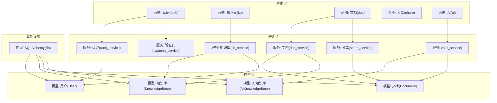
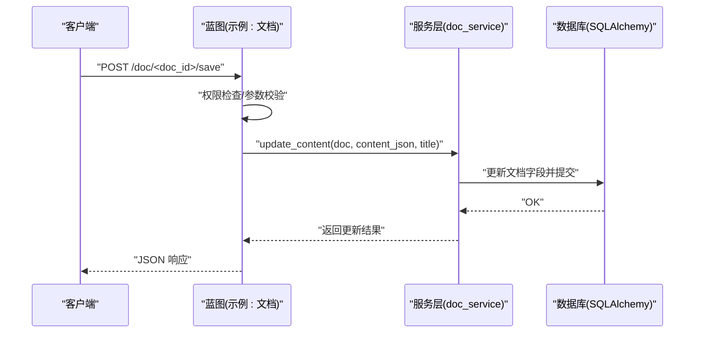
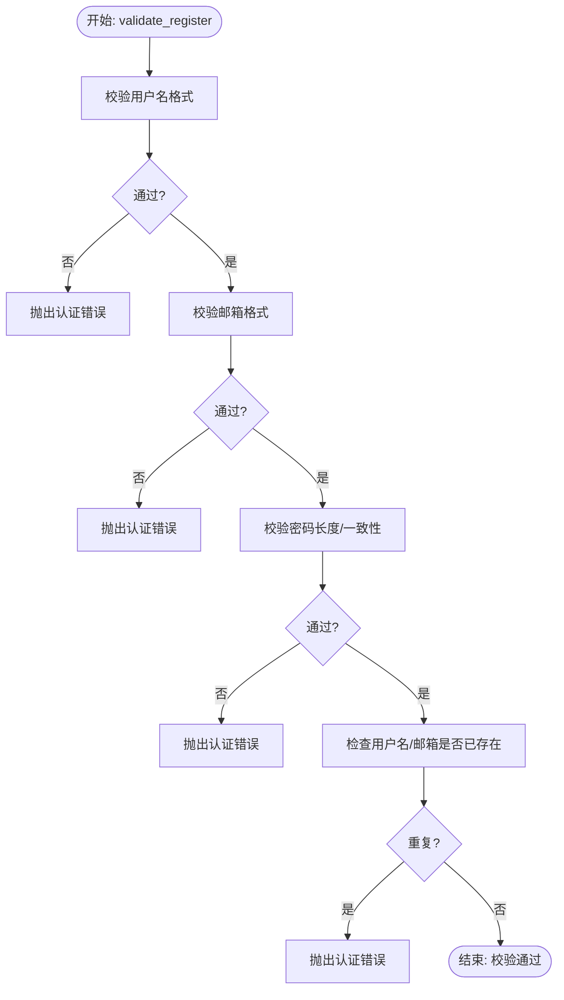
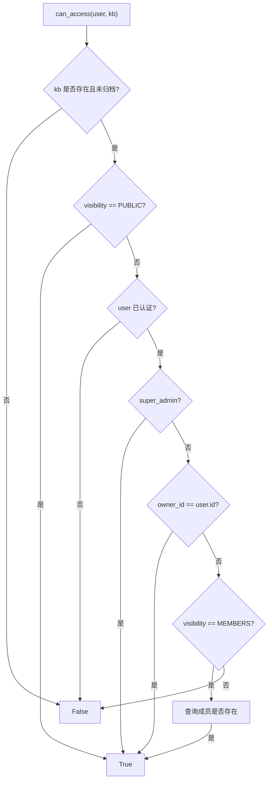
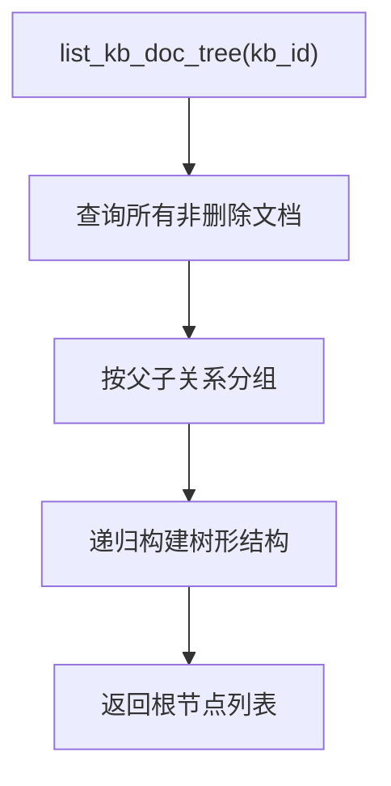
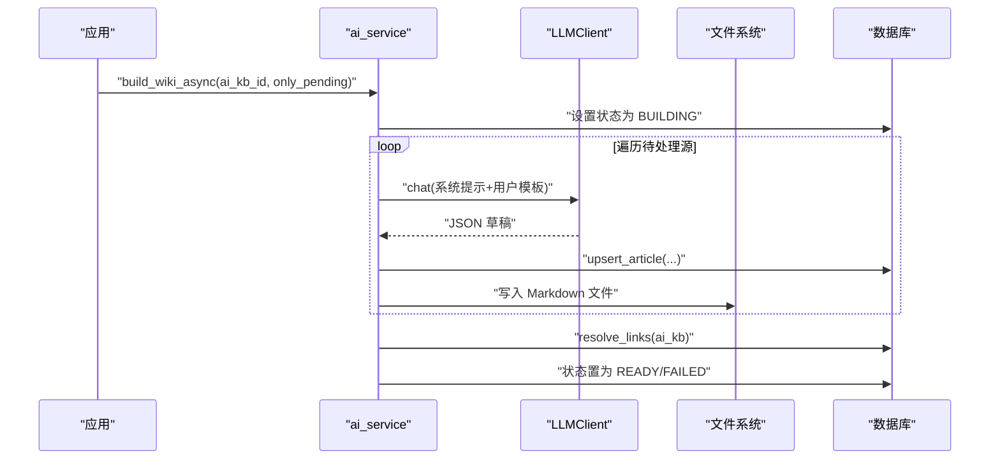
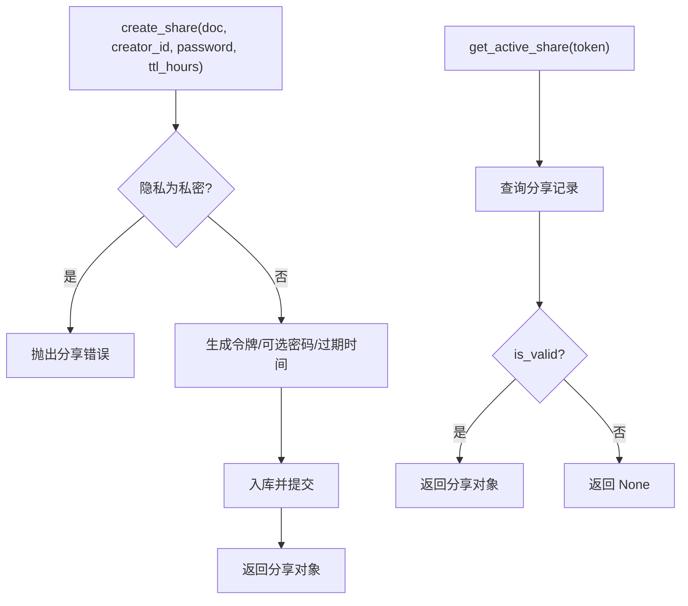
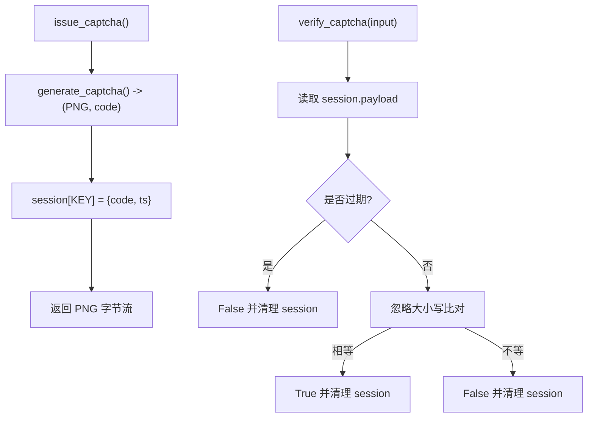
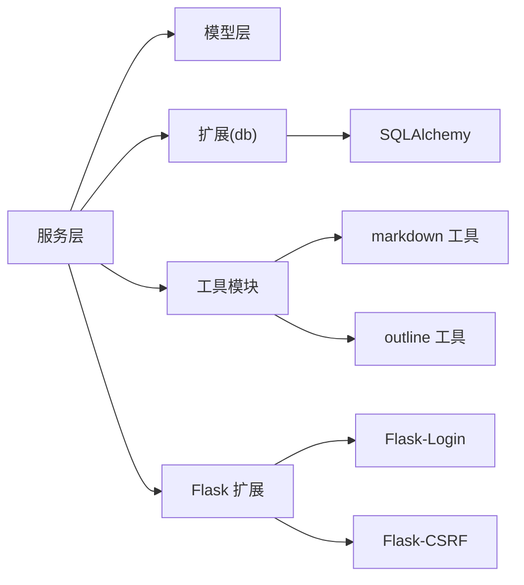

# 服务层架构

<cite>
**本文引用的文件**
- [app/services/__init__.py](file://app/services/__init__.py)
- [app/services/auth_service.py](file://app/services/auth_service.py)
- [app/services/kb_service.py](file://app/services/kb_service.py)
- [app/services/doc_service.py](file://app/services/doc_service.py)
- [app/services/ai_service.py](file://app/services/ai_service.py)
- [app/services/share_service.py](file://app/services/share_service.py)
- [app/services/captcha_service.py](file://app/services/captcha_service.py)
- [app/models/__init__.py](file://app/models/__init__.py)
- [app/models/user.py](file://app/models/user.py)
- [app/models/knowledge_base.py](file://app/models/knowledge_base.py)
- [app/models/document.py](file://app/models/document.py)
- [app/models/ai_kb.py](file://app/models/ai_kb.py)
- [app/extensions.py](file://app/extensions.py)
- [app/__init__.py](file://app/__init__.py)
- [app/blueprints/auth.py](file://app/blueprints/auth.py)
- [app/blueprints/doc.py](file://app/blueprints/doc.py)
- [app/blueprints/kb.py](file://app/blueprints/kb.py)
- [app/blueprints/share.py](file://app/blueprints/share.py)
- [app/blueprints/ai.py](file://app/blueprints/ai.py)
</cite>

## 目录
1. [简介](#简介)
2. [项目结构](#项目结构)
3. [核心组件](#核心组件)
4. [架构总览](#架构总览)
5. [详细组件分析](#详细组件分析)
6. [依赖分析](#依赖分析)
7. [性能考虑](#性能考虑)
8. [故障排查指南](#故障排查指南)
9. [结论](#结论)
10. [附录](#附录)

## 简介
本文件系统性阐述 My Wiki 的服务层架构设计与实现，重点覆盖以下方面：
- 服务层模式的设计理念与职责分离：auth_service 负责认证与授权辅助、kb_service 管理知识库权限与成员、doc_service 处理文档树与内容、ai_service 实现 AI 知识库构建与问答、share_service 提供分享与访问控制、captcha_service 处理图形验证码。
- 服务层如何封装业务逻辑、处理事务管理、实现数据验证与错误处理。
- 服务层与模型层的交互模式、依赖注入机制以及蓝图对服务层的调用策略。
- 建议的单元测试策略与最佳实践。

## 项目结构
服务层位于 app/services 目录，围绕业务域划分模块化服务，每个服务模块聚焦单一职责并通过 SQLAlchemy 会话进行数据库事务管理。蓝图通过依赖注入的方式从 app.extensions 引入 db 实例，并在视图函数中直接调用服务层方法完成业务流程。

图表来源
- [app/blueprints/auth.py:1-85](file://app/blueprints/auth.py#L1-L85)
- [app/blueprints/kb.py:1-141](file://app/blueprints/kb.py#L1-L141)
- [app/blueprints/doc.py:1-139](file://app/blueprints/doc.py#L1-L139)
- [app/blueprints/share.py:1-42](file://app/blueprints/share.py#L1-L42)
- [app/blueprints/ai.py:1-279](file://app/blueprints/ai.py#L1-L279)
- [app/services/auth_service.py:1-57](file://app/services/auth_service.py#L1-L57)
- [app/services/kb_service.py:1-80](file://app/services/kb_service.py#L1-L80)
- [app/services/doc_service.py:1-81](file://app/services/doc_service.py#L1-L81)
- [app/services/ai_service.py:1-408](file://app/services/ai_service.py#L1-L408)
- [app/services/share_service.py:1-49](file://app/services/share_service.py#L1-L49)
- [app/services/captcha_service.py:1-90](file://app/services/captcha_service.py#L1-L90)
- [app/models/user.py:1-104](file://app/models/user.py#L1-L104)
- [app/models/knowledge_base.py:1-62](file://app/models/knowledge_base.py#L1-L62)
- [app/models/document.py:1-98](file://app/models/document.py#L1-L98)
- [app/models/ai_kb.py:1-121](file://app/models/ai_kb.py#L1-L121)
- [app/extensions.py:1-17](file://app/extensions.py#L1-L17)

章节来源
- [app/services/__init__.py:1-2](file://app/services/__init__.py#L1-L2)
- [app/extensions.py:1-17](file://app/extensions.py#L1-L17)
- [app/__init__.py:1-101](file://app/__init__.py#L1-L101)

## 核心组件
- 认证服务(auth_service)：负责注册参数校验、用户创建、登录认证、登录信息更新与异常类型定义。
- 知识库服务(kb_service)：负责知识库可见性判断、成员角色判定、拥有与加入知识库列表查询、成员增删。
- 文档服务(doc_service)：负责知识库内文档树构建、文档创建、内容更新、软删除、后代收集。
- AI 服务(ai_service)：负责 LLM 客户端封装、文章草稿构建、文章写盘、链接解析与回链、异步构建与再生、可选 RAG 对话。
- 分享服务(share_service)：负责分享令牌生成、过期与撤销、有效分享查询、访问计数。
- 验证码服务(captcha_service)：负责图形验证码生成、会话存储与校验、有效期控制。

章节来源
- [app/services/auth_service.py:1-57](file://app/services/auth_service.py#L1-L57)
- [app/services/kb_service.py:1-80](file://app/services/kb_service.py#L1-L80)
- [app/services/doc_service.py:1-81](file://app/services/doc_service.py#L1-L81)
- [app/services/ai_service.py:1-408](file://app/services/ai_service.py#L1-L408)
- [app/services/share_service.py:1-49](file://app/services/share_service.py#L1-L49)
- [app/services/captcha_service.py:1-90](file://app/services/captcha_service.py#L1-L90)

## 架构总览
服务层采用“按业务域分层”的模式，每个服务模块独立封装领域规则与数据访问，避免控制器与模型层的耦合。蓝图作为入口协调权限检查、输入校验与调用服务层，服务层内部通过 db.session 进行事务提交，确保业务原子性。

图表来源
- [app/blueprints/doc.py:69-84](file://app/blueprints/doc.py#L69-L84)
- [app/services/doc_service.py:56-62](file://app/services/doc_service.py#L56-L62)

## 详细组件分析

### 认证服务(auth_service)
职责与实现要点
- 参数校验：用户名、邮箱、密码一致性与长度、重复注册检测。
- 注册流程：创建用户对象、设置密码哈希、入库并提交。
- 登录流程：根据用户名或邮箱查找用户，校验激活状态与密码，记录最近登录时间与 IP。
- 错误处理：定义专用异常类型，便于蓝图捕获并反馈。

图表来源
- [app/services/auth_service.py:21-33](file://app/services/auth_service.py#L21-L33)

章节来源
- [app/services/auth_service.py:1-57](file://app/services/auth_service.py#L1-L57)

### 知识库服务(kb_service)
职责与实现要点
- 可见性与权限：公共、成员可见、私有三种策略；超级管理员、拥有者、成员编辑/管理权限判定。
- 列表聚合：合并“我拥有”和“我加入”的知识库，去重排序。
- 成员管理：新增/更新成员角色、移除成员。

图表来源
- [app/services/kb_service.py:10-23](file://app/services/kb_service.py#L10-L23)

章节来源
- [app/services/kb_service.py:1-80](file://app/services/kb_service.py#L1-L80)

### 文档服务(doc_service)
职责与实现要点
- 文档树：按层级与排序生成嵌套结构，过滤已删除节点。
- 创建：填充默认值，设置作者，入库提交。
- 内容更新：支持标题与内容变更，同步生成纯文本摘要。
- 删除：递归标记后代为已删除。
- 复杂度：树构建为 O(n)，后代收集为 BFS，整体 O(n)。

图表来源
- [app/services/doc_service.py:11-34](file://app/services/doc_service.py#L11-L34)

章节来源
- [app/services/doc_service.py:1-81](file://app/services/doc_service.py#L1-L81)

### AI 服务(ai_service)
职责与实现要点
- LLM 客户端：封装 OpenAI 兼容 SDK，支持多厂商与本地代理。
- 文章构建：将文档内容转为统一模板的 JSON 草稿，提取标题、别名、标签、摘要、内容与相关条目。
- 文章写盘：生成带 Front Matter 的 Markdown 文件。
- 链接解析：扫描 [[...]]，构建别名索引，生成正向与反向链接。
- 异步构建：后台线程批量处理源文档，更新状态与错误信息。
- 对话：基于关键词匹配选择上下文进行问答。

图表来源
- [app/services/ai_service.py:313-344](file://app/services/ai_service.py#L313-L344)
- [app/services/ai_service.py:296-311](file://app/services/ai_service.py#L296-L311)
- [app/services/ai_service.py:251-278](file://app/services/ai_service.py#L251-L278)

章节来源
- [app/services/ai_service.py:1-408](file://app/services/ai_service.py#L1-L408)

### 分享服务(share_service)
职责与实现要点
- 分享创建：生成唯一令牌，可选密码与过期时间，禁止私密文档分享。
- 分享撤销：标记失效并提交。
- 有效分享：结合过期、撤销与密码校验综合判断有效性。
- 访问统计：每次有效访问增加浏览计数。

图表来源
- [app/services/share_service.py:15-31](file://app/services/share_service.py#L15-L31)
- [app/services/share_service.py:39-43](file://app/services/share_service.py#L39-L43)

章节来源
- [app/services/share_service.py:1-49](file://app/services/share_service.py#L1-L49)

### 验证码服务(captcha_service)
职责与实现要点
- 图形生成：随机字符、干扰点线、旋转字符、平滑滤镜，输出 PNG 字节流。
- 会话存储：将答案与时间戳存入 session，支持 TTL 校验。
- 一次性校验：校验后立即清除会话，防止重放。

图表来源
- [app/services/captcha_service.py:65-72](file://app/services/captcha_service.py#L65-L72)
- [app/services/captcha_service.py:75-89](file://app/services/captcha_service.py#L75-L89)

章节来源
- [app/services/captcha_service.py:1-90](file://app/services/captcha_service.py#L1-L90)

## 依赖分析
- 服务层与模型层：各服务模块通过导入对应模型执行查询、创建与更新，遵循“模型即规则”的原则，服务层只负责编排业务。
- 服务层与基础设施：db 实例由 app.extensions 提供，蓝图在应用工厂中初始化，服务层通过 db.session 执行事务。
- 服务层内部耦合：服务间尽量低耦合，必要时通过模型查询或工具函数复用，避免循环依赖。
- 外部依赖：ai_service 依赖 openai SDK 与 slugify；captcha_service 依赖 Pillow；蓝图依赖 Flask-Login、CSRFProtect 等。

图表来源
- [app/services/ai_service.py:26-40](file://app/services/ai_service.py#L26-L40)
- [app/services/captcha_service.py:10-11](file://app/services/captcha_service.py#L10-L11)
- [app/extensions.py:1-17](file://app/extensions.py#L1-L17)

章节来源
- [app/models/__init__.py:1-38](file://app/models/__init__.py#L1-L38)
- [app/extensions.py:1-17](file://app/extensions.py#L1-L17)
- [app/__init__.py:39-54](file://app/__init__.py#L39-L54)

## 性能考虑
- 事务粒度：服务层在关键路径上尽量减少提交次数，如批量处理源文档时逐条提交，避免长事务锁竞争。
- 查询优化：使用 in_、union、unique 约束与索引列，降低 N+1 查询风险。
- 异步化：AI 构建与再生采用后台线程，避免阻塞请求线程。
- I/O 控制：AI 文章写盘限制内容长度与文件数量，缓存别名索引，提升链接解析效率。
- 缓存策略：可引入 Redis 缓存热点分享令牌与验证码会话，降低数据库压力。

## 故障排查指南
- 认证失败
  - 现象：注册/登录时报错或跳转。
  - 排查：确认用户名/邮箱/密码格式与长度；检查重复注册；核对验证码是否过期。
  - 参考
    - [app/services/auth_service.py:21-33](file://app/services/auth_service.py#L21-L33)
    - [app/blueprints/auth.py:35-46](file://app/blueprints/auth.py#L35-L46)
- 权限不足
  - 现象：访问知识库/编辑文档返回 403。
  - 排查：确认用户是否登录、是否为超级管理员、是否为知识库拥有者或成员、成员角色是否具备编辑/管理权限。
  - 参考
    - [app/services/kb_service.py:10-45](file://app/services/kb_service.py#L10-L45)
    - [app/blueprints/doc.py:27-28](file://app/blueprints/doc.py#L27-L28)
- 文档删除异常
  - 现象：删除文档后子文档未同步删除。
  - 排查：确认后代收集逻辑与批量标记流程；检查数据库外键约束与级联行为。
  - 参考
    - [app/services/doc_service.py:70-80](file://app/services/doc_service.py#L70-L80)
- AI 构建失败
  - 现象：状态停留在 BUILDING 或出现错误信息。
  - 排查：检查 LLM 凭据与模型配置；查看源文档是否存在且未删除；关注后台线程异常日志。
  - 参考
    - [app/services/ai_service.py:313-344](file://app/services/ai_service.py#L313-L344)
    - [app/blueprints/ai.py:143-156](file://app/blueprints/ai.py#L143-L156)
- 分享无效
  - 现象：分享链接 410 或密码错误。
  - 排查：确认分享未撤销/未过期；密码是否正确；会话是否被清理。
  - 参考
    - [app/services/share_service.py:39-43](file://app/services/share_service.py#L39-L43)
    - [app/blueprints/share.py:22-41](file://app/blueprints/share.py#L22-L41)

章节来源
- [app/services/auth_service.py:17-33](file://app/services/auth_service.py#L17-L33)
- [app/services/kb_service.py:10-45](file://app/services/kb_service.py#L10-L45)
- [app/services/doc_service.py:70-80](file://app/services/doc_service.py#L70-L80)
- [app/services/ai_service.py:313-344](file://app/services/ai_service.py#L313-L344)
- [app/services/share_service.py:39-43](file://app/services/share_service.py#L39-L43)
- [app/blueprints/auth.py:35-46](file://app/blueprints/auth.py#L35-L46)
- [app/blueprints/doc.py:27-28](file://app/blueprints/doc.py#L27-L28)
- [app/blueprints/share.py:22-41](file://app/blueprints/share.py#L22-L41)
- [app/blueprints/ai.py:143-156](file://app/blueprints/ai.py#L143-L156)

## 结论
服务层通过清晰的职责划分与严格的事务管理，将业务规则与数据访问解耦，提升了系统的可维护性与可测试性。配合蓝图的入口控制与模型层的数据契约，形成稳定可靠的分层架构。建议在现有基础上进一步完善单元测试与集成测试，强化边界条件与并发场景的覆盖。

## 附录
- 依赖注入机制
  - 应用工厂在初始化阶段注册扩展并加载用户加载器，蓝图在运行时通过 db.session 获取模型实例，服务层通过 db.session 执行事务，形成“蓝图 -> 服务 -> 模型 -> 数据库”的单向依赖链。
  - 参考
    - [app/__init__.py:39-54](file://app/__init__.py#L39-L54)
    - [app/extensions.py:1-17](file://app/extensions.py#L1-L17)
- 单元测试策略建议
  - 使用 pytest + SQLAlchemy 测试数据库，模拟蓝图请求与服务调用。
  - 针对服务层方法编写参数边界、异常分支与事务提交/回滚测试。
  - 针对 AI 服务使用 mock LLM 返回值与临时目录进行文件写入测试。
  - 针对验证码服务使用固定种子与预设会话数据进行校验测试。
  - 参考
    - [app/services/ai_service.py:313-344](file://app/services/ai_service.py#L313-L344)
    - [app/services/captcha_service.py:75-89](file://app/services/captcha_service.py#L75-L89)