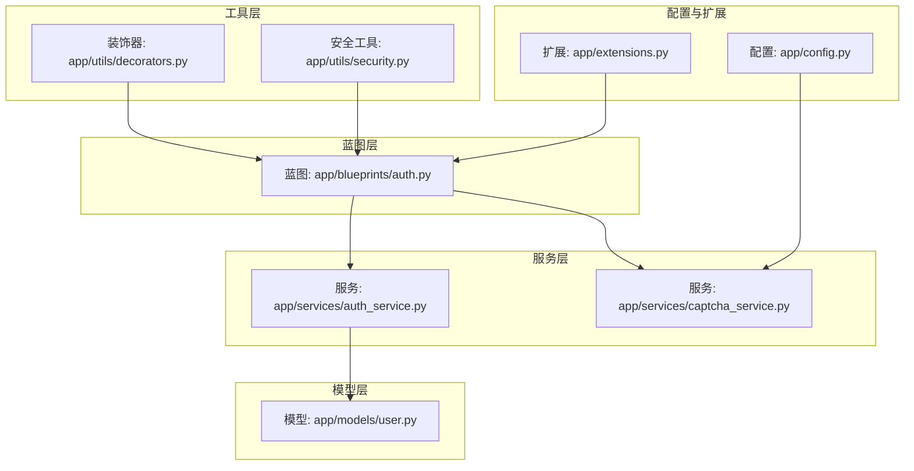
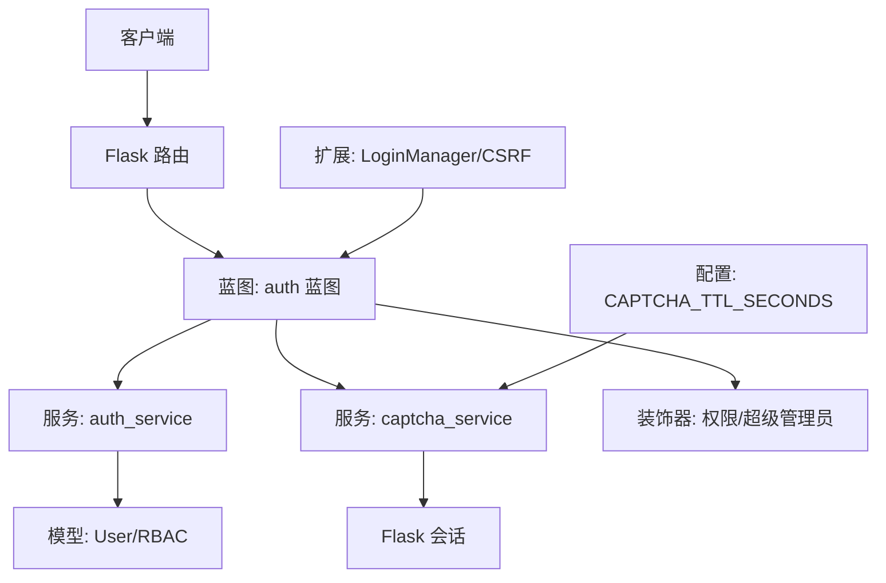
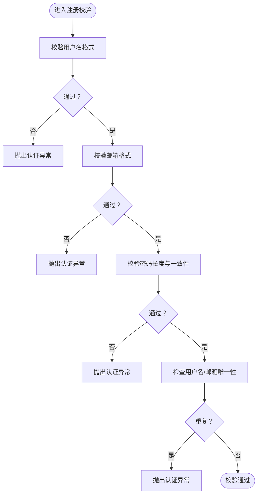
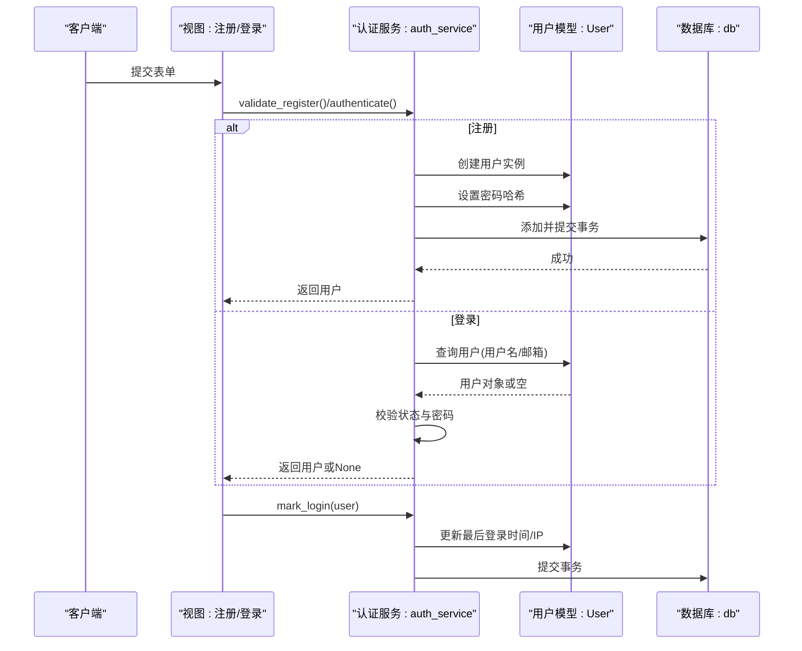
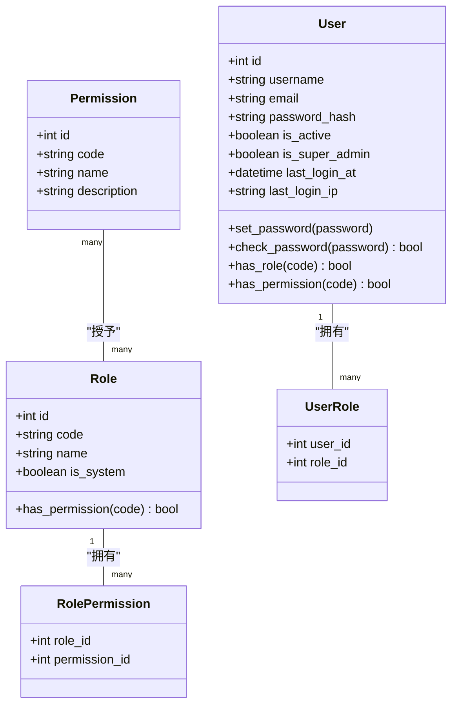
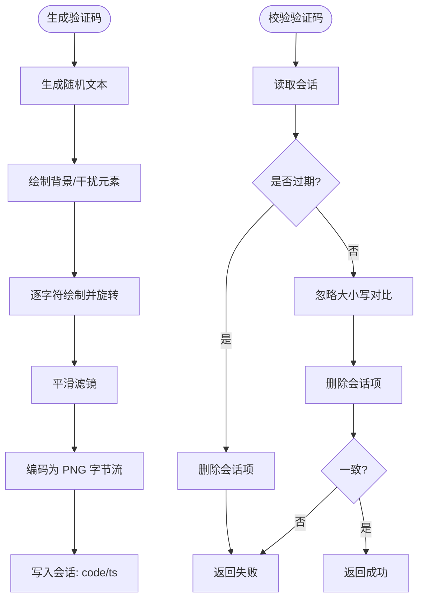
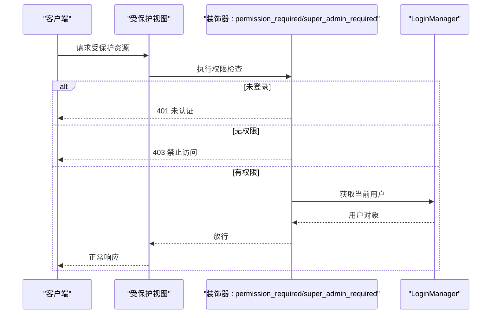
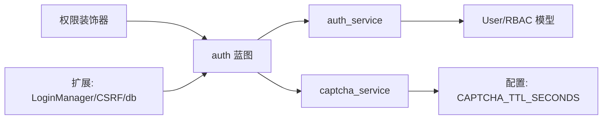

# 用户认证服务

<cite>
**本文引用的文件**
- [app/services/auth_service.py](file://app/services/auth_service.py)
- [app/models/user.py](file://app/models/user.py)
- [app/blueprints/auth.py](file://app/blueprints/auth.py)
- [app/services/captcha_service.py](file://app/services/captcha_service.py)
- [app/utils/security.py](file://app/utils/security.py)
- [app/utils/decorators.py](file://app/utils/decorators.py)
- [app/extensions.py](file://app/extensions.py)
- [app/config.py](file://app/config.py)
- [app/__init__.py](file://app/__init__.py)
- [run.py](file://run.py)
</cite>

## 目录
1. [简介](#简介)
2. [项目结构](#项目结构)
3. [核心组件](#核心组件)
4. [架构总览](#架构总览)
5. [详细组件分析](#详细组件分析)
6. [依赖分析](#依赖分析)
7. [性能考虑](#性能考虑)
8. [故障排查指南](#故障排查指南)
9. [结论](#结论)
10. [附录：使用示例与最佳实践](#附录使用示例与最佳实践)

## 简介
本文件面向“用户认证服务”的技术文档，围绕 auth_service 的用户注册、登录、密码校验、会话管理与权限验证等核心能力，系统梳理其数据模型、业务逻辑、安全机制（含验证码）、以及在蓝图中的集成方式。同时给出认证流程图、安全建议、错误处理策略与最佳实践，帮助开发者快速理解与正确使用认证服务。

## 项目结构
认证相关的核心文件分布于以下模块：
- 蓝图层：负责路由与视图控制（如注册、登录、登出、验证码接口）
- 服务层：封装认证业务（注册校验、注册、登录认证、登录标记）
- 模型层：用户、角色、权限的实体与关系
- 工具层：验证码生成与校验、通用安全工具、权限装饰器
- 配置与扩展：Cookie 安全策略、登录管理器、CSRF 保护、验证码 TTL

图表来源
- [app/blueprints/auth.py:1-85](file://app/blueprints/auth.py#L1-L85)
- [app/services/auth_service.py:1-57](file://app/services/auth_service.py#L1-L57)
- [app/services/captcha_service.py:1-90](file://app/services/captcha_service.py#L1-L90)
- [app/models/user.py:1-104](file://app/models/user.py#L1-L104)
- [app/utils/decorators.py:1-33](file://app/utils/decorators.py#L1-L33)
- [app/utils/security.py:1-8](file://app/utils/security.py#L1-L8)
- [app/extensions.py:1-17](file://app/extensions.py#L1-L17)
- [app/config.py:1-83](file://app/config.py#L1-L83)

章节来源
- [app/blueprints/auth.py:1-85](file://app/blueprints/auth.py#L1-L85)
- [app/services/auth_service.py:1-57](file://app/services/auth_service.py#L1-L57)
- [app/services/captcha_service.py:1-90](file://app/services/captcha_service.py#L1-L90)
- [app/models/user.py:1-104](file://app/models/user.py#L1-L104)
- [app/utils/decorators.py:1-33](file://app/utils/decorators.py#L1-L33)
- [app/utils/security.py:1-8](file://app/utils/security.py#L1-L8)
- [app/extensions.py:1-17](file://app/extensions.py#L1-L17)
- [app/config.py:1-83](file://app/config.py#L1-L83)

## 核心组件
- 认证服务（auth_service）：提供注册校验、注册、登录认证、登录信息记录等方法；定义认证异常类型。
- 用户模型（User）：继承 UserMixin，提供密码哈希设置与校验、角色与权限查询、超级管理员判定等。
- 蓝图（auth）：暴露注册、登录、登出、验证码接口，并在视图中调用服务层与验证码服务。
- 验证码服务（captcha_service）：生成图片验证码并存入会话，支持过期时间控制与一次性校验。
- 权限装饰器（decorators）：提供超级管理员与细粒度权限的访问控制。
- 安全工具（security）：生成 URL 安全的随机令牌，用于分享链接等场景。
- 扩展与配置（extensions/config）：登录管理器、CSRF 保护、Cookie 安全策略、验证码 TTL 等。

章节来源
- [app/services/auth_service.py:1-57](file://app/services/auth_service.py#L1-L57)
- [app/models/user.py:1-104](file://app/models/user.py#L1-L104)
- [app/blueprints/auth.py:1-85](file://app/blueprints/auth.py#L1-L85)
- [app/services/captcha_service.py:1-90](file://app/services/captcha_service.py#L1-L90)
- [app/utils/decorators.py:1-33](file://app/utils/decorators.py#L1-L33)
- [app/utils/security.py:1-8](file://app/utils/security.py#L1-L8)
- [app/extensions.py:1-17](file://app/extensions.py#L1-L17)
- [app/config.py:1-83](file://app/config.py#L1-L83)

## 架构总览
认证服务采用“蓝图-服务-模型-工具-配置”的分层设计，遵循最小职责原则：
- 蓝图负责请求接入与渲染，调用服务层执行业务。
- 服务层负责业务规则与数据一致性（注册校验、登录认证、登录记录）。
- 模型层提供用户、角色、权限的数据结构与关系。
- 工具层提供验证码与通用安全能力。
- 配置与扩展统一管理 Cookie 安全、登录视图、CSRF 保护与验证码 TTL。

图表来源
- [app/blueprints/auth.py:1-85](file://app/blueprints/auth.py#L1-L85)
- [app/services/auth_service.py:1-57](file://app/services/auth_service.py#L1-L57)
- [app/services/captcha_service.py:1-90](file://app/services/captcha_service.py#L1-L90)
- [app/models/user.py:1-104](file://app/models/user.py#L1-L104)
- [app/utils/decorators.py:1-33](file://app/utils/decorators.py#L1-L33)
- [app/config.py:1-83](file://app/config.py#L1-L83)
- [app/extensions.py:1-17](file://app/extensions.py#L1-L17)

## 详细组件分析

### 组件一：认证服务（auth_service）
职责与流程
- 注册校验：校验用户名、邮箱、密码长度与一致性，检查唯一性。
- 注册：创建用户对象、设置密码哈希、入库提交。
- 登录认证：按用户名或邮箱查询用户，校验账户状态与密码。
- 登录记录：更新最近登录时间与 IP。

图表来源
- [app/services/auth_service.py:21-34](file://app/services/auth_service.py#L21-L34)

图表来源
- [app/blueprints/auth.py:19-48](file://app/blueprints/auth.py#L19-L48)
- [app/blueprints/auth.py:51-76](file://app/blueprints/auth.py#L51-L76)
- [app/services/auth_service.py:21-57](file://app/services/auth_service.py#L21-L57)
- [app/models/user.py:81-85](file://app/models/user.py#L81-L85)

章节来源
- [app/services/auth_service.py:17-57](file://app/services/auth_service.py#L17-L57)
- [app/blueprints/auth.py:19-76](file://app/blueprints/auth.py#L19-L76)
- [app/models/user.py:55-104](file://app/models/user.py#L55-L104)

### 组件二：用户模型与RBAC
- 密码安全：通过哈希函数设置与校验密码。
- 角色与权限：多对多关联，支持角色拥有多个权限，用户拥有多个角色。
- 权限判定：超级管理员始终放行；否则逐角色检查权限集合。
- 用户状态：活跃状态参与登录校验。

图表来源
- [app/models/user.py:10-104](file://app/models/user.py#L10-L104)

章节来源
- [app/models/user.py:10-104](file://app/models/user.py#L10-L104)

### 组件三：验证码服务（captcha_service）
- 生成：随机字符、字体加载、背景点阵与干扰线、字符旋转粘贴、平滑滤镜、PNG 编码。
- 存储：将答案与时间戳写入会话，键名固定。
- 校验：去除输入空白、对比大小写不敏感、TTL 过期判断、一次性消费（校验后即删除）。

图表来源
- [app/services/captcha_service.py:32-72](file://app/services/captcha_service.py#L32-L72)
- [app/services/captcha_service.py:75-90](file://app/services/captcha_service.py#L75-L90)
- [app/config.py:49-50](file://app/config.py#L49-L50)

章节来源
- [app/services/captcha_service.py:1-90](file://app/services/captcha_service.py#L1-L90)
- [app/config.py:49-50](file://app/config.py#L49-L50)

### 组件四：权限装饰器与会话管理
- 权限装饰器：super_admin_required 与 permission_required(code)，内部基于当前用户状态与权限判定，未认证返回 401，无权限返回 403。
- 会话与登录：蓝图在注册/登录成功后调用 login_user，并通过 mark_login 更新登录信息；登录管理器配置了默认登录视图与消息。

图表来源
- [app/utils/decorators.py:8-33](file://app/utils/decorators.py#L8-L33)
- [app/extensions.py:14-16](file://app/extensions.py#L14-L16)
- [app/blueprints/auth.py:79-84](file://app/blueprints/auth.py#L79-L84)

章节来源
- [app/utils/decorators.py:1-33](file://app/utils/decorators.py#L1-L33)
- [app/extensions.py:14-16](file://app/extensions.py#L14-L16)
- [app/blueprints/auth.py:79-84](file://app/blueprints/auth.py#L79-L84)

### 组件五：安全工具与配置要点
- 安全令牌：生成 URL 安全的随机字符串，适合分享链接等场景。
- 配置要点：验证码 TTL、Cookie 安全策略（HttpOnly、SameSite）、记住我 Cookie 时长、CSRF 保护等。

章节来源
- [app/utils/security.py:5-8](file://app/utils/security.py#L5-L8)
- [app/config.py:28-31](file://app/config.py#L28-L31)
- [app/config.py:49-50](file://app/config.py#L49-L50)
- [app/extensions.py:10-11](file://app/extensions.py#L10-L11)

## 依赖分析
- 蓝图依赖服务层与验证码服务；服务层依赖模型层与数据库；装饰器依赖当前用户状态；验证码服务依赖会话与配置；扩展与配置贯穿全局。

图表来源
- [app/blueprints/auth.py:1-85](file://app/blueprints/auth.py#L1-L85)
- [app/services/auth_service.py:1-57](file://app/services/auth_service.py#L1-L57)
- [app/services/captcha_service.py:1-90](file://app/services/captcha_service.py#L1-L90)
- [app/models/user.py:1-104](file://app/models/user.py#L1-L104)
- [app/utils/decorators.py:1-33](file://app/utils/decorators.py#L1-L33)
- [app/config.py:1-83](file://app/config.py#L1-L83)
- [app/extensions.py:1-17](file://app/extensions.py#L1-L17)

章节来源
- [app/blueprints/auth.py:1-85](file://app/blueprints/auth.py#L1-L85)
- [app/services/auth_service.py:1-57](file://app/services/auth_service.py#L1-L57)
- [app/services/captcha_service.py:1-90](file://app/services/captcha_service.py#L1-L90)
- [app/models/user.py:1-104](file://app/models/user.py#L1-L104)
- [app/utils/decorators.py:1-33](file://app/utils/decorators.py#L1-L33)
- [app/config.py:1-83](file://app/config.py#L1-L83)
- [app/extensions.py:1-17](file://app/extensions.py#L1-L17)

## 性能考虑
- 数据库连接池：配置 pool_pre_ping 与 pool_recycle，有助于保持连接健康，减少断连导致的延迟。
- 密码哈希：使用框架提供的哈希函数，避免自定义弱算法；注意在高并发下的 CPU 开销。
- 验证码生成：图片生成涉及像素绘制与滤镜，建议限制并发或缓存静态字符集以降低开销。
- 登录记录：每次登录更新字段，建议在批量场景下合并更新或异步化（需评估一致性需求）。

章节来源
- [app/config.py:23-26](file://app/config.py#L23-L26)
- [app/models/user.py:81-85](file://app/models/user.py#L81-L85)
- [app/services/captcha_service.py:32-62](file://app/services/captcha_service.py#L32-L62)

## 故障排查指南
- 注册失败
  - 现象：提示用户名/邮箱格式或唯一性问题。
  - 排查：确认正则匹配、唯一约束、服务层异常抛出位置。
  - 参考路径：[app/services/auth_service.py:21-34](file://app/services/auth_service.py#L21-L34)
- 登录失败
  - 现象：提示用户名或密码错误。
  - 排查：确认验证码校验、用户状态、密码校验链路。
  - 参考路径：[app/blueprints/auth.py:62-69](file://app/blueprints/auth.py#L62-L69)、[app/services/auth_service.py:44-50](file://app/services/auth_service.py#L44-L50)
- 验证码无效
  - 现象：验证码错误或过期。
  - 排查：检查会话存储、TTL 配置、一次性消费逻辑。
  - 参考路径：[app/services/captcha_service.py:75-90](file://app/services/captcha_service.py#L75-L90)、[app/config.py:49-50](file://app/config.py#L49-L50)
- 权限拒绝
  - 现象：401 未认证或 403 禁止访问。
  - 排查：确认登录状态、超级管理员标识、角色-权限映射。
  - 参考路径：[app/utils/decorators.py:8-33](file://app/utils/decorators.py#L8-L33)、[app/models/user.py:90-96](file://app/models/user.py#L90-L96)
- 会话与 Cookie
  - 现象：跨域或 SameSite 导致登录态丢失。
  - 排查：核对 SESSION_COOKIE_SAMESITE、HTTPONLY、代理头 X-Forwarded-For。
  - 参考路径：[app/config.py:29-31](file://app/config.py#L29-L31)、[app/services/auth_service.py:53-56](file://app/services/auth_service.py#L53-L56)

章节来源
- [app/services/auth_service.py:21-56](file://app/services/auth_service.py#L21-L56)
- [app/blueprints/auth.py:62-69](file://app/blueprints/auth.py#L62-L69)
- [app/services/captcha_service.py:75-90](file://app/services/captcha_service.py#L75-L90)
- [app/utils/decorators.py:8-33](file://app/utils/decorators.py#L8-L33)
- [app/models/user.py:90-96](file://app/models/user.py#L90-L96)
- [app/config.py:29-31](file://app/config.py#L29-L31)

## 结论
本认证服务以清晰的分层设计实现了从注册到登录、从密码安全到权限控制的完整闭环。通过验证码增强防刷能力，结合会话与 Cookie 安全策略，满足基本生产环境的安全要求。建议在高并发场景下进一步优化数据库连接与验证码生成策略，并持续关注权限模型的演进与审计日志的补充。

## 附录：使用示例与最佳实践
- 使用认证服务进行用户身份验证与授权检查
  - 注册流程参考：[app/blueprints/auth.py:19-48](file://app/blueprints/auth.py#L19-L48)、[app/services/auth_service.py:21-41](file://app/services/auth_service.py#L21-L41)
  - 登录流程参考：[app/blueprints/auth.py:51-76](file://app/blueprints/auth.py#L51-L76)、[app/services/auth_service.py:44-57](file://app/services/auth_service.py#L44-L57)
  - 权限装饰器参考：[app/utils/decorators.py:8-33](file://app/utils/decorators.py#L8-L33)
- 安全最佳实践
  - 强制启用 HTTPS 与安全 Cookie 属性（HttpOnly、SameSite）。
  - 合理设置验证码 TTL 与请求频率限制。
  - 对密码字段仅存储哈希，避免明文或可逆加密。
  - 使用 CSRF 保护与严格的会话管理。
- 错误处理与可观测性
  - 在蓝图中捕获服务层异常并反馈用户友好提示。
  - 记录登录失败与权限拒绝事件，便于审计与风控。

章节来源
- [app/blueprints/auth.py:19-76](file://app/blueprints/auth.py#L19-L76)
- [app/services/auth_service.py:21-57](file://app/services/auth_service.py#L21-L57)
- [app/utils/decorators.py:8-33](file://app/utils/decorators.py#L8-L33)
- [app/config.py:28-31](file://app/config.py#L28-L31)
- [app/config.py:49-50](file://app/config.py#L49-L50)