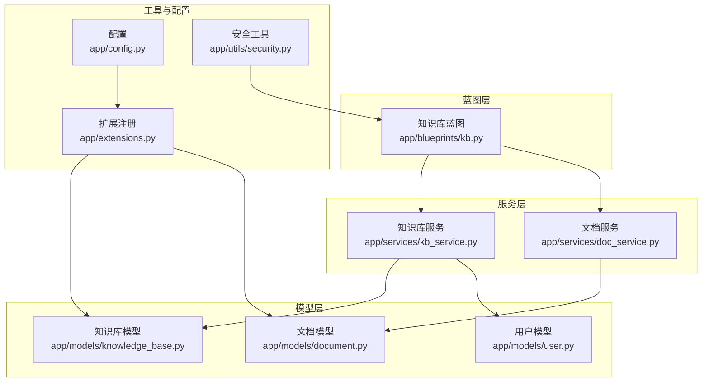
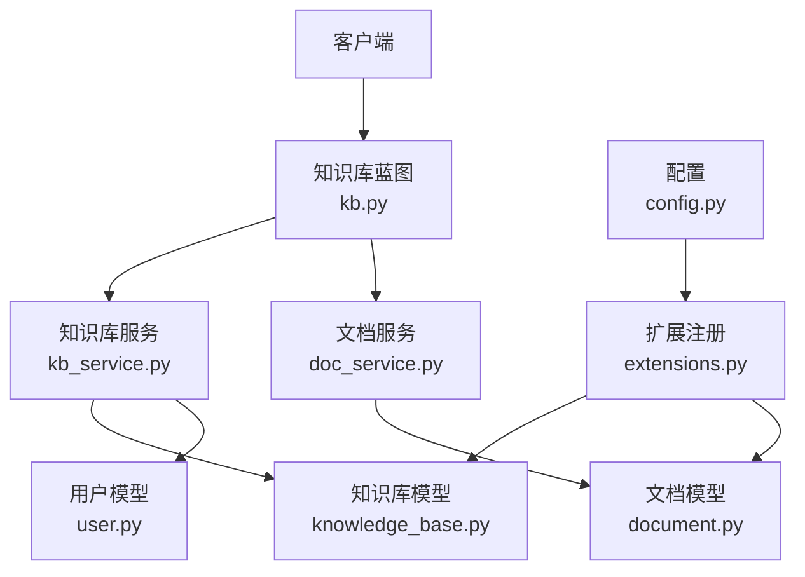
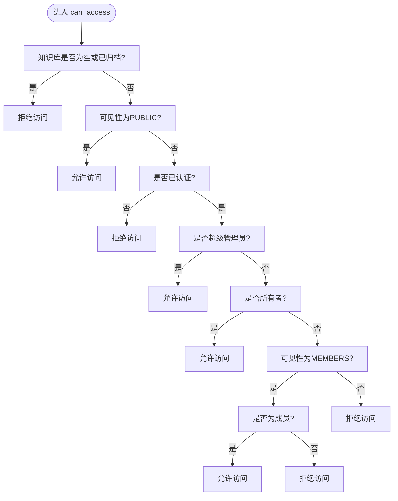
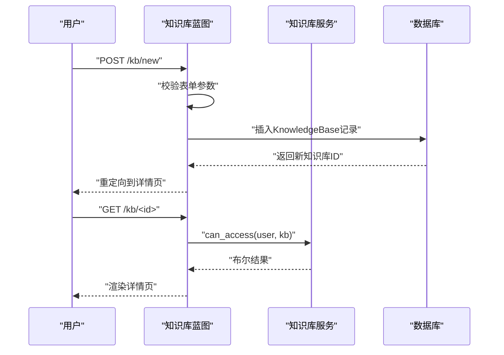
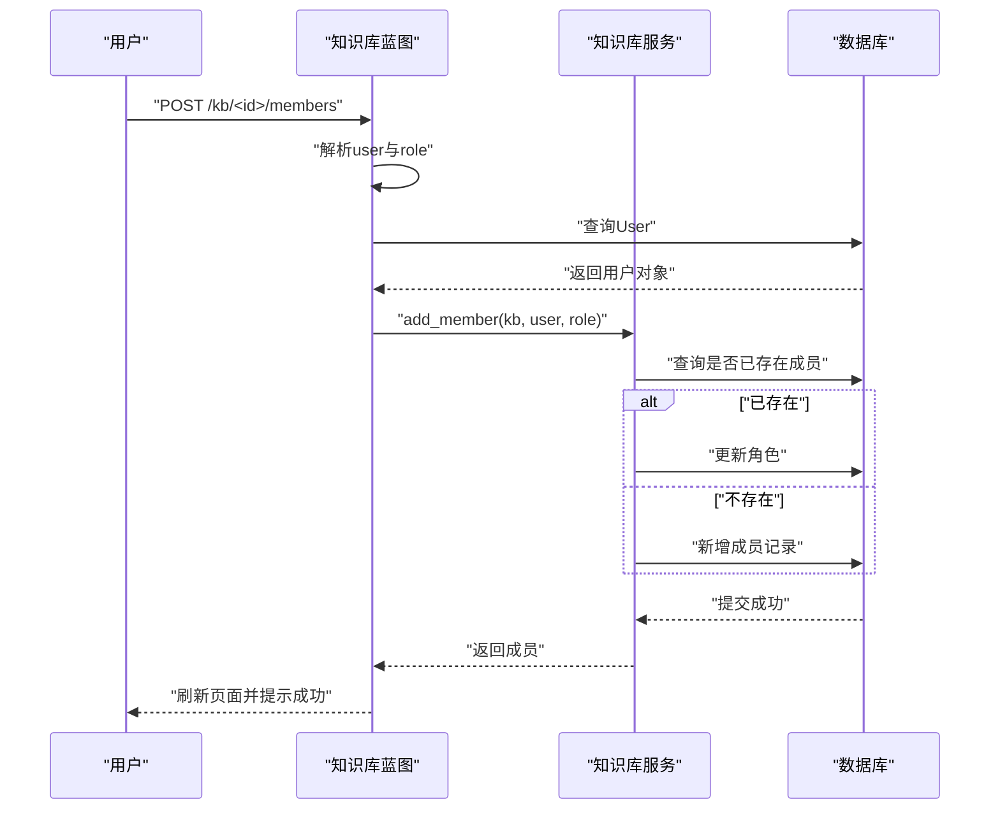
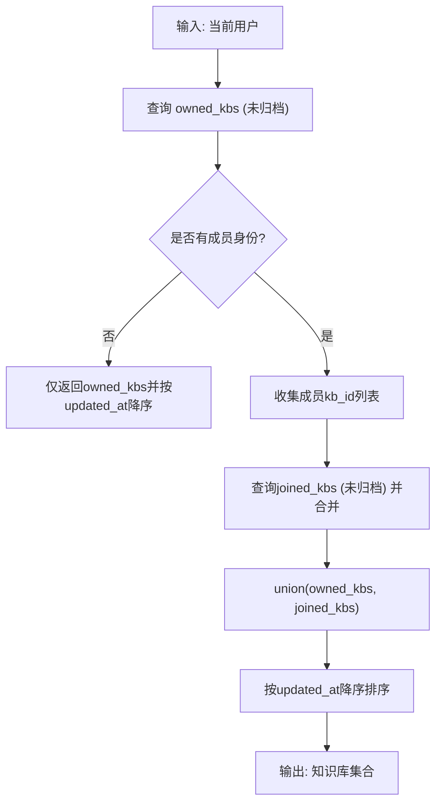
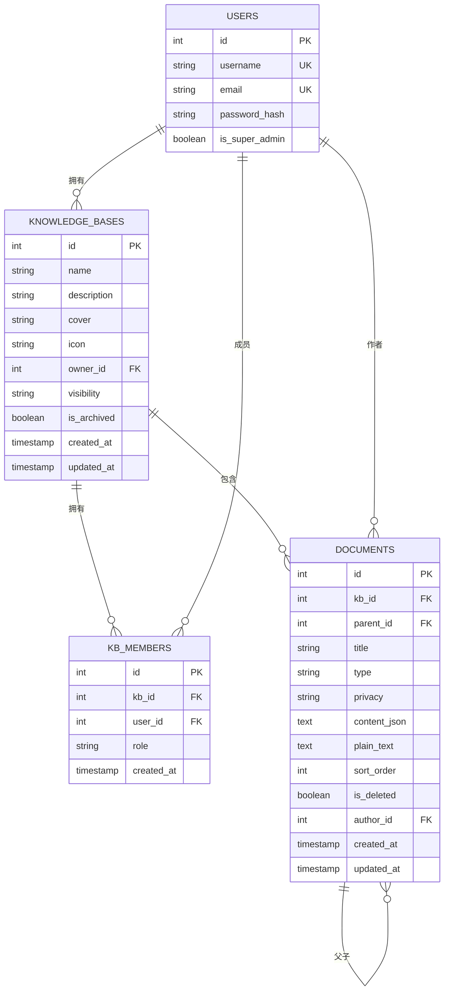
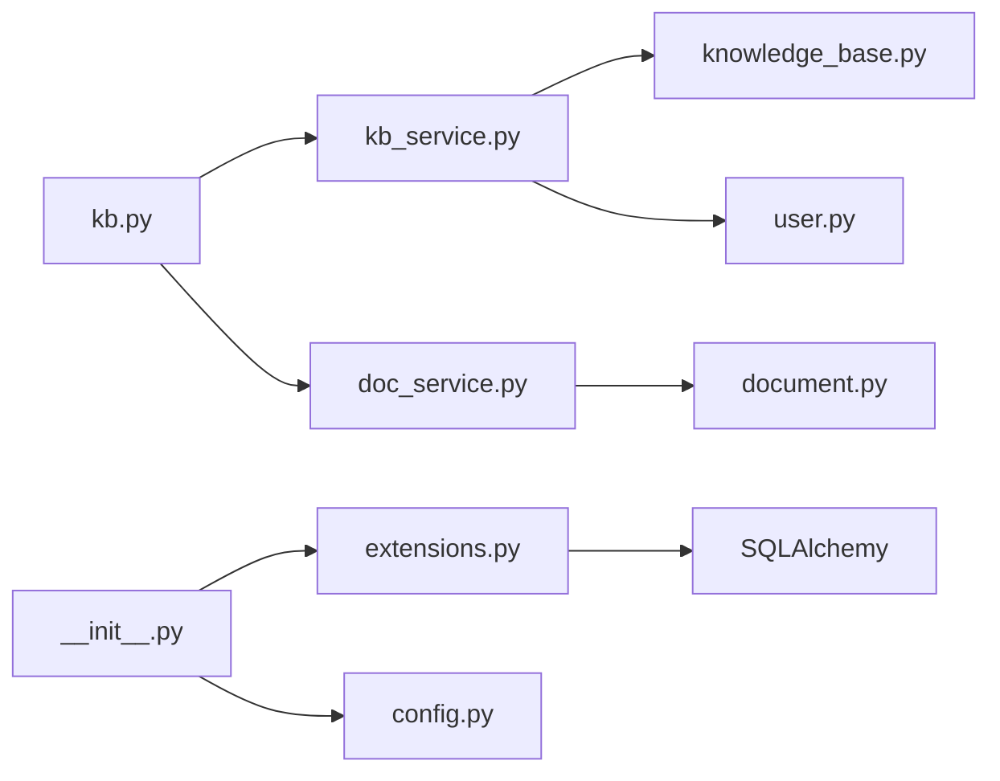

# 知识库管理服务

<cite>
**本文引用的文件**
- [app/services/kb_service.py](file://app/services/kb_service.py)
- [app/blueprints/kb.py](file://app/blueprints/kb.py)
- [app/models/knowledge_base.py](file://app/models/knowledge_base.py)
- [app/models/document.py](file://app/models/document.py)
- [app/services/doc_service.py](file://app/services/doc_service.py)
- [app/models/user.py](file://app/models/user.py)
- [app/utils/security.py](file://app/utils/security.py)
- [app/extensions.py](file://app/extensions.py)
- [app/__init__.py](file://app/__init__.py)
- [app/config.py](file://app/config.py)
</cite>

## 目录
1. [简介](#简介)
2. [项目结构](#项目结构)
3. [核心组件](#核心组件)
4. [架构总览](#架构总览)
5. [详细组件分析](#详细组件分析)
6. [依赖分析](#依赖分析)
7. [性能考虑](#性能考虑)
8. [故障排查指南](#故障排查指南)
9. [结论](#结论)
10. [附录](#附录)

## 简介
本技术文档围绕知识库管理服务（kb_service）展开，系统性阐述知识库的创建、编辑、删除、成员管理与权限控制等能力；详解可见性设置、成员角色分配、权限验证机制、知识库查询与过滤逻辑；并覆盖知识库生命周期管理、数据完整性保障、并发控制与事务处理策略。同时提供基于现有实现的CRUD与权限管理使用路径指引，帮助开发者快速上手与扩展。

## 项目结构
知识库相关功能主要分布在以下模块：
- 蓝图层：负责HTTP路由与请求处理，如知识库列表、详情、编辑、删除、成员管理等
- 服务层：封装业务规则与权限校验，如访问控制、编辑权限、管理权限、成员增删改等
- 模型层：定义知识库、成员、可见性枚举、文档等数据结构与关系
- 工具与配置：安全令牌生成、应用工厂与扩展注册、数据库连接与迁移等

图表来源
- [app/blueprints/kb.py:1-141](file://app/blueprints/kb.py#L1-L141)
- [app/services/kb_service.py:1-80](file://app/services/kb_service.py#L1-L80)
- [app/services/doc_service.py:1-81](file://app/services/doc_service.py#L1-L81)
- [app/models/knowledge_base.py:1-62](file://app/models/knowledge_base.py#L1-L62)
- [app/models/document.py:1-98](file://app/models/document.py#L1-L98)
- [app/models/user.py:1-104](file://app/models/user.py#L1-L104)
- [app/extensions.py:1-17](file://app/extensions.py#L1-L17)
- [app/config.py:1-83](file://app/config.py#L1-L83)
- [app/utils/security.py:1-8](file://app/utils/security.py#L1-L8)

章节来源
- [app/blueprints/kb.py:1-141](file://app/blueprints/kb.py#L1-L141)
- [app/services/kb_service.py:1-80](file://app/services/kb_service.py#L1-L80)
- [app/models/knowledge_base.py:1-62](file://app/models/knowledge_base.py#L1-L62)
- [app/models/document.py:1-98](file://app/models/document.py#L1-L98)
- [app/models/user.py:1-104](file://app/models/user.py#L1-L104)
- [app/extensions.py:1-17](file://app/extensions.py#L1-L17)
- [app/config.py:1-83](file://app/config.py#L1-L83)
- [app/utils/security.py:1-8](file://app/utils/security.py#L1-L8)

## 核心组件
- 知识库服务（kb_service）
  - 访问控制：can_access
  - 编辑权限：can_edit
  - 管理权限：can_manage
  - 列表聚合：list_my_kbs、list_public_kbs
  - 成员管理：add_member、remove_member
- 知识库模型（KnowledgeBase、KBMember、枚举KBVisibility、KBMemberRole）
- 文档服务（doc_service）与文档模型（Document），用于知识库内容树构建与内容管理
- 用户模型（User）与RBAC（角色、权限）体系，支持超级管理员与权限判定
- 安全工具（security）提供URL安全令牌生成
- 应用工厂与扩展（extensions、config）统一数据库、登录、CSRF等基础设施

章节来源
- [app/services/kb_service.py:10-80](file://app/services/kb_service.py#L10-L80)
- [app/models/knowledge_base.py:8-62](file://app/models/knowledge_base.py#L8-L62)
- [app/services/doc_service.py:11-81](file://app/services/doc_service.py#L11-L81)
- [app/models/document.py:20-98](file://app/models/document.py#L20-L98)
- [app/models/user.py:55-104](file://app/models/user.py#L55-L104)
- [app/utils/security.py:5-8](file://app/utils/security.py#L5-L8)
- [app/extensions.py:8-17](file://app/extensions.py#L8-L17)
- [app/config.py:15-83](file://app/config.py#L15-L83)

## 架构总览
知识库管理采用“蓝图-服务-模型”分层架构，蓝图负责HTTP请求与响应，服务层封装业务规则与权限校验，模型层定义数据结构与关系。应用通过工厂函数完成扩展初始化与蓝图注册，数据库通过SQLAlchemy进行ORM映射与事务提交。

图表来源
- [app/blueprints/kb.py:1-141](file://app/blueprints/kb.py#L1-L141)
- [app/services/kb_service.py:1-80](file://app/services/kb_service.py#L1-L80)
- [app/services/doc_service.py:1-81](file://app/services/doc_service.py#L1-L81)
- [app/models/knowledge_base.py:1-62](file://app/models/knowledge_base.py#L1-L62)
- [app/models/document.py:1-98](file://app/models/document.py#L1-L98)
- [app/models/user.py:1-104](file://app/models/user.py#L1-L104)
- [app/extensions.py:1-17](file://app/extensions.py#L1-L17)
- [app/config.py:1-83](file://app/config.py#L1-L83)

## 详细组件分析

### 权限与可见性控制
- 可见性枚举（KBVisibility）
  - private：仅所有者可见
  - members：所有者+成员可见
  - public：所有人可见
- 成员角色（KBMemberRole）
  - viewer：只读
  - editor：可编辑
- 访问控制（can_access）
  - 公共知识库直接放行
  - 非认证用户拒绝访问
  - 超级管理员放行
  - 所有者放行
  - members可见性需检查成员关系
- 编辑权限（can_edit）
  - 超级管理员或所有者放行
  - 成员需为EDITOR角色
- 管理权限（can_manage）
  - 超级管理员或所有者放行

图表来源
- [app/services/kb_service.py:10-23](file://app/services/kb_service.py#L10-L23)

章节来源
- [app/services/kb_service.py:10-46](file://app/services/kb_service.py#L10-L46)
- [app/models/knowledge_base.py:8-17](file://app/models/knowledge_base.py#L8-L17)

### 知识库生命周期与CRUD
- 创建知识库
  - 路由：POST /kb/new
  - 表单参数：name、description、visibility、icon
  - 规则：visibility必须在枚举范围内；非空名称必填；创建者为当前用户
  - 结果：创建成功后重定向到知识库详情页
- 查看知识库
  - 路由：GET /kb/<int:kb_id>
  - 规则：必须满足can_access；渲染知识库详情与文档树
- 编辑知识库
  - 路由：GET/POST /kb/<int:kb_id>/edit
  - 规则：必须满足can_manage；支持更新名称、描述、可见性、图标
- 删除知识库
  - 路由：POST /kb/<int:kb_id>/delete
  - 规则：必须满足can_manage；执行软归档（is_archived=True）

图表来源
- [app/blueprints/kb.py:32-54](file://app/blueprints/kb.py#L32-L54)
- [app/blueprints/kb.py:56-72](file://app/blueprints/kb.py#L56-L72)
- [app/services/kb_service.py:10-23](file://app/services/kb_service.py#L10-L23)

章节来源
- [app/blueprints/kb.py:32-104](file://app/blueprints/kb.py#L32-L104)
- [app/services/kb_service.py:10-23](file://app/services/kb_service.py#L10-L23)

### 成员管理与权限
- 添加成员
  - 路由：POST /kb/<int:kb_id>/members
  - 规则：必须满足can_manage；根据用户名或邮箱查找用户；禁止添加所有者；支持设置角色（默认viewer）
  - 实现：若已存在成员则更新角色，否则新增成员
- 移除成员
  - 路由：POST /kb/<int:kb_id>/members/<int:user_id>/delete
  - 规则：必须满足can_manage；删除对应成员记录

图表来源
- [app/blueprints/kb.py:106-129](file://app/blueprints/kb.py#L106-L129)
- [app/services/kb_service.py:65-74](file://app/services/kb_service.py#L65-L74)

章节来源
- [app/blueprints/kb.py:106-141](file://app/blueprints/kb.py#L106-L141)
- [app/services/kb_service.py:65-80](file://app/services/kb_service.py#L65-L80)

### 知识库查询与过滤
- 我的知识库（list_my_kbs）
  - 返回当前用户创建且未归档的知识库
  - 合并当前用户作为成员参与的未归档知识库
  - 统一按updated_at降序排序
- 公共知识库（list_public_kbs）
  - 返回visibility为PUBLIC且未归档的知识库
  - 按updated_at降序排序

图表来源
- [app/services/kb_service.py:48-54](file://app/services/kb_service.py#L48-L54)
- [app/services/kb_service.py:57-62](file://app/services/kb_service.py#L57-L62)

章节来源
- [app/services/kb_service.py:48-62](file://app/services/kb_service.py#L48-L62)

### 文档树与内容管理
- 文档树构建（list_kb_doc_tree）
  - 基于文档的父子关系与排序字段生成嵌套列表
  - 过滤条件：同一知识库、未删除
- 文档内容更新（update_content）
  - 更新标题、Editor.js JSON内容与纯文本摘要
  - 提交事务

章节来源
- [app/services/doc_service.py:11-35](file://app/services/doc_service.py#L11-L35)
- [app/services/doc_service.py:56-62](file://app/services/doc_service.py#L56-L62)
- [app/models/document.py:20-54](file://app/models/document.py#L20-L54)

### 数据模型与关系
- 知识库（KnowledgeBase）
  - 字段：id、name、description、cover、icon、owner_id、visibility、is_archived、时间戳
  - 关系：owner（User）、members（KBMember）
- 成员（KBMember）
  - 字段：kb_id、user_id、role、created_at
  - 唯一约束：kb_id+user_id
  - 关系：kb（KnowledgeBase）、user（User）
- 文档（Document）
  - 字段：kb_id、parent_id、title、type、privacy、content_json、plain_text、sort_order、is_deleted、author_id、时间戳
  - 关系：kb（KnowledgeBase）、author（User）、children（自关联）

图表来源
- [app/models/knowledge_base.py:19-61](file://app/models/knowledge_base.py#L19-L61)
- [app/models/document.py:20-98](file://app/models/document.py#L20-L98)
- [app/models/user.py:55-104](file://app/models/user.py#L55-L104)

章节来源
- [app/models/knowledge_base.py:19-61](file://app/models/knowledge_base.py#L19-L61)
- [app/models/document.py:20-98](file://app/models/document.py#L20-L98)
- [app/models/user.py:55-104](file://app/models/user.py#L55-L104)

### 并发控制与事务处理
- 事务提交
  - 服务层在关键写操作后调用db.session.commit()，确保原子性
- 并发冲突
  - 成员唯一性通过数据库唯一约束（kb_id,user_id）避免重复
  - 归档删除采用软删除（is_archived）降低硬删除带来的并发风险
- 锁与隔离
  - 代码层面未显式加锁；建议在高并发场景结合数据库事务隔离级别与索引优化

章节来源
- [app/services/kb_service.py:65-80](file://app/services/kb_service.py#L65-L80)
- [app/models/knowledge_base.py:47-49](file://app/models/knowledge_base.py#L47-L49)

### 安全与权限扩展点
- 超级管理员
  - 用户模型中is_super_admin字段决定最高权限
- RBAC权限
  - 用户具备角色集合，角色绑定权限；has_permission用于细粒度授权
- 分享与令牌
  - 安全工具提供URL安全令牌生成，可用于分享链接场景

章节来源
- [app/models/user.py:90-96](file://app/models/user.py#L90-L96)
- [app/utils/security.py:5-8](file://app/utils/security.py#L5-L8)

## 依赖分析
- 蓝图依赖服务：知识库蓝图在路由处理中调用kb_service与doc_service
- 服务依赖模型：kb_service依赖KnowledgeBase、KBMember、User模型；doc_service依赖Document模型
- 扩展与配置：应用工厂初始化SQLAlchemy、Migrate、LoginManager、CSRFProtect，并注册蓝图

图表来源
- [app/blueprints/kb.py:1-141](file://app/blueprints/kb.py#L1-L141)
- [app/services/kb_service.py:1-80](file://app/services/kb_service.py#L1-L80)
- [app/services/doc_service.py:1-81](file://app/services/doc_service.py#L1-L81)
- [app/models/knowledge_base.py:1-62](file://app/models/knowledge_base.py#L1-L62)
- [app/models/document.py:1-98](file://app/models/document.py#L1-L98)
- [app/models/user.py:1-104](file://app/models/user.py#L1-L104)
- [app/__init__.py:39-74](file://app/__init__.py#L39-L74)
- [app/extensions.py:8-17](file://app/extensions.py#L8-L17)
- [app/config.py:15-83](file://app/config.py#L15-L83)

章节来源
- [app/__init__.py:39-74](file://app/__init__.py#L39-L74)
- [app/extensions.py:8-17](file://app/extensions.py#L8-L17)
- [app/config.py:15-83](file://app/config.py#L15-L83)

## 性能考虑
- 查询优化
  - 知识库与成员查询均使用索引字段（owner_id、kb_id、user_id、visibility、is_archived）
  - 列表查询使用union合并，减少多次往返
- 内存与IO
  - 文档树构建采用一次查询+内存组装，避免深层递归查询
- 事务与锁
  - 写操作集中commit，减少长事务持有时间
- 建议
  - 在高并发场景增加数据库连接池与慢查询日志
  - 对频繁访问的列表接口增加缓存（如Redis）

## 故障排查指南
- 403拒绝访问
  - 检查用户是否认证、是否超级管理员、是否知识库所有者、是否成员且角色满足要求
- 404知识库不存在或已归档
  - 确认知识库ID正确且未被归档
- 成员添加失败
  - 检查唯一约束冲突、目标用户是否为所有者、角色是否在枚举范围内
- 删除异常
  - 确认调用方满足can_manage，确认is_archived更新成功

章节来源
- [app/blueprints/kb.py:14-18](file://app/blueprints/kb.py#L14-L18)
- [app/services/kb_service.py:10-46](file://app/services/kb_service.py#L10-L46)

## 结论
知识库管理服务以清晰的分层设计实现了可见性控制、成员管理与权限校验，配合完善的模型关系与事务提交策略，保障了知识库生命周期内的数据一致性与安全性。通过蓝图路由与服务规则的分离，既便于维护也利于扩展新的权限维度与可见性策略。

## 附录

### 使用示例（基于现有实现的调用路径）
- 创建知识库
  - 路由：POST /kb/new
  - 参数：name、description、visibility、icon
  - 结果：创建成功后跳转至详情页
  - 参考路径：[app/blueprints/kb.py:32-54](file://app/blueprints/kb.py#L32-L54)
- 查看知识库
  - 路由：GET /kb/<int:kb_id>
  - 权限：can_access
  - 参考路径：[app/blueprints/kb.py:56-72](file://app/blueprints/kb.py#L56-L72)，[app/services/kb_service.py:10-23](file://app/services/kb_service.py#L10-L23)
- 编辑知识库
  - 路由：GET/POST /kb/<int:kb_id>/edit
  - 权限：can_manage
  - 参考路径：[app/blueprints/kb.py:75-92](file://app/blueprints/kb.py#L75-L92)，[app/services/kb_service.py:39-45](file://app/services/kb_service.py#L39-L45)
- 删除知识库
  - 路由：POST /kb/<int:kb_id>/delete
  - 权限：can_manage
  - 参考路径：[app/blueprints/kb.py:94-104](file://app/blueprints/kb.py#L94-L104)，[app/services/kb_service.py:39-45](file://app/services/kb_service.py#L39-L45)
- 添加成员
  - 路由：POST /kb/<int:kb_id>/members
  - 权限：can_manage
  - 参考路径：[app/blueprints/kb.py:106-129](file://app/blueprints/kb.py#L106-L129)，[app/services/kb_service.py:65-74](file://app/services/kb_service.py#L65-L74)
- 移除成员
  - 路由：POST /kb/<int:kb_id>/members/<int:user_id>/delete
  - 权限：can_manage
  - 参考路径：[app/blueprints/kb.py:132-141](file://app/blueprints/kb.py#L132-L141)，[app/services/kb_service.py:77-80](file://app/services/kb_service.py#L77-L80)
- 列出我的知识库
  - 路由：GET /kb/?tab=mine
  - 参考路径：[app/blueprints/kb.py:21-29](file://app/blueprints/kb.py#L21-L29)，[app/services/kb_service.py:48-54](file://app/services/kb_service.py#L48-L54)
- 列出公共知识库
  - 路由：GET /kb/?tab=public
  - 参考路径：[app/blueprints/kb.py:21-29](file://app/blueprints/kb.py#L21-L29)，[app/services/kb_service.py:57-62](file://app/services/kb_service.py#L57-L62)