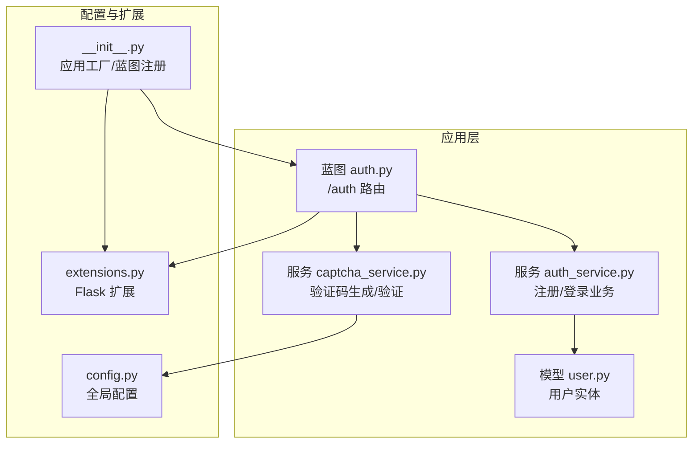
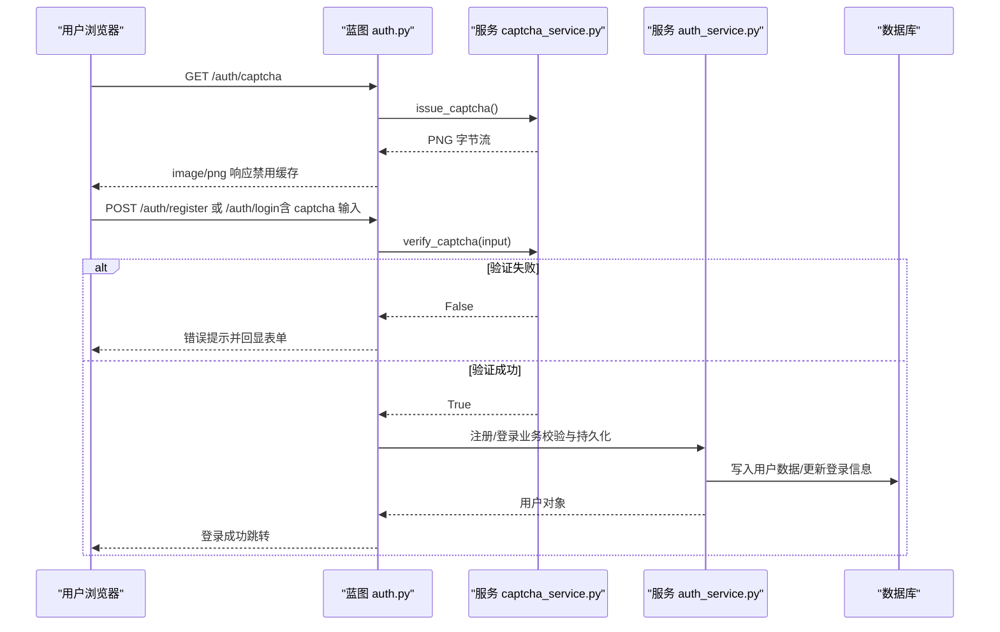
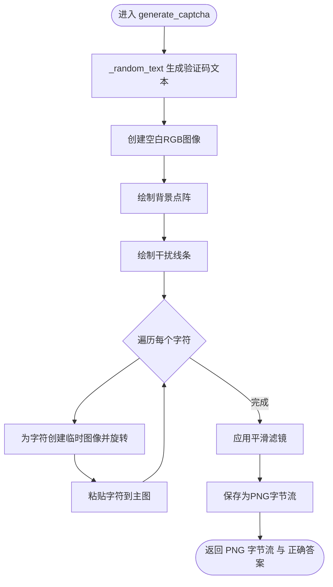
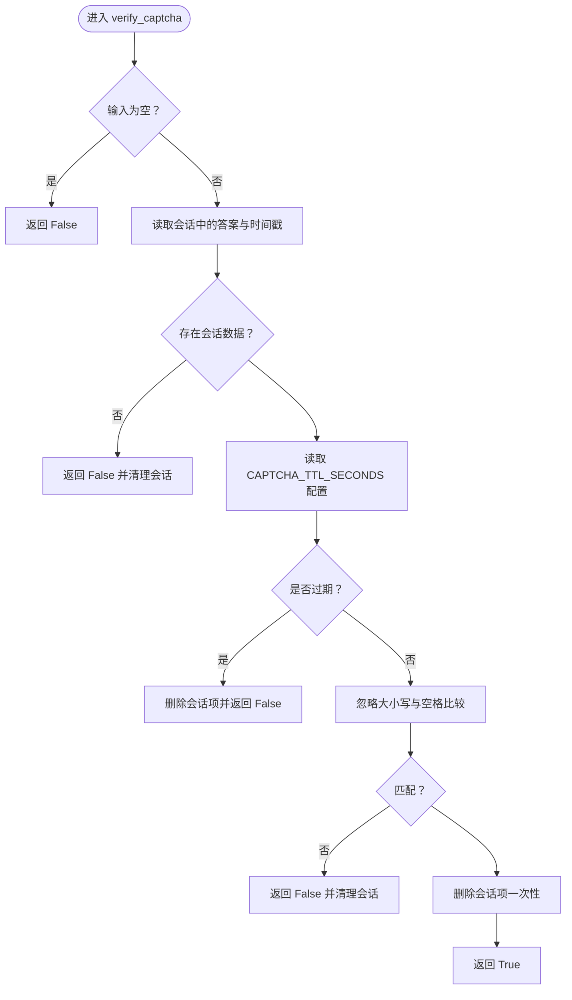
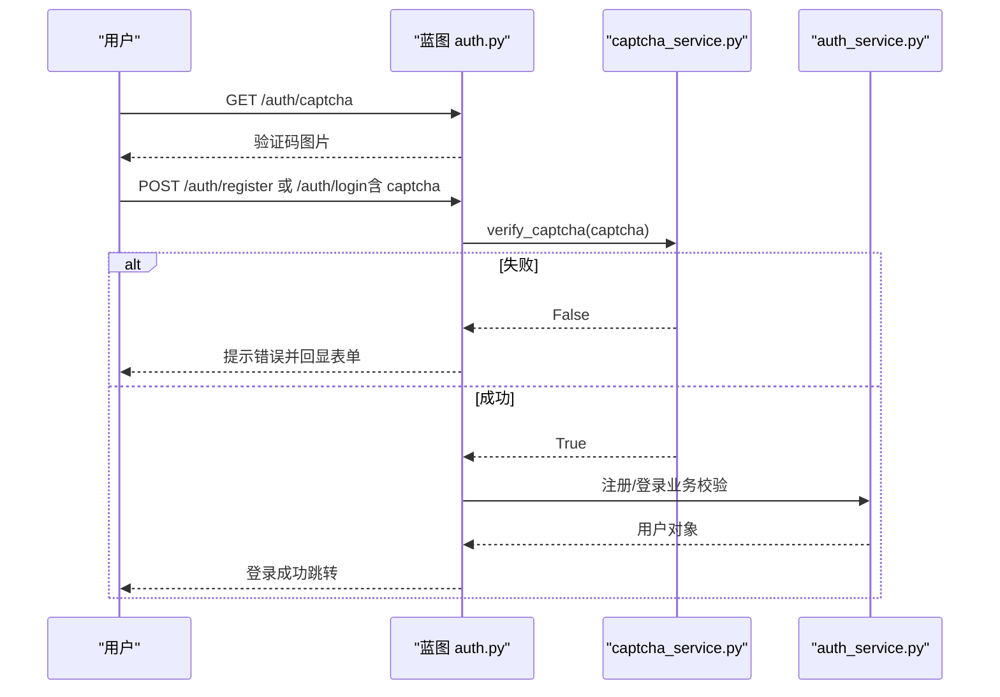
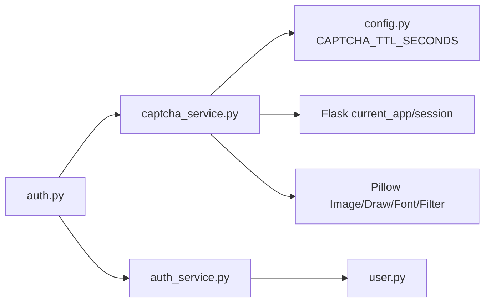

# 验证码服务

<cite>
**本文引用的文件列表**
- [captcha_service.py](file://app/services/captcha_service.py)
- [auth.py](file://app/blueprints/auth.py)
- [auth_service.py](file://app/services/auth_service.py)
- [config.py](file://app/config.py)
- [security.py](file://app/utils/security.py)
- [user.py](file://app/models/user.py)
- [__init__.py](file://app/__init__.py)
- [extensions.py](file://app/extensions.py)
</cite>

## 目录
1. [简介](#简介)
2. [项目结构](#项目结构)
3. [核心组件](#核心组件)
4. [架构总览](#架构总览)
5. [详细组件分析](#详细组件分析)
6. [依赖分析](#依赖分析)
7. [性能与可扩展性](#性能与可扩展性)
8. [故障排查指南](#故障排查指南)
9. [结论](#结论)
10. [附录：集成与最佳实践](#附录：集成与最佳实践)

## 简介
本文件围绕验证码服务（captcha_service）进行系统化技术文档梳理，重点覆盖以下方面：
- 图形验证码的生成与渲染流程（字符编码、字体加载、装饰元素、旋转与模糊处理）
- 验证码存储策略与会话交互（基于Flask Session的单次有效存储）
- 过期时间管理与一次性验证机制
- 安全性考量（字符集选择、防机器识别、缓存控制）
- 性能与可扩展性建议
- 与认证流程的集成方式与调用序列

## 项目结构
验证码服务位于应用的服务层，通过蓝图暴露HTTP接口，并与认证服务协同工作。关键文件与职责如下：
- app/services/captcha_service.py：验证码生成与验证逻辑
- app/blueprints/auth.py：对外暴露“获取验证码图片”和“注册/登录”的表单提交接口
- app/services/auth_service.py：注册/登录的业务校验与持久化
- app/config.py：全局配置，包含验证码有效期常量
- app/utils/security.py：通用安全工具（如URL安全令牌）
- app/models/user.py：用户模型与密码哈希
- app/__init__.py 与 app/extensions.py：应用工厂、蓝图注册与扩展初始化

图表来源
- [auth.py:10-16](file://app/blueprints/auth.py#L10-L16)
- [captcha_service.py:32-90](file://app/services/captcha_service.py#L32-L90)
- [auth_service.py:21-57](file://app/services/auth_service.py#L21-L57)
- [config.py:49-51](file://app/config.py#L49-L51)
- [__init__.py:56-74](file://app/__init__.py#L56-L74)
- [extensions.py:8-17](file://app/extensions.py#L8-L17)

章节来源
- [auth.py:1-85](file://app/blueprints/auth.py#L1-L85)
- [captcha_service.py:1-90](file://app/services/captcha_service.py#L1-L90)
- [auth_service.py:1-57](file://app/services/auth_service.py#L1-L57)
- [config.py:1-83](file://app/config.py#L1-L83)
- [__init__.py:11-28](file://app/__init__.py#L11-L28)
- [extensions.py:1-17](file://app/extensions.py#L1-L17)

## 核心组件
- 验证码生成器（generate_captcha）：随机生成文本、绘制背景点阵与线条、逐字符渲染并轻微旋转、应用平滑滤镜、输出PNG字节流
- 颁发器（issue_captcha）：生成验证码图片并将其答案写入当前会话，带时间戳
- 验证器（verify_captcha）：从会话读取答案与时间戳，校验输入是否匹配且未过期；验证后立即移除会话项，确保一次性使用
- 蓝图路由（/auth/captcha）：返回验证码图片，设置禁止缓存响应头
- 认证流程（注册/登录）：在提交表单时先调用验证码验证，失败则提示并回显表单

章节来源
- [captcha_service.py:32-90](file://app/services/captcha_service.py#L32-L90)
- [auth.py:10-16](file://app/blueprints/auth.py#L10-L16)
- [auth.py:19-48](file://app/blueprints/auth.py#L19-L48)
- [auth.py:51-76](file://app/blueprints/auth.py#L51-L76)

## 架构总览
验证码服务采用“服务层+蓝图接口”的分层设计，与认证服务解耦，便于复用与扩展。

图表来源
- [auth.py:10-16](file://app/blueprints/auth.py#L10-L16)
- [auth.py:19-48](file://app/blueprints/auth.py#L19-L48)
- [auth.py:51-76](file://app/blueprints/auth.py#L51-L76)
- [captcha_service.py:65-90](file://app/services/captcha_service.py#L65-L90)
- [auth_service.py:21-57](file://app/services/auth_service.py#L21-L57)

## 详细组件分析

### 组件一：验证码生成器（generate_captcha）
- 文本生成：使用预定义字符集（剔除易混淆字符O、I，仅保留大写字母与数字2-9），按指定长度随机拼接
- 字体加载：优先尝试常见系统字体，若不可用则回退至默认字体
- 背景装饰：绘制大量背景点阵与随机线条，提升抗OCR能力
- 字符渲染：逐字符绘制，设置随机颜色与轻微旋转角度，增加识别难度
- 滤镜处理：应用平滑滤镜，使图像更柔和
- 输出：将图像保存为PNG字节流，供HTTP响应直接返回

图表来源
- [captcha_service.py:18-62](file://app/services/captcha_service.py#L18-L62)

章节来源
- [captcha_service.py:14-62](file://app/services/captcha_service.py#L14-L62)

### 组件二：颁发器（issue_captcha）
- 生成图片与答案
- 将答案（小写）与当前时间戳写入Flask会话，键名固定
- 返回PNG字节流给HTTP响应

章节来源
- [captcha_service.py:65-72](file://app/services/captcha_service.py#L65-L72)

### 组件三：验证器（verify_captcha）
- 输入为空直接失败
- 从会话读取答案与时间戳
- 读取配置中的验证码有效期（秒），判断是否过期；过期则清理会话并返回失败
- 忽略大小写与前后空格，比较输入与期望值
- 成功后立即删除会话项，确保一次性使用

图表来源
- [captcha_service.py:75-90](file://app/services/captcha_service.py#L75-L90)
- [config.py:49-51](file://app/config.py#L49-L51)

章节来源
- [captcha_service.py:75-90](file://app/services/captcha_service.py#L75-L90)
- [config.py:49-51](file://app/config.py#L49-L51)

### 组件四：蓝图接口与认证流程集成
- /auth/captcha：返回验证码图片，设置禁止缓存响应头
- /auth/register 与 /auth/login：在POST提交时调用验证码验证，失败则提示并回显表单；成功则继续业务校验与持久化

图表来源
- [auth.py:10-16](file://app/blueprints/auth.py#L10-L16)
- [auth.py:19-48](file://app/blueprints/auth.py#L19-L48)
- [auth.py:51-76](file://app/blueprints/auth.py#L51-L76)
- [captcha_service.py:75-90](file://app/services/captcha_service.py#L75-L90)
- [auth_service.py:21-57](file://app/services/auth_service.py#L21-L57)

章节来源
- [auth.py:10-16](file://app/blueprints/auth.py#L10-L16)
- [auth.py:19-48](file://app/blueprints/auth.py#L19-L48)
- [auth.py:51-76](file://app/blueprints/auth.py#L51-L76)

## 依赖分析
- captcha_service 依赖
  - Flask current_app 读取配置（验证码有效期）
  - Flask session 存储验证码答案与时间戳
  - Pillow（PIL）进行图像生成与渲染
- auth 蓝图依赖
  - captcha_service 进行验证码校验
  - auth_service 进行注册/登录业务校验
- 配置依赖
  - config.py 中的 CAPTCHA_TTL_SECONDS 控制验证码有效期
- 数据模型依赖
  - user.py 的用户实体用于登录成功后的状态记录

图表来源
- [captcha_service.py:10-11](file://app/services/captcha_service.py#L10-L11)
- [captcha_service.py:81-84](file://app/services/captcha_service.py#L81-L84)
- [config.py:49-51](file://app/config.py#L49-L51)
- [auth.py:5-6](file://app/blueprints/auth.py#L5-L6)
- [auth_service.py:9-10](file://app/services/auth_service.py#L9-L10)
- [user.py:55-104](file://app/models/user.py#L55-L104)

章节来源
- [captcha_service.py:10-11](file://app/services/captcha_service.py#L10-L11)
- [captcha_service.py:81-84](file://app/services/captcha_service.py#L81-L84)
- [config.py:49-51](file://app/config.py#L49-L51)
- [auth.py:5-6](file://app/blueprints/auth.py#L5-L6)
- [auth_service.py:9-10](file://app/services/auth_service.py#L9-L10)
- [user.py:55-104](file://app/models/user.py#L55-L104)

## 性能与可扩展性
- 性能特性
  - 图像生成在内存中完成，PNG压缩输出，适合短生命周期的验证码图片传输
  - 使用会话存储答案与时间戳，避免额外数据库开销
- 可扩展方向
  - 引入验证码池与缓存（如Redis）以支持分布式部署与高并发
  - 支持多语言字符集与自定义字体
  - 增加重试限制与IP/会话限速策略
  - 提供多种验证码类型（滑动拼图、点选、数学题等）
- 与现有实现的兼容性
  - 当前实现基于Flask会话，扩展时可抽象出存储接口，保持captcha_service不变

[本节为通用性能讨论，无需特定文件引用]

## 故障排查指南
- 验证码图片无法显示
  - 检查蓝图路由 /auth/captcha 是否正确返回 image/png，且设置了禁止缓存头
  - 确认会话可用且未被中间件清理
- 验证码总是失败
  - 检查 CAPTCHA_TTL_SECONDS 配置是否过短
  - 确认会话中存在验证码答案与时间戳
  - 排查输入是否包含多余空格或大小写差异（验证器已忽略大小写与空格）
- 验证码过期但未清理
  - verify_captcha 在过期时会删除会话项，确认配置生效且时间同步正常
- 集成问题
  - 确保在注册/登录表单提交时先调用验证码验证再进行业务校验

章节来源
- [auth.py:10-16](file://app/blueprints/auth.py#L10-L16)
- [captcha_service.py:75-90](file://app/services/captcha_service.py#L75-L90)
- [config.py:49-51](file://app/config.py#L49-L51)

## 结论
验证码服务通过简洁的生成与验证流程，结合会话存储与一次性使用策略，在保证安全性的同时实现了良好的用户体验。其模块化设计便于后续扩展（如引入分布式缓存、多类型验证码与限速策略），并与认证流程无缝集成。

[本节为总结性内容，无需特定文件引用]

## 附录：集成与最佳实践

### 集成步骤（注册/登录）
- 获取验证码图片
  - 请求路径：/auth/captcha
  - 响应类型：image/png
  - 响应头：禁止缓存
- 表单提交
  - 在注册/登录表单中包含隐藏字段 captcha
  - 后端先调用验证码验证，失败则提示并回显表单
  - 成功后执行业务校验与持久化

章节来源
- [auth.py:10-16](file://app/blueprints/auth.py#L10-L16)
- [auth.py:19-48](file://app/blueprints/auth.py#L19-L48)
- [auth.py:51-76](file://app/blueprints/auth.py#L51-L76)

### 安全性建议
- 字符集与渲染
  - 已剔除易混淆字符，适当增加干扰元素与轻微旋转，降低OCR成功率
- 会话与有效期
  - 使用会话存储答案与时间戳，验证后立即删除，防止重放
  - 合理设置 CAPTCHA_TTL_SECONDS，平衡体验与安全
- 缓存控制
  - 对验证码图片设置禁止缓存头，避免浏览器缓存导致重复使用
- 重试限制
  - 建议在会话或IP层面增加重试次数限制，防止暴力破解
- 分布式部署
  - 若使用多实例，建议将会话存储迁移到Redis等外部缓存，确保一致性

章节来源
- [captcha_service.py:14-19](file://app/services/captcha_service.py#L14-L19)
- [captcha_service.py:38-58](file://app/services/captcha_service.py#L38-L58)
- [captcha_service.py:65-90](file://app/services/captcha_service.py#L65-L90)
- [auth.py:10-16](file://app/blueprints/auth.py#L10-L16)
- [config.py:49-51](file://app/config.py#L49-L51)

### 性能优化建议
- 图像尺寸与质量
  - 根据前端展示需求调整验证码宽高与字体大小，减少PNG体积
- 渲染复杂度
  - 控制背景点阵与干扰线条数量，避免过度渲染影响CPU
- 会话存储
  - 在高并发场景下，建议将会话后端替换为Redis，提升扩展性
- 缓存策略
  - 对于频繁刷新的验证码，可在网关层做轻量缓存，但需确保每次请求都生成新答案

[本节为通用优化建议，无需特定文件引用]