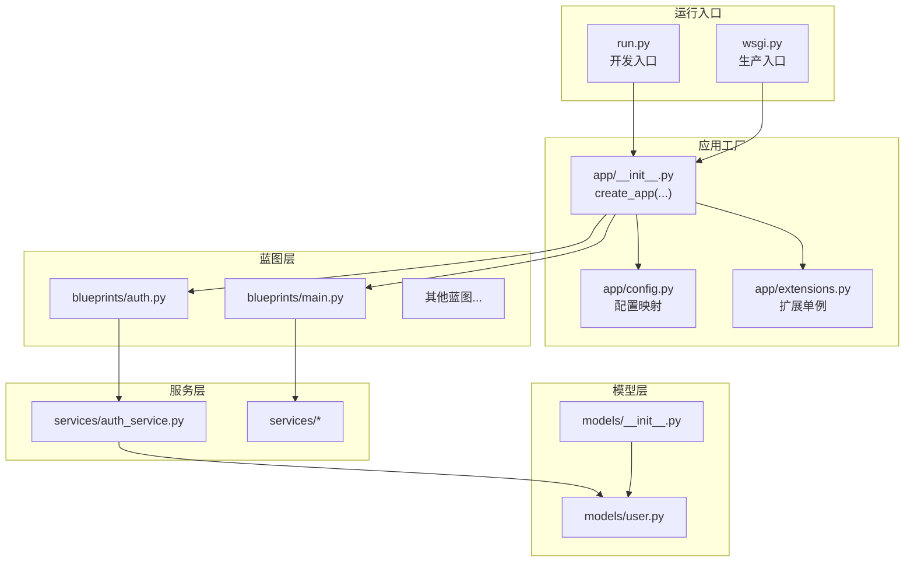
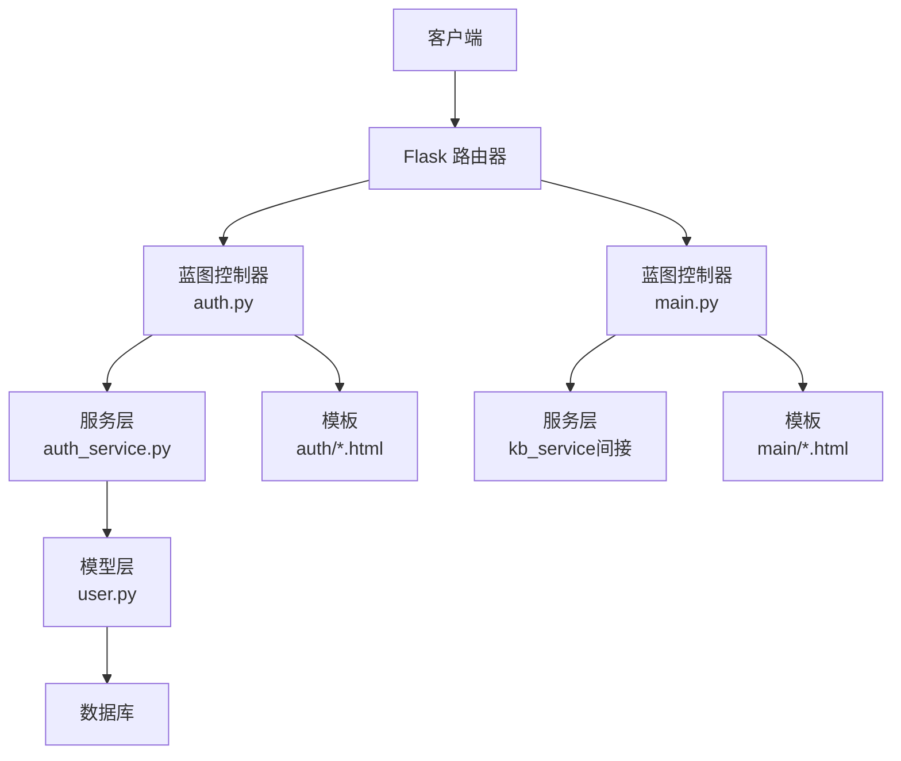
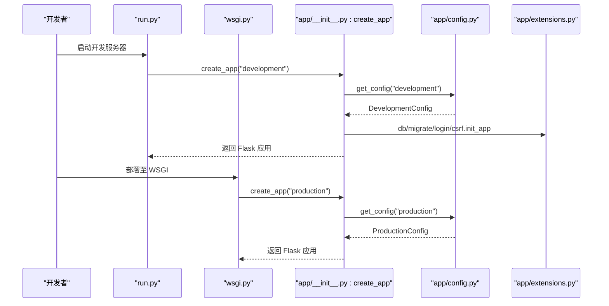
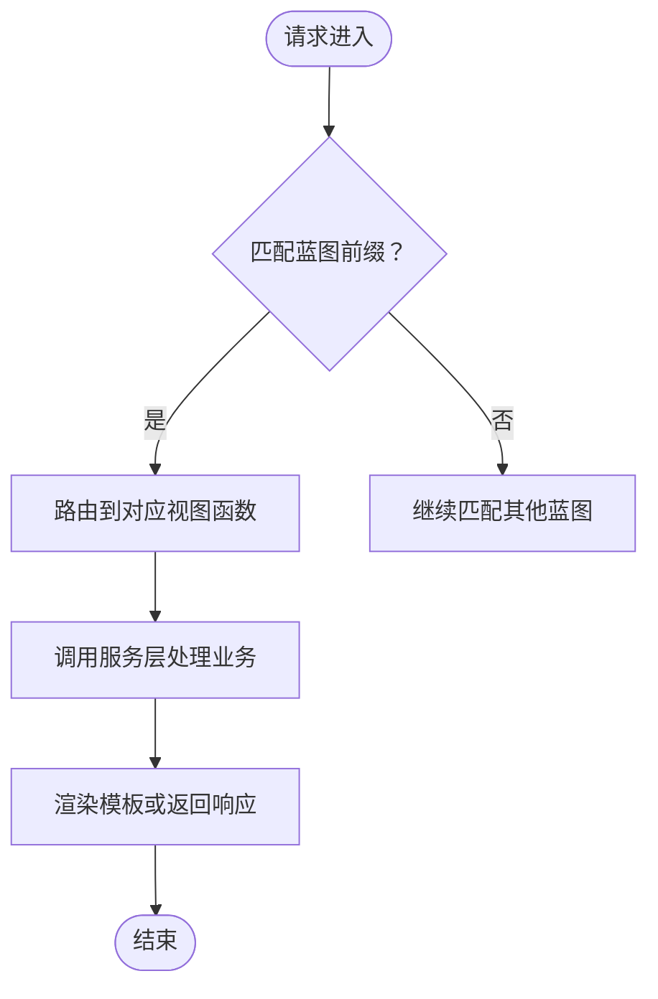
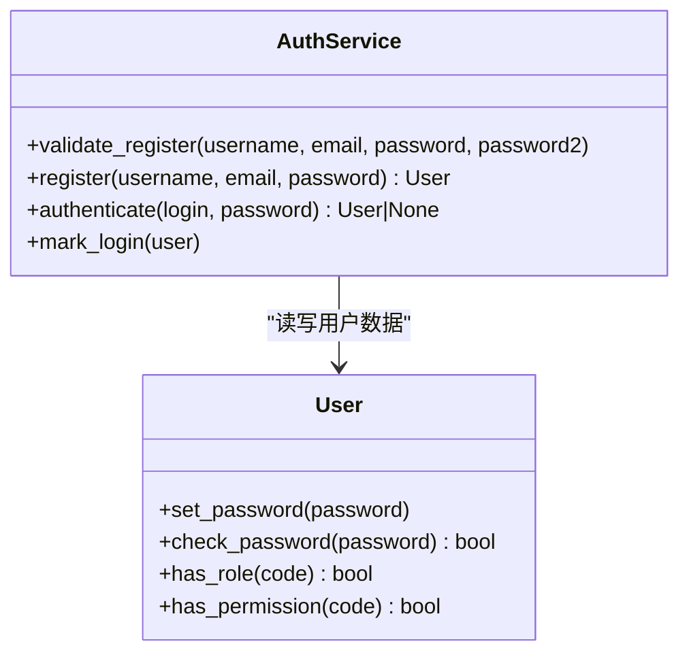
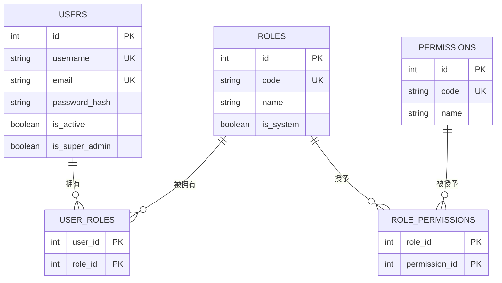
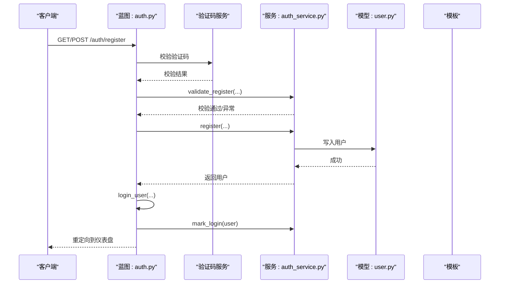
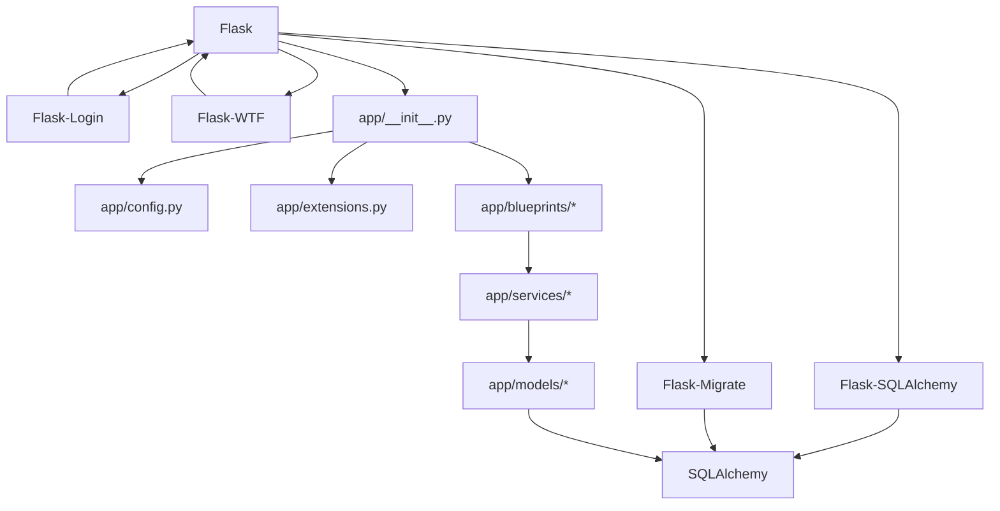

# 架构设计

<cite>
**本文引用的文件**
- [app/__init__.py](file://app/__init__.py)
- [run.py](file://run.py)
- [wsgi.py](file://wsgi.py)
- [app/config.py](file://app/config.py)
- [app/extensions.py](file://app/extensions.py)
- [app/blueprints/main.py](file://app/blueprints/main.py)
- [app/blueprints/auth.py](file://app/blueprints/auth.py)
- [app/services/auth_service.py](file://app/services/auth_service.py)
- [app/models/user.py](file://app/models/user.py)
- [app/models/__init__.py](file://app/models/__init__.py)
- [app/cli.py](file://app/cli.py)
- [app/utils/security.py](file://app/utils/security.py)
- [requirements.txt](file://requirements.txt)
</cite>

## 目录
1. [引言](#引言)
2. [项目结构](#项目结构)
3. [核心组件](#核心组件)
4. [架构总览](#架构总览)
5. [详细组件分析](#详细组件分析)
6. [依赖分析](#依赖分析)
7. [性能考虑](#性能考虑)
8. [故障排查指南](#故障排查指南)
9. [结论](#结论)
10. [附录](#附录)

## 引言
本文件为 My Wiki 的架构设计文档，聚焦于分层架构与关键设计模式（应用工厂、蓝图、服务层、MVC 变体），并系统阐述应用工厂如何初始化应用、蓝图如何组织路由与视图、服务层如何封装业务逻辑、模型层如何管理数据持久化。文档同时给出系统边界图、组件交互图与数据流向图，并讨论可扩展性、性能优化与安全设计。

## 项目结构
My Wiki 采用典型的 Flask 分层组织方式：
- 应用入口与工厂：通过应用工厂创建 Flask 实例，集中配置与扩展注册。
- 配置层：按环境提供开发/生产/测试配置，统一数据库、会话、上传、AI 与 RAG 参数。
- 扩展层：集中管理 SQLAlchemy、Flask-Migrate、Flask-Login、CSRFProtect 等扩展。
- 蓝图层：按功能域拆分蓝图（认证、用户、管理、知识库、文档、分享、AI、首页），统一在工厂中注册。
- 服务层：封装业务规则与流程（如认证、验证码、知识库、文档等）。
- 模型层：基于 SQLAlchemy 定义实体与关系（用户、角色、权限、知识库、文档、AI 知识库等）。
- 工具与 CLI：提供安全工具函数与自定义命令（初始化数据库、创建用户）。
- 运行入口：开发与生产分别提供入口脚本，均通过工厂创建应用实例。

图表来源
- [app/__init__.py:11-28](file://app/__init__.py#L11-L28)
- [app/config.py:73-83](file://app/config.py#L73-L83)
- [app/extensions.py:8-17](file://app/extensions.py#L8-L17)
- [app/blueprints/main.py:7](file://app/blueprints/main.py#L7)
- [app/blueprints/auth.py:7](file://app/blueprints/auth.py#L7)
- [app/services/auth_service.py:1](file://app/services/auth_service.py#L1)
- [app/models/user.py:55](file://app/models/user.py#L55)
- [app/models/__init__.py:1](file://app/models/__init__.py#L1)

章节来源
- [app/__init__.py:11-28](file://app/__init__.py#L11-L28)
- [app/config.py:15-83](file://app/config.py#L15-L83)
- [app/extensions.py:1-17](file://app/extensions.py#L1-L17)
- [run.py:1-17](file://run.py#L1-L17)
- [wsgi.py:1-10](file://wsgi.py#L1-L10)

## 核心组件
- 应用工厂（Application Factory）
  - 职责：创建 Flask 应用实例，加载配置，确保实例目录存在，注册扩展、蓝图、错误处理器、上下文处理器与 CLI。
  - 关键点：集中式初始化，便于多环境部署与测试隔离；扩展延迟绑定到应用实例。
- 配置层（Config）
  - 职责：提供 BaseConfig 与派生配置类，支持数据库连接、会话 Cookie、上传限制、AI 与 RAG 参数、分页默认值等。
  - 关键点：通过环境变量覆盖默认值，支持开发/生产/测试三套配置。
- 扩展层（Extensions）
  - 职责：声明 SQLAlchemy、Migrate、LoginManager、CSRFProtect 单例，并设置登录视图与消息。
  - 关键点：避免循环导入，延迟在工厂中绑定。
- 蓝图层（Blueprints）
  - 职责：按功能域组织路由与模板渲染，统一在工厂中注册并设置 URL 前缀。
  - 关键点：首页与认证等蓝图独立命名空间，便于维护与扩展。
- 服务层（Services）
  - 职责：封装业务规则与流程（如注册校验、登录认证、验证码发放与校验、CLI 初始化等）。
  - 关键点：与模型层解耦，便于单元测试与替换实现。
- 模型层（Models）
  - 职责：定义用户、角色、权限、知识库、文档、AI 知识库等实体及关系。
  - 关键点：RBAC 权限模型，支持系统管理员与继承权限。
- 工具与 CLI
  - 职责：提供安全令牌生成与自定义命令（初始化数据库、创建用户）。
  - 关键点：命令注入应用生命周期，便于运维自动化。

章节来源
- [app/__init__.py:11-101](file://app/__init__.py#L11-L101)
- [app/config.py:15-83](file://app/config.py#L15-L83)
- [app/extensions.py:8-17](file://app/extensions.py#L8-L17)
- [app/blueprints/main.py:1-16](file://app/blueprints/main.py#L1-L16)
- [app/blueprints/auth.py:1-85](file://app/blueprints/auth.py#L1-L85)
- [app/services/auth_service.py:1-57](file://app/services/auth_service.py#L1-L57)
- [app/models/user.py:1-104](file://app/models/user.py#L1-L104)
- [app/models/__init__.py:1-38](file://app/models/__init__.py#L1-L38)
- [app/cli.py:1-114](file://app/cli.py#L1-L114)
- [app/utils/security.py:1-8](file://app/utils/security.py#L1-L8)

## 架构总览
My Wiki 采用“应用工厂 + 蓝图 + 服务层 + MVC 视图”的分层架构：
- 控制器（Controller）：由蓝图路由处理请求，调用服务层执行业务逻辑。
- 服务层（Service）：封装业务规则与跨领域操作，屏蔽模型细节。
- 视图（View）：模板渲染与静态资源返回。
- 模型层（Model）：数据持久化与关系建模，配合 SQLAlchemy ORM。

图表来源
- [app/blueprints/auth.py:1-85](file://app/blueprints/auth.py#L1-L85)
- [app/blueprints/main.py:1-16](file://app/blueprints/main.py#L1-L16)
- [app/services/auth_service.py:1-57](file://app/services/auth_service.py#L1-L57)
- [app/models/user.py:55](file://app/models/user.py#L55)

## 详细组件分析

### 应用工厂与运行入口
- 应用工厂 create_app
  - 初始化 Flask 应用，设置实例相对路径、静态与模板目录。
  - 加载配置对象，确保实例目录存在，注册扩展、蓝图、错误处理、上下文处理器与 CLI。
  - 登录扩展的用户加载器从数据库查询用户并缓存会话。
- 运行入口
  - 开发入口：读取环境变量，创建开发配置的应用实例，启动调试服务器。
  - 生产入口：读取环境变量，创建生产配置的应用实例，供 WSGI 服务器托管。

图表来源
- [run.py:7-16](file://run.py#L7-L16)
- [wsgi.py:7-9](file://wsgi.py#L7-L9)
- [app/__init__.py:11-28](file://app/__init__.py#L11-L28)
- [app/config.py:73-83](file://app/config.py#L73-L83)
- [app/extensions.py:8-17](file://app/extensions.py#L8-L17)

章节来源
- [app/__init__.py:11-101](file://app/__init__.py#L11-L101)
- [run.py:1-17](file://run.py#L1-17)
- [wsgi.py:1-10](file://wsgi.py#L1-L10)
- [app/config.py:15-83](file://app/config.py#L15-L83)
- [app/extensions.py:1-17](file://app/extensions.py#L1-L17)

### 蓝图与视图（MVC 变体）
- 蓝图注册
  - 在工厂中统一注册多个蓝图，并设置 URL 前缀（如 /auth、/admin、/kb、/doc、/share、/ai）。
  - 主页蓝图负责未登录跳转与公开知识库展示。
- 视图职责
  - 控制器仅做参数解析与调用服务层，模板负责渲染与静态资源输出。
  - 认证蓝图处理注册、登录、登出与验证码接口。

图表来源
- [app/__init__.py:56-74](file://app/__init__.py#L56-L74)
- [app/blueprints/main.py:10-15](file://app/blueprints/main.py#L10-L15)
- [app/blueprints/auth.py:19-84](file://app/blueprints/auth.py#L19-L84)

章节来源
- [app/__init__.py:56-74](file://app/__init__.py#L56-L74)
- [app/blueprints/main.py:1-16](file://app/blueprints/main.py#L1-L16)
- [app/blueprints/auth.py:1-85](file://app/blueprints/auth.py#L1-L85)

### 服务层与业务逻辑
- 认证服务
  - 提供注册校验、注册、认证与登录记录等方法，抛出自定义异常用于控制器捕获。
- CLI 服务
  - 初始化数据库表、种子默认权限与角色、创建超级管理员账户并绑定角色。
- 安全工具
  - 提供 URL 安全的随机令牌生成，用于分享链接等场景。

图表来源
- [app/services/auth_service.py:21-57](file://app/services/auth_service.py#L21-L57)
- [app/models/user.py:55-104](file://app/models/user.py#L55-L104)

章节来源
- [app/services/auth_service.py:1-57](file://app/services/auth_service.py#L1-L57)
- [app/cli.py:41-95](file://app/cli.py#L41-L95)
- [app/utils/security.py:1-8](file://app/utils/security.py#L1-L8)

### 模型层与数据持久化
- 用户、角色、权限
  - 用户模型继承 Flask-Login 的 UserMixin，支持密码哈希与检查。
  - 角色与权限通过中间表建立多对多关系，支持系统角色与权限继承。
- 知识库与文档
  - 知识库、成员、可见性、文档类型与隐私等模型通过外键与关联定义。
- AI 知识库
  - AI 知识库、来源、文章、链接、分块与状态枚举等模型支撑 AI 功能。

图表来源
- [app/models/user.py:10-104](file://app/models/user.py#L10-L104)
- [app/models/__init__.py:1-38](file://app/models/__init__.py#L1-L38)

章节来源
- [app/models/user.py:1-104](file://app/models/user.py#L1-L104)
- [app/models/__init__.py:1-38](file://app/models/__init__.py#L1-L38)

### 数据流与处理序列
- 注册流程
  - 客户端提交表单 → 验证码校验 → 服务层注册校验 → 创建用户 → 登录并记录登录信息 → 渲染成功页面。
- 登录流程
  - 客户端提交凭据 → 验证码校验 → 服务层认证 → 登录并记录登录信息 → 重定向到仪表盘。

图表来源
- [app/blueprints/auth.py:19-48](file://app/blueprints/auth.py#L19-L48)
- [app/services/auth_service.py:21-57](file://app/services/auth_service.py#L21-L57)
- [app/models/user.py:55-104](file://app/models/user.py#L55-L104)

章节来源
- [app/blueprints/auth.py:1-85](file://app/blueprints/auth.py#L1-L85)
- [app/services/auth_service.py:1-57](file://app/services/auth_service.py#L1-L57)
- [app/models/user.py:1-104](file://app/models/user.py#L1-L104)

## 依赖分析
- 外部依赖
  - Web 框架与扩展：Flask、Flask-SQLAlchemy、Flask-Migrate、Flask-Login、Flask-WTF。
  - 数据库与驱动：PyMySQL、SQLAlchemy。
  - 工具与第三方：Pillow、bleach、markdown、python-slugify、Werkzeug、email-validator、requests、openai。
  - 可选：当启用 RAG 时需要 chromadb 与 tiktoken。
- 内部依赖
  - 工厂依赖配置与扩展；蓝图依赖服务层；服务层依赖模型层；CLI 依赖模型与扩展。

图表来源
- [requirements.txt:1-22](file://requirements.txt#L1-L22)
- [app/__init__.py:11-28](file://app/__init__.py#L11-L28)
- [app/config.py:15-83](file://app/config.py#L15-L83)
- [app/extensions.py:1-17](file://app/extensions.py#L1-L17)

章节来源
- [requirements.txt:1-22](file://requirements.txt#L1-L22)
- [app/__init__.py:11-28](file://app/__init__.py#L11-L28)
- [app/config.py:15-83](file://app/config.py#L15-L83)
- [app/extensions.py:1-17](file://app/extensions.py#L1-L17)

## 性能考虑
- 数据库连接池
  - 配置了连接预热与回收策略，降低连接失效导致的慢查询风险。
- 会话与 Cookie
  - HttpOnly Cookie 与 Lax SameSite 策略减少 XSS 与 CSRF 风险，合理设置记住登录时长。
- 上传与分页
  - 限制最大内容长度，控制上传体积；默认分页大小适配列表展示。
- 缓存与静态资源
  - 建议在生产环境结合 CDN 与反向代理缓存静态资源与模板渲染结果。
- AI 与 RAG
  - 当启用 RAG 时，注意向量库与嵌入模型的资源开销，建议异步任务与限流策略。

## 故障排查指南
- 403/404/500 错误页面
  - 工厂已注册通用错误处理器，返回对应模板，便于统一用户体验。
- 登录失败
  - 检查验证码是否过期、用户名/邮箱是否存在、密码是否正确、用户是否激活。
- 初始化失败
  - 使用 CLI 初始化数据库与默认角色/权限，确认数据库连接字符串与权限授予。
- 部署问题
  - 确认生产入口使用 wsgi.py，环境变量 FLASK_CONFIG 设置为 production，数据库与 AI/RAG 环境变量正确。

章节来源
- [app/__init__.py:76-88](file://app/__init__.py#L76-L88)
- [app/services/auth_service.py:44-50](file://app/services/auth_service.py#L44-L50)
- [app/cli.py:61-95](file://app/cli.py#L61-L95)
- [wsgi.py:7-9](file://wsgi.py#L7-L9)

## 结论
My Wiki 通过应用工厂实现了清晰的初始化与配置分离，蓝图将功能域解耦，服务层封装业务规则，模型层承载数据持久化与关系建模。该架构具备良好的可扩展性与可维护性，适合在现有基础上引入更多功能域与服务。建议在生产环境中完善缓存、CDN、异步任务与监控体系，持续提升性能与稳定性。

## 附录
- 技术决策与权衡
  - 选择 Flask 作为 Web 框架，因其轻量与生态成熟，适合快速迭代。
  - 使用蓝图组织路由，避免单文件臃肿，提升团队协作效率。
  - 将业务逻辑置于服务层，降低视图复杂度，增强测试友好性。
  - 模型层采用 SQLAlchemy，兼顾 ORM 灵活与迁移工具。
- 安全设计
  - CSRF 保护、HttpOnly Cookie、密码哈希、验证码、最小权限原则与 RBAC。
- 可扩展性
  - 新增蓝图与服务模块遵循现有命名与注册规范；模型变更通过迁移工具管理。