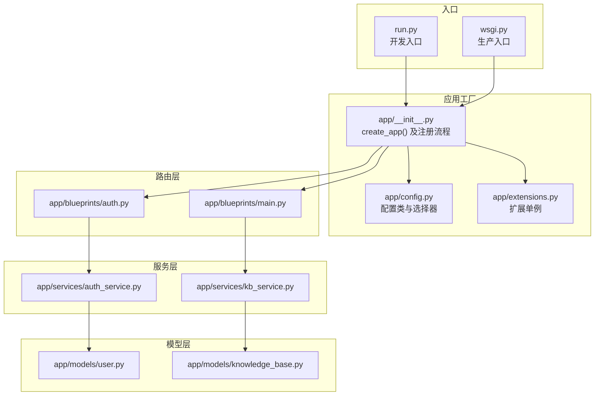
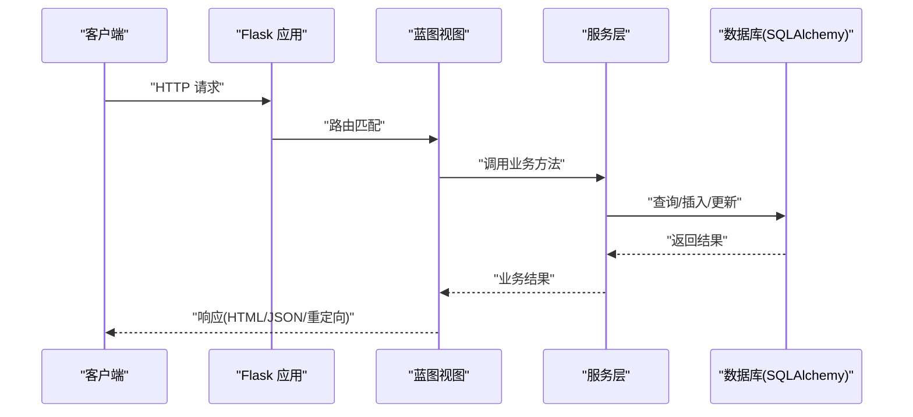
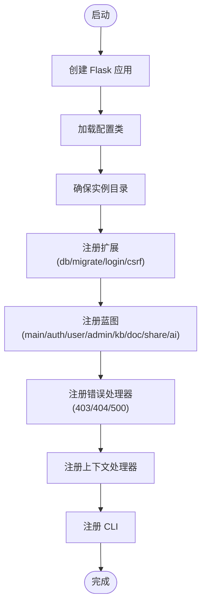
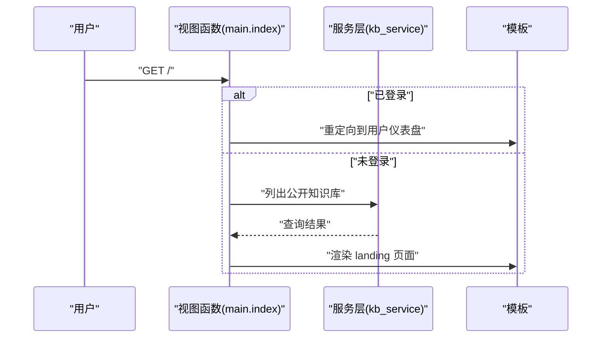
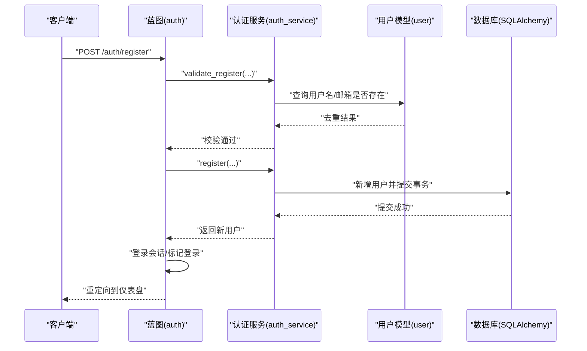
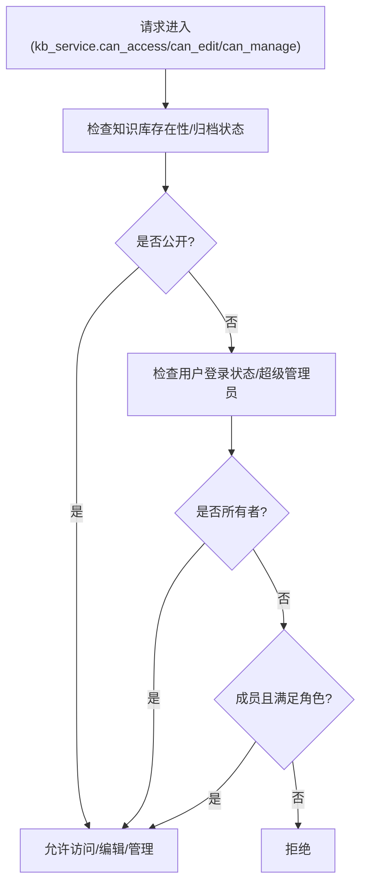
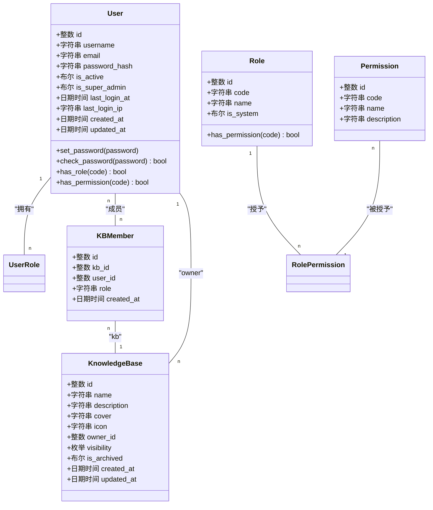
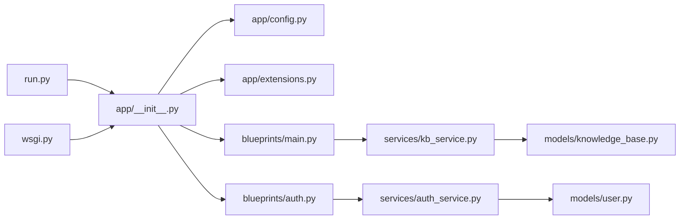

# 组件交互模式

<cite>
**本文引用的文件**
- [app/__init__.py](file://app/__init__.py)
- [run.py](file://run.py)
- [wsgi.py](file://wsgi.py)
- [app/config.py](file://app/config.py)
- [app/extensions.py](file://app/extensions.py)
- [app/blueprints/main.py](file://app/blueprints/main.py)
- [app/blueprints/auth.py](file://app/blueprints/auth.py)
- [app/services/auth_service.py](file://app/services/auth_service.py)
- [app/services/kb_service.py](file://app/services/kb_service.py)
- [app/models/user.py](file://app/models/user.py)
- [app/models/knowledge_base.py](file://app/models/knowledge_base.py)
- [app/utils/decorators.py](file://app/utils/decorators.py)
</cite>

## 目录
1. [引言](#引言)
2. [项目结构](#项目结构)
3. [核心组件](#核心组件)
4. [架构总览](#架构总览)
5. [详细组件分析](#详细组件分析)
6. [依赖分析](#依赖分析)
7. [性能考虑](#性能考虑)
8. [故障排查指南](#故障排查指南)
9. [结论](#结论)
10. [附录](#附录)

## 引言
本文件聚焦 My Wiki 的“组件交互模式”，系统性梳理从 HTTP 请求到数据库操作的完整链路，解释应用工厂如何协调组件初始化、蓝图如何将请求路由到视图函数、服务层如何封装业务逻辑、模型层如何处理数据持久化，并覆盖依赖注入模式、中间件机制、异常处理流程与上下文管理策略。文档同时提供时序图与调用栈示例，帮助开发者快速理解系统运行机制。

## 项目结构
My Wiki 基于 Flask 构建，采用分层组织：应用工厂负责装配；蓝图定义路由；服务层封装业务；模型层映射数据库；扩展模块集中管理第三方插件；配置模块按环境加载参数；WSGI/开发入口分别用于生产与本地调试。

图表来源
- [app/__init__.py:11-28](file://app/__init__.py#L11-L28)
- [app/config.py:80-83](file://app/config.py#L80-L83)
- [app/extensions.py:8-17](file://app/extensions.py#L8-L17)
- [app/blueprints/main.py:1-16](file://app/blueprints/main.py#L1-L16)
- [app/blueprints/auth.py:1-85](file://app/blueprints/auth.py#L1-L85)
- [app/services/auth_service.py:1-57](file://app/services/auth_service.py#L1-L57)
- [app/services/kb_service.py:1-80](file://app/services/kb_service.py#L1-L80)
- [app/models/user.py:1-104](file://app/models/user.py#L1-L104)
- [app/models/knowledge_base.py:1-62](file://app/models/knowledge_base.py#L1-L62)

章节来源
- [app/__init__.py:11-28](file://app/__init__.py#L11-L28)
- [app/config.py:80-83](file://app/config.py#L80-L83)
- [app/extensions.py:8-17](file://app/extensions.py#L8-L17)
- [app/blueprints/main.py:1-16](file://app/blueprints/main.py#L1-L16)
- [app/blueprints/auth.py:1-85](file://app/blueprints/auth.py#L1-L85)
- [app/services/auth_service.py:1-57](file://app/services/auth_service.py#L1-L57)
- [app/services/kb_service.py:1-80](file://app/services/kb_service.py#L1-L80)
- [app/models/user.py:1-104](file://app/models/user.py#L1-L104)
- [app/models/knowledge_base.py:1-62](file://app/models/knowledge_base.py#L1-L62)

## 核心组件
- 应用工厂与装配
  - 应用工厂负责创建 Flask 实例、加载配置、确保实例目录、注册扩展、蓝图、错误处理器、上下文处理器与 CLI。
  - 扩展通过单例对象延迟绑定应用，避免循环导入。
- 蓝图与路由
  - 各功能域以蓝图组织，统一在工厂中注册，支持 url_prefix 前缀。
- 服务层
  - 将业务规则与数据访问解耦，集中处理校验、权限判断、聚合查询等。
- 模型层
  - 使用 SQLAlchemy 映射用户、角色、权限、知识库及成员关系等实体。
- 中间件与上下文
  - 登录状态由扩展注入；装饰器提供权限控制；上下文处理器向模板注入全局变量。
- 错误处理
  - 针对 403/404/500 提供统一错误页渲染。

章节来源
- [app/__init__.py:11-28](file://app/__init__.py#L11-L28)
- [app/__init__.py:39-54](file://app/__init__.py#L39-L54)
- [app/__init__.py:56-74](file://app/__init__.py#L56-L74)
- [app/__init__.py:76-88](file://app/__init__.py#L76-L88)
- [app/__init__.py:90-96](file://app/__init__.py#L90-L96)
- [app/extensions.py:8-17](file://app/extensions.py#L8-L17)
- [app/utils/decorators.py:8-33](file://app/utils/decorators.py#L8-L33)

## 架构总览
下面的时序图展示了从 HTTP 请求到数据库操作的端到端链路，涵盖认证、权限检查、服务层处理与模型持久化。

图表来源
- [app/__init__.py:56-74](file://app/__init__.py#L56-L74)
- [app/blueprints/auth.py:19-77](file://app/blueprints/auth.py#L19-L77)
- [app/services/auth_service.py:21-57](file://app/services/auth_service.py#L21-L57)
- [app/models/user.py:55-104](file://app/models/user.py#L55-L104)

## 详细组件分析

### 应用工厂与装配流程
- 创建 Flask 实例，启用 instance 相对配置、静态与模板目录。
- 读取配置类并设置 app.config。
- 确保实例目录存在（上传、AI 知识库目录）。
- 注册扩展：数据库、迁移、登录、CSRF。
- 注册蓝图：主页、认证、用户、管理、知识库、文档、分享、AI。
- 注册错误处理器与上下文处理器。
- 注册 CLI 子命令。

图表来源
- [app/__init__.py:11-28](file://app/__init__.py#L11-L28)
- [app/__init__.py:31-54](file://app/__init__.py#L31-L54)
- [app/__init__.py:56-74](file://app/__init__.py#L56-L74)
- [app/__init__.py:76-88](file://app/__init__.py#L76-L88)
- [app/__init__.py:90-96](file://app/__init__.py#L90-L96)
- [app/__init__.py:98-101](file://app/__init__.py#L98-L101)

章节来源
- [app/__init__.py:11-28](file://app/__init__.py#L11-L28)
- [app/__init__.py:31-54](file://app/__init__.py#L31-L54)
- [app/__init__.py:56-74](file://app/__init__.py#L56-L74)
- [app/__init__.py:76-88](file://app/__init__.py#L76-L88)
- [app/__init__.py:90-96](file://app/__init__.py#L90-L96)
- [app/__init__.py:98-101](file://app/__init__.py#L98-L101)

### 蓝图与路由交互
- 主蓝图：首页根据登录状态重定向至仪表盘或展示公开知识库列表。
- 认证蓝图：提供验证码生成、注册、登录、登出接口，集成 CSRF 与登录状态检查。
- 权限装饰器：超级管理员与细粒度权限控制。

图表来源
- [app/blueprints/main.py:10-15](file://app/blueprints/main.py#L10-L15)
- [app/services/kb_service.py:57-62](file://app/services/kb_service.py#L57-L62)

章节来源
- [app/blueprints/main.py:1-16](file://app/blueprints/main.py#L1-L16)
- [app/services/kb_service.py:1-80](file://app/services/kb_service.py#L1-L80)

### 认证流程与服务层封装
- 视图层负责参数提取、验证码校验、会话维护与消息提示。
- 服务层执行业务校验与数据库操作：用户注册、登录验证、最后登录信息记录。
- 模型层提供用户实体与密码哈希校验。

图表来源
- [app/blueprints/auth.py:19-48](file://app/blueprints/auth.py#L19-L48)
- [app/services/auth_service.py:21-41](file://app/services/auth_service.py#L21-L41)
- [app/models/user.py:55-85](file://app/models/user.py#L55-L85)

章节来源
- [app/blueprints/auth.py:1-85](file://app/blueprints/auth.py#L1-L85)
- [app/services/auth_service.py:1-57](file://app/services/auth_service.py#L1-L57)
- [app/models/user.py:1-104](file://app/models/user.py#L1-L104)

### 权限与知识库服务
- 知识库服务提供访问、编辑、管理权限判定与成员增删改查。
- 与模型层的知识库与成员关系配合，实现多层级可见性控制。

图表来源
- [app/services/kb_service.py:10-46](file://app/services/kb_service.py#L10-L46)
- [app/models/knowledge_base.py:19-43](file://app/models/knowledge_base.py#L19-L43)

章节来源
- [app/services/kb_service.py:1-80](file://app/services/kb_service.py#L1-L80)
- [app/models/knowledge_base.py:1-62](file://app/models/knowledge_base.py#L1-L62)

### 数据模型与关系

图表来源
- [app/models/user.py:10-104](file://app/models/user.py#L10-L104)
- [app/models/knowledge_base.py:19-62](file://app/models/knowledge_base.py#L19-L62)

章节来源
- [app/models/user.py:1-104](file://app/models/user.py#L1-L104)
- [app/models/knowledge_base.py:1-62](file://app/models/knowledge_base.py#L1-L62)

### 中间件机制与上下文管理
- 登录中间：通过扩展注入用户加载器，基于数据库会话解析当前用户。
- CSRF 保护：在蓝图中默认启用，防止跨站请求伪造。
- 上下文处理器：向模板注入站点名称等全局变量。
- 权限装饰器：在视图前进行 401/403 拒绝，保证资源安全。

章节来源
- [app/__init__.py:39-54](file://app/__init__.py#L39-L54)
- [app/__init__.py:90-96](file://app/__init__.py#L90-L96)
- [app/utils/decorators.py:8-33](file://app/utils/decorators.py#L8-L33)

### 异常处理流程
- 工厂注册统一错误处理器，渲染对应错误页面并返回状态码。
- 视图层使用装饰器与服务层抛出自定义异常，形成清晰的错误传播路径。

章节来源
- [app/__init__.py:76-88](file://app/__init__.py#L76-L88)
- [app/services/auth_service.py:17-34](file://app/services/auth_service.py#L17-L34)

## 依赖分析
- 组件耦合
  - 蓝图依赖服务层；服务层依赖模型层与扩展；模型层依赖 SQLAlchemy 扩展。
  - 应用工厂集中装配，降低模块间直接耦合。
- 外部依赖
  - Flask、Flask-SQLAlchemy、Flask-Migrate、Flask-Login、Flask-WTF。
- 配置驱动
  - 通过配置类与环境变量切换开发/生产/测试环境，影响数据库连接池、调试开关、AI 与 RAG 参数等。

图表来源
- [run.py:1-17](file://run.py#L1-L17)
- [wsgi.py:1-10](file://wsgi.py#L1-L10)
- [app/__init__.py:11-28](file://app/__init__.py#L11-L28)
- [app/config.py:80-83](file://app/config.py#L80-L83)
- [app/extensions.py:8-17](file://app/extensions.py#L8-L17)
- [app/blueprints/main.py:1-16](file://app/blueprints/main.py#L1-L16)
- [app/blueprints/auth.py:1-85](file://app/blueprints/auth.py#L1-L85)
- [app/services/kb_service.py:1-80](file://app/services/kb_service.py#L1-L80)
- [app/services/auth_service.py:1-57](file://app/services/auth_service.py#L1-L57)
- [app/models/user.py:1-104](file://app/models/user.py#L1-L104)
- [app/models/knowledge_base.py:1-62](file://app/models/knowledge_base.py#L1-L62)

章节来源
- [run.py:1-17](file://run.py#L1-L17)
- [wsgi.py:1-10](file://wsgi.py#L1-L10)
- [app/__init__.py:11-28](file://app/__init__.py#L11-L28)
- [app/config.py:80-83](file://app/config.py#L80-L83)
- [app/extensions.py:8-17](file://app/extensions.py#L8-L17)
- [app/blueprints/main.py:1-16](file://app/blueprints/main.py#L1-L16)
- [app/blueprints/auth.py:1-85](file://app/blueprints/auth.py#L1-L85)
- [app/services/kb_service.py:1-80](file://app/services/kb_service.py#L1-L80)
- [app/services/auth_service.py:1-57](file://app/services/auth_service.py#L1-L57)
- [app/models/user.py:1-104](file://app/models/user.py#L1-L104)
- [app/models/knowledge_base.py:1-62](file://app/models/knowledge_base.py#L1-L62)

## 性能考虑
- 数据库连接池
  - 通过引擎选项启用预检查与回收，减少连接失效导致的失败。
- 查询优化
  - 在服务层使用合适的过滤条件与排序，避免 N+1 查询；必要时使用联结或批量查询。
- 缓存与静态资源
  - 利用 Flask 静态目录与缓存头策略，减少重复请求。
- 调试与日志
  - 开发环境开启调试，生产关闭；结合日志定位慢查询与异常。

## 故障排查指南
- 登录失败
  - 检查验证码是否过期、用户名/邮箱是否唯一、密码是否正确。
  - 关注服务层异常与视图层消息提示。
- 权限不足
  - 确认用户角色与知识库可见性；检查装饰器是否正确应用。
- 数据库错误
  - 查看事务提交与回滚路径，确认外键约束与唯一约束冲突。
- 配置问题
  - 核对环境变量与配置类映射，确保数据库连接字符串与池参数合理。

章节来源
- [app/services/auth_service.py:17-57](file://app/services/auth_service.py#L17-L57)
- [app/utils/decorators.py:8-33](file://app/utils/decorators.py#L8-L33)
- [app/config.py:18-26](file://app/config.py#L18-L26)

## 结论
My Wiki 通过应用工厂实现松耦合装配，蓝图承担路由职责，服务层隔离业务规则，模型层专注数据持久化。配合扩展提供的登录、CSRF、迁移与数据库能力，以及装饰器与错误处理器，构建了清晰、可维护的组件交互模式。建议在后续迭代中进一步引入依赖注入容器与更完善的日志监控体系，以提升可观测性与可测试性。

## 附录
- 入口与配置
  - 开发入口与生产 WSGI 入口均通过应用工厂创建应用实例，分别加载不同配置环境。
- 调用栈示例
  - GET / → main.index → kb_service.list_public_kbs → 渲染 landing 页面
  - POST /auth/register → auth.register → auth_service.validate_register/register → 登录并跳转

章节来源
- [run.py:1-17](file://run.py#L1-L17)
- [wsgi.py:1-10](file://wsgi.py#L1-L10)
- [app/blueprints/main.py:10-15](file://app/blueprints/main.py#L10-L15)
- [app/services/kb_service.py:57-62](file://app/services/kb_service.py#L57-L62)
- [app/blueprints/auth.py:19-48](file://app/blueprints/auth.py#L19-L48)
- [app/services/auth_service.py:21-41](file://app/services/auth_service.py#L21-L41)