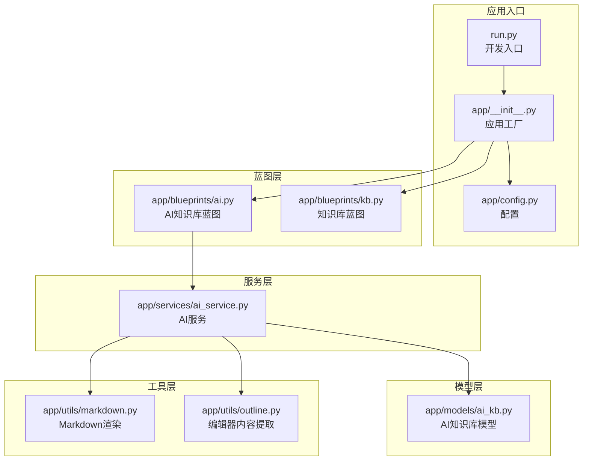
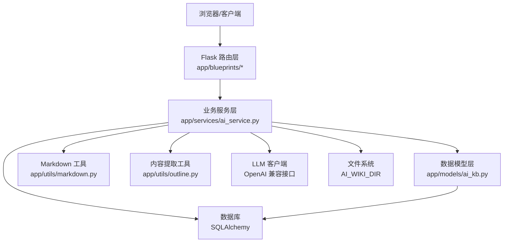
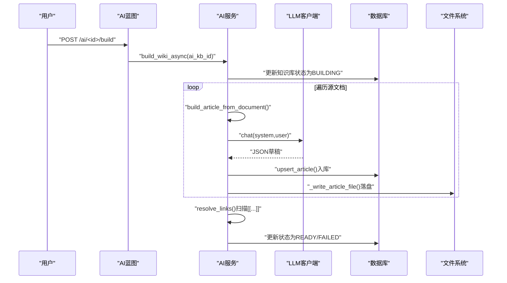
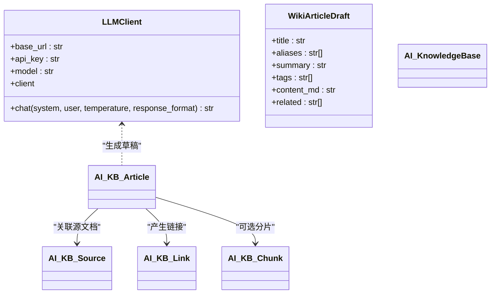
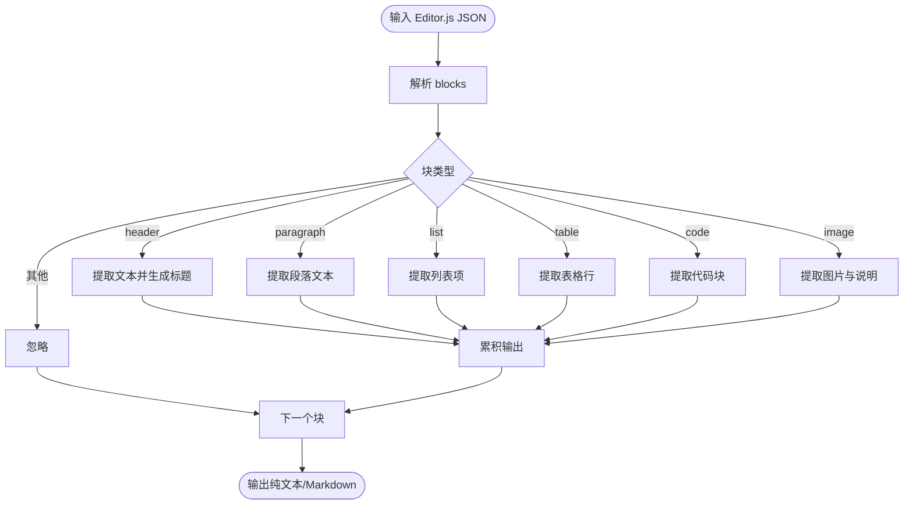
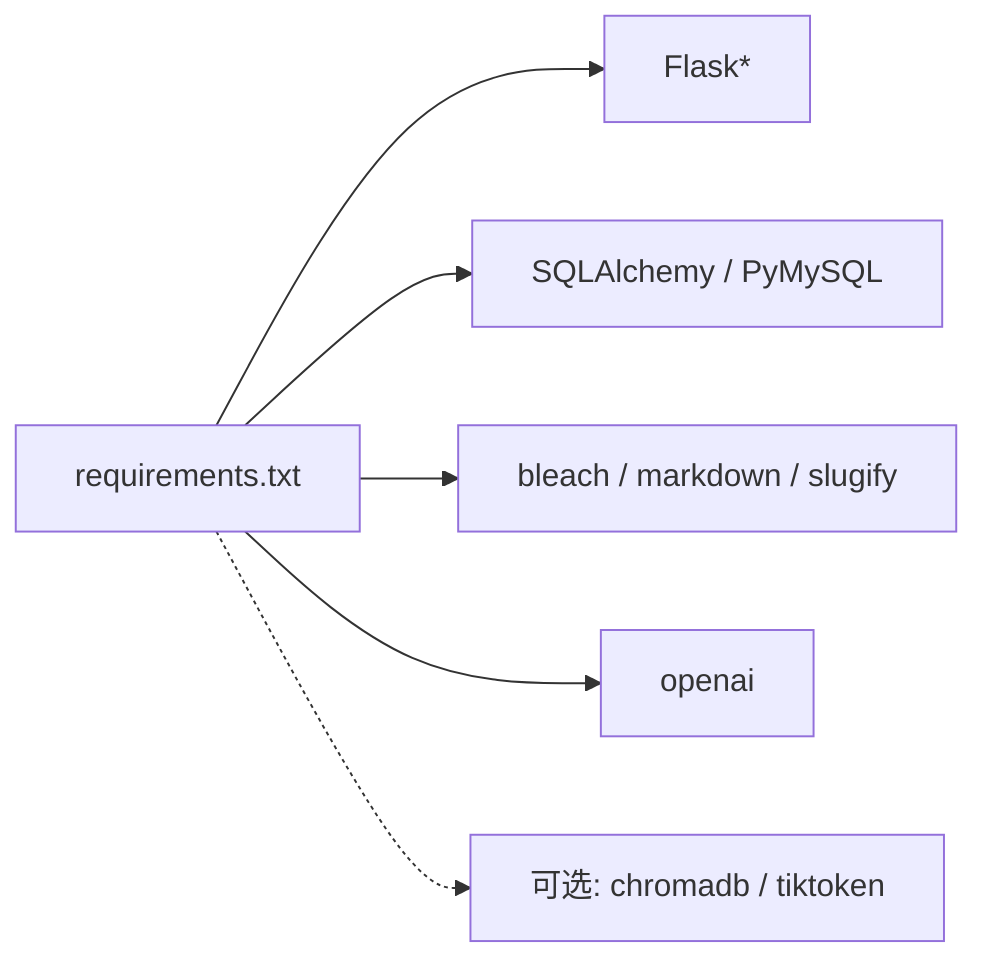

# AI知识库蓝图 (AI Knowledge Base Blueprint)

<cite>
**本文引用的文件**
- [README.md](file://README.md)
- [requirements.txt](file://requirements.txt)
- [run.py](file://run.py)
- [app/__init__.py](file://app/__init__.py)
- [app/config.py](file://app/config.py)
- [app/blueprints/ai.py](file://app/blueprints/ai.py)
- [app/services/ai_service.py](file://app/services/ai_service.py)
- [app/models/ai_kb.py](file://app/models/ai_kb.py)
- [app/utils/markdown.py](file://app/utils/markdown.py)
- [app/utils/outline.py](file://app/utils/outline.py)
- [app/blueprints/kb.py](file://app/blueprints/kb.py)
- [scripts/init_db.py](file://scripts/init_db.py)
- [app/templates/base.html](file://app/templates/base.html)
</cite>

## 目录
1. [简介](#简介)
2. [项目结构](#项目结构)
3. [核心组件](#核心组件)
4. [架构总览](#架构总览)
5. [详细组件分析](#详细组件分析)
6. [依赖分析](#依赖分析)
7. [性能考虑](#性能考虑)
8. [故障排查指南](#故障排查指南)
9. [结论](#结论)
10. [附录](#附录)

## 简介
本项目是一个基于 Flask 的“AI知识库蓝图”，实现了受 Andrej Karpathy 的 LLM Wiki 方法启发的知识库构建流水线：从知识库中的文档出发，通过大模型将每个源文档改写为结构化的维基条目，建立双向链接图谱，支持纯文本检索问答与可选的向量化增强问答（RAG）。系统通过 OpenAI 兼容接口调用大模型，采用异步后台任务完成构建，前端提供知识库管理、条目浏览、链接图谱与聊天问答等功能。

## 项目结构
项目采用典型的 Flask 分层组织方式：蓝图负责路由与视图，服务层封装业务逻辑，模型层定义数据库实体，工具模块提供 Markdown 解析与编辑器内容转换，配置模块集中管理运行参数，入口脚本负责应用工厂与开发服务器启动。

**图表来源**
- [run.py:1-17](file://run.py#L1-L17)
- [app/__init__.py:11-28](file://app/__init__.py#L11-L28)
- [app/config.py:15-54](file://app/config.py#L15-L54)
- [app/blueprints/ai.py:15](file://app/blueprints/ai.py#L15)
- [app/blueprints/kb.py:11](file://app/blueprints/kb.py#L11)
- [app/services/ai_service.py:1-408](file://app/services/ai_service.py#L1-L408)
- [app/models/ai_kb.py:1-121](file://app/models/ai_kb.py#L1-L121)
- [app/utils/markdown.py:1-87](file://app/utils/markdown.py#L1-L87)
- [app/utils/outline.py:1-136](file://app/utils/outline.py#L1-L136)

**章节来源**
- [run.py:1-17](file://run.py#L1-L17)
- [app/__init__.py:11-28](file://app/__init__.py#L11-L28)
- [app/config.py:15-54](file://app/config.py#L15-L54)

## 核心组件
- 蓝图与路由
  - AI知识库蓝图：提供知识库创建、编辑、删除、源文档管理、构建状态查询、维基浏览、链接图谱与聊天问答接口。
  - 知识库蓝图：提供知识库列表、详情、成员管理等传统知识库功能。
- 服务层
  - AI服务：封装 LLM 客户端、维基条目构建、链接解析、异步构建与重生成、可选 RAG 聊天。
- 模型层
  - 定义 AI 知识库、源文档、条目、链接与可选分片等实体及状态枚举。
- 工具层
  - Markdown 渲染与 Wiki 链接收集。
  - 编辑器内容到纯文本与 Markdown 的转换。

**章节来源**
- [app/blueprints/ai.py:15-279](file://app/blueprints/ai.py#L15-L279)
- [app/services/ai_service.py:1-408](file://app/services/ai_service.py#L1-L408)
- [app/models/ai_kb.py:1-121](file://app/models/ai_kb.py#L1-L121)
- [app/utils/markdown.py:1-87](file://app/utils/markdown.py#L1-L87)
- [app/utils/outline.py:1-136](file://app/utils/outline.py#L1-L136)

## 架构总览
系统以 Flask 应用为中心，通过蓝图划分功能域，服务层承担 AI 与业务逻辑，模型层持久化状态，工具层提供内容处理能力。OpenAI 兼容接口作为外部服务，LLM 客户端负责对话请求与响应格式化。

**图表来源**
- [app/blueprints/ai.py:15-279](file://app/blueprints/ai.py#L15-L279)
- [app/services/ai_service.py:1-408](file://app/services/ai_service.py#L1-L408)
- [app/models/ai_kb.py:1-121](file://app/models/ai_kb.py#L1-L121)
- [app/utils/markdown.py:1-87](file://app/utils/markdown.py#L1-L87)
- [app/utils/outline.py:1-136](file://app/utils/outline.py#L1-L136)
- [app/config.py:37-47](file://app/config.py#L37-L47)

## 详细组件分析

### 组件A：AI知识库蓝图与聊天接口
- 功能要点
  - 知识库 CRUD：创建、编辑、删除、设置模型与是否启用 RAG。
  - 源文档管理：选择知识库内的文档作为构建来源，支持批量加入与移除。
  - 构建与状态：触发异步构建，查询构建状态与统计信息。
  - 维基浏览：按标题/标签分组展示条目，支持内部链接重写与反链统计。
  - 图谱：导出节点与边，用于可视化。
  - 聊天问答：支持纯关键词匹配问答与可选 RAG 增强问答。
- 关键流程
  - 构建流程：将源文档转为条目草稿，入库并落盘，随后扫描占位链接并建立反链。
  - 聊天流程：根据问题检索 Top-N 条目上下文，调用 LLM 生成答案。

**图表来源**
- [app/blueprints/ai.py:143-156](file://app/blueprints/ai.py#L143-L156)
- [app/services/ai_service.py:313-344](file://app/services/ai_service.py#L313-L344)
- [app/services/ai_service.py:147-161](file://app/services/ai_service.py#L147-L161)
- [app/services/ai_service.py:204-230](file://app/services/ai_service.py#L204-L230)
- [app/services/ai_service.py:251-278](file://app/services/ai_service.py#L251-L278)

**章节来源**
- [app/blueprints/ai.py:27-85](file://app/blueprints/ai.py#L27-L85)
- [app/blueprints/ai.py:90-138](file://app/blueprints/ai.py#L90-L138)
- [app/blueprints/ai.py:143-173](file://app/blueprints/ai.py#L143-L173)
- [app/blueprints/ai.py:194-236](file://app/blueprints/ai.py#L194-L236)
- [app/blueprints/ai.py:251-260](file://app/blueprints/ai.py#L251-L260)
- [app/blueprints/ai.py:265-278](file://app/blueprints/ai.py#L265-L278)

### 组件B：AI服务与LLM客户端
- LLM 客户端
  - 封装 OpenAI 兼容 SDK，读取配置中的 base_url、api_key 与模型名，支持响应格式化。
- 维基构建
  - 使用系统提示与用户模板，要求 LLM 返回结构化 JSON，解析后生成条目草稿。
  - 生成唯一 slug，去重冲突，入库并落盘。
- 链接解析
  - 建立标题/别名/slug 的索引，扫描条目中的 [[...]] 占位，生成正向与反向链接。
- 异步构建
  - 后台线程执行构建，失败时记录错误消息，成功后更新状态与时间戳。
- 聊天问答
  - 纯文本匹配：按关键词重叠打分，选取 Top-N 条目拼接上下文，调用 LLM 生成答案。
  - 可选 RAG：当启用时，结合向量检索增强（需额外依赖与向量存储）。

**图表来源**
- [app/services/ai_service.py:47-86](file://app/services/ai_service.py#L47-L86)
- [app/services/ai_service.py:122-130](file://app/services/ai_service.py#L122-L130)
- [app/models/ai_kb.py:22-44](file://app/models/ai_kb.py#L22-L44)
- [app/models/ai_kb.py:46-64](file://app/models/ai_kb.py#L46-L64)
- [app/models/ai_kb.py:66-91](file://app/models/ai_kb.py#L66-L91)
- [app/models/ai_kb.py:93-108](file://app/models/ai_kb.py#L93-L108)
- [app/models/ai_kb.py:110-121](file://app/models/ai_kb.py#L110-L121)

**章节来源**
- [app/services/ai_service.py:47-86](file://app/services/ai_service.py#L47-L86)
- [app/services/ai_service.py:147-161](file://app/services/ai_service.py#L147-L161)
- [app/services/ai_service.py:237-278](file://app/services/ai_service.py#L237-L278)
- [app/services/ai_service.py:313-381](file://app/services/ai_service.py#L313-L381)
- [app/services/ai_service.py:391-408](file://app/services/ai_service.py#L391-L408)

### 组件C：内容提取与Markdown渲染
- 编辑器内容到纯文本与 Markdown 的转换，支持标题、段落、列表、表格、代码、图片等块类型。
- 维基链接收集与渲染：识别 [[目标|锚文本]]，通过解析器映射到条目 slug，未命中的标记为红链。

**图表来源**
- [app/utils/outline.py:22-135](file://app/utils/outline.py#L22-L135)
- [app/utils/markdown.py:42-66](file://app/utils/markdown.py#L42-L66)

**章节来源**
- [app/utils/outline.py:22-135](file://app/utils/outline.py#L22-L135)
- [app/utils/markdown.py:28-87](file://app/utils/markdown.py#L28-L87)

### 组件D：知识库蓝图与文档树
- 提供知识库列表、详情、成员管理与文档树展示，配合权限控制与访问校验。
- 与 AI 蓝图协同：AI 知识库的源文档来自知识库内的文档集合。

**章节来源**
- [app/blueprints/kb.py:14-141](file://app/blueprints/kb.py#L14-L141)

## 依赖分析
- 运行时依赖
  - Flask 生态：Flask、Flask-SQLAlchemy、Flask-Migrate、Flask-Login、Flask-WTF。
  - 数据库与驱动：PyMySQL、SQLAlchemy。
  - 文本与安全：bleach、markdown、python-slugify。
  - 大模型：openai。
  - 可选 RAG：chromadb、tiktoken（在需求中注释说明）。
- 配置与环境
  - 通过环境变量注入 OpenAI 接口地址、密钥、默认模型、AI 维基目录、可选 RAG 开关与嵌入模型等。

**图表来源**
- [requirements.txt:1-22](file://requirements.txt#L1-L22)

**章节来源**
- [requirements.txt:1-22](file://requirements.txt#L1-L22)
- [app/config.py:37-47](file://app/config.py#L37-L47)

## 性能考虑
- 构建吞吐
  - 异步线程池：构建在后台线程执行，避免阻塞请求线程。
  - 批量处理：按状态筛选待处理源文档，减少无效重跑。
- LLM 调用
  - 温度与格式约束：固定温度与 JSON 响应格式，提升稳定性与可解析性。
  - 内容截断：对源文档进行安全上限截断，防止过长输入导致成本与延迟上升。
- 存储与索引
  - 文件落盘：条目以 Markdown 文件形式落盘，便于静态化与版本管理。
  - 链接解析：构建阶段一次性扫描并落库，查询阶段仅做简单字面匹配与反链统计。
- 成本控制
  - 配置化模型选择：通过环境变量切换低成本模型。
  - 限制上下文长度：聊天时对条目内容进行截断，控制 token 消耗。
  - 可选 RAG：默认关闭，避免额外向量计算与存储开销。

[本节为通用性能建议，不直接分析具体文件，故无章节来源]

## 故障排查指南
- 常见错误与定位
  - LLM SDK 未安装：初始化 LLM 客户端时导入异常，检查依赖安装。
  - 源文档缺失或已删除：构建过程中检测并记录失败原因。
  - 知识库为空：聊天前需先完成构建，否则返回提示信息。
  - 权限不足：非拥有者或非超级管理员访问被拒绝。
- 错误处理策略
  - 服务层捕获异常并回写状态与错误消息，前端通过状态接口轮询。
  - 聊天接口统一返回 JSON，包含 ok 与 error 字段，便于前端提示。
- 建议排查步骤
  - 检查 OPENAI_BASE_URL 与 OPENAI_API_KEY 是否正确配置。
  - 查看知识库状态接口返回的 last_built_at 与 error_msg。
  - 确认源文档已加入且状态为已处理。
  - 如启用 RAG，确认可选依赖已安装且向量存储路径有效。

**章节来源**
- [app/services/ai_service.py:67-68](file://app/services/ai_service.py#L67-L68)
- [app/services/ai_service.py:300-310](file://app/services/ai_service.py#L300-L310)
- [app/services/ai_service.py:394-395](file://app/services/ai_service.py#L394-L395)
- [app/blueprints/ai.py:18-24](file://app/blueprints/ai.py#L18-L24)
- [app/blueprints/ai.py:269-277](file://app/blueprints/ai.py#L269-L277)

## 结论
本项目以 Karpathy 的 LLM Wiki 方法为核心，结合 Flask 的模块化架构，提供了从文档到维基条目、从链接解析到聊天问答的完整闭环。通过 OpenAI 兼容接口与可插拔的 RAG 能力，系统在易用性与扩展性之间取得平衡。建议在生产环境中开启异步构建、合理配置模型与上下文长度、并按需启用 RAG 以控制成本与性能。

[本节为总结性内容，不直接分析具体文件，故无章节来源]

## 附录

### API 使用示例与集成指导
- 创建 AI 知识库
  - 请求：POST /ai/new
  - 表单字段：name、description、chat_model
  - 响应：重定向至详情页
- 加入源文档
  - 请求：POST /ai/<ai_kb_id>/sources/add
  - 表单字段：doc_ids（多选）
  - 响应：重定向回源文档页
- 触发构建
  - 请求：POST /ai/<ai_kb_id>/build
  - 表单字段：scope（默认仅待处理）
  - 响应：提示任务已启动
- 查询构建状态
  - 请求：GET /ai/<ai_kb_id>/status
  - 响应：JSON 包含 status、error、last_built_at、各状态计数与条目数
- 维基浏览
  - 列表：GET /ai/<ai_kb_id>/wiki
  - 条目：GET /ai/<ai_kb_id>/wiki/<slug>
  - 重生成：POST /ai/<ai_kb_id>/wiki/<slug>/regenerate
- 链接图谱
  - GET /ai/<ai_kb_id>/graph
- 聊天问答
  - 请求：POST /ai/<ai_kb_id>/chat
  - 表单字段：q（问题）
  - 响应：JSON {ok, answer|error}

**章节来源**
- [app/blueprints/ai.py:34-52](file://app/blueprints/ai.py#L34-L52)
- [app/blueprints/ai.py:108-126](file://app/blueprints/ai.py#L108-L126)
- [app/blueprints/ai.py:143-156](file://app/blueprints/ai.py#L143-L156)
- [app/blueprints/ai.py:159-173](file://app/blueprints/ai.py#L159-L173)
- [app/blueprints/ai.py:194-236](file://app/blueprints/ai.py#L194-L236)
- [app/blueprints/ai.py:251-260](file://app/blueprints/ai.py#L251-L260)
- [app/blueprints/ai.py:265-278](file://app/blueprints/ai.py#L265-L278)

### 配置与部署要点
- 必填配置
  - OPENAI_BASE_URL、OPENAI_API_KEY、CHAT_MODEL
- 可选配置
  - ENABLE_RAG、EMBEDDING_MODEL、CHROMA_PATH
- 目录准备
  - AI_WIKI_DIR、UPLOAD_DIR、CHROMA_PATH（如启用 RAG）
- 初始化数据库
  - 使用脚本创建表与管理员账号，或通过 CLI 命令初始化

**章节来源**
- [app/config.py:37-47](file://app/config.py#L37-L47)
- [scripts/init_db.py:23-47](file://scripts/init_db.py#L23-L47)

### 前端模板与静态资源
- 基础模板与导航栏、页脚、Flash 提示等组件通过基础模板统一加载。
- 前端交互建议：使用 AJAX 调用构建状态接口轮询，聊天接口提交问题并展示结果。

**章节来源**
- [app/templates/base.html:1-29](file://app/templates/base.html#L1-L29)