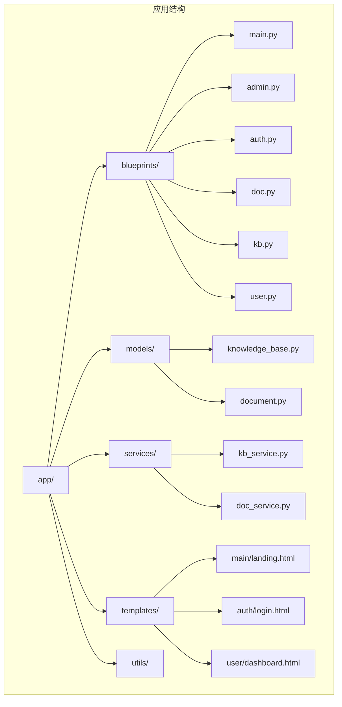
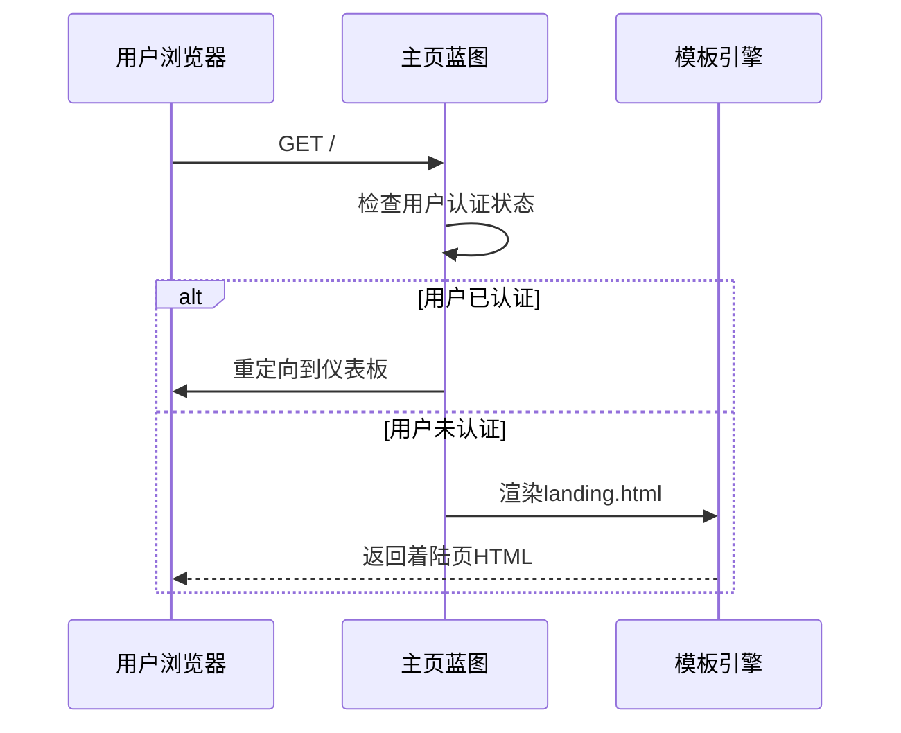
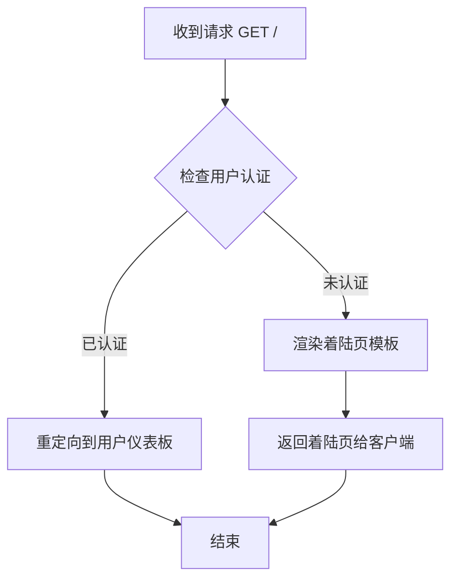
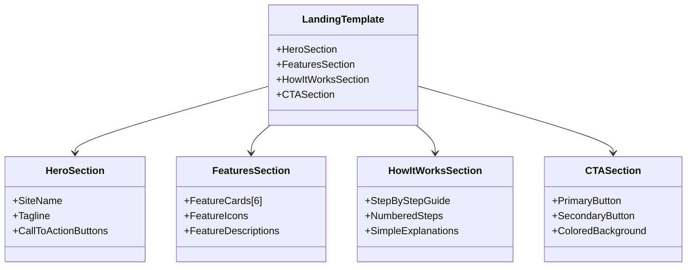
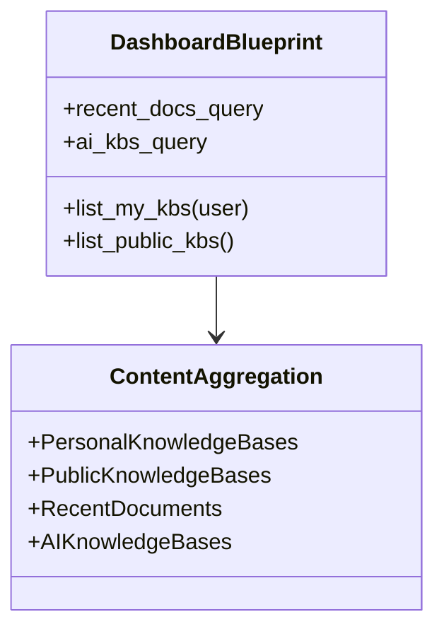
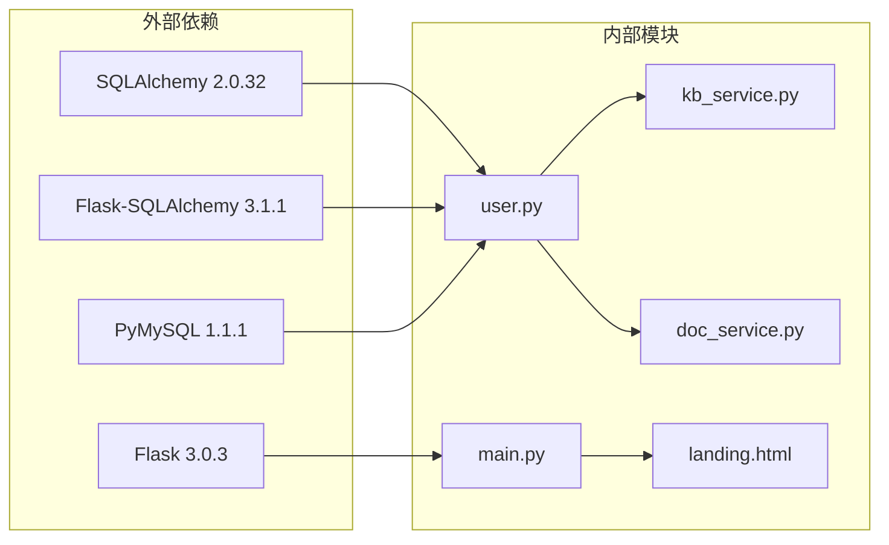
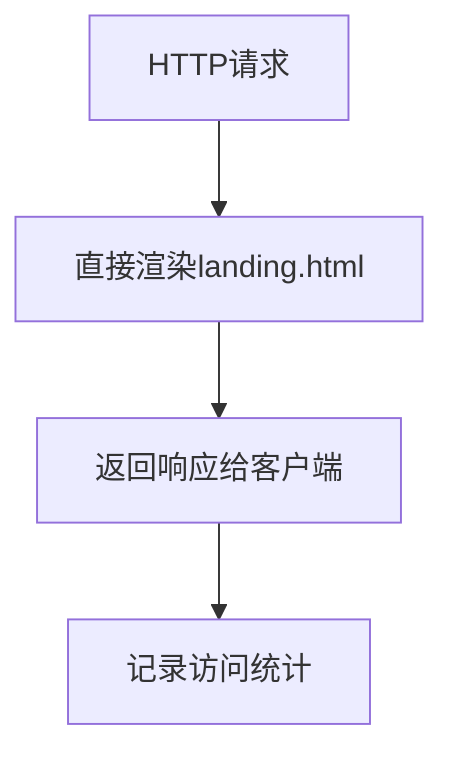

# 主页蓝图（Main Blueprint）功能文档

<cite>
**本文档中引用的文件**
- [main.py](file://app/blueprints/main.py)
- [landing.html](file://app/templates/main/landing.html)
- [user.py](file://app/blueprints/user.py)
- [kb_service.py](file://app/services/kb_service.py)
- [knowledge_base.py](file://app/models/knowledge_base.py)
- [document.py](file://app/models/document.py)
- [doc_service.py](file://app/services/doc_service.py)
- [config.py](file://app/config.py)
- [extensions.py](file://app/extensions.py)
- [base.html](file://app/templates/base.html)
- [run.py](file://run.py)
</cite>

## 更新摘要
**变更内容**
- 主页蓝图路由逻辑完全重构：从显示公共知识库改为直接渲染着陆页模板
- 移除了公共知识库查询逻辑（kb_service.list_public_kbs().limit(8).all()）
- 新增了专门的着陆页模板（main/landing.html）
- 用户重定向机制保持不变，仍指向用户仪表板

## 目录
1. [简介](#简介)
2. [项目结构](#项目结构)
3. [核心组件](#核心组件)
4. [架构概览](#架构概览)
5. [详细组件分析](#详细组件分析)
6. [依赖关系分析](#依赖关系分析)
7. [性能考虑](#性能考虑)
8. [SEO优化策略](#seo优化策略)
9. [缓存策略](#缓存策略)
10. [主页API接口](#主页api接口)
11. [内容管理示例](#内容管理示例)
12. [故障排除指南](#故障排除指南)
13. [结论](#结论)

## 简介

主页蓝图是MyWiki项目的核心入口点，负责处理用户访问根路径时的路由逻辑。经过重构后，该蓝图实现了更加现代化的用户导向设计：已认证用户会被重定向到个人仪表板，而未认证用户则直接看到精心设计的着陆页模板，展示平台的核心功能和价值主张。这种设计提升了用户体验，使新用户能够快速了解平台能力并采取相应行动。

## 项目结构

MyWiki采用Flask框架的标准项目结构，主页蓝图位于`app/blueprints/main.py`中，与其它蓝图如`admin.py`、`auth.py`、`doc.py`等并列组织。重构后的结构更加清晰，主页蓝图专注于路由处理，而内容展示则委托给专门的模板。



**图表来源**
- [main.py:1-13](file://app/blueprints/main.py#L1-L13)
- [user.py:1-51](file://app/blueprints/user.py#L1-L51)
- [landing.html:1-131](file://app/templates/main/landing.html#L1-L131)

## 核心组件

### 主页蓝图路由处理器

主页蓝图的核心是`index()`函数，它实现了以下逻辑：
- 检查当前用户是否已认证
- 如果已认证，重定向到用户仪表板
- 如果未认证，直接渲染着陆页模板

### 着陆页模板

重构后的主页不再查询数据库，而是直接渲染专门设计的着陆页模板。该模板包含了：
- 平台介绍和核心价值主张
- 功能特性展示区域
- 三步使用指南
- 明显的行动号召按钮

### 用户仪表板蓝图

用户仪表板蓝图（位于`user.py`）仍然保留了原有的功能：
- 展示用户的个人知识库
- 显示公共知识库列表
- 展示最近编辑的文档
- 提供AI知识库管理

**章节来源**
- [main.py:8-12](file://app/blueprints/main.py#L8-L12)
- [landing.html:1-131](file://app/templates/main/landing.html#L1-L131)
- [user.py:12-28](file://app/blueprints/user.py#L12-L28)

## 架构概览

主页蓝图采用简化的分层架构设计，去除了不必要的数据库查询：



**图表来源**
- [main.py:8-12](file://app/blueprints/main.py#L8-L12)

## 详细组件分析

### 主页路由处理流程

主页蓝图的路由处理现在更加简洁高效：



**图表来源**
- [main.py:8-12](file://app/blueprints/main.py#L8-L12)

### 着陆页模板结构

着陆页模板采用了现代响应式设计，包含多个功能区块：



**图表来源**
- [landing.html:6-25](file://app/templates/main/landing.html#L6-L25)
- [landing.html:28-91](file://app/templates/main/landing.html#L28-L91)
- [landing.html:94-117](file://app/templates/main/landing.html#L94-L117)
- [landing.html:120-129](file://app/templates/main/landing.html#L120-L129)

### 用户仪表板内容聚合

用户仪表板仍然保持了原有的内容聚合功能：



**图表来源**
- [user.py:14-28](file://app/blueprints/user.py#L14-L28)
- [kb_service.py:83-97](file://app/services/kb_service.py#L83-L97)

**章节来源**
- [main.py:8-12](file://app/blueprints/main.py#L8-L12)
- [landing.html:1-131](file://app/templates/main/landing.html#L1-L131)
- [user.py:12-28](file://app/blueprints/user.py#L12-L28)

## 依赖关系分析

系统的关键依赖关系现在更加简化：



**图表来源**
- [requirements.txt:1-21](file://requirements.txt#L1-L21)
- [main.py:2-5](file://app/blueprints/main.py#L2-L5)

**章节来源**
- [extensions.py:8-16](file://app/extensions.py#L8-L16)
- [config.py:18-26](file://app/config.py#L18-L26)

## 性能考虑

### 性能优化效果

重构后的主页蓝图带来了显著的性能提升：
- **零数据库查询**：主页不再执行任何数据库查询，减少了服务器负载
- **静态模板渲染**：着陆页模板直接渲染，避免了复杂的业务逻辑
- **更快的响应时间**：用户请求得到即时响应，无需等待数据库查询

### 缓存策略

由于主页不再查询数据库，缓存策略相对简单：
- **模板缓存**：Flask默认的模板缓存机制
- **静态资源缓存**：CSS、JavaScript和图片的浏览器缓存
- **CDN优化**：静态资源可通过CDN加速分发

### 性能监控

建议监控以下关键指标：
- 主页请求响应时间（应接近0ms）
- 模板渲染时间
- 浏览器首屏加载时间
- 用户转化率（从着陆页到注册/登录）

## SEO优化策略

### 着陆页SEO优化

重构后的着陆页具有更好的SEO潜力：
- **语义化HTML结构**：使用适当的标题标签和语义标记
- **内容丰富性**：展示平台核心功能和价值主张
- **移动友好**：响应式设计提升移动端SEO表现
- **加载速度**：快速的页面加载提升搜索引擎排名

### 结构化数据

建议在着陆页中添加结构化数据：
- 网站基本信息（名称、描述、LOGO）
- 产品特性清单
- 用户评价和统计数据
- 企业信息（如果适用）

### 内容策略

- **关键词优化**：在标题和描述中合理使用目标关键词
- **内容更新**：定期更新功能介绍和使用案例
- **多语言支持**：考虑国际化版本的SEO需求
- **社交媒体优化**：添加Open Graph和Twitter Card标签

## 缓存策略

### 应用层缓存



### 缓存配置建议

- **页面缓存**：主页内容几乎不变化，可考虑短期缓存
- **静态资源缓存**：CSS、JS、图片设置长期缓存
- **浏览器缓存**：合理设置Cache-Control头
- **CDN缓存**：静态资源通过CDN分发

## 主页API接口

### 当前可用接口

基于重构后的代码，主页蓝图提供以下接口：

| 接口 | 方法 | 描述 | 参数 | 响应 |
|------|------|------|------|------|
| `/` | GET | 主页入口 | 无 | HTML（着陆页） |
| `/dashboard` | GET | 仪表板重定向 | 无 | 重定向到用户仪表板 |

### 接口调用示例

```javascript
// 获取主页内容
fetch('/').then(response => response.text());

// 检查用户认证状态
fetch('/dashboard').then(response => {
    if (response.redirected) {
        // 用户未认证，需要登录
        window.location.href = '/auth/login';
    }
});
```

**章节来源**
- [main.py:8-12](file://app/blueprints/main.py#L8-L12)

## 内容管理示例

### 着陆页内容管理

着陆页的内容管理相对简单：
- **模板编辑**：修改`landing.html`文件即可更新内容
- **静态内容**：大部分内容都是静态的，不需要数据库支持
- **样式更新**：通过CSS文件更新视觉效果
- **功能链接**：更新模板中的URL链接指向正确的蓝图

### 用户仪表板内容管理

用户仪表板的内容管理保持原有复杂度：
- **知识库查询**：通过`kb_service.list_my_kbs()`和`kb_service.list_public_kbs()`
- **文档聚合**：通过`Document.query`过滤和排序
- **AI知识库管理**：通过`AIKnowledgeBase.query`管理
- **计数统计**：通过SQL聚合函数计算各种统计信息

**章节来源**
- [landing.html:1-131](file://app/templates/main/landing.html#L1-L131)
- [user.py:14-28](file://app/blueprints/user.py#L14-L28)
- [kb_service.py:83-97](file://app/services/kb_service.py#L83-L97)

## 故障排除指南

### 常见问题诊断

1. **主页无法加载着陆页**
   - 检查`landing.html`模板文件是否存在
   - 验证模板路径配置是否正确
   - 确认Flask模板引擎配置

2. **用户重定向问题**
   - 检查Flask-Login配置
   - 验证用户会话状态
   - 确认重定向URL正确

3. **模板渲染错误**
   - 检查Jinja2语法是否正确
   - 验证模板变量是否定义
   - 确认模板继承关系正确

### 调试工具

- Flask调试模式启用
- 模板渲染日志
- 请求响应跟踪
- 错误堆栈跟踪

**章节来源**
- [extensions.py:14-16](file://app/extensions.py#L14-L16)
- [config.py:56-62](file://app/config.py#L56-L62)

## 结论

主页蓝图的重构代表了MyWiki项目架构的重要进步。通过将主页从动态内容生成转向静态着陆页，系统实现了更高的性能、更好的用户体验和更清晰的架构分离。

### 主要改进

1. **性能提升**：主页响应时间显著降低，服务器负载减轻
2. **用户体验改善**：着陆页提供了更直观的平台介绍
3. **架构简化**：去除了不必要的数据库查询，代码更加简洁
4. **维护成本降低**：静态模板比动态查询更容易维护

### 未来发展方向

虽然主页蓝图已经过重构，但仍有一些潜在的改进方向：
- **个性化着陆页**：根据用户特征显示不同的内容
- **A/B测试**：测试不同着陆页设计的效果
- **实时内容**：在不影响性能的前提下添加少量动态内容
- **分析集成**：更好地跟踪用户行为和转化率

这次重构展示了如何通过简化架构来提升系统整体性能和用户体验，为MyWiki项目的持续发展奠定了坚实的基础。