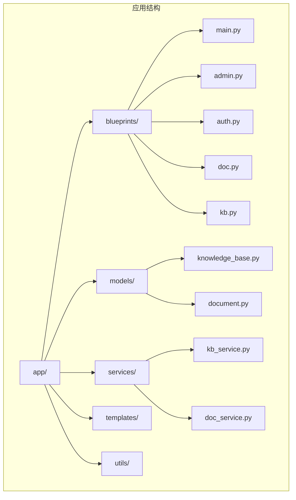
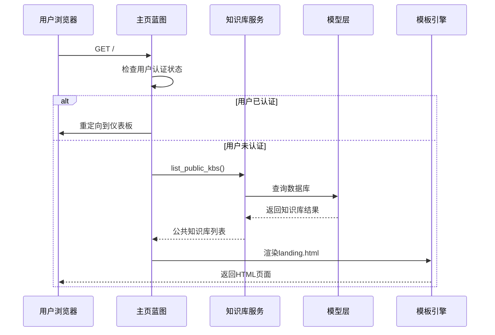
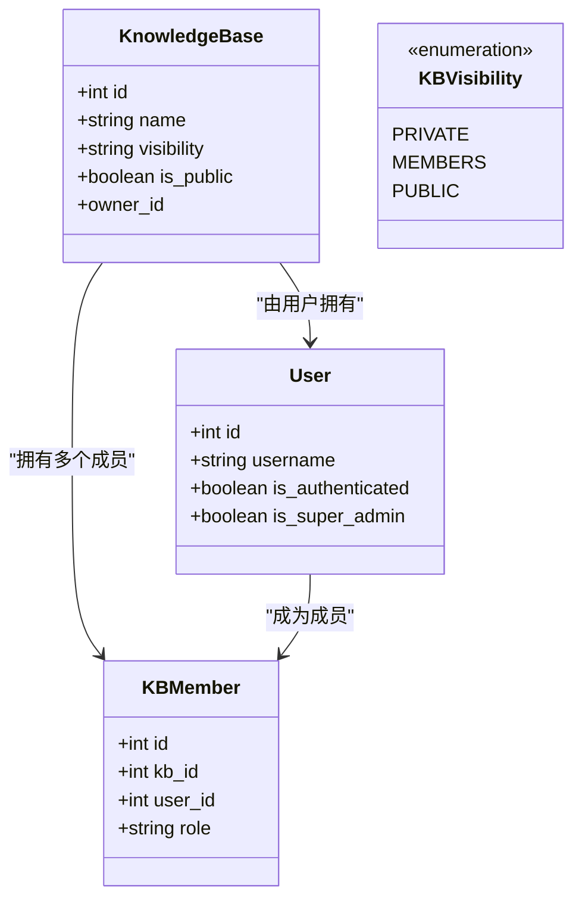
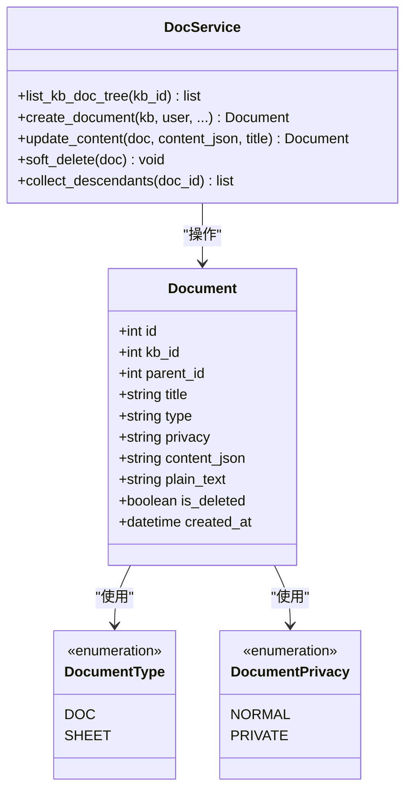
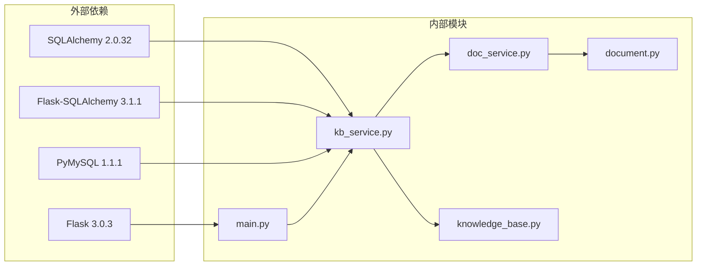
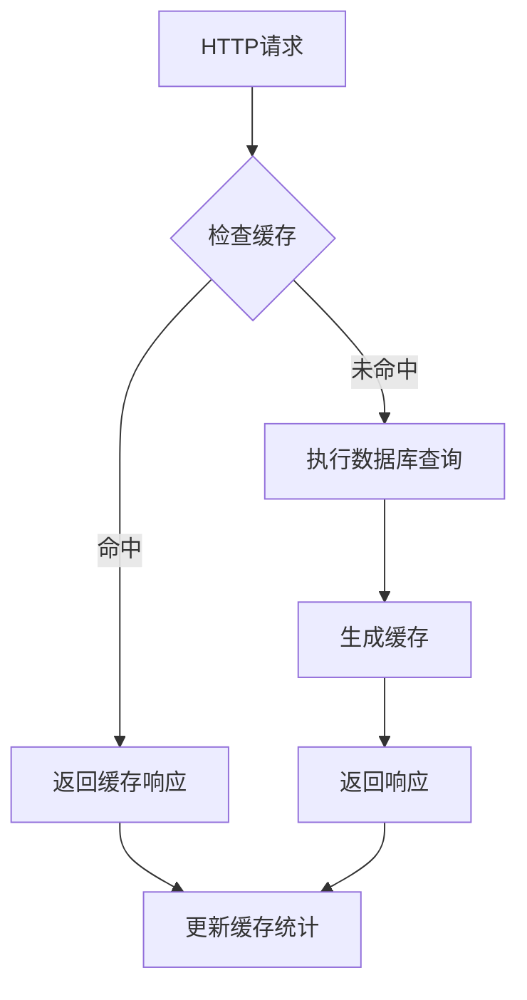
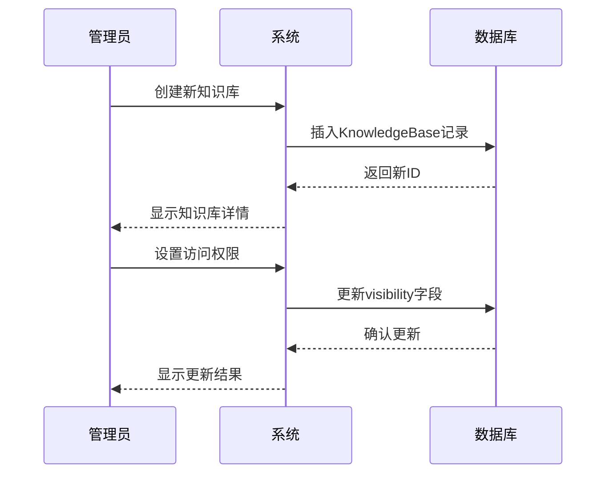

# 主页蓝图（Main Blueprint）功能文档

<cite>
**本文档中引用的文件**
- [main.py](file://app/blueprints/main.py)
- [kb_service.py](file://app/services/kb_service.py)
- [knowledge_base.py](file://app/models/knowledge_base.py)
- [document.py](file://app/models/document.py)
- [doc_service.py](file://app/services/doc_service.py)
- [config.py](file://app/config.py)
- [extensions.py](file://app/extensions.py)
- [base.html](file://app/templates/base.html)
- [run.py](file://run.py)
</cite>

## 目录
1. [简介](#简介)
2. [项目结构](#项目结构)
3. [核心组件](#核心组件)
4. [架构概览](#架构概览)
5. [详细组件分析](#详细组件分析)
6. [依赖关系分析](#依赖关系分析)
7. [性能考虑](#性能考虑)
8. [SEO优化策略](#seo优化策略)
9. [缓存策略](#缓存策略)
10. [主页API接口](#主页api接口)
11. [内容管理示例](#内容管理示例)
12. [故障排除指南](#故障排除指南)
13. [结论](#结论)

## 简介

主页蓝图是MyWiki项目的核心入口点，负责处理用户访问根路径时的路由逻辑。该蓝图实现了智能的用户重定向机制：已认证用户会被重定向到个人仪表板，而未认证用户则看到公共知识库的展示页面。系统通过服务层查询数据库中的公共知识库，限制显示数量并渲染相应的模板。

## 项目结构

MyWiki采用Flask框架的标准项目结构，主页蓝图位于`app/blueprints/main.py`中，与其它蓝图如`admin.py`、`auth.py`、`doc.py`等并列组织。



**图表来源**
- [main.py:1-16](file://app/blueprints/main.py#L1-L16)
- [config.py:1-83](file://app/config.py#L1-L83)

## 核心组件

### 主页蓝图路由处理器

主页蓝图的核心是`index()`函数，它实现了以下逻辑：
- 检查当前用户是否已认证
- 如果已认证，重定向到用户仪表板
- 如果未认证，查询并展示公共知识库列表

### 知识库服务层

`kb_service.py`提供了知识库访问控制和查询功能：
- `list_public_kbs()`: 查询所有公开的知识库
- `can_access()`: 判断用户对知识库的访问权限
- `can_edit()`: 判断用户对知识库的编辑权限

### 数据模型

系统使用SQLAlchemy ORM定义了知识库和文档的数据模型：
- `KnowledgeBase`: 知识库实体，包含可见性设置
- `Document`: 文档实体，支持树形结构和隐私设置

**章节来源**
- [main.py:10-15](file://app/blueprints/main.py#L10-L15)
- [kb_service.py:57-62](file://app/services/kb_service.py#L57-L62)
- [knowledge_base.py:19-42](file://app/models/knowledge_base.py#L19-L42)
- [document.py:20-53](file://app/models/document.py#L20-L53)

## 架构概览

主页蓝图采用分层架构设计，清晰分离了路由处理、业务逻辑和服务层：



**图表来源**
- [main.py:10-15](file://app/blueprints/main.py#L10-L15)
- [kb_service.py:57-62](file://app/services/kb_service.py#L57-L62)

## 详细组件分析

### 主页路由处理流程

主页蓝图的路由处理遵循以下流程：

```mermaid
flowchart TD
A[收到请求 GET /] --> B{检查用户认证}
B --> |已认证| C[重定向到用户仪表板]
B --> |未认证| D[查询公共知识库]
D --> E[限制显示数量(8个)]
E --> F[渲染landing模板]
F --> G[返回响应给客户端]
C --> H[结束]
G --> H[结束]
```

**图表来源**
- [main.py:10-15](file://app/blueprints/main.py#L10-L15)

### 知识库访问控制机制

系统实现了多层级的知识库访问控制：



**图表来源**
- [knowledge_base.py:8-42](file://app/models/knowledge_base.py#L8-L42)
- [knowledge_base.py:45-62](file://app/models/knowledge_base.py#L45-L62)

### 文档服务层

文档服务层提供了知识库文档树的构建和管理功能：



**图表来源**
- [document.py:20-53](file://app/models/document.py#L20-L53)
- [doc_service.py:11-81](file://app/services/doc_service.py#L11-L81)

**章节来源**
- [main.py:10-15](file://app/blueprints/main.py#L10-L15)
- [kb_service.py:10-23](file://app/services/kb_service.py#L10-L23)
- [doc_service.py:11-34](file://app/services/doc_service.py#L11-L34)

## 依赖关系分析

系统的关键依赖关系如下：



**图表来源**
- [requirements.txt:1-21](file://requirements.txt#L1-L21)
- [main.py:2-5](file://app/blueprints/main.py#L2-L5)

**章节来源**
- [extensions.py:8-16](file://app/extensions.py#L8-L16)
- [config.py:18-26](file://app/config.py#L18-L26)

## 性能考虑

### 数据库查询优化

系统在主页查询中使用了适当的索引和限制：
- 知识库表的可见性和归档状态建立了索引
- 查询结果限制为8个记录，减少数据库负载
- 使用`updated_at`字段进行排序，确保最新的知识库优先显示

### 缓存策略建议

虽然当前实现未包含缓存层，但可以考虑以下优化：
- 页面级缓存：对公共知识库列表进行短期缓存
- 数据库连接池：配置合适的连接池参数
- 静态资源缓存：利用浏览器缓存机制

### 性能监控

建议实施以下监控指标：
- 数据库查询响应时间
- 页面加载时间
- 并发用户数统计
- 错误率监控

## SEO优化策略

### 结构化数据

为了提升搜索引擎友好性，建议添加以下结构化数据：
- 网站名称和描述
- 关键字元数据
- 社交媒体卡片支持

### 内容优化

- 确保每个知识库都有清晰的描述
- 提供高质量的封面图片
- 实现友好的URL结构
- 添加站点地图和robots.txt

### 加载性能

- 压缩CSS和JavaScript文件
- 启用Gzip压缩
- 实现图片懒加载
- 优化第三方资源加载

## 缓存策略

### 应用层缓存



### 缓存配置建议

- 缓存失效时间：5-15分钟
- 缓存键策略：基于URL和查询参数
- 缓存存储：内存缓存或Redis
- 缓存预热：启动时预加载热门数据

## 主页API接口

### 当前可用接口

基于现有代码，主页蓝图提供以下接口：

| 接口 | 方法 | 描述 | 参数 |
|------|------|------|------|
| `/` | GET | 主页入口 | 无 |
| `/dashboard` | GET | 仪表板重定向 | 无 |

### 接口调用示例

```javascript
// 获取主页内容
fetch('/').then(response => response.text());

// 检查用户认证状态
fetch('/dashboard').then(response => {
    if (response.redirected) {
        // 用户未认证，需要登录
    }
});
```

**章节来源**
- [main.py:10-15](file://app/blueprints/main.py#L10-L15)

## 内容管理示例

### 知识库管理流程



### 文档管理示例

系统支持树形文档结构的创建和管理：
- 支持父子文档关系
- 支持多种文档类型（文档/表格）
- 支持隐私级别设置
- 自动提取纯文本用于搜索

**章节来源**
- [knowledge_base.py:28-33](file://app/models/knowledge_base.py#L28-L33)
- [document.py:24-46](file://app/models/document.py#L24-L46)
- [doc_service.py:37-53](file://app/services/doc_service.py#L37-L53)

## 故障排除指南

### 常见问题诊断

1. **主页无法加载**
   - 检查数据库连接配置
   - 验证知识库表是否存在
   - 确认模板文件路径正确

2. **用户重定向问题**
   - 检查Flask-Login配置
   - 验证用户会话状态
   - 确认重定向URL正确

3. **权限访问错误**
   - 检查用户认证状态
   - 验证知识库可见性设置
   - 确认成员关系记录

### 调试工具

- Flask调试模式启用
- 数据库查询日志
- 请求响应跟踪
- 错误堆栈跟踪

**章节来源**
- [extensions.py:14-16](file://app/extensions.py#L14-L16)
- [config.py:56-62](file://app/config.py#L56-L62)

## 结论

主页蓝图作为MyWiki项目的核心入口，实现了简洁高效的用户导向设计。通过合理的分层架构和清晰的职责分离，系统能够为用户提供流畅的体验。当前实现重点关注基础功能，为后续的功能扩展（如搜索、推荐算法等）奠定了良好的基础。

未来可以考虑的改进方向包括：实现更完善的搜索功能、添加个性化推荐算法、增强SEO优化、以及实施更全面的缓存策略。这些改进将在保持系统稳定性的同时，进一步提升用户体验和性能表现。