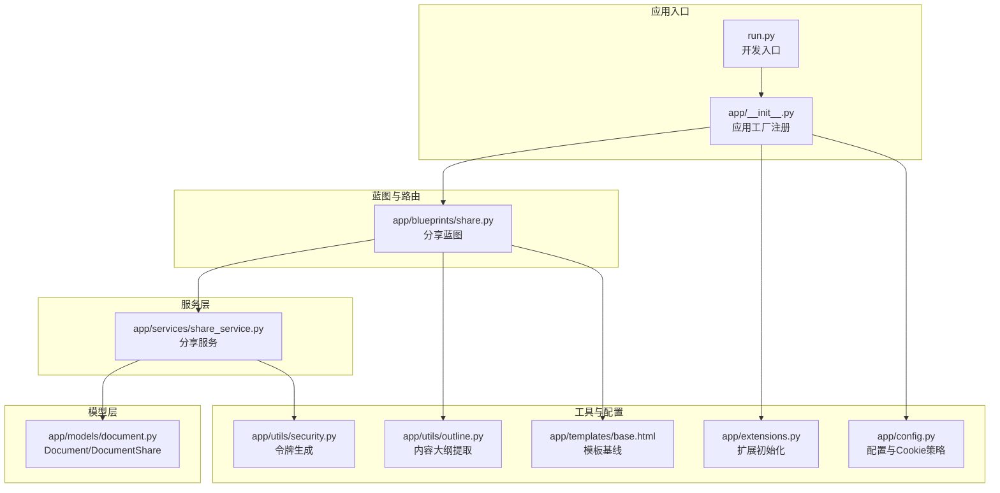
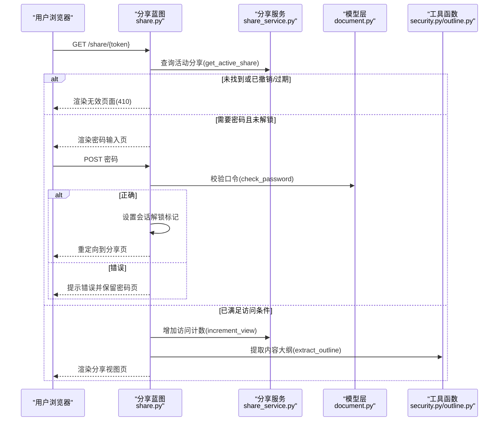
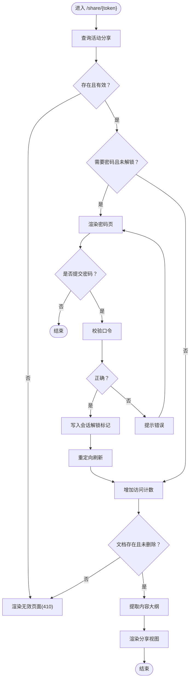
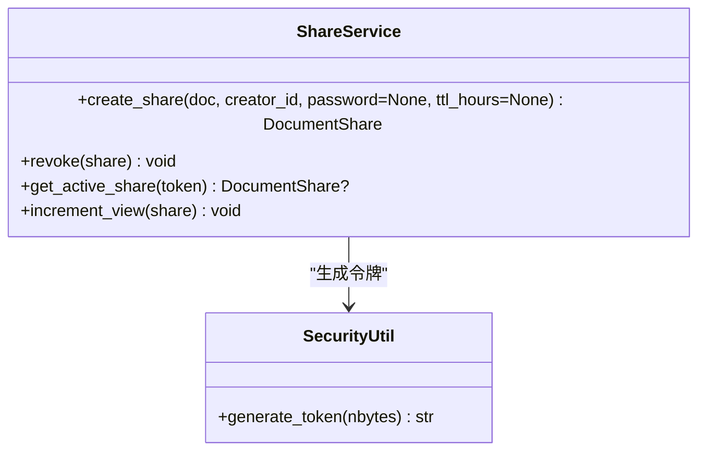
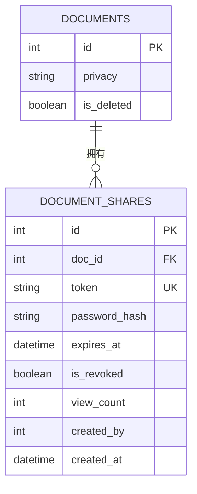
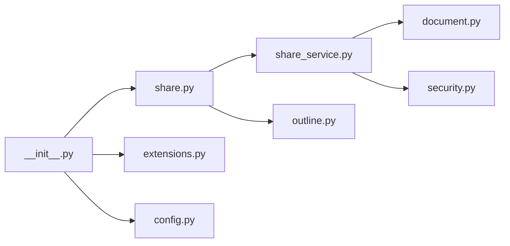

# 分享蓝图 (Share Blueprint)

<cite>
**本文引用的文件**
- [app/blueprints/share.py](file://app/blueprints/share.py)
- [app/services/share_service.py](file://app/services/share_service.py)
- [app/models/document.py](file://app/models/document.py)
- [app/utils/security.py](file://app/utils/security.py)
- [app/utils/outline.py](file://app/utils/outline.py)
- [app/extensions.py](file://app/extensions.py)
- [app/__init__.py](file://app/__init__.py)
- [app/config.py](file://app/config.py)
- [app/templates/base.html](file://app/templates/base.html)
- [run.py](file://run.py)
</cite>

## 目录
1. [简介](#简介)
2. [项目结构](#项目结构)
3. [核心组件](#核心组件)
4. [架构总览](#架构总览)
5. [详细组件分析](#详细组件分析)
6. [依赖分析](#依赖分析)
7. [性能考虑](#性能考虑)
8. [故障排查指南](#故障排查指南)
9. [结论](#结论)
10. [附录](#附录)

## 简介
本文件面向“分享蓝图”（Share Blueprint）功能，系统化阐述文档分享能力的设计与实现，覆盖以下主题：
- 分享链接生成：令牌生成、有效期与撤销机制
- 访问权限控制：密码保护、会话解锁、过期与撤销校验
- 分享统计：访问计数与有效性判定
- 分享页面渲染：模板继承、内容预览与目录提取
- 安全验证：CSRF、会话安全、口令哈希
- 使用示例与最佳实践：如何生成、访问、管理分享链接

## 项目结构
分享蓝图位于应用的蓝本模块中，并通过服务层与模型层协作完成分享生命周期管理；前端模板采用基础布局进行复用。

图表来源
- [app/__init__.py:56-74](file://app/__init__.py#L56-L74)
- [app/blueprints/share.py:1-42](file://app/blueprints/share.py#L1-L42)
- [app/services/share_service.py:1-49](file://app/services/share_service.py#L1-L49)
- [app/models/document.py:56-98](file://app/models/document.py#L56-L98)
- [app/utils/security.py:1-8](file://app/utils/security.py#L1-L8)
- [app/utils/outline.py:1-136](file://app/utils/outline.py#L1-L136)
- [app/extensions.py:1-17](file://app/extensions.py#L1-L17)
- [app/config.py:1-83](file://app/config.py#L1-L83)
- [app/templates/base.html:1-29](file://app/templates/base.html#L1-L29)
- [run.py:1-17](file://run.py#L1-L17)

章节来源
- [app/__init__.py:56-74](file://app/__init__.py#L56-L74)
- [app/blueprints/share.py:1-42](file://app/blueprints/share.py#L1-L42)
- [app/services/share_service.py:1-49](file://app/services/share_service.py#L1-L49)
- [app/models/document.py:56-98](file://app/models/document.py#L56-L98)
- [app/utils/security.py:1-8](file://app/utils/security.py#L1-L8)
- [app/utils/outline.py:1-136](file://app/utils/outline.py#L1-L136)
- [app/extensions.py:1-17](file://app/extensions.py#L1-L17)
- [app/config.py:1-83](file://app/config.py#L1-L83)
- [app/templates/base.html:1-29](file://app/templates/base.html#L1-L29)
- [run.py:1-17](file://run.py#L1-L17)

## 核心组件
- 蓝图路由与控制器：处理分享链接访问、密码校验、会话解锁与页面渲染
- 分享服务：负责分享记录的创建、查询、撤销与访问计数
- 模型层：文档与分享记录的数据结构、密码哈希、有效期与撤销状态
- 工具函数：安全令牌生成、内容大纲提取
- 配置与扩展：CSRF保护、会话Cookie策略、蓝图注册

章节来源
- [app/blueprints/share.py:22-41](file://app/blueprints/share.py#L22-L41)
- [app/services/share_service.py:15-48](file://app/services/share_service.py#L15-L48)
- [app/models/document.py:56-98](file://app/models/document.py#L56-L98)
- [app/utils/security.py:5-7](file://app/utils/security.py#L5-L7)
- [app/utils/outline.py:34-55](file://app/utils/outline.py#L34-L55)
- [app/extensions.py:8-11](file://app/extensions.py#L8-L11)
- [app/config.py:28-31](file://app/config.py#L28-L31)

## 架构总览
分享功能遵循“蓝图路由 → 服务层 → 模型层”的分层设计，配合工具函数与配置实现安全与可用性目标。

图表来源
- [app/blueprints/share.py:22-41](file://app/blueprints/share.py#L22-L41)
- [app/services/share_service.py:39-48](file://app/services/share_service.py#L39-L48)
- [app/models/document.py:73-94](file://app/models/document.py#L73-L94)
- [app/utils/outline.py:34-55](file://app/utils/outline.py#L34-L55)

## 详细组件分析

### 蓝图路由与控制器（分享页面）
- 路由定义：以分享令牌作为路径参数，支持GET/POST请求
- 访问控制：
  - 若分享不存在、已撤销或过期，返回无效页面并设置状态码
  - 若分享需要密码且当前会话未解锁，进入密码校验流程
  - 密码正确后写入会话解锁标记并重定向
- 内容渲染：
  - 增加访问计数
  - 校验文档存在且未删除
  - 提取内容大纲并渲染分享视图

图表来源
- [app/blueprints/share.py:22-41](file://app/blueprints/share.py#L22-L41)

章节来源
- [app/blueprints/share.py:22-41](file://app/blueprints/share.py#L22-L41)

### 分享服务（分享生命周期）
- 创建分享：校验文档隐私级别、生成唯一令牌、可选设置口令与有效期
- 撤销分享：标记为撤销，阻止后续访问
- 查询活动分享：按令牌查询并校验有效性（未撤销、未过期）
- 访问计数：原子性递增并持久化

图表来源
- [app/services/share_service.py:15-48](file://app/services/share_service.py#L15-L48)
- [app/utils/security.py:5-7](file://app/utils/security.py#L5-L7)

章节来源
- [app/services/share_service.py:15-48](file://app/services/share_service.py#L15-L48)
- [app/utils/security.py:5-7](file://app/utils/security.py#L5-L7)

### 模型层（数据结构与约束）
- 文档模型：文档隐私级别决定是否允许分享
- 分享模型：令牌唯一、可选口令哈希、有效期、撤销标志、访问计数、创建者与时间戳
- 密码校验：支持空口令（无需密码）与带口令场景
- 有效性判定：未撤销且未过期

图表来源
- [app/models/document.py:20-50](file://app/models/document.py#L20-L50)
- [app/models/document.py:56-98](file://app/models/document.py#L56-L98)

章节来源
- [app/models/document.py:20-50](file://app/models/document.py#L20-L50)
- [app/models/document.py:56-98](file://app/models/document.py#L56-L98)

### 工具函数（令牌与内容）
- 令牌生成：使用安全随机源生成URL安全令牌
- 大纲提取：从Editor.js JSON中抽取H1-H3标题，用于分享页侧边导航

章节来源
- [app/utils/security.py:5-7](file://app/utils/security.py#L5-L7)
- [app/utils/outline.py:34-55](file://app/utils/outline.py#L34-L55)

### 配置与扩展（安全与会话）
- CSRF保护：启用跨站请求伪造防护
- 会话Cookie策略：HttpOnly、SameSite=Lax，提升安全性
- 蓝图注册：将分享蓝图挂载至统一前缀，便于路由组织

章节来源
- [app/extensions.py:8-11](file://app/extensions.py#L8-L11)
- [app/config.py:28-31](file://app/config.py#L28-L31)
- [app/__init__.py:56-74](file://app/__init__.py#L56-L74)

## 依赖分析
- 蓝图依赖服务层进行业务逻辑处理
- 服务层依赖模型层进行数据持久化与校验
- 服务层依赖安全工具生成令牌
- 蓝图依赖内容工具提取大纲
- 应用工厂负责扩展与蓝图注册

图表来源
- [app/blueprints/share.py:1-42](file://app/blueprints/share.py#L1-L42)
- [app/services/share_service.py:1-49](file://app/services/share_service.py#L1-L49)
- [app/models/document.py:1-98](file://app/models/document.py#L1-L98)
- [app/utils/security.py:1-8](file://app/utils/security.py#L1-L8)
- [app/utils/outline.py:1-136](file://app/utils/outline.py#L1-L136)
- [app/__init__.py:39-74](file://app/__init__.py#L39-L74)
- [app/extensions.py:1-17](file://app/extensions.py#L1-L17)
- [app/config.py:1-83](file://app/config.py#L1-L83)

章节来源
- [app/blueprints/share.py:1-42](file://app/blueprints/share.py#L1-L42)
- [app/services/share_service.py:1-49](file://app/services/share_service.py#L1-L49)
- [app/models/document.py:1-98](file://app/models/document.py#L1-L98)
- [app/utils/security.py:1-8](file://app/utils/security.py#L1-L8)
- [app/utils/outline.py:1-136](file://app/utils/outline.py#L1-L136)
- [app/__init__.py:39-74](file://app/__init__.py#L39-L74)
- [app/extensions.py:1-17](file://app/extensions.py#L1-L17)
- [app/config.py:1-83](file://app/config.py#L1-L83)

## 性能考虑
- 查询优化：分享令牌字段建立索引，确保按令牌快速命中
- 计数更新：访问计数采用原子递增，减少并发冲突
- 内容处理：大纲提取仅遍历Editor.js块，复杂度与内容长度线性相关
- 缓存建议：可在网关或应用层对热点分享链接做短期缓存（需结合业务需求）

## 故障排查指南
- 分享链接返回无效页面
  - 检查分享是否已被撤销或过期
  - 确认文档未被删除
- 密码错误反复出现
  - 确认提交的口令与分享设置一致
  - 检查会话是否正确写入解锁标记
- 无法访问分享页
  - 确认CSRF保护开启且表单携带有效令牌
  - 检查会话Cookie策略（HttpOnly、SameSite）是否影响跨域场景
- 开发环境启动
  - 使用开发入口脚本加载环境变量并启动应用

章节来源
- [app/blueprints/share.py:25-34](file://app/blueprints/share.py#L25-L34)
- [app/services/share_service.py:39-43](file://app/services/share_service.py#L39-L43)
- [app/models/document.py:73-94](file://app/models/document.py#L73-L94)
- [app/extensions.py:8-11](file://app/extensions.py#L8-L11)
- [app/config.py:28-31](file://app/config.py#L28-L31)
- [run.py:1-17](file://run.py#L1-L17)

## 结论
分享蓝图通过清晰的分层设计与安全配置，实现了从“生成—访问—统计—撤销”的完整闭环。其核心优势在于：
- 令牌唯一且URL安全，便于传播与追踪
- 支持密码保护与有效期控制，兼顾易用与安全
- 会话解锁避免重复输入，提升用户体验
- 统一的模板基线与内容大纲提取，保证展示一致性

## 附录

### 使用示例与最佳实践
- 生成分享链接
  - 在文档详情页发起分享请求，可选择设置口令与有效期
  - 生成成功后复制分享链接进行分发
- 访问分享链接
  - 首次访问可能需要输入口令；通过后自动解锁
  - 分享页显示文档内容与目录，便于快速浏览
- 管理分享
  - 可随时撤销分享，使旧链接失效
  - 建议定期清理长期有效但无人访问的分享
- 安全建议
  - 对敏感文档建议设置口令与较短有效期
  - 生产环境务必启用CSRF保护与安全Cookie策略
  - 避免在公开渠道暴露分享链接，必要时配合水印或访问日志

### API与集成参考
- 路由前缀：/share
- 入口蓝图：share
- 关键服务方法
  - 创建分享：create_share(doc, creator_id, password=None, ttl_hours=None)
  - 查询活动分享：get_active_share(token)
  - 撤销分享：revoke(share)
  - 增加访问计数：increment_view(share)
- 模板与布局
  - 分享视图模板：share/view.html
  - 密码输入模板：share/password.html
  - 无效页面模板：share/invalid.html
  - 基础布局：base.html

章节来源
- [app/__init__.py:56-74](file://app/__init__.py#L56-L74)
- [app/blueprints/share.py:22-41](file://app/blueprints/share.py#L22-L41)
- [app/services/share_service.py:15-48](file://app/services/share_service.py#L15-L48)
- [app/templates/base.html:1-29](file://app/templates/base.html#L1-L29)