# 文档蓝图 (Document Blueprint) 技术文档

<cite>
**本文档引用的文件**
- [README.md](file://README.md)
- [app/blueprints/doc.py](file://app/blueprints/doc.py)
- [app/models/document.py](file://app/models/document.py)
- [app/services/doc_service.py](file://app/services/doc_service.py)
- [app/utils/outline.py](file://app/utils/outline.py)
- [app/utils/markdown.py](file://app/utils/markdown.py)
- [app/services/share_service.py](file://app/services/share_service.py)
- [app/models/knowledge_base.py](file://app/models/knowledge_base.py)
- [app/utils/security.py](file://app/utils/security.py)
- [app/__init__.py](file://app/__init__.py)
- [run.py](file://run.py)
- [requirements.txt](file://requirements.txt)
- [app/config.py](file://app/config.py)
- [app/templates/doc/edit.html](file://app/templates/doc/edit.html)
- [app/templates/doc/view.html](file://app/templates/doc/view.html)
- [scripts/fetch_vendors.py](file://scripts/fetch_vendors.py)
</cite>

## 更新摘要
**所做更改**
- 更新了编辑器实现部分，反映从Editor.js到Toast UI Editor的完全替换
- 更新了内容存储格式，从Editor.js JSON迁移到Markdown格式
- 新增了JavaScript初始化代码和错误处理机制的详细说明
- 更新了文档树结构管理和内容处理流程
- 增强了前端编辑器集成和后端内容存储的说明

## 目录
1. [简介](#简介)
2. [项目结构](#项目结构)
3. [核心组件](#核心组件)
4. [架构概览](#架构概览)
5. [详细组件分析](#详细组件分析)
6. [依赖关系分析](#依赖关系分析)
7. [性能考虑](#性能考虑)
8. [故障排除指南](#故障排除指南)
9. [结论](#结论)

## 简介

文档蓝图是一个基于 Flask 的个人知识库系统，专注于提供高效的文档管理和协作功能。该系统采用现代化的前端编辑器技术，支持富文本编辑、Markdown 渲染和智能文档树结构管理。

### 主要特性

- **富文本编辑器集成**：使用 Toast UI Editor 提供直观的可视化编辑体验
- **多格式内容管理**：支持文档和电子表格两种内容类型
- **智能文档树结构**：基于父子关系的层次化文档组织
- **内容安全过滤**：内置 HTML 和 Markdown 内容安全机制
- **版本控制与发布**：完整的文档生命周期管理
- **分享与权限控制**：细粒度的访问权限和分享管理

## 项目结构

该项目采用典型的 Flask 应用架构，按照功能模块进行组织：

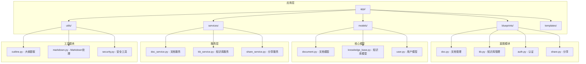

**图表来源**
- [app/__init__.py:11-28](file://app/__init__.py#L11-L28)
- [app/blueprints/doc.py:1-10](file://app/blueprints/doc.py#L1-L10)

**章节来源**
- [app/__init__.py:56-74](file://app/__init__.py#L56-L74)
- [requirements.txt:1-22](file://requirements.txt#L1-L22)

## 核心组件

### 数据模型架构

系统的核心数据模型围绕文档和知识库展开，采用关系型数据库设计：

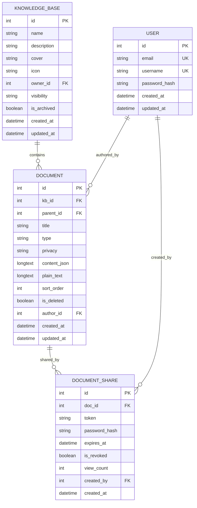

**图表来源**
- [app/models/document.py:20-50](file://app/models/document.py#L20-L50)
- [app/models/knowledge_base.py:19-42](file://app/models/knowledge_base.py#L19-L42)

### 编辑器内容处理

**更新** 系统现已采用 Toast UI Editor 替代原有的 Editor.js，内容存储格式从 Editor.js JSON 迁移到 Markdown 格式：

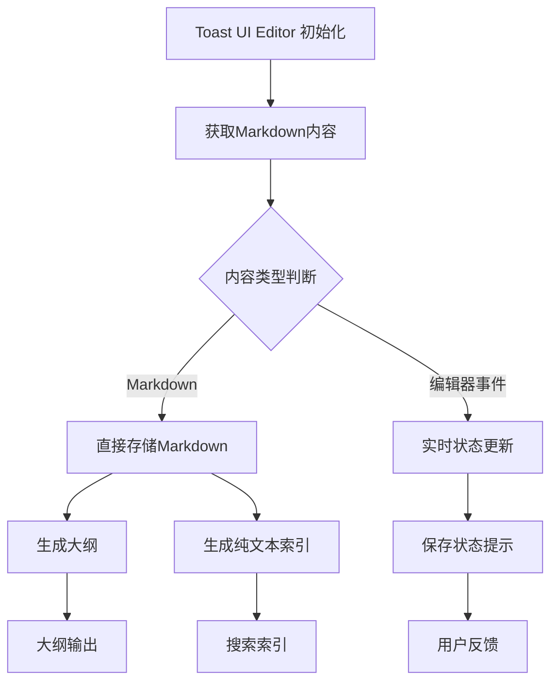

**图表来源**
- [app/templates/doc/edit.html:75-96](file://app/templates/doc/edit.html#L75-L96)
- [app/templates/doc/view.html:86-92](file://app/templates/doc/view.html#L86-L92)

**章节来源**
- [app/models/document.py:10-18](file://app/models/document.py#L10-L18)
- [app/utils/outline.py:1-143](file://app/utils/outline.py#L1-L143)

## 架构概览

### 整体系统架构

**更新** 系统架构已完全适配新的编辑器实现：

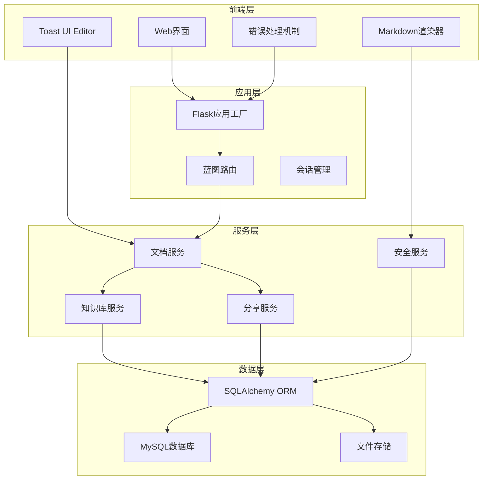

**图表来源**
- [app/__init__.py:11-28](file://app/__init__.py#L11-L28)
- [app/blueprints/doc.py:1-10](file://app/blueprints/doc.py#L1-L10)

### 请求处理流程

**更新** 请求处理流程已适配新的编辑器实现：

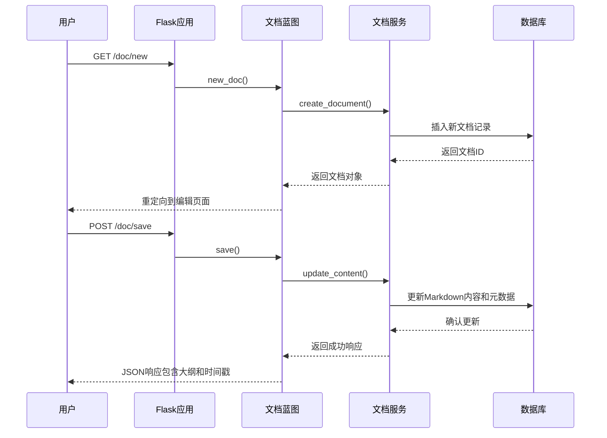

**图表来源**
- [app/blueprints/doc.py:20-40](file://app/blueprints/doc.py#L20-L40)
- [app/blueprints/doc.py:69-84](file://app/blueprints/doc.py#L69-L84)

**章节来源**
- [app/__init__.py:39-54](file://app/__init__.py#L39-L54)
- [app/blueprints/doc.py:13-17](file://app/blueprints/doc.py#L13-L17)

## 详细组件分析

### 文档编辑器组件

#### Toast UI Editor 实现

**更新** 系统现已完全采用 Toast UI Editor 作为富文本编辑器：

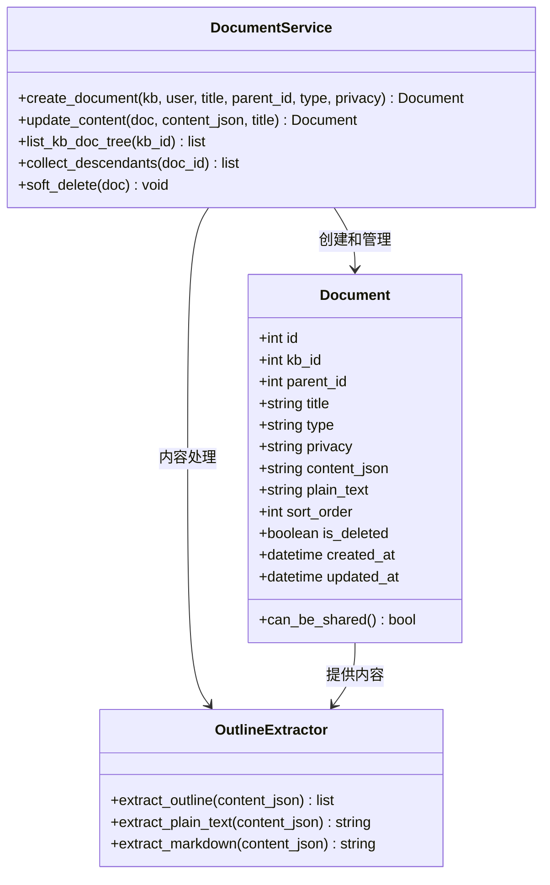

**图表来源**
- [app/models/document.py:20-50](file://app/models/document.py#L20-L50)
- [app/services/doc_service.py:37-53](file://app/services/doc_service.py#L37-L53)
- [app/utils/outline.py:22-55](file://app/utils/outline.py#L22-L55)

#### Markdown渲染引擎

系统集成了强大的 Markdown 渲染功能，支持扩展语法和安全过滤：

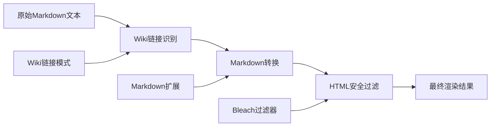

**图表来源**
- [app/utils/markdown.py:28-66](file://app/utils/markdown.py#L28-L66)

**章节来源**
- [app/utils/outline.py:34-55](file://app/utils/outline.py#L34-L55)
- [app/utils/markdown.py:31-39](file://app/utils/markdown.py#L31-L39)

### 文档树结构管理

#### 层次化文档组织

系统支持多层级的文档组织结构，通过父子关系建立灵活的文档树：

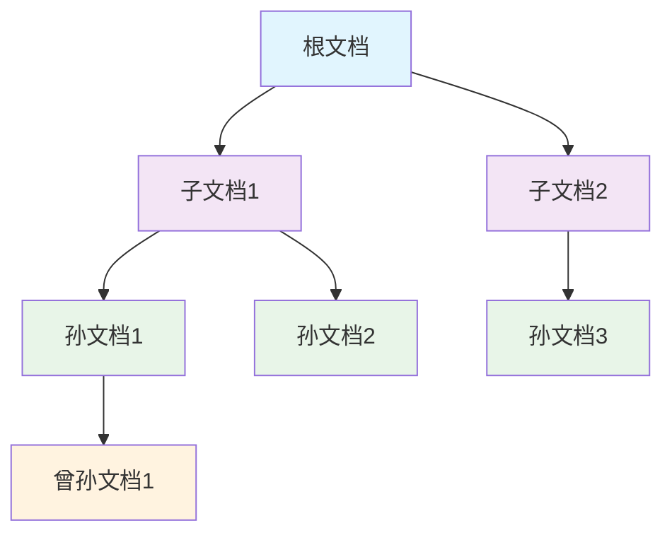

**图表来源**
- [app/services/doc_service.py:11-34](file://app/services/doc_service.py#L11-L34)

#### 文档树构建算法

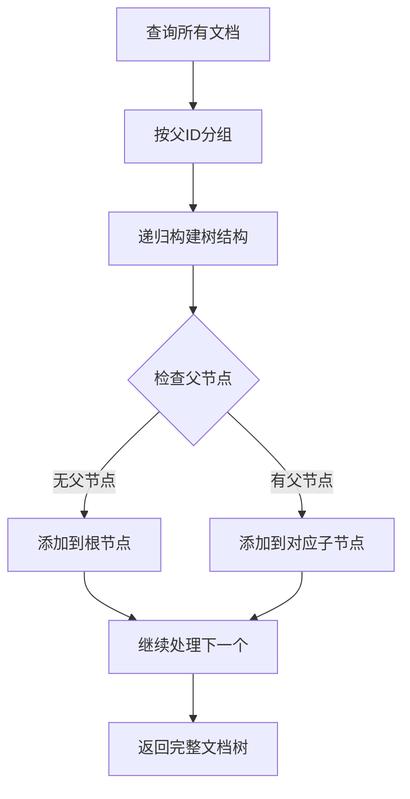

**图表来源**
- [app/services/doc_service.py:11-34](file://app/services/doc_service.py#L11-L34)

**章节来源**
- [app/services/doc_service.py:11-34](file://app/services/doc_service.py#L11-L34)

### 版本控制与发布流程

#### 文档生命周期管理

系统实现了完整的文档生命周期管理，从创建到删除的每个阶段都有相应的控制逻辑：

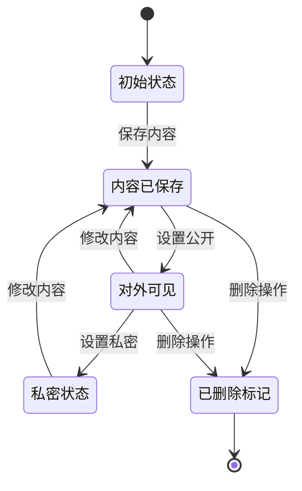

#### 批量删除机制

系统支持级联删除功能，确保删除操作不会留下孤立数据：

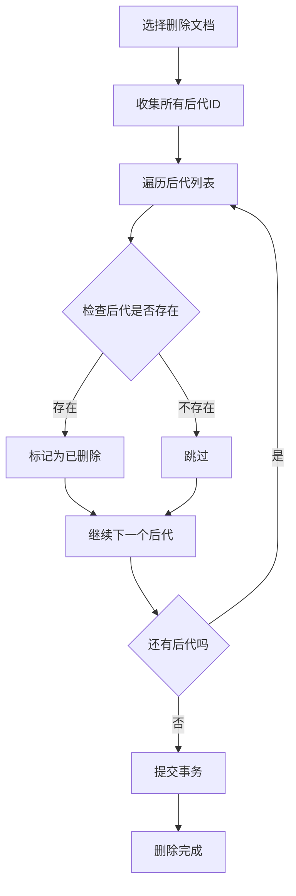

**图表来源**
- [app/blueprints/doc.py:94-100](file://app/blueprints/doc.py#L94-L100)
- [app/services/doc_service.py:70-80](file://app/services/doc_service.py#L70-L80)

**章节来源**
- [app/blueprints/doc.py:87-100](file://app/blueprints/doc.py#L87-L100)
- [app/services/doc_service.py:65-67](file://app/services/doc_service.py#L65-L67)

### 文件上传处理

#### 上传配置与限制

系统提供了灵活的文件上传配置，支持自定义上传目录和大小限制：

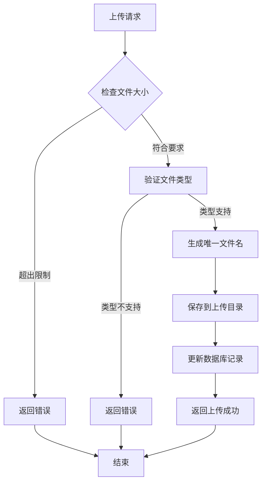

**图表来源**
- [app/config.py:33-35](file://app/config.py#L33-L35)

#### 安全存储策略

系统采用安全的文件命名策略，防止路径遍历攻击和文件覆盖问题。

**章节来源**
- [app/config.py:33-42](file://app/config.py#L33-L42)

### 内容安全过滤

#### HTML安全机制

系统集成了多层次的安全过滤机制，确保用户输入的内容不会带来安全风险：

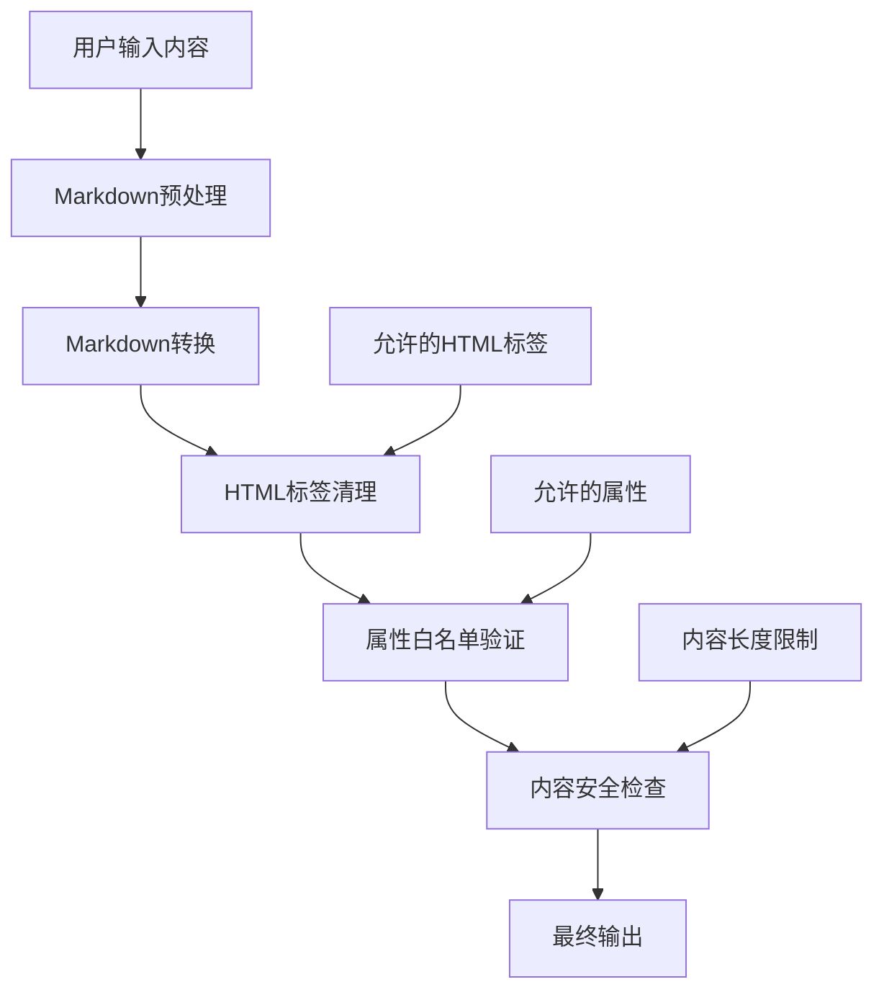

**图表来源**
- [app/utils/markdown.py:10-25](file://app/utils/markdown.py#L10-L25)
- [app/utils/markdown.py:31-39](file://app/utils/markdown.py#L31-L39)

**章节来源**
- [app/utils/markdown.py:10-40](file://app/utils/markdown.py#L10-L40)

## 依赖关系分析

### 外部依赖管理

项目采用明确的依赖管理策略，确保开发环境的一致性和可维护性：

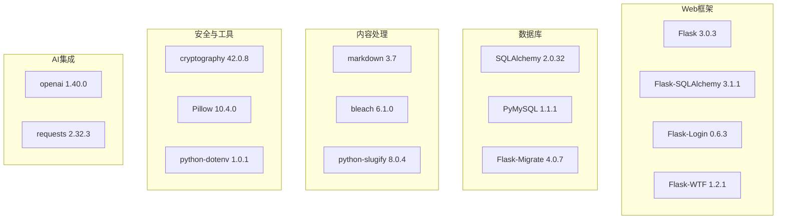

**图表来源**
- [requirements.txt:1-22](file://requirements.txt#L1-L22)

### 内部模块依赖

**更新** 内部模块依赖已适配新的编辑器实现：

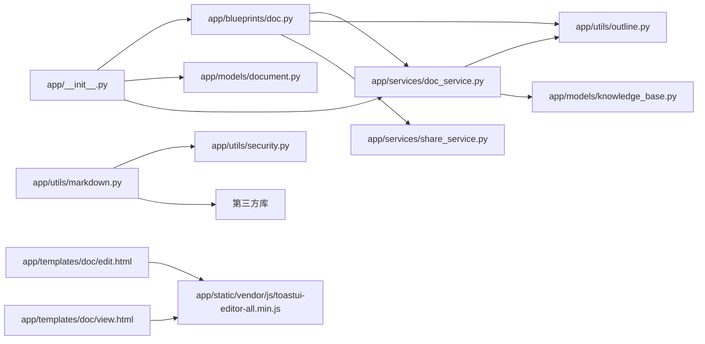

**图表来源**
- [app/__init__.py:56-74](file://app/__init__.py#L56-L74)
- [app/blueprints/doc.py:1-8](file://app/blueprints/doc.py#L1-L8)

**章节来源**
- [requirements.txt:1-22](file://requirements.txt#L1-L22)
- [app/__init__.py:56-74](file://app/__init__.py#L56-L74)

## 性能考虑

### 数据库优化策略

系统采用了多项数据库优化策略来提升性能：

- **索引优化**：在常用查询字段上建立索引，如 `kb_id`、`parent_id`、`is_deleted`
- **查询优化**：使用 `order_by` 和 `filter_by` 组合优化查询性能
- **连接池配置**：启用 `pool_pre_ping` 和合理的 `pool_recycle` 参数
- **批量操作**：使用 `commit()` 减少数据库往返次数

### 缓存策略

虽然当前实现没有显式的缓存层，但系统设计时考虑了缓存的可能性：

- **内容预处理**：将 Markdown 转换为纯文本用于搜索
- **大纲提取**：预先计算文档大纲以减少重复计算
- **模板渲染**：使用 Flask 的模板缓存机制

### 并发处理

系统通过以下机制处理并发访问：

- **会话管理**：使用 Flask-Login 管理会话状态
- **CSRF保护**：启用 Flask-WTF 的 CSRF 防护
- **数据库事务**：使用 SQLAlchemy 的事务管理

## 故障排除指南

### 常见问题诊断

#### 文档无法保存

**症状**：用户尝试保存文档时收到错误

**可能原因**：
1. 权限不足（非文档编辑者）
2. 内容格式不正确
3. 数据库连接问题
4. **编辑器初始化失败**

**解决步骤**：
1. 检查用户权限：确认用户是否具有编辑权限
2. 验证内容格式：确保 Markdown 格式正确
3. 检查数据库状态：确认数据库连接正常
4. **检查编辑器加载**：确认 toastui-editor-all.min.js 正常加载

#### 文档树显示异常

**症状**：文档树结构显示不正确或出现循环引用

**可能原因**：
1. 父子关系设置错误
2. 数据库约束冲突
3. 查询逻辑问题

**解决步骤**：
1. 检查文档的 `parent_id` 字段
2. 验证数据库外键约束
3. 重新构建文档树缓存

#### 分享链接失效

**症状**：分享链接无法访问或显示过期

**可能原因**：
1. 分享令牌过期
2. 密码验证失败
3. 文档状态变更

**解决步骤**：
1. 检查分享记录的 `expires_at` 字段
2. 验证密码输入
3. 确认文档仍处于可分享状态

#### **编辑器加载失败**

**新增** **症状**：编辑器无法正常加载或显示空白

**可能原因**：
1. **Toast UI Editor 资源加载失败**
2. **JavaScript初始化错误**
3. **浏览器兼容性问题**

**解决步骤**：
1. **检查网络面板**：确认 toastui-editor-all.min.js 返回 200 OK
2. **验证初始化代码**：检查编辑器初始化参数
3. **测试浏览器兼容性**：确认支持现代浏览器
4. **查看控制台错误**：定位具体的JavaScript错误

**章节来源**
- [app/blueprints/doc.py:13-17](file://app/blueprints/doc.py#L13-L17)
- [app/services/share_service.py:39-43](file://app/services/share_service.py#L39-L43)

### 错误处理机制

**更新** 系统实现了完善的错误处理机制，包括新的编辑器错误处理：

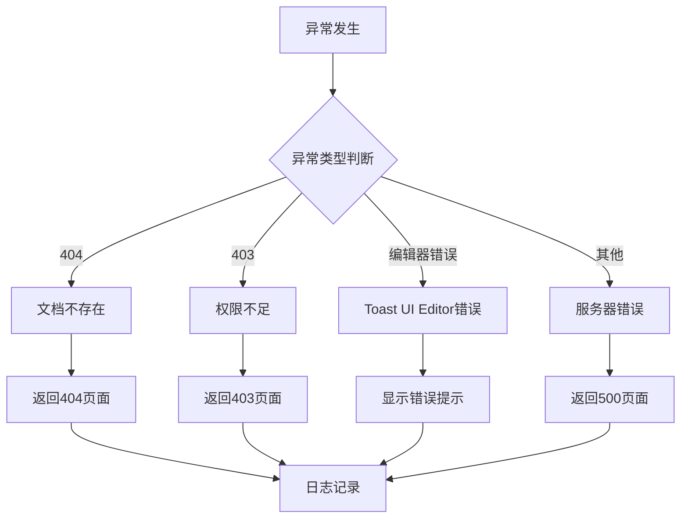

**图表来源**
- [app/__init__.py:76-87](file://app/__init__.py#L76-L87)
- [app/templates/doc/edit.html:54-68](file://app/templates/doc/edit.html#L54-L68)

## 结论

文档蓝图系统提供了一个功能完整、架构清晰的知识库解决方案。通过采用现代化的技术栈和最佳实践，系统在易用性、安全性、性能和可扩展性方面都表现出色。

### 主要优势

1. **模块化设计**：清晰的分层架构便于维护和扩展
2. **安全可靠**：多重安全机制保护用户数据
3. **性能优化**：合理的数据库设计和查询优化
4. **用户体验**：直观的编辑器和流畅的操作体验
5. **现代化技术栈**：采用 Toast UI Editor 提供更好的编辑体验

### 发展建议

1. **缓存层增强**：考虑添加 Redis 缓存提升性能
2. **搜索功能**：集成全文搜索引擎提升检索效率
3. **版本历史**：实现更精细的版本控制和比较功能
4. **移动端适配**：优化移动端用户体验
5. **编辑器功能扩展**：利用 Toast UI Editor 的更多特性

该系统为个人和团队知识管理提供了坚实的技术基础，适合进一步的功能扩展和定制开发。