# 文档蓝图 (Document Blueprint) 技术文档

<cite>
**本文档引用的文件**
- [README.md](file://README.md)
- [app/blueprints/doc.py](file://app/blueprints/doc.py)
- [app/models/document.py](file://app/models/document.py)
- [app/services/doc_service.py](file://app/services/doc_service.py)
- [app/utils/outline.py](file://app/utils/outline.py)
- [app/utils/markdown.py](file://app/utils/markdown.py)
- [app/services/share_service.py](file://app/services/share_service.py)
- [app/models/knowledge_base.py](file://app/models/knowledge_base.py)
- [app/utils/security.py](file://app/utils/security.py)
- [app/__init__.py](file://app/__init__.py)
- [run.py](file://run.py)
- [requirements.txt](file://requirements.txt)
- [app/config.py](file://app/config.py)
- [app/templates/doc/edit.html](file://app/templates/doc/edit.html)
- [app/templates/doc/view.html](file://app/templates/doc/view.html)
- [app/templates/kb/detail.html](file://app/templates/kb/detail.html)
- [scripts/fetch_vendors.py](file://scripts/fetch_vendors.py)
- [scripts/init_db.py](file://scripts/init_db.py)
- [scripts/reset_db.py](file://scripts/reset_db.py)
- [app/cli.py](file://app/cli.py)
- [app/extensions.py](file://app/extensions.py)
- [app/utils/ids.py](file://app/utils/ids.py)
- [app/utils/pagination.py](file://app/utils/pagination.py)
- [app/utils/decorators.py](file://app/utils/decorators.py)
- [app/utils/captcha_service.py](file://app/utils/captcha_service.py)
- [app/utils/outline.py](file://app/utils/outline.py)
- [app/utils/markdown.py](file://app/utils/markdown.py)
- [app/utils/security.py](file://app/utils/security.py)
- [app/blueprints/admin.py](file://app/blueprints/admin.py)
- [app/blueprints/ai.py](file://app/blueprints/ai.py)
- [app/blueprints/auth.py](file://app/blueprints/auth.py)
- [app/blueprints/kb.py](file://app/blueprints/kb.py)
- [app/blueprints/main.py](file://app/blueprints/main.py)
- [app/blueprints/share.py](file://app/blueprints/share.py)
- [app/blueprints/user.py](file://app/blueprints/user.py)
- [app/models/user.py](file://app/models/user.py)
- [app/models/ai_kb.py](file://app/models/ai_kb.py)
- [app/models/knowledge_base.py](file://app/models/knowledge_base.py)
- [app/services/auth_service.py](file://app/services/auth_service.py)
- [app/services/ai_service.py](file://app/services/ai_service.py)
- [app/services/captcha_service.py](file://app/services/captcha_service.py)
- [app/services/kb_service.py](file://app/services/kb_service.py)
- [app/services/share_service.py](file://app/services/share_service.py)
- [app/templates/admin/admins.html](file://app/templates/admin/admins.html)
- [app/templates/admin/index.html](file://app/templates/admin/index.html)
- [app/templates/admin/public_docs.html](file://app/templates/admin/public_docs.html)
- [app/templates/admin/public_kbs.html](file://app/templates/admin/public_kbs.html)
- [app/templates/admin/roles.html](file://app/templates/admin/roles.html)
- [app/templates/admin/users.html](file://app/templates/admin/users.html)
- [app/templates/ai/chat.html](file://app/templates/ai/chat.html)
- [app/templates/ai/detail.html](file://app/templates/ai/detail.html)
- [app/templates/ai/graph.html](file://app/templates/ai/graph.html)
- [app/templates/ai/index.html](file://app/templates/ai/index.html)
- [app/templates/ai/new.html](file://app/templates/ai/new.html)
- [app/templates/ai/sources.html](file://app/templates/ai/sources.html)
- [app/templates/ai/wiki_article.html](file://app/templates/ai/wiki_article.html)
- [app/templates/ai/wiki_home.html](file://app/templates/ai/wiki_home.html)
- [app/templates/auth/login.html](file://app/templates/auth/login.html)
- [app/templates/auth/register.html](file://app/templates/auth/register.html)
- [app/templates/components/footer.html](file://app/templates/components/footer.html)
- [app/templates/components/navbar.html](file://app/templates/components/navbar.html)
- [app/templates/errors/403.html](file://app/templates/errors/403.html)
- [app/templates/errors/404.html](file://app/templates/errors/404.html)
- [app/templates/errors/500.html](file://app/templates/errors/500.html)
- [app/templates/kb/detail.html](file://app/templates/kb/detail.html)
- [app/templates/kb/edit.html](file://app/templates/kb/edit.html)
- [app/templates/kb/list.html](file://app/templates/kb/list.html)
- [app/templates/kb/members.html](file://app/templates/kb/members.html)
- [app/templates/kb/new.html](file://app/templates/kb/new.html)
- [app/templates/kb/unlock.html](file://app/templates/kb/unlock.html)
- [app/templates/main/landing.html](file://app/templates/main/landing.html)
- [app/templates/share/invalid.html](file://app/templates/share/invalid.html)
- [app/templates/share/password.html](file://app/templates/share/password.html)
- [app/templates/share/view.html](file://app/templates/share/view.html)
- [app/templates/user/dashboard.html](file://app/templates/user/dashboard.html)
- [app/templates/user/profile.html](file://app/templates/user/profile.html)
- [app/templates/base.html](file://app/templates/base.html)
- [app/static/css/app.css](file://app/static/css/app.css)
- [app/static/js/app.js](file://app/static/js/app.js)
</cite>

## 更新摘要
**所做更改**
- 新增了完整的拖拽排序功能：在文档树中实现文档级别和分组级别的拖拽排序系统
- 更新了文档树结构管理，支持实时拖拽排序和跨组文档移动
- 新增了分组拖拽排序功能，支持分组的重新排列
- 增强了前端交互体验，提供实时视觉反馈和自动保存机制
- 更新了知识库详情页面的拖拽排序实现
- 新增了拖拽排序的后端API处理逻辑

## 目录
1. [简介](#简介)
2. [项目结构](#项目结构)
3. [核心组件](#核心组件)
4. [架构概览](#架构概览)
5. [详细组件分析](#详细组件分析)
6. [依赖关系分析](#依赖关系分析)
7. [性能考虑](#性能考虑)
8. [故障排除指南](#故障排除指南)
9. [结论](#结论)

## 简介

文档蓝图是一个基于 Flask 的个人知识库系统，专注于提供高效的文档管理和协作功能。该系统采用现代化的前端编辑器技术，支持富文本编辑、Markdown 渲染、智能文档树结构管理和完整的文档分组功能。

### 主要特性

- **富文本编辑器集成**：使用 Toast UI Editor 提供直观的可视化编辑体验
- **多格式内容管理**：支持文档和电子表格两种内容类型
- **智能文档树结构**：基于父子关系的层次化文档组织
- **文档分组管理**：支持知识库内的文档分组和拖拽管理
- **拖拽排序系统**：完整的文档级别和分组级别拖拽排序功能
- **跨组文档移动**：支持将文档从一个分组移动到另一个分组
- **实时视觉反馈**：拖拽过程中的高亮显示和占位符效果
- **内容安全过滤**：内置 HTML 和 Markdown 内容安全机制
- **版本控制与发布**：完整的文档生命周期管理
- **分享与权限控制**：细粒度的访问权限和分享管理
- **图片上传集成**：支持编辑器内图片上传和存储
- **中文本地化支持**：完整的中文界面和编辑器本地化

## 项目结构

该项目采用典型的 Flask 应用架构，按照功能模块进行组织：

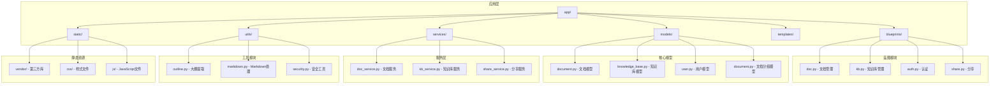

**图表来源**
- [app/__init__.py:11-28](file://app/__init__.py#L11-L28)
- [app/blueprints/doc.py:1-10](file://app/blueprints/doc.py#L1-L10)

**章节来源**
- [app/__init__.py:56-74](file://app/__init__.py#L56-L74)
- [requirements.txt:1-22](file://requirements.txt#L1-L22)

## 核心组件

### 数据模型架构

系统的核心数据模型围绕文档和知识库展开，采用关系型数据库设计：

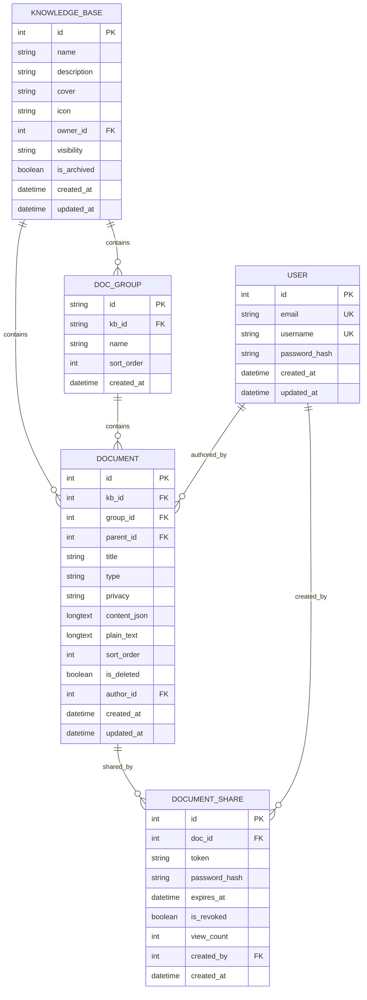

**图表来源**
- [app/models/document.py:20-50](file://app/models/document.py#L20-L50)
- [app/models/knowledge_base.py:19-42](file://app/models/knowledge_base.py#L19-L42)

### 编辑器内容处理

**更新** 系统现已采用 Toast UI Editor 替代原有的 Editor.js，内容存储格式从 Editor.js JSON 迁移到 Markdown 格式：

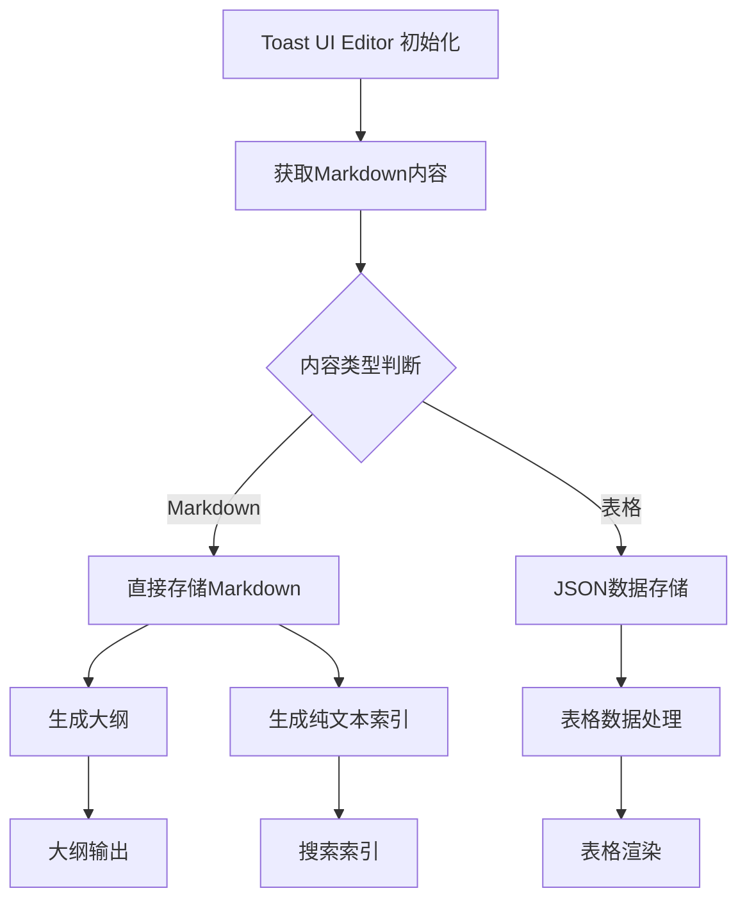

**图表来源**
- [app/templates/doc/edit.html:75-96](file://app/templates/doc/edit.html#L75-L96)
- [app/templates/doc/view.html:86-92](file://app/templates/doc/view.html#L86-L92)

**章节来源**
- [app/models/document.py:10-18](file://app/models/document.py#L10-L18)
- [app/utils/outline.py:1-143](file://app/utils/outline.py#L1-L143)

## 架构概览

### 整体系统架构

**更新** 系统架构已完全适配新的编辑器实现和拖拽排序功能：

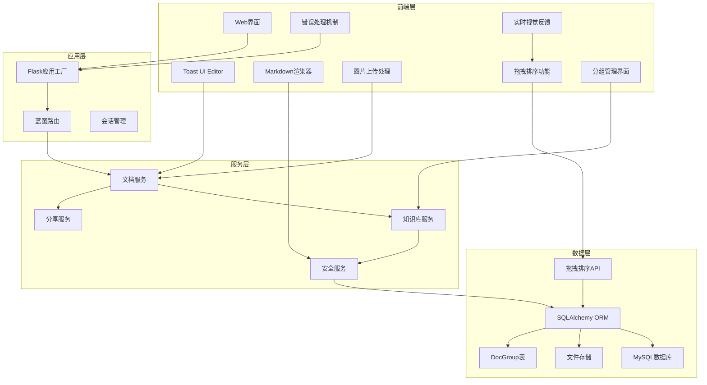

**图表来源**
- [app/__init__.py:11-28](file://app/__init__.py#L11-L28)
- [app/blueprints/doc.py:1-10](file://app/blueprints/doc.py#L1-L10)

### 请求处理流程

**更新** 请求处理流程已适配新的编辑器实现和拖拽排序功能：

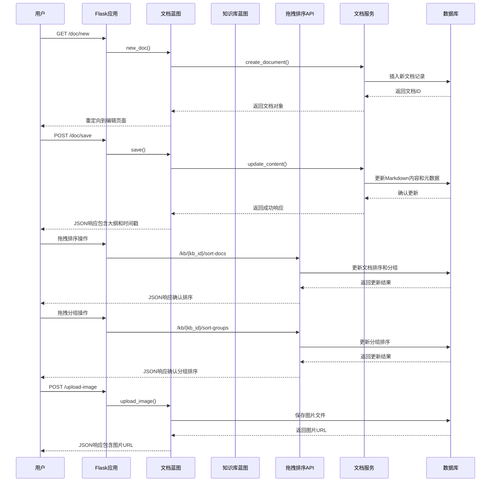

**图表来源**
- [app/blueprints/doc.py:20-40](file://app/blueprints/doc.py#L20-L40)
- [app/blueprints/doc.py:69-84](file://app/blueprints/doc.py#L69-L84)
- [app/blueprints/kb.py:220-241](file://app/blueprints/kb.py#L220-L241)

**章节来源**
- [app/__init__.py:39-54](file://app/__init__.py#L39-L54)
- [app/blueprints/doc.py:13-17](file://app/blueprints/doc.py#L13-L17)

## 详细组件分析

### 文档编辑器组件

#### Toast UI Editor 实现

**更新** 系统现已完全采用 Toast UI Editor 作为富文本编辑器：

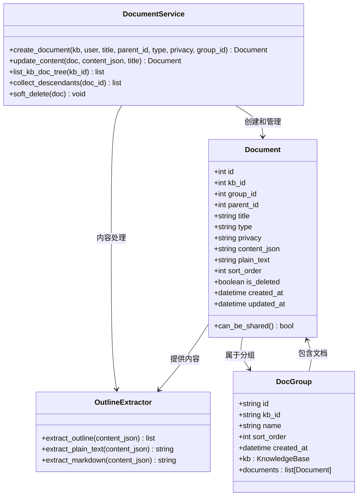

**图表来源**
- [app/models/document.py:20-50](file://app/models/document.py#L20-L50)
- [app/services/doc_service.py:37-53](file://app/services/doc_service.py#L37-L53)
- [app/utils/outline.py:22-55](file://app/utils/outline.py#L22-L55)

#### Markdown渲染引擎

系统集成了强大的 Markdown 渲染功能，支持扩展语法和安全过滤：

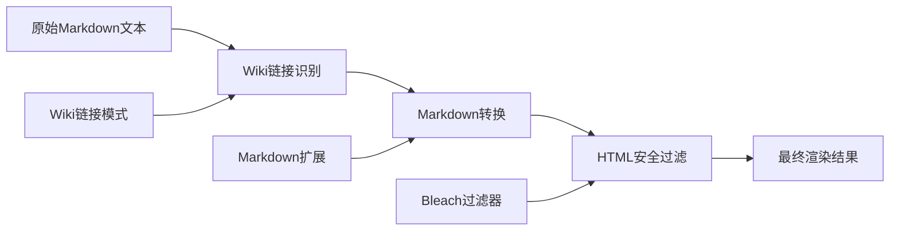

**图表来源**
- [app/utils/markdown.py:28-66](file://app/utils/markdown.py#L28-L66)

**章节来源**
- [app/utils/outline.py:34-55](file://app/utils/outline.py#L34-L55)
- [app/utils/markdown.py:31-39](file://app/utils/markdown.py#L31-L39)

### 图片上传处理

#### 图片上传集成

**新增** 系统现在支持编辑器内的图片上传功能：

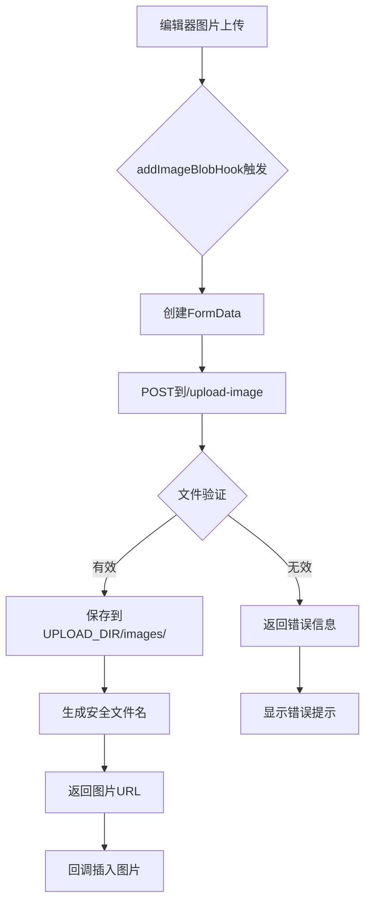

**图表来源**
- [app/blueprints/doc.py:28-44](file://app/blueprints/doc.py#L28-L44)
- [app/templates/doc/edit.html:129-146](file://app/templates/doc/edit.html#L129-L146)

#### 图片上传配置

系统提供了灵活的图片上传配置：

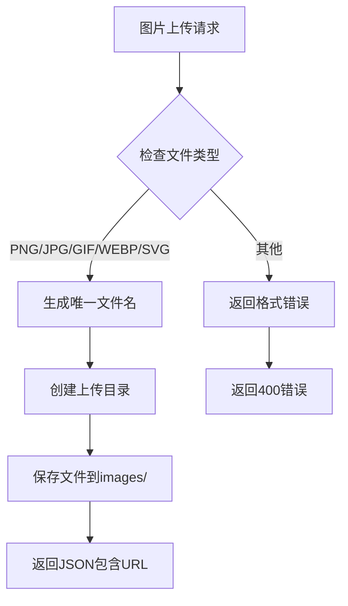

**图表来源**
- [app/blueprints/doc.py:25-44](file://app/blueprints/doc.py#L25-L44)

**章节来源**
- [app/blueprints/doc.py:25-54](file://app/blueprints/doc.py#L25-L54)
- [app/config.py:33-42](file://app/config.py#L33-L42)

### 拖拽排序系统

#### 拖拽排序架构

**新增** 系统实现了完整的拖拽排序功能，支持文档级别和分组级别的拖拽操作：

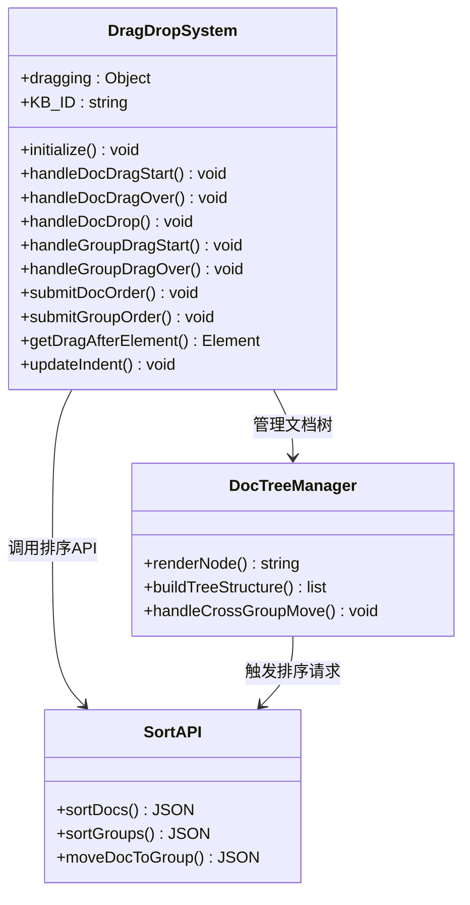

**图表来源**
- [app/templates/kb/detail.html:195-317](file://app/templates/kb/detail.html#L195-L317)
- [app/templates/doc/view.html:266-371](file://app/templates/doc/view.html#L266-L371)

#### 文档拖拽排序实现

系统支持在同一个分组内重新排序文档，并提供实时的视觉反馈：

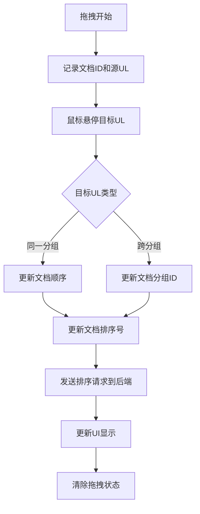

**图表来源**
- [app/templates/kb/detail.html:226-250](file://app/templates/kb/detail.html#L226-L250)
- [app/templates/doc/view.html:278-301](file://app/templates/doc/view.html#L278-L301)

#### 分组拖拽排序实现

系统支持重新排列分组的顺序，并提供拖拽过程中的视觉反馈：

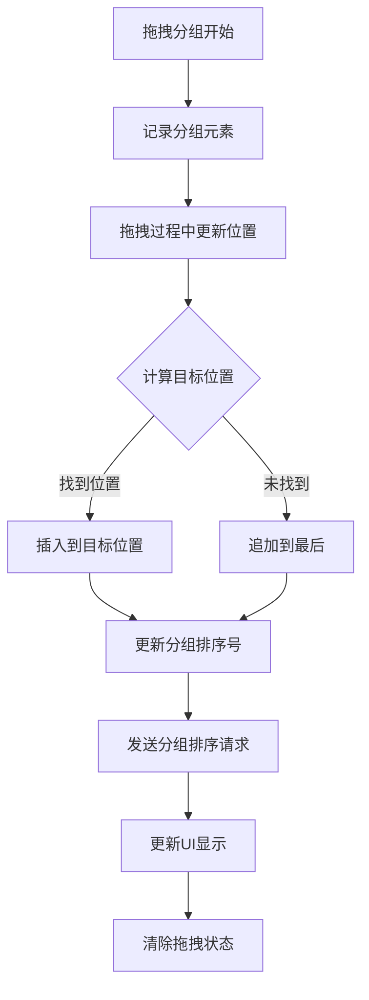

**图表来源**
- [app/templates/kb/detail.html:318-350](file://app/templates/kb/detail.html#L318-L350)
- [app/templates/doc/view.html:370-414](file://app/templates/doc/view.html#L370-L414)

#### 实时视觉反馈机制

系统提供了丰富的视觉反馈，帮助用户理解拖拽操作的状态：

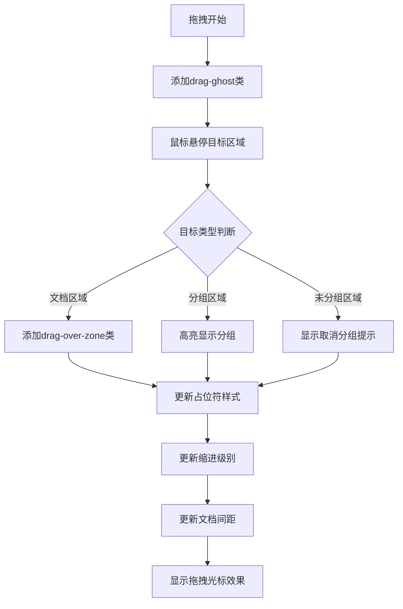

**图表来源**
- [app/templates/kb/detail.html:22-29](file://app/templates/kb/detail.html#L22-L29)
- [app/templates/doc/view.html:171-177](file://app/templates/doc/view.html#L171-L177)

#### 自动保存机制

系统在拖拽操作完成后自动保存排序结果，确保数据一致性：

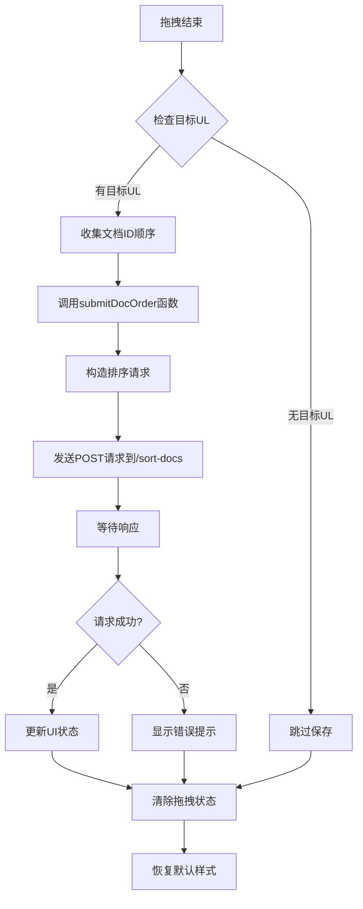

**图表来源**
- [app/templates/kb/detail.html:207-224](file://app/templates/kb/detail.html#L207-L224)
- [app/templates/doc/view.html:266-275](file://app/templates/doc/view.html#L266-L275)

**章节来源**
- [app/blueprints/kb.py:244-291](file://app/blueprints/kb.py#L244-L291)
- [app/templates/kb/detail.html:195-389](file://app/templates/kb/detail.html#L195-L389)
- [app/templates/doc/view.html:266-437](file://app/templates/doc/view.html#L266-L437)

### 版本控制与发布流程

#### 文档生命周期管理

系统实现了完整的文档生命周期管理，从创建到删除的每个阶段都有相应的控制逻辑：

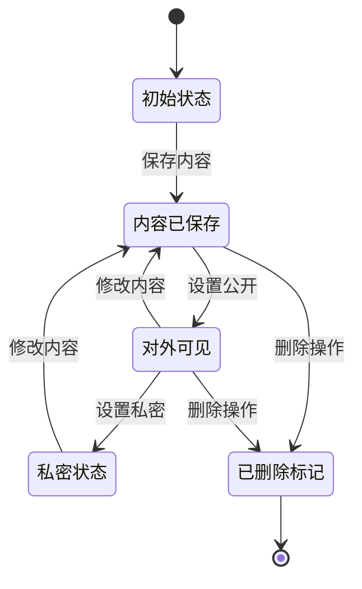

#### 批量删除机制

系统支持级联删除功能，确保删除操作不会留下孤立数据：

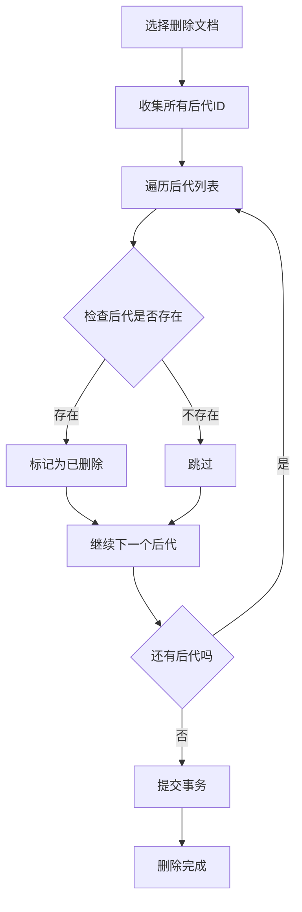

**图表来源**
- [app/blueprints/doc.py:94-100](file://app/blueprints/doc.py#L94-L100)
- [app/services/doc_service.py:70-80](file://app/services/doc_service.py#L70-L80)

**章节来源**
- [app/blueprints/doc.py:87-100](file://app/blueprints/doc.py#L87-L100)
- [app/services/doc_service.py:65-67](file://app/services/doc_service.py#L65-L67)

### 内容安全过滤

#### HTML安全机制

系统集成了多层次的安全过滤机制，确保用户输入的内容不会带来安全风险：

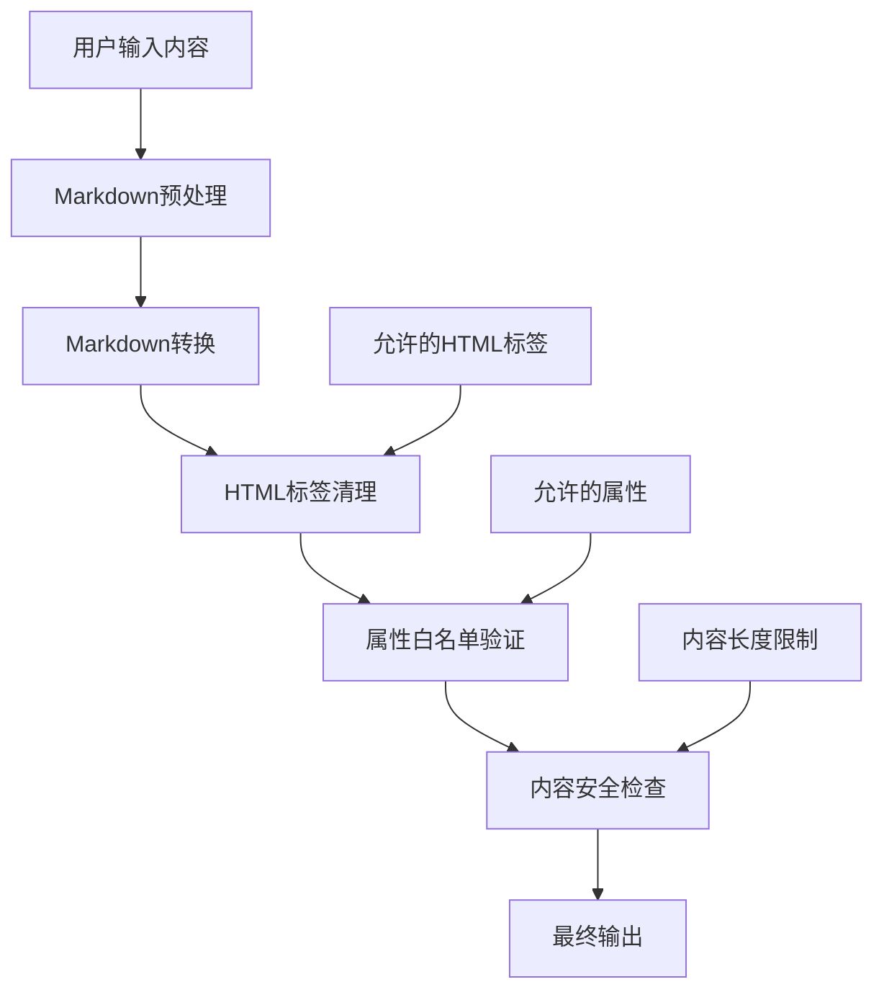

**图表来源**
- [app/utils/markdown.py:10-25](file://app/utils/markdown.py#L10-L25)
- [app/utils/markdown.py:31-39](file://app/utils/markdown.py#L31-L39)

**章节来源**
- [app/utils/markdown.py:10-40](file://app/utils/markdown.py#L10-L40)

## 依赖关系分析

### 外部依赖管理

项目采用明确的依赖管理策略，确保开发环境的一致性和可维护性：

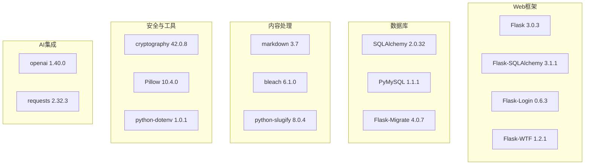

**图表来源**
- [requirements.txt:1-22](file://requirements.txt#L1-L22)

### 内部模块依赖

**更新** 内部模块依赖已适配新的编辑器实现和拖拽排序功能：

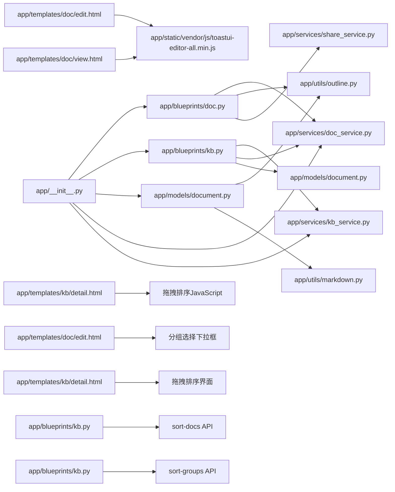

**图表来源**
- [app/__init__.py:56-74](file://app/__init__.py#L56-L74)
- [app/blueprints/doc.py:1-8](file://app/blueprints/doc.py#L1-L8)

**章节来源**
- [requirements.txt:1-22](file://requirements.txt#L1-L22)
- [app/__init__.py:56-74](file://app/__init__.py#L56-L74)

## 性能考虑

### 数据库优化策略

系统采用了多项数据库优化策略来提升性能：

- **索引优化**：在常用查询字段上建立索引，如 `kb_id`、`parent_id`、`group_id`、`is_deleted`
- **查询优化**：使用 `order_by` 和 `filter_by` 组合优化查询性能
- **连接池配置**：启用 `pool_pre_ping` 和合理的 `pool_recycle` 参数
- **批量操作**：使用 `commit()` 减少数据库往返次数

### 缓存策略

虽然当前实现没有显式的缓存层，但系统设计时考虑了缓存的可能性：

- **内容预处理**：将 Markdown 转换为纯文本用于搜索
- **大纲提取**：预先计算文档大纲以减少重复计算
- **模板渲染**：使用 Flask 的模板缓存机制

### 并发处理

系统通过以下机制处理并发访问：

- **会话管理**：使用 Flask-Login 管理会话状态
- **CSRF保护**：启用 Flask-WTF 的 CSRF 防护
- **数据库事务**：使用 SQLAlchemy 的事务管理

### 拖拽排序性能优化

**新增** 拖拽排序功能采用了多种性能优化策略：

- **前端状态管理**：使用内存中的拖拽状态避免频繁DOM操作
- **批量更新**：拖拽结束后一次性提交排序结果
- **防抖处理**：对频繁的拖拽事件进行节流处理
- **虚拟滚动**：对于大量文档的情况，考虑使用虚拟滚动优化

## 故障排除指南

### 常见问题诊断

#### 文档无法保存

**症状**：用户尝试保存文档时收到错误

**可能原因**：
1. 权限不足（非文档编辑者）
2. 内容格式不正确
3. 数据库连接问题
4. **编辑器初始化失败**

**解决步骤**：
1. 检查用户权限：确认用户是否具有编辑权限
2. 验证内容格式：确保 Markdown 格式正确
3. 检查数据库状态：确认数据库连接正常
4. **检查编辑器加载**：确认 toastui-editor-all.min.js 正常加载

#### 文档树显示异常

**症状**：文档树结构显示不正确或出现循环引用

**可能原因**：
1. 父子关系设置错误
2. 分组关系冲突
3. 数据库约束冲突
4. 查询逻辑问题

**解决步骤**：
1. 检查文档的 `parent_id` 和 `group_id` 字段
2. 验证数据库外键约束
3. 重新构建文档树缓存
4. 检查分组排序和嵌套关系

#### 拖拽排序功能异常

**新增** **症状**：拖拽排序功能无法正常使用

**可能原因**：
1. **拖拽事件监听器未绑定**
2. **HTML数据属性缺失**
3. **JavaScript初始化错误**
4. **拖拽排序API调用失败**
5. **权限验证失败**

**解决步骤**：
1. **检查HTML结构**：确认拖拽元素有正确的 `data-doc-id` 和 `draggable` 属性
2. **验证JavaScript**：确认拖拽排序脚本正常加载和执行
3. **检查网络请求**：确认 `/kb/{kb_id}/sort-docs` 和 `/kb/{kb_id}/sort-groups` 接口可用
4. **验证用户权限**：确认用户具有编辑权限
5. **查看浏览器控制台**：检查JavaScript错误和网络请求状态

#### 分组功能异常

**新增** **症状**：分组创建、重命名或删除失败

**可能原因**：
1. **权限不足**（非知识库编辑者）
2. **分组ID验证失败**
3. **拖放功能JavaScript错误**
4. **数据库事务冲突**

**解决步骤**：
1. **检查用户权限**：确认用户具有知识库编辑权限
2. **验证分组ID**：确认分组ID在知识库范围内存在
3. **检查拖放脚本**：确认 kb/detail.html 中的拖放JavaScript正常运行
4. **查看数据库日志**：检查分组操作的数据库事务状态

#### 分享链接失效

**症状**：分享链接无法访问或显示过期

**可能原因**：
1. 分享令牌过期
2. 密码验证失败
3. 文档状态变更

**解决步骤**：
1. 检查分享记录的 `expires_at` 字段
2. 验证密码输入
3. 确认文档仍处于可分享状态

#### **编辑器加载失败**

**新增** **症状**：编辑器无法正常加载或显示空白

**可能原因**：
1. **Toast UI Editor 资源加载失败**
2. **JavaScript初始化错误**
3. **浏览器兼容性问题**
4. **中文本地化文件加载失败**

**解决步骤**：
1. **检查网络面板**：确认 toastui-editor-all.min.js 返回 200 OK
2. **验证初始化代码**：检查编辑器初始化参数
3. **测试浏览器兼容性**：确认支持现代浏览器
4. **查看控制台错误**：定位具体的JavaScript错误
5. **检查本地化文件**：确认 toastui-editor-i18n-zh-cn.js 正常加载

#### **图片上传失败**

**新增** **症状**：编辑器内图片上传失败

**可能原因**：
1. **上传目录权限问题**
2. **文件类型不支持**
3. **网络连接问题**
4. **文件大小超限**

**解决步骤**：
1. **检查上传目录**：确认 UPLOAD_DIR/images/ 可写
2. **验证文件类型**：确认 PNG/JPG/GIF/WEBP/SVG 格式
3. **检查网络连接**：确认 /upload-image 接口可用
4. **验证文件大小**：确认不超过 MAX_CONTENT_LENGTH 限制

**章节来源**
- [app/blueprints/doc.py:13-17](file://app/blueprints/doc.py#L13-L17)
- [app/services/share_service.py:39-43](file://app/services/share_service.py#L39-L43)

### 错误处理机制

**更新** 系统实现了完善的错误处理机制，包括新的编辑器错误处理和拖拽排序功能：

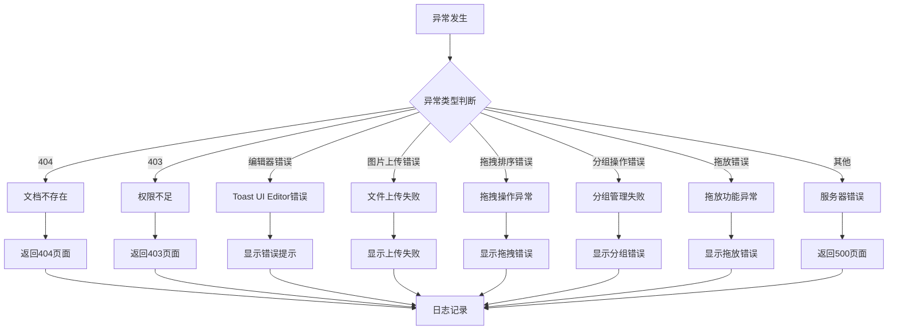

**图表来源**
- [app/__init__.py:76-87](file://app/__init__.py#L76-L87)
- [app/templates/doc/edit.html:54-68](file://app/templates/doc/edit.html#L54-L68)

## 结论

文档蓝图系统提供了一个功能完整、架构清晰的知识库解决方案。通过采用现代化的技术栈和最佳实践，系统在易用性、安全性、性能和可扩展性方面都表现出色。

### 主要优势

1. **模块化设计**：清晰的分层架构便于维护和扩展
2. **安全可靠**：多重安全机制保护用户数据
3. **性能优化**：合理的数据库设计和查询优化
4. **用户体验**：直观的编辑器和流畅的操作体验
5. **现代化技术栈**：采用 Toast UI Editor 提供更好的编辑体验
6. **功能丰富**：支持图片上传、中文本地化、智能大纲、文档分组等功能
7. **开发友好**：完善的错误处理和调试支持
8. **协作增强**：支持分组管理，提升团队协作效率
9. **拖拽排序系统**：提供直观的文档组织和管理方式
10. **实时反馈机制**：拖拽过程中的视觉反馈提升用户体验

### 新增拖拽排序功能的优势

**新增** 拖拽排序功能显著提升了系统的易用性和效率：

- **直观的操作方式**：用户可以通过拖拽直接调整文档和分组的顺序
- **实时视觉反馈**：拖拽过程中的高亮显示和占位符效果帮助用户理解操作结果
- **跨组移动能力**：支持将文档从一个分组移动到另一个分组，实现灵活的文档组织
- **自动保存机制**：拖拽完成后自动保存排序结果，确保数据一致性
- **性能优化**：采用前端状态管理和批量更新策略，提升拖拽操作的流畅性

### 发展建议

1. **缓存层增强**：考虑添加 Redis 缓存提升性能
2. **搜索功能**：集成全文搜索引擎提升检索效率
3. **版本历史**：实现更精细的版本控制和比较功能
4. **移动端适配**：优化移动端用户体验
5. **编辑器功能扩展**：利用 Toast UI Editor 的更多特性
6. **AI集成增强**：结合 Markdown 提取的纯文本进行更智能的AI处理
7. **分组功能扩展**：支持分组的嵌套和更复杂的组织结构
8. **拖拽优化**：改进拖拽体验，支持批量操作和更直观的交互
9. **拖拽动画**：添加平滑的拖拽动画效果提升用户体验
10. **拖拽辅助线**：在拖拽过程中显示辅助线指示插入位置

该系统为个人和团队知识管理提供了坚实的技术基础，适合进一步的功能扩展和定制开发。新增的拖拽排序功能显著提升了系统的组织能力和协作效率，为用户提供了更加灵活和高效的知识管理体验。完整的拖拽排序系统包括文档级别的拖拽排序、分组级别的拖拽排序、跨组文档移动和实时视觉反馈，为用户提供了直观而强大的文档管理方式。