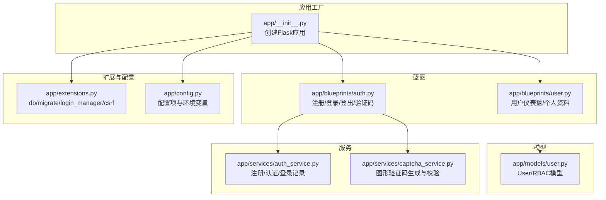
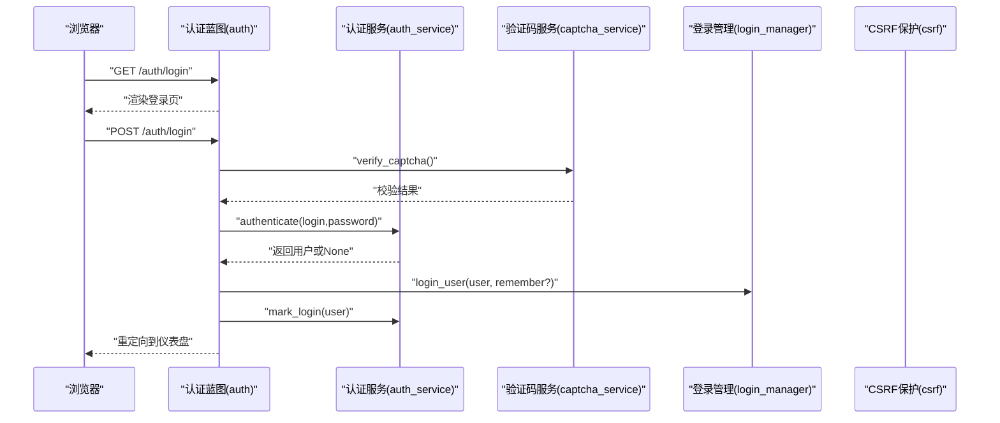
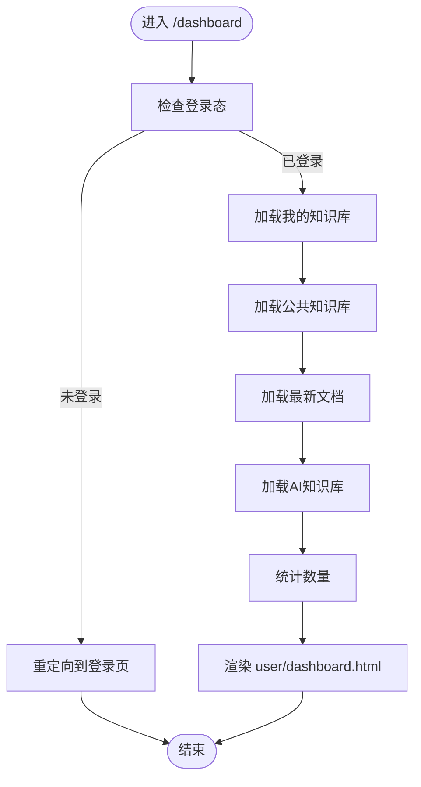
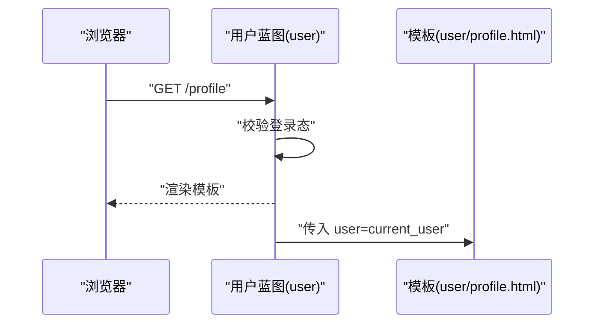
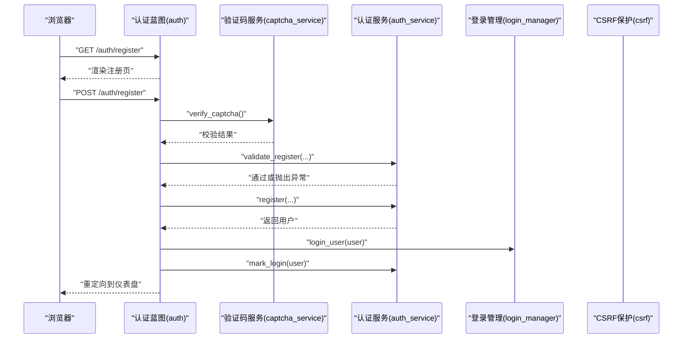
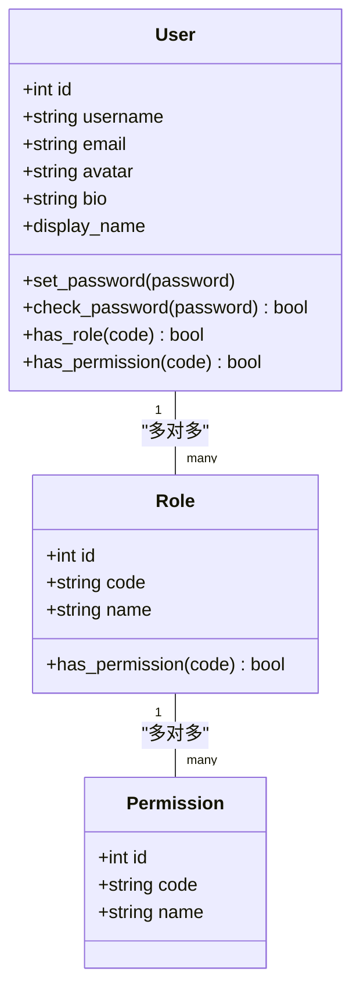
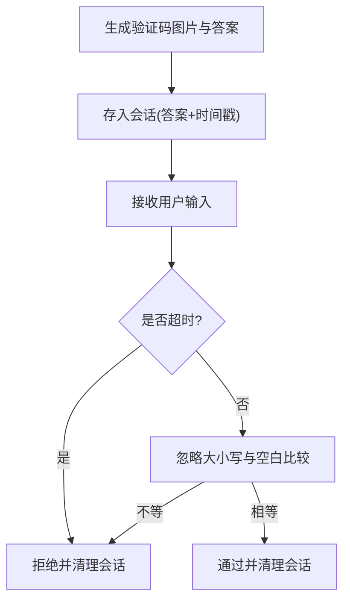
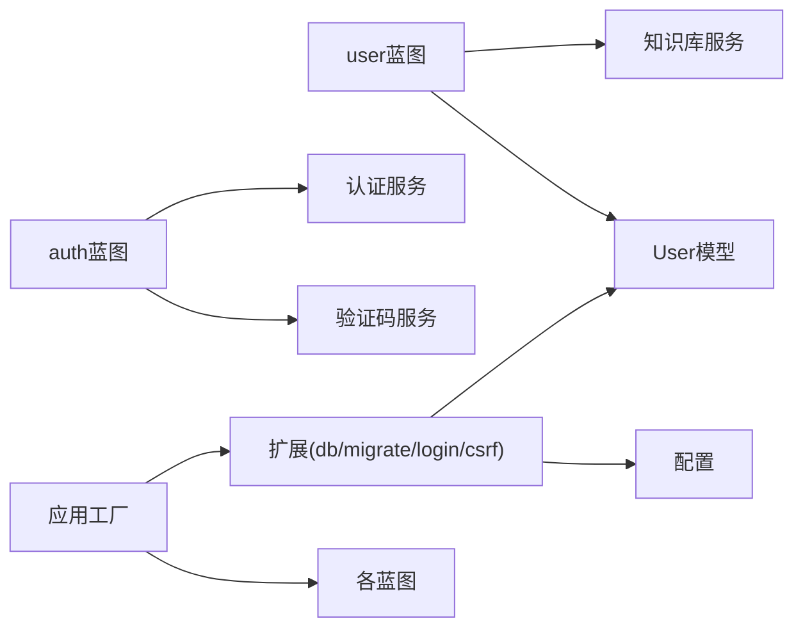

# 用户蓝图 (User Blueprint)

<cite>
**本文引用的文件**
- [app/blueprints/user.py](file://app/blueprints/user.py)
- [app/models/user.py](file://app/models/user.py)
- [app/services/auth_service.py](file://app/services/auth_service.py)
- [app/blueprints/auth.py](file://app/blueprints/auth.py)
- [app/services/captcha_service.py](file://app/services/captcha_service.py)
- [app/extensions.py](file://app/extensions.py)
- [app/__init__.py](file://app/__init__.py)
- [app/config.py](file://app/config.py)
- [app/templates/base.html](file://app/templates/base.html)
- [requirements.txt](file://requirements.txt)
</cite>

## 目录
1. [简介](#简介)
2. [项目结构](#项目结构)
3. [核心组件](#核心组件)
4. [架构总览](#架构总览)
5. [详细组件分析](#详细组件分析)
6. [依赖分析](#依赖分析)
7. [性能考虑](#性能考虑)
8. [故障排查指南](#故障排查指南)
9. [结论](#结论)
10. [附录](#附录)

## 简介
本文件为“用户蓝图”（User Blueprint）的管理文档，聚焦于用户个人信息管理、设置配置与账户维护功能的实现与使用。内容涵盖：
- 用户资料查看与仪表盘展示
- 头像与个人简介字段的存储与显示
- 密码修改与登录安全机制
- 验证码与CSRF防护在用户相关流程中的应用
- 前端模板与表单交互的设计思路
- 后端蓝图路由与服务层的数据处理逻辑

当前仓库中未发现专门用于“用户资料编辑”的蓝图路由或服务实现；本文将基于现有代码进行严谨说明，并指出可扩展方向。

## 项目结构
用户蓝图位于应用的蓝本模块中，配合认证、会话、CSRF保护等基础设施共同工作。关键目录与文件如下：
- 蓝图：用户仪表盘与个人资料页
- 模型：用户实体及角色权限模型
- 服务：认证与验证码服务
- 扩展：数据库、迁移、登录管理、CSRF保护
- 配置：数据库、上传、AI、验证码等参数
- 模板：基础布局与导航栏等通用组件

图表来源
- [app/__init__.py:11-74](file://app/__init__.py#L11-L74)
- [app/blueprints/user.py:1-35](file://app/blueprints/user.py#L1-L35)
- [app/blueprints/auth.py:1-85](file://app/blueprints/auth.py#L1-L85)
- [app/models/user.py:1-104](file://app/models/user.py#L1-L104)
- [app/services/auth_service.py:1-57](file://app/services/auth_service.py#L1-L57)
- [app/services/captcha_service.py:1-90](file://app/services/captcha_service.py#L1-L90)
- [app/extensions.py:1-17](file://app/extensions.py#L1-L17)
- [app/config.py:1-83](file://app/config.py#L1-L83)

章节来源
- [app/__init__.py:11-74](file://app/__init__.py#L11-L74)
- [app/blueprints/user.py:1-35](file://app/blueprints/user.py#L1-L35)
- [app/blueprints/auth.py:1-85](file://app/blueprints/auth.py#L1-L85)
- [app/models/user.py:1-104](file://app/models/user.py#L1-L104)
- [app/services/auth_service.py:1-57](file://app/services/auth_service.py#L1-L57)
- [app/services/captcha_service.py:1-90](file://app/services/captcha_service.py#L1-L90)
- [app/extensions.py:1-17](file://app/extensions.py#L1-L17)
- [app/config.py:1-83](file://app/config.py#L1-L83)

## 核心组件
- 用户蓝图（user）：提供“仪表盘”和“个人资料”两个受登录保护的页面，负责聚合用户的知识库、文档与AI知识库信息，并渲染模板。
- 认证蓝图（auth）：提供注册、登录、登出与验证码接口，结合服务层完成输入校验、用户创建与登录态维护。
- 用户模型（User）：定义用户字段（用户名、邮箱、头像、简介、密码哈希等），提供密码设置与校验方法，以及角色/权限查询能力。
- 认证服务（auth_service）：集中处理注册校验规则与注册流程，提供登录态记录。
- 验证码服务（captcha_service）：生成图形验证码图片并进行一次性校验，支持TTL控制。
- 应用扩展（extensions）：统一初始化数据库、迁移、登录管理器与CSRF保护。
- 应用工厂（create_app）：装配蓝图、扩展、错误处理器与上下文变量注入。

章节来源
- [app/blueprints/user.py:12-34](file://app/blueprints/user.py#L12-L34)
- [app/blueprints/auth.py:19-84](file://app/blueprints/auth.py#L19-L84)
- [app/models/user.py:55-104](file://app/models/user.py#L55-L104)
- [app/services/auth_service.py:21-57](file://app/services/auth_service.py#L21-L57)
- [app/services/captcha_service.py:65-90](file://app/services/captcha_service.py#L65-L90)
- [app/extensions.py:8-17](file://app/extensions.py#L8-L17)
- [app/__init__.py:39-74](file://app/__init__.py#L39-L74)

## 架构总览
用户蓝图与认证体系通过蓝图路由、服务层与模型层协同工作，配合CSRF与会话管理保障安全性。下图展示了从请求到响应的关键路径：

图表来源
- [app/blueprints/auth.py:51-76](file://app/blueprints/auth.py#L51-L76)
- [app/services/auth_service.py:44-57](file://app/services/auth_service.py#L44-L57)
- [app/services/captcha_service.py:75-90](file://app/services/captcha_service.py#L75-L90)
- [app/extensions.py:10-11](file://app/extensions.py#L10-L11)

章节来源
- [app/blueprints/auth.py:51-76](file://app/blueprints/auth.py#L51-L76)
- [app/services/auth_service.py:44-57](file://app/services/auth_service.py#L44-L57)
- [app/services/captcha_service.py:75-90](file://app/services/captcha_service.py#L75-L90)
- [app/extensions.py:10-11](file://app/extensions.py#L10-L11)

## 详细组件分析

### 用户仪表盘（Dashboard）
- 路由：GET /dashboard
- 登录态要求：使用装饰器确保仅登录用户可访问
- 数据聚合：
  - 我的知识库：调用知识库服务列出当前用户拥有或加入的未归档知识库
  - 公共知识库：列出公开知识库
  - 最新文档：按作者与未删除条件筛选，按更新时间倒序
  - AI知识库：按所有者筛选，按更新时间倒序
  - 统计计数：知识库、文档、AI知识库数量
- 渲染模板：user/dashboard.html

图表来源
- [app/blueprints/user.py:12-28](file://app/blueprints/user.py#L12-L28)

章节来源
- [app/blueprints/user.py:12-28](file://app/blueprints/user.py#L12-L28)

### 个人资料页（Profile）
- 路由：GET /profile
- 登录态要求：仅登录用户可见
- 数据传递：向模板传入当前用户对象
- 渲染模板：user/profile.html

图表来源
- [app/blueprints/user.py:31-34](file://app/blueprints/user.py#L31-L34)

章节来源
- [app/blueprints/user.py:31-34](file://app/blueprints/user.py#L31-L34)

### 注册与登录（含验证码与CSRF）
- 注册流程：
  - GET：渲染注册表单
  - POST：接收用户名、邮箱、密码、确认密码与验证码
  - 验证码校验：调用验证码服务进行一次性校验
  - 输入校验：用户名、邮箱、密码长度与一致性、重复性检查
  - 创建用户：设置密码哈希并持久化
  - 登录：自动登录并记录登录信息
  - 重定向：跳转到仪表盘
- 登录流程：
  - GET：渲染登录表单
  - POST：接收登录名、密码、验证码与“记住我”
  - 验证码校验：一次性校验
  - 认证：根据用户名或邮箱查找用户并校验密码
  - 登录：设置会话并记录登录信息
  - 重定向：根据next参数或默认到仪表盘
- 登出流程：
  - POST/GET：清除会话并提示消息

图表来源
- [app/blueprints/auth.py:19-48](file://app/blueprints/auth.py#L19-L48)
- [app/services/auth_service.py:21-41](file://app/services/auth_service.py#L21-L41)
- [app/services/captcha_service.py:75-90](file://app/services/captcha_service.py#L75-L90)

章节来源
- [app/blueprints/auth.py:19-48](file://app/blueprints/auth.py#L19-L48)
- [app/services/auth_service.py:21-41](file://app/services/auth_service.py#L21-L41)
- [app/services/captcha_service.py:75-90](file://app/services/captcha_service.py#L75-L90)

### 用户模型与密码管理
- 字段与属性：
  - 用户名、邮箱唯一且索引
  - 密码以哈希形式存储
  - 头像与简介字段
  - 角色与权限关联（RBAC）
  - 登录信息记录（最近登录时间与IP）
- 方法：
  - 设置密码：生成哈希
  - 校验密码：基于哈希比对
  - 角色/权限判断：支持超级管理员与多角色权限继承

图表来源
- [app/models/user.py:55-104](file://app/models/user.py#L55-L104)

章节来源
- [app/models/user.py:55-104](file://app/models/user.py#L55-L104)

### 验证码服务（Captcha）
- 生成：随机字符、背景点阵、干扰线、旋转字符，输出PNG字节流
- 存储：将答案与时间戳存入会话，支持TTL控制
- 校验：忽略大小写与空白，一次性使用（校验后即销毁）

图表来源
- [app/services/captcha_service.py:32-90](file://app/services/captcha_service.py#L32-L90)

章节来源
- [app/services/captcha_service.py:32-90](file://app/services/captcha_service.py#L32-L90)

### CSRF与会话安全
- CSRF保护：启用CSRFProtect，配合表单令牌使用
- 会话配置：HttpOnly Cookie、SameSite策略、记住我时长
- 登录管理：未登录访问受保护路由时重定向至登录页

章节来源
- [app/extensions.py:8-17](file://app/extensions.py#L8-L17)
- [app/config.py:28-31](file://app/config.py#L28-L31)
- [app/__init__.py:14-16](file://app/__init__.py#L14-L16)

## 依赖分析
- 组件耦合：
  - 用户蓝图依赖知识库服务与模型以聚合数据
  - 认证蓝图依赖认证与验证码服务
  - 应用工厂统一装配扩展与蓝图
- 外部依赖：
  - Flask生态：SQLAlchemy、Migrate、Login、WTF/WTForms、Pillow
  - 数据库：MySQL（示例配置）
  - 可选RAG：Chroma与嵌入模型（需启用）

图表来源
- [app/__init__.py:39-74](file://app/__init__.py#L39-L74)
- [app/blueprints/user.py:5-7](file://app/blueprints/user.py#L5-L7)
- [app/blueprints/auth.py:5](file://app/blueprints/auth.py#L5)
- [app/services/auth_service.py:9-10](file://app/services/auth_service.py#L9-L10)
- [app/services/captcha_service.py:10-11](file://app/services/captcha_service.py#L10-L11)
- [app/extensions.py:8-11](file://app/extensions.py#L8-L11)
- [app/config.py:18-26](file://app/config.py#L18-L26)

章节来源
- [app/__init__.py:39-74](file://app/__init__.py#L39-L74)
- [app/blueprints/user.py:5-7](file://app/blueprints/user.py#L5-L7)
- [app/blueprints/auth.py:5](file://app/blueprints/auth.py#L5)
- [app/services/auth_service.py:9-10](file://app/services/auth_service.py#L9-L10)
- [app/services/captcha_service.py:10-11](file://app/services/captcha_service.py#L10-L11)
- [app/extensions.py:8-11](file://app/extensions.py#L8-L11)
- [app/config.py:18-26](file://app/config.py#L18-L26)

## 性能考虑
- 查询优化：
  - 使用limit限制仪表盘展示数量，避免一次性加载过多数据
  - 对常用过滤字段建立索引（如用户id、知识库owner_id、visibility等）
- 缓存建议：
  - 对热点统计值（如知识库/文档数量）可引入Redis缓存，定期刷新
- 图片与上传：
  - 头像上传路径与最大文件大小在配置中可调，建议结合CDN与缩略图策略
- 数据库连接：
  - 预热连接池参数已在配置中设置，生产环境建议监控慢查询与连接数

## 故障排查指南
- 登录失败
  - 检查验证码是否正确且未过期
  - 确认用户状态为激活，密码哈希匹配
- 注册失败
  - 校验用户名、邮箱、密码长度与一致性
  - 确保用户名与邮箱未被占用
- 403/404/500错误
  - 应用已注册错误处理器，检查对应模板是否存在
- CSRF相关问题
  - 确保表单包含CSRF令牌，且与会话一致

章节来源
- [app/blueprints/auth.py:31-40](file://app/blueprints/auth.py#L31-L40)
- [app/services/auth_service.py:21-33](file://app/services/auth_service.py#L21-L33)
- [app/__init__.py:76-87](file://app/__init__.py#L76-L87)
- [app/templates/base.html:6](file://app/templates/base.html#L6)

## 结论
用户蓝图提供了简洁而完整的用户入口与资料展示能力，配合认证与验证码服务构建了安全可靠的登录体验。当前仓库未包含“用户资料编辑”的具体实现，但基于现有模型与蓝图结构，可在用户蓝图中新增编辑路由与表单处理逻辑，并复用认证与CSRF保护机制，即可快速扩展头像上传、密码修改与通知设置等功能。

## 附录

### 用户界面设计与表单处理要点
- 布局与组件
  - 基础模板提供导航栏、页脚与闪存消息区域，便于在用户页复用
- 表单令牌
  - 模板中应包含CSRF令牌，确保POST操作安全
- 验证与提示
  - 登录/注册流程中使用闪存消息反馈错误或成功信息

章节来源
- [app/templates/base.html:16-26](file://app/templates/base.html#L16-L26)

### 数据验证逻辑摘要
- 注册校验规则
  - 用户名：2-32位，允许字母、数字、下划线与中文
  - 邮箱：基本格式校验
  - 密码：至少6位
  - 二次确认：两次密码必须一致
  - 唯一性：用户名与邮箱不可重复
- 登录校验
  - 支持用户名或邮箱登录
  - 必须为激活状态且密码正确

章节来源
- [app/services/auth_service.py:13-33](file://app/services/auth_service.py#L13-L33)
- [app/services/auth_service.py:44-50](file://app/services/auth_service.py#L44-L50)

### 外部依赖与版本
- Flask生态与数据库驱动
  - Flask、SQLAlchemy、Migrate、Login、WTF/WTForms、Pillow、PyMySQL等
- 可选RAG
  - 当启用RAG时，需安装Chroma与tiktoken等依赖

章节来源
- [requirements.txt:1-22](file://requirements.txt#L1-L22)