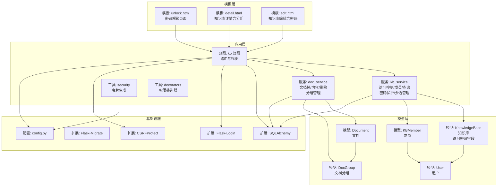
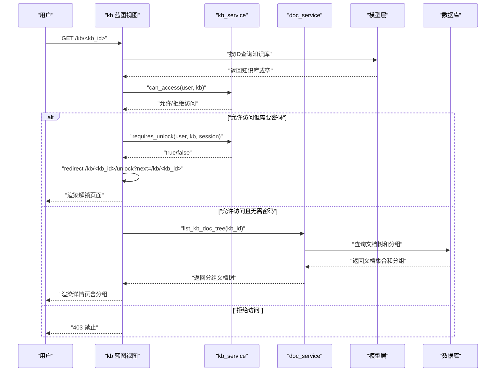
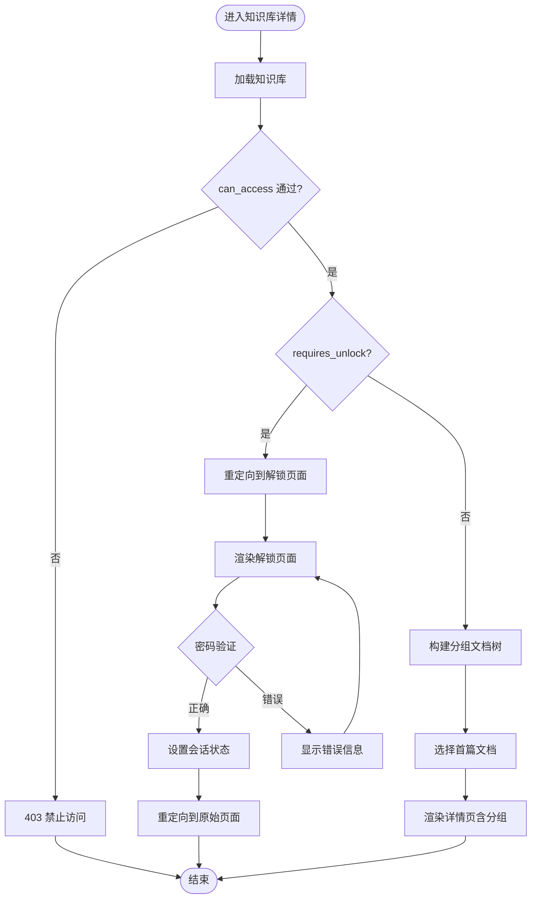
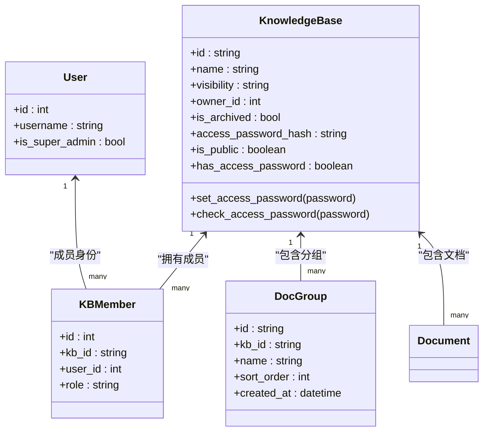
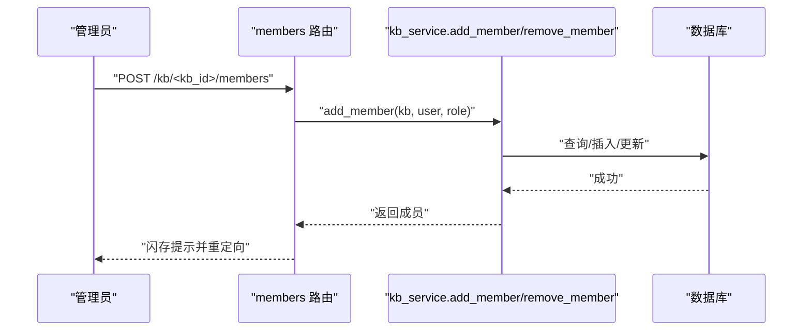
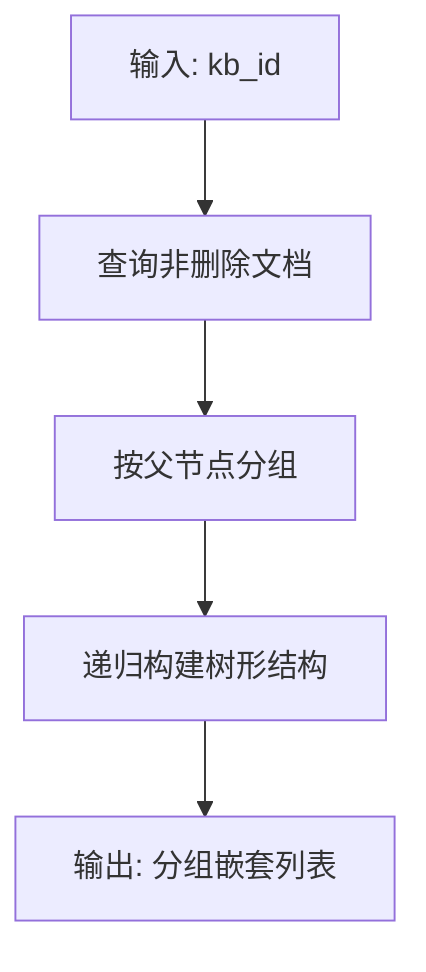
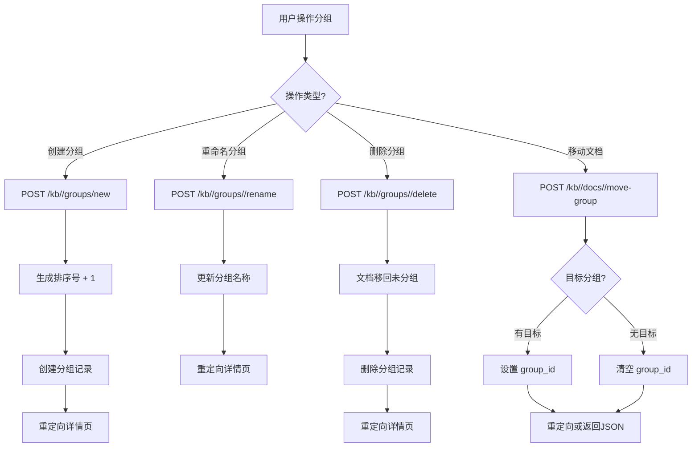
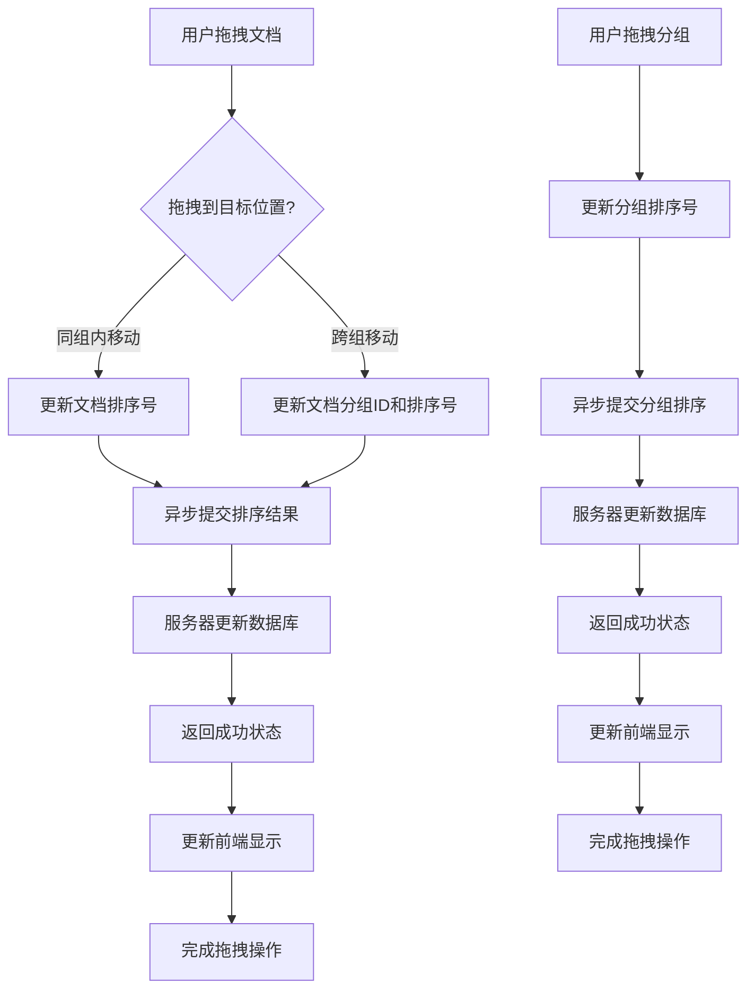
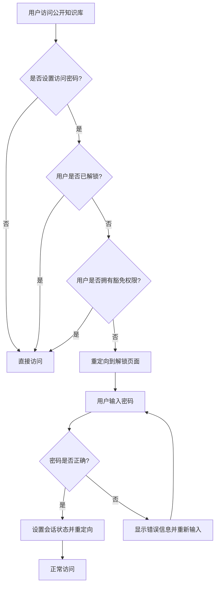
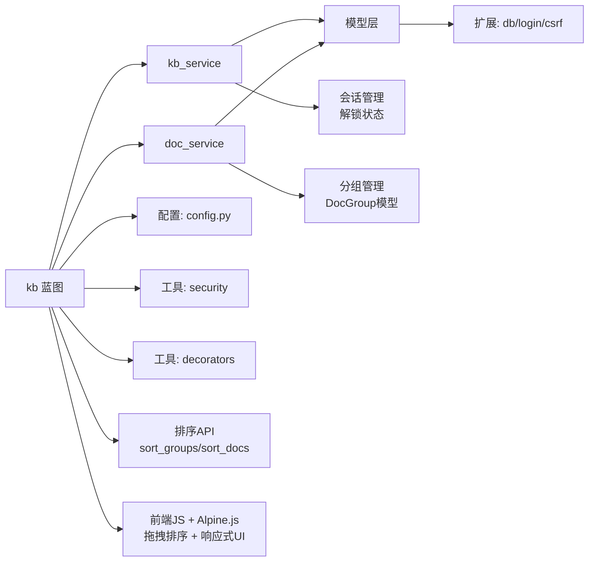

# 知识库蓝图 (Knowledge Base Blueprint)

<cite>
**本文引用的文件**
- [app/blueprints/kb.py](file://app/blueprints/kb.py)
- [app/services/kb_service.py](file://app/services/kb_service.py)
- [app/services/doc_service.py](file://app/services/doc_service.py)
- [app/models/knowledge_base.py](file://app/models/knowledge_base.py)
- [app/models/document.py](file://app/models/document.py)
- [app/models/user.py](file://app/models/user.py)
- [app/extensions.py](file://app/extensions.py)
- [app/config.py](file://app/config.py)
- [app/utils/security.py](file://app/utils/security.py)
- [app/utils/decorators.py](file://app/utils/decorators.py)
- [app/templates/kb/unlock.html](file://app/templates/kb/unlock.html)
- [app/templates/kb/detail.html](file://app/templates/kb/detail.html)
- [app/templates/kb/edit.html](file://app/templates/kb/edit.html)
- [app/templates/doc/view.html](file://app/templates/doc/view.html)
- [app/blueprints/doc.py](file://app/blueprints/doc.py)
- [app/blueprints/share.py](file://app/blueprints/share.py)
</cite>

## 更新摘要
**变更内容**
- 新增知识库分组管理功能：支持分组创建、重命名、删除、文档移动等操作
- 新增DocGroup模型：用于知识库内的文档分组管理
- 增强文档树展示：支持分组模式的文档树结构
- 新增拖拽式文档移动：支持通过拖拽将文档移动到不同分组
- 新增分组管理API路由：包括/groups/new、/groups/<group_id>/rename、/groups/<group_id>/delete、/docs/<doc_id>/move-group
- **新增**：完整拖拽排序系统：新增sort_groups()和sort_docs() API端点，实现组排序和文档排序功能，包括跨组文档移动、实时排序更新和异步提交机制
- **新增**：Alpine.js交互式分组管理：采用Alpine.js实现响应式UI，支持分组的展开/折叠、重命名编辑模式切换
- **新增**：改进的拖拽排序体验：优化拖拽视觉反馈、占位符显示和跨组移动的用户体验
- **新增**：增强的前端用户界面：改进的样式设计、更好的视觉层次和交互反馈
- 密码保护功能增强：与分组功能结合使用，提供更灵活的访问控制

## 目录
1. [简介](#简介)
2. [项目结构](#项目结构)
3. [核心组件](#核心组件)
4. [架构总览](#架构总览)
5. [详细组件分析](#详细组件分析)
6. [依赖分析](#依赖分析)
7. [性能考虑](#性能考虑)
8. [故障排查指南](#故障排查指南)
9. [结论](#结论)
10. [附录](#附录)

## 简介
本文件面向"知识库蓝图"功能模块，提供从架构到实现细节的完整说明。内容覆盖知识库的 CRUD 操作（创建、编辑、删除、可见性控制）、成员管理与权限控制、模板渲染、表单验证与数据持久化流程，并给出 API 接口说明与前端交互示例路径，帮助开发者快速理解与扩展。

**更新** 新增知识库分组管理功能，支持文档分组、拖拽移动、分组重命名和删除等操作，同时增强密码保护功能，提供更灵活的访问控制能力。**新增**完整的拖拽排序系统，支持组间拖拽排序和文档实时排序更新。**新增** Alpine.js 交互式分组管理和改进的拖拽排序体验，提供更直观的用户界面。

## 项目结构
知识库蓝图位于应用的蓝本层（Blueprint），通过服务层协调模型层与工具层，配合扩展与配置完成认证、CSRF 保护与数据库会话管理。

**图表来源**
- [app/blueprints/kb.py:1-291](file://app/blueprints/kb.py#L1-L291)
- [app/services/kb_service.py:1-115](file://app/services/kb_service.py#L1-L115)
- [app/services/doc_service.py:1-130](file://app/services/doc_service.py#L1-L130)
- [app/models/knowledge_base.py:1-82](file://app/models/knowledge_base.py#L1-L82)
- [app/models/document.py:1-117](file://app/models/document.py#L1-L117)
- [app/models/user.py:1-104](file://app/models/user.py#L1-L104)
- [app/extensions.py:1-17](file://app/extensions.py#L1-L17)
- [app/config.py:1-83](file://app/config.py#L1-L83)
- [app/utils/security.py:1-8](file://app/utils/security.py#L1-L8)
- [app/utils/decorators.py:1-33](file://app/utils/decorators.py#L1-L33)
- [app/templates/kb/unlock.html:1-36](file://app/templates/kb/unlock.html#L1-L36)
- [app/templates/kb/detail.html:1-391](file://app/templates/kb/detail.html#L1-L391)
- [app/templates/kb/edit.html:1-78](file://app/templates/kb/edit.html#L1-L78)

**章节来源**
- [app/blueprints/kb.py:1-291](file://app/blueprints/kb.py#L1-L291)
- [app/services/kb_service.py:1-115](file://app/services/kb_service.py#L1-L115)
- [app/services/doc_service.py:1-130](file://app/services/doc_service.py#L1-L130)
- [app/models/knowledge_base.py:1-82](file://app/models/knowledge_base.py#L1-L82)
- [app/models/document.py:1-117](file://app/models/document.py#L1-L117)
- [app/models/user.py:1-104](file://app/models/user.py#L1-L104)
- [app/extensions.py:1-17](file://app/extensions.py#L1-L17)
- [app/config.py:1-83](file://app/config.py#L1-L83)
- [app/utils/security.py:1-8](file://app/utils/security.py#L1-L8)
- [app/utils/decorators.py:1-33](file://app/utils/decorators.py#L1-L33)
- [app/templates/kb/unlock.html:1-36](file://app/templates/kb/unlock.html#L1-L36)
- [app/templates/kb/detail.html:1-391](file://app/templates/kb/detail.html#L1-L391)
- [app/templates/kb/edit.html:1-78](file://app/templates/kb/edit.html#L1-L78)

## 核心组件
- 蓝图路由与视图：负责接收请求、参数校验、调用服务、渲染模板与重定向。
- 服务层：封装访问控制、成员管理、列表查询、**密码保护检查**与**会话管理**等业务逻辑。
- 模型层：定义知识库、成员、文档、**文档分组**、用户等实体及关系，**新增访问密码相关字段**。
- 工具与扩展：安全令牌生成、权限装饰器、登录管理、CSRF 保护、数据库会话。
- 配置：数据库连接、AI 相关参数、上传与分页等全局设置。

**更新** 新增DocGroup模型和分组管理功能，支持知识库内的文档分组管理，增强文档组织能力。**新增**完整的拖拽排序系统，支持组间拖拽排序和文档实时排序更新。**新增** Alpine.js 交互式分组管理，提供响应式的用户界面体验。

**章节来源**
- [app/blueprints/kb.py:1-291](file://app/blueprints/kb.py#L1-L291)
- [app/services/kb_service.py:1-115](file://app/services/kb_service.py#L1-L115)
- [app/models/knowledge_base.py:1-82](file://app/models/knowledge_base.py#L1-L82)
- [app/models/document.py:1-117](file://app/models/document.py#L1-L117)
- [app/models/user.py:1-104](file://app/models/user.py#L1-L104)
- [app/extensions.py:1-17](file://app/extensions.py#L1-L17)
- [app/config.py:1-83](file://app/config.py#L1-L83)
- [app/utils/security.py:1-8](file://app/utils/security.py#L1-L8)
- [app/utils/decorators.py:1-33](file://app/utils/decorators.py#L1-L33)

## 架构总览
知识库蓝图采用典型的 MVC 分层：
- 视图层：蓝图路由处理 HTTP 请求，调用服务层执行业务逻辑。
- 服务层：封装领域规则（访问控制、成员角色、可见性、**密码保护**、**分组管理**）。
- 模型层：ORM 映射数据库表，定义实体关系与约束，**包含访问密码字段和分组模型**。
- 基础设施：扩展统一注入，配置集中管理。

**图表来源**
- [app/blueprints/kb.py:56-74](file://app/blueprints/kb.py#L56-L74)
- [app/services/kb_service.py:10-23](file://app/services/kb_service.py#L10-L23)
- [app/services/doc_service.py:11-72](file://app/services/doc_service.py#L11-L72)

## 详细组件分析

### 路由与视图（蓝图）
- 列表页：支持"我的知识库/公开知识库"切换，调用服务层查询。
- 新建知识库：表单提交后进行必填项与可见性校验，创建后写入数据库并跳转详情。
- 详情页：校验访问权限，**检查是否需要密码解锁**，构建文档树（**支持分组模式**），选择默认打开的首篇文档，传递可编辑/可管理标记。
- 编辑知识库：仅管理员可编辑，更新名称、描述、可见性与图标，**支持设置/清除访问密码**。
- 删除知识库：仅管理员可删除，执行软删除（归档）。
- 成员管理：仅管理员可邀请/移除成员，设置成员角色（查看者/编辑者）。
- **解锁页面**：**新增**，处理公开知识库的密码验证，设置会话状态并重定向到原始页面。
- **分组管理**：**新增**，支持分组创建、重命名、删除和文档移动操作。
- **拖拽排序**：**新增**，支持组间拖拽排序和文档实时排序更新，通过异步提交机制保持数据一致性。

**图表来源**
- [app/blueprints/kb.py:56-74](file://app/blueprints/kb.py#L56-L74)
- [app/blueprints/kb.py:106-121](file://app/blueprints/kb.py#L106-L121)
- [app/services/kb_service.py:66-80](file://app/services/kb_service.py#L66-L80)

**章节来源**
- [app/blueprints/kb.py:21-291](file://app/blueprints/kb.py#L21-L291)

### 访问控制与权限
- 可访问性判定：公开知识库直接放行；私有/成员可见需登录且满足所有条件之一：超级管理员、拥有者、成员。
- 编辑权限：超级管理员或拥有者，或作为成员且角色为编辑者。
- 管理权限：仅拥有者，用于邀请成员、变更可见性、删除知识库。
- **密码保护检查**：**新增**，公开知识库且设置了访问密码时，需要检查用户是否已解锁或拥有相应权限。
- 公共/成员/私有三种可见性枚举，配合唯一索引与外键约束保证一致性。

**图表来源**
- [app/models/knowledge_base.py:22-62](file://app/models/knowledge_base.py#L22-L62)
- [app/models/document.py:11-25](file://app/models/document.py#L11-L25)
- [app/models/user.py:55-104](file://app/models/user.py#L55-L104)

**章节来源**
- [app/services/kb_service.py:10-45](file://app/services/kb_service.py#L10-L45)
- [app/models/knowledge_base.py:8-17](file://app/models/knowledge_base.py#L8-L17)

### 成员管理与角色
- 添加成员：若已存在则更新角色，否则新增成员记录；禁止添加拥有者本人。
- 移除成员：按知识库与用户ID删除成员记录。
- 角色枚举：查看者（默认）与编辑者（具备编辑权限）。

**图表来源**
- [app/blueprints/kb.py:136-159](file://app/blueprints/kb.py#L136-L159)
- [app/services/kb_service.py:100-114](file://app/services/kb_service.py#L100-L114)

**章节来源**
- [app/blueprints/kb.py:136-171](file://app/blueprints/kb.py#L136-L171)
- [app/services/kb_service.py:100-114](file://app/services/kb_service.py#L100-L114)

### 文档树与内容持久化
- 文档树：基于父节点聚合与递归构建，过滤已删除文档，排序依据是否为根节点、排序号与ID。**新增分组支持**，将文档按分组组织。
- 内容更新：更新标题、Editor.js JSON 内容与纯文本摘要（由工具函数提取）。
- 软删除：将文档标记为已删除，不影响知识库其他文档。

**图表来源**
- [app/services/doc_service.py:11-72](file://app/services/doc_service.py#L11-L72)

**章节来源**
- [app/services/doc_service.py:11-130](file://app/services/doc_service.py#L11-L130)

### 分组管理功能详解
**新增** 知识库分组管理功能提供了灵活的文档组织能力：

- **分组创建**：支持创建新的文档分组，自动设置排序号和默认名称。
- **分组重命名**：**新增**，通过 Alpine.js 实现响应式重命名功能，支持即时编辑模式切换。
- **分组删除**：删除分组时，将分组内的所有文档移回"未分组"状态。
- **文档移动**：支持拖拽式文档移动到不同分组，或从分组移出到未分组。
- **权限控制**：仅具有编辑权限的用户可以进行分组管理操作。
- **前端交互**：**新增**，提供 Alpine.js 响应式界面，支持分组的展开/折叠、重命名编辑模式切换和拖拽操作。
- **拖拽界面**：**新增**，改进的拖拽视觉反馈，包括拖拽幽灵效果和拖拽区域高亮。

**图表来源**
- [app/blueprints/kb.py:175-242](file://app/blueprints/kb.py#L175-L242)

**章节来源**
- [app/blueprints/kb.py:175-242](file://app/blueprints/kb.py#L175-L242)
- [app/services/doc_service.py:11-72](file://app/services/doc_service.py#L11-L72)

### 拖拽排序系统详解
**新增** 完整的拖拽排序系统提供了直观的排序体验：

- **组排序**：支持拖拽重新排列分组顺序，通过 `/kb/<kb_id>/sort-groups` 端点异步提交排序结果。
- **文档排序**：支持在分组内拖拽重新排列文档顺序，通过 `/kb/<kb_id>/sort-docs` 端点异步提交排序结果。
- **跨组移动**：文档可以通过拖拽从一个分组移动到另一个分组，同时更新排序顺序。
- **实时更新**：**新增**，前端 JavaScript 使用 Alpine.js 实现响应式 UI 更新，提供即时的视觉反馈。
- **异步提交**：使用 fetch API 进行无刷新提交，提升用户体验。
- **权限控制**：仅具有编辑权限的用户可以进行排序操作。
- **视觉反馈**：**新增**，改进的拖拽视觉效果，包括拖拽幽灵元素、拖拽区域高亮和占位符显示。

**图表来源**
- [app/blueprints/kb.py:244-291](file://app/blueprints/kb.py#L244-L291)
- [app/templates/kb/detail.html:195-391](file://app/templates/kb/detail.html#L195-L391)

**章节来源**
- [app/blueprints/kb.py:244-291](file://app/blueprints/kb.py#L244-L291)
- [app/templates/kb/detail.html:195-391](file://app/templates/kb/detail.html#L195-L391)

### 表单验证与数据持久化
- 新建知识库：校验名称必填与可见性合法，填充默认图标，写入数据库并闪存提示。
- 编辑知识库：校验可见性合法，更新名称、描述、可见性与图标，**支持设置/清除访问密码**。
- 成员管理：校验用户名/邮箱唯一性，避免重复添加拥有者，更新角色或新增成员。
- **密码设置**：**新增**，仅对公开知识库生效，支持设置新密码或清除现有密码。
- **分组管理**：**新增**，创建分组时验证名称，重命名时更新名称，删除分组时处理文档迁移。
- **拖拽排序**：**新增**，支持异步排序提交，实时更新数据库并返回成功状态。

**章节来源**
- [app/blueprints/kb.py:32-53](file://app/blueprints/kb.py#L32-L53)
- [app/blueprints/kb.py:77-103](file://app/blueprints/kb.py#L77-L103)
- [app/blueprints/kb.py:136-159](file://app/blueprints/kb.py#L136-L159)
- [app/blueprints/kb.py:175-242](file://app/blueprints/kb.py#L175-L242)
- [app/blueprints/kb.py:244-291](file://app/blueprints/kb.py#L244-L291)

### API 接口说明（蓝图路由）
以下为知识库蓝图提供的端点（以蓝图前缀 /kb 开头）：

- GET /kb/
  - 查询参数：tab（mine/public，默认 mine）
  - 返回：知识库列表模板
  - 权限：登录用户
- GET /kb/new
  - 返回：新建知识库模板
  - 权限：登录用户
- POST /kb/new
  - 表单字段：name（必填）、description、visibility（private/members/public）、icon
  - 行为：校验必填与可见性，创建知识库并重定向详情
  - 权限：登录用户
- GET /kb/<kb_id>
  - 路由参数：kb_id（字符串类型）
  - 返回：知识库详情模板（含文档树与首篇文档，**支持分组模式**）
  - 权限：可访问（公开/成员/拥有者）
  - **新增**：若知识库设置了访问密码且用户未解锁，重定向到解锁页面
- GET /kb/<kb_id>/edit
  - 路由参数：kb_id（字符串类型）
  - 返回：编辑知识库模板
  - 权限：可管理（拥有者）
  - **新增**：支持访问密码设置/清除功能
- POST /kb/<kb_id>/edit
  - 路由参数：kb_id（字符串类型）
  - 表单字段：name、description、visibility、icon、access_password、clear_access_password
  - 行为：更新知识库信息并重定向详情
  - 权限：可管理（拥有者）
  - **新增**：处理访问密码设置/清除逻辑
- POST /kb/<kb_id>/delete
  - 路由参数：kb_id（字符串类型）
  - 行为：将知识库标记为归档并重定向列表
  - 权限：可管理（拥有者）
- GET /kb/<kb_id>/members
  - 路由参数：kb_id（字符串类型）
  - 返回：成员管理模板
  - 权限：可管理（拥有者）
- POST /kb/<kb_id>/members
  - 路由参数：kb_id（字符串类型）
  - 表单字段：user（用户名或邮箱）、role（viewer/editor）
  - 行为：添加成员或更新角色
  - 权限：可管理（拥有者）
- POST /kb/<kb_id>/members/<int:user_id>/delete
  - 路由参数：kb_id（字符串类型）、user_id（整数类型）
  - 行为：移除成员并重定向成员页
  - 权限：可管理（拥有者）
- **新增**：GET /kb/<kb_id>/unlock
  - 路由参数：kb_id（字符串类型）
  - 查询参数：next（重定向目标URL）
  - 返回：密码解锁模板
  - 权限：可访问（公开/成员/拥有者）
- **新增**：POST /kb/<kb_id>/unlock
  - 路由参数：kb_id（字符串类型）
  - 表单字段：password（密码）、next（隐藏字段）
  - 行为：验证密码，设置会话状态并重定向到原始页面
  - 权限：可访问（公开/成员/拥有者）
- **新增**：POST /kb/<kb_id>/groups/new
  - 路由参数：kb_id（字符串类型）
  - 表单字段：name（分组名称）
  - 行为：创建新分组并重定向详情
  - 权限：可编辑（编辑者/拥有者）
- **新增**：POST /kb/<kb_id>/groups/<group_id>/rename
  - 路由参数：kb_id（字符串类型）、group_id（字符串类型）
  - 表单字段：name（新名称）
  - 行为：更新分组名称并重定向详情
  - 权限：可编辑（编辑者/拥有者）
- **新增**：POST /kb/<kb_id>/groups/<group_id>/delete
  - 路由参数：kb_id（字符串类型）、group_id（字符串类型）
  - 行为：删除分组并将文档移至未分组，重定向详情
  - 权限：可编辑（编辑者/拥有者）
- **新增**：POST /kb/<kb_id>/docs/<doc_id>/move-group
  - 路由参数：kb_id（字符串类型）、doc_id（字符串类型）
  - 表单字段：group_id（目标分组ID，可为空）
  - 行为：移动文档到指定分组或移至未分组，支持JSON响应
  - 权限：可编辑（编辑者/拥有者）
- **新增**：POST /kb/<kb_id>/sort-groups
  - 路由参数：kb_id（字符串类型）
  - 请求体：JSON对象，包含排序数组
  - 行为：重新排序分组，支持异步提交
  - 权限：可编辑（编辑者/拥有者）
- **新增**：POST /kb/<kb_id>/sort-docs
  - 路由参数：kb_id（字符串类型）
  - 请求体：JSON对象，包含分组ID和排序数组
  - 行为：重新排序文档，支持跨组移动和排序
  - 权限：可编辑（编辑者/拥有者）

**更新** 新增分组管理相关的四个路由，包括分组创建、重命名、删除和文档移动功能。**新增**完整的拖拽排序系统，包括组排序和文档排序的API端点。**新增** Alpine.js 交互式分组管理和改进的拖拽排序体验。

**章节来源**
- [app/blueprints/kb.py:21-291](file://app/blueprints/kb.py#L21-L291)

### 前端交互示例（路径参考）
- 新建知识库：在新建模板中提交表单至 /kb/new，表单字段与验证逻辑见蓝图处理。
- 编辑知识库：在编辑模板中提交表单至 /kb/<kb_id>/edit，字段与可见性校验见蓝图处理，**新增访问密码设置选项**。
- 成员管理：在成员模板中提交表单至 /kb/<kb_id>/members，字段与角色校验见蓝图处理。
- 详情页：渲染知识库详情与文档树（**支持分组模式**），根据 can_edit/can_manage 控制按钮显示，**新增分组操作界面**。
- **解锁页面**：**新增**，在解锁模板中提交表单至 /kb/<kb_id>/unlock，输入密码后验证并设置会话状态。
- **分组管理**：**新增**，通过拖拽将文档移动到不同分组，或通过表单操作创建、重命名、删除分组。**新增** Alpine.js 响应式界面，支持分组的展开/折叠和重命名编辑模式。
- **拖拽排序**：**新增**，通过拖拽重新排列分组和文档顺序，实时更新UI并异步提交到服务器。**新增**改进的拖拽视觉反馈和占位符显示。

**章节来源**
- [app/blueprints/kb.py:32-103](file://app/blueprints/kb.py#L32-L103)
- [app/blueprints/kb.py:106-121](file://app/blueprints/kb.py#L106-L121)
- [app/blueprints/kb.py:136-171](file://app/blueprints/kb.py#L136-L171)
- [app/blueprints/kb.py:175-242](file://app/blueprints/kb.py#L175-L242)
- [app/blueprints/kb.py:244-291](file://app/blueprints/kb.py#L244-L291)
- [app/templates/kb/unlock.html:1-36](file://app/templates/kb/unlock.html#L1-L36)
- [app/templates/kb/detail.html:1-391](file://app/templates/kb/detail.html#L1-L391)
- [app/templates/kb/edit.html:1-78](file://app/templates/kb/edit.html#L1-L78)
- [app/templates/doc/view.html:260-285](file://app/templates/doc/view.html#L260-L285)

### 密码保护功能详解
**新增** 知识库访问密码保护功能提供了对公开知识库的额外安全层：

- **密码设置**：仅对公开知识库生效，管理员可以在编辑页面设置访问密码或清除现有密码。
- **解锁检查**：当用户访问设置了密码的公开知识库时，系统会检查用户是否已解锁或拥有相应权限。
- **会话管理**：通过Flask会话存储解锁状态，用户在当前浏览器会话期间无需重复输入密码。
- **豁免规则**：拥有者、成员、超级管理员始终可以绕过密码访问。
- **页面集成**：知识库详情和文档详情都集成了密码保护检查逻辑。

**图表来源**
- [app/services/kb_service.py:66-80](file://app/services/kb_service.py#L66-L80)
- [app/blueprints/kb.py:106-121](file://app/blueprints/kb.py#L106-L121)

**章节来源**
- [app/services/kb_service.py:51-80](file://app/services/kb_service.py#L51-L80)
- [app/models/knowledge_base.py:42-59](file://app/models/knowledge_base.py#L42-L59)
- [app/blueprints/kb.py:90-121](file://app/blueprints/kb.py#L90-L121)

## 依赖分析
- 蓝图依赖服务层与工具层，服务层依赖模型层与扩展，模型层依赖数据库。
- 访问控制与成员管理集中在服务层，确保视图层职责单一。
- **新增**：密码保护功能依赖会话管理，与共享功能的会话管理机制类似。
- **新增**：分组管理功能依赖DocGroup模型和文档服务的分组支持。
- **新增**：拖拽排序系统依赖前端 JavaScript 和 Alpine.js 响应式框架，以及异步 API 通信。
- 扩展统一注入，配置集中管理，便于部署与测试。

**图表来源**
- [app/blueprints/kb.py:1-291](file://app/blueprints/kb.py#L1-L291)
- [app/services/kb_service.py:1-115](file://app/services/kb_service.py#L1-L115)
- [app/services/doc_service.py:1-130](file://app/services/doc_service.py#L1-L130)
- [app/models/knowledge_base.py:1-82](file://app/models/knowledge_base.py#L1-L82)
- [app/models/document.py:1-117](file://app/models/document.py#L1-L117)
- [app/models/user.py:1-104](file://app/models/user.py#L1-L104)
- [app/extensions.py:1-17](file://app/extensions.py#L1-L17)
- [app/config.py:1-83](file://app/config.py#L1-L83)
- [app/utils/security.py:1-8](file://app/utils/security.py#L1-L8)
- [app/utils/decorators.py:1-33](file://app/utils/decorators.py#L1-L33)

**章节来源**
- [app/blueprints/kb.py:1-291](file://app/blueprints/kb.py#L1-L291)
- [app/services/kb_service.py:1-115](file://app/services/kb_service.py#L1-L115)
- [app/services/doc_service.py:1-130](file://app/services/doc_service.py#L1-L130)
- [app/models/knowledge_base.py:1-82](file://app/models/knowledge_base.py#L1-L82)
- [app/models/document.py:1-117](file://app/models/document.py#L1-L117)
- [app/models/user.py:1-104](file://app/models/user.py#L1-L104)
- [app/extensions.py:1-17](file://app/extensions.py#L1-L17)
- [app/config.py:1-83](file://app/config.py#L1-L83)
- [app/utils/security.py:1-8](file://app/utils/security.py#L1-L8)
- [app/utils/decorators.py:1-33](file://app/utils/decorators.py#L1-L33)

## 性能考虑
- 查询优化：知识库列表与成员查询均使用索引列过滤，减少全表扫描。
- 文档树构建：先按父节点分组再递归，时间复杂度与文档层级深度相关，建议控制层级与批量查询。
- **新增**：分组查询优化：分组查询按排序号和创建时间排序，支持快速定位。
- **新增**：排序操作优化：拖拽排序采用异步提交，避免阻塞UI线程，提升用户体验。
- **新增**：Alpine.js 优化：响应式更新只影响必要的DOM元素，减少重绘重排。
- **新增**：拖拽性能优化：前端使用 requestAnimationFrame 处理拖拽动画，确保60fps流畅度。
- 数据库事务：单次请求内多次写入合并提交，减少往返开销。
- 缓存策略：可在服务层引入轻量缓存（如成员角色与可访问性结果）以降低重复查询成本。
- **新增**：会话存储优化：解锁状态存储在会话中，避免频繁的数据库查询。
- **新增**：拖拽操作优化：前端使用 fetch API 进行异步操作，提升用户体验。

## 故障排查指南
- 403 禁止访问：确认当前用户是否满足访问条件（登录、超级管理员、拥有者、成员）。
- 404 知识库不存在或已归档：检查 kb_id 是否正确，以及 is_archived 标记。
- 成员添加失败：检查用户名/邮箱是否存在，避免添加拥有者本人。
- 可见性更新无效：确认传入值属于枚举范围，否则回退为私有。
- CSRF 校验失败：确保表单包含 CSRF 令牌并在蓝图中启用 CSRFProtect。
- **新增**：密码解锁失败：确认密码是否正确，检查知识库是否设置了访问密码，确认会话是否正常工作。
- **新增**：访问密码设置无效：确认知识库可见性为公开，只有公开知识库才支持设置访问密码。
- **新增**：分组操作失败：确认用户具有编辑权限，检查分组ID是否有效，确保文档ID对应正确的知识库。
- **新增**：文档移动失败：确认目标分组存在且属于同一知识库，检查拖拽操作的JSON格式。
- **新增**：拖拽排序失败：确认用户具有编辑权限，检查排序数组格式，确保分组ID和文档ID有效。
- **新增**：异步提交失败：检查网络连接，确认API端点可用，查看浏览器开发者工具中的错误信息。
- **新增**：Alpine.js 交互异常：确认 Alpine.js 版本兼容性，检查 x-data 和 x-show 指令的语法正确性。
- **新增**：拖拽视觉反馈问题：检查 CSS 样式是否正确加载，确认拖拽幽灵元素和高亮样式的优先级。

**章节来源**
- [app/blueprints/kb.py:14-18](file://app/blueprints/kb.py#L14-L18)
- [app/services/kb_service.py:10-23](file://app/services/kb_service.py#L10-L23)
- [app/extensions.py:1-17](file://app/extensions.py#L1-L17)

## 结论
知识库蓝图通过清晰的分层设计实现了完整的 CRUD 与权限控制：以服务层为核心组织访问控制与成员管理，以蓝图路由承载用户交互，以模型层表达领域实体，辅以扩展与配置保障运行稳定性。

**更新** 新增的知识库分组管理功能显著增强了系统的文档组织能力，支持灵活的分组创建、重命名、删除和文档移动操作。**新增**完整的拖拽排序系统提供了直观的排序体验，支持组间拖拽排序和文档实时排序更新。**新增** Alpine.js 交互式分组管理和改进的拖拽排序体验，提供更直观的用户界面。密码保护功能与分组管理相结合，为用户提供更精细的访问控制策略。该设计易于扩展新功能（如文档分享、RAG 索引等）并保持良好的可维护性。

## 附录
- 安全令牌：提供 URL 安全的随机令牌生成工具，适用于分享链接等场景。
- 权限装饰器：支持超级管理员强制通过与细粒度权限码校验。
- **新增**：会话管理：提供统一的会话状态管理机制，支持知识库解锁状态和文档分享状态的跟踪。
- **新增**：分组管理：提供完整的文档分组生命周期管理，包括创建、重命名、删除和文档移动等操作。
- **新增**：拖拽排序：提供完整的拖拽排序系统，支持组排序和文档排序的异步提交机制。
- **新增**：Alpine.js 响应式界面：提供交互式的分组管理界面，支持展开/折叠、重命名编辑模式切换等功能。
- **新增**：拖拽视觉反馈：改进的拖拽体验，包括拖拽幽灵效果、占位符显示和拖拽区域高亮。

**章节来源**
- [app/utils/security.py:5-7](file://app/utils/security.py#L5-L7)
- [app/utils/decorators.py:8-32](file://app/utils/decorators.py#L8-L32)
- [app/services/kb_service.py:48-64](file://app/services/kb_service.py#L48-L64)
- [app/blueprints/share.py:11-19](file://app/blueprints/share.py#L11-L19)
- [app/blueprints/kb.py:175-242](file://app/blueprints/kb.py#L175-L242)
- [app/blueprints/kb.py:244-291](file://app/blueprints/kb.py#L244-L291)
- [app/templates/kb/detail.html:68-146](file://app/templates/kb/detail.html#L68-L146)
- [app/templates/kb/detail.html:195-391](file://app/templates/kb/detail.html#L195-L391)