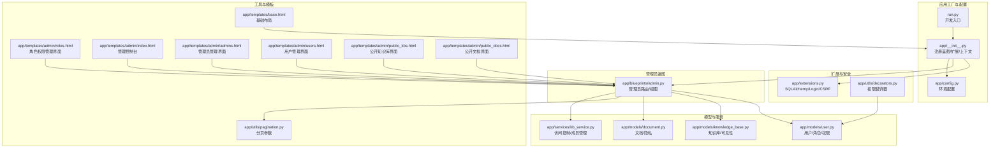
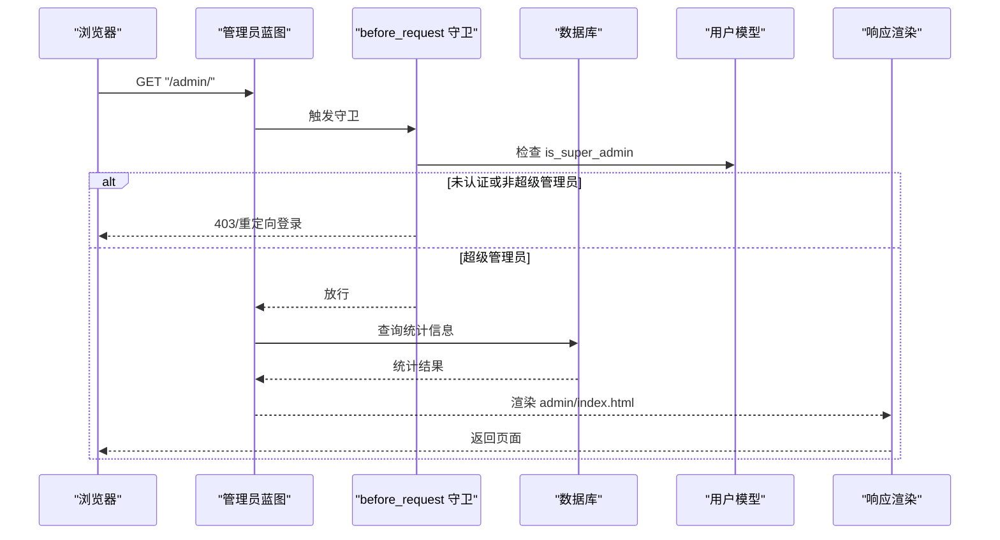
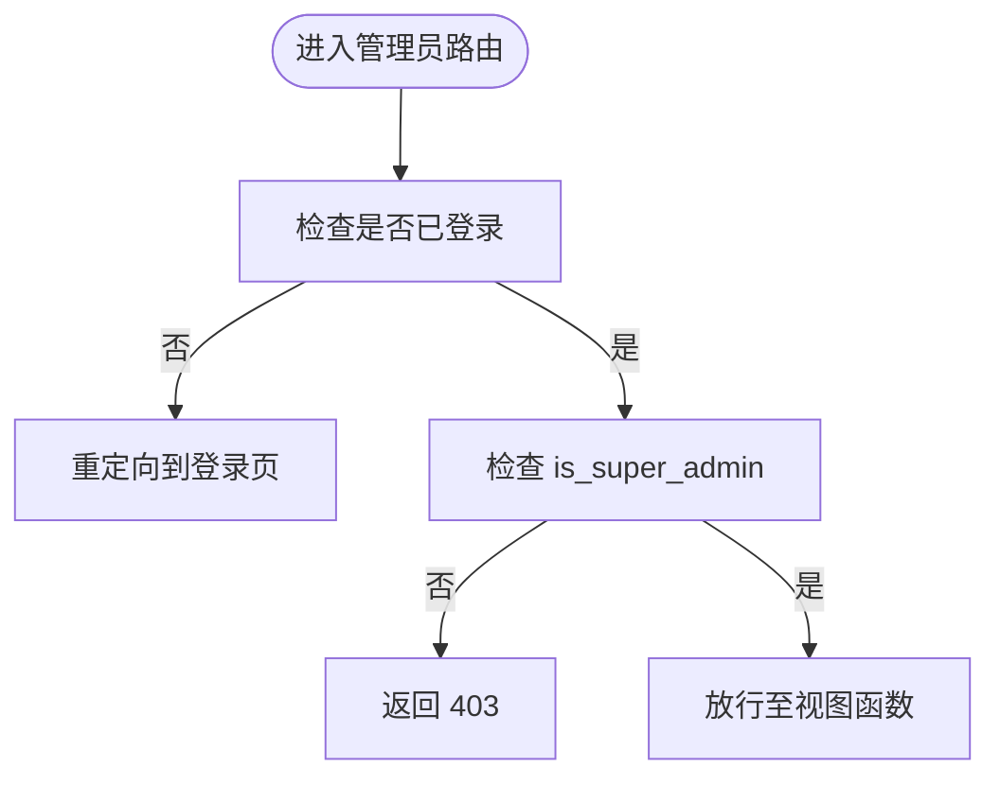
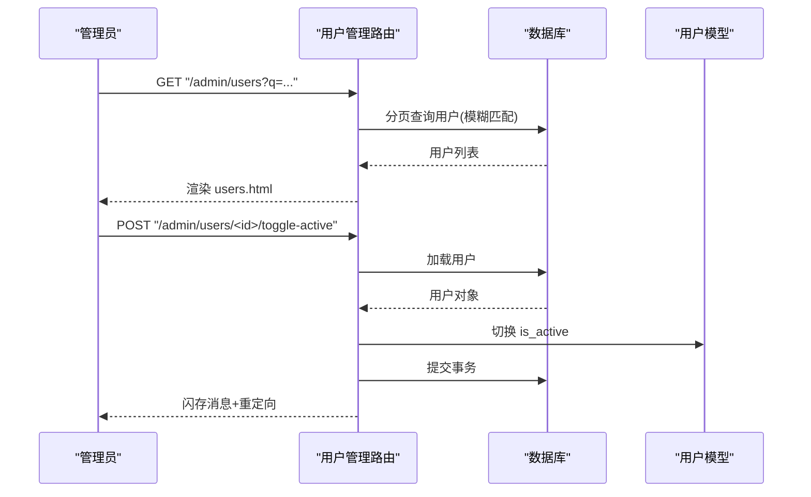
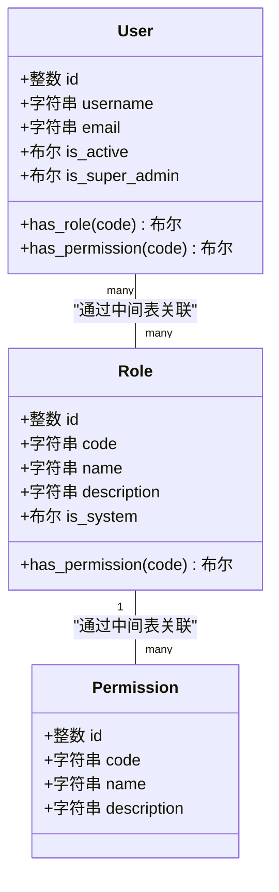
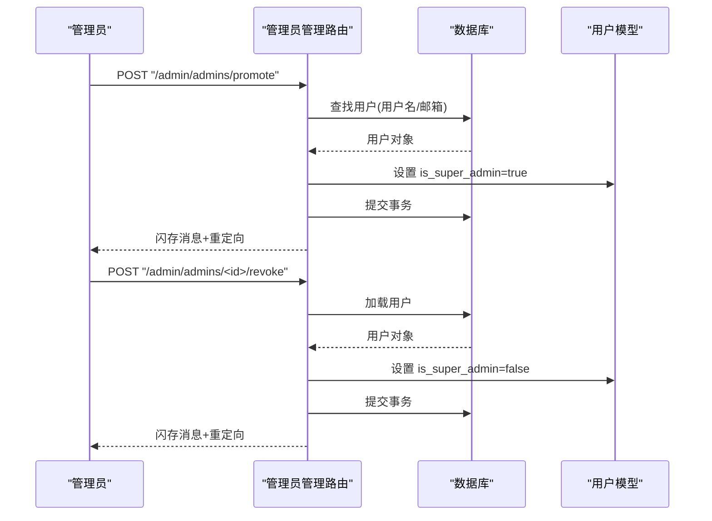
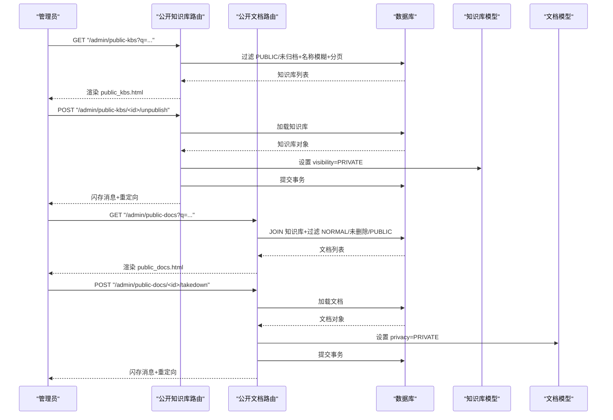
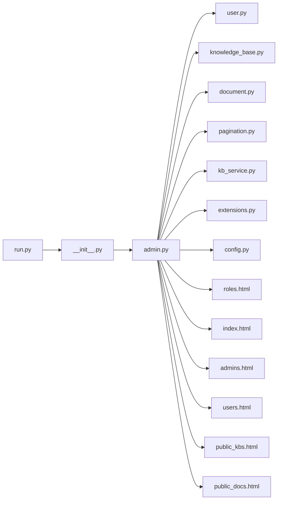

# 管理员蓝图 (Admin Blueprint)

<cite>
**本文引用的文件**
- [app/blueprints/admin.py](file://app/blueprints/admin.py)
- [app/models/user.py](file://app/models/user.py)
- [app/models/knowledge_base.py](file://app/models/knowledge_base.py)
- [app/models/document.py](file://app/models/document.py)
- [app/services/kb_service.py](file://app/services/kb_service.py)
- [app/utils/decorators.py](file://app/utils/decorators.py)
- [app/utils/pagination.py](file://app/utils/pagination.py)
- [app/extensions.py](file://app/extensions.py)
- [app/config.py](file://app/config.py)
- [app/__init__.py](file://app/__init__.py)
- [app/templates/base.html](file://app/templates/base.html)
- [app/templates/admin/roles.html](file://app/templates/admin/roles.html)
- [app/templates/admin/index.html](file://app/templates/admin/index.html)
- [app/templates/admin/admins.html](file://app/templates/admin/admins.html)
- [app/templates/admin/users.html](file://app/templates/admin/users.html)
- [app/templates/admin/public_kbs.html](file://app/templates/admin/public_kbs.html)
- [app/templates/admin/public_docs.html](file://app/templates/admin/public_docs.html)
- [run.py](file://run.py)
</cite>

## 目录
1. [简介](#简介)
2. [项目结构](#项目结构)
3. [核心组件](#核心组件)
4. [架构总览](#架构总览)
5. [详细组件分析](#详细组件分析)
6. [依赖分析](#依赖分析)
7. [性能考虑](#性能考虑)
8. [故障排查指南](#故障排查指南)
9. [结论](#结论)
10. [附录](#附录)

## 简介
本文件为"管理员蓝图"提供全面的管理文档，覆盖系统管理功能的实现与使用，包括用户管理、知识库审核、系统配置与日志监控等。文档重点解释管理员权限验证机制、批量操作与系统维护能力，并给出后台管理界面设计思路、数据统计与报表生成建议、管理员 API 接口与管理工具使用指南。内容面向技术与非技术读者，力求清晰易懂。

**更新摘要**
本次更新基于 Applied Changes：管理员蓝图角色和权限管理功能重大增强，包括新增角色编辑功能(edit_role)、权限创建和删除(new_permission/delete_permission)、改进的前端交互界面等。

## 项目结构
管理员蓝图位于应用的蓝本模块中，采用按功能分层的组织方式：
- 蓝本层：集中于 app/blueprints/admin.py，定义管理员路由与视图逻辑
- 模型层：用户、角色、权限、知识库、文档等模型定义于 app/models
- 服务层：知识库访问控制与成员管理等业务逻辑位于 app/services
- 工具层：装饰器与分页辅助函数位于 app/utils
- 配置与启动：应用工厂、扩展初始化、环境配置位于 app/__init__.py、app/config.py、run.py
- 模板与前端：基础布局与组件位于 app/templates

**图表来源**
- [app/__init__.py:56-74](file://app/__init__.py#L56-L74)
- [app/blueprints/admin.py:12-33](file://app/blueprints/admin.py#L12-L33)
- [app/models/user.py:55-104](file://app/models/user.py#L55-L104)
- [app/models/knowledge_base.py:19-62](file://app/models/knowledge_base.py#L19-L62)
- [app/models/document.py:20-98](file://app/models/document.py#L20-L98)
- [app/services/kb_service.py:10-80](file://app/services/kb_service.py#L10-L80)
- [app/utils/decorators.py:8-33](file://app/utils/decorators.py#L8-L33)
- [app/utils/pagination.py:5-10](file://app/utils/pagination.py#L5-L10)
- [app/templates/base.html:15-28](file://app/templates/base.html#L15-L28)
- [app/templates/admin/roles.html:1-173](file://app/templates/admin/roles.html#L1-173)
- [app/templates/admin/index.html:1-36](file://app/templates/admin/index.html#L1-36)
- [app/templates/admin/admins.html:1-37](file://app/templates/admin/admins.html#L1-37)
- [app/templates/admin/users.html:1-62](file://app/templates/admin/users.html#L1-62)
- [app/templates/admin/public_kbs.html:1-49](file://app/templates/admin/public_kbs.html#L1-49)
- [app/templates/admin/public_docs.html:1-50](file://app/templates/admin/public_docs.html#L1-50)

**章节来源**
- [app/__init__.py:11-28](file://app/__init__.py#L11-L28)
- [app/config.py:15-83](file://app/config.py#L15-L83)
- [run.py:1-17](file://run.py#L1-L17)

## 核心组件
- 管理员蓝图：集中处理管理员首页、用户管理、角色权限、管理员列表、公开知识库与文档审核等
- 权限模型：基于用户-角色-权限的 RBAC，支持超级管理员豁免与细粒度权限检查
- 访问控制服务：封装知识库可见性与成员访问策略，供前台与后台共同使用
- 分页与装饰器：统一的分页参数解析与权限装饰器，保障后台列表与操作的安全性
- 应用工厂与扩展：集中注册蓝图、扩展与错误处理器，确保一致的运行时行为

**章节来源**
- [app/blueprints/admin.py:15-33](file://app/blueprints/admin.py#L15-L33)
- [app/models/user.py:22-104](file://app/models/user.py#L22-L104)
- [app/services/kb_service.py:10-46](file://app/services/kb_service.py#L10-L46)
- [app/utils/pagination.py:5-10](file://app/utils/pagination.py#L5-L10)
- [app/utils/decorators.py:8-33](file://app/utils/decorators.py#L8-L33)
- [app/__init__.py:39-54](file://app/__init__.py#L39-L54)

## 架构总览
管理员蓝图通过 before_request 实现全局守卫，确保仅超级管理员可访问。视图函数围绕用户、角色权限、管理员自身、公开知识库与文档进行管理操作；服务层提供知识库访问控制策略；工具层提供分页与权限装饰器；应用工厂负责扩展与蓝图注册。

**图表来源**
- [app/blueprints/admin.py:15-33](file://app/blueprints/admin.py#L15-L33)
- [app/models/user.py:58-70](file://app/models/user.py#L58-L70)

## 详细组件分析

### 权限验证与守卫
- 全局守卫：在管理员蓝图的所有请求前执行，若未登录则重定向到登录页，若非超级管理员则返回 403
- 装饰器补充：提供 super_admin_required 与 permission_required 装饰器，便于在需要时对单个视图进行权限保护
- 用户模型：支持 is_super_admin 字段与 has_permission 方法，后者优先判断超级管理员，否则遍历角色权限

**图表来源**
- [app/blueprints/admin.py:15-21](file://app/blueprints/admin.py#L15-L21)
- [app/utils/decorators.py:8-18](file://app/utils/decorators.py#L8-L18)
- [app/models/user.py:90-96](file://app/models/user.py#L90-L96)

**章节来源**
- [app/blueprints/admin.py:15-21](file://app/blueprints/admin.py#L15-L21)
- [app/utils/decorators.py:8-33](file://app/utils/decorators.py#L8-L33)
- [app/models/user.py:55-104](file://app/models/user.py#L55-L104)

### 用户管理
- 列表与搜索：支持按用户名/邮箱模糊搜索，分页展示用户列表
- 激活状态切换：POST 接口切换用户 is_active，禁止对自己执行此操作
- 密码重置：POST 接口重置指定用户密码，默认值由后端设定
- 角色分配：POST 接口批量更新用户的角色集合

**图表来源**
- [app/blueprints/admin.py:38-61](file://app/blueprints/admin.py#L38-L61)
- [app/utils/pagination.py:5-10](file://app/utils/pagination.py#L5-L10)

**章节来源**
- [app/blueprints/admin.py:38-85](file://app/blueprints/admin.py#L38-L85)
- [app/utils/pagination.py:5-10](file://app/utils/pagination.py#L5-L10)

### 角色与权限管理
**更新** 新增了完整的角色编辑功能和权限管理功能，包括角色基本信息编辑、权限创建删除等。

- 新增角色：POST 表单提交 code/name/description，若 code 唯一则创建新角色
- 更新角色权限：POST 选择多个权限 ID，批量更新角色权限集合
- 删除角色：POST 删除非系统角色，内置角色不可删除
- **新增角色编辑**：POST 接口编辑角色基本信息（名称和描述），内置角色不可修改
- **新增权限管理**：POST 接口创建新权限项，支持删除权限项
- 角色模型：支持 is_system 字段标识内置角色，权限通过中间表关联

**图表来源**
- [app/models/user.py:22-104](file://app/models/user.py#L22-L104)

**章节来源**
- [app/blueprints/admin.py:90-179](file://app/blueprints/admin.py#L90-L179)
- [app/models/user.py:22-53](file://app/models/user.py#L22-L53)
- [app/templates/admin/roles.html:1-173](file://app/templates/admin/roles.html#L1-173)

### 管理员自身管理
- 管理员列表：查询所有 is_super_admin=True 的用户
- 提升管理员：POST 将普通用户提升为超级管理员
- 撤销管理员：POST 将指定用户降级，禁止对自己执行

**图表来源**
- [app/blueprints/admin.py:181-214](file://app/blueprints/admin.py#L181-L214)

**章节来源**
- [app/blueprints/admin.py:181-214](file://app/blueprints/admin.py#L181-L214)
- [app/templates/admin/admins.html:1-37](file://app/templates/admin/admins.html#L1-37)

### 公开知识库与文档审核
- 公开知识库列表：筛选 visibility=PUBLIC 且未归档，支持名称模糊搜索，按更新时间倒序分页
- 下架知识库：将 PUBLIC 知识库改为 PRIVATE
- 公开文档列表：联合知识库过滤，仅显示 NORMAL 隐私且 PUBLIC 知识库中的文档
- 下架文档：将 NORMAL 文档改为 PRIVATE

**图表来源**
- [app/blueprints/admin.py:216-264](file://app/blueprints/admin.py#L216-L264)
- [app/models/knowledge_base.py:8-42](file://app/models/knowledge_base.py#L8-L42)
- [app/models/document.py:15-53](file://app/models/document.py#L15-L53)

**章节来源**
- [app/blueprints/admin.py:216-264](file://app/blueprints/admin.py#L216-L264)
- [app/models/knowledge_base.py:19-62](file://app/models/knowledge_base.py#L19-L62)
- [app/models/document.py:20-98](file://app/models/document.py#L20-L98)
- [app/templates/admin/public_kbs.html:1-49](file://app/templates/admin/public_kbs.html#L1-49)
- [app/templates/admin/public_docs.html:1-50](file://app/templates/admin/public_docs.html#L1-50)

### 后台管理界面设计与数据统计
**更新** 界面设计得到显著改进，提供了更加直观和用户友好的管理界面。

- 布局与导航：基于基础模板，统一引入样式与脚本，提供导航栏、主内容区与页脚
- 管理首页：聚合用户总数、知识库数量、公开知识库数量、文档数量、管理员数量等指标
- 列表与分页：用户、角色、管理员、公开知识库、公开文档均采用分页与搜索增强体验
- **新增角色权限管理界面**：提供双栏布局，左侧角色管理，右侧权限项管理，支持展开式操作面板
- **改进的交互反馈**：通过闪存消息提示操作结果，结合重定向避免重复提交
- **现代化界面设计**：使用 Tailwind CSS 类名，提供卡片式布局、响应式设计和交互动画

**章节来源**
- [app/templates/base.html:15-28](file://app/templates/base.html#L15-L28)
- [app/blueprints/admin.py:24-33](file://app/blueprints/admin.py#L24-L33)
- [app/utils/pagination.py:5-10](file://app/utils/pagination.py#L5-L10)
- [app/templates/admin/roles.html:1-173](file://app/templates/admin/roles.html#L1-173)
- [app/templates/admin/index.html:1-36](file://app/templates/admin/index.html#L1-36)

### 系统配置与日志监控
- 配置项：数据库连接、会话 Cookie、上传目录、AI 服务参数、分页默认大小等
- 开发与生产：通过环境变量选择配置，开发模式启用调试
- 错误处理：统一 403/404/500 页面，便于运维与用户感知
- 日志监控：建议结合 Web 服务器与应用日志记录访问与异常，配合数据库慢查询与错误日志定位问题

**章节来源**
- [app/config.py:15-83](file://app/config.py#L15-L83)
- [app/__init__.py:76-87](file://app/__init__.py#L76-L87)
- [run.py:1-17](file://run.py#L1-L17)

### 管理员 API 接口与管理工具使用指南
**更新** 管理员 API 接口得到扩展，新增了角色编辑和权限管理相关接口。

- 管理员 API 接口
  - 获取管理员首页统计
    - 方法与路径：GET /admin/
    - 请求参数：无
    - 响应：渲染 admin/index.html，包含用户数、知识库数、公开知识库数、文档数、管理员数
  - 用户管理
    - 列表与搜索：GET /admin/users?q=关键词&page=页码&size=每页数量
    - 切换激活状态：POST /admin/users/<id>/toggle-active
    - 重置密码：POST /admin/users/<id>/reset-password
    - 分配角色：POST /admin/users/<id>/roles
  - **角色与权限管理**
    - 角色管理：GET/POST /admin/roles（GET：获取角色列表，POST：新增角色）
    - 更新角色权限：POST /admin/roles/<id>/permissions
    - 删除角色：POST /admin/roles/<id>/delete
    - **新增角色编辑**：POST /admin/roles/<id>/edit
    - **新增权限管理**：POST /admin/permissions（新增权限），POST /admin/permissions/<id>/delete（删除权限）
  - 管理员自身
    - 提升管理员：POST /admin/admins/promote（表单字段：user=用户名或邮箱）
    - 撤销管理员：POST /admin/admins/<id>/revoke
  - 公开知识库与文档
    - 公开知识库列表：GET /admin/public-kbs?q=关键词
    - 下架知识库：POST /admin/public-kbs/<id>/unpublish
    - 公开文档列表：GET /admin/public-docs?q=关键词
    - 下架文档：POST /admin/public-docs/<id>/takedown
- 管理工具使用
  - 登录与权限：通过 /auth/login 登录，仅超级管理员可访问 /admin
  - 批量操作：角色分配与权限更新支持多选；分页与搜索提升批量效率
  - **角色权限管理**：通过角色权限管理界面，支持角色基本信息编辑、权限分配和权限项管理
  - 数据导出：建议在现有列表基础上扩展 CSV/Excel 导出（当前未实现，可作为后续增强）

**章节来源**
- [app/blueprints/admin.py:24-264](file://app/blueprints/admin.py#L24-L264)
- [app/utils/pagination.py:5-10](file://app/utils/pagination.py#L5-L10)
- [app/templates/admin/roles.html:1-173](file://app/templates/admin/roles.html#L1-173)

## 依赖分析
- 蓝本与模型：管理员蓝图依赖用户、角色、权限、知识库、文档模型与分页工具
- 访问控制：知识库服务提供 can_access/can_edit/can_manage 等策略，供前台与后台复用
- 安全扩展：CSRF 保护与登录管理由扩展模块统一注入
- 应用注册：应用工厂集中注册蓝图与扩展，保证生命周期一致性

**图表来源**
- [app/blueprints/admin.py:5-10](file://app/blueprints/admin.py#L5-L10)
- [app/__init__.py:56-74](file://app/__init__.py#L56-L74)
- [run.py:9](file://run.py#L9)

**章节来源**
- [app/blueprints/admin.py:1-22](file://app/blueprints/admin.py#L1-L22)
- [app/__init__.py:39-54](file://app/__init__.py#L39-L54)

## 性能考虑
- 分页与索引：列表查询使用分页与索引列（如 is_archived、visibility、privacy），避免全表扫描
- 关联查询：公开文档列表使用 JOIN 知识库过滤，减少二次查询
- 缓存与会话：建议在高并发场景引入缓存（如 Redis）存储热点统计与用户会话
- 数据库连接池：配置 pool_pre_ping 与 pool_recycle，提升连接稳定性
- 前端资源：基础模板统一加载静态资源，建议开启压缩与 CDN 加速

## 故障排查指南
- 403 未授权：确认当前用户 is_super_admin=True，或使用正确账户登录
- 404 资源不存在：检查资源 ID 是否有效，确认记录未被删除或归档
- CSRF 校验失败：确保表单包含 CSRF Token，或在测试环境禁用 CSRF（仅测试）
- 登录跳转循环：检查 next 参数与登录视图配置，确保登录成功后重定向到预期页面
- 数据不一致：涉及批量更新（角色/权限/状态）时，检查事务提交与回滚逻辑
- **角色权限问题**：检查角色 code 的唯一性，确认权限项是否存在，验证角色是否为内置角色

**章节来源**
- [app/blueprints/admin.py:15-21](file://app/blueprints/admin.py#L15-L21)
- [app/__init__.py:76-87](file://app/__init__.py#L76-L87)
- [app/extensions.py:8-17](file://app/extensions.py#L8-L17)

## 结论
管理员蓝图以清晰的权限守卫与完善的管理功能为核心，覆盖用户、角色权限、管理员自身、公开知识库与文档的全链路管理。通过统一的分页与装饰器、可复用的访问控制服务以及规范的应用工厂与配置体系，系统具备良好的可维护性与扩展性。

**更新总结** 本次重大增强包括：
- 新增完整角色编辑功能，支持角色基本信息修改和权限分配
- 新增权限创建和删除功能，提供灵活的权限管理能力
- 改进的前端交互界面，提供更加直观的管理体验
- 增强的 RBAC 系统，支持更细粒度的权限控制

建议后续增强报表导出、审计日志与更丰富的批量操作能力，以满足更高阶的管理需求。

## 附录
- 快速开始
  - 开发运行：设置环境变量后执行 python run.py，访问 http://localhost:5000/admin
  - 登录账户：使用已存在的管理员账户登录
- 最佳实践
  - 使用超级管理员专用账户，避免在生产环境频繁变更管理员权限
  - 对敏感操作（撤销管理员、下架知识库/文档）增加二次确认与审计日志
  - 定期备份数据库与上传目录，确保可恢复性
  - **角色权限管理最佳实践**：合理设计角色层级，避免权限过度分散；定期审查权限分配；使用内置角色标识系统关键角色